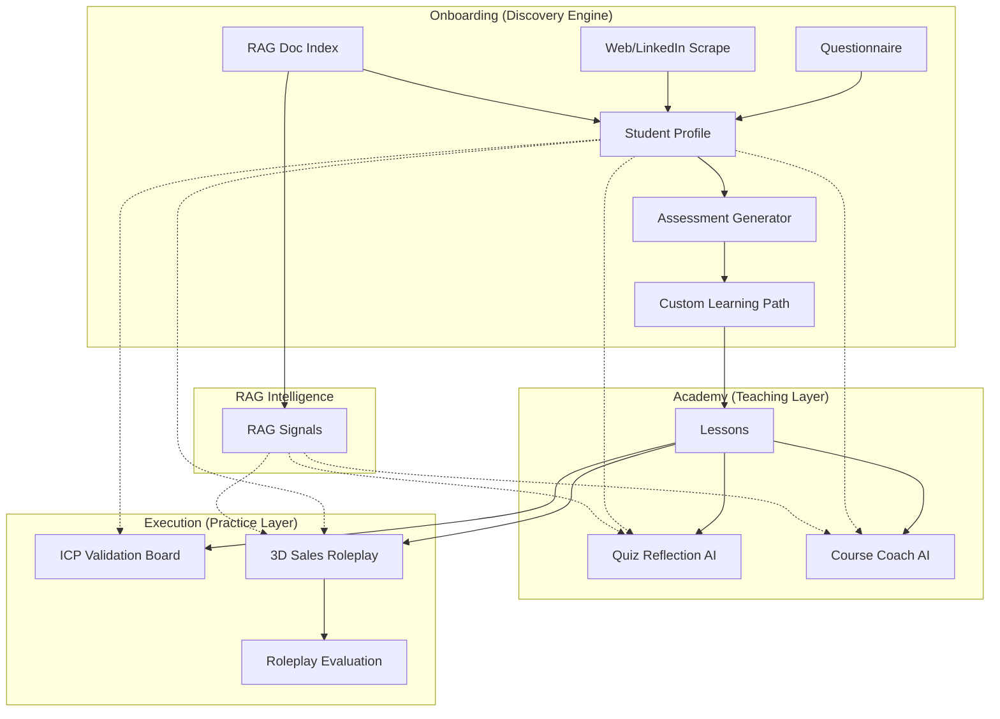

# Solo Frame Hub: AI System Architecture

## 1. The AI-First Philosophy
Solo Frame Hub is built on an **AI-Native** core. Unlike traditional platforms that use AI as a chat overlay, our architecture uses AI to dynamically construct the user's curriculum, evaluate their strategic maturity, and simulate high-stakes sales scenarios.

---

## 2. Onboarding Intelligence (The Discovery Engine)
The onboarding process is a multi-stage data ingestion pipeline designed to build a high-fidelity **Student Profile**.

### Component 1: Strategic Questionnaire
- **Flow**: `questionnaire/page.tsx` → `POST /api/onboarding/questionnaire`
- **Function**: Captures 20 data points across 7 dimensions (Business Context, Revenue State, Founder Archetype, DISC Behavioral Style, Learning Priorities, Capacity, and Goals).
- **Interaction**: Maps the founder into the **3D Matrix** (Founder Type x Market Context x Behavioral Style).

### Component 2: External Discovery (Scraping)
- **Flows**: `websiteAnalyzer`, `linkedinAnalyzer`
- **Function**: Deep-crawls the founder's LinkedIn profile and business URL.
- **Interaction**: Extracts narrative authority, positioning signals, and "About Me" descriptors that the founder might not have consciously stated.

### Component 3: RAG Ingest & Indexing
- **Flows**: `documentAnalyzer`, `ragIndexer`
- **Function**: Processes uploaded PDFs/MD/TXT files.
- **RAG Implementation**: Chunks content and extracts "high-density signals" regarding ICP clarity and value proposition maturity. 
- **Interaction**: Aggregates insights across multiple files to find inconsistencies or buried differentiators.

### Component 4: Assessment Generator
- **Flow**: `assessmentGenerator`
- **Function**: The "Brain" of onboarding. It unifies all inputs (Questionnaire + Scrapes + RAG) into a comprehensive GTM report.
- **Interaction**: Generates a 0-100 readiness score, identifies 3 "Quick Wins", 3 "Critical Gaps", and prescribes a custom 90-day learning path.

---

## 3. Educational AI (The Teaching Layer)
Once onboarding is complete, the AI acts as a 24/7 personal sales coach inside the curriculum.

### Component 5: Quiz Reflection AI (RAG-Enhanced)
- **Flow**: `quizReflection`
- **Function**: Evaluates "Test What You Learned" reflection questions.
- **Interaction**: Instead of multiple-choice, users write out their thoughts. The AI scores the reflection (0-100) and provides rigorous feedback based on their specific business context **and RAG signals**. For example, it can detect if a user's pricing reflection contradicts the "Unit Economics" document they uploaded during onboarding.

### Component 6: Course Assistant (Elite Coach)
- **Flow**: `coachingChat`
- **Function**: A context-aware chatbot available on every lesson page.
- **Interaction**: Injects the student's profile into the prompt. It knows their revenue goal, their current course, and their biggest challenges, allowing for hyper-relevant Q&A (e.g., "How does this lesson on pricing apply to my coaching business for HR managers?").

---

## 4. Application AI (The Practice Layer)
The "Execution Workspace" uses AI to simulate the real world.

### Component 7: ICP Validation Board
- **Flow**: `icpValidation`
- **Function**: Simulates a board of "Skeptical Buyer Personas" (based on DISC profiles).
- **Interaction**: The user inputs their target audience. The "Board" (AI personas like "Technical Terry" or "Decision-Maker Dana") provides brutal, honest feedback on why they wouldn't buy or what's missing in the pitch.

### Component 8: 3D Matrix Sales Roleplay (RAG-Aware)
- **Flows**: `salesRoleplay3D`, `salesRoleplayEval3D`
- **Function**: A high-fidelity simulator where users practice pitching to a Prospect.
- **Interaction**: 
  - **The Sim**: The AI assumes a specific DISC persona and business scenario. It is "RAG-Aware," meaning the Prospect might reference specific technical details or case studies mentioned in the founder's uploaded RAG documents.
  - **The Eval**: The transcript is analyzed against the documented context to ensure the founder stayed on-message and used their unique differentiators.

---

## 5. System Interaction Diagram

---

## 6. Technical Stack
- **Orchestration**: Genkit AI
- **Models**: Gemini 2.0 Flash / Pro
- **Storage**: Firestore (Profiles), Firebase Storage (Documents)
### Component 9: Context Injection Engine
- **Service**: `profileService` / `roleplayService`
- **Function**: Bridges the gap between flat Firestore records and the Genkit LLM prompts. 
- **Interaction**: It automatically pulls the `inferred.ragSignals` from the user's `FounderProfile` and injects them into the system prompt of any active flow. This ensures that every AI component (from the coach to the prospect) is operating from the same source of truth—the documents you uploaded.
