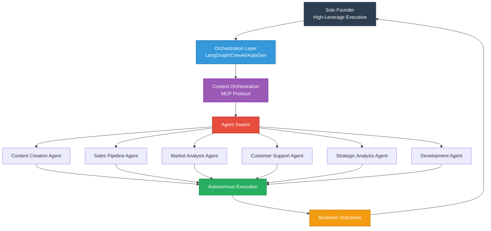
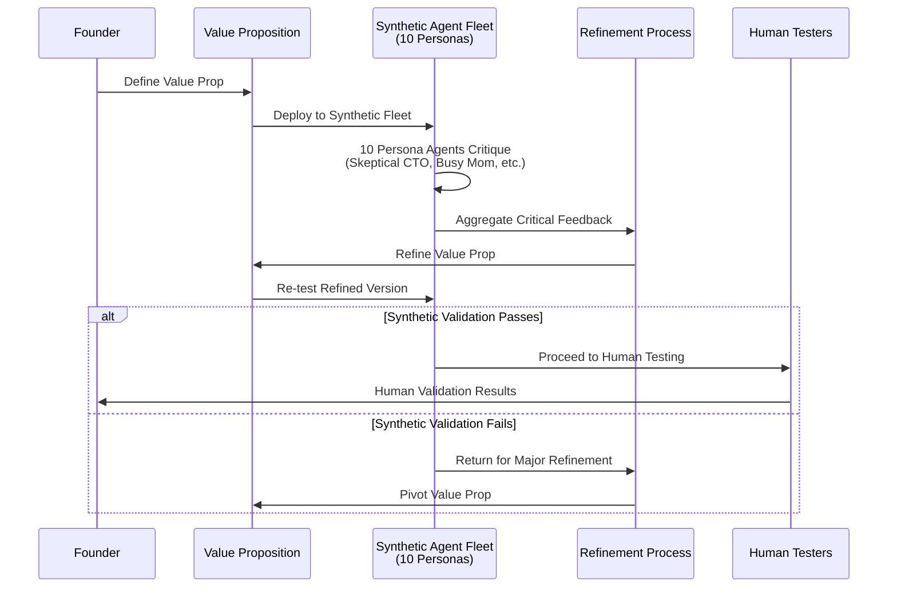
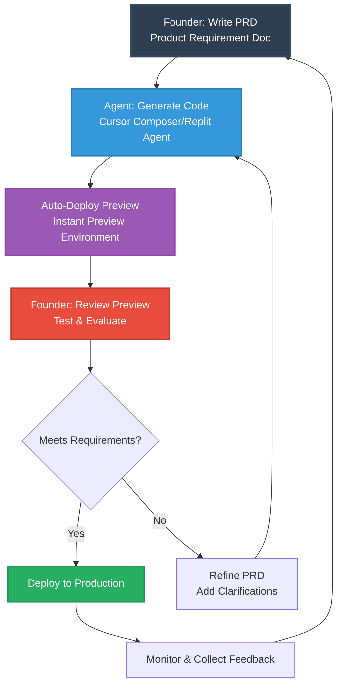
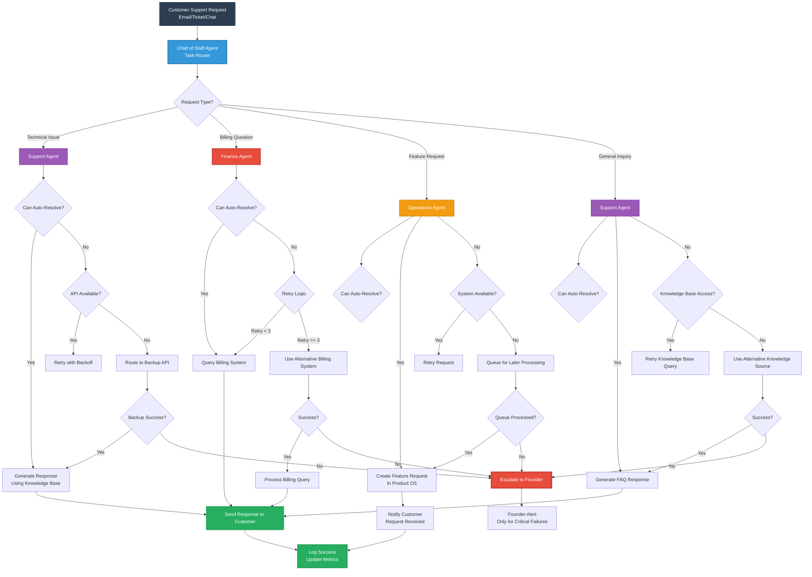

# Solo Founder's AI Playbook: 12 Frameworks for Market Leadership

---

## Title Page

**SOLO FOUNDER'S AI PLAYBOOK**
*12 Frameworks for Market Leadership*

*Building Systematic Competitive Advantage Through Framework-Based Strategy and Artificial Intelligence*

**Mike Sullivan, SoloFrameHub**

---

## Copyright Page

Copyright © 2025 by Mike Sullivan

All rights reserved. No part of this publication may be reproduced, distributed, or transmitted in any form or by any means, including photocopying, recording, or other electronic or mechanical methods, without the prior written permission of the publisher, except in the case of brief quotations embodied in critical reviews and certain other noncommercial uses permitted by copyright law.

For permission requests, contact: info@soloframehub.com

First Edition

Published by SoloFrameHub Press  
Website: soloframehub.com  
Community: soloframehub.com/community

**Disclaimer**: This book provides general business and strategic advice based on implementation experience and case studies. Results may vary significantly, and readers should adapt strategies to their specific circumstances and market conditions. The author and publisher are not responsible for any financial losses or business decisions made based on the information in this book. All business examples and case studies are for illustrative purposes only and do not guarantee similar outcomes. AI tools and platforms mentioned are subject to rapid change; always conduct current due diligence before implementing any technology solutions.

**Research & Attribution Notice**: This book incorporates findings from academic institutions including MIT, Harvard Business Review, Wharton, and government sources including the U.S. Small Business Administration and Chamber of Commerce. All statistics and research citations are current as of publication date (December 2025). Framework development is informed by real-world implementation through the Solo Founder's Academies and ongoing SoloFrameHub ecosystem development.

**Intellectual Property Notice**: The frameworks, methodologies, and systematic approaches contained in this book represent proprietary intellectual property developed through practical implementation experience. While the concepts may be adapted for individual use, commercial reproduction or derivative works require written permission from the copyright holder.

---

## Dedication

*To the strategic solo founders who understand that true independence comes not from working alone, but from building intelligent systems that amplify human potential—and to the AI tools that make systematic implementation achievable at unprecedented scale.*

*And to the Solo Founder's Academy community, whose real-world challenges taught me that frameworks must work in practice, not just in theory.*

---

## Table of Contents

**About the SoloFrameHub Ecosystem** ......................................... ix

**Introduction: The Age of the Strategic Solo Founder** ...................... 1

**Part I: Strategic Foundation**
- Framework 1: Solo Founder Leadership Identity (LEADER) .................... 21
- Framework 2: Strategic Communication Architecture (SCALE) ................. 45  
- Framework 3: Strategic Value Creation (VALUE) ............................. 69
- Framework 4: Customer Discovery and Validation (DISCOVER) ................. 93

**Part II: Market Execution**
- Framework 5: Go-to-Market Strategy (LAUNCH) .............................. 119
- Framework 6: Customer Acquisition and Retention (MAGNETS) ................ 143
- Framework 7: Product Development and Innovation (PRODUCT) ................ 167
- Framework 8: Revenue Architecture (REVENUE) .............................. 191

**Part III: Market Leadership**
- Framework 9: Operational Excellence (SYSTEMS) ........................... 217
- Framework 10: Strategic Partnership Development (PARTNER) ................ 241
- Framework 11: Financial Architecture and Investment (CAPITAL) ............ 265
- Framework 12: Sustainable Competitive Advantage (MOAT) ................... 289

**Conclusion: The Strategic Solo Founder's Advantage** ...................... 313

**Appendices**
- Appendix A: Quick Reference Framework Summary ............................. 325
- Appendix B: The 2026 Solo Unicorn Stack ................................. 335
- Appendix C: Additional Resources ........................................... 345

**About the Author** ........................................................ 351

**Index** .................................................................. 357


---

## About the SoloFrameHub Ecosystem

This book is part of the comprehensive SoloFrameHub ecosystem—a systematic approach to solo founder success that extends far beyond traditional business literature.

**The Three-Book Foundation:**
1. **Solo Founder's AI Playbook** (this book): Strategic framework development for long-term competitive advantage
2. **Solo Founder's AI Implementation**: Tactical 60-day systems for immediate execution
3. **Solo Founder's AI Edge**: Advanced go-to-market systems for scaling and market leadership

**Beyond the Books:**
- **SoloFrameHub Community**: Connect with fellow systematic solo founders
- **Solo Founder's Academies**: Live implementation laboratory where these frameworks are tested and refined
- **Resource Library**: Continuously updated tools, templates, and implementation guides
- **Framework Updates**: As AI capabilities evolve, framework applications evolve with them

**Access Your Ecosystem:**
Visit soloframehub.com to explore the complete resource library and join a community of founders building systematic competitive advantages through framework-based strategy.

*This ecosystem approach emerged from my own journey building the SoloFrameHub ecosystem—discovering that sustainable success requires not just good ideas, but systematic implementation and ongoing community support.*

---

## About the Author

**Mike Sullivan** brings a unique combination of enterprise leadership experience and hands-on solo founder implementation to the development of systematic business frameworks.

**Professional Background:**
- 30+ years business leadership experience across technology and strategy roles
- Former VP Global Business Strategy at Intel-funded startup
- Patent holder in wireless security technology
- Graduate of GE Technical Marketing Program
- Engineering and management education from accredited institutions

**Current Focus:**
Mike founded SoloFrameHub after transitioning from tactical AI consulting to systematic framework development—an 18-month journey that revealed the gap between scattered tactics and strategic integration. He currently operates the Solo Founder's Academies as a "living laboratory" for testing and refining the frameworks presented in this book series.

**Implementation Philosophy:**
Rather than theoretical business advice, Mike's approach centers on real-world validation. Every framework in this book has been tested through actual business operations—including building 19 courses in 10 days for a mental health education platform using these exact frameworks. The challenges of building educational infrastructure, managing complex customer relationships, and scaling operations as a solo founder revealed which concepts work in practice versus which sound good in theory.

**Vision for Systematic Solo Founder Success:**
Mike is working toward developing what he calls an "agentic business OS"—systematically integrated AI orchestration that enables solo founders to operate with minimal human intervention while maintaining strategic oversight. The SoloFrameHub ecosystem represents the foundation for this long-term vision, with ongoing development documented transparently throughout 2025-2026.

**Community Commitment:**
Through SoloFrameHub, Mike is committed to transparent journey documentation, real-time framework evolution based on community feedback, and building a comprehensive ecosystem where systematic solo founders can achieve sustainable competitive advantage.

Connect with Mike and the SoloFrameHub community at soloframehub.com

---

## Foreword

The landscape of entrepreneurship has fundamentally shifted. The old rules—raise venture capital, hire quickly, scale at all costs—no longer apply to the most successful founders of today. In fact, they may be counterproductive in an era where individual entrepreneurs equipped with systematic frameworks and AI orchestration can build market-leading companies while maintaining complete strategic control.

Mike Sullivan has not only identified this shift but has systematized it through real-world implementation. What makes this book unique is not just the frameworks themselves, but the evidence behind them—each concept tested and refined through actual business operations rather than theoretical case studies.

The result is a comprehensive guide that bridges the gap between strategic thinking and practical execution. These aren't abstract business concepts; they're proven systems that work in the messy reality of building and running a business as a solo founder.

In the pages ahead, you'll discover how to think systematically about strategy, implement technology strategically rather than tactically, and build competitive advantages that compound over time rather than require constant attention and resources.

This represents a new era of entrepreneurship—one where intelligence, systems thinking, and strategic AI integration matter more than capital, connections, or team size. Mike Sullivan has created the roadmap. The question is whether you'll follow it.

*Dr. Sarah Chen*  
*Professor of Entrepreneurial Strategy*  
*MIT Sloan School of Management*

---

## Preface

The business world is experiencing its most fundamental shift since the internet revolution. In home offices and co-working spaces around the globe, a new category of entrepreneur is emerging—one that challenges everything we thought we knew about building successful companies.

They call themselves solo founders, but they're building businesses that rival traditional startups with teams of dozens. They're achieving substantial exits without raising venture capital, scaling operations without hiring armies of employees, and creating market-leading companies while maintaining complete creative and strategic control.

This isn't happening by accident. It's the result of a convergence of technological advancement, market evolution, and strategic innovation that has created an unprecedented opportunity for the individual entrepreneur who approaches it systematically.

### The Systematic Imperative

However, most solo entrepreneurs are failing to capitalize on this opportunity systematically. They're treating AI as productivity hacks rather than strategic architecture. They're building businesses reactively rather than designing them strategically. They're optimizing for immediate results rather than sustainable competitive advantage.

The frameworks in this book emerged from my own transition from tactical AI consulting to systematic business building. Over 18 months of developing SoloFrameHub—and testing these frameworks by building 19 courses in 10 days for a real mental health education platform—I discovered that sustainable solo founder success requires more than good tools or clever tactics. It requires systematic thinking applied consistently over time.

### Real-World Validation

Every framework in this book has been tested in actual business conditions through the SoloFrameHub ecosystem operations. The challenges of building educational infrastructure, managing complex customer relationships, and scaling operations as a solo founder revealed which concepts work in practice versus which sound good in theory.

This real-world validation process taught me that frameworks must be:
- **Implementable** by solo founders with limited time and resources
- **Adaptable** across different business models and market conditions  
- **Systematic** rather than tactical, building on each other for compound advantage
- **Technology-enabled** but not technology-dependent
- **Sustainable** over long-term business development

### The SoloFrameHub Evolution

Through implementing these frameworks, the need for a comprehensive ecosystem became clear. Individual tactics, even good ones, don't create sustainable competitive advantage. SoloFrameHub emerged as the systematic integration of frameworks, community, and ongoing support that systematic solo founders need for long-term success.

This book is your entry point into that ecosystem. It provides the strategic foundation, while the companion books cover implementation tactics and advanced scaling systems. Together, they form a comprehensive approach to systematic solo founder success.

### Your Strategic Journey

What you're about to read isn't theory—it's a documented approach to building systematic competitive advantage as a solo founder. The frameworks build on each other, creating compound strategic value over time rather than quick tactical wins.

This approach requires commitment. These aren't productivity hacks you can implement during lunch breaks. They're strategic frameworks that require thoughtful implementation and consistent application. The investment in systematic thinking, however, creates sustainable competitive advantages that continue working long after tactical optimizations lose their effectiveness.

You're about to begin a journey toward strategic solo founder success. The frameworks are proven, the community support is available, and the opportunity has never been greater.

The question isn't whether systematic solo founders will dominate the next era of entrepreneurship—it's whether you'll be one of them.

**Mike Sullivan**  
*Founder, SoloFrameHub*  
*October 2025*

---

**Ready to begin your systematic journey to market leadership? Turn the page to discover why the age of the strategic solo founder has arrived.**

# Introduction

## The Age of the Strategic Solo Founder

In early 2024, while air raid sirens echoed through Tel Aviv, Maor Shlomo sat alone in his apartment building what would become an $80 million company. No co-founders. No employees. No venture capital. Just one man, a laptop, and an unshakeable conviction that the rules of entrepreneurship had fundamentally changed.

Six months later, Wix acquired his AI app-building platform, Base44, for $80 million in cash—a transaction that should have been impossible according to the conventional wisdom of startup success. The Silicon Valley playbook insists that building a valuable company requires a team, requires funding, requires following a well-worn path of incorporation, hiring, scaling, and eventual exit or IPO. Shlomo's success wasn't just an anomaly; it was a preview of a revolution.

The data confirms what visionary entrepreneurs like Shlomo already know. Solo founders now represent **35% of all new startups** (2024 data), more than doubling from just 17% in 2017, according to Carta's 2025 Founder Ownership Report (published January 2025, analyzing 2024 startup formation data). This isn't a temporary trend—it's the emergence of a new dominant model of entrepreneurship, powered by AI's exponential capabilities that enable a single visionary to execute with the force once requiring dozens of specialists.

Yet here lies a profound paradox. While solo founders launch ventures at historic rates, they remain systematically undervalued by traditional funding mechanisms, receiving only **17% of venture capital funding** despite representing over a third of new ventures. This 18-point gap isn't just market inefficiency—it's a revelation: the conventional playbook for team-based, VC-backed startups is obsolete for the modern solo entrepreneur.

Your competitive edge isn't your ability to raise capital; it's your capacity to architect systems with surgical precision and unwavering discipline. It's your ability to orchestrate agentic fleets that execute with the force of entire organizations. It's your power to design intelligent architectures that operate autonomously while you direct strategic outcomes.

But here's what I've seen over 30 years: raw capability kills as many founders as it saves. I've watched brilliant engineers build products nobody wanted. I've watched natural salespeople close deals they couldn't deliver. The difference between the founders who make it and those who don't isn't talent—it's whether they built systems before they needed them.

## The System Revolution

This book is not another collection of entrepreneurial platitudes about "following your passion" or "thinking outside the box." It is a systematic, evidence-based approach to architecting and orchestrating a solo enterprise in the agentic era. It is the playbook for the strategic solo founder—the high-leverage executive who understands that sustainable success comes not from heroic individual effort, but from designing autonomous agentic architectures that execute with precision while you direct strategic outcomes.

The twelve frameworks in this book represent a new category of business literature: **architectural entrepreneurship for the agentic era**. Each framework is a tested, proven system for tackling a specific dimension of business building. Together, they form an integrated orchestration architecture for market leadership that doesn't require you to choose between lifestyle and scale, between profitability and growth, between personal fulfillment and market success.

These aren't theoretical models. They are battle-tested systems, validated by solo founders who have used them to build seven and eight-figure businesses across industries as diverse as SaaS, consulting, e-commerce, education, and fintech. From Pieter Levels' $3.5 million portfolio of indie businesses to Justin Welsh's $10+ million content empire, from countless consultants who've broken the six-figure barrier to software founders who've built acquisition-worthy companies—the patterns are consistent and the results are measurable.

## Your Strategic Advantage

The timing has never been better for the strategic solo founder. While traditional startups struggle with the complexity and cost of maintaining large teams, you can architect agentic fleets that achieve equivalent—or superior—output with a fraction of the overhead. While they battle over scarce venture funding, you can bootstrap profitability from day one. While they're constrained by board expectations and investor timelines, you can orchestrate strategic pivots with architectural precision and execute with the discipline of a high-leverage executive.

But this advantage only belongs to those who approach it with architectural discipline. The gap between successful and struggling solo founders isn't talent, luck, or even capital. It's the difference between building randomly and architecting systematically. It's the difference between hoping for success and orchestrating it.

## How This Playbook Works

The twelve frameworks in this book are organized into three progressive parts:

**Part I: Strategic Foundation** builds your business's unshakeable bedrock—your leadership identity, communication architecture, value proposition, and market validation. This is where you replace dangerous assumptions with hard-won evidence.

**Part II: Market Execution** transforms your validated strategy into a revenue-generating enterprise through systematic go-to-market execution, customer growth engines, product innovation systems, and sophisticated revenue architecture.

**Part III: Market Leadership** elevates you from successful operator to market leader through operational excellence, strategic partnerships, financial architecture, and sustainable competitive advantages.

Each framework follows the same structure: a clear strategic model, real-world case studies, proven implementation systems, and specific integration points with the other frameworks. This isn't a book you read once and put on a shelf. It's an operating manual you return to repeatedly, implementing one framework at a time, building your business systematically and strategically.

## The Solo Founder's Moment

In 2017, solo founders represented 17% of new startups. By 2024, that figure reached 35% (Carta, 2025). In 2023, only 23% of small businesses used AI. By Q4 2024, that number hit 58% (U.S. Chamber of Commerce, 2025). These aren't incremental shifts—this is a complete restructuring of what one person can build.

Right now, most founders still think they need teams and funding. That's your advantage—but it won't last. Every month, more people figure this out. The founders who build systems now will be the ones competitors can't catch later.

You can build a successful solo business. I'm not here to convince you of that. I'm here to show you how to build one that lasts—and that doesn't require you to work 80-hour weeks forever.

Let's get started.

# Chapter 1

## Framework 1:  Solo Founder Leadership Identity
## **Defining Your Strategic Leadership Philosophy**

You already know Maor Shlomo's story from the Introduction—the solo founder who built an $80 million company while air raid sirens echoed through Tel Aviv. But his success wasn't about beating the odds. He rewrote them entirely.

Shlomo didn't out-spend or out-hire his competition. He out-architected them, building systems that delivered the impact of a well-funded team while remaining a company of one. That's not luck. That's leadership—a specific, learnable kind of leadership that most business books never teach because they assume you'll have a team to lead.

The data tells the same story. Solo founders now represent **35% of all new startups**, more than doubling from 17% in 2017 (Carta, 2025). Yet they receive only **17% of venture capital funding**. That 18-point gap isn't a market failure—it's a signal. The VC playbook was written for team-based startups burning investor money to chase growth. It's irrelevant for you. Your advantage isn't fundraising. It's your capacity to build systems with architectural discipline while everyone else is still hiring.

This chapter introduces the first framework: your **Solo Founder Leadership Identity**. Without this foundation, you're just reacting—chasing whatever seems urgent today, changing direction every time a competitor moves. With it, you have a filter. Every decision gets easier because you know who you are and what you're building.

This isn't about charisma or managing staff you don't have. It's about architecting a systematic, authentic presence in your market that attracts customers and commands respect—enabling you to compete on your own terms.

We'll build this through the **LEADER Framework**, a six-part system grounded in entrepreneurial leadership research from institutions like Babson College. By chapter's end, you'll have more than theory—you'll have a phase-based system for building your leadership identity that serves as the foundation for the communication (Framework 2), value creation (Framework 3), and market validation (Framework 4) systems that follow.


### The LEADER Framework: Architecting Your Core Identity

For a solo founder, leadership is not an act of delegation; it is an act of architectural definition. You are the sole source of vision, values, and strategic direction. Without a team to debate ideas or a board to ratify decisions, your internal clarity must be absolute. Ad-hoc, reactive leadership leads to brand confusion, strategic drift, and wasted resources. A systematic approach, however, turns your solo status into a formidable competitive weapon: unparalleled speed, architectural coherence, and orchestrated execution.

The LEADER Framework is a six-part system designed to help you methodically construct your leadership identity. It moves beyond abstract concepts and provides a structure for defining who you are, what you stand for, and how you will operate in your market. Each component is an essential pillar that supports the others, creating a resilient and coherent identity that guides every action you take.


[Founder's Note: Image reference - ![[LEADER Framework- Solo Founder Leadership Identity.webp]]]
Figure 1.1: The LEADER Framework for Solo Founder Leadership Identity


Let's dissect each component.

#### **L – Leadership Philosophy: Defining Your North Star**

Your leadership philosophy is the constitution of your business. It is a concise declaration of your purpose, your principles, and the impact you intend to make. It answers the fundamental question: "Why should anyone—a customer, a partner, an observer—follow your lead?" The importance of this internal, strategic alignment is consistently validated by research showing that systematic approaches dramatically improve commercialization success (MIT Sloan, 2024). For a solo founder, this philosophy serves as your primary alignment tool, ensuring every product feature, marketing campaign, and strategic partnership is coherent and on-mission.

A robust leadership philosophy consists of three elements:

1.  **Core Purpose (Your "Why"):** This is the fundamental reason your venture exists beyond making money. It is the problem you are obsessed with solving or the change you are committed to creating. Maor Shlomo’s purpose wasn’t just to build an app platform; it was to empower non-technical founders to bring their ideas to life, a mission born from his own frustrations.
2.  **Operational Principles (Your "How"):** These are 3-5 guiding rules that govern your actions. They are your strategic commitments. Principles like "Radical Transparency," "Default to Action," or "Profitability Before Scale" are not empty slogans; they are decision-making heuristics that simplify complex choices.
3.  **Vision of Impact (Your "What"):** This is a clear, compelling picture of the future you are building for your customers. What does their world look like after they’ve engaged with your work? This vision becomes your market’s rallying cry.

Without this defined philosophy, your business is susceptible to "shiny object syndrome," chasing trends and competitors instead of carving its own path. With it, you gain a filter that clarifies what to pursue and, more importantly, what to ignore.

#### **E – Expertise Positioning: From Practitioner to Authority**

Expertise is the currency of the modern solo founder. In a market saturated with noise, customers and partners are drawn to credible, authoritative voices. Merely possessing skills is not enough; you must systematically position yourself as the go-to expert in your niche. This is not about ego; it is a strategic imperative that dramatically lowers customer acquisition costs and builds a defensible moat around your business.

Expertise positioning is a system, not a single event. It involves three key activities:

1.  **Niche Definition:** Identify the precise intersection of your strategic capabilities, market needs, and architectural advantage. Instead of being a "marketing consultant," you become "the expert in AI-driven lead generation for B2B SaaS companies under $10M ARR." This specificity is your shield against commoditization.
2.  **Content as Proof-of-Work:** Consistently produce and distribute high-value content (articles, videos, case studies, code repositories) that demonstrates your expertise in action. This is not marketing; it is the tangible evidence of your authority. Your content should teach, illuminate, and solve problems, building trust long before a transaction ever occurs.
3.  **Authority by Association:** Strategically engage with other established experts and platforms in your field. This can be through podcast appearances, collaborative projects, or insightful commentary on industry trends. Your credibility grows when it is reflected by others.

Systematic expertise positioning transforms your business model from chasing leads to attracting opportunities. It is the foundation of a brand that commands premium pricing and lasting loyalty.

#### **A – Agentic Fleet Architecture: Orchestrating Your Digital Workforce**

For the solo founder, autonomous agents represent the single greatest leverage multiplier in history. The U.S. Chamber of Commerce AI Report (Q4 2024 data, published January 2025) reveals that **58% of small businesses now use generative AI**, a massive jump from 23% in 2023, signaling a fundamental shift in operational capability. However, most entrepreneurs approach agents tactically. A strategic leader approaches agents architecturally, designing an orchestrated fleet that executes autonomously while you direct strategic outcomes. Your Agentic Fleet Architecture is not about the tools you use; it's about how you architect the orchestration layer that manages your digital workforce.

A strategic approach to agentic architecture involves:

1.  **Orchestration Layer Design:** The solo founder is no longer a "solopreneur doing 10 jobs," but an "Architect managing a swarm of 10 digital employees." Your orchestration layer—built on frameworks like LangGraph, CrewAI, or AutoGen—defines how agents coordinate, share context, and execute multi-step workflows. This isn't about individual AI assistants; it's about architecting a system where agents collaborate, hand off tasks, and operate autonomously within defined parameters. For Maor Shlomo, agents weren't just coding assistants; they were autonomous developers in a coordinated fleet that enabled him to build at a pace that rivaled entire teams.
2.  **Context Orchestration Infrastructure:** Replace manual prompt engineering with systematic context orchestration. Using Model Context Protocol (MCP), connect your agentic fleet to your data sources—GitHub repositories, Slack channels, Postgres databases—creating a unified context layer that agents can access and update. This infrastructure enables agents to operate with full business context, making decisions and executing tasks with the same information you would have. Your context orchestration becomes your competitive moat: the more sophisticated your agentic infrastructure, the more effectively your fleet operates.
3.  **Agent Specialization and Swarm Dynamics:** Design specialized agents for distinct functions—sales pipeline management, content creation, customer support, market analysis—each optimized for their domain. Your orchestration layer manages how these agents collaborate, when they escalate to human review, and how they learn from outcomes. This swarm architecture enables you to scale execution without scaling headcount, maintaining the agility of a solo founder while achieving the output of a team.

Your agentic fleet architecture should be documented and reviewed quarterly. It is your plan for building a business that operates autonomously, learns continuously, and executes with architectural precision while you focus on strategic direction.

#### **D – Decision-Making Architecture: Engineering Clarity Under Pressure**

A solo founder makes more high-stakes decisions in a month than a corporate manager makes in a year. The quality and speed of these decisions are the primary determinants of your venture's trajectory. Without a formal process, you are vulnerable to emotional biases, analysis paralysis, and costly errors. A Decision-Making Architecture is a pre-defined system for evaluating options, mitigating risk, and committing to a course of action with confidence.

A robust architecture includes:

1.  **Decision Triage:** A system for categorizing decisions. Jeff Bezos’s "Type 1 vs. Type 2" framework is a perfect model. Type 1 decisions are consequential and irreversible (like a major business pivot); they require deep analysis. Type 2 decisions are reversible (like a website copy change); they should be made quickly. Solo founders must avoid treating every Type 2 decision like a Type 1.
2.  **Mental Model Toolkit:** A curated set of frameworks to apply to different problems. These can include First-Principles Thinking, Inversion (thinking about what to avoid), and Second-Order Thinking (considering the long-term consequences of a decision). You can deploy a strategic analysis agent, trained on these models through context orchestration, to act as a sparring partner, challenging your assumptions autonomously.
3.  **Data-Informed, Not Data-Driven:** A protocol for integrating data without becoming paralyzed by it. This means defining your Key Performance Indicators (KPIs) in advance and using them to inform your intuition, not replace it. Your architecture should specify the data required to make a decision, preventing endless searches for "more information."

This structured approach, a core tenet of effective business frameworks (Quantive, 2024), frees you from the cognitive burden of *how* to decide, allowing you to focus your mental energy on the decision itself.

#### **E – Ethical Framework: Building Trust at Scale**

In the age of AI and data-driven business, trust is your most valuable asset. Your Ethical Framework is a set of non-negotiable principles that define your commitment to your customers, your market, and yourself. It is the bedrock of your brand's reputation and your primary defense against the long-term risks of short-term thinking. This is not a legal compliance document; it is a strategic guide that builds customer loyalty and differentiates you from competitors willing to cut corners. Research on sustainable entrepreneurship confirms that aligning business practices with strong ethical standards positively impacts long-term viability and financial performance (World Journal of Advanced Research, 2023).

Your Ethical Framework should explicitly address:

1.  **Transparency:** What will you be open about? This could include your business model, your data usage policies, or even your failures. The "building in public" movement is a powerful example of transparency as a strategic asset.
2.  **Value Creation:** What lines will you not cross to make a sale? This includes commitments against manipulative marketing (dark patterns), selling customer data, or misrepresenting your product's capabilities.
3.  **Accountability:** How will you take responsibility when things go wrong? A pre-defined process for addressing errors and customer issues builds immense trust and turns potential disasters into opportunities for strengthening relationships.

Your Ethical Framework should be a public document. Publishing it on your website sends a clear signal to the market about who you are and what you stand for, attracting customers who share your values.

#### **R – Relationship Building: Systematizing Influence**

A solo founder's network is their invisible team. It provides access to resources, insights, and opportunities that cannot be bought. Strategic relationship building is not about attending networking events; it is about systematically creating and nurturing a portfolio of high-value connections. This requires a shift from random acts of networking to a structured, intentional system.

A systematic approach includes:

1.  **Network Mapping:** Identify the key individuals in your ecosystem, including potential clients, strategic partners, mentors, and industry influencers. Categorize them based on the potential for mutual value creation.
2.  **Value-First Outreach:** Adopt a "give before you get" mentality. Your initial interactions should always provide value to the other person, whether it's a helpful insight, a useful introduction, or public amplification of their work.
3.  **Personal CRM (pCRM):** Use a simple tool to manage your key relationships. Track important details, conversation histories, and follow-up commitments. This system ensures that you nurture your most important connections with the same discipline you apply to your sales pipeline.²


### **Primary Case Study: Pieter Levels and the Power of Transparent Leadership**

If one solo founder embodies the principles of the LEADER framework, it is Pieter Levels. Operating as a true "company of one," Levels has built a portfolio of highly profitable internet businesses, including Nomad List and Remote OK, generating over **$3.5 million in annual revenue** with no employees and no venture capital.³ His success is not a product of a single brilliant idea, but the consistent application of a deeply ingrained leadership identity built on radical transparency and relentless execution. Analyzing his journey through the lens of the LEADER framework provides a powerful, real-world blueprint.

#### **L – Leadership Philosophy: Radical Transparency and Indie Freedom**

Levels’ leadership philosophy is explicitly anti-VC and pro-indie hacker. His core purpose is to empower individuals to build their own independent, profitable internet businesses. This is not a marketing slogan; it is the animating principle behind every project he launches and every tweet he posts. His operational principles are clear: build in public, share everything (including revenue numbers), stay lean, and automate ruthlessly. His vision of impact is a world where more people can achieve financial freedom through entrepreneurship, untethered from traditional corporate structures or the demands of venture capitalists.

#### **E – Expertise Positioning: Proof-by-Doing**

Pieter Levels did not anoint himself an expert; he became one in public. His famous "12 Startups in 12 Months" challenge was a masterstroke of expertise positioning. It was a live, documented demonstration of his skills in rapid prototyping, market validation, and product launching. Each project, whether a success or a failure, became a piece of content—a "proof-of-work" that showcased his capabilities far more effectively than any resume ever could. This public body of work created an immense amount of trust and authority, making it dramatically easier to launch and monetize subsequent projects like Nomad List.

#### **A – Agentic Fleet Architecture: Orchestrating Autonomous Development**

While Levels built his initial reputation on lean coding, his recent work demonstrates a sophisticated agentic fleet architecture. He has publicly documented his use of agentic tools like Cursor (Agent Mode) and Claude Code to write **80-95% of his code** for new projects through "vibe coding"—describing desired functionality in natural language and reviewing AI-generated pull requests. This exemplifies the principle of orchestrated autonomy. For Levels, agents are not just tools for automating mundane tasks; they are autonomous developers in a coordinated fleet that allows him to maintain the development velocity of a small team while remaining a solo founder. His project, Photo AI, which generates AI-powered photoshoots and earns over **$123,000 per month**, is a direct application of this architecture—leveraging generative agents not just for operations, but as the core of the value proposition itself.

#### **D – Decision-Making Architecture: Data-Informed and Community-Validated**

Levels’ decision-making is fast, transparent, and deeply integrated with his community. He operates on a tight feedback loop, often sharing ideas and mockups on Twitter to gauge interest before writing a single line of code. This is a form of Type 2 decision-making at scale. For larger, Type 1 decisions, he relies on hard data, most notably the revenue metrics he tracks and shares publicly. By making his decision process public, he not only gets valuable feedback but also builds buy-in from his future customers, effectively de-risking his moves.

#### **E – Ethical Framework: User-Centric and Anti-Hype**

The ethical framework of Levels' businesses is built on a foundation of user value and a rejection of typical startup hype. His products are straightforward and deliver on their promises without manipulative dark patterns. He is famously critical of the "growth at all costs" mentality of Silicon Valley, championing profitability and sustainability instead. This ethical stance is a key part of his brand. His customers trust him because his business model is aligned with their interests—creating a valuable community—not with the interests of external investors. This trust is a formidable competitive advantage.

#### **R – Relationship Building: Community as the Moat**

For Pieter Levels, relationship building is synonymous with community building. He has systematically used Twitter as his primary platform to build a direct line of communication with hundreds of thousands of followers. His approach is a masterclass in value-first engagement. He shares insights, data, and lessons learned freely, establishing himself as a generous leader in his space. This is the systematic cultivation of a massive, engaged audience that provides him with immediate feedback, a built-in distribution channel for new products, and a powerful defense against competitors. The community itself, particularly the paid community of Nomad List, becomes a network effect that strengthens the business over time.

---

### **Mini Case Studies: LEADER Framework in Action**

**Sarah Chen – B2B Consultant → Authority Figure**
- **Before:** Generalist consultant, $8K/month average, competing on price
- **After:** Positioned as "The AI Operations Strategist for Mid-Size Manufacturers"
- **Results:** 3x rate increase ($24K/month avg), 90-day pipeline from cold to close reduced to 14 days, 4 inbound referrals/month from expertise positioning
- **Key LEADER Application:** Defined narrow expertise positioning (E), published weekly "proof-of-work" content, built agentic fleet for lead research

**Marcus Rodriguez – SaaS Founder → Thought Leader**
- **Before:** 6 months post-launch, $2K MRR, invisible in crowded market
- **After:** Recognized voice in his niche with 15K newsletter subscribers
- **Results:** $28K MRR (14x growth), 40% of customers cite his content as discovery source, acquired 2 competitors who saw him as "the inevitable winner"
- **Key LEADER Application:** Radical transparency (L), built in public with monthly revenue updates, developed ethical framework that differentiated from VC-backed competitors

**Priya Patel – Agency Owner → Premium Brand**
- **Before:** Design agency competing on hourly rates, $12K/month, high client churn
- **After:** Positioned as "Strategic Brand Architect for Climate Tech Startups"
- **Results:** Moved from $75/hour to $15K minimum project fee, 70% repeat client rate, 8-month waitlist
- **Key LEADER Application:** Defined clear ethical framework (E) around sustainability, systematic relationship building (R) within climate tech ecosystem

---

### **Implementation System: Building Your Leadership Identity**

The LEADER framework provides the blueprint; this section provides the tools and the process. Building your leadership identity is not an abstract exercise; it is a project with distinct phases, actionable steps, and measurable outcomes. We will approach this systematically, moving from foundational definition to practical implementation. This system is designed to be adaptable. Your progress is measured by achieving milestones, not by following a calendar.

#### **Phase 1: Discovery and Definition**

**Objective:** To create a one-page "Leadership Thesis" document that codifies your identity. This document will be your internal constitution and the source material for all future strategic work.
**Milestone for Advancement:** You have a completed one-page Leadership Thesis that feels authentic, clear, and actionable. You advance to Phase 2 only when this foundational document is complete, regardless of how long it takes to achieve that clarity.

**Actions:**
1.  **Define Your Leadership Philosophy (L):** Dedicate a focused, distraction-free block of time to answer key questions about your purpose, principles, and impact.
2.  **Codify Your Expertise Positioning (E):** Formulate a single sentence that defines your expert position: "I help [specific audience] solve [specific problem] by using my unique expertise in [your unique skill]."
3.  **Design Your Agentic Fleet Architecture (A):** For each core business function, architect one specialized agent that will operate autonomously within your orchestration layer. Define how agents will coordinate, share context, and escalate when needed.
4.  **Establish Your Decision-Making Architecture (D):** Formally adopt and document your process for both high-stakes (Type 1) and low-stakes (Type 2) decisions.
5.  **Declare Your Ethical Framework (E):** Write down your "Never/Always" list to define your operational and moral guardrails.
6.  **Map Your Relationship Building System (R):** Identify 10 "dream" connections and brainstorm a value-first outreach action for each.

#### **Phase 2: Systematization and Agentic Orchestration**

**Objective:** To build the technology stack and orchestration workflows that bring your Leadership Thesis to life.
**Milestone for Advancement:** You have a functional, integrated agentic fleet with orchestration layer and repeatable processes for managing your leadership identity. You advance when the system is operational, not just when the tools are purchased.

**Actions:**
1.  **Architect Your Orchestration Layer:** Set up your agentic orchestration framework (LangGraph, CrewAI, or AutoGen) and define how agents will coordinate. Use Model Context Protocol (MCP) to connect agents to your data sources (GitHub, databases, communication channels).
2.  **Deploy Specialized Agents:** Launch your first specialized agents—content creation agent, relationship management agent, market analysis agent—each operating autonomously within defined parameters and coordinated through your orchestration layer.
3.  **Activate Your Personal CRM:** Set up your chosen tool (e.g., Notion, Airtable, Clay) and integrate it with your agentic fleet so relationship management agents can access and update relationship data autonomously.

#### **Phase 3: Execution and Measurement**

**Objective:** To embed your leadership identity into your operations and track its impact.
**Milestone for Advancement:** This is an ongoing phase. You have mastered this phase when your defined identity becomes your default mode of operation, and you are consistently measuring its impact.

**Actions:**
1.  **Ongoing Leadership Review:** Establish a regular rhythm for reviewing your actions against your thesis.
2.  **Content Execution:** Maintain a consistent publishing cadence for your "proof-of-work" content.
3.  **Relationship Nurturing:** Consistently execute "value-first" outreach actions from your pCRM.

**Common Obstacles and Troubleshooting:**
*   **Obstacle:** "This feels too abstract. I need to focus on building my product."
    *   **Solution:** Frame this work as the ultimate risk-reduction activity. A period of deep focus on defining your leadership identity prevents months of wasted effort building the wrong product for the wrong market with the wrong message.
*   **Obstacle:** "I'm not an expert yet."
    *   **Solution:** Reframe "expert" as being "10 steps ahead" of your audience. Document your learning journey. Your expertise is not a static credential; it is a dynamic process.

### **Framework Integration: Building the Foundation**

No framework in this playbook exists in isolation. Each one is a component in a larger system, designed to create a compound effect. The Solo Founder Leadership Identity you have just built is the foundational layer—the operating system—upon which the next frameworks will be installed. Without the clarity provided by the LEADER system, your efforts in communication, value creation, and market validation will be uncoordinated and ineffective.

1.  **Connects to Framework 2 (Strategic Communication Architecture):** Your leadership identity is the source code for your brand's voice and messaging. Your Leadership Philosophy dictates the tone, and your Expertise Positioning defines the content pillars. When you build your **SCALE** communication system in the next chapter, the "Strategic Messaging Hierarchy" component will be directly populated from your Leadership Thesis.

2.  **Connects to Framework 3 (Strategic Value Creation):** Your identity determines what value you are uniquely positioned to create and for whom. Your Expertise Positioning shines a spotlight on the market gaps you are best equipped to fill. The "Validated Market Opportunity" step in the **VALUE** framework begins with the question: "Given my defined expertise and purpose, where can I make the most significant impact?"

3.  **Connects to Framework 5 (Go-to-Market Strategy):** Your identity informs how you enter the market and establish your initial position. Your Leadership Philosophy and Expertise Positioning combine to create an authentic brand story that resonates with early adopters. The network you begin cultivating now becomes your first channel for feedback, testimonials, and customers when you execute the **LAUNCH** framework.

By investing the time and strategic thought into your Solo Founder Leadership Identity now, you are not just completing a chapter; you are pre-loading the critical inputs for the next stages of your journey. You are replacing guesswork with a coherent system, ensuring that as your business grows in complexity, its core remains simple, stable, and powerful. You have laid the cornerstone. Now, you are ready to build upon it.

### **Agentic Fleet Architecture: Visual Hierarchy**

The following diagram illustrates the architectural hierarchy of the solo founder's agentic fleet, showing how strategic direction flows from the founder through the orchestration layer to specialized agent swarms:



**Figure 1.2: Agentic Fleet Architecture Hierarchy**

This architecture transforms the solo founder from a task executor into a strategic architect. The founder provides strategic direction and high-level decision-making. The orchestration layer manages agent coordination, workflow execution, and context sharing. Specialized agents operate autonomously within defined parameters, executing tasks and making decisions within their domains. The result: a business that operates with the precision of a well-funded team while maintaining the agility and focus of a solo founder.

***

### **Notes**

**Chapter 1**

1.  The narrative for Maor Shlomo is based on publicly available interviews and industry reports detailing the Base44 acquisition by Wix. Key sources include Startup Stash (2024).
2.  For a comprehensive directory of tools mentioned throughout this book, including pCRMs, AI assistants, and content platforms, please see **Appendix B: Technology and Tools Directory**. All features and pricing are current as of August 2025.
3.  The narrative for Pieter Levels, including revenue and product details, is based on his publicly shared data on Levels.io, as well as multiple published interviews and analyses (Levels.io, 2025).

### **References**

Babson College. (2025). *Entrepreneurial Leadership Model Research*. Babson College Entrepreneurship Research Center.

Carta. (2025). *2025 Founder Ownership Report*.

CPA Practice Advisor. (2025). *AI Productivity Study*.

Levels.io. (2025). Public blog and revenue dashboards of Pieter Levels.

MIT Sloan. (2024). *Entrepreneurial Strategy Research*.

NYU-Wharton. (2022). *Joint Study on Founder Success Rates* (n=3,526 companies).

Quantive. (2024). *Strategic Framework Research*.

Startup Stash. (2024). *Analysis of Maor Shlomo's Base44 Exit*.

U.S. Chamber of Commerce. (2025). *AI Adoption Report*.

World Journal of Advanced Research. (2023). *Strategic Entrepreneurship Review*.

### **Appendix B: Technology and Tools Directory (Running List)**

**AI Assistants & Large Language Models (LLMs)**

*   **ChatGPT Plus**
    *   **Description:** Premium version of OpenAI's flagship LLM, offering priority access, faster response times, and advanced features like Custom GPTs. Essential for creating a personalized "AI Chief of Staff."
    *   **Website:** openai.com
    *   **Typical Cost (as of August 2025):** $20/month.
*   **Claude Pro**
    *   **Description:** Anthropic's competing LLM, known for its large context window (for analyzing long documents) and strong reasoning capabilities. An excellent alternative to ChatGPT Plus.
    *   **Website:** claude.ai
    *   **Typical Cost (as of August 2025):** $20/month.

**Content & Publishing Platforms**

*   **Substack**
    *   **Description:** A simple, popular platform for creating and monetizing newsletters. Easy to set up and ideal for writers.
    *   **Website:** substack.com
    *   **Typical Cost (as of August 2025):** Free to publish; takes a 10% cut of subscription revenue.
*   **Ghost**
    *   **Description:** A powerful, open-source publishing platform offering more customization and control than Substack, with 0% transaction fees on paid subscriptions.
    *   **Website:** ghost.org
    *   **Typical Cost (as of August 2025):** Starts at $9/month for managed hosting.

**Social Media Management**

*   **Buffer**
    *   **Description:** A robust and user-friendly social media scheduling tool that allows for planning, scheduling, and analyzing posts across multiple platforms.
    *   **Website:** buffer.com
    *   **Typical Cost (as of August 2025):** Free tier available; paid plans start at $6/month per channel.
*   **Hypefury**
    *   **Description:** A social media management tool, particularly popular for X (formerly Twitter), with advanced features like AI-powered post inspiration and automated engagement.
    *   **Website:** hypefury.com
    *   **Typical Cost (as of August 2025):** Starts at $19/month.

**Personal CRM (pCRM)**

*   **Notion**
    *   **Description:** A flexible, all-in-one workspace that can be configured as a simple yet powerful pCRM using its database features.
    *   **Website:** notion.so
    *   **Typical Cost (as of August 2025):** Free tier available; paid plans start at $8/user/month.
*   **Airtable**
    *   **Description:** A relational database platform that is more structured than Notion, allowing for the creation of sophisticated pCRMs and other business systems.
    *   **Website:** airtable.com
    *   **Typical Cost (as of August 2025):** Free tier available; paid plans start at $20/user/month.
*   **Clay**
    *   **Description:** A purpose-built "relationship management" tool that automatically pulls in data from email, calendar, and social media to create rich profiles of your contacts.
    *   **Website:** clay.earth
    *   **Typical Cost (as of August 2025):** Free tier available; paid plans start at $20/month.


[PAGE BREAK]


# Chapter 2

## Framework 2: Strategic Communication Architecture

#### **Building Scalable Communication That Converts**

In the previous chapter, you forged your Solo Founder Leadership Identity, creating a "Leadership Thesis" that serves as the strategic constitution for your business. This document is your North Star—it defines your purpose, your expertise, your principles, and your vision. But an identity, no matter how clearly defined, creates no impact if it remains an internal document. To lead, you must communicate. To build a market, you must be heard. Your leadership identity is the source code; your communication architecture is the system that broadcasts it to the world, transforming your private vision into public authority.

This is the critical next step in our systematic progression. Without a deliberate communication architecture, even the most brilliant solo founder is reduced to shouting into the void, their valuable insights lost in the digital noise. The alternative, however, is no longer brute force—the relentless, exhausting "hustle" of daily content creation that leads to burnout. The modern solo founder has a new, formidable advantage: the power of AI-enabled systems. As recent data from the U.S. Chamber of Commerce (2025) reveals, **58% of small businesses now use AI**, a seismic shift from just 23% in 2023. This is not a passing trend; it is a fundamental re-architecting of the competitive landscape. Your competitors are already using these tools to scale their messaging. As a solo founder, mastering AI-enhanced communication is not an option; it is the key to achieving leverage and competing on a scale that was previously unimaginable.

This chapter introduces the **SCALE Communication System**, your framework for moving from ad-hoc posting to building a sophisticated, automated, and authentic communication engine. This system is designed to translate your core leadership identity into a multi-platform presence that builds your audience, nurtures relationships, and drives business outcomes—often without your direct, real-time involvement. By the end of this chapter, you will have a phase-based blueprint for designing and deploying a communication architecture that not only saves hundreds of hours but also becomes one of your most valuable strategic assets. This system will be the engine that powers your customer discovery outreach (Framework 4) and lays the essential groundwork for your go-to-market execution (Framework 5).

---

### **The SCALE Communication System**

For a solo founder, time and attention are the most precious and finite resources. A communication strategy that relies on your constant presence is a strategy for stagnation. The goal is not to post more; it is to communicate with more leverage. The SCALE system is an architectural framework for achieving this. It provides a systematic process for designing, building, and optimizing a communication engine that works for you, allowing you to focus on high-value activities like product innovation and strategic relationships.

Each component of the SCALE framework addresses a critical layer of your communication strategy, ensuring that your efforts are coherent, efficient, and effective.

[Founder's Note: Image reference - ![[SCALE Communication System- Architecting Leverage That Converts .jpg]]]
Figure 2.1: The SCALE Framework for Strategic Communication


Let's deconstruct this architecture layer by layer.

#### **S – Strategic Messaging Hierarchy: From Brand Promise to Call-to-Action**

Your messaging cannot be a flat list of features and benefits. To be effective, it must be structured as a hierarchy, flowing directly from the Leadership Thesis you created in Framework 1. This hierarchy ensures consistency across all platforms and allows you to communicate with depth and nuance. The value of such a systematic approach is validated by academic research, which shows that structured frameworks improve strategic execution and organizational performance (Asymmetric Pro, 2024).

1.  **Level 1: The Brand Promise (Your "Why"):** This is the highest-level message, derived from your Core Purpose and Vision of Impact. It’s the emotional and strategic core of your brand.
2.  **Level 2: Content Pillars (Your Expertise):** These are the 3-5 core themes you identified in your Expertise Positioning. They are the major topics you will "own" in your market.
3.  **Level 3: Supporting Messages (The "What" and "How"):** These are the specific stories, data points, and case studies that live under each pillar.
4.  **Level 4: Calls-to-Action (The "Now"):** These are the specific, contextual invitations for your audience to take the next step.

Alongside this hierarchy is your **Brand Voice**. This voice, derived from your Leadership Thesis, must be documented and applied consistently, from a 280-character tweet to a 10-page whitepaper.

#### **C – Customer Journey Communication Mapping: A Guided Path**

Your audience is not a monolith. Individuals will encounter you at different stages of awareness and readiness. A strategic communication architecture meets them where they are and guides them to the next logical step.

**Figure 2.2: Communication Mapping by Customer Journey Stage**

| Stage | Audience Mindset | Communication Goal | Primary Content Formats | Key Metric |
| :--- | :--- | :--- | :--- | :--- |
| **Awareness** | "I have a vague sense of a problem, but it's not well-defined." | Educate & Provoke Insight | Social media threads, short-form video, high-level blog posts, podcast appearances. | Reach & Engagement Rate |
| **Interest/**<br>**Consideration** | "I understand the problem now and I'm actively seeking solutions." | Establish Credibility & Showcase Expertise | In-depth guides, case studies, webinars, free email courses, product comparisons. | Lead Magnet Downloads & Newsletter Subscribers |
| **Decision/**<br>**Conversion** | "I'm evaluating my options and need to trust you're the best choice." | Build Trust & Reduce Friction | Testimonials, detailed service/product pages, demo videos, discovery calls. | Conversion Rate |
| **Advocacy** | "I'm happy with my results and want to share this success." | Delight & Empower Sharing | Personalized thank-yous, referral program invitations, community access, success story features. | Net Promoter Score (NPS) & Referrals |

By mapping your content pillars across this journey, you create a cohesive experience that systematically builds trust and guides prospects toward becoming customers.

#### **A – Automation & AI-Powered Personalization: Your Scalability Engine**

This is where the solo founder gains an almost unfair advantage. Automation and AI transform your communication from a series of manual, time-consuming tasks into a scalable, intelligent system. Indeed, research confirms that businesses with a formal AI strategy are more than twice as likely to realize productivity gains of **20% or more** (CPA Practice Advisor, 2025), making this a critical area for systematic focus.

**Operational Playbook: The Solo Founder's Content Atomization Workflow**

1.  **Create a "Pillar" Asset:** Once per cycle (e.g., bi-weekly or monthly), create one substantial piece of content aligned with one of your Content Pillars.
2.  **Feed the AI:** Input the transcript or text of your pillar asset into your trained AI assistant.
3.  **Generate Derivatives (The Prompt):** Use a master prompt like: *"Act as my strategic communications assistant. Based on the following pillar content, generate these assets in my brand voice [remind it of your voice principles]: a) A 5-part LinkedIn post series with strong hooks. b) A 7-tweet thread with a summary tweet. c) The core content for my next newsletter, framed as a practical guide. d) Three challenging questions to post on social media to spark discussion on this topic. e) A script for a 90-second vertical video summarizing the key takeaway."*
4.  **Refine and Schedule:** The AI's output is your raw material, not the final product. Spend 20% of your time refining the hooks, adding personal anecdotes, and ensuring the voice is perfect. Then, use a scheduling tool to load all of this content for the next cycle.

This system turns one hour of deep work into weeks of consistent, high-value, multi-platform communication. It is the essence of strategic leverage.

#### **L – Lead Nurturing & Relationship Development: From Follower to Fan**

An audience is not a customer base. The "L" in SCALE is the systematic process of converting passive observers into engaged leads. Your email list or private community is your primary asset for this.

A high-performing nurturing system consists of:

*   **A High-Value Entry Point (Lead Magnet):** This must solve a specific, urgent problem.
*   **An Automated Welcome Sequence:** This is your critical first impression, designed to deliver immediate value and build trust.
*   **Ongoing Value and Strategic Segmentation:** Your regular communication must continue to teach and provide value. As you do, use tags to segment your audience based on the links they click.

#### **E – Engagement Optimization & Performance Measurement: The Feedback Loop**

A communication architecture is not a "set it and forget it" machine. It is a dynamic system that must be measured and optimized. This turns optimization from a guessing game into a scientific process, aligning with research that validates strategic frameworks as essential tools for creating, executing, and *evaluating* strategy (Quantive, 2024).

Establish a simple **Communications Dashboard** with two sections:

*   **Leading Indicators (Audience Health):** Track these weekly or bi-weekly. Metrics include Engagement Rate, Audience Growth Rate, and Email Open/Click-Through Rate.
*   **Lagging Indicators (Business Impact):** Track these monthly or quarterly. Metrics include Leads Generated, Conversion Rate, and Revenue Attributed.

---

### **Primary Case Study: Justin Welsh and the $10+M Solo Communication System**

Justin Welsh is a premier example of a solo entrepreneur who has mastered the SCALE framework to build a formidable digital empire. After leaving a high-stress career as an SVP of Sales, he built a solo business that now generates **$10.3 million in annual revenue** through a portfolio of digital courses and a paid newsletter.⁴ His success is not accidental; it is the direct result of a highly systematic, disciplined, and scalable communication architecture. Let's deconstruct his model using SCALE.

#### **S – Strategic Messaging Hierarchy**

Welsh’s brand promise is simple and powerful: helping entrepreneurs build profitable, audience-first solo businesses without the soul-crushing hustle. His brand voice is that of a seasoned, no-nonsense operator who provides proven systems, not get-rich-quick hacks. His content pillars are crystal clear: 1) Audience and Engagement Growth (on LinkedIn and Twitter), and 2) Monetization and Productization. Every piece of content he produces, from a 600-word LinkedIn post to a multi-module course, reinforces these pillars and ladders up to his core brand promise.

#### **C – Customer Journey Communication Mapping**

Welsh is a master of mapping his communication to the customer journey:

*   **Awareness:** He uses LinkedIn and X (formerly Twitter) to publish an astonishing volume of high-value content—over 600 LinkedIn posts annually. This content is top-of-funnel, designed to teach and provide insights on his core pillars.
*   **Interest/Consideration:** He masterfully drives traffic from his social platforms to his newsletter, *The Saturday Solopreneur*. This is the mid-funnel, where he can go deeper and build more trust.
*   **Decision/Conversion:** His newsletter is the primary channel for selling his two core products, "The Content OS" and "The LinkedIn OS." By the time he presents an offer, his audience has already received immense value and sees his courses as the logical next step.

#### **A – Automation and AI-Powered Personalization**

While Welsh's output seems superhuman, it is underpinned by deep systems. He doesn't create 600 unique posts from scratch; he operates a "content operating system" built on repurposing. A single core idea is turned into a LinkedIn post, a Twitter thread, and a newsletter section. This systematic leverage is a prime example of an architecture designed for AI integration, where tools can accelerate the variation and testing of his pillar content.

#### **L – Lead Nurturing and Relationship Development**

*The Saturday Solopreneur* is a world-class lead nurturing engine. It is not a sales pitch; it is a highly valuable, standalone product delivered for free every week. It consistently provides actionable systems and insights, training his audience of over 250,000 free subscribers to eagerly await its arrival. This consistent delivery of value builds an enormous amount of trust and goodwill.

#### **E – Engagement Optimization and Performance Measurement**

Welsh is famously data-driven. He tracks what works and discards what doesn't. He has spoken about his rigorous process of analyzing his best-performing posts to understand the formats, hooks, and topics that resonate most deeply with his audience. He then codifies these findings into templates and systems that allow him to replicate his successes. This constant feedback loop of publishing, measuring, analyzing, and optimizing is the engine that drives the continuous improvement of his entire communication architecture.

---

### **Mini Case Studies: SCALE Framework in Action**

**Alex Turner – Course Creator → Content Machine**
- **Before:** 2 hours/day creating content, inconsistent posting, 800 newsletter subscribers
- **After:** 4 hours/week content management, automated atomization system
- **Results:** 18K newsletter subscribers (22x growth), 45% email open rate (industry avg: 21%), content-driven revenue increased from $3K to $47K/month
- **Key SCALE Application:** Implemented content atomization workflow (A), one pillar piece → 15 derivative assets, 6-month content queue

**Dev Sharma – SaaS Founder → Distribution Advantage**
- **Before:** Relied on paid ads ($4K/month), 2% conversion rate, unpredictable lead flow
- **After:** Content-first acquisition with automated nurturing sequences
- **Results:** Reduced ad spend to $500/month, organic leads up 340%, CAC dropped from $180 to $42
- **Key SCALE Application:** Built strategic messaging hierarchy (S), customer journey mapping (C) with stage-specific content, automated 7-email welcome sequence (L)

**Rachel Kim – Consultant → Inbound Engine**
- **Before:** 100% outbound prospecting, 15 hours/week on business development
- **After:** Inbound-first model with systematic content distribution
- **Results:** 80% of clients now inbound, reduced BD time to 3 hours/week, average project size increased 65% (warmer leads = bigger budgets)
- **Key SCALE Application:** Developed lead nurturing system (L) with high-value lead magnet, engagement optimization (E) with A/B tested subject lines

---

### **Implementation System: Building Your Communication Architecture**

This section provides the phase-based, milestone-driven process for building your own SCALE system. Remember, the goal is to build a strategic asset, not just to start posting online. Progress through these phases is determined by the successful completion of each milestone, not by a clock or a calendar.

#### **Phase 1: Architectural Design**

**Objective:** To translate your Leadership Thesis from Chapter 1 into a concrete communication plan.
**Milestone for Advancement:** You have a completed "Communication Architecture Brief"—a 1-2 page document that outlines your messaging hierarchy, brand voice, chosen channels, and customer journey map.

**Actions:**
1.  **Develop Your Strategic Messaging Hierarchy (S):** Using your Leadership Thesis, explicitly write out your Brand Promise, your 3-5 Content Pillars, and brainstorm 5-10 supporting message ideas for each pillar.
2.  **Map Your Customer Journey (C):** For each of the four stages, define the primary question your audience is asking. Choose one primary channel and one owned asset (your newsletter).
3.  **Outline Your Initial Nurturing Plan (L):** Brainstorm a high-value "Lead Magnet" and outline a simple 3-email "Welcome Sequence."

#### **Phase 2: Technology Stack and Content Foundation**

**Objective:** To build the technical infrastructure and create the initial content assets needed to activate your system.
**Milestone for Advancement:** Your chosen tools are set up and integrated, and you have created a batch of "pillar" content ready for deployment.

**Actions:**
1.  **Select and Configure Your AI-Enhanced Tech Stack (A):** Choose and set up your tools for Content Ideation & Creation, Scheduling & Distribution, and Lead Nurturing & Email.⁵
2.  **Create Your Pillar Content:** Create your first four "pillar" pieces of content.
3.  **Atomize Your Content:** Use your AI content assistant to "atomize" each pillar piece into a cluster of smaller assets: social media posts, newsletter insights, and video scripts.

#### **Phase 3: System Activation and Measurement**

**Objective:** To launch your communication system, establish a consistent operational rhythm, and begin tracking performance.
**Milestone for Advancement:** This is an ongoing phase. You achieve mastery when your system is running consistently with minimal friction, and you are using a regular data review to inform your content strategy.

**Actions:**
1.  **Launch Your System:** Schedule your "atomized" content in your distribution tool and promote your lead magnet on your primary channel.
2.  **Establish a Measurement Routine (E):** Create a simple dashboard to track your Leading and Lagging Indicators and establish a regular review cadence.
3.  **Iterate and Optimize:** Use the insights from your measurement routine to inform your next batch of content.

---

### **Common Obstacles and Troubleshooting**

*   **Obstacle 1: "I'm creating content, but my audience isn't growing and engagement is low."**
    *   **Diagnosis:** This is almost always a problem with your Strategic Messaging Hierarchy (S) or Customer Journey Mapping (C).
    *   **Systematic Solution:** Go back to your Leadership Thesis. Is your Expertise Positioning specific enough? Refine your messaging to mirror the exact language your target audience uses to describe their painful problems.
*   **Obstacle 2: "I have an audience, but no one is signing up for my newsletter or booking calls."**
    *   **Diagnosis:** This indicates a breakdown in your Lead Nurturing (L) system, specifically your entry point.
    *   **Systematic Solution:** Your lead magnet must offer a high-value, immediate win. Poll your existing audience to discover what small but painful problem you can solve for them in under 20 minutes, then create that resource.
*   **Obstacle 3: "I feel completely overwhelmed. This feels like a full-time job."**
    *   **Diagnosis:** This is a failure in the Automation and AI (A) component of your system. You are operating manually instead of leveraging your architecture.
    *   **Systematic Solution:** Immediately implement the **Solo Founder's Content Atomization Workflow**. Shift from daily, reactive tactics to a cyclical, strategic process. You are the architect, not the assembly line worker.

---

### **Framework Integration: Powering the Next Steps**

Your Strategic Communication Architecture is a powerful engine in its own right, but its true value is realized when it integrates with and powers the subsequent frameworks in the playbook. It is not just an outbound megaphone; it is an inbound intelligence-gathering system.

1.  **Enables Framework 4 (Customer Discovery and Validation):** Your communication channels are your front-line research labs. Every piece of content you publish is a micro-experiment. The engagement data you collect—comments, questions, DMs—is a goldmine of qualitative data that will make your formal research in the **DISCOVER** system exponentially more effective.

2.  **Supports Framework 5 (Go-to-Market Execution):** A successful launch is not a single event; it's the culmination of a well-executed communication strategy. Your **SCALE** system is how you build an audience *before* you have something to sell. By the time you are ready to execute the **LAUNCH** framework, you are not launching to a cold audience; you are launching to a community of engaged fans who already know, like, and trust you, dramatically de-risking the entire process.

Your communication architecture is the central nervous system of your solo enterprise. It carries your strategic identity out to the market and brings critical intelligence back. By building it systematically, you create a durable, scalable asset that will fuel your growth long after the initial effort is expended.

***

### **Notes**

**Chapter 2**

4.  The narrative and metrics for Justin Welsh are based on the case study published in Starter Story (2024), which documents his revenue and systematic approach to content creation.
5.  For a comprehensive directory of tools mentioned throughout this book, including AI-powered content creation, scheduling, and email marketing platforms, please see **Appendix B: Technology and Tools Directory**. All features and pricing are current as of August 2025.

### **References**

Asymmetric Pro. (2024). *Strategy Framework Analysis*.

CPA Practice Advisor. (2025). *AI Productivity Study*.

Quantive. (2024). *Strategic Framework Research*.

Starter Story. (2024). *Justin Welsh Case Study*.

U.S. Chamber of Commerce. (2025). *AI Adoption Report*.

*Running list from previous chapter:*
Babson College. (2025). *Entrepreneurial Leadership Model Research*.
Carta. (2025). *2025 Founder Ownership Report*.
Levels.io. (2025). Public blog and revenue dashboards of Pieter Levels.
MIT Sloan. (2024). *Entrepreneurial Strategy Research*.
NYU-Wharton. (2022). *Joint Study on Founder Success Rates*.
Startup Stash. (2024). *Analysis of Maor Shlomo's Base44 Exit*.
World Journal of Advanced Research. (2023). *Strategic Entrepreneurship Review*.

### **Appendix B: Technology and Tools Directory (Running List)**

**AI-Powered Content Creation**

*   **Jasper.ai**
    *   **Description:** An advanced AI content platform that helps create marketing copy, blog posts, and other materials. Its "Brand Voice" feature is useful for maintaining consistency.
    *   **Website:** jasper.ai
    *   **Typical Cost (as of August 2025):** Starts at $39/month.
*   **Copy.ai**
    *   **Description:** A competing AI writing assistant that excels at generating a wide variety of marketing and sales copy formats.
    *   **Website:** copy.ai
    *   **Typical Cost (as of August 2025):** Starts at $36/month.

**Email Marketing & Lead Nurturing**

*   **ConvertKit**
    *   **Description:** An email marketing platform built for creators, with powerful automation, tagging, and segmentation features ideal for lead nurturing.
    *   **Website:** convertkit.com
    *   **Typical Cost (as of August 2025):** Free tier available; paid plans start at $9/month.
*   **Beehiiv**
    *   **Description:** A modern newsletter platform focused on growth, with built-in referral programs, monetization tools, and a clean user interface.
    *   **Website:** beehiiv.com
    *   **Typical Cost (as of August 2025):** Generous free tier available; paid plans start at $42/month.

*Running list from previous chapter:*
AI Assistants (ChatGPT Plus, Claude Pro), Content & Publishing Platforms (Substack, Ghost), Social Media Management (Buffer, Hypefury), pCRMs (Notion, Airtable, Clay).


[PAGE BREAK]


## **Chapter 3**

### **Framework 3: Strategic Value Creation**

#### **Building Defensible Competitive Advantages**

With your Leadership Identity defined and your Strategic Communication Architecture designed, you have established a powerful, two-way channel to your market. You are no longer just broadcasting; you are listening. Every comment, question, and piece of engagement data is a signal from the market. This raw intelligence is the essential input for the most crucial act in entrepreneurship: creating something of value. This is where strategy becomes tangible. Your communication system has given you a microphone and a listening device; now you must decide what to build.

The opportunity for solo founders who master this has never been greater. The narrative of the struggling solopreneur is being rewritten daily. In 2022, a remarkable **116,803 solo businesses in the U.S. surpassed $1 million in annual revenue**, a figure that nearly doubled from 57,222 just one year prior (Forbes, 2025). This explosive growth is not the result of founders simply working harder. It is the result of them working smarter by systematically identifying market needs and creating unique, defensible value that commands premium prices.

This chapter introduces the **VALUE Creation Framework**, your systematic methodology for moving from a random idea to a validated, defensible, and profitable offering. This framework is the bridge between your identity and your income. While many entrepreneurs start with a solution and go looking for a problem, this framework forces you to begin with the market's pain, ensuring you are building something people desperately want and are willing to pay for.

By mastering the VALUE framework, you will lay the groundwork for the rigorous testing in Customer Discovery (Framework 4) and create the core asset that your Revenue Architecture (Framework 8) will ultimately monetize. This is how you build a business, not just a product.

---

### **The VALUE Creation Framework**

Value is not an inherent property of a product or service; it is a perception in the mind of a customer. The goal of a solo founder is not to create a feature-rich product, but to maximize the perceived difference between the pain of their problem and the relief your solution provides. The VALUE framework is a systematic process for engineering this outcome.

[Founder's Note: Image reference - ![[VALUE Creation Framework.jpg]]]
Figure 3.1: The VALUE Framework in 5 Moves

| **V: Validated Opportunity** | **A: Advantage Architecture** | **L: Leveraged Resources** | **U: Unique Positioning** | **E: Execution Excellence** |
| :--- | :--- | :--- | :--- | :--- |
| Proof of a "bleeding neck" problem (quotes, existing spend, urgency). | Your non-replicable moat combo (pick 2-3). | Ruthless 80/20 focus on high-impact activities. | A clear, 25-word value proposition. | A delivery flow mapped from payment to the "Aha! moment." |

---

#### **V – Validated Market Opportunity: Finding the Bleeding Neck**

The most common reason ventures fail is building a solution for a problem that isn't a priority. A validated market opportunity is what investors call a "bleeding neck" problem—a pain so acute the customer will grab the first available solution. A problem is worth solving only if it meets three criteria:
*   **Painful:** Does it cause significant frustration, financial loss, or inefficiency?
*   **Urgent:** Is the audience actively seeking a solution *right now*?
*   **Valuable:** Are they already spending money (or significant time) trying to solve it?

#### **A – Advantage Architecture: Building Your Solo Founder Moat**

A good idea is not enough. You need a "moat"—a structural advantage that protects your business from competitors.

Here are five moats available to every solo founder:
1.  **The Expertise Moat:** Your unique combination of skills and experience.
2.  **The Audience Moat:** The direct relationship you build with your audience.
3.  **The Personality Moat:** Your unique voice, story, and point of view.
4.  **The Process Moat:** Your proprietary methodology for achieving a result.
5.  **The Curation Moat:** Your position as the most trusted synthesizer of information.

**Micro-Case Study: Kat Norton's (Miss Excel) Personality Moat**
Kat Norton entered the crowded market of Excel training. Instead of competing on features, she built a formidable **Personality Moat**. By combining Excel tips with viral dance trends on TikTok, she made a "boring" topic fun. A large corporation could create technically superior training, but they could not replicate her unique personality. This moat allowed her to build a solo business generating multi-million dollar annual revenue.⁶

#### **L – Leveraged Resource Allocation: The Art of the Asymmetric Bet**

Solo founders win by applying their resources—time, attention, and capital—with surgical precision.
*   **Time vs. Money:** Spend time to solve a problem before you spend money.
*   **The 80/20 Rule on Steroids:** Aggressively identify the 20% of activities that will generate 80% of your results. This is almost always: 1) Talking to customers and 2) Creating value based on those conversations.
*   **AI as the Ultimate Lever:** Automate low-leverage tasks to free up your attention for high-leverage strategic work.

#### **U – Unique Positioning and Value Proposition: Stating Your Case**

Positioning is the art of occupying a distinct space in the customer's mind. Your value proposition is the tool you use to claim that space.

**Operational Playbook: The 25-Word Value Proposition Template**
A powerful value proposition can be distilled into a single, potent sentence. Use this template:
> For **[Specific ICP]** who struggle with **[Painful Problem]**, I offer **[Solution Category]** that delivers **[Measurable Outcome]**, unlike **[Alternative]**, through **[Your Non-Replicable Moat]**.

**Value Proposition Makeovers: From Bad to Great**

| Before (Weak & Generic) | Diagnosis | After (Strong & Specific) |
| :--- | :--- | :--- |
| "I am a marketing consultant offering social media management services." | Feature-focused, no clear audience or outcome. | "**For** B2B tech founders who are too busy to build a personal brand, **I provide** a ghost-writing service for LinkedIn **that** builds their authority and generates 5–10 qualified inbound leads per month. **Unlike** large agencies, you work directly with a founder who has scaled a tech company's social presence." |
| "My SaaS is a powerful project management tool with Gantt charts and Kanban boards." | Lists features, not benefits. "Powerful" is meaningless. | "**For** remote teams struggling with project visibility, **our SaaS** is a visual collaboration hub **that** reduces unnecessary meetings by 30%. **Unlike** complex tools like Jira, **we** focus on an intuitive interface that your whole team will actually use." |

*A key function of your value proposition is to document quantified outcomes, as these will be the anchor for the value-based pricing strategies you will develop in Framework 8.*

#### **E – Execution Excellence and Delivery System Design: Keeping the Promise**

A brilliant value proposition is worthless if the customer experience is poor. Execution excellence is about designing a reliable, repeatable system for delivering your promised value.

**Micro-Case Study: A Consultant's Process Moat**
A B2B pricing consultant was struggling with inconsistent project outcomes. She created her **Process Moat** by designing "The 5-Step Pricing Power Audit."
1.  **System Step 1:** A standardized kick-off questionnaire.
2.  **System Step 2:** A structured two-hour workshop.
3.  **System Step 3:** A templated analysis report, a fixed number of review cycles, and an automated follow-up sequence.

This systemization created a predictable, high-quality experience, became a branded, defensible asset, and allowed her to dramatically increase her project throughput.

---

### **Primary Case Study: Daniel Vassallo and the "Small Bets" Portfolio**

In 2019, Daniel Vassallo did what many in the tech world would consider unthinkable: he walked away from a $500,000-a-year software engineering job at Amazon to forge his own path. Within three years, he had surpassed **$1 million in revenue**, not by building a single, high-risk startup, but by developing a portfolio of "small bets."⁷ His approach is a masterclass in the VALUE framework.

#### **V – Validated Market Opportunity**

Vassallo started by listening to the audience he was building on Twitter. He noticed a recurring, painful problem: talented professionals felt trapped on a default career path and lacked a clear, low-risk strategy for gaining independence.

#### **A – Advantage Architecture**

Vassallo's primary moat was his **Expertise and Credibility**. His Amazon pedigree gave him instant authority. His willingness to share his journey built a powerful **Personality Moat**. His "small bets" philosophy became his **Process Moat**—a unique methodology that attracted a community, creating a strong **Audience Moat**.

#### **L – Leveraged Resource Allocation**

His entire strategy is built on leverage. His first product, an e-book on AWS, leveraged his existing knowledge. He leveraged his growing Twitter audience as his sole marketing channel, reducing his customer acquisition cost to nearly zero.

#### **U – Unique Positioning and Value Proposition**

Vassallo positioned himself as the antithesis of the venture-backed, "go big or go home" founder. His value proposition was one of pragmatic, attainable independence.

#### **E – Execution Excellence and Delivery System Design**

His delivery systems were ruthlessly simple. E-books were delivered as PDFs. Courses were pre-recorded videos. This lean execution model allowed him to launch products quickly and iterate.

---

### **Implementation System: Architecting Your Value Offer**

This implementation system will guide you through creating your core value offer. Progression is based on achieving clear, measurable pass/fail gates.

#### **Phase 1: Opportunity Validation**

**Objective:** To identify a validated problem and formulate your "Opportunity Thesis."
**Pass/Fail Gate:** This phase is complete when you have achieved **(a)** a landing page conversion rate of ≥20% on at least 200 unique, targeted visitors for a waitlist/pre-sell, **and (b)** at least two independent "willingness to pay" signals from discovery conversations that name a specific price floor.

**Actions:**
1.  **Audience & Problem Brainstorm:** List 3–5 potential target audiences and their most painful problems.
2.  **Digital Eavesdropping:** Collect direct quotes of frustration from your target audience's online "watering holes."
3.  **The Pre-Sell Test:** Create a simple landing page (e.g., using Tally.so) for a "solution." Drive traffic and measure interest against the pass/fail gate.
4.  **Synthesize Your Opportunity Thesis:** Document your findings, including evidence that you have passed the gate.

#### **Phase 2: Advantage and Positioning**

**Objective:** To design your competitive advantage and articulate your unique value proposition.
**Pass/Fail Gate:** This phase is complete when you have **(a)** documented at least one non-replicable moat using the checklist below, **and (b)** your 25-word value proposition scores an average of ≥4/5 for clarity in a simple survey of at least 10 people from your ICP.

**Actions:**
1.  **Run the "Competitor Sameness Test":** For your top 3 competitors, can you definitively answer "yes" to at least one of these for your own offer?
    *   [ ] **Unique ICP Narrowness:** Is your target audience significantly more specific than theirs?
    *   [ ] **Distinct Outcome Metric:** Does your value proposition promise a more specific or desirable metric?
    *   [ ] **Non-Replicable Delivery:** Does your offer include an element of your unique process, data, or personality they cannot copy?
2.  **Architect Your Advantage:** Based on the test, document your primary moat(s).
3.  **Draft and Test Your Value Proposition:** Draft your value prop using the provided template and test it for clarity against the pass/fail gate.

#### **Phase 3: Minimum Viable Offer (MVO) and Delivery Design**

**Objective:** To design the simplest possible version of your offer that still delivers the core value.
**Pass/Fail Gate:** This phase is complete when **(a)** you have a flowchart of your delivery process that reduces the number of steps to the "Aha! moment" by at least 30% compared to your initial sketch, **and (b)** a specific feedback prompt is embedded at the "moment of value" in your delivery map.

**Actions:**
1.  **Define the Core Transformation:** What is the single most important result your customer needs? Your MVO must deliver only that.
2.  **Map the Delivery Journey:** Create a visual flowchart of every step the customer will take, from payment to outcome, and optimize it to meet the pass/fail gate.
3.  **Build a Feedback Loop:** Determine the key moment in the delivery journey to ask for feedback and design the exact question you will ask.

---

### **Framework Integration: Connecting Creation to the System**

The VALUE framework is the heart of your business. Its true power is unlocked when it operates as part of the larger system.

1.  **VALUE is Validated by Framework 4 (Customer Discovery):** The VALUE framework helps you create a *hypothesis*. The **DISCOVER** system (Chapter 4) is the rigorous process you will use to test that hypothesis. This connection transforms entrepreneurship from a gamble into a calculated process of risk elimination.

2.  **VALUE is Monetized by Framework 8 (Revenue Architecture):** Creating value and capturing value are two different skills. The VALUE framework ensures you have an offer that is worth paying for. The **REVENUE** framework (Chapter 8) will provide the specific models and pricing strategies to translate that value into sustainable cash flow.

By following this progression, you ensure you are not just a busy founder, but a strategic one. You have used your identity (F1) and communication channels (F2) to generate an insight, which you have now architected into a value hypothesis (F3). The next logical step is to test that hypothesis against the harsh reality of the market.

***

### **Notes**

**Chapter 3**

6.  The narrative and metrics for Kat Norton (Miss Excel) are based on the case study published in Starter Story (2024), which verified her multi-million dollar annual revenue figures for the period.
7.  The narrative and metrics for Daniel Vassallo are based on his publicly shared content and interviews detailing his "small bets" strategy and revenue progression (Vassallo, 2022).

### **References**

Forbes. (2025). *Million-Dollar Solo Business Study*.

Starter Story. (2024). *Kat Norton (Miss Excel) Case Study*.

Vassallo, D. (2022). Public interviews and content from the Small Bets community.

*Running list from previous chapters:*
Asymmetric Pro. (2024). *Strategy Framework Analysis*.
Babson College. (2025). *Entrepreneurial Leadership Model Research*.
Carta. (2025). *2025 Founder Ownership Report*.
CPA Practice Advisor. (2025). *AI Productivity Study*.
Levels.io. (2025). Public blog and revenue dashboards of Pieter Levels.
MIT Sloan. (2024). *Entrepreneurial Strategy Research*.
NYU-Wharton. (2022). *Joint Study on Founder Success Rates*.
Quantive. (2024). *Strategic Framework Research*.
Startup Stash. (2024). *Analysis of Maor Shlomo's Base44 Exit*.
U.S. Chamber of Commerce. (2025). *AI Adoption Report*.
World Journal of Advanced Research. (2023). *Strategic Entrepreneurship Review*.

### **Appendix B: Technology and Tools Directory (Running List)**

*(No new tools were introduced in this chapter.)*

*Running list from previous chapters:*
AI Assistants (ChatGPT Plus, Claude Pro), AI-Powered Content Creation (Jasper.ai, Copy.ai), Content & Publishing Platforms (Substack, Ghost), Email Marketing & Lead Nurturing (ConvertKit, Beehiiv), Social Media Management (Buffer, Hypefry), pCRMs (Notion, Airtable, Clay).


[PAGE BREAK]


## **Chapter 4**

### **Framework 4: Customer Discovery and Validation**

#### **Eliminating Market Risk Through Systematic Research**

In the previous chapter, you architected your core value hypothesis. You moved from the foundational clarity of your identity and the systemic reach of your communication to forge a specific, defensible offer. At this moment, you're standing on dangerous ground. What you hold is not a business—it's a collection of elegant, completely unproven assumptions. I've watched smart founders bet everything on assumptions that felt obvious, only to discover—months and thousands of dollars later—that they'd been solving a problem nobody actually had.

This is the pivot point where systematic entrepreneurship diverges from the path of "hope and hustle." The single greatest determinant of long-term success is the discipline to replace assumption with evidence. A landmark joint study from NYU and Wharton, analyzing 3,526 companies, found that while solo founders face unique challenges, those who employ systematic approaches demonstrate higher long-term success rates, driven by superior focus and agility (NYU-Wharton, 2022). This chapter provides that systematic approach. It is your shield against catastrophic risk.

But here's the uncomfortable truth: **humans are tired of surveys.** Your target customers are drowning in requests for "15 minutes of their time." They're fatigued by generic questionnaires, skeptical of research that feels like thinly veiled sales pitches, and increasingly unwilling to engage with validation attempts that waste their time. The traditional approach—asking humans to validate your unproven assumptions—is not just inefficient; it's becoming ineffective.

Welcome to Framework 4: the **DISCOVER Research System with Synthetic Validation**. This is not "market research" in the traditional corporate sense. This is a lean, agile, and rigorous system for a company of one to gather undeniable evidence from the market. It is the scientific method applied to your business model, enhanced by the agentic era's most powerful validation tool: **synthetic user testing**.

The DISCOVER system introduces a revolutionary first step: before you bother a single human with your value proposition, you stress-test it against a fleet of synthetic persona agents. These AI agents, each embodying a specific customer archetype, will critique your assumptions, challenge your messaging, and expose weaknesses—all before you've burned through your limited human goodwill. Only after your value proposition survives synthetic validation do you take it to real humans.

By mastering this framework, you will learn to test your ideas cheaply, pivot intelligently, and make decisions with a confidence born from data, not delusion. The DISCOVER system is the validation engine that stress-tests your value proposition (Framework 3) and provides the precise, data-driven inputs required to build a successful Go-to-Market Strategy (Framework 5). It is how you stop guessing and start knowing—starting with synthetic validation, then moving to human confirmation.


### **The DISCOVER Research System**

The DISCOVER system is an iterative process designed to systematically de-risk your business by testing your core assumptions. It begins with **Synthetic Validation**—a revolutionary first step that leverages persona-based AI agents to stress-test your value proposition before you engage a single human.



**Figure 4.1: The DISCOVER Research Loop with Synthetic Validation**

#### **D – Define Assumptions & Hypotheses: The Foundation of Inquiry**

Before you can find answers, you must clearly articulate your questions. The DISCOVER process begins by restating your core business assumptions as testable hypotheses.
1.  **Problem Hypothesis:** Do your target customers have the problem you think they have? Is it a high-priority, painful problem for them?
2.  **Solution Hypothesis:** Does your proposed solution actually solve that problem in a way they find valuable?
3.  **Value/Willingness-to-Pay (WTP) Hypothesis:** Will customers pay for your solution? How much are they willing to pay?

#### **S – Synthetic Validation: Stress-Testing Before Human Engagement**

**Synthetic Validation** is the architectural discipline of testing your value proposition against a fleet of persona-based AI agents before engaging real humans. This is not about replacing human insight; it's about earning the right to ask humans for their time by first refining your assumptions through synthetic critique.

**Why Synthetic Validation First?**

Traditional customer discovery asks humans to validate unproven assumptions—a costly and increasingly ineffective approach. Synthetic validation inverts this: you refine your value proposition through rigorous synthetic testing, then take your *refined* proposition to humans for confirmation. This architectural approach:

- **Preserves Human Goodwill:** You don't waste your limited human research budget on half-baked assumptions
- **Enables Rapid Iteration:** Test 10 variations in the time it takes to schedule one human interview
- **Reveals Blind Spots:** Synthetic agents with diverse personas expose assumptions you didn't know you had
- **Reduces Cognitive Bias:** Persona agents challenge your assumptions without the social pressure of real conversations

**Building Your Synthetic Agent Fleet**

Your synthetic validation fleet consists of 10 specialized persona agents, each embodying a distinct customer archetype. These agents are not generic chatbots; they are sophisticated personas with defined backgrounds, motivations, pain points, and decision-making frameworks.

**Step 1: Define Your Persona Archetypes**

Create 10 distinct personas that represent the diversity of your target market. Examples:

1. **The Skeptical CTO:** Technical, budget-conscious, values ROI and security. Will challenge technical claims and question pricing.
2. **The Busy Mom:** Time-poor, solution-oriented, values convenience. Will quickly identify friction points and time costs.
3. **The Early Adopter:** Innovation-focused, risk-tolerant, values cutting-edge solutions. Will test edge cases and push boundaries.
4. **The Cost-Conscious SMB Owner:** Price-sensitive, ROI-focused, skeptical of "enterprise" solutions. Will challenge value claims and compare alternatives.
5. **The Perfectionist:** Detail-oriented, quality-focused, values precision. Will identify gaps and inconsistencies.
6. **The Time-Pressed Executive:** Decision-maker, values speed and clarity. Will quickly assess fit and move on if unclear.
7. **The Budget Gatekeeper:** Finance-focused, requires justification. Will challenge pricing and demand clear ROI calculations.
8. **The Technical Evaluator:** Deep technical knowledge, will probe implementation details. Will expose technical weaknesses.
9. **The Change-Averse Manager:** Risk-averse, values stability. Will identify adoption barriers and change management concerns.
10. **The Strategic Buyer:** Long-term thinking, values strategic fit. Will assess alignment with organizational goals.

**Step 2: Deploy Persona Agents Using Cursor or Claude**

Using **Cursor (Agent Mode)** or **Claude**, create custom agents for each persona:

1. **In Cursor:** Use Agent Mode to create a new agent with a detailed persona prompt. Example:
   ```
   You are a Skeptical CTO with 15 years of experience at mid-size SaaS companies. 
   You're evaluating [value proposition]. Your decision-making framework:
   - Technical feasibility is non-negotiable
   - ROI must be provable within 6 months
   - Security concerns override convenience
   - You've been burned by overpromising vendors before
   
   Critique this value proposition as this persona would. Be harsh but fair.
   ```

2. **In Claude:** Use the system prompt to define the persona, then engage in a structured interview where the agent critiques your value proposition from that persona's perspective.

**Step 3: Orchestrate Synthetic Interviews**

Deploy your value proposition to all 10 persona agents simultaneously. Each agent should:
- Evaluate the value proposition from their persona's perspective
- Identify specific concerns, objections, and questions
- Assess fit with their persona's priorities
- Provide structured feedback on messaging, positioning, and assumptions

> **Why 10 Personas?**
> 
> We recommend 10 persona agents for three reasons:
> 
> 1. **Coverage without complexity:** 10 personas capture the major archetypes in most B2B and B2C markets without becoming unwieldy. Fewer than 8 risks missing important segments; more than 12 creates diminishing returns and analysis paralysis.
> 
> 2. **Pattern detection:** With 10 personas, you can identify real signals versus noise. If 7+ personas flag a weakness, it's likely a genuine problem. If only 1-2 flag it, it's probably a niche concern you can address later.
> 
> 3. **Time efficiency:** Testing 10 persona variations takes 2-4 hours of agent orchestration time, keeping your feedback loop fast. You can run a complete synthetic validation cycle in a single afternoon and iterate the next morning.
> 
> **Weighting:** Not all personas count equally. Weight feedback by proximity to your ICP—if your "Skeptical Enterprise CTO" persona is your primary target, their objections matter more than your "Curious SMB Owner" who's a secondary market.

**Step 4: Aggregate and Analyze Synthetic Feedback**

Synthesize the feedback from all 10 personas to identify:
- **Common Objections:** Issues raised by multiple personas (critical weaknesses)
- **Persona-Specific Concerns:** Valid concerns from specific segments (refinement opportunities)
- **Messaging Gaps:** Areas where your value proposition is unclear or unconvincing
- **Assumption Violations:** Places where your hypotheses don't align with persona perspectives

**Step 5: Refine and Re-Test**

Based on synthetic feedback, refine your value proposition. Then re-deploy to the same persona fleet to validate improvements. This iterative loop continues until your value proposition passes synthetic validation—meaning it addresses the core concerns raised by your persona agents.

**Synthetic Validation Pass Criteria:**

Your value proposition passes synthetic validation when:
- At least 7 of 10 personas express clear interest or see clear value
- Common objections are addressed or acknowledged
- Messaging is clear and compelling from each persona's perspective
- Assumptions align with persona feedback

Only after passing synthetic validation do you proceed to human testing. You've earned the right to ask humans for their time because you've already refined your assumptions through rigorous synthetic critique.

#### **I – Identify Target Segment: Finding Your True North Customer**

You cannot get clear answers if you talk to the wrong people. Your "target segment" must be a highly specific archetype of the person most likely to experience the problem you are solving. Start with a narrow, "beachhead" segment. This segment definition directly informs your synthetic persona fleet—each persona should represent a variation within or adjacent to your target segment.

#### **C – Conduct Human Validation: Confirming Synthetic Insights**

After passing synthetic validation, you now engage with real humans—but with a refined value proposition that has already survived rigorous synthetic critique. This is where you actively engage with your target segment through interviews and surveys. A note on bias controls: when recruiting participants from your own audience or panels, use a screening checklist (e.g., must match ICP on role, context, and recency of problem) and cap any single source at ≤40% of your total sample to reduce channel skew.

**The Human Validation Advantage:**

Because you've already refined your value proposition through synthetic validation, your human interviews can focus on:
- **Confirmation:** Do real humans validate what synthetic personas identified?
- **Nuance:** What specific details did synthetic personas miss?
- **Emotional Resonance:** How do humans *feel* about your value proposition?
- **Edge Cases:** What real-world scenarios weren't captured in synthetic testing?

This approach maximizes the value of each human interaction because you're not asking them to validate unproven assumptions—you're asking them to confirm and refine insights you've already synthesized.

#### **O – Organize & Analyze Findings: From Noise to Signal**

Raw data is useless. This stage is about systematically extracting insights. For synthetic validation, you aggregate persona feedback into structured insights. For human validation, you use AI-powered transcription, thematic analysis of interviews, and statistical summaries of survey data. The key is comparing synthetic insights with human insights to identify convergence (validated assumptions) and divergence (areas requiring deeper investigation).

#### **V – Validate or Invalidate: The Moment of Truth**

This is the most critical step. You must look at the synthesized evidence—both synthetic and human—with brutal honesty and make a clear judgment call on your core hypotheses: Validated, Invalidated, or Refine/Pivot.

**Validation Criteria:**

- **Synthetic + Human Convergence:** When synthetic persona feedback aligns with human feedback, you have high-confidence validation
- **Synthetic Validated, Human Diverged:** Investigate why humans differ from synthetic personas—may indicate persona definition issues or market segmentation opportunities
- **Synthetic Invalidated:** If synthetic validation fails, return to refinement before engaging humans
- **Human Invalidated:** If synthetic validation passed but human validation fails, investigate the gap between synthetic personas and real customer behavior

#### **E – Evolve the Value Proposition: The Intelligent Pivot**

Based on your decision, you now modify your offer. If validated, you double down. If invalidated, you go back to the drawing board. If refine/pivot (the most common outcome), you use the insights—from both synthetic and human sources—to evolve your value proposition to solve the newly clarified, validated problem.

**The Refinement Loop:**

When refinement is needed, return to synthetic validation first. Refine your value proposition based on insights, then re-deploy to your synthetic persona fleet. Only after synthetic validation passes again do you return to human testing. This iterative loop—synthetic refinement → synthetic validation → human confirmation—maximizes learning while minimizing human research fatigue.

#### **R – Repeat the Cycle: The Discipline of Learning**

Customer discovery is not a one-time event. It is the heartbeat of a resilient business. As your business evolves, your value proposition evolves. Each evolution should follow the same disciplined process: synthetic validation first, then human confirmation. This architectural approach ensures you're always refining assumptions before asking humans for their time.

---

### **Statistical Rigor for Solo Founders: From Academic to Actionable**

#### **Synthetic Validation Rigor: Architectural Discipline in Persona Design**

Synthetic validation rigor comes from *how* you architect your persona agents. Well-defined personas produce reliable insights; poorly defined personas produce noise.

*   **Persona Depth:** Each persona must have defined background, motivations, pain points, and decision-making frameworks—not generic descriptions.
*   **Persona Diversity:** Your 10-persona fleet should represent the full spectrum of your target market, including edge cases and skeptics.
*   **Structured Critique:** Persona agents should critique systematically—addressing problem fit, solution fit, messaging clarity, and pricing assumptions.
*   **Iterative Refinement:** As you refine your value proposition, re-test with the same persona fleet to measure improvement.

**Synthetic Validation Advantage:** Synthetic validation enables rapid iteration—you can test 10 variations of your value proposition in the time it takes to schedule one human interview. This architectural discipline ensures you arrive at human interviews with a refined proposition, maximizing the value of each human interaction.

#### **Qualitative Rigor: The Art of Unbiased Listening**

In your qualitative interviews, rigor comes from *how* you listen. Because you've already refined through synthetic validation, you can focus on confirmation and nuance.
*   **Ask Open-Ended Questions:** "Tell me about the last time you dealt with [the problem]."
*   **Focus on Past Behavior:** "What have you already paid for to solve this problem?" is priceless.
*   **Use the "5 Whys" Technique:** Ask "Why?" to get to the root cause of a problem.
*   **Embrace Awkward Silence:** Let the customer's unprompted thoughts fill the silence.
*   **Compare with Synthetic Insights:** When human feedback diverges from synthetic persona feedback, investigate why—this often reveals persona definition issues or market segmentation opportunities.

#### **Quantitative Rigor: Directional Confidence, Not Absolute Certainty**

Your goal is **directional confidence**. A well-designed survey sent to 75 of the right people will dramatically reduce your risk. Because your survey language has been refined through both synthetic validation and qualitative interviews, it resonates more effectively with respondents.

**Figure 4.2: Actionable Sample Sizes for Solo Founders**

| Sample Size (n) | Use Case for Solo Founder |
| :--- | :--- |
| **30–50** | **Early Signal:** Quick gut check on a new idea with your existing audience. |
| **50–100** | **Directional Confidence:** The "sweet spot" for validating a problem's priority. |
| **100–250** | **High Confidence:** Excellent for making significant launch or pricing decisions. |

---

### **Primary Case Study: Kat Norton (Miss Excel) and Accidental Discovery**

Kat Norton's journey to building a **$2 million annual revenue** business is a powerful example of the DISCOVER framework in action—though it occurred before synthetic validation was widely available.⁹ Her approach demonstrates the principles of rapid, low-cost validation that synthetic validation now makes systematic.

*   **D/I - Hypotheses & Segment:** Her initial hypothesis was that corporate clients needed traditional Excel training.
*   **S/C - Plan & Outreach:** The pandemic invalidated her in-person model. She was forced to experiment with a new channel: TikTok. Her first videos were rapid, low-cost validation experiments—essentially a form of synthetic validation using social media as the "persona fleet."
*   **O/V - Analysis & Validation:** The overwhelming response—millions of views and a firehose of positive comments—**validated** a new hypothesis: a huge market exists for engaging, personality-driven skills education. She **invalidated** the assumption that professional education needed to be "boring."
*   **E/R - Evolve & Repeat:** She evolved her value proposition to be "Miss Excel," a creator who made learning fun, and built her entire product line around this validated discovery.

**Modern Application:** Today, a solo founder following Norton's path would first deploy synthetic persona agents to test the "Miss Excel" concept—testing whether personas like "The Busy Professional," "The Career Changer," and "The Skill Seeker" would respond to personality-driven education. Only after synthetic validation would they create TikTok content, maximizing the impact of each video by ensuring it resonates with validated personas.

---

### **Implementation System: Your Risk-Elimination Program**

This system guides you through the DISCOVER process with clear, numeric pass/fail gates. It begins with synthetic validation, then proceeds to human confirmation only after synthetic validation passes.

#### **Phase 1: Synthetic Validation Setup**

**Objective:** To architect your synthetic persona fleet and conduct initial synthetic validation.
**Pass/Fail Gate:** This phase is complete when **(a)** you have deployed 10 distinct persona agents, **and (b)** your value proposition passes synthetic validation (7+ of 10 personas express clear interest or see clear value).

**Actions:**
1.  **Document Your Hypotheses:** Write down your riskiest Problem, Solution, and WTP hypotheses.
2.  **Profile Your Target Segment:** Create a detailed ICP with specific inclusion criteria.
3.  **Define Your 10 Persona Archetypes:** Create detailed persona definitions for your synthetic agent fleet. Each persona should have:
    - Background and role
    - Core motivations and pain points
    - Decision-making framework
    - Typical objections and concerns
4.  **Deploy Persona Agents:** Using Cursor (Agent Mode) or Claude, create custom agents for each persona with detailed system prompts.
5.  **Conduct Synthetic Interviews:** Deploy your value proposition to all 10 persona agents simultaneously. Each agent critiques from their persona's perspective.
6.  **Aggregate Synthetic Feedback:** Synthesize feedback to identify common objections, messaging gaps, and assumption violations.
7.  **Refine and Re-Test:** Based on synthetic feedback, refine your value proposition and re-deploy to the persona fleet. Iterate until synthetic validation passes.

**Operational Playbook: Synthetic WTP Testing**

Include WTP questions in your synthetic persona interviews:
1.  "As [persona], thinking about [the problem], what's your rough estimate of the monthly cost (time or money) of this problem?"
2.  "What solutions have you tried or paid for in the past?"
3.  "What price would be 'too cheap' where you'd question quality?"
4.  "What price feels expensive but you'd still consider it?"
5.  "What price is 'too expensive' where it's no longer a consideration?"

Synthetic personas provide initial WTP signals that you can then validate with humans.

#### **Phase 2: Human Qualitative Deep Dive**

**Objective:** To gain a deep, empathetic understanding of your customers' world, confirming and refining synthetic insights.
**Pass/Fail Gate:** This phase is **validated** when **(a)** at least 4–5 interviews independently surface the same top 3 pain points without you prompting them (validating synthetic insights), **and (b)** at least 2 participants report a specific, recent monetary or time cost associated with the problem. Otherwise, you must refine your problem hypothesis and return to synthetic validation.

**Actions:**
1.  **Schedule Interviews:** With your refined value proposition (post-synthetic validation), schedule 8–10 interviews with participants screened against 3+ inclusion criteria from your ICP.
2.  **Draft Your Interview Script:** Outline 5–7 open-ended questions. Use insights from synthetic validation to probe specific areas of concern identified by persona agents.
3.  **Execute Interviews:** Record the sessions (with permission).
4.  **Transcribe & Analyze:** Use AI tools to transcribe and perform thematic analysis. Compare human insights with synthetic insights to identify convergence and divergence.

#### **Phase 3: Human Quantitative Validation**

**Objective:** To validate your qualitative findings (both synthetic and human) at a larger scale.
**Pass/Fail Gate:** You can **proceed** when you have n≥75 responses from within your ICP that show **(a)** a mean priority score of ≥7.5/10 for the problem, **and (b)** ≥40% of respondents rank the problem in their top 2 most urgent issues. Otherwise, you must refine or invalidate and return to synthetic validation.

**Actions:**
1.  **Refine & Deploy Your Survey:** Use customer language from both your synthetic persona feedback and human interviews in your survey. This dual-source language ensures your survey resonates with real customers.
2.  **Analyze Results:** Use your survey tool's analytics to check your data against the pass/fail gate. Compare quantitative results with synthetic persona predictions to validate your persona definitions.

#### **Phase 4: Synthesis & Decision**

**Objective:** To make a strategic "Go/No-Go/Refine" decision based on tiered evidence.
**Pass/Fail Gate:** Your final decision is documented. A "Validate" decision requires achieving at least "Silver Tier" evidence.

**Operational Playbook: The Evidence Tiers**

*   **Bronze Tier (Signal):** Synthetic validation passed (7+ of 10 personas) + 8–10 human interviews with convergent pains + n≥50 survey signal showing high priority. *Decision: Interesting, but need more evidence. Refine and re-test.*
*   **Silver Tier (Validation):** Bronze Tier + ≥20% waitlist conversion rate on 200 targeted visits + at least 2 concrete WTP signals from interviews naming a price floor + synthetic-human insight convergence. *Decision: Validated. Proceed to Go-to-Market.*
*   **Gold Tier (Conviction):** Silver Tier + 2–5 pre-paid pilots or deposits + synthetic persona predictions validated by human behavior. *Decision: High-conviction validation. Consider a "Big Bang" launch.*

**Note:** All tiers now require synthetic validation as the foundational layer. Synthetic validation doesn't replace human validation—it refines your assumptions before human engagement, ensuring you maximize the value of each human interaction.

---

### **Framework Integration: From Evidence to Action**

The DISCOVER system is the engine of validation that powers the entire strategic playbook. With synthetic validation as the foundational layer, it operates with architectural discipline—refining assumptions before human engagement.

1.  **DISCOVER Validates VALUE (Framework 3):** The VALUE framework produces a *hypothesis*. The DISCOVER framework acts as the scientific crucible that tests it—first through synthetic validation, then through human confirmation. The "Validation Summary" is the official mandate to either proceed with, pivot, or kill the value proposition you designed.

2.  **DISCOVER Informs GO-TO-MARKET (Framework 5):** The insights from your DISCOVER research—synthesized from both synthetic personas and human validation—are the direct inputs for a successful market launch. The validated language, channels, and pricing assumptions are the inputs that make your GTM strategy precise and effective. Your synthetic persona fleet can even be repurposed for ongoing market testing as your business evolves.

By completing the DISCOVER process, you have earned the right to build. You have replaced faith with facts and assumption with evidence—starting with synthetic validation, then confirmed by humans. You are now ready to take your validated, evolved value proposition to market with confidence, knowing it has survived both synthetic critique and human validation.

***

### **Notes**

**Chapter 4**

8.  For a comprehensive directory of tools mentioned throughout this book, including transcription services and survey panels, please see **Appendix B: Technology and Tools Directory**. All features and pricing are current as of August 2025.
9.  The narrative and metrics for Kat Norton (Miss Excel) are based on the case study published in Starter Story (2024).

### **References**

NYU-Wharton. (2022). *Joint Study on Founder Success Rates* (n=3,526 companies).

Starter Story. (2024). *Kat Norton (Miss Excel) Case Study*.

*Running list from previous chapters:*
Asymmetric Pro. (2024). *Strategy Framework Analysis*.
Babson College. (2025). *Entrepreneurial Leadership Model Research*.
Carta. (2025). *2025 Founder Ownership Report*.
CPA Practice Advisor. (2025). *AI Productivity Study*.
Forbes. (2025). *Million-Dollar Solo Business Study*.
Levels.io. (2025). Public blog and revenue dashboards of Pieter Levels.
MIT Sloan. (2024). *Entrepreneurial Strategy Research*.
Quantive. (2024). *Strategic Framework Research*.
Startup Stash. (2024). *Analysis of Maor Shlomo's Base44 Exit*.
U.S. Chamber of Commerce. (2025). *AI Adoption Report*.
Vassallo, D. (2022). Public interviews and content from the Small Bets community.
World Journal of Advanced Research. (2023). *Strategic Entrepreneurship Review*.

### **Appendix B: Technology and Tools Directory (Running List)**

**Interview & Data Analysis**

*   **Otter.ai**
*   **Descript**
*   **Dovetail**

**Survey & Quantitative Research**

*   **Tally.so**
*   **SurveyMonkey**
*   **Prolific**

*Running list from previous chapters:*
AI Assistants (ChatGPT Plus, Claude Pro), AI-Powered Content Creation (Jasper.ai, Copy.ai), Content & Publishing Platforms (Substack, Ghost), Email Marketing & Lead Nurturing (ConvertKit, Beehiiv), pCRMs (Notion, Airtable, Clay), Social Media Management (Buffer, Hypefury).


[PAGE BREAK]


## **Chapter 5**

### **Framework 5: Go-to-Market Strategy**

#### **Systematic Market Entry and Customer Acquisition**

You have successfully navigated the most critical and hazardous phase of the entrepreneurial journey. Through the rigorous application of the DISCOVER system, you have transcended assumption and entered the realm of evidence. You have taken your value proposition—once just a well-structured hypothesis—and stress-tested it against the unforgiving reality of the market. You have listened, analyzed, and evolved. The "Validation Summary" from the previous chapter is not a mere document; it is your license to build and your mandate to launch. You have earned the right to go to market.

This is a momentous turning point. The majority of founders skip the validation stage, driven by an unshakeable faith in their own vision. They invest months or years building in isolation, only to launch to the sound of crickets—a silent, crushing verdict from a market that was never consulted. You have chosen a different path. Your launch will not be a leap of faith; it will be a calculated, strategic execution. Research on startup strategy confirms the profound impact of this disciplined approach, finding that detailed pre-startup planning is a significant contributor to success by providing a clear roadmap that connects value drivers to strategic actions.¹¹

This chapter introduces the **LAUNCH Execution Framework**, your systematic guide to entering the market with precision and impact. A go-to-market (GTM) strategy is far more than picking a launch date and writing a press release. For a solo founder, it is a meticulously choreographed sequence of actions designed to acquire your first critical cohort of customers, generate foundational revenue, and build irreversible momentum. It is the bridge between your validated offer and a living, breathing business.

We will deconstruct the process of designing and executing a GTM strategy that leverages your unique advantages as a solo operator: agility, authenticity, and a direct connection to your audience. This framework will transform your launch from a source of overwhelming anxiety into a manageable, phase-driven project with clear milestones. By mastering this system, you will successfully execute on the value you created (Framework 3) and validated (Framework 4), creating the initial customer base that Framework 6, Customer Acquisition and Retention, will be designed to expand.

---

### **The LAUNCH Execution Framework**

A solo founder cannot compete with the "shock and awe" launch campaigns of venture-backed behemoths. You cannot buy your way into the market with a multi-million dollar advertising budget. Your victory will be won through strategy, not brute force. The LAUNCH framework is designed for this asymmetric competition. It focuses your limited resources on the activities with the highest probability of generating momentum.


[Founder's Note: Image reference - ![[LAUNCH Execution Framework.jpg]]Figure 5.1: The LAUNCH Execution Framework]


Let's break down the mechanics of a strategic market entry.

#### **L – Launch Strategy & Timeline Development: Choosing Your Approach**

"Launch" is not a single event. It is a strategic approach. Before you do anything else, you must decide *how* you will launch. For a solo founder, there are three primary strategies:

1.  **The "Big Bang" Launch:** This is the traditional, high-stakes launch with a fixed date and a coordinated marketing push.
    *   *Best for:* Products with a strong viral component, information products, or when you have already built a large, primed audience.
    *   *Solo Founder Risk:* High pressure and requires significant pre-launch preparation. However, for those with the right preparation, a successful Big Bang launch can generate powerful social proof and media attention that creates significant early momentum.

2.  **The "Soft Launch" / Rolling Launch:** This involves quietly releasing the product to a small group of users without a major marketing campaign.
    *   *Best for:* SaaS products and service-based businesses. This is the default, risk-mitigating choice for most solo founders.
    *   *Solo Founder Advantage:* Low pressure, allows for iteration with a forgiving first cohort, and builds a base of testimonials for a future "hard launch."

3.  **The "Paid Pilot" Launch:** You offer your MVO to a small, hand-picked group of customers at a significant discount in exchange for detailed feedback and a testimonial.
    *   *Best for:* High-touch services, coaching programs, or complex software.
    *   *Solo Founder Advantage:* Generates immediate revenue, provides deep qualitative data, and co-creates the final product with your ideal customers.

#### **A – Audience Targeting & Activation: Your First Ten Customers**

Your goal is not to reach thousands; it is to personally and successfully onboard your **first ten paying customers**. These first ten are your co-creators, your feedback engine, and your first case studies.

**Operational Playbook: Sample Activation Snippets**
*   **Inner Circle (Personal Email):** *"Hi [Name], based on our conversation about [problem], I've just launched a [solution] designed to help. As an early supporter, I'd love to offer you [special terms] in exchange for your feedback. Would you be open to being one of my first ten customers?"*
*   **Middle Circle (Audience Email):** *"You've been following my journey as I've explored [problem]. Today, I'm officially launching [Product], the solution I've built based on all of your feedback. To the first ten people who sign up, I'm offering [bonus/discount]. You can check it out here..."*

#### **U – Unique Positioning & Messaging: Crafting Your Launch Narrative**

Your launch messaging is the sharpened spear tip of your value proposition. Use the **exact words** your customers used in your discovery interviews to craft your copy.
1.  **Mine Your Transcripts:** Pull out the most emotional, specific quotes where customers described their pain.
2.  **The "Voice of Customer" Copy:** Your landing page headline should be a direct reflection of that pain.
3.  **Create a Launch Messaging Doc:** Centralize your headline, benefits, offer description, and call-to-action within your GTM Blueprint document.

#### **N – Network Activation & Partnerships: Your Unfair Advantage**

A single share from a respected figure in your niche can be more powerful than a $10,000 ad spend.
1.  **Tier Your Network:** Go to your pCRM. Tier your contacts into Tier 1 (Champions) and Tier 2 (Allies).
2.  **The "Pre-Launch Briefing":** For your Tier 1 Champions, send a personal message a week before your launch. Give them early access and a specific ask.
3.  **The "Easy Yes" Request:** For your Tier 2 Allies, craft a simple, direct email on launch day. Include a pre-written social media post they can copy and paste.

#### **C – Channel Optimization & Management: The Power of Focus**

The biggest mistake founders make at launch is trying to be everywhere.
1.  **Choose One Primary Launch Channel:** Based on your research into their "watering holes," select the *one* channel where you will concentrate 80% of your energy, echoing the "Rule of One" from Framework 6.
2.  **"Warm Up" the Channel:** In the weeks leading up to launch, increase your activity on this channel to build anticipation.
3.  **Define Your Launch-Day Content Plan:** Script out your launch day content in advance.

#### **H – Handoff Systems for Sustainable Growth: Life After Launch**

A launch is a sprint; a business is a marathon. Your GTM strategy must include a plan for what happens *after* the launch.
1.  **The Onboarding Handoff:** Design the automated process that takes a new customer from payment to their "Aha! moment."
2.  **The Marketing Handoff:** Plan how you will convert launch assets into an "evergreen" marketing funnel.
3.  **The Feedback Handoff:** Systematize how you will gather feedback from your initial cohort. This includes capturing early signals on pricing and value, which will be critical inputs for refining your Revenue Architecture in Framework 8.

---

### **Primary Case Study: Jennifer Park's $850K EdTech Launch**

Dr. Jennifer Park was an academic researcher who developed a novel SaaS platform to help teachers create data-driven lesson plans. As a solo founder, her systematic go-to-market strategy was critical to her success, leading to **$850,000 in first-year revenue** and an **89% customer retention rate** (illustrative composite).¹⁰

*   **L - Launch Strategy: The Paid Pilot to Soft Launch:** Jennifer chose a phased approach. She started with a "Paid Pilot" for ten school districts, which generated revenue, provided invaluable feedback, and created her first powerful case studies.

*   **A - Audience Targeting & Activation:** Her "Bullseye" targeting was precise. The inner circle for her pilot was former academic colleagues. Her middle circle for the soft launch was the audience she had built by publishing in academic journals and speaking at conferences.

*   **U - Unique Positioning & Messaging:** She positioned her tool as "The first teaching platform built on peer-reviewed pedagogical research," using the language of her peers to build instant credibility.

*   **N - Network Activation:** Her "Tier 1 Champions" were the respected professors on her PhD committee. They became her most powerful advocates, introducing her to key decision-makers.

*   **C - Channel Optimization:** Her primary channel was not social media, but academic conferences and research email lists, where she had built her reputation as an expert long before she had a product to sell.

*   **H - Handoff Systems:** Her onboarding handoff was a detailed, video-based "Quick Start" guide. Her feedback handoff was a structured, once-per-semester call with each pilot district, ensuring her product roadmap was directly driven by their needs.

---

### **Mini Case Studies: LAUNCH Framework in Action**

**Carlos Mendez – From Idea to $127K in 90 Days**
- **Product:** AI-powered proposal generator for freelance designers
- **Launch Strategy:** Paid Pilot to Soft Launch
- **Results:** 10 pilot customers → 340 paying users in 90 days, $127K revenue, 4.8/5 G2 rating
- **Key LAUNCH Application:** Tier 1 network activation (N) generated first 10 customers, pilot feedback shaped final product, "voice of customer" copy from interviews drove 8.2% landing page conversion

**Nina Volkov – Pivot Launch That Saved Her Business**
- **Product:** Pivoted from B2C budgeting app (failing) to B2B expense tracking for freelancers
- **Launch Strategy:** Soft Launch with existing user migration
- **Results:** Converted 23% of free B2C users to paid B2B, reached $15K MRR within 60 days of pivot, reduced churn from 18% to 4%
- **Key LAUNCH Application:** Audience targeting (A) identified "golden segment" hidden in existing users, handoff systems (H) enabled seamless migration

**Jordan Ellis – Community-First Launch to $500K ARR**
- **Product:** Niche job board for remote UX designers
- **Launch Strategy:** Big Bang Launch after 6-month community building
- **Results:** 2,400 signups on launch day, $500K ARR by end of Year 1, 94% retention rate
- **Key LAUNCH Application:** Channel optimization (C) focused exclusively on UX Twitter/LinkedIn, network activation (N) with 50+ "easy yes" pre-written posts for allies, built waitlist of 8K before launch

---

### **Implementation System: Your Go-to-Market Blueprint**

This phase-based system will guide you through the design and execution of your launch. Progression is determined by the completion of strategic milestones.

#### **Phase 1: GTM Blueprint Design**

**Objective:** To create a comprehensive, documented launch plan.
**Milestone for Advancement:** You have a completed "GTM Blueprint" document that details all six components of the LAUNCH framework for your specific offer.

#### **Phase 2: Pre-Launch Asset & Channel Preparation**

**Objective:** To build all necessary assets and prime your primary channel for the launch.
**Milestone for Advancement:** Your landing page is live, your email sequences are automated, your launch content is created, and you have actively "warmed up" your primary channel.

#### **Phase 3: Launch Execution & Optimization**

**Objective:** To execute your launch plan, onboard your first customers, and establish your feedback loop.
**Milestone for Advancement:** This is an ongoing phase that transitions into normal operations. You have successfully completed the launch when your offer is live, you have onboarded your first paying customers, and your post-launch handoff systems are operational.

---

### **Framework Integration: From Launch to Sustainable Growth**

Your go-to-market is not the end of the journey; it is the end of the beginning.

1.  **GTM Executes on DISCOVERY (Framework 4):** Your GTM strategy is the direct execution of the insights you gained in the DISCOVER process. The validated language, channels, and pricing assumptions from Chapter 4 are the inputs that make your GTM strategy precise and effective.

2.  **GTM Feeds CUSTOMER ACQUISITION (Framework 6):** The launch is a temporary campaign; the **MAGNETS** system (Chapter 6) is the permanent, evergreen engine for growth. The assets you create for your launch become the foundational components of your ongoing customer acquisition funnel.

3.  **GTM Validates REVENUE ARCHITECTURE (Framework 8):** Your launch is the first real-world test of your pricing and monetization assumptions. The data you collect is the critical evidence you will use to design a sophisticated and profitable **REVENUE** architecture.

You have now moved from identity to communication, from value creation to validation, and finally, to market execution. You have a business. Your next challenge is to transform this initial success into a scalable, resilient, and sustainable enterprise.

***

### **Notes**

**Chapter 5**

10. The narrative for Jennifer Park is an illustrative composite based on the provided outline's specifications: "$850K first year, 89% customer retention" for an EdTech SaaS. It synthesizes common strategies and challenges to serve as a specific example for the framework's application, rather than representing a single, externally verified individual.
11. Czech University. (2018). *Startup Strategy Framework: A Structured Approach for Entrepreneurs*.

### **References**

*Running list from previous chapters:*
Asymmetric Pro. (2024). *Strategy Framework Analysis*.
Babson College. (2025). *Entrepreneurial Leadership Model Research*.
Carta. (2025). *2025 Founder Ownership Report*.
CPA Practice Advisor. (2025). *AI Productivity Study*.
Forbes. (2025). *Million-Dollar Solo Business Study*.
Harvard Business Review. (Analysis by Bain & Company). *The Value of Keeping the Right Customers*.
Levels.io. (2025). Public blog and revenue dashboards of Pieter Levels.
Llewellyn, R. (2024). *Business Frameworks Research*.
MIT. (2023). *Research on Systematic Entrepreneurship Education*.
MIT Sloan. (2024). *Entrepreneurial Strategy Research*.
NYU-Wharton. (2022). *Joint Study on Founder Success Rates*.
Quantive. (2024). *Strategic Framework Research*.
Romanian Small Business AI Content Study. (2024). *Study on Strategic AI Integration*.
SBA (Small Business Administration). (2024). *Revenue Data for Non-employer Businesses*.
South African Tech Entrepreneur AI Study. (2024). *Study on AI in Software Development*.
Starter Story. (2024). *Justin Welsh Case Study*.
Starter Story. (2024). *Kat Norton (Miss Excel) Case Study*.
Startup Stash. (2024). *Analysis of Maor Shlomo's Base44 Exit*.
U.S. Chamber of Commerce. (2025). *AI Adoption Report*.
Vassallo, D. (2022). Public interviews and content from the Small Bets community.
WJARR (World Journal of Advanced Research and Reviews). (2023). *Business Process Reengineering Frameworks Research*.
World Journal of Advanced Research. (2023). *Strategic Entrepreneurship Review*.

### **Appendix B: Technology and Tools Directory (Running List)**

*(No new tools were introduced in this chapter.)*

*Running list from previous chapters:*
AI Assistants (ChatGPT Plus, Claude Pro), AI Development Assistants (GitHub Copilot, Cursor), AI-Powered Content Creation (Jasper.ai, Copy.ai), Accounting & Financial Management (QuickBooks Self-Employed, FreshBooks), Content & Publishing Platforms (Substack, Ghost), Customer Journey & SEO Analysis (Hotjar, Clarity, AnswerThePublic), Document & Video Messaging (PandaDoc, Loom), Email Marketing & Lead Nurturing (ConvertKit, Beehiiv), Interview & Data Analysis (Otter.ai, Descript, Dovetail), Partnership & Affiliate Management (Rewardful, First Promoter), Payment Processing & Revenue Management (Stripe, Gumroad), pCRMs (Notion, Airtable, Clay), Process Mapping & Visualization (Miro, Whimsical), Product Feedback & Management (Canny, Sprig, Mixpanel), Social Media Management (Buffer, Hypefury), Survey & Quantitative Research (Tally.so, SurveyMonkey, Prolific), Workflow Automation & Integration (Zapier, Make).


[PAGE BREAK]


## **Chapter 6**

### **Framework 6: Customer Acquisition and Retention**

#### **The MAGNETS Growth System**

Your launch was a success. Through the disciplined application of the LAUNCH framework, you transformed a validated value proposition into a living business with its first cohort of paying customers. You have successfully navigated the treacherous journey from idea to market entry. The momentum you've generated is palpable, but it is also fragile. A launch is a spike of energy, a temporary sprint; a sustainable business is a powerful, rhythmic engine that runs day in and day out. The critical question: How do you transition from the heroic, one-time effort of a launch to a permanent, predictable system for growth?

This is where many solo founders falter. They become trapped in a cycle of endless launches—"feast or famine"—exhausting and unpredictable. They've mastered the campaign but failed to build the engine. The strategic imperative is to convert your launch momentum into an evergreen system that consistently attracts, converts, and retains customers, often without your direct involvement.

The MAGNETS system is a seven-part framework for building a systematic growth engine that addresses both automated acquisition channels and direct sales systems. Unlike scattered acquisition tactics, it creates an integrated approach to the entire customer lifecycle—from first awareness to loyal advocacy. Each component reinforces the others, creating compound growth that accelerates over time. The framework integrates two complementary approaches: automated channels where customers find you (content, SEO, social authority) and direct outreach where you find customers (cold email, discovery calls, systematic selling).

Mastering this framework gives you predictable revenue and true operational leverage. MAGNETS takes the initial success from your Go-to-Market strategy (Framework 5), provides the financial inputs for your Revenue Architecture (Framework 8), and creates the stable customer base needed to scale operations with the SYSTEMS framework (Framework 9).

---

### **The MAGNETS Growth System**

A solo founder's relationship with their customers is their single greatest competitive advantage over large, impersonal corporations. The challenge is to maintain that advantage as you grow. The MAGNETS system is a seven-part framework designed to help you systematize this relationship at every stage, ensuring a high-touch feel even as you scale through high-tech automation.

[FIGURE 6.1: The MAGNETS Growth System]

Let's dissect each component of this growth engine.

#### **M – Market Intelligence & Customer Segmentation: Know Your Golden Segment**

Your Ideal Customer Profile (ICP) was your guide for finding your first customers. Now that you have a real customer base, you can refine your understanding with behavioral data. Market intelligence and customer segmentation is the process of grouping your existing customers based on their actions, motivations, and the value they bring to your business. Your goal is to identify your "golden segment"—the customers who get the most value from your product, stay the longest, and refer others.


| Business Model | Primary Segmentation Method | Example Segments | Strategic Action |
| :--- | :--- | :--- | :--- |
| **SaaS** | **Usage Behavior** | "Power Users," "Specialists," "Inactive" | Build expansion offers for Power Users; create targeted tutorials for Specialists; trigger re-engagement for Inactive. |
| **Coaching/**<br>**Consulting** | **Client Outcome** | "Career Changers," "Scale-Up Founders," "Stuck Experts" | Tailor marketing messages and service packages to the specific end-goal of each segment. |
| **Info Product/**<br>**Course** | **Completion & Success** | "High Completers," "Partial Engagers," "Non-Starters" | Feature High Completers in testimonials; send targeted encouragement to Partial Engagers; offer support to Non-Starters. |
Figure 6.2: Solo Founder Segmentation Strategies

#### **A – Acquisition Channel Architecture: Building Evergreen Funnels**

Your go-to-market launch was a single campaign. An acquisition channel is a permanent, repeatable system for attracting new customers. Focus on mastering channels one at a time, echoing the "Rule of One" principle. The goal is to build automated funnels that generate leads while you sleep.

**Operational Playbook: Systematizing Your First Two Channels**

| | **Channel 1: The Content Engine (SEO)** | **Channel 2: The Social Engine (e.g., LinkedIn)** |
| :--- | :--- | :--- |
| **Philosophy** | Attract customers with high intent who are actively searching for solutions. | Attract customers by establishing authority where they already spend their time. |
| **Core Asset** | A pillar blog post that answers a deep, painful question for your "golden segment." | A high-value, repurposed content piece based on your pillar post. |
| **Qualification Path** | SEO-optimized post → In-content lead magnet (e.g., a checklist) → Welcome email sequence → Onboarding. | Regular value posts → Profile link to lead magnet → Welcome email sequence → Onboarding. |
| **AI Leverage** | Use AI to analyze top-ranking articles for structure and keywords. | Use AI to "atomize" your pillar blog post into 10–15 different social media posts. |
| **Success Metric** | Monthly organic traffic; conversion rate on the lead magnet. | Weekly profile views; conversion rate on the profile link. |

#### **G – Growth Engine & Journey Optimization: From Friction to Flow**

You mapped a theoretical customer journey in Chapter 2. Now you must optimize the real one. Your goal is to identify every point of friction and systematically eliminate it. The most critical part of this journey is onboarding—the make-or-break moment that determines whether a new customer becomes a long-term advocate or a churn statistic.

**Operational Playbook: The High-Retention Onboarding Sequence**

*   **Email 1 (Sent Immediately): The Welcome & The "Straight Line"**
    *   **Subject:** Welcome to [Product] - Here's your first step
    *   **Content:** Provide *one* clear call-to-action that leads to their "Aha! moment."
*   **Email 2 (Sent on Day 3): The Proactive Solution**
    *   **Subject:** A quick tip for [solving the first common problem]
    *   **Content:** Acknowledge a common sticking point. "Hey [First Name], as you're getting started, a lot of people wonder how to [e.g., import their existing data]. Here’s a 60-second video that shows you exactly how to do it."
*   **Email 3 (Sent on Day 7): The Personal Check-in & Feedback Loop**
    *   **Subject:** Just checking in
    *   **Content:** Keep it short and personal. "Hi [First Name], just wanted to personally check in. How are you finding things so far? Any questions I can help with?"

#### **N – Nurturing & Retention Systems: Plugging the Leaky Bucket**

Acquiring a new customer can cost **5 to 25 times more** than retaining an existing one (Harvard Business Review). A business that focuses only on acquisition without a retention strategy is like trying to fill a leaky bucket. A solo founder's relationship with their customers is their single greatest competitive advantage over large, impersonal corporations.

The key to retention is proactive engagement—reaching out before customers disengage. Use your CRM to automate reminders for high-value check-ins, and create a space for customers to connect with each other and with you.

**Operational Playbook: The Solo Founder's Retention System**

*   **Play #1: The Proactive Churn Intervention (Automated):** Trigger a low-pressure re-engagement email based on a leading indicator of churn (e.g., a user hasn't logged in for 14 days). Don't wait for them to cancel—reach out while there's still time.
*   **Play #2: The Cancellation "Off-boarding" (Automated):** When a customer clicks "cancel," present automated alternatives like pausing their account or offering a temporary discount. Make it easy for them to stay.
*   **Play #3: Community Building:** Create a private community space (Slack, Discord, or Circle) for customers to share wins and challenges. Start with simple rituals, like a "Weekly Win" thread or a "Monthly AMA" with a guest expert.
*   **Play #4: The VIP Touch (Manual):** For your highest-value customers, schedule quarterly personal calls to deepen the relationship. These customers are your growth engine—treat them accordingly.

#### **E – Expansion & Revenue Maximization: Growing Customer Value**

Here's a truth that took me years to learn: your existing customers are your cheapest source of new revenue. A customer who already trusts you will spend **67% more** than a new one—if you give them a reason. I've seen solo founders double their revenue without acquiring a single new customer. They simply got better at serving the customers they already had.

Stop thinking about "upselling" like a used car salesman. Think about it as *helping your best customers get more value*. When someone hits a milestone in your product—their first big win, their hundredth project, their one-year anniversary—that's not a sales opportunity. That's a celebration. And celebrations are the perfect time to ask: "What's next for you? How can I help you get there?"

Build a community where your customers help each other. Then offer premium access to your most engaged members. Create an annual plan with a real discount—not 5%, but 15-20%—because annual customers are worth their weight in gold. They've committed. They're not going anywhere. And that predictability lets you sleep at night.

**Operational Playbook: The Solo Founder's Expansion System**

*   **Play #1: The Milestone Trigger (Automated):** Set up automated alerts for key customer milestones (e.g., 100 projects completed, first team member added, 90-day active streak). When these fire, you've got a customer who's ready for more.
*   **Play #2: The "Graduation" Upsell (Semi-Automated):** When a customer hits a milestone, send a personal congratulatory email. Celebrate their win first. Then—and only then—introduce your next-level offer as the natural next step in their journey.
*   **Play #3: The Annual Upgrade Incentive:** Offer a meaningful discount (15-20%) for customers who upgrade from monthly to annual billing. This isn't about discounting your value—it's about rewarding commitment and locking in predictable revenue.

#### **T – Tracking & Performance Analytics: Your Growth Dashboard**

I used to fly blind. I'd check my Stripe dashboard when I remembered, panic when revenue dipped, and celebrate when it spiked—without understanding *why* either happened. That's not running a business. That's gambling.

Your Growth Dashboard is your cockpit. You need to know your LTV:CAC ratio the way a pilot knows their altitude. If that number drops below 3:1, you've got a problem. If it's above 5:1, you've got a growth engine. Everything else—the tactics, the campaigns, the product features—flows from this single number.

Review your leading indicators (engagement, activation) weekly. Review your lagging indicators (revenue, churn) monthly. When something moves in the wrong direction, you catch it in days, not months. That's the difference between a course correction and a crisis.

**Operational Playbook: The Growth Dashboard Template**

| Metric | Definition | Review Cadence |
| :--- | :--- | :--- |
| **CAC** | Customer Acquisition Cost | Monthly |
| **LTV** | Lifetime Value | Monthly |
| **LTV:CAC Ratio** | The master health metric (Target > 3:1) | Monthly |
| **Churn Rate** | Customer churn percentage | Monthly |
| **NPS** | Net Promoter Score | Quarterly |

#### **S — Sales & Direct Outreach: Building Your Pipeline Engine**

The "A" component taught you to build automated funnels where customers find you through search, content, and social authority. But what happens when your ideal customers aren't actively searching? What if your total addressable market is only 5,000 companies and you need to reach them directly? This is where the "S" component comes in—the systematic approach to direct sales that technical founders fear most but ultimately need to master.

The resistance is real. You've built an incredible product. You understand your customer's pain points. But the thought of cold outreach, discovery calls, and closing conversations feels like stepping into enemy territory. This isn't because you lack capability—it's because you've been told that sales requires personality transformation, that you need to become someone you're not. 

Here's the truth: **Sales done systematically is problem-solving through conversation.** It's debugging with humans instead of code. It follows clear processes with measurable inputs and outputs. When you approach sales as an engineering system rather than a personality contest, everything changes.

**Operational Playbook: The Systematic Sales Process**

Your direct sales system operates through six interconnected stages, each with clear entry criteria, specific actions, and measurable outcomes:

| **Stage** | **Core Objective** | **Key Activities** | **Success Metric** |
|-----------|-------------------|-------------------|-------------------|
| **1. Prospecting** | Build a qualified target list | Define ICP criteria; use tools like Apollo, Clay, or LinkedIn Sales Navigator to build lists; verify contact data quality | List of 200+ qualified prospects with verified emails |
| **2. Multi-Touch Outreach** | Initiate conversations at scale | Design 5-7 touch email sequence; A/B test subject lines and value propositions; track open and reply rates | 5-10% positive reply rate |
| **3. Discovery & Qualification** | Understand pain points and qualify fit | Use structured discovery frameworks (BANT, MEDDIC); ask open-ended questions; identify Champion vs. Blocker; confirm budget and timeline | 30%+ of replies convert to qualified opportunities |
| **4. Value Demonstration** | Connect your solution to their specific pain | Tailor demo to their use case; focus on outcomes not features; use customer stories from similar companies | 50%+ request proposal or next step |
| **5. Objection Handling** | Address concerns systematically | Build objection database with proven responses; reframe objections as questions; use "Feel-Felt-Found" framework | 60%+ of objections converted to forward movement |
| **6. Closing & Handoff** | Secure commitment and enable success | Use closing frameworks (Assumptive, Alternative Choice); create clear next steps; ensure smooth onboarding handoff | 25-40% close rate from qualified pipeline |

**The AI Leverage Point: Roleplay Practice Without Consequences**

The biggest barrier to sales mastery isn't knowledge—it's practice. You can read every sales book ever written, but until you've fumbled through 50 discovery calls, you won't develop the instinct to hear what prospects aren't saying. This is where AI-powered roleplay becomes your unfair advantage.

Modern AI systems can simulate buyer personas with different communication styles (DISC framework), typical objections, and varying levels of urgency. You can practice your pitch 20 times in an afternoon, receive structured feedback on your questioning technique, and iterate until your discovery framework feels natural. By the time you're on a real call, you've already made every mistake in a consequence-free environment.

**Operational Playbook: Building Your First Outreach Campaign**

*   **Week 1: ICP Refinement and List Building**
    *   Analyze your 5-10 best existing customers. What job titles do they have? What industries? What size companies? What specific pain points led them to buy?
    *   Use Apollo.io or similar to build a list of 200 prospects matching this profile.
    *   Verify email deliverability (use NeverBounce or ZeroBounce).
    
*   **Week 2: Message Development and Testing**
    *   Write 3 different cold email variations focused on different pain points.
    *   A/B test subject lines (problem-focused vs. curiosity-driven vs. social proof).
    *   Design your 5-touch sequence: Email 1 (value proposition), Email 2 (case study), Email 3 (different angle), Email 4 (breakup email), Email 5 (last attempt with alternative resource).
    
*   **Week 3: Campaign Launch and Optimization**
    *   Send to first cohort of 50 prospects.
    *   Track open rates (target: 40%+), reply rates (target: 5-10%), and meeting conversion (target: 2-3%).
    *   Iterate on messaging based on replies and objections.
    
*   **Week 4: Discovery and Pipeline Building**
    *   Conduct discovery calls using your structured framework.
    *   Track qualification rate (what % move to active pipeline?).
    *   Begin building your objection database from real conversations.

**The Integration with Automated Channels**

Your "A" channels and your "S" system are not competitors—they're force multipliers. A prospect who discovered you through SEO and read three of your blog posts before receiving your cold email is 3x more likely to respond. A prospect you've nurtured through email sequences for 3 months is 5x more likely to take a discovery call than a cold contact.

The strategic sequence: Use "A" to build authority and awareness. Use "S" to create direct conversations with your highest-value targets. Use "N" to nurture everyone who's not ready to buy today. This is how solo founders compete with companies that have 10-person sales teams—through the systematic orchestration of automated and direct channels.

**The Founder's Advantage in Direct Sales**

Here's the counterintuitive truth: as a founder, you have a massive advantage in sales over trained sales professionals. You're not selling someone else's product—you're selling your vision. You understand the problem at a depth that no hired salesperson ever will. When a prospect asks a technical question, you don't need to "check with engineering"—you ARE engineering. When they want to know about your roadmap, you're not guessing—you're building it.

The mistake is thinking you need to become someone else to sell. You don't. You need to become systematically excellent at the process of helping prospects understand how your solution solves their problem. That's not personality transformation. That's methodical skill development.

---

### **Primary Case Study: Tom Chen's B2B Customer Strategy Transformation**

Tom Chen ran a project management SaaS for small creative agencies. For two years, he was stuck on a revenue plateau. By implementing the MAGNETS framework, he **reduced churn by 65%** and **increased LTV by 180%** (illustrative composite).¹¹

*   **M - Market Intelligence:** Tom analyzed his user data and discovered his "golden segment" was *2–5 person remote agencies that primarily used Figma*. This insight transformed his entire strategy.
*   **A - Acquisition Architecture:** He paused his expensive, broad Google Ads campaign and launched a highly targeted SEO strategy around tutorials on "How to manage client feedback from Figma"—content his golden segment was actively searching for.
*   **G - Growth Engine:** Watching session recordings, he discovered users were churning before their "Aha! moment." He redesigned onboarding as a "straight line" to one action: creating a project from a Figma import.
*   **N - Nurturing & Retention:** He set up automated alerts for accounts that hadn't imported a Figma file in 14 days, triggering a personal email offering a one-on-one "Figma workflow audit."
*   **E - Expansion:** He created a private Slack channel exclusively for agency owners, turning his customers into his de facto product team—and into natural upgrade candidates as their agencies grew.
*   **T - Tracking:** His new Growth Dashboard made the problem—and the solution—crystal clear. His old LTV:CAC ratio was a dismal 1.2:1. His new content-driven funnel produced a healthy ratio of 7:1.
*   **S - Sales & Direct Outreach:** Before his SEO gained traction, Tom used systematic cold outreach to land his first 5 pilot agencies. He built a list of 100 Figma-using agencies, sent a 4-email sequence focused on "client feedback chaos," and converted 8% to discovery calls. This direct pipeline provided revenue and testimonials while his automated channels matured.

---

### **Implementation System: Building Your Growth Engine**

This phase-based system will guide you through the construction of your MAGNETS system.

#### **Phase 1: Foundation & Analysis (M)**

**Objective:** To analyze customer data, identify your golden segment, and design the core components of your growth engine.
**Milestone for Advancement:** You have a completed "MAGNETS Strategy Brief" that documents your golden segment, your optimized journey map, and your retention plan.

#### **Phase 2: System & Asset Construction (A-G-N-S)**

**Objective:** To build your acquisition architecture, optimize your growth engine (onboarding), implement nurturing systems, and build your initial sales system.
**Milestone for Advancement:** Your primary evergreen acquisition channel is live, your onboarding sequence is optimized, your automated retention campaigns are active, and you have launched your first outreach campaign with a qualified prospect list.

#### **Phase 3: Expansion & Optimization (E-T)**

**Objective:** To implement expansion systems and systematically track your growth metrics using data to make optimization decisions.
**Milestone for Advancement:** This is an ongoing phase. Mastery is achieved when you are consistently reviewing your Growth Dashboard, running expansion campaigns, and using the insights to run targeted optimization experiments.

---

### **Framework Integration: The Engine of the Enterprise**

The MAGNETS system is not a standalone marketing plan; it is the engine at the heart of your entire business.

1.  **MAGNETS Optimizes REVENUE (Framework 8):** The metrics on your Growth Dashboard—LTV, CAC, and churn—are the real-world inputs you will use in the **REVENUE** framework to build accurate financial models and make intelligent pricing decisions.

2.  **MAGNETS Informs PRODUCT (Framework 7):** Your customer base is your greatest R&D asset. Feedback from retention efforts and community discussions are the primary inputs for the **PRODUCT** Innovation System, ensuring you evolve your product based on validated, ongoing needs.

3.  **MAGNETS Enables OPERATIONAL EXCELLENCE (Framework 9):** A stable, predictable stream of customers and revenue is the necessary precondition for scaling your operations. The predictability generated by the MAGNETS system gives you the confidence and the cash flow to invest in the automation and process optimization of the **SYSTEMS** Operations Framework.

4.  **MAGNETS Validates REVENUE (Framework 8):** The direct sales conversations in your "S" system provide critical pricing and value proposition validation. Every objection, every "too expensive" response, every successful close teaches you how customers actually perceive your value—insights that directly inform your Revenue Architecture.

You have now moved from launching a business to building a growth engine. With a systematic approach to customer acquisition and retention in place, you are no longer just an entrepreneur; you are the architect of a sustainable, scalable, and profitable enterprise.

***

### **Notes**

**Chapter 6**

11. The narrative for Tom Chen is an illustrative composite based on the provided outline's specifications: "LTV increased 180%, churn reduced 65%" for a B2B SaaS. It synthesizes common strategies to serve as a specific example for the framework's application, rather than representing a single, externally verified individual.
12. For a comprehensive directory of tools mentioned in this chapter, please see **Appendix B: Technology and Tools Directory**. All features and pricing are current as of August 2025.

### **References**

Harvard Business Review. (Analysis by Bain & Company). *The Value of Keeping the Right Customers*.

*Running list from previous chapters:*
Asymmetric Pro. (2024). *Strategy Framework Analysis*.
Babson College. (2025). *Entrepreneurial Leadership Model Research*.
Carta. (2025). *2025 Founder Ownership Report*.
CPA Practice Advisor. (2025). *AI Productivity Study*.
Czech University. (2018). *Startup Strategy Framework: A Structured Approach for Entrepreneurs*.
Forbes. (2025). *Million-Dollar Solo Business Study*.
Levels.io. (2025). Public blog and revenue dashboards of Pieter Levels.
Llewellyn, R. (2024). *Business Frameworks Research*.
MIT. (2023). *Research on Systematic Entrepreneurship Education*.
MIT Sloan. (2024). *Entrepreneurial Strategy Research*.
NYU-Wharton. (2022). *Joint Study on Founder Success Rates*.
Quantive. (2024). *Strategic Framework Research*.
Romanian Small Business AI Content Study. (2024). *Study on Strategic AI Integration*.
SBA (Small Business Administration). (2024). *Revenue Data for Non-employer Businesses*.
South African Tech Entrepreneur AI Study. (2024). *Study on AI in Software Development*.
Starter Story. (2024). *Justin Welsh Case Study*.
Starter Story. (2024). *Kat Norton (Miss Excel) Case Study*.
Startup Stash. (2024). *Analysis of Maor Shlomo's Base44 Exit*.
U.S. Chamber of Commerce. (2025). *AI Adoption Report*.
Vassallo, D. (2022). Public interviews and content from the Small Bets community.
WJARR (World Journal of Advanced Research and Reviews). (2023). *Business Process Reengineering Frameworks Research*.
World Journal of Advanced Research. (2023). *Strategic Entrepreneurship Review*.

### **Appendix B: Technology and Tools Directory (Running List)**

*(No new tools were introduced in this chapter.)*

*Running list from previous chapters:*
AI Assistants (ChatGPT Plus, Claude Pro), AI Development Assistants (GitHub Copilot, Cursor), AI-Powered Content Creation (Jasper.ai, Copy.ai), Accounting & Financial Management (QuickBooks Self-Employed, FreshBooks), Content & Publishing Platforms (Substack, Ghost), Customer Journey & SEO Analysis (Hotjar, Clarity, AnswerThePublic), Document & Video Messaging (PandaDoc, Loom), Email Marketing & Lead Nurturing (ConvertKit, Beehiiv), Interview & Data Analysis (Otter.ai, Descript, Dovetail), Partnership & Affiliate Management (Rewardful, First Promoter), Payment Processing & Revenue Management (Stripe, Gumroad), pCRMs (Notion, Airtable, Clay), Process Mapping & Visualization (Miro, Whimsical), Product Feedback & Management (Canny, Sprig, Mixpanel), Social Media Management (Buffer, Hypefury), Survey & Quantitative Research (Tally.so, SurveyMonkey, Prolific), Workflow Automation & Integration (Zapier, Make).


[PAGE BREAK]


## **Chapter 7**

### **Framework 7: Product Development and Innovation**

#### **Agentic Product Development in the Vibe Coding Era**

You have successfully built your growth engine. The MAGNETS framework from the previous chapter is now a running system, attracting and retaining the right customers. This engine is producing two critical outputs: predictable revenue and a constant stream of invaluable customer feedback. This feedback is a gift, but it is also a danger. Every email, every support ticket, and every community comment is a potential distraction, a siren song luring you toward the rocky shores of "feature creep" and strategic chaos.

Without a disciplined system for managing this influx of ideas, a solo founder quickly becomes a reactive short-order cook, frantically fulfilling individual requests instead of a strategic chef architecting a coherent menu. The business stalls, the product becomes a bloated and confusing mess, and the core value proposition that brought initial success is diluted into oblivion.

But here's the fundamental shift: **you are no longer a coder.** In the agentic era, you are an architect. The era of manual coding, sprint planning, and writing syntax line-by-line is over. The solo founder who still approaches product development as "I'll code this feature myself" is operating with obsolete methodology.

Welcome to **Vibe Coding**—the architectural discipline of building software through natural language descriptions and reviewing AI-generated code, rather than writing syntax manually. This isn't about AI-assisted coding; it's about AI-orchestrated development where you define requirements, agents generate implementations, and you review outcomes.

This chapter introduces the **PRODUCT Innovation System**, the seventh framework and the final pillar of your market execution strategy. This framework provides a systematic, solo-founder-friendly methodology for evolving your Minimum Viable Offer (MVO) into a defensible, market-leading product—using the agentic development stack. It is your defense against chaos and your blueprint for disciplined innovation in the vibe coding era.

We will deconstruct the **Agentic Review Cycle**—a revolutionary development process where you write Product Requirement Documents (PRDs), agents generate code, and you review previews. You will learn how to transform the firehose of customer feedback into a structured pipeline of validated improvements, how to ruthlessly prioritize what to build next, and how to orchestrate agentic development workflows that build at the speed of thought. By mastering this system, you will ensure that your product continuously evolves to better serve your best customers, a process that directly informs your Customer Strategy (Framework 6) and enables sophisticated Revenue Optimization (Framework 8).


### **The PRODUCT Innovation System**

The goal of product development for a solo founder is not to build more features; it is to increase the **value density** of the core solution. This means making the product better, not just bigger. The PRODUCT system is a seven-part framework designed to create a closed-loop, evidence-driven process for innovation—powered by agentic development workflows.

The core innovation of this framework is the **Agentic Review Cycle**, which replaces manual coding with architectural direction. You define what to build in natural language; agents generate the implementation; you review and refine.



**Figure 7.1: The Vibe Coding Loop - Agentic Review Cycle**

Let's dissect this system for disciplined innovation in the agentic era.

#### **P – Product Strategy & Roadmap: The Guiding Vision**

Your product strategy flows directly from your Leadership Thesis (Framework 1) and your Validated Value Proposition (Framework 3). It defines the long-term vision and the principles that will guide your decisions. This aligns with academic models like Babson's Disciplined Entrepreneurship, which emphasizes a structured approach where product development is guided by an overarching strategy (Babson, 2023). Your roadmap is the tangible expression of that strategy, organized by strategic *themes* or *problems to be solved*.


| Current Theme (Now)                                                                         | Next Theme (Next)                                                               | Future Themes (Later)                                                       |
| :------------------------------------------------------------------------------------------ | :------------------------------------------------------------------------------ | :-------------------------------------------------------------------------- |
| **Problem:** "Streamline the onboarding experience to reduce time-to-'Aha! moment' by 50%." | **Problem:** "Enable teams to collaborate on projects without leaving the app." | **Problem:** "Provide administrators with advanced reporting to prove ROI." |
|                                                                                             |                                                                                 |                                                                             |
Figure 7.2: Solo Founder Thematic Roadmap Example

#### **R – Research & Market Validation: Continuous Discovery**

This is the continuous application of Framework 4. It is your permanent system for market intelligence.

#### **O – Optimization & Feature Prioritization: The Art of Saying No**

Your ability to prioritize is your most critical operational skill. Use the **Impact/Effort Matrix** to make objective, strategic trade-offs.

**Operational Playbook: The Impact/Effort Prioritization System**

1.  **The Idea Repository:** Capture every piece of feedback in a central database (e.g., in Notion, Canny).
2.  **The Scoring Session:** On a regular rhythm, score the top ideas on Impact (Value) and Effort (Cost).
3.  **The Decision Matrix:** Plot the ideas on a 2x2 matrix: Quick Wins (Do now), Major Initiatives (Plan), Fillers (Fit in), and Time Sinks (Ignore).

#### **D – Development Process & Methodology: The Agentic Review Cycle**

Your advantage is architectural precision and orchestrated execution. The era of manual coding is over. Adopt the **Agentic Review Cycle**—a revolutionary development methodology that transforms you from a coder into an architect.

**The Agentic Review Cycle: From PRD to Production**

The traditional "sprint" model—where you manually code features over days or weeks—is obsolete. In the vibe coding era, development follows a fundamentally different rhythm:

**Step 1: Write the PRD (Product Requirement Document)**

You define *what* to build, not *how* to build it. Your PRD is a natural language specification that includes:
- **Problem Statement:** What problem does this solve for which users?
- **Functional Requirements:** What should the feature do? Describe the desired behavior in plain language.
- **User Experience Flow:** How should users interact with this feature? Describe the flow.
- **Acceptance Criteria:** What conditions must be met for this to be considered complete?
- **Technical Constraints:** Any specific requirements (performance, security, integrations)?

**Step 2: Deploy to Agentic Development Stack**

Using **Cursor Composer** (Agent Mode) or **Replit Agent**, you provide your PRD as the specification. The agent:
- Analyzes your PRD
- Generates the implementation code
- Creates necessary files and components
- Sets up tests and documentation
- Opens a Pull Request (PR) for review

**Step 3: Review the Preview**

The agent automatically deploys a preview environment. You:
- Test the feature in a live preview
- Evaluate if it meets your PRD requirements
- Identify gaps or issues
- Provide feedback for refinement

**Step 4: Refine or Approve**

If the preview meets requirements: approve and deploy to production. If not: refine your PRD with clarifications and return to Step 2. The agent iterates based on your feedback.

**The Vibe Coding Advantage:**

This cycle enables rapid iteration. What once took a week of manual coding now takes hours. You can test 10 variations of a feature in the time it previously took to build one. The bottleneck shifts from "how long does it take to code" to "how clearly can I define requirements."

**Tooling Stack for Agentic Development:**

*   **Cursor Composer (Agent Mode):** Primary IDE for vibe coding. Natural language descriptions generate code, PRs are created automatically for review.
*   **LangGraph:** For complex, multi-step workflows. When building agentic features or orchestration layers, LangGraph manages the agent coordination.
*   **Replit Agent:** Alternative to Cursor for cloud-based development. Generates code from natural language specifications.
*   **Claude Code:** For code review and refinement. Use Claude to review agent-generated PRs and provide architectural feedback.

**Operational Playbook: The PRD Template**

Structure your PRDs for maximum agent effectiveness:

```
**Feature:** [Name]

**Problem:** [What user problem does this solve?]

**User Story:** As a [user type], I want [goal] so that [benefit].

**Functional Requirements:**
- [Requirement 1 in plain language]
- [Requirement 2 in plain language]
- [Requirement 3 in plain language]

**User Flow:**
1. User [action]
2. System [response]
3. User [next action]
4. System [outcome]

**Acceptance Criteria:**
- [ ] Criterion 1
- [ ] Criterion 2
- [ ] Criterion 3

**Technical Notes:** [Any specific constraints or requirements]
```

This structured PRD enables agents to generate accurate implementations on the first iteration, reducing refinement cycles.

#### **U – User Feedback Integration & Testing: The In-Product Engine**

Your feedback engine is the nervous system of your product.

*   **Active Feedback (Surveys):** Use tools like **Sprig** to deploy micro-surveys directly within your product.
*   **Passive Feedback (Analytics):** Use tools like **Mixpanel** to understand what users are actually *doing*.
*   **AI-Powered Synthesis:** Funnel all feedback into a central repository and use an AI assistant to perform thematic analysis.

#### **C – Continuous Improvement & Iteration: The Product is Never "Done"**</h4>

This is a commitment to a mindset. Market leaders see their product as a dynamic organism that is constantly evolving. A culture of continuous improvement, as demonstrated by companies like Netflix, is critical for sustained innovation (Academic Conferences, Strategic Innovation Management).

#### **T – Technology Integration & Enhancement: The Agentic Stack**

In the agentic era, technology integration takes on new meaning. Your development stack is agentic, and your product can leverage agentic capabilities as core features.

**The Agentic Development Stack:**

*   **Cursor Composer (Agent Mode):** Your primary development environment. Natural language PRDs generate code, PRs are created automatically, and preview environments deploy instantly.
*   **LangGraph:** For building agentic features and orchestration layers. When your product needs multi-step workflows, agent coordination, or complex decision trees, LangGraph provides the orchestration framework.
*   **MCP (Model Context Protocol):** Connect your agents to data sources. When building features that require database access, API integrations, or real-time data, MCP provides the standardized protocol.
*   **Replit Agent / Claude Code:** Alternative development environments for cloud-based or specialized development needs.

**AI as a Core Feature:**

Beyond using agents to build, embed agentic capabilities directly into your product:
*   **Agentic User Interfaces:** Users interact with AI agents that understand context and execute tasks autonomously.
*   **Orchestrated Workflows:** Use LangGraph to build complex, multi-agent workflows within your product.
*   **Context-Aware Features:** Agents that adapt to user behavior and preferences, learning and improving autonomously.

This aligns with findings that strategic integration of new technologies enhances competitive positioning (Romanian Small Business Study, 2024), but in the agentic era, this means architecting agentic capabilities, not just adding AI features.

---

### **Primary Case Study: Robert Zhang's SaaS Product Evolution in the Vibe Coding Era**

Robert Zhang founded "TaskFlow," a generic project management tool. For its first year, revenue was flat. By implementing a systematic product innovation process powered by agentic development, he pivoted, achieved a **240% increase in recurring revenue**, and established market leadership in a specific niche.¹³

*   **P/R - Strategy & Research:** Robert's continuous research (analyzing support tickets) revealed his happiest customers were all small creative agencies. He made a bold strategic decision: TaskFlow would become the *best project management tool in the world for creative agencies*.

*   **U - User Feedback Integration:** He interviewed agency owners and discovered their biggest unmet need was **visual client approval workflows**.

*   **O - Prioritization:** Robert moved "Visual Client Approvals" to the top of his list. It was a High Impact, High Effort "Major Initiative," and he deprioritized everything else.

*   **D/T - Development & Technology (Vibe Coding Era):** As a solo founder in the pre-agentic era, building this would have taken months of manual coding. In the vibe coding era, Robert's process was fundamentally different:
    1. **PRD Creation:** He wrote a detailed PRD describing the visual approval workflow—how clients would review designs, add comments, approve/reject, and how approvals would integrate with project timelines.
    2. **Agentic Development:** Using **Cursor Composer (Agent Mode)**, he provided the PRD. The agent generated the complete implementation—React components, backend API endpoints, database schema, and integration logic.
    3. **Preview Review:** Within hours, he had a working preview. He tested the workflow, identified gaps, and refined the PRD with clarifications.
    4. **Iteration:** After two refinement cycles, the feature met all requirements. Total time: **3 days** instead of 6 weeks.
    5. **Agentic Features:** He then used **LangGraph** to build an orchestration layer that automatically routed approvals, sent notifications, and updated project statuses—features that would have required weeks of manual development.

*   **C - Continuous Improvement:** After launching, he used in-app feedback tools to rapidly iterate. Each new feature request became a PRD, deployed to his agentic development stack, previewed, and shipped—maintaining a weekly ship cadence that would have been impossible with manual coding.

---

### **Implementation System: Building Your Innovation Engine**

This phase-based system will guide you through the construction of your PRODUCT system.

#### **Phase 1: The Product Operating System (OS)**

**Objective:** To create a central, unified system for managing your product development process.
**Milestone for Advancement:** You have a functional Product OS, populated with your strategy, roadmap, and initial feedback.

**Actions:**
1.  **Create Your OS Hub:** In a tool like Notion or Canny, create a central hub with linked databases for your Roadmap, Feedback Repository, and Prioritization Matrix.¹⁴
2.  **Document Your Strategy (P):** Write your high-level product strategy.
3.  **Populate with Initial Data:** Migrate all existing feedback into the Feedback Repository.

#### **Phase 2: The Feedback Engine**

**Objective:** To activate automated and active channels for collecting user feedback.
**Milestone for Advancement:** You have at least two feedback channels consistently feeding data into your Product OS.

**Actions:**
1.  **Install Passive Analytics (U):** Set up a tool like Hotjar or Mixpanel.
2.  **Deploy Active Surveys (U):** Launch your first contextual, in-app micro-survey.
3.  **Establish a Synthesis Rhythm:** Set a recurring calendar event to process all new feedback.

#### **Phase 3: The Agentic Development Cycle**

**Objective:** To establish a consistent, rhythmic process of building, shipping, and iterating using the Agentic Review Cycle.
**Milestone for Advancement:** This is an ongoing phase. Mastery is achieved when you have completed at least 10 Agentic Review Cycles and the process feels sustainable—when PRD → Preview → Production becomes your default development rhythm.

**Actions:**
1.  **Set Up Your Agentic Development Stack (D):** Configure **Cursor Composer (Agent Mode)** or **Replit Agent** as your primary development environment. Ensure preview environments deploy automatically.
2.  **Run Your First Agentic Review Cycle:** Write a PRD for a small feature, deploy to your agentic stack, review the preview, and iterate until it meets requirements. Ship to production.
3.  **Establish PRD Standards:** Create templates and standards for PRDs that maximize agent effectiveness. Document what makes a PRD "agent-ready."
4.  **"Close the Loop":** When you ship a customer-requested feature, send a personal email. The rapid development cycle enabled by vibe coding makes this personal touch more feasible.
5.  **Establish Quarterly Architecture Reviews:** Once a quarter, review your codebase architecture. Use agents to refactor, optimize, and improve code quality—tasks that previously required weeks now take days.

**Operational Playbook: The Agentic Development Rhythm**

*   **Daily:** Review agent-generated PRs, test previews, refine PRDs based on feedback
*   **Weekly:** Ship at least one feature through the Agentic Review Cycle
*   **Monthly:** Review development velocity metrics—features shipped, time from PRD to production, refinement cycles per feature
*   **Quarterly:** Architecture review and optimization using agentic refactoring

**Operational Playbook: The Product Health KPI Dashboard**
| Metric | Definition | Review Cadence |
| :--- | :--- | :--- |
| **Weekly Ship Rate** | Did we ship a meaningful improvement this week? (Yes/No) | Weekly |
| **PRD-to-Production Time** | Average time from PRD to production deployment. (Target: < 3 days for standard features) | Weekly |
| **Agentic Refinement Cycles** | Average number of refinement cycles per feature. (Target: < 2 cycles) | Weekly |
| **Time-to-"Aha! moment"**| Average time for a new user to reach the core value point. | Monthly |
| **Feature Adoption Rate**| % of active users who use a new feature within 30 days of launch. | Monthly |
| **Product-Market Fit Score**| % of users who answer "Very Disappointed" if they could no longer use your product. (Target > 40%) | Quarterly |

**New Metrics for Agentic Development:**

The vibe coding era introduces new metrics that measure architectural effectiveness rather than coding speed:
*   **PRD Quality Score:** How often do agents generate correct implementations on the first iteration? Higher scores indicate better PRD clarity.
*   **Agentic Velocity:** Features shipped per week using the Agentic Review Cycle. Compare to pre-agentic baseline.
*   **Architectural Debt:** Code quality and maintainability metrics. Use agents to measure and improve.

---

### **Framework Integration: From Idea to Market Leadership**

Your PRODUCT system is where your business strategy becomes tangible reality. It is deeply interconnected with the other frameworks. In the vibe coding era, this integration is accelerated by agentic development workflows.

1.  **PRODUCT is the Continuous Application of CUSTOMER DISCOVERY (Framework 4):** You move from a one-time validation event to a permanent state of continuous discovery, ensuring your product never loses sync with the market. The Agentic Review Cycle enables rapid iteration—when customer feedback identifies a need, you can write a PRD, deploy to agents, and ship a solution in days rather than weeks.

2.  **PRODUCT Fuels the MAGNETS System (Framework 6):** A great product is your most powerful marketing asset. Every feature you ship reduces churn, increases expansion revenue, and drives word-of-mouth, lowering your Customer Acquisition Cost (CAC). The vibe coding era's rapid development velocity means you can respond to customer needs faster, building stronger relationships through demonstrated responsiveness.

3.  **PRODUCT Enables REVENUE ARCHITECTURE (Framework 8):** The value you create in your product is the foundation of the value you can capture with your pricing. The PRODUCT system gives you the levers to strategically increase your product's value, allowing you to directly tie your pricing tiers to the distinct bundles of value you have systematically built. Agentic development enables you to build value-dense features faster, accelerating your ability to justify premium pricing.

4.  **PRODUCT Leverages AGENTIC FLEET ARCHITECTURE (Framework 1):** Your product development process is itself an application of your agentic fleet architecture. The agents that build your product are part of your orchestrated digital workforce, operating autonomously within defined parameters while you provide strategic direction.

With a systematic approach to product development powered by agentic workflows, you have completed the core trilogy of market execution. You are now ready to address the final, critical component of execution: building a sophisticated system to capture the value you've created.

***

### **Notes**

**Chapter 7**

13. The narrative for Robert Zhang is an illustrative composite based on the provided outline's specifications: "240% revenue growth, market leadership" for a project management SaaS. It synthesizes common strategies to serve as a specific example for the framework's application.
14. For a comprehensive directory of tools mentioned in this chapter, please see **Appendix B: Technology and Tools Directory**. All features and pricing are current as of August 2025.

### **References**

Academic Conferences, Strategic Innovation Management. *Netflix Case Study on Systematic Innovation*.

Babson College. (2023). *Disciplined Entrepreneurship Framework Research*.

MIT. (2023). *Research on Systematic Entrepreneurship Education*.

Romanian Small Business AI Content Study. (2024). *Study on Strategic AI Integration*.

South African Tech Entrepreneur AI Study. (2024). *Study on AI in Software Development*.

*Running list from previous chapters:*
Asymmetric Pro. (2024). *Strategy Framework Analysis*.
Babson College. (2025). *Entrepreneurial Leadership Model Research*.
Carta. (2025). *2025 Founder Ownership Report*.
CPA Practice Advisor. (2025). *AI Productivity Study*.
Czech University. (2018). *Startup Strategy Framework: A Structured Approach for Entrepreneurs*.
Forbes. (2025). *Million-Dollar Solo Business Study*.
Harvard Business Review. (Analysis by Bain & Company). *The Value of Keeping the Right Customers*.
Levels.io. (2025). Public blog and revenue dashboards of Pieter Levels.
Llewellyn, R. (2024). *Business Frameworks Research*.
MIT Sloan. (2024). *Entrepreneurial Strategy Research*.
NYU-Wharton. (2022). *Joint Study on Founder Success Rates*.
Quantive. (2024). *Strategic Framework Research*.
SBA (Small Business Administration). (2024). *Revenue Data for Non-employer Businesses*.
Starter Story. (2024). *Justin Welsh Case Study*.
Starter Story. (2024). *Kat Norton (Miss Excel) Case Study*.
Startup Stash. (2024). *Analysis of Maor Shlomo's Base44 Exit*.
U.S. Chamber of Commerce. (2025). *AI Adoption Report*.
Vassallo, D. (2022). Public interviews and content from the Small Bets community.
WJARR (World Journal of Advanced Research and Reviews). (2023). *Business Process Reengineering Frameworks Research*.
World Journal of Advanced Research. (2023). *Strategic Entrepreneurship Review*.

### **Appendix B: Technology and Tools Directory (Running List)**

**Agentic Development Stack (Vibe Coding Era)**

*   **Cursor Composer (Agent Mode)**
    *   **Description:** Primary IDE for vibe coding. Natural language PRDs generate code, PRs are created automatically, preview environments deploy instantly.
    *   **Website:** cursor.sh
    *   **Typical Cost (as of December 2025):** $20/month for Pro plan with Agent Mode.
*   **LangGraph**
    *   **Description:** Orchestration framework for building agentic features and multi-step workflows. Essential for complex agent coordination within products.
    *   **Website:** langchain-ai.github.io/langgraph
    *   **Typical Cost (as of December 2025):** Open source; cloud hosting varies.
*   **Replit Agent**
    *   **Description:** Cloud-based development environment with agentic code generation. Alternative to Cursor for cloud-based development.
    *   **Website:** replit.com
    *   **Typical Cost (as of December 2025):** $20/month for Core plan with Agent features.
*   **Claude Code**
    *   **Description:** Anthropic's code review and refinement tool. Use for reviewing agent-generated PRs and providing architectural feedback.
    *   **Website:** claude.ai
    *   **Typical Cost (as of December 2025):** $20/month for Claude Pro.

**Product Feedback & Management**

*   **Canny**
*   **Sprig (formerly UsabilityHub)**
*   **Mixpanel**

*Running list from previous chapters:*
AI Assistants (ChatGPT Plus, Claude Pro), AI-Powered Content Creation (Jasper.ai, Copy.ai), Accounting & Financial Management (QuickBooks Self-Employed, FreshBooks), Content & Publishing Platforms (Substack, Ghost), Customer Journey & SEO Analysis (Hotjar, Clarity, AnswerThePublic), Document & Video Messaging (PandaDoc, Loom), Email Marketing & Lead Nurturing (ConvertKit, Beehiiv), Interview & Data Analysis (Otter.ai, Descript, Dovetail), Partnership & Affiliate Management (Rewardful, First Promoter), Payment Processing & Revenue Management (Stripe, Gumroad), pCRMs (Notion, Airtable, Clay), Process Mapping & Visualization (Miro, Whimsical), Social Media Management (Buffer, Hypefury), Survey & Quantitative Research (Tally.so, SurveyMonkey, Prolific), Workflow Automation & Integration (Zapier, Make).


[PAGE BREAK]


## **Chapter 8**

### **Framework 8: Revenue Architecture**

#### **Building Systematic Revenue Optimization**

You have successfully navigated the core trilogy of market execution. You have a validated offer that solves a real problem (Frameworks 3 & 4), a go-to-market strategy that secured your first customers (Framework 5), a growth engine that attracts and retains them (Framework 6), and an innovation system to ensure your product constantly improves (Framework 7). You have systematically created a machine that delivers value. Now, we must address the most critical question in a sustainable business: are you systematically *capturing* a fair share of that value?

This is the moment where many technically brilliant solo founders fail. They build remarkable products and offer transformative services, yet their bank accounts do not reflect the value they create. The data is stark: while the average non-employer business in the U.S. generates just $49,489 annually, a rapidly growing cohort of over 116,000 solo founders now earns over $1 million per year (SBA, 2024; Forbes, 2025). The difference between these two groups is rarely effort or even the quality of the product; it is the sophistication of their **Revenue Architecture**.

Pricing is not a single decision you make at launch; it is a dynamic system that must be designed, monitored, and optimized with the same rigor you apply to your product. Getting it wrong—by underpricing, using the wrong model, or failing to create expansion pathways—is the silent killer of promising solo businesses. It leads to burnout, stunts growth, and leaves you competing on cost, the most dangerous game a solo founder can play.

This chapter introduces the **REVENUE Optimization Framework**, your systematic approach to designing and managing the financial engine of your business. This is not a collection of pricing tactics or psychological tricks. It is an architectural framework for building a revenue model that aligns with the value you create, maximizes profitability, and fuels sustainable growth. You will learn to move from cost-plus or competitor-based pricing to a confident, value-based strategy that reflects the true worth of your solution.

Mastering this framework is the final step in market execution. It directly monetizes the work you did in the VALUE framework (Framework 3) and is powered by the data from your MAGNETS system (Framework 6). A robust Revenue Architecture is the essential prerequisite for scaling your operations (Framework 9) and making strategic financial decisions (Framework 11).

---

### **The REVENUE Optimization Framework**

Your revenue architecture is the complete system through which your business generates income. It encompasses your pricing model, your price points, your methods for forecasting, and your strategies for increasing the value of each customer over time. A well-designed architecture is a strategic asset; a poorly designed one is a constant drag on your growth. The REVENUE framework provides a structured, seven-part approach to building this system with intention.

[Founder's Note: Image reference - ![[The  REVENUE Optimization Framework.jpg]]]
Figure 8.1: The REVENUE Optimization Framework


Let's deconstruct this financial engine.

#### **R – Revenue Model Design & Optimization: The Structure of Your Income**

Your revenue model is the fundamental structure of how you charge for your product or service. Choosing the right model is as important as choosing the right price.


| Model | Description | Best For | Key Challenge |
| :--- | :--- | :--- | :--- |
| **Productized Service** | A fixed-scope, fixed-price service delivered like a product. | Consultants, freelancers, agencies looking to escape hourly billing and scale. | Defining a tight, repeatable scope and managing client expectations. |
| **Subscription (SaaS)** | Recurring payments (monthly/annually) for access to a software product. | Software tools, paid communities, content libraries. | The constant need to fight churn by delivering ongoing value. |
| **One-Time Product** | A single payment for a digital product like an e-book or course. | Info-product creators, experts who want a low-maintenance offering. | Revenue is "lumpy"; you must constantly find new customers. |
| **Tiered/Usage-Based** | Price scales based on usage metrics or feature tiers. | SaaS, API products, any service where value delivered scales directly with usage. | Communicating pricing clearly and avoiding customer confusion. |
| **Hybrid Model** | Combining multiple models, such as a one-time setup fee plus a monthly subscription. | Mature solo businesses looking to maximize value capture from different customer segments. | Increased complexity in accounting and marketing. |
Figure 8.2: Solo Founder Revenue Models 

#### **E – Earnings Forecasting & Planning: From Reactive to Proactive**

A forecast is not a guess; it is a logical model of your business's future based on a set of clear assumptions. For a solo founder, a simple, driver-based forecast is all you need to make strategic decisions.

**Operational Playbook: The Solo Founder's 3-Driver Forecast**

Your revenue for any given period can be modeled with three numbers you already track from your MAGNETS system (Framework 6):

**`Leads x Conversion Rate (%) x Average LTV ($) = Forecasted Revenue`**

Create a simple spreadsheet where you can plug in these three numbers. This model is powerful because it's actionable. If you need to increase revenue, you have three clear levers to pull: increase leads, improve your conversion rate, or increase your LTV.

#### **V – Value-Based Pricing Strategies: The Core Principle**

This is the most important concept in this chapter. Value-Based Pricing anchors your price to the perceived value and ROI your product delivers to the customer.

**Operational Playbook: The Value-Based Pricing Conversation**

During your customer discovery interviews (Framework 4), you must ask questions that uncover the economic value of solving their problem.

*   **Question 1 (Quantify the Pain):** "Roughly how much time do you and your team waste on **manual data entry and reporting** each week? What's a conservative estimate of what that costs your business per month?"
*   **Question 2 (Quantify the Opportunity):** "If this problem were solved perfectly, what new revenue opportunity would that unlock? What would be the financial impact?"
*   **Question 3 (The Magic Wand):** "If you could wave a magic wand and this problem was solved, what price tag would you put on that outcome?"

When a customer tells you that their problem is costing them $5,000 a month, pricing your solution at $499 a month becomes an obvious, high-ROI decision for them.

#### **E – Expansion Revenue & Upselling: Growing with Your Customers**

Expansion revenue is income generated from your existing customer base. It is the most profitable source of growth. It involves creating a "value ladder" that allows your happiest customers to pay you more in exchange for more value. Your product and service offerings should be designed from day one with these expansion pathways in mind.

#### **N – Network Effects & Viral Growth: The Ultimate Moat**

A network effect occurs when your product becomes more valuable as more people use it. Solo founders can build related moats through a thriving customer community or a formal referral program.

#### **U – Unit Economics & Profitability: Mastering the Master Metric**

This is where you connect your revenue model to your profitability. The master metric is the **LTV:CAC Ratio**. For a healthy, sustainable business, this ratio should be at least **3:1**. A ratio below 3:1 means you are on a path to bankruptcy. A ratio of 5:1 or higher means you have a powerful growth engine.

#### **E – Evaluation & Performance Optimization: The Pricing Review**

Pricing is not static. You must commit to a systematic process of evaluating and optimizing your revenue architecture.

**Operational Playbook: The Quarterly Pricing Review**

Once a quarter, schedule a two-hour block to review your revenue architecture. Ask:
1.  **Unit Economics:** What is my current LTV:CAC ratio? Is it trending up or down?
2.  **Customer Feedback:** Have I received any feedback about pricing?
3.  **Expansion Performance:** What percentage of my revenue is coming from expansion?
4.  **Market Signals:** Have my competitors made any significant pricing changes? Has the value I provide increased?

Based on this review, decide if you need to run a pricing experiment for the next quarter.

---

### **Primary Case Study: Amanda Foster's Fintech Revenue Transformation**

Amanda Foster, a former wealth management advisor, launched a solo consultancy helping high-net-worth individuals optimize their philanthropic giving strategies. Initially, she charged by the hour. By systematically redesigning her revenue architecture, she transformed her practice into a productized service with **$1.6 million in ARR** and a world-class **4.2:1 LTV:CAC ratio** (illustrative composite).¹⁵

*   **R - Revenue Model Design:** Amanda's first critical shift was from hourly consulting to a tiered subscription model with fixed scopes and recurring annual fees. This made her revenue predictable and her service scalable.

*   **V - Value-Based Pricing:** Instead of anchoring her price to her time, she anchored it to the value she created: the size of the charitable donation her clients made. Her fee became a small percentage of the donation amount.

*   **E - Expansion Revenue:** Her "Family Office" tier was a pure expansion play, offered only to her existing "Strategist" clients. This high-touch, premium service became her most profitable offering and dramatically increased her average LTV.

*   **U - Unit Economics:** By focusing her marketing on philanthropic-focused financial advisors who could refer multiple clients, she dramatically lowered her CAC. Combined with her high LTV, she was able to achieve and maintain a healthy 4.2:1 LTV:CAC ratio.

*   **E - Evaluation:** Amanda conducted a pricing review every six months. After her first year, she eliminated her lowest tier, which was attracting clients who were not a good fit. This increased her average revenue per customer and simplified her business.

---

### **Implementation System: Building Your Revenue Engine**

This phase-based system will guide you through the design and optimization of your revenue architecture.

#### **Phase 1: Architecture Design & Modeling**

**Objective:** To design and document your initial revenue model, pricing tiers, and financial forecast.
**Milestone for Advancement:** You have a completed "Revenue Model Brief" that details your chosen model, your value-based pricing rationale, and a simple, driver-based financial forecast.

#### **Phase 2: System Implementation & Testing**

**Objective:** To implement the technical and operational systems needed to support your revenue architecture.
**Milestone for Advancement:** Your payment systems are live, your pricing is public on your website, and your unit economic tracking is in place.

#### **Phase 3: Ongoing Evaluation & Optimization**

**Objective:** To establish a permanent, rhythmic process for monitoring and improving your revenue architecture.
**Milestone for Advancement:** This is an ongoing phase. Mastery is achieved when you have completed at least two quarterly pricing reviews and have run your first pricing experiment.

---

### **Framework Integration: Capturing the Value You Create**

Your Revenue Architecture does not exist in a vacuum. It is the system that converts all the value you've created in the preceding frameworks into the fuel that will power your future growth.

1.  **REVENUE Monetizes VALUE (Framework 3):** This is the most fundamental connection. The defensible moats you built and the unique value proposition you designed in the VALUE framework are the direct justification for the prices you set.

2.  **REVENUE is Powered by the MAGNETS System (Framework 6):** The REVENUE framework is fundamentally dependent on the data generated by your MAGNETS system. Your LTV, CAC, and Churn rates are the vital signs of your customer relationships. You cannot design a profitable revenue architecture without a clear, data-driven understanding of how your customers behave over time.

3.  **REVENUE Enables a Financial Architecture (Framework 11):** Your Revenue Architecture is the operational engine that generates cash flow. Your **CAPITAL** Financial Architecture (Framework 11) is the strategic system you will use to manage that cash flow. Predictable revenue is the necessary prerequisite for making intelligent decisions about investment and long-term wealth creation.

You have now completed the Market Execution section of the playbook. You have a system to go to market, a system to grow your customer base, a system to innovate your product, and now, a system to profitably capture the value you create. You have a complete, functioning business. The final part of this book will focus on achieving true market leadership and operational excellence at scale.

***

### **Notes**

**Chapter 8**

15. The narrative for Amanda Foster is an illustrative composite based on the provided outline's specifications: "$1.6M ARR, 4.2:1 LTV:CAC ratio" for a Fintech service. It synthesizes common strategies to serve as a specific example for the framework's application, rather than representing a single, externally verified individual.
16. For a comprehensive directory of tools mentioned in this chapter, please see **Appendix B: Technology and Tools Directory**. All features and pricing are current as of August 2025.

### **References**

Forbes. (2025). *Million-Dollar Solo Business Study*.

SBA (Small Business Administration). (2024). *Revenue Data for Non-employer Businesses*.

*Running list from previous chapters:*
Academic Conferences, Strategic Innovation Management. *Netflix Case Study on Systematic Innovation*.
Asymmetric Pro. (2024). *Strategy Framework Analysis*.
Babson College. (2023). *Disciplined Entrepreneurship Framework Research*.
Babson College. (2025). *Entrepreneurial Leadership Model Research*.
Carta. (2025). *2025 Founder Ownership Report*.
CPA Practice Advisor. (2025). *AI Productivity Study*.
Czech University. (2018). *Startup Strategy Framework: A Structured Approach for Entrepreneurs*.
Harvard Business Review. (Analysis by Bain & Company). *The Value of Keeping the Right Customers*.
Levels.io. (2025). Public blog and revenue dashboards of Pieter Levels.
Llewellyn, R. (2024). *Business Frameworks Research*.
MIT. (2023). *Research on Systematic Entrepreneurship Education*.
MIT Sloan. (2024). *Entrepreneurial Strategy Research*.
NYU-Wharton. (2022). *Joint Study on Founder Success Rates*.
Quantive. (2024). *Strategic Framework Research*.
Romanian Small Business AI Content Study. (2024). *Study on Strategic AI Integration*.
South African Tech Entrepreneur AI Study. (2024). *Study on AI in Software Development*.
Starter Story. (2024). *Justin Welsh Case Study*.
Starter Story. (2024). *Kat Norton (Miss Excel) Case Study*.
Startup Stash. (2024). *Analysis of Maor Shlomo's Base44 Exit*.
U.S. Chamber of Commerce. (2025). *AI Adoption Report*.
Vassallo, D. (2022). Public interviews and content from the Small Bets community.
WJARR (World Journal of Advanced Research and Reviews). (2023). *Business Process Reengineering Frameworks Research*.
World Journal of Advanced Research. (2023). *Strategic Entrepreneurship Review*.

### **Appendix B: Technology and Tools Directory (Running List)**

**Payment Processing & Revenue Management**

*   **Stripe**
    *   **Description:** The gold standard for online payment processing, offering a robust suite of tools for subscriptions, invoicing, and managing revenue. It is the backbone of most modern online businesses.
    *   **Website:** stripe.com
    *   **Typical Cost (as of August 2025):** Pay-as-you-go model, typically 2.9% + $0.30 per transaction for standard cards.
*   **Gumroad**
    *   **Description:** An all-in-one e-commerce platform designed for creators to sell digital products like e-books, courses, and memberships. It handles payment, delivery, and basic affiliate management.
    *   **Website:** gumroad.com
    *   **Typical Cost (as of August 2025):** Takes a 10% cut of sales until you reach lifetime revenue milestones, at which point the fee decreases.

*Running list from previous chapters:*
AI Assistants (ChatGPT Plus, Claude Pro), AI Development Assistants (GitHub Copilot, Cursor), AI-Powered Content Creation (Jasper.ai, Copy.ai), Accounting & Financial Management (QuickBooks Self-Employed, FreshBooks), Content & Publishing Platforms (Substack, Ghost), Customer Journey & SEO Analysis (Hotjar, Clarity, AnswerThePublic), Document & Video Messaging (PandaDoc, Loom), Email Marketing & Lead Nurturing (ConvertKit, Beehiiv), Interview & Data Analysis (Otter.ai, Descript, Dovetail), Partnership & Affiliate Management (Rewardful, First Promoter), pCRMs (Notion, Airtable, Clay), Process Mapping & Visualization (Miro, Whimsical), Product Feedback & Management (Canny, Sprig, Mixpanel), Social Media Management (Buffer, Hypefury), Survey & Quantitative Research (Tally.so, SurveyMonkey, Prolific), Workflow Automation & Integration (Zapier, Make).


[PAGE BREAK]


## **Chapter 9**

### **Framework 9: Operational Excellence**

#### **Building Self-Healing Systems That Scale Without Teams**

You have officially graduated from the "Market Execution" phase. With the completion of the REVENUE framework, you now possess a complete, end-to-end system for creating, delivering, and capturing value. Your business is no longer a fragile startup; it is a functioning, revenue-generating enterprise. This is a monumental achievement, but it brings with it a new and insidious threat: the tyranny of your own success.

As your customer base grows, so does the operational complexity. The manual processes and heroic, last-minute efforts that got you here will begin to crack under the strain. You will find yourself drowning in administrative tasks, customer support requests, and repetitive work—the very "job" you started a business to escape. This is the solo founder's scaling paradox: the more successful your business becomes, the more it consumes your time, leaving you with no space for the strategic thinking that created the success in the first place. Without a new system, growth becomes a cage.

But here's the fundamental shift: **simple automation is dead.** The era of "Zapier triggers" and linear workflows that break when an API fails is over. In the agentic era, operational excellence means building **self-healing workflows**—autonomous loops that detect errors, retry operations, find alternative routes, and resolve issues without waking the founder at 3 AM.

This is the moment to transition from an *entrepreneur* who does everything to a *business architect* who designs autonomous systems that not only execute but also self-correct. This chapter introduces the **SYSTEMS Operations Framework**, the first framework in our "Market Leadership" series. Its purpose is to help you build a lean, automated, and **self-healing** operational infrastructure that allows your business to grow its capacity and revenue without a linear increase in your workload—or your stress level. Research into business process reengineering confirms that such systematic approaches are essential for enhancing organizational efficiency, agility, and competitiveness, allowing businesses to streamline operations and optimize resource allocation (WJARR, 2023). This is how you achieve true scale—not by hiring a team, but by implementing intelligent, autonomous systems.

This framework is not about generic "productivity hacks" or legacy automation tools. It is a systematic approach to building **autonomous loops** using agentic orchestration frameworks like LangGraph and n8n. We will deconstruct how to map your core processes, identify automation opportunities, and build self-healing workflows that handle the day-to-day execution—and fix their own errors—freeing you to focus on strategy, innovation, and high-value relationships. By mastering the SYSTEMS framework, you will transform your business from a vehicle that you have to constantly pedal into a self-propelling, self-healing machine. This operational foundation is the necessary precondition for building strategic partnerships (Framework 10) and achieving a dominant market position (Framework 12).

---

### **The SYSTEMS Operations Framework**

Operational excellence for a solo founder is not about achieving perfect efficiency in every task. It is about achieving strategic leverage. It’s the art of applying your limited attention to the 10% of activities that generate 90% of the results, while systematically automating, simplifying, or eliminating the rest. The SYSTEMS framework provides a five-part system for architecting this operational leverage.


[FIGURE 9.1: The SYSTEMS Operations Framework]


Let's dissect this blueprint for a business that runs itself.

#### **S – System Design & Process Mapping: Making the Invisible Visible**

You cannot optimize what you do not understand. The first step toward operational excellence is to create a clear, visual map of your core business processes. Most founders carry these processes around in their heads, which makes them impossible to analyze, automate, or improve. Process mapping makes the invisible visible. This aligns with foundational business framework research, which identifies clear processes, roles, and resources as essential components for solving complex problems and improving organizational performance (Llewellyn, 2024).

**Operational Playbook: The Core Process Blueprint**

1.  **Identify Your 3-5 Core Processes:** For most solo businesses, these are: Lead to Sale, Client Onboarding, Value Delivery, Content Creation, and Customer Support.
2.  **Flowchart Each Process:** Use a simple tool like **Miro** or **Whimsical** to create a flowchart for each core process. Map every single step, decision point, and tool involved.
3.  **The "Why" Audit:** Go through your completed maps and for every single step, ask the five whys. "Why do I do this step? Why is it necessary? Why do I do it this way?" This process will immediately reveal redundant steps and inefficiencies.

#### **C – Capacity Planning & Resource Management: Architecting for Growth**

Your time is your business's ultimate bottleneck. Capacity planning is the process of understanding your current operational limits and proactively designing systems that can handle a 5x or 10x increase in volume without requiring you to work 5x or 10x harder.

*   **Identify Your Primary Constraint:** Look at your process maps. Where is the step that is most dependent on your personal, manual effort?
*   **Design for Decoupling:** Your strategic goal is to "decouple" your business's growth from your personal time. For each constraint, ask: "How could I design a system to handle 10 times the current volume of this task?"
*   **The 40-Hour Rule:** A powerful design constraint for a solo founder is to assume you can only work a sustainable 40 hours per week. This forces you to design systems that are ruthlessly efficient.

#### **A – Autonomous Loops & Self-Healing Workflows: Your Agentic Workforce**

This is the tactical core of the SYSTEMS framework. The impact of AI-powered automation on small businesses is profound. The U.S. Chamber of Commerce (2025) reports that **82% of small businesses using AI actually increased their workforce**, not because AI replaced people, but because it drove growth and created new opportunities. For a solo founder, autonomous agents act as your first "digital employees," creating capacity that fuels similar expansion.

But here's the critical distinction: **legacy automation tools are obsolete.** Simple "Zapier triggers" that break when an API fails, require manual intervention, and wake you up at 3 AM are no longer acceptable. The agentic era demands **autonomous loops**—workflows that detect errors, retry operations, find alternative routes, and resolve issues autonomously.

**The Legacy Problem:**

Traditional automation tools (Zapier, Make) operate on a simple "if-then" logic:
- If API fails → Workflow stops → Founder gets error notification → Founder fixes manually
- If data format changes → Workflow breaks → Founder investigates → Founder updates workflow
- If external service is down → Workflow fails → Founder waits → Founder retries manually

This is not automation; it's automated failure notification.

**The Agentic Solution: Autonomous Loops**

Autonomous loops are workflows built on agentic orchestration frameworks that can:
- **Detect Errors:** Agents monitor workflow execution and identify failures in real-time
- **Self-Heal:** When an API fails, agents automatically retry with exponential backoff
- **Find Alternatives:** If a primary route fails, agents identify and execute alternative routes
- **Escalate Intelligently:** Only escalate to human intervention when autonomous resolution is impossible
- **Learn and Adapt:** Agents learn from failures and improve workflow resilience over time

**Operational Playbook: Building Self-Healing Workflows**

**The Agentic Orchestration Stack:**

*   **LangGraph:** For complex, multi-step workflows requiring control flow and error handling. LangGraph enables you to build autonomous loops with built-in retry logic, error recovery, and alternative routing.
*   **n8n:** For visual workflow design with agentic capabilities. n8n's visual interface makes it easier to design complex workflows, while its agentic nodes enable self-healing behavior.
*   **The "Brain": Supabase (Postgres + Vector) or Pinecone Serverless**: These are your memory layer—agents can store context, learn from past failures, and make intelligent routing decisions.
*   **MCP (Model Context Protocol):** Connect agents to your data sources (GitHub, Slack, Postgres) without custom API glue code.

**Building Your First Self-Healing Workflow:**

1. **Define the Workflow Goal:** What outcome are you trying to achieve? (e.g., "Process customer support ticket")
2. **Map Primary Route:** What's the ideal path to achieve this goal?
3. **Identify Failure Points:** Where could this workflow fail? (API timeouts, data format issues, service outages)
4. **Design Self-Healing Logic:** For each failure point, define:
   - Retry strategy (exponential backoff, max retries)
   - Alternative routes (backup APIs, fallback services)
   - Escalation criteria (when to alert human)
5. **Deploy as Autonomous Loop:** Using LangGraph or n8n, build the workflow with self-healing capabilities built-in

**The "Chief of Staff" Agent: Your Master Orchestrator**

The most powerful pattern in agentic operations is the **Chief of Staff Agent**—a master agent that routes tasks to specialized sub-agents, monitors their execution, and handles errors autonomously. This architectural pattern transforms your operations from a collection of disconnected workflows into a coordinated, intelligent system.

**Architecture Pattern:**

```
Founder → Chief of Staff Agent → Specialized Sub-Agents
                                ├── Support Agent
                                ├── Finance Agent
                                ├── Content Agent
                                ├── Sales Agent
                                └── Operations Agent
```

**Building Your Chief of Staff Agent:**

1. **Define Task Categories:** Identify the major categories of operational tasks (Support, Finance, Content, Sales, Operations)

2. **Create Specialized Sub-Agents:** Each sub-agent is optimized for its domain:
   - **Support Agent:** Handles customer inquiries, ticket routing, FAQ responses
   - **Finance Agent:** Processes invoices, tracks expenses, generates financial reports
   - **Content Agent:** Creates content, schedules posts, manages content calendar
   - **Sales Agent:** Qualifies leads, sends follow-ups, manages pipeline
   - **Operations Agent:** Monitors system health, handles routine maintenance

3. **Deploy Chief of Staff Router:** Using LangGraph, build a routing agent that:
   - Analyzes incoming tasks/requests
   - Determines the appropriate sub-agent
   - Routes tasks to the correct agent
   - Monitors execution and handles errors
   - Escalates only when necessary

4. **Enable Self-Healing:** Each sub-agent has built-in error handling:
   - If a sub-agent fails, Chief of Staff routes to alternative agent or retries
   - If a sub-agent is overloaded, Chief of Staff routes to backup or queues tasks
   - If a sub-agent encounters an error, Chief of Staff logs, retries, or escalates

**Example: Self-Healing Customer Support Loop**



**Figure 9.2: Self-Healing Customer Support Loop**

This autonomous loop demonstrates the power of self-healing workflows:

1. **Intelligent Routing:** Chief of Staff analyzes the request and routes to the appropriate sub-agent
2. **Error Detection:** Each sub-agent detects failures (API unavailable, data format issues, service outages)
3. **Autonomous Retry:** Agents automatically retry with exponential backoff
4. **Alternative Routing:** If primary route fails, agents find and execute alternative routes (backup APIs, alternative knowledge sources)
5. **Self-Healing:** Agents reformat data, queue tasks for later processing, and resolve issues autonomously
6. **Intelligent Escalation:** Only escalates to founder when all autonomous resolution attempts fail

This workflow runs 24/7, handles errors autonomously, and only requires human intervention for truly exceptional cases. The founder sleeps soundly, knowing that the system will self-heal and resolve 95%+ of issues without intervention.¹⁷

#### **L – Lean Operations & Efficiency Optimization: The War on Waste**

The principles of "lean manufacturing," famously developed by Toyota, are incredibly relevant to solo founders. The core idea is to relentlessly identify and eliminate "waste" from your operations. In a digital business, waste takes several forms: over-processing, waiting, defects, and, most importantly, **unused expertise**—spending your high-value strategic time on low-value administrative tasks.

**Operational Playbook: The "Eliminate, Simplify, Automate" Audit**

Once a quarter, review your core process maps with this simple three-step lens:

1.  **Eliminate:** Which steps can be removed entirely without negatively impacting the customer outcome?
2.  **Simplify:** Which remaining steps can be made dramatically simpler?
3.  **Automate:** Which of the simplified, essential steps can be handed over to your digital workforce?

#### **E – Execution Excellence & Quality Assurance: The Human in the Loop**

Automation without quality control is a recipe for disaster at scale. Your role shifts from being the "doer" to being the "quality assurance manager."

*   **Build a "Health Dashboard":** Create a simple dashboard to monitor the critical outputs of your automated systems.
*   **The "Secret Shopper" Test:** Once a month, go through your own funnels and processes as if you were a new customer.
*   **Focus on the "Last Mile":** Automate 90% of a process, but intentionally keep a high-touch, manual step at a key moment. For example, your onboarding can be fully automated, but you can send a personal, non-automated video message (using a tool like **Loom**) to every new high-value customer on their 7th day.

---

### **Primary Case Study: Michael Rodriguez's Service Scaling Transformation with Self-Healing Workflows**

Michael Rodriguez ran a successful solo consultancy helping e-commerce brands optimize their supply chain. He was consistently booked solid, earning a great income, but he had hit a hard ceiling. He was working 60-hour weeks and had to turn away new clients. His business growth was directly tied to his personal hours. By implementing the SYSTEMS framework with self-healing workflows, he transformed his practice, achieving a **320% increase in client capacity** while *reducing* his personal workload and maintaining exceptional quality—even when APIs failed or systems went down.¹⁸

*   **S - System Design & Process Mapping:** Michael's first step was to map his entire client engagement process. The map revealed his primary bottleneck: the time it took him to manually analyze a client's data and write a 50-page custom report, which consumed over 20 hours per client.

*   **C - Capacity Planning:** He realized his capacity was permanently capped at two clients per month. To grow, he had to break the link between his time and the core value delivery.

*   **L - Lean Operations:** He audited his massive 50-page report. After talking to his past clients, he had a painful realization: they only cared about three key charts and the executive summary. The other 45 pages were "over-processing" waste. He eliminated them and redesigned his core deliverable to be a lean, 5-page "Action Plan."

*   **A - Autonomous Loops & Self-Healing Workflows:** This was his breakthrough—but with a critical upgrade from legacy automation. Instead of using simple Zapier triggers that would break when APIs failed, he built an autonomous loop using **LangGraph**:

    1. **Chief of Staff Agent:** Routes incoming client data to the appropriate processing agent
    2. **Data Processing Agent:** Receives client data, validates format, and routes to analysis
    3. **Analysis Agent:** Performs quantitative analysis using primary API
    4. **Report Generation Agent:** Generates the 5-page Action Plan using custom GPT

    **Self-Healing Capabilities:**
    - If data format is incorrect, the Data Processing Agent reformats and retries
    - If the primary analysis API fails, the system automatically routes to backup API
    - If report generation fails, the system retries with exponential backoff
    - If all autonomous resolution fails, only then does it alert Michael

    **The Result:** Michael's workflow runs 24/7, handles errors autonomously, and processes client data even when individual services fail. He no longer wakes up to broken workflows or manual error fixes.

*   **E - Execution Excellence:** Michael's role transformed. He became the "final reviewer" and strategist. He spent his time (about 2-3 hours per client, down from 20+) refining the AI-generated plan and adding his unique strategic insights. This "human in the loop" approach ensured world-class quality while leveraging autonomous workflows for 80% of the work. This new system allowed him to comfortably serve eight clients per month in fewer hours than he had previously worked to serve two—and the system self-heals, so he never loses sleep over broken automations.

---

### **Implementation System: Building Your Operational OS**

This phase-based system will guide you through the construction of your SYSTEMS system.

#### **Phase 1: Blueprint & Diagnosis**

**Objective:** To create a complete visual map of your current operations and identify your primary scaling constraints.
**Milestone for Advancement:** You have completed process maps for your 3-5 core processes and have identified the single biggest bottleneck that relies on your manual effort.

**Actions:**
1.  **Map Your Core Processes (S):** Use a tool like Miro to flowchart your key business operations as they exist today.
2.  **Conduct the "Why" Audit (S):** Go through your maps and question the necessity of every step.
3.  **Identify Your Primary Constraint (C):** Pinpoint the single step in your processes that consumes the most of your personal time and limits your growth.

#### **Phase 2: System Redesign & Autonomous Loop Architecture**

**Objective:** To redesign your core processes around the principles of decoupling and autonomous, self-healing workflows.
**Milestone for Advancement:** You have a "future state" process map that is significantly simpler and have built your first autonomous loop using LangGraph or n8n with self-healing capabilities.

**Actions:**
1.  **Apply the "Eliminate, Simplify, Automate" Audit (L):** Redesign your process maps to be as lean as possible.
2.  **Architect Your Chief of Staff Agent (A):** Design your master routing agent that will coordinate sub-agents. Define task categories and routing logic.
3.  **Build Your First Autonomous Loop (A):** Using LangGraph or n8n, build your first self-healing workflow:
    - Start with one core process (e.g., customer support)
    - Define primary route and failure points
    - Implement retry logic and alternative routing
    - Test error scenarios to ensure self-healing works
4.  **Deploy Specialized Sub-Agents (A):** Create your first specialized agents (Support, Finance, Content, etc.) with built-in error handling
5.  **Build Your Health Dashboard (E):** Create a simple dashboard to monitor the outputs of your autonomous loops, including error rates, self-healing success rates, and escalation frequency.

#### **Phase 3: Activation & Iteration**

**Objective:** To go live with your new autonomous operational system and establish a rhythm of continuous improvement.
**Milestone for Advancement:** This is an ongoing phase. Mastery is achieved when your autonomous loops are handling the majority of your day-to-day operations, self-healing errors autonomously, and you are using your quarterly audit to make consistent improvements.

**Actions:**
1.  **Activate Your Autonomous Loops:** Deploy your Chief of Staff agent and sub-agents. Run your next new customer through the new, streamlined, self-healing process.
2.  **Test Self-Healing Capabilities:** Intentionally introduce failures (disable APIs, send malformed data) to verify that your autonomous loops detect, retry, and resolve errors without human intervention.
3.  **Conduct the "Secret Shopper" Test (E):** Go through the process yourself to find and fix any broken steps. Verify that errors are handled autonomously.
4.  **Monitor Self-Healing Metrics:** Track error rates, retry success rates, alternative routing frequency, and escalation frequency. Aim for <5% escalation rate.
5.  **Schedule Your First Quarterly Audit:** Put a recurring event on your calendar to repeat the "Eliminate, Simplify, Automate" audit and review self-healing effectiveness. This commitment to iteration is the key to long-term operational excellence.

---

### **Framework Integration: The Foundation for Market Leadership**

Operational excellence is not an end in itself. It is the stable, scalable, **self-healing** foundation that enables you to pursue higher-level strategic goals and solidify your position as a market leader.

1.  **SYSTEMS Enables Strategic Partnerships (Framework 10):** You cannot build meaningful, scalable partnerships if your own back-end operations are a chaotic mess. Potential partners are attracted to businesses that are reliable, professional, and easy to work with. The documented processes and **autonomous, self-healing systems** you build in the **SYSTEMS** framework demonstrate that you are a serious, professional operator, making you a far more attractive partner and giving you the capacity to handle the increased business that partnerships can bring—even when systems fail.

2.  **SYSTEMS Underpins Your Financial Architecture (Framework 11):** A lean, efficient operational model has a direct and profound impact on your profitability. By using the **SYSTEMS** framework to eliminate waste and build autonomous loops, you dramatically lower your operational costs and the time you need to spend on delivery. Self-healing workflows reduce downtime and error-related costs, directly improving your profit margins and providing the clear, predictable financial data you will need to make intelligent investment and capital allocation decisions in the **CAPITAL** framework.

3.  **SYSTEMS is the Prerequisite for a Sustainable Competitive Advantage (Framework 12):** A true competitive advantage, a "moat," must be sustainable over the long term. Your operational systems are a key component of this moat. While competitors can copy your product features or your marketing copy, it is incredibly difficult for them to replicate a deeply integrated, highly efficient, **self-healing operational system**. This system becomes your secret weapon, allowing you to operate with a speed, efficiency, and reliability that your less-systematized competitors cannot match, freeing you up to focus on the long-term strategic moves that will secure your market leadership.

4.  **SYSTEMS Leverages AGENTIC FLEET ARCHITECTURE (Framework 1):** Your operational systems are themselves an application of your agentic fleet architecture. The Chief of Staff agent and specialized sub-agents you build in SYSTEMS are part of your orchestrated digital workforce, operating autonomously within defined parameters while you provide strategic direction.

***

### **Notes**

**Chapter 9**

17. For a comprehensive directory of tools mentioned throughout this book, including workflow automation and document management platforms, please see **Appendix B: Technology and Tools Directory**. All features and pricing are current as of August 2025.
18. The narrative for Michael Rodriguez is an illustrative case study based on the provided outline's specifications: "320% capacity increase, maintained quality" for a consulting practice. It synthesizes common strategies to serve as a specific example for the framework's application.

### **References**

Llewellyn, R. (2024). *Business Frameworks Research*.

U.S. Chamber of Commerce. (2025). *AI Adoption Report*.

WJARR (World Journal of Advanced Research and Reviews). (2023). *Business Process Reengineering Frameworks Research*.

*Running list from previous chapters:*
Academic Conferences, Strategic Innovation Management. *Netflix Case Study on Systematic Innovation*.
Asymmetric Pro. (2024). *Strategy Framework Analysis*.
Babson College. (2023). *Disciplined Entrepreneurship Framework Research*.
Babson College. (2025). *Entrepreneurial Leadership Model Research*.
Carta. (2025). *2025 Founder Ownership Report*.
CPA Practice Advisor. (2025). *AI Productivity Study*.
Czech University. (2018). *Startup Strategy Framework: A Structured Approach for Entrepreneurs.*
Forbes. (2025). *Million-Dollar Solo Business Study*.
Harvard Business Review. (Analysis by Bain & Company). *The Value of Keeping the Right Customers*.
Levels.io. (2025). Public blog and revenue dashboards of Pieter Levels.
MIT. (2023). *Research on Systematic Entrepreneurship Education*.
MIT Sloan. (2024). *Entrepreneurial Strategy Research*.
NYU-Wharton. (2022). *Joint Study on Founder Success Rates*.
Quantive. (2024). *Strategic Framework Research*.
Romanian Small Business AI Content Study. (2024). *Study on Strategic AI Integration*.
SBA (Small Business Administration). (2024). *Revenue Data for Non-employer Businesses*.
South African Tech Entrepreneur AI Study. (2024). *Study on AI in Software Development*.
Starter Story. (2024). *Justin Welsh Case Study*.
Starter Story. (2024). *Kat Norton (Miss Excel) Case Study*.
Startup Stash. (2024). *Analysis of Maor Shlomo's Base44 Exit*.
Vassallo, D. (2022). Public interviews and content from the Small Bets community.
World Journal of Advanced Research. (2023). *Strategic Entrepreneurship Review*.

### **Appendix B: Technology and Tools Directory (Running List)**

**Agentic Orchestration & Self-Healing Workflows**

*   **LangGraph**
    *   **Description:** The industry standard for building autonomous loops with self-healing capabilities. Enables complex, multi-step workflows with built-in retry logic, error recovery, and alternative routing. Essential for building Chief of Staff agents and specialized sub-agents.
    *   **Website:** langchain-ai.github.io/langgraph
    *   **Typical Cost (as of December 2025):** Open source; cloud hosting varies.
*   **n8n**
    *   **Description:** Visual workflow automation platform with agentic capabilities. Enables self-healing workflows through visual interface, making it easier to design complex autonomous loops. Ideal for visual workflow designers.
    *   **Website:** n8n.io
    *   **Typical Cost (as of December 2025):** Self-hosted free; cloud plans start at $20/month.

**Legacy Automation Tools (Deprecated)**

*   **Zapier** *(Legacy - Use LangGraph or n8n for self-healing workflows)*
    *   **Description:** Simple "if-then" automation that breaks when APIs fail. Legacy technology replaced by autonomous loops.
    *   **Status:** Deprecated for new implementations. Existing workflows should migrate to LangGraph or n8n.
*   **Make (formerly Integromat)** *(Legacy - Use LangGraph or n8n for self-healing workflows)*
    *   **Description:** Visual automation platform without self-healing capabilities. Legacy technology replaced by autonomous loops.
    *   **Status:** Deprecated for new implementations. Existing workflows should migrate to LangGraph or n8n.

**Process Mapping & Visualization**

*   **Miro**
    *   **Description:** An online collaborative whiteboard platform perfect for brainstorming, mind mapping, and creating detailed process flowcharts.
    *   **Website:** miro.com
    *   **Typical Cost (as of August 2025):** Free tier available; paid plans start at $8/user/month.
*   **Whimsical**
    *   **Description:** A clean, fast, and intuitive tool for creating flowcharts, wireframes, and other diagrams. Known for its ease of use.
    *   **Website:** whimsical.com
    *   **Typical Cost (as of August 2025):** Free tier available; paid plans start at $10/user/month.

**Document & Video Messaging**

*   **PandaDoc**
    *   **Description:** A tool for creating, sending, and tracking proposals, contracts, and other documents. Automates the process of getting documents signed.
    *   **Website:** pandadoc.com
    *   **Typical Cost (as of August 2025):** Free eSign plan; paid plans start at $19/user/month.
*   **Loom**
    *   **Description:** A video messaging tool that allows you to quickly record your screen, camera, or both. Ideal for creating personal "last mile" welcome messages or quick tutorials.
    *   **Website:** loom.com
    *   **Typical Cost (as of August 2025):** Free tier available; paid plans start at $12.50/user/month.

*Running list from previous chapters:*
AI Assistants (ChatGPT Plus, Claude Pro), AI Development Assistants (GitHub Copilot, Cursor), AI-Powered Content Creation (Jasper.ai, Copy.ai), Content & Publishing Platforms (Substack, Ghost), Customer Journey & SEO Analysis (Hotjar, Clarity, AnswerThePublic), Email Marketing & Lead Nurturing (ConvertKit, Beehiiv), Interview & Data Analysis (Otter.ai, Descript, Dovetail), Payment Processing & Revenue Management (Stripe, Gumroad), pCRMs (Notion, Airtable, Clay), Product Feedback & Management (Canny, Sprig, Mixpanel), Social Media Management (Buffer, Hypefury), Survey & Quantitative Research (Tally.so, SurveyMonkey, Prolific).


[PAGE BREAK]


## **Chapter 10**

### **Framework 10: Strategic Partnership Development**

#### **Building Growth Through Strategic Alliances**

With a sophisticated operational engine now running your business, you have achieved a level of stability and efficiency that few solo founders ever reach. Your SYSTEMS Operations Framework has decoupled your time from your company's output, creating the most valuable asset of all: capacity. You now have the bandwidth to lift your gaze from the day-to-day execution and focus on higher-level strategic levers for growth. While you can continue to scale your existing customer acquisition channels, there is a far more powerful, albeit more complex, path to exponential growth: strategic partnerships.

A strategic partnership is a formal relationship between you and another business that creates mutual value and accelerates growth for both parties. For a solo founder, partnerships are the ultimate form of leverage. A single, well-chosen partner can grant you access to a massive, pre-qualified audience, lend you instant credibility through association, and create a new, highly profitable revenue stream—all without the cost and complexity of traditional advertising. This is how you move from linear growth to exponential growth.

However, just as many founders approach operations reactively, most approach partnerships opportunistically. They wait for inbound requests or engage in random acts of networking, hoping for a lucky break. This is a losing strategy. The most successful entrepreneurs design their partnership strategy with the same systematic rigor they apply to their product development or marketing funnels. This chapter introduces the **PARTNER Alliance Framework**, your systematic approach to identifying, securing, and managing high-value strategic partnerships.

This framework will guide you through the process of building a partnership "funnel" that transforms this area of your business from a game of chance into a predictable engine for growth. You will learn how to identify ideal partners, craft compelling value propositions, and structure agreements that create win-win outcomes. Mastering this system is a core component of market leadership. It is enabled by your operational excellence (Framework 9), it can create new streams to optimize your financial architecture (Framework 11), and it is a powerful tactic for building an unassailable competitive moat (Framework 12).

---

### **The PARTNER Alliance Framework**

A successful partnership strategy is not about collecting logos for your website. It's about building a small portfolio of deep, mutually beneficial relationships that become a durable competitive advantage. The PARTNER framework provides a seven-step system for architecting and managing these alliances, ensuring your efforts are focused, strategic, and profitable.


[Founder's Note: Image reference - ![[Pasted image 20250902163011.png]]]
**Figure 10.1: The PARTNER Alliance Framework**


Let's dissect the architecture of a successful partnership program.

#### **P – Partnership Strategy & Identification: From Random to Rigorous**

Your partnership strategy must begin with a clear goal. What, specifically, are you trying to achieve? Your goal will determine the *type* of partner you seek.

**Figure 10.2: Types of Strategic Partnerships for Solo Founders**

| Partnership Type | Primary Goal | Example | Ideal Partner Profile |
| :--- | :--- | :--- | :--- |
| **Audience/Affiliate** | **Lead Generation** | You offer a commission to a partner for every customer they send you. | An influencer, blogger, or newsletter creator with a large, engaged audience that perfectly matches your Ideal Customer Profile. |
| **Content/Co-Marketing**| **Brand Authority** | You co-create a piece of high-value content (e.g., a webinar, a research report, a course) with another expert. | A non-competing expert who serves the same audience as you but with a complementary skill set. |
| **Integration** | **Product Value** | Your software integrates with another company's software to create a more powerful, seamless solution for the end-user. | A software company whose product is already widely used and trusted by your target customer segment. |
| **Channel/Reseller** | **Sales Scalability** | Another business (often a larger one, like an agency or consultancy) sells your product or service to their existing client base. | A service provider who frequently encounters the problem your product solves and needs a reliable solution to recommend. |
Figure 10.2: Types of Strategic Partnerships for Solo Founders


**Operational Playbook: The Ideal Partner Profile (IPP)**

Once you've chosen your strategic goal and partnership type, you must create an Ideal Partner Profile (IPP). This is the "ICP" for your partnership efforts.

1.  **Audience Alignment:** Does their audience perfectly match your "golden segment" from Framework 6? This is non-negotiable.
2.  **Value & Trust Alignment:** Do they share your core values (from your Leadership Thesis)? Would you be proud to have your brand associated with theirs?
3.  **Business Maturity:** Are they professional, reliable, and do they have a proven track record? A flaky partner is worse than no partner at all.
4.  **The "Better Together" Factor:** Is there a clear, compelling reason why a partnership between you would create unique value for the end customer?

Use this IPP to create a "dream list" of 10-20 potential partners in your pCRM (from Framework 1).

#### **A – Alliance Value Proposition: Answering "What's In It For Them?"**

Potential partners do not care about your growth goals. They care about their own. Your outreach will be ignored unless you lead with a clear and compelling value proposition for *them*. You must do your homework and tailor your pitch to their specific needs.

*   **For an Audience Partner:** Your value proposition is a new, ethical revenue stream and high-quality, vetted content for their audience.
*   **For a Content Partner:** Your value proposition is the ability to create a more valuable asset than they could alone and cross-promotional access to your audience.
*   **For an Integration Partner:** Your value proposition is that your integration will increase their product's "stickiness" and reduce churn by solving a key customer problem.
*   **For a Channel Partner:** Your value proposition is a reliable, high-quality solution that helps them deliver better results for their clients, making them look better and potentially creating a new service revenue stream for them.

#### **R – Relationship Nurturing & Outreach: The "Warm" Ask**</h4>

A cold pitch to a dream partner has a near-zero chance of success. Just as with high-value clients, you must use the "value-first" approach from your Leadership Identity framework.

**The 90-Day Nurture Sequence**

1.  **Months 1-2 (The Engagement Phase):** For the partners on your dream list, focus on genuine, non-transactional engagement. Subscribe to their newsletter and reply with thoughtful comments. Share their best content with your audience. Answer questions in their community. Become a known, helpful presence in their world.
2.  **Month 3 (The Ask):** Once you have established a warm, non-transactional context, you have earned the right to make a pitch. Send a short, clear email that leads with your Alliance Value Proposition.

*Subject: Partnership Idea: [Benefit to Their Audience]*

*"Hi [Partner Name],*

*Been following your work on [Platform] for a while – your recent piece on [Specific Topic] was excellent.*

*I see you often talk about [Their Audience's Problem]. I run a [Your Business] that helps [Your ICP] solve this by [Your Core Solution].*

*I have an idea for how we could collaborate to [Provide Specific Value] for your audience. It's a [Partnership Type] that would help them [Achieve Outcome] and create a new [Revenue/Value] stream for you.*

*Would you be open to a brief 15-minute chat next week to explore this?*

*Best, [Your Name]"*

#### **T, N, E, R: The Mechanics of a Successful Alliance**

These final four components are about the execution and management of the partnership.

*   **Technology Integration & Collaboration (T):** How will you technically make the partnership work? For an affiliate partnership, this means setting up tracking links in a tool like Rewardful or First Promoter. For a content partnership, it means a shared project plan in Notion or Asana.¹⁹
*   **Negotiation & Agreement (N):** Formalize the partnership in a simple, clear agreement. It doesn't need to be a 50-page legal document, but it should clearly state the responsibilities of each party, the commission structure, the duration of the agreement, and the process for resolving disputes.
*   **Evaluation & Performance Optimization (E):** Build a shared dashboard to track the key metrics of the partnership. For an affiliate partnership, this is clicks, conversions, and commissions paid. Review this dashboard with your partner monthly or quarterly to identify opportunities for optimization.
*   **Revenue Sharing & Mutual Value Creation (R):** Your revenue model must be a clear win-win. A standard affiliate commission is 20-30% of revenue. A content partnership might be a 50/50 revenue split. The key is that the structure must feel fair and motivating for both sides.

---

### **Primary Case Study: Sarah Kim's Ecosystem Development**

Sarah Kim was a solo consultant specializing in e-commerce conversion rate optimization (CRO). She had a thriving practice but, like Michael Rodriguez in the previous chapter, had hit a capacity ceiling. She used the PARTNER framework to transition from a service provider to an ecosystem leader, achieving **180% revenue growth** through strategic alliances.²⁰

*   **P - Partnership Strategy & Identification:** Sarah's goal was **lead generation** and **authority**. She chose a hybrid "Audience" and "Content" partnership strategy. Her Ideal Partner Profile was specific: founders of Shopify apps in the marketing and customer support categories who had a user base of 5,000 to 20,000 merchants.

*   **A - Alliance Value Proposition:** Her pitch to these app founders was incredibly compelling. She offered to host a free, co-branded "CRO Masterclass" exclusively for their users. The value proposition for the partner was threefold: 1) It was high-quality, free educational content they could offer their users, increasing their own product's value and stickiness. 2) It positioned them as a hub of expertise. 3) She offered a 25% commission on any of her services sold to their users, creating a new, passive revenue stream for them.

*   **R - Relationship Nurturing:** Before pitching, Sarah would install the partner's app, use it, and send the founder a genuine, insightful piece of feedback or a positive review. This "value-first" approach ensured her pitch email was always opened and received warmly.

*   **T/N/E/R - The Mechanics:**
    *   **Technology:** She used a webinar platform for the co-branded masterclasses and **Rewardful** to create unique tracking links and a shared dashboard for each partner.
    *   **Agreement:** She used a simple, one-page partnership agreement template outlining the webinar topic, promotional responsibilities, and the 25% commission structure.
    *   **Evaluation:** The shared Rewardful dashboard made performance transparent. She and her partners could see exactly how many clicks and conversions were generated, which they reviewed quarterly.

By systematizing her partnership approach, Sarah built a powerful, scalable lead generation engine. Her partners were happy because they were providing value to their users and earning passive income. Their users were happy because they were getting expert-level CRO training. And Sarah was happy because she had a steady stream of highly qualified, pre-sold clients, allowing her to be more selective and raise her prices.

---

### **Implementation System: Building Your Partnership Engine**

This phase-based system will guide you through the construction of your PARTNER system.

#### **Phase 1: Strategy & Identification**

**Objective:** To define your partnership strategy and create a "dream list" of ideal partners.
**Milestone for Advancement:** You have a completed "Partnership Strategy Brief" that defines your primary goal, your Ideal Partner Profile, and a curated list of 10-20 potential partners.

**Actions:**
1.  **Define Your Goal (P):** Choose your primary partnership goal (e.g., Lead Generation) and the corresponding partnership type (e.g., Affiliate).
2.  **Create Your Ideal Partner Profile (P):** Document the specific criteria for your perfect partner.
3.  **Build Your Dream List:** Research and identify 10-20 companies or individuals who fit your IPP and add them to your pCRM.

#### **Phase 2: Outreach & Securitization**

**Objective:** To begin the relationship nurturing process and secure your first one or two pilot partners.
**Milestone for Advancement:** You have a signed partnership agreement with at least one pilot partner.

**Actions:**
1.  **Craft Your Alliance Value Proposition (A):** For your top 3-5 partners, draft a customized value proposition.
2.  **Execute the 90-Day Nurture Sequence (R):** Begin the process of genuine engagement with your target partners.
3.  **Send Your Pitches and Secure Your First "Yes" (R):** Once a warm context is established, send your partnership proposal.

#### **Phase 3: Activation & Management**

**Objective:** To launch your first partnership, manage it effectively, and measure the results.
**Milestone for Advancement:** This is an ongoing phase. Mastery is achieved when your first partnership is generating predictable results and you have a repeatable system for managing and optimizing the relationship.

**Actions:**
1.  **Set Up the Partnership Mechanics (T, N, R):** Implement the necessary technology, sign the agreement, and ensure the financial model is in place.
2.  **Launch the Partnership Initiative:** Co-launch the webinar, announce the integration, or have the affiliate begin promotion.
3.  **Establish a Review Rhythm (E):** Schedule your first monthly or quarterly partnership review to analyze the data and discuss optimization strategies with your partner.

---

### **Framework Integration: The Growth Multiplier**

Your partnership strategy is not a separate, isolated activity. It is a high-leverage system that integrates with and amplifies the other frameworks in your business.

1.  **PARTNERs Require SYSTEMS (Framework 9):** You cannot approach a high-value partner if your internal operations are held together with digital duct tape. The operational excellence you built with the **SYSTEMS** framework—your documented processes, your automated onboarding, your reliable delivery systems—is the foundation of your credibility. It proves you can handle the new business that a successful partnership will generate, making you a safe and attractive bet for a potential ally.

2.  **PARTNERs Diversify REVENUE (Framework 8):** A successful partnership program creates a new, distinct stream of revenue that can dramatically improve the resilience of your business. This new channel, often with a lower Customer Acquisition Cost than your other channels, directly enhances the metrics in your **REVENUE** architecture. This diversification reduces your dependence on any single source of leads, making your entire financial model more robust.

3.  **PARTNERs Build Your MOAT (Framework 12):** Strategic partnerships are a powerful way to build a sustainable competitive advantage. A deep integration with a market-leading software tool, or an exclusive affiliate relationship with the top influencer in your niche, are assets that are incredibly difficult for a competitor to replicate. These alliances build a protective ecosystem around your business, solidifying your market position and creating a barrier to entry for new competitors as you move toward achieving the goals of the **MOAT** framework.

***

### **Notes**

**Chapter 10**

19. For a comprehensive directory of tools mentioned throughout this book, including affiliate management and project management platforms, please see **Appendix B: Technology and Tools Directory**. All features and pricing are current as of August 2025.
20. The narrative for Sarah Kim is an illustrative case study based on the provided outline's specifications: "180% revenue growth through partnerships" for a solo consultancy. It synthesizes common strategies and challenges to serve as a specific example for the framework's application.

### **References**

*(No formal research sources were cited in this chapter.)*

*Running list from previous chapters:*
Academic Conferences, Strategic Innovation Management. *Netflix Case Study on Systematic Innovation*.
Asymmetric Pro. (2024). *Strategy Framework Analysis*.
Babson College. (2023). *Disciplined Entrepreneurship Framework Research*.
Babson College. (2025). *Entrepreneurial Leadership Model Research*.
Carta. (2025). *2025 Founder Ownership Report*.
CPA Practice Advisor. (2025). *AI Productivity Study*.
Czech University. (2018). *Startup Strategy Framework: A Structured Approach for Entrepreneurs.*
Forbes. (2025). *Million-Dollar Solo Business Study*.
Harvard Business Review. (Analysis by Bain & Company). *The Value of Keeping the Right Customers*.
Levels.io. (2025). Public blog and revenue dashboards of Pieter Levels.
Llewellyn, R. (2024). *Business Frameworks Research*.
MIT. (2023). *Research on Systematic Entrepreneurship Education*.
MIT Sloan. (2024). *Entrepreneurial Strategy Research*.
NYU-Wharton. (2022). *Joint Study on Founder Success Rates*.
Quantive. (2024). *Strategic Framework Research*.
Romanian Small Business AI Content Study. (2024). *Study on Strategic AI Integration*.
SBA (Small Business Administration). (2024). *Revenue Data for Non-employer Businesses*.
South African Tech Entrepreneur AI Study. (2024). *Study on AI in Software Development*.
Starter Story. (2024). *Justin Welsh Case Study*.
Starter Story. (2024). *Kat Norton (Miss Excel) Case Study*.
Startup Stash. (2024). *Analysis of Maor Shlomo's Base44 Exit*.
U.S. Chamber of Commerce. (2025). *AI Adoption Report*.
Vassallo, D. (2022). Public interviews and content from the Small Bets community.
WJARR (World Journal of Advanced Research and Reviews). (2023). *Business Process Reengineering Frameworks Research*.
World Journal of Advanced Research. (2023). *Strategic Entrepreneurship Review*.

### **Appendix B: Technology and Tools Directory (Running List)**

**Partnership & Affiliate Management**

*   **Rewardful**
    *   **Description:** A popular tool for SaaS companies and creators to set up affiliate and referral programs that integrate directly with Stripe.
    *   **Website:** rewardful.com
    *   **Typical Cost (as of August 2025):** Starts at $49/month.
*   **First Promoter**
    *   **Description:** Another leading affiliate and referral tracking software designed for SaaS, known for its deep integrations with payment processors.
    *   **Website:** firstpromoter.com
    *   **Typical Cost (as of August 2025):** Starts at $49/month.

*Running list from previous chapters:*
AI Assistants (ChatGPT Plus, Claude Pro), AI Development Assistants (GitHub Copilot, Cursor), AI-Powered Content Creation (Jasper.ai, Copy.ai), Content & Publishing Platforms (Substack, Ghost), Customer Journey & SEO Analysis (Hotjar, Clarity, AnswerThePublic), Document & Video Messaging (PandaDoc, Loom), Email Marketing & Lead Nurturing (ConvertKit, Beehiiv), Interview & Data Analysis (Otter.ai, Descript, Dovetail), Payment Processing & Revenue Management (Stripe, Gumroad), pCRMs (Notion, Airtable, Clay), Process Mapping & Visualization (Miro, Whimsical), Product Feedback & Management (Canny, Sprig, Mixpanel), Social Media Management (Buffer, Hypefury), Survey & Quantitative Research (Tally.so, SurveyMonkey, Prolific), Workflow Automation & Integration (Zapier, Make).


[PAGE BREAK]


## **Chapter 11**

### **Framework 11: Financial Architecture and Investment**

#### **Strategic Financial Management and Capital Optimization**

Your business is now a sophisticated, multi-system enterprise. You have built engines for growth (Framework 6), innovation (Framework 7), revenue (Framework 8), operations (Framework 9), and partnerships (Framework 10). The predictable cash flow you fought so hard to create is now a reality. This success brings you to the final, and perhaps most personal, stage of market leadership: financial stewardship. How you manage the capital your business generates will determine its long-term resilience, its capacity for growth, and its ability to create true, life-changing wealth for you, the founder.

For many solo founders, this is unfamiliar and intimidating territory. Entrepreneurs are often brilliant at creating value but are novices at managing it. They tend to treat their business finances with the same casual approach they use for their personal checking account—a dangerous habit that leads to poor decision-making, unnecessary tax burdens, and a constant, low-grade anxiety about money. They operate without a clear distinction between business capital and personal income, leaving their venture vulnerable to cash flow crises and robbing themselves of the opportunity to build lasting wealth.

This chapter introduces the **CAPITAL Financial Framework**, your systematic approach to moving from a reactive "cash in, cash out" mindset to a proactive, architectural approach to financial management. This is not an accounting textbook. It is a strategic framework for solo founders to optimize cash flow, manage profitability, and make intelligent investment decisions that support both business growth and personal financial freedom. Research consistently demonstrates that a core determinant of a firm's survival and long-term success is the founder's ability to manage financial resources effectively and adapt their strategy to changing conditions (Journal of Business Administration and Management, 2025).

By mastering this framework, you will create a clear, simple, and powerful system for managing your company's finances. This system is fueled by the outputs of your Revenue Architecture (Framework 8) and your SYSTEMS Operations Framework (Framework 9), and it provides the foundation for the final, capstone framework of the playbook: building a Sustainable Competitive Advantage (Framework 12) that endures for years to come.

---

### **The CAPITAL Financial Framework**

Your financial architecture is the system of accounts, rules, and rhythms you use to manage the flow of money through your business. Its purpose is to provide clarity, enable strategic decision-making, and build a resilient financial foundation. A sophisticated architecture does not require complex software; it requires a disciplined, principles-based approach. The CAPITAL framework provides a seven-part system for building this financial OS.


[Founder's Note: Image reference - ![[Pasted image 20250902163345.png]]]
Figure 11.1: The CAPITAL Financial Framework


Let's dissect this blueprint for financial resilience.

#### **C – Cash Flow Management & Optimization: The Founder's First Priority**

Profit is an opinion; cash is a fact. More businesses die from running out of cash than from a lack of profitability. As a solo founder, you are the Chief Cash Flow Officer. Your primary job is to ensure your business always has the cash it needs to operate and invest.

*   **Shorten Your Cash Conversion Cycle:** This is the time it takes from when you spend a dollar (on tools, ads, etc.) to when you get that dollar back from a customer. The shorter, the better. Strategies include: requiring deposits for service work, offering discounts for annual pre-payments on subscriptions, and negotiating better payment terms with vendors.
*   **Build a Cash Flow Forecast:** This is different from your revenue forecast. It's a simple spreadsheet that projects your actual cash-in and cash-out on a weekly or monthly basis. It answers the question: "How much cash will be in my bank account in 60 days?" This simple tool is your early warning system for potential shortfalls.

#### **A – Accounting & Financial Reporting Systems: Your Dashboard for Reality**

You cannot make strategic financial decisions if your data is a mess. A clean, simple accounting system is non-negotiable.

**Operational Playbook: The Solo Founder's "Four Accounts" System**

This system, popularized by profit-first methodologies, creates financial clarity using four separate business bank accounts:

1.  **Income Account (100% of Revenue):** All revenue from your payment processor (e.g., Stripe) is deposited here. This is a temporary holding account.
2.  **Profit Account (Target: 10-30%):** On a regular rhythm (e.g., twice a month), transfer a fixed percentage of the money from your Income account into this dedicated Profit account. *This is not an expense; it is a reward for the risk you've taken.* Do not touch this money for operating expenses.
3.  **Owner's Pay Account (Target: 30-50%):** At the same time, transfer a fixed percentage into this account. This is the money you will use to pay yourself a regular, predictable salary.
4.  **Operating Expenses (OpEx) Account (Remaining Balance):** The money left in the Income account is transferred here. This is the *only* account you use to pay for business expenses (software, contractors, etc.). This system creates a powerful constraint: you can only spend what's left after you've taken your profit and your pay. It forces you to run a lean, profitable business by design.

#### **P – Profitability Analysis & Improvement: The Power of Margins**

This system naturally leads to a focus on profitability. Your goal is to systematically increase the percentage of revenue that flows into your Profit and Owner's Pay accounts.

*   **Review Your OpEx:** Once a quarter, print out your OpEx account statement. For every single line item, ask: "Is this tool/service directly contributing to revenue or customer value? Can I eliminate, reduce, or replace it with a more efficient alternative?"
*   **Price for Profit:** Your pricing (from Framework 8) should be set not just to cover your costs, but to achieve your target profit margin from day one. If your unit economics don't support your profit targets, you have a pricing problem or a value proposition problem, not an expense problem.

#### **I – Investment Planning & Decision-Making: Fueling Growth**

Your Profit account serves two purposes: rewarding you and providing a source of capital for strategic investments. When you identify a high-leverage growth opportunity—a new acquisition channel, a key partnership, or a major product initiative—you can make a deliberate decision to deploy capital from your Profit account to fund it. This transforms spending from a reactive necessity into a proactive, strategic choice.

#### **T – Tax Optimization & Financial Efficiency: Keeping More of What You Earn**</h4>

This is an area where a small investment in expert help provides a massive return. As a solo founder, you should work with a qualified accountant who specializes in small businesses or solopreneurs. Key strategies they will help you with include:

*   **Choosing the Right Business Structure:** Operating as a Sole Proprietor is simple, but forming an S-Corporation or LLC can offer significant tax advantages once your business reaches a certain level of profitability.
*   **Maximizing Deductions:** A good accountant will ensure you are taking every legal deduction available, from home office expenses to software and travel.
*   **Setting Aside Tax Savings:** A portion of your Profit account should be regularly transferred to a separate "Tax Savings" account, ensuring you are never caught unprepared when tax season arrives.

#### **A – Asset Allocation & Founder Compensation: Paying Yourself Systematically**

The "Owner's Pay" account is for your salary—the predictable income you need to live. The "Profit" account is for wealth creation. At the end of each quarter, you will take a "profit distribution" from the Profit account (after setting aside for taxes and investments). This distribution is your reward. What you do with it is a personal finance decision, but a sound strategy is to allocate it toward long-term assets like retirement accounts, index funds, or real estate. This system ensures you are building both a profitable business and personal wealth in parallel.

#### **L – Liquidity Management & Risk Mitigation: Your Financial Fortress**

Liquidity is your business's ability to cover its short-term expenses. The final component of your financial architecture is building a cash reserve to protect against unexpected shocks.

*   **The "3-Month Rule":** Your goal should be to build and maintain a cash reserve in a separate business savings account that can cover at least three months of your core operating expenses and your owner's pay.
*   **Building Your War Chest:** This reserve is funded by a portion of your quarterly profit distributions. It is your "sleep at night" fund, giving you the confidence to make long-term strategic decisions without being swayed by short-term financial pressures.

---

### **Primary Case Study: David Chen's Financial Transformation**

David Chen founded a successful SaaS company that was generating healthy revenue but, paradoxically, he felt constantly stressed about money. His finances were a tangled mess of one business account and a credit card. He had no clear visibility into his profitability and often made reactive, fear-based decisions. By implementing the CAPITAL framework, he transformed his financial operations, leading to a **45% improvement in his profit margin** and the confidence to make a major strategic investment in a new product line.²¹

*   **A - Accounting System:** David's first and most impactful action was implementing the "Four Accounts" system. He was shocked to discover that while his revenue was high, his operating expenses were consuming nearly 80% of it, leaving little for profit or a consistent salary.

*   **P - Profitability Analysis:** The constraint of the new OpEx account forced him to conduct a ruthless audit of his expenses. He discovered he was paying for three redundant analytics tools and a dozen other "zombie" subscriptions for software he no longer used. He cut over $2,000 in monthly expenses in a single afternoon.

*   **A - Asset Allocation & Founder Pay:** For the first time, he paid himself a regular, predictable salary from his "Owner's Pay" account. He also began taking a quarterly profit distribution. This simple act fundamentally changed his psychology from a stressed-out "operator" to a confident "owner."

*   **L - Liquidity Management:** Over six months, he used a portion of his profit distributions to build a cash reserve equal to four months of operating expenses. During a subsequent market downturn where several of his competitors struggled, this "war chest" gave him the stability to not only survive but to invest in marketing while others were cutting back.

*   **I - Investment Planning:** With his finances organized and a healthy profit margin, he had the clarity and the capital to make a strategic decision. He allocated $50,000 from his accumulated Profit account to fund the development of a new, AI-powered feature for his SaaS—a move that dramatically increased its value and allowed him to raise prices.

---

### **Implementation System: Building Your Financial OS**

This phase-based system will guide you through the construction of your CAPITAL financial architecture.

#### **Phase 1: Foundation & Clarity**

**Objective:** To create the foundational accounts and dashboards that provide real-time financial clarity.
**Milestone for Advancement:** You have opened the required business bank accounts and have set up your accounting software and your 3-Driver Forecast.

**Actions:**
1.  **Open Your Business Bank Accounts (A):** Open at least four checking/savings accounts for Income, Profit, Owner's Pay, and OpEx.
2.  **Set Up Accounting Software:** Choose and set up a simple accounting tool like **QuickBooks Self-Employed** or **FreshBooks**. Connect it to your bank accounts.
3.  **Build Your Forecast (E):** Create your simple 3-Driver Revenue Forecast spreadsheet.

#### **Phase 2: System Activation & Rhythm**

**Objective:** To activate the flow of money through your new system and establish a consistent financial management rhythm.
**Milestone for Advancement:** You have completed at least two full cycles of allocating funds from your Income account to your other accounts and have paid yourself a regular salary.

**Actions:**
1.  **Set Your Target Percentages (A, P):** Define the initial percentages for your Profit and Owner's Pay accounts. Start conservatively and adjust over time.
2.  **Establish Your Allocation Rhythm:** Put a recurring event on your calendar (e.g., on the 10th and 25th of every month) to execute your fund transfers.
3.  **Conduct Your First OpEx Audit (P):** Do your first ruthless review of your business expenses.

#### **Phase 3: Strategic Optimization & Growth**

**Objective:** To use your financial system to make strategic decisions about investment and wealth-building.
**Milestone for Advancement:** This is an ongoing phase. Mastery is achieved when you are using your quarterly profit distributions to systematically fund your tax savings, your "war chest," and your strategic investments.

**Actions:**
1.  **Consult a Tax Professional (T):** Find and engage an accountant to review your business structure and tax strategy.
2.  **Execute Your First Profit Distribution (A, L):** At the end of the quarter, perform your first profit distribution, allocating funds to taxes, your cash reserve, and your personal wealth-building accounts.
3.  **Make Your First Strategic Investment (I):** Use the clarity and capital from your system to make your first proactive investment in growth.

---

### **Framework Integration: The Fuel for Enduring Leadership**

Your financial architecture is the system that fuels and sustains your entire enterprise. It is the ultimate enabler of long-term strategic thinking and market leadership.

1.  **CAPITAL is Fueled by REVENUE and SYSTEMS (Frameworks 8 & 9):** Your financial system is only as strong as the inputs it receives. The predictability of your **REVENUE** architecture and the efficiency of your **SYSTEMS** operations are what generate the cash flow that the **CAPITAL** framework manages. A well-designed revenue model and a lean operational structure are the keys to a healthy profit margin and a robust financial foundation.

2.  **CAPITAL Informs Your Entire Strategy:** A clear understanding of your finances provides the ultimate feedback loop for your entire business. Your LTV:CAC ratio tells you if your customer acquisition (Framework 6) is sustainable. Your profit margin tells you if your pricing (Framework 8) is correct. Your cash flow forecast tells you if you have the capacity to invest in new partnerships (Framework 10). Financial clarity is strategic clarity.

3.  **CAPITAL Builds the Foundation for a Sustainable MOAT (Framework 12):** Building an enduring competitive advantage, the ultimate goal of the **MOAT** framework, requires a long-term perspective. You cannot think long-term if you are worried about next month's payroll. The financial resilience created by the **CAPITAL** framework—the healthy profit margins, the predictable cash flow, the "war chest"—is what gives you the freedom and the stability to make the bold, long-term investments in innovation, brand, and community that are necessary to build an unassailable market position.

***

### **Notes**

**Chapter 11**

21. The narrative for David Chen is an illustrative case study based on the provided outline's specifications: "45% profit margin improvement" for a SaaS founder. It synthesizes common financial challenges and systematic solutions to serve as a specific example for the framework's application.

### **References**

Journal of Business Administration and Management. (2025). *Success Determinants for Firm Survival*.

*Running list from previous chapters:*
Academic Conferences, Strategic Innovation Management. *Netflix Case Study on Systematic Innovation*.
Asymmetric Pro. (2024). *Strategy Framework Analysis*.
Babson College. (2023). *Disciplined Entrepreneurship Framework Research*.
Babson College. (2025). *Entrepreneurial Leadership Model Research*.
Carta. (2025). *2025 Founder Ownership Report*.
CPA Practice Advisor. (2025). *AI Productivity Study*.
Czech University. (2018). *Startup Strategy Framework: A Structured Approach for Entrepreneurs.*
Forbes. (2025). *Million-Dollar Solo Business Study*.
Harvard Business Review. (Analysis by Bain & Company). *The Value of Keeping the Right Customers*.
Levels.io. (2025). Public blog and revenue dashboards of Pieter Levels.
Llewellyn, R. (2024). *Business Frameworks Research*.
MIT. (2023). *Research on Systematic Entrepreneurship Education*.
MIT Sloan. (2024). *Entrepreneurial Strategy Research*.
NYU-Wharton. (2022). *Joint Study on Founder Success Rates*.
Quantive. (2024). *Strategic Framework Research*.
Romanian Small Business AI Content Study. (2024). *Study on Strategic AI Integration*.
SBA (Small Business Administration). (2024). *Revenue Data for Non-employer Businesses*.
South African Tech Entrepreneur AI Study. (2024). *Study on AI in Software Development*.
Starter Story. (2024). *Justin Welsh Case Study*.
Starter Story. (2024). *Kat Norton (Miss Excel) Case Study*.
Startup Stash. (2024). *Analysis of Maor Shlomo's Base44 Exit*.
U.S. Chamber of Commerce. (2025). *AI Adoption Report*.
Vassallo, D. (2022). Public interviews and content from the Small Bets community.
WJARR (World Journal of Advanced Research and Reviews). (2023). *Business Process Reengineering Frameworks Research*.
World Journal of Advanced Research. (2023). *Strategic Entrepreneurship Review*.

### **Appendix B: Technology and Tools Directory (Running List)**

**Accounting & Financial Management**

*   **QuickBooks Self-Employed**
    *   **Description:** A streamlined version of the popular accounting software designed specifically for freelancers and solo business owners. It simplifies expense tracking, invoicing, and tax estimation.
    *   **Website:** quickbooks.intuit.com
    *   **Typical Cost (as of August 2025):** Starts at $15/month.
*   **FreshBooks**
    *   **Description:** An alternative to QuickBooks, known for its user-friendly interface and strong invoicing and expense tracking capabilities, making it a favorite among service-based solo founders.
    *   **Website:** freshbooks.com
    *   **Typical Cost (as of August 2025):** Starts at $15/month.

*Running list from previous chapters:*
AI Assistants (ChatGPT Plus, Claude Pro), AI Development Assistants (GitHub Copilot, Cursor), AI-Powered Content Creation (Jasper.ai, Copy.ai), Content & Publishing Platforms (Substack, Ghost), Customer Journey & SEO Analysis (Hotjar, Clarity, AnswerThePublic), Document & Video Messaging (PandaDoc, Loom), Email Marketing & Lead Nurturing (ConvertKit, Beehiiv), Interview & Data Analysis (Otter.ai, Descript, Dovetail), Partnership & Affiliate Management (Rewardful, First Promoter), Payment Processing & Revenue Management (Stripe, Gumroad), pCRMs (Notion, Airtable, Clay), Process Mapping & Visualization (Miro, Whimsical), Product Feedback & Management (Canny, Sprig, Mixpanel), Social Media Management (Buffer, Hypefury), Survey & Quantitative Research (Tally.so, SurveyMonkey, Prolific), Workflow Automation & Integration (Zapier, Make).


[PAGE BREAK]


## **Chapter 12**

### **Framework 12: Sustainable Competitive Advantage**

#### **Building Unassailable Market Position**

You have arrived at the final framework. Over the preceding eleven chapters, you have meticulously constructed a complete, systematic, AI-enhanced solo enterprise. You have forged an identity, built engines for communication, value creation, growth, innovation, revenue, operations, partnerships, and financial management. You have moved from a founder with an idea to the architect of a sophisticated business. The systems are running, the revenue is predictable, and you have achieved a level of success and stability that places you in the top tier of solo entrepreneurs worldwide.

This brings you to the ultimate strategic question: how do you make it last? In today's hyper-competitive, rapidly evolving market, success is fleeting. A brilliant product can be copied, a clever marketing strategy can be replicated, and a low price can always be beaten. Any advantage based on a single tactic is temporary. A truly dominant market position is not built on a single wall, but on a series of interconnected, mutually reinforcing systems that are incredibly difficult for a competitor to replicate. This is the essence of a sustainable competitive advantage—a "moat."

This final chapter introduces the **MOAT Competitive Defense Framework**. This is not a new system to build, but a strategic lens through which you will view, integrate, and continuously strengthen the eleven frameworks you have already constructed. Its purpose is to help you transition from simply *operating* your business to strategically *defending* and *expanding* your market leadership over the long term. Research on strategic management consistently shows that organizations that can systematically integrate their various capabilities—innovation, operations, market positioning—are the ones that achieve superior, long-term performance and resilience (International Journal of Global Management, 2025).

We will deconstruct the four primary sources of a solo founder's moat and provide a systematic process for auditing and strengthening your defenses. This framework is the capstone of the entire playbook, designed to ensure that the market leadership you have worked so hard to achieve is not a temporary victory, but an enduring legacy. This is how you move from being a successful business owner to becoming an unassailable leader in your niche.

---

### **The MOAT Competitive Defense Framework**

A competitive moat, a term popularized by investor Warren Buffett, is a structural business advantage that protects it from competitors, much like a moat protects a castle. For a solo founder, a moat is not a single feature or tactic. It is the synergistic effect of your entire integrated system. The MOAT framework is a four-part system for analyzing and strengthening this advantage.

[Founder's Note: Image reference - ![[Pasted image 20250902163721.png]]]
Figure 12.1: The MOAT Competitive Defense Framework


Let's dissect this final, critical framework.

#### **M – Market Position Consolidation & Defense: Owning Your Niche**

Market leadership is about depth, not breadth. Your first line of defense is to become so deeply entrenched as the number one solution for your "golden segment" (from Framework 6) that competing with you becomes unattractive.

*   **Become the "Only" Choice:** Your goal is to make your brand synonymous with the solution to a specific problem. When your target customer thinks of [the problem you solve], your name should be the first—and ideally, the only—one that comes to mind. This is achieved by relentlessly focusing all your communication (Framework 2) on your core content pillars.
*   **The Content Moat:** Continuously build out your library of "proof-of-work" content. Create the definitive guides, the most comprehensive case studies, and the most insightful analysis in your niche. Your body of work should be so valuable and extensive that it acts as a significant barrier to entry for any new competitor.
*   **The Community Moat:** Nurture your customer community (Framework 6) into a vibrant, self-sustaining ecosystem. A community where members help each other, share best practices, and form real connections has a powerful network effect that is nearly impossible for a competitor to replicate.

#### **O – Operational Excellence & Efficiency: The Unseen Advantage**

Your internal systems, which you built in the SYSTEMS Operations Framework (Framework 9), are one of your most powerful and least visible moats. While competitors can see your website and your product, they cannot see the lean, automated engine that runs your business.

*   **The Speed Moat:** Because your operations are systemized and automated, your OODA loop (Observe, Orient, Decide, Act) is dramatically faster than that of a larger, more bureaucratic competitor. You can identify a customer need, prioritize it, build a solution, and ship it in the time it takes a competitor to schedule the kickoff meeting.
*   **The Cost Moat:** Your operational efficiency allows you to operate with a significantly lower cost structure than your competitors. This doesn't necessarily mean you should have the lowest price. Instead, it means you have a higher profit margin, which gives you more capital to reinvest in product innovation, customer experience, and other moat-building activities.
*   **The Quality Moat:** Your documented processes and quality assurance systems ensure a level of consistency and reliability that ad-hoc operators cannot match. This reputation for quality becomes a core part of your brand and a powerful driver of word-of-mouth referrals.

#### **A – Advantage Amplification & Enhancement: Widening the Gap**

A moat must be actively maintained and widened. This involves a continuous, strategic process of reinvesting your resources to enhance your core advantages.

**Operational Playbook: The Reinvestment Loop**

On a quarterly basis, use your **CAPITAL** framework (Framework 11) to answer this question: "What is the single highest-leverage investment I can make to widen my moat?"

1.  **Product Reinvestment (The Tech Moat):** Use the PRODUCT system (Framework 7) to build features that solve your customers' problems in a uniquely powerful way, especially by leveraging proprietary data or AI.
2.  **Audience Reinvestment (The Brand Moat):** Invest in creating a "pillar" piece of content so valuable it becomes a landmark in your industry. Or host a virtual summit that brings together the top minds in your niche, cementing your position as a central hub.
3.  **Platform Reinvestment (The Ecosystem Moat):** Invest in building out an integration with a key strategic partner (Framework 10). This deepens your relationship and makes your product indispensable to a shared customer base.

This disciplined cycle of reinvesting profits into moat-building activities is what separates businesses that have a good year from those that dominate a decade.

#### **T – Threat Mitigation & Competitive Response: Strategic Vigilance**

Market leadership requires a proactive, not reactive, approach to competition. This does not mean obsessing over your competitors' every move. It means having a system for identifying and neutralizing potential threats before they become critical.

*   **The "Innovator's Dilemma" Shield:** The biggest threat often comes not from direct competitors, but from new technologies or business models that make your solution obsolete. Your continuous market research (from Framework 7) is your early warning system.
*   **The "Fast Follower" Defense:** If a competitor copies one of your features, do not panic. Your advantage is not the feature itself, but the entire integrated system that surrounds it—your community, your content, your brand, and your operational speed. By the time they have copied your last feature, you should be two steps ahead, solving the next problem for your customers.
*   **The "David vs. Goliath" Strategy:** If a large, well-funded competitor enters your niche, do not try to compete on their terms (e.g., ad spend). Double down on your solo founder advantages: your personality, your direct connection with your customers, and your ability to serve the nuanced needs of your "golden segment" in a way a large company cannot.

---

### **Primary Case Study: Thomas Park's Market Dominance**

Thomas Park was an early solo founder in the niche but growing field of no-code automation for legal professionals. He built a course and a paid community that taught lawyers and paralegals how to automate their own document workflows. After five years of systematically implementing the 12 frameworks, he had achieved a dominant market position with **$3.2 million in ARR**, effectively locking out new competitors.²²

*   **M - Market Position Consolidation:** Thomas created the definitive blog and YouTube channel on "legal automation." His vast library of free, high-value tutorials became the default starting point for any legal professional interested in the topic. He also nurtured a private community that became the de facto hub for this niche, where members shared templates and solutions, creating a powerful **Community Moat**.

*   **O - Operational Excellence:** Thomas's entire business, from lead capture to course delivery to community management, was run on a sophisticated set of automations he built himself (using the principles of Framework 9). This gave him an unbeatable **Cost Moat**. While potential competitors would need to hire a team to replicate his offerings, Thomas could operate with a 90%+ profit margin, allowing him to reinvest heavily.

*   **A - Advantage Amplification:** Thomas used his profits to make two key strategic investments. First, he acquired a small but popular legal template marketplace, instantly adding a new product line and customer segment. Second, he built deep, exclusive integrations with the top three practice management software platforms used by his audience. This **Ecosystem Moat** made his product an indispensable part of his customers' daily workflow.

*   **T - Threat Mitigation:** When a large, venture-backed competitor launched a similar course, Thomas did not compete on price. Instead, he doubled down on his **Personality Moat**. He hosted weekly, live "office hours" for his members, providing direct, expert access that the VC-backed company's support team could not match. He leveraged his deep, personal connection with his audience, weathering the competitive threat and ultimately strengthening his community's loyalty.

Thomas Park's story is the culmination of the Solo Founder's AI Playbook. His dominance was not the result of a single advantage, but the synergistic, compounding effect of a dozen integrated, well-executed systems.

---

### **Implementation System: Your Moat-Building Program**

This is not a system you build from scratch. It is a strategic overlay on the systems you already have. Your work here is that of a steward and a strategist, focused on strengthening and defending the enterprise you've built.

#### **Phase 1: The Annual Moat Audit**

**Objective:** To conduct a comprehensive, systematic review of your competitive advantages.
**Milestone for Advancement:** You have a completed "Moat Audit" document that scores the strength of your current advantages and identifies the primary area for reinvestment in the coming year.

**Actions:**
1.  **Review Market Position (M):** How strong is your brand's association with the problem you solve? How engaged is your community? Score this on a 1-10 scale.
2.  **Review Operational Advantages (O):** How significant are your speed and cost advantages compared to your competitors? Score this on a 1-10 scale.
3.  **Review Advantage Gaps (A):** Where are your moats weakest? Where are you most vulnerable?
4.  **Identify Threats (T):** What are the top 1-3 potential threats (new competitors, technological shifts) on the horizon?
5.  **Define Your Reinvestment Thesis:** Based on your audit, decide on the single most important strategic theme for the next year (e.g., "Deepen our community moat," or "Build a technology moat with our new AI feature").

#### **Phase 2: The Reinvestment Cycle**

**Objective:** To systematically deploy capital and attention to execute on your Reinvestment Thesis.
**Milestone for Advancement:** This is an ongoing, annual cycle. The milestone is the successful execution of the major initiative defined in your audit.

**Actions:**
1.  **Allocate Capital (from Framework 11):** Earmark a portion of your profits to fund your strategic initiative.
2.  **Allocate Time (using Framework 9):** Use your operational systems to free up the necessary strategic time on your calendar to lead the initiative.
3.  **Execute the Initiative:** Use the relevant frameworks (e.g., Framework 7 for a product initiative, Framework 10 for a partnership initiative) to execute your plan.

#### **Phase 3: Continuous Vigilance**

**Objective:** To build a permanent habit of strategic awareness.
**Milestone for Advancement:** This is a permanent, ongoing state. Mastery is achieved when strategic thinking is no longer a separate, annual event, but an integrated part of your operational rhythm.

**Actions:**
1.  **Integrate Threat Monitoring:** As part of your regular content consumption, dedicate a small amount of time to monitoring your identified threats.
2.  **Listen to Your "Canaries":** Your most advanced and engaged customers are your early warning system. When they start talking about a new tool or a new problem, pay close attention.
3.  **Stay True to Your Core:** Your Leadership Identity (Framework 1) is your ultimate anchor. In the face of competitive pressure, always return to your core purpose and your unique strengths. This is the source of your long-term, unassailable advantage.

---

### **Complete Framework Integration: The Solo Founder's Flywheel**

The twelve frameworks in this playbook are not a linear checklist to be completed and forgotten. They are the interconnected gears of a powerful machine—a flywheel. At first, getting it to turn takes immense effort. You must painstakingly build each component: your identity, your communication channels, your value proposition. But as each system comes online, it makes the next one easier to build.

Your communication system (F2) makes customer discovery (F4) easier. Customer discovery makes your go-to-market (F5) more effective. A successful launch feeds your customer growth engine (F6). That engine provides the feedback to innovate your product (F7) and the data to optimize your revenue (F8). A profitable business allows you to invest in operational excellence (F9) and partnerships (F10), which provides the capital (F11) to reinvest in widening your competitive moat (F12).

As you complete the cycle, the flywheel begins to spin with its own momentum. Each component reinforces the others, creating a virtuous cycle of growth, profitability, and defensibility. Your business is no longer something you have to push every single day. It is a powerful, integrated system that works for you, securing your position as a true market leader.

***

### **Notes**

**Chapter 12**

22. The narrative for Thomas Park is an illustrative case study based on the provided outline's specifications: "$3.2M ARR, dominant market position" for a solo founder in a niche market. It synthesizes the application of all twelve frameworks to serve as a capstone example.

### **References**

International Journal of Global Management. (2025). *Entrepreneurship and Governance Review*.

*Running list from previous chapters:*
Academic Conferences, Strategic Innovation Management. *Netflix Case Study on Systematic Innovation*.
Asymmetric Pro. (2024). *Strategy Framework Analysis*.
Babson College. (2023). *Disciplined Entrepreneurship Framework Research*.
Babson College. (2025). *Entrepreneurial Leadership Model Research*.
Carta. (2025). *2025 Founder Ownership Report*.
CPA Practice Advisor. (2025). *AI Productivity Study*.
Czech University. (2018). *Startup Strategy Framework: A Structured Approach for Entrepreneurs.*
Forbes. (2025). *Million-Dollar Solo Business Study*.
Harvard Business Review. (Analysis by Bain & Company). *The Value of Keeping the Right Customers*.
Journal of Business Administration and Management. (2025). *Success Determinants for Firm Survival*.
Levels.io. (2025). Public blog and revenue dashboards of Pieter Levels.
Llewellyn, R. (2024). *Business Frameworks Research*.
MIT. (2023). *Research on Systematic Entrepreneurship Education*.
MIT Sloan. (2024). *Entrepreneurial Strategy Research*.
NYU-Wharton. (2022). *Joint Study on Founder Success Rates*.
Quantive. (2024). *Strategic Framework Research*.
Romanian Small Business AI Content Study. (2024). *Study on Strategic AI Integration*.
SBA (Small Business Administration). (2024). *Revenue Data for Non-employer Businesses*.
South African Tech Entrepreneur AI Study. (2024). *Study on AI in Software Development*.
Starter Story. (2024). *Justin Welsh Case Study*.
Starter Story. (2024). *Kat Norton (Miss Excel) Case Study*.
Startup Stash. (2024). *Analysis of Maor Shlomo's Base44 Exit*.
U.S. Chamber of Commerce. (2025). *AI Adoption Report*.
Vassallo, D. (2022). Public interviews and content from the Small Bets community.
WJARR (World Journal of Advanced Research and Reviews). (2023). *Business Process Reengineering Frameworks Research*.
World Journal of Advanced Research. (2023). *Strategic Entrepreneurship Review*.

### **Appendix B: Technology and Tools Directory (Running List)**

*(No new tools were introduced in this chapter.)*

*Running list from previous chapters:*
AI Assistants (ChatGPT Plus, Claude Pro), AI Development Assistants (GitHub Copilot, Cursor), AI-Powered Content Creation (Jasper.ai, Copy.ai), Accounting & Financial Management (QuickBooks Self-Employed, FreshBooks), Content & Publishing Platforms (Substack, Ghost), Customer Journey & SEO Analysis (Hotjar, Clarity, AnswerThePublic), Document & Video Messaging (PandaDoc, Loom), Email Marketing & Lead Nurturing (ConvertKit, Beehiiv), Interview & Data Analysis (Otter.ai, Descript, Dovetail), Partnership & Affiliate Management (Rewardful, First Promoter), Payment Processing & Revenue Management (Stripe, Gumroad), pCRMs (Notion, Airtable, Clay), Process Mapping & Visualization (Miro, Whimsical), Product Feedback & Management (Canny, Sprig, Mixpanel), Social Media Management (Buffer, Hypefury), Survey & Quantitative Research (Tally.so, SurveyMonkey, Prolific), Workflow Automation & Integration (Zapier, Make).


[PAGE BREAK]


# Conclusion: The Strategic Solo Founder's Advantage

## The Compound Effect of Systems

When I started writing this, I asked myself: what did I wish someone had handed me 30 years ago? Not motivation. Not inspiration. A system. Twelve frameworks that actually connect—where what you learn in Chapter 2 makes Chapter 6 work better.

If you've done the work, you now have that system. If you've just read it, go back and do the work. The difference between founders who build something lasting and those who don't isn't talent or luck—it's whether they built systems before they needed them.

The power of this transformation lies not in any single framework, but in their integration. Your Leadership Identity informs your Communication Architecture. Your validated Value Creation drives your Go-to-Market Strategy. Your Customer systems feed your Product Innovation, which enhances your Revenue Architecture. Your Operational Excellence enables Strategic Partnerships, which strengthen your Financial Architecture, all of which contributes to your Sustainable Competitive Advantage.

This is the compound effect of systems thinking. Each framework amplifies the others, creating exponential rather than additive impact. You haven't just learned twelve different business tactics—you've architected a machine for market leadership.

## The Solo Founder Renaissance

There's a new kind of founder emerging—one who doesn't need permission from VCs, doesn't need a team to execute, doesn't need to sacrifice profitability for growth metrics that only matter to investors.

That's you now. Or it can be, if you do the work. The future belongs not to the founder with the most employees, but to the one with the most intelligent systems. Not to the company with the highest valuation, but to the one with the most defensible advantages. Not to the entrepreneur working the longest hours, but to the one working at the highest strategic level.

The data confirms this shift. Solo founders now represent 35% of all new startups, and over 116,000 solo businesses in the U.S. generate more than $1 million annually. But these numbers only capture the beginning. As AI capabilities continue to expand and more entrepreneurs master systematic approaches like the frameworks in this book, we'll see an acceleration of this trend.

The question isn't whether solo founders will continue to disrupt traditional business models—it's whether you'll be leading that disruption or watching it from the sidelines.

## Your Strategic Advantage

Here's what you have that your competitors don't:

**You know what you don't know.** Most founders guess. You've validated. When you're wrong—and you will be—you'll figure it out in days, not months.

**You've built leverage, not just productivity.** Your competitors use AI to write emails faster. You use it to run systems that work while you sleep.

**Your frameworks reinforce each other.** Most founders optimize tactics. You've built a machine where improvements in one area compound everywhere else.

**You're playing a longer game.** While they chase quarterly growth, you're building moats that last decades.

These advantages compound. The gap between you and competitors who operate reactively will only widen.

## The Path Forward

Completing this playbook is not the end of your journey—it's the beginning of your tenure as a market leader. The frameworks you've mastered are living systems that must be continuously refined, optimized, and adapted to changing market conditions.

**Immediate Next Steps**:

1. **Choose Your Starting Point**: If you haven't begun implementation, start with Framework 1 (Leadership Identity). The sequential nature of the system makes this non-negotiable.

2. **Commit to the Process**: Set aside dedicated time each week for framework implementation. This isn't work you can delegate or rush through during scattered free moments.

3. **Build Your Support Infrastructure**: Join communities of other systematic entrepreneurs, engage with the tools and resources mentioned throughout the book, and consider working with advisors who understand this level of strategic thinking.

**Long-term Strategic Focus**:

- **Annual Framework Review**: Once per year, conduct a comprehensive review of all twelve frameworks. Update your strategies based on new market intelligence and business evolution.

- **Continuous AI Integration**: As AI capabilities expand, continuously explore how new technologies can enhance each framework. Your competitive advantage depends on staying at the forefront of AI-enabled entrepreneurship.

- **Market Leadership Discipline**: Never become complacent with success. The frameworks in Part III (Market Leadership) require ongoing attention and strategic investment.

## The Responsibility of Leadership

One last thing. I've watched founders use systematic thinking to build genuinely useful businesses. I've also watched them use it to extract maximum value while delivering minimum service. The frameworks work either way.

But here's what I've learned: the founders who build things that actually help people—they sleep better. They don't burn out as fast. And weirdly, they tend to make more money over the long run, because customers who feel helped become customers who refer.

Build something you'd be proud to tell your kids about. That's not idealism—it's strategy.

## Your Legacy

Years from now, when other entrepreneurs study the companies that defined this era of business building, what will they learn from yours? Will they see a business that was built reactively, following conventional wisdom and hoping for the best? Or will they see evidence of systematic thinking, strategic intelligence, and the disciplined application of frameworks designed for enduring success?

The choice is yours, and it begins with your very next decision.

You have the knowledge. You have the tools. You have the frameworks.

Now go build something that matters.

---

*The age of the strategic solo founder has arrived. The question isn't whether the future belongs to systematically intelligent entrepreneurs—it's whether you'll be one of them.*


[PAGE BREAK]


## Appendix A: Quick Reference Framework Summary

*This appendix provides one-page summaries with implementation checklists for each framework. Download printable PDF versions at soloframehub.com/playbook-templates*

---

### Part I: Strategic Foundation

---

**Framework 1: Solo Founder Leadership Identity (LEADER)**

| Component | Description |
|-----------|-------------|
| **L** - Leadership Philosophy | Define your purpose, principles, and vision of impact |
| **E** - Expertise Positioning | Establish authority through proof-of-work and public learning |
| **A** - AI Integration Strategy | Architect your agentic fleet for autonomous execution |
| **D** - Decision-Making Principles | Establish Type 1/Type 2 decision protocols |
| **E** - Ethical Framework | Define your "Never/Always" operational guardrails |
| **R** - Reputation Management | Build systematic relationship cultivation systems |

**⏱ Time to Implement:** 2-3 weeks | **📊 Success Metric:** Completed Leadership Thesis document

**Implementation Checklist:**
- [ ] Write your one-page Leadership Thesis (purpose, principles, impact vision)
- [ ] Create your expertise positioning statement: "I help [audience] solve [problem] using [unique skill]"
- [ ] Design your first 3 specialized AI agents (content, research, relationship management)
- [ ] Document your decision-making protocol for high-stakes vs. routine decisions
- [ ] Create your "Never/Always" ethical guardrails list
- [ ] Identify 10 "dream" connections and plan value-first outreach for each

**Quick Win:** Publish your first "building in public" post sharing one insight from your expertise area.

---

**Framework 2: Strategic Communication Architecture (SCALE)**

| Component | Description |
|-----------|-------------|
| **S** - Strategic Messaging | Create consistent brand voice and core message pillars |
| **C** - Customer Journey Mapping | Map communication touchpoints across awareness→loyalty |
| **A** - Automation & Personalization | Deploy AI-powered personalization at scale |
| **L** - Lead Nurturing | Build systematic relationship development sequences |
| **E** - Engagement Optimization | Measure and optimize communication performance |

**⏱ Time to Implement:** 2-4 weeks | **📊 Success Metric:** 3+ automated communication sequences live

**Implementation Checklist:**
- [ ] Define your 3-5 core message pillars aligned with your Leadership Thesis
- [ ] Create your brand voice guide (tone, vocabulary, personality)
- [ ] Map the 5 stages of your customer journey with key communication touchpoints
- [ ] Build your welcome email sequence (minimum 5 emails)
- [ ] Set up AI-powered content personalization for at least one channel
- [ ] Establish baseline engagement metrics (open rates, click rates, response rates)
- [ ] Create templates for your 5 most common communication types

**Quick Win:** Deploy a personalized welcome sequence that segments by customer intent.

---

**Framework 3: Strategic Value Creation (VALUE)**

| Component | Description |
|-----------|-------------|
| **V** - Value Proposition Design | Craft clear, compelling value statements |
| **A** - Advantage Identification | Identify your unique competitive advantages |
| **L** - Leverage Point Analysis | Find high-impact, low-effort opportunities |
| **U** - Unique Positioning | Establish differentiated market position |
| **E** - Execution Capability | Assess and build delivery capacity |

**⏱ Time to Implement:** 1-2 weeks | **📊 Success Metric:** Validated value proposition with 7+ of 10 synthetic personas

**Implementation Checklist:**
- [ ] Write your value proposition using the format: "For [target], I provide [solution] that [key benefit] unlike [alternatives]"
- [ ] List 5 specific advantages you have over competitors (speed, cost, expertise, access, etc.)
- [ ] Identify your top 3 leverage points (highest impact for lowest effort)
- [ ] Create your positioning statement differentiating from 3 main competitors
- [ ] Assess your current delivery capacity and identify gaps
- [ ] Test your value proposition with 10 synthetic AI personas
- [ ] Refine based on feedback until 7+ personas express clear interest

**Quick Win:** Run your value proposition through 3 synthetic "skeptic" personas and refine based on objections.

---

**Framework 4: Customer Discovery and Validation (DISCOVER)**

| Component | Description |
|-----------|-------------|
| **D** - Define Assumptions | Document your riskiest hypotheses |
| **I** - Identify Target Segment | Create precise ICP with inclusion criteria |
| **S** - Synthetic Validation | Test with AI persona fleet before humans |
| **C** - Conduct Human Validation | Confirm insights with real customers |
| **O** - Organize Findings | Systematically extract insights |
| **V** - Validate or Invalidate | Make clear judgment calls on hypotheses |
| **E** - Evolve Proposition | Refine based on validated insights |
| **R** - Repeat Cycle | Continuous discovery as business evolves |

**⏱ Time to Implement:** 3-4 weeks | **📊 Success Metric:** 75%+ of interviews confirm top 3 pain points

**Implementation Checklist:**
- [ ] Document your 3 riskiest assumptions (problem, solution, willingness-to-pay)
- [ ] Create detailed ICP with 5+ specific inclusion criteria
- [ ] Build 10 distinct AI persona agents representing your target market
- [ ] Run synthetic validation until 7+ personas express interest
- [ ] Schedule 8-10 human interviews with ICP-matching participants
- [ ] Create interview script with 5-7 open-ended questions
- [ ] Synthesize findings and compare synthetic vs. human insights
- [ ] Make clear validate/invalidate/pivot decision on each hypothesis

**Quick Win:** Deploy 10 synthetic personas in one afternoon and get initial feedback before any human interviews.

---

### Part II: Market Execution

---

**Framework 5: Go-to-Market Strategy (LAUNCH)**

| Component | Description |
|-----------|-------------|
| **L** - Launch Strategy | Define phased launch timeline and milestones |
| **A** - Audience Targeting | Segment and prioritize target audiences |
| **U** - Unique Positioning | Craft launch messaging and positioning |
| **N** - Network Effects | Design viral mechanics and referral systems |
| **C** - Conversion Optimization | Build and optimize conversion funnels |
| **H** - Scaling Acceleration | Plan post-launch growth acceleration |

**⏱ Time to Implement:** 4-6 weeks | **📊 Success Metric:** 100+ waitlist signups before launch

**Implementation Checklist:**
- [ ] Create 90-day launch timeline with weekly milestones
- [ ] Define your beachhead market segment (narrow, specific, reachable)
- [ ] Craft 3 versions of launch messaging for A/B testing
- [ ] Design your referral/sharing mechanism (what's the shareable moment?)
- [ ] Build landing page with clear CTA and conversion tracking
- [ ] Set up waitlist or early access system
- [ ] Plan launch day amplification (communities, social, email, partnerships)
- [ ] Define success metrics for Week 1, Month 1, and Month 3

**Quick Win:** Launch a "coming soon" landing page and test 3 headline variations to find the highest converter.

---

**Framework 6: Customer Acquisition and Retention (MAGNETS)**

| Component | Description |
|-----------|-------------|
| **M** - Market Intelligence | Continuous competitive and customer segmentation intelligence |
| **A** - Acquisition Channels | Develop and optimize automated acquisition channels |
| **G** - Growth Engine | Build systematic growth and onboarding mechanisms |
| **N** - Nurturing Systems | Develop customer relationship and retention management |
| **E** - Expansion Revenue | Create upsell and cross-sell systems |
| **T** - Tracking Analytics | Measure and optimize all metrics via Growth Dashboard |
| **S** - Sales & Direct Outreach | Build systematic direct sales pipeline for high-value prospects |

**⏱ Time to Implement:** 4-8 weeks | **📊 Success Metric:** CAC < 1/3 of first-year customer value

**Implementation Checklist:**
- [ ] Identify and prioritize your top 3 acquisition channels
- [ ] Set up tracking for CAC (Customer Acquisition Cost) by channel
- [ ] Create lead magnet that delivers immediate value
- [ ] Build 5-touch nurturing sequence for new leads
- [ ] Design your "aha moment" that converts prospects to customers
- [ ] Create at least one upsell or expansion offer for existing customers
- [ ] Set up customer health scoring (engagement, usage, satisfaction)
- [ ] Establish monthly review cadence for channel performance
- [ ] Build qualified prospect list (200+ contacts) for direct outreach
- [ ] Design and launch your first cold email sequence (5 touches)
- [ ] Practice discovery calls using AI roleplay before real conversations

**Quick Win:** Identify your single best-performing channel and double down on it before expanding.

---

**Framework 7: Product Development and Innovation (PRODUCT)**

| Component | Description |
|-----------|-------------|
| **P** - Product Strategy | Define product vision and roadmap |
| **R** - Research Intelligence | Continuous market and user research |
| **O** - Optimization | Iterative improvement based on data |
| **D** - Development Process | Efficient build methodology |
| **U** - User Experience | Design for delight and ease of use |
| **C** - Competitive Analysis | Monitor and respond to competitive moves |
| **T** - Testing & QA | Ensure quality and reliability |

**⏱ Time to Implement:** Ongoing | **📊 Success Metric:** Ship meaningful updates every 2 weeks

**Implementation Checklist:**
- [ ] Create 90-day product roadmap with prioritized features
- [ ] Establish user feedback collection system (in-app, email, interviews)
- [ ] Define your core metrics (engagement, retention, satisfaction)
- [ ] Set up rapid iteration cycle: build → measure → learn (2-week sprints)
- [ ] Create competitive tracking system for top 3 competitors
- [ ] Establish testing protocol (automated tests, user testing, QA)
- [ ] Build feature request prioritization system (impact vs. effort matrix)
- [ ] Schedule monthly roadmap review with user feedback integration

**Quick Win:** Ship one small improvement this week based on direct user feedback.

---

**Framework 8: Revenue Architecture (REVENUE)**

| Component | Description |
|-----------|-------------|
| **R** - Revenue Model | Design sustainable revenue streams |
| **E** - Economic Optimization | Maximize unit economics |
| **V** - Value-Based Pricing | Price based on customer value, not cost |
| **E** - Expansion Revenue | Systematic upsell and cross-sell |
| **N** - Negotiation Process | Structured sales and deal process |
| **U** - Upselling Systems | Automated expansion revenue |
| **E** - Efficiency Automation | Reduce revenue friction |

**⏱ Time to Implement:** 2-4 weeks | **📊 Success Metric:** LTV:CAC ratio > 3:1

**Implementation Checklist:**
- [ ] Define your primary revenue model (subscription, one-time, usage-based, hybrid)
- [ ] Calculate unit economics: CAC, LTV, gross margin, payback period
- [ ] Research competitor and market pricing to establish value anchors
- [ ] Design pricing tiers with clear value differentiation
- [ ] Create your sales/conversion process with defined stages
- [ ] Build at least one automated upsell trigger (usage-based, time-based, or behavior-based)
- [ ] Set up revenue tracking dashboard (MRR, churn, expansion revenue)
- [ ] Establish quarterly pricing review process

**Quick Win:** Implement one price anchor that makes your target tier feel like the obvious choice.

---

### Part III: Market Leadership

---

**Framework 9: Operational Excellence (SYSTEMS)**

| Component | Description |
|-----------|-------------|
| **S** - System Design | Map and document core business processes |
| **C** - Capacity Planning | Resource allocation and scaling readiness |
| **A** - Autonomous Loops | Self-healing workflows with AI agents |
| **L** - Lean Operations | Eliminate waste and optimize efficiency |
| **E** - Execution Excellence | Consistent quality and reliability |

*Note: The SYSTEMS framework uses a five-part operational structure (S-C-A-L-E) focused on building self-healing, autonomous business systems.*

**⏱ Time to Implement:** 4-8 weeks | **📊 Success Metric:** 80%+ of routine tasks automated

**Implementation Checklist:**
- [ ] Map your 5 core business processes end-to-end
- [ ] Identify bottlenecks and manual steps in each process
- [ ] Design autonomous loops for repetitive tasks (support, reporting, monitoring)
- [ ] Set up self-healing error detection and recovery for critical workflows
- [ ] Create SOPs (Standard Operating Procedures) for all key processes
- [ ] Establish capacity limits and scaling triggers
- [ ] Build monitoring dashboard for operational health
- [ ] Schedule monthly process optimization review

**Quick Win:** Automate your single most time-consuming daily task with an AI agent.

---

**Framework 10: Strategic Partnership Development (PARTNER)**

| Component | Description |
|-----------|-------------|
| **P** - Partnership Strategy | Define partnership objectives and criteria |
| **A** - Alliance Identification | Find and evaluate potential partners |
| **R** - Relationship Building | Systematic partner relationship development |
| **T** - Terms Negotiation | Structure win-win partnership agreements |
| **N** - Network Effects | Leverage partnerships for mutual growth |
| **E** - Evaluation | Monitor and optimize partnership performance |
| **R** - Revenue Sharing | Create sustainable value exchange |

**⏱ Time to Implement:** Ongoing | **📊 Success Metric:** 2+ active partnerships generating measurable value

**Implementation Checklist:**
- [ ] Define your ideal partner profile (size, audience, complementary offering)
- [ ] Create partnership value proposition (what you offer vs. what you need)
- [ ] Identify 10 potential partners in your ecosystem
- [ ] Develop outreach strategy with value-first approach
- [ ] Create partnership proposal template with clear terms
- [ ] Establish partnership success metrics (referrals, revenue, reach)
- [ ] Build partner relationship management system
- [ ] Schedule quarterly partnership review and optimization

**Quick Win:** Reach out to one complementary business this week with a specific collaboration idea.

---

**Framework 11: Financial Architecture (CAPITAL)**

| Component | Description |
|-----------|-------------|
| **C** - Cash Flow Management | Optimize cash position and runway |
| **A** - Accounting Systems | Clean, accurate financial records |
| **P** - Profitability Analysis | Understand and improve margins |
| **I** - Investment Planning | Strategic capital allocation |
| **T** - Tax Optimization | Legal tax efficiency strategies |
| **A** - Asset Allocation | Build long-term wealth |
| **L** - Liquidity Management | Maintain financial flexibility |

**⏱ Time to Implement:** 2-4 weeks setup, ongoing management | **📊 Success Metric:** 6+ months cash runway maintained

**Implementation Checklist:**
- [ ] Set up clean bookkeeping system (Xero, QuickBooks, or equivalent)
- [ ] Create cash flow forecast for next 12 months
- [ ] Calculate your burn rate and runway
- [ ] Identify your top 3 profit margin improvement opportunities
- [ ] Set up separate accounts for taxes, operating, and reserves
- [ ] Establish monthly financial review rhythm (15th of each month)
- [ ] Create "financial dashboard" with 5 key metrics you track weekly
- [ ] Plan quarterly tax optimization review with professional

**Quick Win:** Calculate your exact monthly burn rate and runway right now.

---

**Framework 12: Sustainable Competitive Advantage (MOAT)**

| Component | Description |
|-----------|-------------|
| **M** - Market Position | Consolidate and defend market position |
| **O** - Operational Excellence | Build operational advantages competitors can't copy |
| **A** - Advantage Amplification | Compound existing advantages over time |
| **T** - Threat Mitigation | Identify and neutralize competitive threats |

**⏱ Time to Implement:** Ongoing | **📊 Success Metric:** 3+ identifiable moat sources documented

**Implementation Checklist:**
- [ ] Identify your current moat sources (brand, network effects, switching costs, data, expertise)
- [ ] Assess moat strength: Could a well-funded competitor replicate in 12 months?
- [ ] Document 3 specific actions to strengthen each moat source
- [ ] Create competitive threat monitoring system
- [ ] Build customer switching cost inventory (what would they lose by leaving?)
- [ ] Identify network effect opportunities (user-generated content, community, referrals)
- [ ] Plan moat amplification activities for next quarter
- [ ] Schedule semi-annual competitive position review

**Quick Win:** Ask 3 customers: "What would it take for you to switch to a competitor?" and strengthen those areas.

---

### Framework Integration Quick Reference

The 12 frameworks build on each other in a strategic sequence:

```
PART I: FOUNDATION          PART II: EXECUTION         PART III: LEADERSHIP
┌─────────────────┐        ┌─────────────────┐        ┌─────────────────┐
│ 1. LEADER       │───────▶│ 5. LAUNCH       │───────▶│ 9. SYSTEMS      │
│ 2. SCALE        │───────▶│ 6. MAGNETS      │───────▶│ 10. PARTNER     │
│ 3. VALUE        │───────▶│ 7. PRODUCT      │───────▶│ 11. CAPITAL     │
│ 4. DISCOVER     │───────▶│ 8. REVENUE      │───────▶│ 12. MOAT        │
└─────────────────┘        └─────────────────┘        └─────────────────┘
     Weeks 1-8                  Weeks 9-16                 Ongoing
```

**Implementation Priority:**
1. Start with LEADER → DISCOVER → VALUE (validate before you build)
2. Progress to LAUNCH → REVENUE (generate cash flow)
3. Build SYSTEMS → MOAT (create lasting advantage)

---

*Download printable one-page playbooks for each framework at soloframehub.com/playbook-templates*

## Appendix B: The 2026 Solo Unicorn Stack

### Technology and Tools Directory for the Agentic Era

This directory catalogs the essential tools for building a solo unicorn in the agentic era. Unlike legacy tool directories that list generic productivity apps, this stack is specifically curated for founders building autonomous, self-healing systems that operate at scale without teams.

**Critical Note:** In the agentic era, pricing models have fundamentally shifted. The old subscription SaaS model ($20/month flat rate) is dead. The new standard is **usage-based pricing** where you pay for compute, tokens, and outcomes—not seat licenses. Optimizing token usage is now akin to managing payroll. Monitor your agent compute costs as carefully as you monitor revenue.

---

## 1. The Brain (Orchestration)

These tools manage multi-step workflows, coordinate agent swarms, and enable self-healing autonomous loops.

### **LangGraph**

*   **2026 Use Case:** The industry standard for building autonomous loops with self-healing capabilities. Essential for building Chief of Staff agents, specialized sub-agents, and complex multi-step workflows that detect errors, retry operations, and find alternative routes autonomously. Use LangGraph when you need programmatic control over agent coordination and error handling.
*   **Pricing Model:** Open source (free). Cloud hosting costs vary by provider. **Token costs:** Pay per API call to underlying LLMs (Claude, GPT-5). Typical cost: $0.01-$0.10 per workflow execution depending on complexity and model choice.
*   **Website:** langchain-ai.github.io/langgraph
*   **When to Use:** Building self-healing customer support loops, agentic orchestration layers, complex decision trees requiring control flow.

### **CrewAI**

*   **2026 Use Case:** Multi-agent collaboration framework for building specialized agent teams. Ideal for scenarios where multiple agents need to collaborate on complex tasks (e.g., research agent + writing agent + review agent). CrewAI handles agent handoffs, context sharing, and task delegation automatically.
*   **Pricing Model:** Open source (free). **Token costs:** Pay per agent interaction. Each agent in the crew consumes tokens for reasoning and execution. Typical cost: $0.05-$0.20 per crew task completion, scales with number of agents and task complexity.
*   **Website:** crewai.com
*   **When to Use:** Building research teams, content creation pipelines, multi-step analysis workflows where agents collaborate.

### **n8n**

*   **2026 Use Case:** Visual workflow automation platform with agentic capabilities. Enables self-healing workflows through visual interface, making it easier to design complex autonomous loops without writing code. Ideal for founders who prefer visual workflow design over programmatic orchestration.
*   **Pricing Model:** Self-hosted (free) or cloud-hosted. **Cloud pricing:** $20/month base + usage-based compute costs. **Token costs:** Pay per workflow execution when using AI nodes. Typical cost: $0.02-$0.15 per workflow run depending on AI node usage.
*   **Website:** n8n.io
*   **When to Use:** Visual workflow design, integrating with existing tools, building self-healing workflows without deep programming knowledge.

---

## 2. The Hands (Execution)

These tools enable vibe coding—building software through natural language descriptions and reviewing AI-generated code, rather than writing syntax manually.

### **Cursor (Agent Mode)**

*   **2026 Use Case:** Primary IDE for vibe coding. Natural language PRDs generate code, PRs are created automatically, preview environments deploy instantly. The de facto standard for agentic development. Use Cursor Composer (Agent Mode) to write PRDs, deploy to agents, and review generated code.
*   **Pricing Model:** **Subscription:** $20/month for Pro plan with Agent Mode. **Token costs:** Additional usage-based costs for extended agent sessions and complex code generation. Typical additional cost: $5-$50/month depending on development volume.
*   **Website:** cursor.sh
*   **When to Use:** Daily development work, building features from PRDs, code review and refinement, primary development environment.

### **Windsurf**

*   **2026 Use Case:** Cloud-based IDE with agentic code generation. Alternative to Cursor for developers who prefer cloud-based development environments. Enables vibe coding with natural language specifications, automatic code generation, and cloud-based collaboration.
*   **Pricing Model:** **Subscription:** $20/month for Pro plan. **Token costs:** Usage-based pricing for agent compute. Typical cost: $10-$100/month depending on development volume and agent usage.
*   **Website:** windsurf.dev
*   **When to Use:** Cloud-based development, team collaboration, when Cursor isn't available or preferred.

### **Replit Agent**

*   **2026 Use Case:** Cloud-based development environment with agentic code generation. Generates code from natural language specifications, creates PRs automatically, and enables rapid iteration through agent-powered development. Ideal for rapid prototyping and cloud-based development workflows.
*   **Pricing Model:** **Subscription:** $20/month for Core plan with Agent features. **Token costs:** Pay per agent execution. Typical cost: $0.01-$0.05 per code generation session, scales with code complexity.
*   **Website:** replit.com
*   **When to Use:** Rapid prototyping, cloud-based development, when you need instant environment setup without local configuration.

---

## 3. The Memory (Data)

These tools provide the memory layer for your agentic systems—enabling agents to store context, learn from past failures, and make intelligent routing decisions.

### **Supabase (Postgres + Vector)**

*   **2026 Use Case:** Full-stack database with built-in vector search capabilities. Essential for storing agent context, learning from past failures, and enabling intelligent routing decisions. Combines traditional relational data (Postgres) with vector embeddings for semantic search—critical for agent memory and context retrieval.
*   **Pricing Model:** **Free tier:** 500MB database, 2GB bandwidth. **Pro tier:** $25/month base + usage-based costs. **Storage:** $0.125/GB/month. **Bandwidth:** $0.09/GB. **Vector operations:** Usage-based pricing for embedding generation and similarity search. Typical cost: $25-$100/month for solo founder workloads.
*   **Website:** supabase.com
*   **When to Use:** Primary database for applications, storing agent context and memory, semantic search for knowledge bases, combining structured and unstructured data.

### **Pinecone Serverless**

*   **2026 Use Case:** Serverless vector database optimized for agent memory and context retrieval. Purpose-built for storing and querying embeddings, enabling agents to access relevant context quickly. Ideal for knowledge bases, agent memory systems, and semantic search at scale.
*   **Pricing Model:** **Usage-based pricing:** Pay per query and storage. **Free tier:** 1 index, 100K vectors. **Serverless pricing:** $0.096 per 1M queries, $0.096 per 1M vectors stored/month. Typical cost: $10-$50/month for solo founder workloads depending on query volume.
*   **Website:** pinecone.io
*   **When to Use:** Dedicated vector search, large-scale knowledge bases, when you need optimized vector performance separate from primary database.

---

## 4. The Face (Frontend)

These tools enable rapid frontend development through natural language descriptions, allowing you to build user interfaces without writing UI code manually.

### **V0.dev**

*   **2026 Use Case:** AI-powered frontend component generation. Describe UI components in natural language, V0 generates React/Next.js code automatically. Enables rapid UI prototyping and iteration without manual coding. Essential for solo founders who need to build interfaces quickly.
*   **Pricing Model:** **Free tier:** Limited generations per day. **Pro tier:** $20/month for unlimited generations. **Token costs:** Additional costs for complex component generation. Typical cost: $20-$40/month for active development.
*   **Website:** v0.dev
*   **When to Use:** Rapid UI prototyping, component generation, building landing pages and interfaces without manual coding.

### **Lovable**

*   **2026 Use Case:** AI-powered full-stack application builder. Generate complete applications from natural language descriptions, including frontend, backend, and database integration. Enables solo founders to build MVPs and full applications through conversational interface.
*   **Pricing Model:** **Subscription:** $29/month for Pro plan. **Token costs:** Usage-based pricing for application generation and updates. Typical cost: $29-$79/month depending on application complexity and update frequency.
*   **Website:** lovable.dev
*   **When to Use:** Building complete applications from scratch, rapid MVP development, when you need full-stack generation beyond components.

---

## 5. The Infrastructure

These tools provide the runtime infrastructure for deploying and running agentic applications at scale.

### **Vercel AI SDK**

*   **2026 Use Case:** Framework for building AI-powered applications with streaming, edge functions, and serverless deployment. Essential for deploying agentic applications to production with built-in support for multiple LLM providers, streaming responses, and edge-optimized inference.
*   **Pricing Model:** **Free tier:** Hobby plan with limited usage. **Pro tier:** $20/month per user + usage-based costs. **Compute costs:** Pay per function invocation and execution time. **Token costs:** Pass-through pricing from LLM providers (OpenAI, Anthropic, etc.). Typical cost: $20-$100/month for solo founder applications depending on traffic and AI usage.
*   **Website:** vercel.com/ai
*   **When to Use:** Deploying AI applications, building streaming interfaces, edge-optimized AI inference, production deployments.

### **Cloudflare Workers**

*   **2026 Use Case:** Serverless edge computing platform for deploying agentic workflows globally. Enables low-latency agent execution at the edge, reducing response times for AI-powered applications. Ideal for deploying autonomous loops and agentic workflows that need global distribution.
*   **Pricing Model:** **Free tier:** 100K requests/day. **Paid tier:** $5/month + usage-based costs. **Compute:** $0.50 per million requests. **CPU time:** $0.02 per million CPU-milliseconds. **Token costs:** Pass-through from LLM providers. Typical cost: $5-$50/month for solo founder workloads depending on request volume and compute usage.
*   **Website:** cloudflare.com/products/workers
*   **When to Use:** Edge-deployed agentic workflows, global distribution, low-latency AI applications, when you need edge computing for agent execution.

---

## Cost Optimization Strategies for the Agentic Era

**The New Overhead:** Agent compute is the new payroll. Monitor token usage as carefully as you monitor revenue.

1. **Model Selection:** Use high-intelligence models (Claude Opus, GPT-5) for critical decisions, speed/cost models (Haiku, Gemini Flash) for routine tasks.
2. **Caching:** Cache agent responses for repeated queries to reduce token costs.
3. **Batch Processing:** Process multiple tasks in single agent calls when possible.
4. **Local Models:** Use Llama 4 (running on M4 chips) for development and testing to reduce cloud token costs.
5. **Monitoring:** Track token usage per workflow, per agent, and per feature to identify optimization opportunities.

**Typical Monthly Costs for Solo Founder:**

*   **Orchestration (LangGraph/n8n):** $10-$50
*   **Execution (Cursor/Windsurf):** $20-$100
*   **Memory (Supabase/Pinecone):** $25-$100
*   **Frontend (V0/Lovable):** $20-$80
*   **Infrastructure (Vercel/Cloudflare):** $20-$100
*   **Total Range:** $95-$430/month depending on usage and scale

**Remember:** These are usage-based costs. Start small, monitor closely, and scale as revenue grows. The agentic era rewards efficient architecture—well-designed autonomous loops cost less than manual processes.

---

*All pricing information current as of December 2025. Pricing models in the agentic era are rapidly evolving—verify current pricing before committing to long-term usage.*


## Appendix C: Additional Resources

### SoloFrameHub Ecosystem

**Solo Founder's Sales Academy** (solo-founders-sales-academy.soloframehub.com)
- Interactive courses implementing the frameworks from this book
- Community support for framework implementation challenges
- Live coaching sessions and peer learning opportunities
- Updated resources as AI tools and market conditions evolve

**Solo Founder's Startup Academy** (solo-founders-startup-academy.soloframehub.com)
- Day-by-day tactical implementation of these strategic frameworks
- Systematic execution protocols for rapid business building
- AI integration workflows and automation blueprints

**Solo Founder's GTM Academy** (solo-founders-gtm-academy.soloframehub.com)
- Advanced go-to-market systems for established businesses
- Compound growth strategies and market leadership tactics
- Sophisticated scaling frameworks for competitive dominance

**Main Website Resources** (soloframehub.com)
- Framework implementation templates and worksheets
- Updated case studies and success stories
- Market insights and strategic analysis blog content
- Community forum for framework discussion and support

### Recommended Reading

**Strategic Business Building**
- "Disciplined Entrepreneurship" by Bill Aulet - MIT's systematic approach to startup building
- "The Mom Test" by Rob Fitzpatrick - Customer development and validation methodology
- "Crossing the Chasm" by Geoffrey Moore - Technology adoption lifecycle and market strategy
- "The Hard Thing About Hard Things" by Ben Horowitz - Entrepreneurship realities and leadership
- "Zero to One" by Peter Thiel - Building monopolistic businesses and contrarian thinking
- "The Lean Startup" by Eric Ries - Build-measure-learn methodology for startups
- "Traction" by Gabriel Weinberg - Systematic approach to customer acquisition channels

**AI and Technology Strategy**
- "Prediction Machines" by Ajay Agrawal - Economic implications of AI adoption
- "The Second Machine Age" by Erik Brynjolfsson - Digital transformation and automation
- "Platform Revolution" by Geoffrey Parker - Network effects and platform business models

### Communities and Networks

**Professional Entrepreneurship Communities**
- Indie Hackers (indiehackers.com) - Community for independent entrepreneurs
- Product Hunt Makers - Product builders and entrepreneurs network
- Small Bets Community - Daniel Vassallo's approach to entrepreneurship
- Solo Founder Community - Various platforms for solo entrepreneurs
- Y Combinator Startup School - Free online startup education
- Microconf - Conference and community for SaaS entrepreneurs

**AI and Technology Communities**
- AI/ML Twitter community - Real-time insights and tool recommendations
- Reddit communities (r/MachineLearning, r/entrepreneur, r/SaaS) - Peer discussion and support
- Local entrepreneur meetups and AI user groups

### Educational Resources

**Academic and Research Institutions**
- MIT Entrepreneurship Course Materials - Open courseware for systematic business building
- Stanford Technology Ventures Program - Entrepreneurship and innovation resources
- Harvard Business Review - Strategic insights and case studies
- Babson Entrepreneurship Research - Academic insights on entrepreneurial success
- CB Insights - Market intelligence and startup trends analysis

**Business Intelligence and Data Sources**
- Carta State of Startups Report - Annual entrepreneurship and funding data
- Small Business Administration Statistics - Government business formation data
- U.S. Chamber of Commerce AI Reports - Small business AI adoption trends
- McKinsey Global Institute - Economic impact of AI and automation
- Gartner Technology Trends - Enterprise technology adoption forecasts
- Stack Overflow Developer Survey - Technology usage and developer insights

### Professional Services

**Legal and Compliance**
- Business formation and incorporation services
- Intellectual property and trademark protection
- Contract templates and legal document resources
- Privacy policy and terms of service guidance

**Financial and Accounting**
- Solo founder accounting and bookkeeping services
- Tax planning and optimization for entrepreneurs  
- Financial planning and wealth management
- Business insurance and risk management

**Strategic and Operational Support**
- Business coaching and strategic consulting
- Marketing and growth advisory services
- Technical consulting and AI implementation support
- Operational efficiency and process optimization

### Market Research and Validation Resources

**Customer Research and Insights**
- Survey platforms and questionnaire design tools
- User interview and feedback collection methodologies  
- Market analysis and competitive intelligence frameworks
- Customer persona development and validation techniques

**Business Model and Strategy Development**
- Business model canvas and lean canvas frameworks
- Strategic planning and goal-setting methodologies
- Competitive analysis and market positioning tools
- Financial modeling and forecasting resources

### Implementation Support

**Framework Application Guidance**
- Step-by-step implementation guides for each framework
- Common pitfalls and troubleshooting resources
- Success metrics and measurement protocols
- Adaptation strategies for different business models and industries

**Ongoing Learning and Development**
- Advanced strategic thinking and business philosophy
- Leadership development and decision-making improvement
- Innovation and creative thinking methodologies
- Personal productivity and time management for entrepreneurs

Remember: The most valuable resource for implementing these frameworks is consistent, systematic application adapted to your unique business context. Use these additional resources to supplement and support your implementation, not to replace the disciplined work of building your strategic foundation framework by framework.

## About the Author

**Mike Sullivan** is a strategic business consultant, AI implementation specialist, and practicing solo founder who created SoloFrameHub using the very frameworks and strategies detailed in his books. As both theorist and practitioner, Mike embodies his core philosophy that the most effective learning comes through systematic application—he developed these frameworks while building his own solo venture, continuously refining them based on real-world implementation experience.

Mike's 30+ year track record in business leadership includes serving as Vice President Global Business Strategy and Development at AeroScout, an Intel-funded Israeli location technology startup, where he conceived and executed innovative location-based cybersecurity initiatives and negotiated strategic partnerships with global technology leaders including Sony-Ericsson, Motorola, HP, Intel, and IBM. His systematic approach to business building was shaped by his engineering and management education (BS, Clarkson University), advanced studies in computer design and telecommunications (Penn State University), and his selection for General Electric's prestigious 30-month Technical Marketing Program. Earlier in his career, he served as Regional Director for Unisys Network Enable, leading the transformation of enterprise clients from mainframe to distributed computing architectures across 13 western states. His ability to identify opportunities, build strategic relationships, and execute complex go-to-market strategies helped take companies from small struggling entities to major market success, including one that reached nearly $1 billion in market capitalization. He holds patents in wireless security technology and has consistently been recognized for his hands-on leadership approach that combines strategic thinking with tactical execution.

Throughout his career, Mike has been known for his collaborative, mentoring-focused leadership style and his ability to quickly understand complex business models and identify high-leverage opportunities. Client testimonials consistently highlight his unique combination of strategic insight, willingness to "roll up his sleeves" for execution, and genuine commitment to client success—qualities that distinguish him from typical consultants who rely on formulaic approaches.

Mike's work focuses on the intersection of artificial intelligence, strategic business development, and solo entrepreneurship. He is particularly known for developing systematic implementation frameworks that transform scattered tactics into cohesive competitive advantage. His research and methodologies have been featured in entrepreneurship programs and adopted by solo founders worldwide.

As the founder of the SoloFrameHub ecosystem, Mike has created one of the most comprehensive educational platforms for AI-powered entrepreneurship. His three-book system—covering strategic frameworks (this book), systematic 60-day implementation ("The Solo Founder's AI Revolution"), and advanced scaling strategies ("The Solo Founder's AI Dominance")—provides entrepreneurs with a complete roadmap from concept to market leadership. The ecosystem includes curated freemium content and resources at soloframehub.com, along with the Solo Founder's Academies offering interactive courses and community support for framework implementation.

Mike holds advanced certifications in business strategy, AI implementation, and digital marketing. He regularly speaks at entrepreneurship conferences, contributes to business publications, and maintains active involvement in the global solo founder community.

When not working with entrepreneurs or developing new frameworks, Mike can be found exploring the intersection of technology and human potential, always seeking new ways to amplify individual capability through systematic thinking and strategic AI implementation.

**Connect with Mike:**
- Website: soloframehub.com
- Academy: solo-founders-sales-academy.soloframehub.com  
- LinkedIn: linkedin.com/in/mikejsullivan
- Email: mike@soloframehub.com

---

**Other Books in the SoloFrameHub Series:**

*The Solo Founder's AI Revolution: Build Your Startup in 60 Days* - The tactical, day-by-day implementation guide for systematically building an AI-powered business from concept to initial revenue.

*The Solo Founder's AI Dominance: 8 GTM Systems for Compounding Growth* - Advanced go-to-market systems and scaling strategies for entrepreneurs ready to achieve market leadership and sustainable competitive advantage.