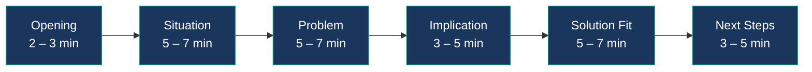
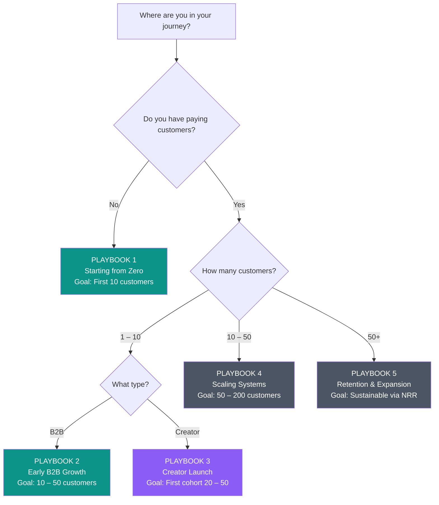

# Visual Asset Generation Prompts
## 15 Professional Diagrams for Business Book Enhancement

**Target Platforms:** Napkin.ai, Mermaid.ai, Whimsical, or equivalent  
**Style:** Clean, professional, business-appropriate (not playful)  
**Color Scheme:** Navy blue (#1a365d), teal (#0d9488), gray (#4b5563), white (#ffffff)  
**Format:** High-resolution PNG or SVG, 1200x800px minimum

---

## IMAGE 1: ICP Framework Visual (Chapter 2)

**Platform:** Napkin.ai or Mermaid.ai  
**Type:** Venn diagram with three overlapping circles

**Prompt for Napkin.ai:**
```
Create a professional Venn diagram showing three overlapping circles labeled:
1. "Can Help" (left circle) – "Problems you genuinely solve"
2. "Will Pay" (right circle) – "Budget for your solution"
3. "Joy to Work With" (bottom circle) – "Personality and values fit"

The center overlap area (where all three intersect) should be labeled "IDEAL CUSTOMER" and highlighted in teal (#0d9488).

Add warning labels outside the circles:
- "Can help + Will pay, but miserable = Burnout"
- "Can help + Enjoyable, but won't pay = Going broke"
- "Will pay + Enjoyable, but can't help = Reputation damage"

Use clean, modern sans-serif font. Navy blue (#1a365d) for circle outlines, light gray fill for each circle, teal for the center intersection. Include subtle drop shadow for depth.

Title at top: "The ICP Framework: All Three Must Overlap"
Caption at bottom: "Solo founders can't afford to compromise on any dimension"
```

**Alternative for Whimsical:**
- Use template: Venn Diagram
- Three circles, center overlap highlighted
- Add text boxes for warnings
- Export as PNG 1200x800

---

## IMAGE 2: Discovery Flow Diagram (Chapter 4)

**Platform:** Mermaid.ai or Napkin.ai  
**Type:** Linear flow with decision points

**Prompt for Napkin.ai:**
```
Create a horizontal flow diagram showing the MVQ discovery call framework:

[Opening 2 – 3 min] → [Situation 5 – 7 min] → [Problem 5 – 7 min] → [Implication 3 – 5 min] → [Solution Fit 5 – 7 min] → [Next Steps 3 – 5 min]

Each box should include:
- Time allocation in header
- Key questions below (2 – 3 bullets per stage)

Opening:
• Confirm time available
• Explain what we'll cover
• Ask about their priorities

Situation:
• What are you doing now?
• How's that working?
• What have you tried?

Problem:
• What's frustrating about current state?
• What's the impact on your business?
• Why is this a priority now?

Implication:
• What happens if this doesn't get solved?
• What does it cost in time/money/opportunity?
• Who else is affected?

Solution Fit:
• Based on what you've shared, here's how we help...
• Does this address what you described?
• Is this relevant to your situation?

Next Steps:
• Is there mutual interest?
• What happens next? (specific date/time)
• Who else needs to be involved?

Use navy blue boxes with white text. Arrows in teal. Title: "The 30-Minute MVQ Discovery Framework"
```

**Mermaid Code Alternative:**


---

## IMAGE 3: Pipeline Stages Funnel (Chapter 5)

**Platform:** Napkin.ai  
**Type:** Funnel diagram with conversion rates

**Prompt:**
```
Create a sales funnel diagram showing 6 stages with conversion rates:

TOP (widest):
Stage 1: Prospect Identified
- 100 prospects identified per month
- Entry: Matches ICP, contact info obtained
- Exit: First outreach sent

↓ 15% response rate ↓

Stage 2: Outreach Active  
- 15 responses received
- Entry: Initial message sent
- Exit: Prospect responds or marked unresponsive

↓ 60% to call conversion ↓

Stage 3: Conversation Started
- 9 discovery calls booked
- Entry: Two-way communication established
- Exit: Discovery call completed

↓ 50% qualification rate ↓

Stage 4: Discovery Complete
- 4 – 5 qualified opportunities
- Entry: Discovery call completed
- Exit: Qualified mutual fit confirmed

↓ 40% proposal acceptance ↓

Stage 5: Proposal/Evaluation
- 2 proposals sent
- Entry: Proposal sent
- Exit: Decision made (won or lost)

↓ 50% close rate ↓

BOTTOM (narrowest):
Stage 6: Won
- 1 customer closed
- Entry: Agreement signed, payment received
- Exit: Onboarding complete

Use funnel shape (inverted triangle sections stacked). Navy blue gradient getting darker toward bottom. Show percentage drops between stages in teal boxes with arrows.

Title: "Solo Founder Pipeline: From 100 Prospects to 1 Customer"
Annotation: "These are healthy conversion rates for cold outbound"
```

---

## IMAGE 4: Multi-Domain Email Infrastructure (Chapter 3 & 6)

**Platform:** Napkin.ai or Whimsical  
**Type:** Architecture diagram

**Prompt:**
```
Create a technical architecture diagram showing multi-domain cold email setup:

CENTER:
Main domain: "yourcompany.com" 
- Label: "PRIMARY DOMAIN – Never use for cold outreach"
- Lock icon
- Use for: Customer emails, transactional emails, team communication

SURROUNDING (5 separate boxes):
Domain 1: "getyourcompany.com"
- SPF ✓ DKIM ✓ DMARC ✓
- 3-week warmup period
- 50 emails/day max

Domain 2: "tryyourcompany.com"  
- SPF ✓ DKIM ✓ DMARC ✓
- 3-week warmup period
- 50 emails/day max

Domain 3: "yourcompany.io"
- SPF ✓ DKIM ✓ DMARC ✓
- 3-week warmup period
- 50 emails/day max

Domain 4: "yourcompany.co"
- SPF ✓ DKIM ✓ DMARC ✓
- 3-week warmup period
- 50 emails/day max

Domain 5: "yourcompany.app"
- SPF ✓ DKIM ✓ DMARC ✓
- 3-week warmup period
- 50 emails/day max

FLOW ARROWS showing:
5 domains × 50 emails/day = 250 total daily capacity

Platform box at bottom:
"Email Platform: Instantly or Smartlead"
- Automated warmup
- Sequence management  
- Reply detection
- Domain rotation

Use navy blue for primary domain box (with red warning border), teal for secondary domains. Include warning icon and text: "ONE damaged domain doesn't affect others or primary"

Title: "The 5-Domain Cold Email Infrastructure"
```

---

## IMAGE 5: Essential Metrics Dashboard (Chapter 8)

**Platform:** Napkin.ai (infographic style)  
**Type:** Dashboard mockup with 4 key metrics

**Prompt:**
```
Create a simple metrics dashboard showing 4 core numbers for solo founders:

Layout in 2x2 grid:

TOP LEFT:
📧 OUTREACH SENT
85 this week
Target: 50 – 100/week
Status: ✓ On track
Trend: ↗ +12% from last week

TOP RIGHT:
📅 CONVERSATIONS BOOKED
4 this week
Target: 3 – 5/week
Status: ✓ On target
Trend: → Steady

BOTTOM LEFT:
💼 DEALS IN PROPOSAL
$18,500 pipeline value
Target: 3 – 5x monthly goal
Status: ⚠ Below target
Trend: ↘ -15% from last week

BOTTOM RIGHT:
💰 REVENUE CLOSED
$6,200 this month
Monthly Goal: $10,000
Status: ⚠ 62% of goal
Trend: ↗ +$2,400 this week

Below dashboard:
"Weekly Review Checklist"
□ Did you hit your outreach target?
□ What's your response-to-meeting conversion rate?
□ What moved forward in your pipeline?
□ What closed this week?

Use white background, navy blue headers, teal for "on track", yellow for "warning", green trend arrows, red decline arrows.

Title: "The Essential 4-Metric Dashboard"
Subtitle: "Everything a solo founder needs to track weekly"
```

---

## IMAGE 6: Automation Stack Blueprint (Chapter 7)

**Platform:** Napkin.ai or Whimsical  
**Type:** Tool stack diagram with connections

**Prompt:**
```
Create a tool stack architecture showing connected systems:

TOP LAYER (Data Sources):
- LinkedIn Sales Navigator ($99/mo)
- Lead databases (Apollo, ZoomInfo)
- Website forms
- Referrals

↓ Data flows to ↓

MIDDLE LAYER (Core Systems):

[CRM] 
Pipedrive or HubSpot Free
- Contact management
- Pipeline tracking
- Activity logging
$0 – 49/mo

[Email Platform]
Instantly or Smartlead  
- Multi-domain sending
- Sequence automation
- Warmup included
$37 – 47/mo

[Enrichment]
Clay or Apollo
- Email finding
- Company data
- Waterfall enrichment
$49 – 149/mo

↓ Connected via ↓

BOTTOM LAYER (Automation):
Zapier or Make ($16 – 29/mo)
- Lead capture → CRM
- Meeting scheduled → notification
- Call complete → CRM note
- Pipeline stage change → task created

SIDE PANEL (Support Tools):
- Calendar: Calendly (Free-$16/mo)
- AI Research: ChatGPT/Claude ($20/mo)
- Total: $200 – 300/mo

Use boxes with tool logos/names. Navy blue boxes for core systems, teal for automation, gray for support. Show arrows for data flow.

Title: "The Solo Founder Automation Stack"
Subtitle: "$200 – 300/mo replaces $4,000 – 6,000/mo junior SDR"

Include warning box: "Automate the predictable. Personalize the meaningful. Never automate high-value prospect outreach."
```

---

## IMAGE 7: Decision Map for Playbook Selection (Chapter 10)

**Platform:** Mermaid.ai or Napkin.ai  
**Type:** Decision tree flowchart

**Prompt:**
```
Create a decision tree flowchart:

START: "Where are you in your journey?"

First decision:
"Do you have any paying customers yet?"

├─ NO → "PLAYBOOK 1: Starting from Zero"
│        Primary goal: First 10 customers
│        Timeline: 90 days
│        Primary channel: Direct outreach + manual validation
│
└─ YES → "How many customers do you have?"
    │
    ├─ "1 – 10 customers" → "What type of business?"
    │   ├─ B2B SaaS/Services → "PLAYBOOK 2: Early B2B Growth"
    │   │                       Primary goal: 10 – 50 customers
    │   │                       Timeline: 6 – 12 months
    │   │                       Primary channel: Cold email + LinkedIn
    │   │
    │   └─ Creator/Coach → "PLAYBOOK 3: Creator Product Launch"
    │                       Primary goal: First cohort of 20 – 50
    │                       Timeline: 90 days to launch
    │                       Primary channel: Audience building + waitlist
    │
    ├─ "10 – 50 customers" → "PLAYBOOK 4: Scaling Systems"
    │                       Primary goal: 50 – 200 customers
    │                       Timeline: 12 – 18 months  
    │                       Primary channel: Content + automation + partnerships
    │
    └─ "50+ customers" → "PLAYBOOK 5: Retention & Expansion"
                          Primary goal: Sustainable growth via existing base
                          Timeline: Ongoing
                          Primary channel: NRR expansion + referrals

Use diamond shapes for decisions, rectangles for playbook destinations. Navy blue for decisions, teal for B2B playbooks, purple for creator playbook, gray for scaling/retention.

Title: "Which Playbook Should You Follow?"
Caption: "Start where you are. Most transitions happen naturally every 6 – 12 months."
```

**Mermaid Code Alternative:**


---

## IMAGE 8: Weekly Rhythm Calendar (Chapter 12)

**Platform:** Napkin.ai (calendar/schedule visualization)  
**Type:** Weekly calendar grid

**Prompt:**
```
Create a weekly calendar showing solo founder acquisition rhythm:

MONDAY – WEDNESDAY – FRIDAY (similar pattern):
├─ 8:00 – 9:30am: Outreach & Follow-up (90 min)
│  • Review responses from yesterday
│  • Send personal responses to replies  
│  • Execute today's outreach (50 messages)
│
├─ 11:00 – 12:00pm: Content & Visibility (60 min)
│  • Create one piece of content OR
│  • Engage in communities where ICP gathers
│
├─ 2:00 – 3:00pm: Calls & Relationships (60 min)
│  • Discovery calls (schedule 2 – 3 per week)
│  • Customer success check-ins
│  • Personal outreach to important prospects
│
└─ 5:00 – 5:30pm: Admin & System (30 min)
    • Update CRM
    • Set follow-up tasks
    • Review metrics

TUESDAY – THURSDAY (similar):
├─ 8:00 – 9:30am: Outreach & Follow-up (90 min)
├─ 11:00 – 12:00pm: Content & Visibility (60 min)  
├─ 2:00 – 3:00pm: Calls & Relationships (60 min)
└─ 5:00 – 5:30pm: Admin & System (30 min)

FRIDAY SPECIAL:
├─ 8:00 – 9:30am: Outreach & Follow-up (90 min)
├─ 11:00 – 12:00pm: Content & Visibility (60 min)
├─ 2:00 – 3:00pm: Calls & Relationships (60 min)
└─ 4:00 – 5:00pm: WEEKLY REVIEW (60 min)
    • Full metrics review
    • What moved? What stalled?
    • Plan for next week

TOTALS PER WEEK:
• Outreach: 7.5 hours
• Content: 5 hours  
• Conversations: 5 hours
• Admin/Review: 3.5 hours
• TOTAL ACQUISITION TIME: 21 hours/week

Use color coding:
- Navy blue for outreach blocks
- Teal for content blocks
- Purple for conversation blocks
- Gray for admin blocks
- Gold highlight for Friday review

Title: "The Sustainable Weekly Rhythm"
Subtitle: "21 hours/week of focused acquisition work"
Note: "Adjust timing to your energy patterns, but keep the structure"
```

---

## IMAGE 9: AEO Process Flow (Chapter 14)

**Platform:** Napkin.ai or Mermaid.ai  
**Type:** Process flow diagram

**Prompt:**
```
Create a 4-week AEO implementation flow:

WEEK 1: AUDIT
├─ Ask ChatGPT: "Who is [your name]?"
├─ Ask Perplexity: "What is [your company]?"
├─ Ask Claude: "[Your topic] experts"
└─ Note who appears (competitors, not you)
    Output: Gap analysis document

↓

WEEK 2: TECHNICAL FOUNDATION  
├─ Add Person schema to website
├─ Add Organization schema
├─ Add FAQPage schema to key content
└─ Verify consistent info across LinkedIn, website, social
    Output: Schema markup implemented

↓

WEEK 3: CONTENT RESTRUCTURING
├─ Rewrite top 5 posts: Answer in first 50 words
├─ Change headers to question format
├─ Add lists and tables (AI prefers structure)
└─ Include specific data points
    Output: 5 AEO-optimized content pieces

↓

WEEK 4: CITATION BUILDING
├─ Pitch 3 podcast appearances
├─ Publish original research (even small dataset)
├─ Engage in communities (get mentioned)
└─ Guest post on established newsletters
    Output: 3+ external citations of your expertise

↓

ONGOING MAINTENANCE:
• Monthly AI visibility check
• 1 – 2 original-insight pieces per month
• Consistent profiles across all platforms

Use linear flow with checkboxes. Navy blue for week boxes, teal for outputs, gray for ongoing. Include small icons: 🔍 for audit, ⚙️ for technical, ✍️ for content, 🎯 for citations.

Title: "4-Week AEO Implementation Plan"
Subtitle: "Get cited by AI without becoming a full-time content creator"
```

---

## IMAGE 10.5: Multi-Touch Newsletter Journey (Chapter 10)

**Platform:** Napkin.ai or Mermaid.ai  
**Type:** Timeline/journey diagram showing 7 touchpoints

**Prompt:**
```
Create a horizontal timeline diagram showing the 7-touchpoint journey from cold contact to customer:

TIMELINE FLOW (left to right):

TOUCHPOINT 1: Initial Discovery
Icon: Eye/search icon
"See your content on social media or find you through search"
Status: Stranger – No relationship yet
Time: Day 0

→ Arrow →

TOUCHPOINT 2: Lead Magnet Signup
Icon: Form/email icon  
"Sign up for your lead magnet (form/survey/newsletter)"
Status: Subscriber – Permission granted
Time: Day 1
Action: Email captured, added to list

→ Arrow →

TOUCHPOINT 3: Welcome & Resource Delivery
Icon: Gift/download icon
"Receive the resource and see your expertise"
Status: Engaged – First value received
Time: Day 1-2
Content: Lead magnet delivered

→ Arrow →

TOUCHPOINT 4: Newsletter Value
Icon: Newsletter/mail icon
"Read your newsletter and learn more about your approach"
Status: Learning – Building trust
Time: Week 2-3
Content: Repurposed insights, frameworks

→ Arrow →

TOUCHPOINT 5: Engagement & Interaction
Icon: Survey/poll icon
"Engage with a survey or poll, deepening the relationship"
Status: Participating – Two-way communication
Time: Week 4
Content: Interactive survey, personalized results

→ Arrow →

TOUCHPOINT 6: Social Proof
Icon: Testimonial/case study icon
"See a case study or success story that resonates"
Status: Convinced – Seeing proof
Time: Week 5
Content: Customer success story, testimonial

→ Arrow →

TOUCHPOINT 7: Ready to Buy
Icon: Checkmark/purchase icon
"They're ready to buy – trust built through consistent value"
Status: Customer – Conversion ready
Time: Week 6-12
Action: Natural next step, not a cold pitch

BENEATH TIMELINE:
Add a progress bar showing relationship strength:
- Touchpoint 1: 0% (Stranger)
- Touchpoint 2: 20% (Subscriber)
- Touchpoint 3: 35% (Engaged)
- Touchpoint 4: 50% (Learning)
- Touchpoint 5: 65% (Participating)
- Touchpoint 6: 80% (Convinced)
- Touchpoint 7: 100% (Customer)

KEY INSIGHT BOX (bottom):
"80% of sales require 5+ touchpoints. Your newsletter creates these systematically over 6-12 weeks, building trust through consistent value delivery."

Color scheme: Navy blue timeline, teal for touchpoint icons, gray for status labels. Use arrows to show progression. Each touchpoint should be clearly separated with consistent spacing.

Title: "The Multi-Touch Newsletter Journey: From Stranger to Customer"
Subtitle: "Most buyers need 5-7 touchpoints before purchasing. Your newsletter delivers these automatically."
```

**Platform:** Napkin.ai or Mermaid.ai  
**Type:** Timeline/journey diagram showing 7 touchpoints

**Prompt:**
```
Create a horizontal timeline diagram showing the 7-touchpoint journey from cold contact to customer:

TIMELINE FLOW (left to right):

TOUCHPOINT 1: Initial Discovery
Icon: Eye/search icon
"See your content on social media or find you through search"
Status: Stranger – No relationship yet
Time: Day 0

→ Arrow →

TOUCHPOINT 2: Lead Magnet Signup
Icon: Form/email icon  
"Sign up for your lead magnet (form/survey/newsletter)"
Status: Subscriber – Permission granted
Time: Day 1
Action: Email captured, added to list

→ Arrow →

TOUCHPOINT 3: Welcome & Resource Delivery
Icon: Gift/download icon
"Receive the resource and see your expertise"
Status: Engaged – First value received
Time: Day 1-2
Content: Lead magnet delivered

→ Arrow →

TOUCHPOINT 4: Newsletter Value
Icon: Newsletter/mail icon
"Read your newsletter and learn more about your approach"
Status: Learning – Building trust
Time: Week 2-3
Content: Repurposed insights, frameworks

→ Arrow →

TOUCHPOINT 5: Engagement & Interaction
Icon: Survey/poll icon
"Engage with a survey or poll, deepening the relationship"
Status: Participating – Two-way communication
Time: Week 4
Content: Interactive survey, personalized results

→ Arrow →

TOUCHPOINT 6: Social Proof
Icon: Testimonial/case study icon
"See a case study or success story that resonates"
Status: Convinced – Seeing proof
Time: Week 5
Content: Customer success story, testimonial

→ Arrow →

TOUCHPOINT 7: Ready to Buy
Icon: Checkmark/purchase icon
"They're ready to buy – trust built through consistent value"
Status: Customer – Conversion ready
Time: Week 6-12
Action: Natural next step, not a cold pitch

BENEATH TIMELINE:
Add a progress bar showing relationship strength:
- Touchpoint 1: 0% (Stranger)
- Touchpoint 2: 20% (Subscriber)
- Touchpoint 3: 35% (Engaged)
- Touchpoint 4: 50% (Learning)
- Touchpoint 5: 65% (Participating)
- Touchpoint 6: 80% (Convinced)
- Touchpoint 7: 100% (Customer)

KEY INSIGHT BOX (bottom):
"80% of sales require 5+ touchpoints. Your newsletter creates these systematically over 6-12 weeks, building trust through consistent value delivery."

Color scheme: Navy blue timeline, teal for touchpoint icons, gray for status labels. Use arrows to show progression. Each touchpoint should be clearly separated with consistent spacing.

Title: "The Multi-Touch Newsletter Journey: From Stranger to Customer"
Subtitle: "Most buyers need 5-7 touchpoints before purchasing. Your newsletter delivers these automatically."
```

---

## IMAGE 11: The Proof Ladder (Chapter 15)

**Platform:** Napkin.ai  
**Type:** Staircase/ladder diagram

**Prompt:**
```
Create a staircase diagram showing 4 rungs of social proof:

BOTTOM RUNG (Easiest to achieve):
Rung 1: Activity Proof
"Join 247 other founders"
- Specific numbers (not rounded)
- Shows others find value
- Easy to implement immediately
Example: "247 customers" or "1,429 newsletter subscribers"

↑ Climb to ↑

Rung 2: Association Proof  
"As featured in [Publication]"
"Tools we use: [Recognized brands]"
- Implied credibility through association
- Podcast appearances count
- Newsletter mentions count
Example: "Featured in Indie Hackers newsletter"

↑ Climb to ↑

Rung 3: Micro-Testimonials
"This saved me 2 hours!" – Actual user
- Screenshots of positive DMs, emails, tweets
- Authentic, unpolished
- Permission-based or anonymized
Example: Chat bubble screenshot from Slack

↑ Climb to ↑

TOP RUNG (Most credible):
Rung 4: Results Documentation
"How Customer X achieved Y result in Z timeframe"
- Specific numbers (revenue, time, metrics)
- Case study format
- Before/after comparison
Example: "Increased MRR from $12K to $31K in 4 months"

Use ascending staircase visual. Each rung wider than the one below (showing increasing credibility). Navy blue base, teal accents. Include small icons for each rung type.

Title: "The Proof Ladder: Build Credibility Step by Step"
Subtitle: "Don't wait for Fortune 500 logos – start with Rung 1"
Side note: "Solo founders should have proof on all 4 rungs within 6 months"
```

---

## IMAGE 11: LTV:CAC Ratio Benchmarks (Chapter 8)

**Platform:** Napkin.ai (bar chart or gauge)  
**Type:** Horizontal bar chart with zones

**Prompt:**
```
Create a horizontal bar chart showing LTV:CAC ratio zones:

VERTICAL AXIS: LTV:CAC Ratio
HORIZONTAL AXIS: Business Health Status

ZONES (color-coded horizontal bars):

🔴 RED ZONE: Below 1:1
"Losing money on every customer"
Action: Stop all acquisition, fix product-market fit
Examples: LTV $500, CAC $800 = 0.6:1 ratio

🟡 YELLOW ZONE: 1:1 to 3:1  
"Potentially viable but tight margins"
Action: Optimize either LTV (retention, expansion) or CAC (efficiency)
Examples: LTV $1,000, CAC $500 = 2:1 ratio

🟢 GREEN ZONE: 3:1 to 5:1
"Healthy and sustainable"  
Action: Maintain efficiency while scaling cautiously
Examples: LTV $2,000, CAC $500 = 4:1 ratio
Industry median: 3.2:1 (B2B SaaS, 612-company dataset)

⭐ GOLD ZONE: Above 5:1
"Exceptional – consider investing more in growth"
Action: Increase acquisition spend to capture market
Examples: LTV $5,000, CAC $800 = 6.25:1 ratio
Typical in: Cybersecurity, EdTech, high-retention SaaS

Add data points showing:
• B2B SaaS median: 3.2:1
• B2C SaaS median: 2.5:1  
• Bootstrapped solo founder target: 4:1+
• VC-backed growth target: 3:1+ (acceptable to invest heavily)

Title: "LTV:CAC Ratio Benchmarks: Where Do You Stand?"
Subtitle: "Solo founders should target 4:1 or higher for sustainable growth"
Source citation: "Data from 612 B2B SaaS companies, various industry studies"
```

---

## IMAGE 12: The Identity Threat Framework (Chapter 1)

**Platform:** Napkin.ai  
**Type:** Conceptual diagram showing conflict

**Prompt:**
```
Create a visual showing the identity conflict for technical founders:

LEFT SIDE (Builder Identity):
Icon: Computer/code symbol
Core values:
• Deep work
• Autonomy  
• Craftsmanship
• Creation
• Logic & systems

Activities that feel natural:
✓ Writing code
✓ Solving technical problems
✓ Building products
✓ Optimizing systems


CENTER (Conflict Zone):
Large ⚡ lightning bolt symbol
Label: "IDENTITY THREAT"

When asked to sell:
"This isn't who I am"
"I'm a builder, not a salesperson"
"This feels inauthentic"

RIGHT SIDE (Sales Requirement):
Icon: Handshake/people symbol
Required activities:
• Interrupt people
• Handle rejection
• Persuade
• Perform
• Navigate emotion

Activities that feel unnatural:
❌ Cold outreach
❌ Being told "no"
❌ Pitching
❌ Talking about money

BOTTOM (Resolution):
Arrow pointing down from conflict to:

REFRAME BOX:
"Selling IS Building"
• Building relationships
• Building understanding of customer problems
• Building trust
• Building a sustainable business

"Sales as Diagnosis" frame:
→ You're not persuading, you're investigating
→ You're not performing, you're problem-solving
→ You're not being pushy, you're being helpful

Use navy blue for Builder side, teal for Sales side, red lightning bolt for conflict, green for resolution. Include human figure icons showing stressed person at conflict, confident person at resolution.

Title: "Why Technical Founders Hate Selling: The Identity Threat"
Subtitle: "It's not a skill deficit – it's a perceived role conflict"
```

---

## IMAGE 13: Churn Prevention Health Score (Chapter 7)

**Platform:** Napkin.ai (traffic light/status indicator)  
**Type:** Status dashboard with indicators

**Prompt:**
```
Create a customer health score dashboard showing 3 zones:

TOP SECTION – 🟢 GREEN (Healthy):
Status indicators:
✓ 3+ logins per week
✓ Using 2+ core features  
✓ Engaged with recent updates
✓ Responded to check-in email
✓ No support tickets in 30 days

Health Score: 80 – 100
Action: Quarterly check-in, ask for referral, offer expansion
Risk Level: Low
Retention Probability: 95%+

MIDDLE SECTION – 🟡 YELLOW (At Risk):
Status indicators:
⚠ Less than 2 logins per week
⚠ Single feature usage only
⚠ No engagement with new features
⚠ Slow to respond to emails
⚠ 1 – 2 support tickets recently

Health Score: 40 – 79
Action: Personal outreach within 48 hours, understand blockers, offer help
Risk Level: Medium
Retention Probability: 60 – 70%

BOTTOM SECTION – 🔴 RED (Danger):  
Status indicators:
❌ No login in 14+ days
❌ Zero feature engagement
❌ Ignored last 2 check-in attempts
❌ Multiple unresolved support tickets
❌ Billing issues or failed payments

Health Score: 0 – 39
Action: URGENT – founder call, understand what's wrong, win-back offer
Risk Level: High
Retention Probability: 20 – 30%

SIDEBAR (Tracking frequency):
• Daily: Automated monitoring
• Weekly: Yellow flag review
• Immediate: Red flag intervention

Use traffic light colors (green, yellow, red). Include gauge/meter visual showing score ranges. Add icons for each indicator type (login, feature usage, email, support).

Title: "Customer Health Score: Prevent Churn Before It Happens"
Subtitle: "Proactive intervention in Yellow zone costs 10x less than reactive recovery"
Note: "Set up automated alerts when customers drop from Green to Yellow"
```

---

## IMAGE 14: The Compound Effect Timeline (Chapter 12)

**Platform:** Napkin.ai  
**Type:** Line graph showing compounding

**Prompt:**
```
Create a dual-line graph showing effort vs. results over 12 months:

X-AXIS: Timeline (Month 1 through Month 12)
Y-AXIS: Relative Scale (0 – 100)

LINE 1 (Navy Blue – Effort):
Label: "Your Effort (Consistent 80%)"
Pattern: Flat line around 80% level throughout all 12 months
Shows steady, sustainable effort without burnout

LINE 2 (Teal – Results):  
Label: "Visible Results"
Pattern: 
- Months 1 – 3: Low, slow climb (10 – 20 level)
  Annotation: "The Valley of Disappointment – feels like nothing is working"
- Months 4 – 6: Gradual increase (20 – 40 level)
  Annotation: "Early traction – some deals closing"
- Months 7 – 9: Steeper climb (40 – 70 level)
  Annotation: "Momentum builds – referrals start"
- Months 10 – 12: Exponential rise (70 – 100 level)
  Annotation: "Compounding kicks in – systems working"

COMPARISON LINE (Red Dashed – Burnout Pattern):
Label: "100% Effort → Burnout"
Pattern:
- Months 1 – 2: Line at 100% (unsustainable intensity)
- Month 3: Sharp drop to 0% (burnout, quit)
- Remains at 0% thereafter

KEY INSIGHTS (callout boxes):
• "Most founders quit in Months 2 – 4 (before compounding)"
• "Consistency at 80% beats intensity at 100%"
• "Results lag effort by 3 – 6 months"
• "Month 10 results come from Month 4 effort"

Title: "The Compound Effect: Why 80% Consistency Beats 100% Intensity"
Subtitle: "Solo founders who maintain 80% effort for 12 months outperform those who sprint at 100% and burn out"
```

---

## IMAGE 15: Four-Part Book Journey Map (For Part Headers)

**Platform:** Napkin.ai  
**Type:** Roadmap/journey visualization

**Prompt:**
```
Create a horizontal journey map showing the 4-part book progression:

PART I: Psychology & Positioning (Chapters 1 – 3)
Icon: 🧠 Brain symbol
Chapters:
1. Why You Hate Selling
2. Finding the Right People (ICP)
3. Reaching Your Customers (Outreach)

Key Output: 
□ Psychological reframe complete
□ ICP documented  
□ Outreach strategy defined

↓ Leads to ↓

PART II: Conversations & Conversion (Chapters 4 – 7)
Icon: 💬 Speech bubble symbol
Chapters:
4. Discovery Calls
5. Qualification & Pricing
6. Channels (Email, LinkedIn, Content)
7. Retention & Expansion

Key Output:
□ Discovery framework mastered
□ Pricing confidence achieved
□ Channel playbooks built
□ Retention system active

↓ Leads to ↓

PART III: Systems, Metrics & Playbooks (Chapters 8 – 12)
Icon: ⚙️ Gear symbol
Chapters:
8. Metrics & Dashboards
9. Objections & Psychology
10. Stage-Specific Playbooks
11. Common Mistakes
12. Momentum & Sustainability

Key Output:
□ Metrics dashboard running
□ Objection playbook ready
□ Stage-specific plan chosen
□ Sustainable rhythm established

↓ Leads to ↓

PART IV: Your Playbook & The Future (Chapters 13 – 15)
Icon: 🎯 Target symbol
Chapters:
13. Personal Acquisition Playbook
14. AI & Answer Engine Optimization
15. Community & Social Proof

Key Output:
□ One-page system complete
□ 90-day plan committed
□ AEO strategy implemented
□ Community leverage begun

Use horizontal arrow/road visual connecting all four parts. Navy blue for Part I, teal for Part II, purple for Part III, gold for Part IV. Include milestone markers between parts.

Title: "Your Journey: From Psychology to Personal Playbook"
Subtitle: "Each part builds on the previous – don't skip ahead"
Timeline indicator: "Most founders complete this journey in 90 – 180 days"
```

---

## BONUS IMAGE 16: Solo Founder Constraints Triangle (Introduction)

**Platform:** Napkin.ai  
**Type:** Triangle diagram showing constraints

**Prompt:**
```
Create an inverted triangle showing solo founder constraints:

TOP (widest – most affected):
"SOLO FOUNDER REALITY"
No team • Minimal budget • No brand recognition

↓ Creates Three Core Constraints ↓

LEFT CORNER:
💰 Budget Constraint
Start: $0 – 100/month
Scale: $200 – 300/month with disciplined spending

Can't compete on:
❌ Paid ads at scale
❌ Enterprise sales tools
❌ Agency retainers
❌ Large content teams

Must leverage:
✓ Manual outreach
✓ Personal relationships  
✓ Organic channels
✓ Bootstrapped tools

RIGHT CORNER:
⏰ Time Constraint
5 – 7 hours/week for acquisition
(Rest: product, customer success, operations)

Can't do:
❌ Multiple channels simultaneously
❌ Complex multi-step funnels
❌ Content at scale
❌ Lengthy sales cycles

Must prioritize:
✓ One primary channel at a time
✓ Simple systems
✓ High-leverage activities
✓ Short sales cycles

BOTTOM CORNER:
👤 Solo Constraint  
No employees, no agencies, no team to share the load

Must handle:
• Psychology (no VP of Sales to absorb rejection)
• Learning curve (no specialists)
• Recovery (no shared burden)
• Consistency (no backup)

Requires:
✓ AI and lightweight tools
✓ Sustainable rhythms
✓ Decision fatigue reduction
✓ Psychologically sustainable systems

CENTER (where all three overlap):
"THE SOLO FOUNDER PLAYBOOK"
Works within all three constraints simultaneously

Use inverted triangle shape. Navy blue base, teal/purple/gold for each constraint corner. Red warning icons for "can't do", green check icons for "must leverage/prioritize".

Title: "The Solo Founder Constraint Triangle"
Subtitle: "Every tactic in this book is built against these design parameters"
```

---

## IMAGE GENERATION SPECIFICATIONS

### For All Images:

**Resolution:**
- Minimum: 1200x800px
- Preferred: 1600x1200px or higher
- Format: PNG (with transparency where appropriate) or SVG

**Typography:**
- Headers: 18 – 24pt, bold, sans-serif (e.g., Inter, Helvetica, Arial)
- Body text: 12 – 14pt, regular weight
- Captions: 10 – 12pt, italic or lighter weight

**Color Palette:**
- Primary Navy: #1a365d
- Primary Teal: #0d9488  
- Accent Purple: #8b5cf6
- Accent Gold: #f59e0b
- Neutral Gray: #4b5563
- Light Gray: #e5e7eb
- White: #ffffff
- Success Green: #10b981
- Warning Yellow: #fbbf24
- Danger Red: #ef4444

**Consistency Rules:**
1. All diagrams should feel like they belong to the same book
2. Use consistent icon style (outlined, not filled)
3. Maintain similar visual weight and density
4. Use whitespace generously
5. Ensure high contrast for accessibility

**Export Checklist:**
- [ ] All text is legible at 50% zoom
- [ ] Colors meet WCAG AA contrast standards
- [ ] No gradients that will pixelate in print
- [ ] File size under 500KB per image
- [ ] Transparent background where appropriate
- [ ] Alternative text descriptions provided for accessibility

---

## PLATFORM-SPECIFIC TIPS

### Napkin.ai:
- Best for: Conceptual diagrams, infographics, data visualizations
- Pro tip: Use "professional business" style in prompt
- Export: PNG at highest resolution available

### Mermaid.ai:
- Best for: Flowcharts, process diagrams, decision trees
- Pro tip: Use the mermaid code provided, then customize colors in editor
- Export: SVG for scalability, PNG for direct use

### Whimsical:
- Best for: Wireframes, journey maps, system diagrams
- Pro tip: Start with template, then heavily customize
- Export: PNG with 2x resolution for retina displays

---

**Usage Instructions:**
1. Generate all 16 images using the prompts above
2. Review each for consistency with brand guidelines
3. Export in both PNG (for digital) and high-res PDF (for print)
4. Integrate images at appropriate points in chapters
5. Include alt text for accessibility

**File Naming Convention:**
- `ch02-icp-framework.png`
- `ch04-discovery-flow.png`  
- `ch05-pipeline-funnel.png`
- etc.

This ensures easy organization and chapter-specific file management.

## Additional Image Prompts

# IMAGE CREATION PROMPTS
## For External Design Tool or AI Image Generator

Execute these separately from the text editing prompts.

***

## **IMAGE 1: Warmup Mechanism Dual Framework**
**For: Chapter 3 – Why Warmup Works**

```
Create a visual diagram showing the dual mechanisms of email warmup:

LAYOUT: Two parallel tracks that converge

LEFT TRACK – PSYCHOLOGICAL MECHANISM:
- Top box: "Recipient Brain" (stylized head icon)
- Arrow down labeled "Exposure Effect (Zajonc)"
- Middle box: "Familiarity Builds Trust"
  – Sub-bullets: "Recognize sender", "Consistency bias", "Positive association"
- Arrow down
- Bottom box: "Habit Formation (21 days)"

RIGHT TRACK – TECHNICAL MECHANISM:
- Top box: "Email Provider Algorithms" (server/database icon)
- Arrow down labeled "Sender Reputation Score"
- Middle box: "Engagement Metrics Train Filters"
  – Sub-bullets: "Open rate >20%", "Reply rate >5%", "Spam <0.1%"
- Arrow down
- Bottom box: "Trust Building (7-day cycles)"

CONVERGENCE POINT (bottom center):
- Both arrows meet at: "Primary Inbox Placement"
- Label: "Warmup achieves both goals simultaneously"

SUPPORTING ELEMENTS:
- Timeline on left: 3 weeks marked with milestone checkpoints
- Gradient background: Left side warm (brain/psychology), right side cool (tech/algorithms)
- Small notation: "Neither works alone – you need both mechanisms"

COLOR SCHEME:
- Psychological track: Warm tones (orange/red gradients)
- Technical track: Cool tones (blue/teal gradients)
- Convergence: Gold/unified color

DIMENSIONS: 1200px width × 800px height
STYLE: Clean, professional, matching existing visual palette (navy/teal/purple accents)
```

***

## **IMAGE 2: Anchoring Bias Pricing Perception**
**For: Chapter 5 – Value Anchoring Cognitive Science**

```
Create a visual showing how anchoring affects value perception:

LAYOUT: Three parallel scenarios showing same product at different anchor points

SCENARIO 1 – NO ANCHOR (Left):
- Price presented: "$3,000/month"
- Brain perception: "??? Is this expensive?"
- Visual: Brain with question marks, neutral expression
- Outcome value perception: "Medium" (uncertain)

SCENARIO 2 – LOW ANCHOR (Middle):
- First shown: "$500/month" (false anchor)
- Then shown: "$3,000/month"
- Brain perception: "That's 6x more – expensive!"
- Visual: Brain with down arrow, negative expression
- Outcome value perception: "Low" (relative to anchor)

SCENARIO 3 – HIGH ANCHOR (Right):
- First shown: "$10,000/month" (premium anchor)
- Then shown: "$3,000/month"
- Brain perception: "That's 70% discount – great value!"
- Visual: Brain with up arrow, positive expression
- Outcome value perception: "High" (relative to anchor)

CONNECTING ELEMENTS:
- Horizontal line through all three showing "$3,000" is identical
- Annotation: "Same price. Different perception. Same product."
- Arrow between scenarios: "Anchor effect"

SUPPORTING ANNOTATION:
- Bottom box explaining: "Anchoring doesn't change the product. It changes how the brain evaluates it."
- Note: "This is why premium tiers exist – even if nobody buys them, they anchor perception higher"

COLOR SCHEME:
- Scenario 1: Gray (neutral)
- Scenario 2: Red (negative)
- Scenario 3: Green (positive)
- Price numbers in bold navy

DIMENSIONS: 1400px width × 600px height
STYLE: Clean, psychological, with clear before/after flow
```

***

## **IMAGE 3: Automation Failure Mode Quadrant**
**For: Chapter 7 – When Automation Fails**

```
Create a 2x2 matrix showing when to automate vs. when to avoid:

AXES:
- X-axis (left to right): Task Complexity (Simple → Complex)
- Y-axis (bottom to top): Relationship Value (Low → High)

QUADRANTS:

TOP-LEFT (Simple + High Value):
- Label: "AUTOMATE WITH REVIEW"
- Color: Yellow/caution
- Icon: Checkbox with review symbol
- Examples:
  – Automated meeting reminder (human reviews timing)
  – Automated proposal generation (you review before sending)
  – Automated follow-up sequencing (you monitor for breaks)
- Action: Automate but add checkpoint before reaching recipient

TOP-RIGHT (Complex + High Value):
- Label: "NEVER AUTOMATE"
- Color: Red/stop
- Icon: Prohibited symbol
- Examples:
  – Personalized outreach to warm leads
  – Complex objection responses
  – Custom proposal for key deal
  – Executive/C-level communications
- Action: Manual + high-touch only

BOTTOM-LEFT (Simple + Low Value):
- Label: "AUTOMATE FULLY"
- Color: Green/go
- Icon: Automatic/gears symbol
- Examples:
  – Meeting scheduling
  – Automated email confirmations
  – Data entry and CRM updates
  – Warm-up email sequences
- Action: Set it and forget it

BOTTOM-RIGHT (Complex + Low Value):
- Label: "AUTOMATE WITH ASSIST"
- Color: Blue/info
- Icon: Gear + person symbol
- Examples:
  – Content distribution to multiple channels
  – Lead scoring and ranking
  – Workflow routing
- Action: AI assists, human reviews output

DIAGONAL DIVIDING LINE:
- Upper-left to lower-right: "TRUST THRESHOLD"
- Annotation: "Above the line = relationship matters too much to trust automation"

SUPPORTING ELEMENTS:
- Center notation: "Rule: If automation failing costs trust, never automate"
- Small legend: "Automation risk" with gradient from green (safe) to red (dangerous)

DIMENSIONS: 1000px width × 1000px height (square for quadrant)
STYLE: Corporate, decision-matrix style, matching existing palette
```

***

## **IMAGE 4: Objection Emotion-Logic Split**
**For: Chapter 9 – The Emotional-Logical Split**

```
Create a visual showing the dual-process brain mechanism behind objections:

LAYOUT: Brain diagram split down middle + objection examples

TOP: Brain Split Visualization
- Left hemisphere: "System 1 – EMOTIONAL" (red/warm tones)
  – Label: "Amygdala (threat detection)"
  – Activated by: Fear, uncertainty, risk
  – Speed: Milliseconds
  – Output: GUT REACTION

- Right hemisphere: "System 2 – LOGICAL" (blue/cool tones)
  – Label: "Prefrontal Cortex (reasoning)"
  – Activated by: Analysis, cost-benefit
  – Speed: Seconds to minutes
  – Output: RATIONAL JUSTIFICATION

DIVIDING LINE: Corpus callosum connecting both

BELOW: Three Common Objections Decoded

OBJECTION 1: "Too expensive"
- What they SAY (System 2 output): "I don't have the budget"
- What they FEEL (System 1 driver): Loss aversion fear ("I might lose this money")
- Brain pathway shown: Red arrow from amygdala → logical justification
- Your response should address: Fear first ("What's the cost of not solving this?"), then price ("Here's why it's worth it")
- Visual: Red emotion → Blue rationalization arrow

OBJECTION 2: "Not the right time"
- What they SAY: "We need to think about timing"
- What they FEEL: Status quo bias ("Change is risky")
- Brain pathway: Red fear of change → blue timing justification
- Your response: "What changes in 3 months that makes this easier?" (expose that nothing changes)
- Visual: Red emotion → Blue rationalization arrow

OBJECTION 3: "Need to talk to [partner/team]"
- What they SAY: "I can't decide alone"
- What they FEEL: Authority/status threat ("I look foolish if this goes wrong")
- Brain pathway: Red shame/status threat → blue committee excuse
- Your response: "What would you need to recommend this?" (make them advisor)
- Visual: Red emotion → Blue rationalization arrow

SUPPORTING BOX (bottom):
"The Diagnostic Process:
1. Hear the logical objection
2. Ask: What System 1 fear drives this?
3. Respond to emotion first
4. Then address logic with data"

COLOR SCHEME:
- System 1: Red/warm (emotional, threat-based)
- System 2: Blue/cool (logical, analytical)
- Objection examples: Split color showing both systems
- Arrows: Red to blue flow showing emotional→logical translation

DIMENSIONS: 1200px width × 1000px height
STYLE: Neuroscience textbook style, clear dual-pathway visualization
```

***

## **IMAGE 5: Playbook Progression Skill Compounding**
**For: Chapter 10 – Why This Sequence**

```
Create a visual showing playbook progression with three overlapping mechanisms:

LAYOUT: Three stacked layers, each representing a compounding mechanism

LAYER 1 (Bottom): SKILL COMPOUNDING
- Playbook 1→2: "ICP Clarity" flows to "Outreach Targeting"
- Playbook 2→4: "Validated Message" flows to "Scaled Outreach"
- Playbook 4→5: "Efficient Acquisition" flows to "Retention Systems"
- Visual: Staircase showing skills building on previous skills
- Color: Navy/dark tones
- Annotation: "Each playbook builds capabilities the next requires"

LAYER 2 (Middle): PSYCHOLOGICAL MOMENTUM
- Playbook 1: Small wins from warm network
  – Visual: Small flame icon (early spark)
  – Label: "Month 1 – 3: Confidence building"
- Playbook 2: Harder wins from cold outreach
  – Visual: Medium flame (growing fire)
  – Label: "Month 3 – 6: Momentum building"
- Playbook 4 – 5: Referrals and retention
  – Visual: Large flame (strong fire)
  – Label: "Month 6+: Flywheel accelerates"
- Color: Orange/warm tones
- Annotation: "Success breeds belief. Can't do hard things without early wins."

LAYER 3 (Top): RESOURCE EFFICIENCY
- Playbook 1: Manual validation → "Proves what works"
- Playbook 2 – 4: Scale validated approach → "Automate what's proven"
- Playbook 5: Optimize proven system → "Compound established flywheel"
- Visual: Dollar signs growing in size as you progress
- Color: Green/prosperity tones
- Annotation: "Don't automate unproven process. Validate before systemizing."

TRANSITION POINTS (Markers between playbooks):
- Playbook 1→2: "Warm network exhausted (~10 customers)"
- Playbook 2→4: "Can't manually manage more (~50 customers)"
- Playbook 4→5: "Growth stalls without retention (~50+ customers)"

TIMELINE RIBBON (right side):
- Marks months 1 – 12
- Shows typical progression: Playbook 1 (M1 – 3), Playbook 2 (M3 – 9), Playbook 4 (M6+), Playbook 5 (ongoing)
- Highlights natural transition points

SIDE ANNOTATION:
"Most founders transition naturally every 6 – 12 months when they hit capacity limits. Don't skip steps or rush. Each builds on the previous."

COLOR SCHEME:
- Layer 1: Navy (foundational)
- Layer 2: Orange (motivational)
- Layer 3: Green (financial)
- Timeline: Gold accents
- Overall: Three-layer depth visualization

DIMENSIONS: 1000px width × 1200px height (vertical flow)
STYLE: Progress/journey visualization, showing compounding effects
```

***

## **IMAGE 6: Dopamine Baseline vs Peaks**
**For: Chapter 12 – The Neuroscience of Momentum**

```
Create a line chart + neuroscience annotation showing dopamine dynamics:

CHART TYPE: Dual-line graph
- X-axis: Time (M1 through M12)
- Y-axis: Dopamine Level (0 – 100 relative scale)

LINE 1 – 100% INTENSITY APPROACH (Burnout):
- Starts at 100 (maximum effort sprint)
- Spikes above 100 at Month 1 – 2 (initial high)
- Crashes to 30 at Month 3 (burnout valley)
- Flatlines near 0 by Month 4 – 5 (quit here)
- Visual: Red dashed line
- Label: "Unsustainable intensity"
- Annotations:
  – Month 1: "Initial sprint"
  – Month 2: "Dopamine spike (deal closed)"
  – Month 3: "Crash – baseline dropped"
  – Month 4: "Quit zone – most founders quit here"

LINE 2 – 80% CONSISTENCY APPROACH (Sustainable):
- Starts at 80 (sustainable effort baseline)
- Slight peak at Month 2 – 3 (natural wins)
- Holds steady 75 – 85 through Month 6
- Curves upward sharply Month 7 – 12 (compounding effect)
- Visual: Teal solid line
- Label: "Sustainable consistency"
- Annotations:
  – Month 1 – 3: "Baseline maintenance"
  – Month 3 – 6: "Results lag effort (3 – 6 month delay)"
  – Month 7: "Inflection point – compounding kicks in"
  – Month 10+: "Exponential results from earlier effort"

SHADED REGIONS:
- Red zone (M2 – 4): "Valley of Disappointment" – where 100% intensity burnout happens
- Green zone (M7 – 12): "Compounding Zone" – where 80% consistency pays off exponentially

SIDE ANNOTATIONS – THE MECHANISMS:

Left side:
"DOPAMINE BASELINE:
- Your default motivation level
- Set by: Sleep, sunlight, consistent effort
- 100% sprints LOWER baseline (chasing highs)
- 80% consistency MAINTAINS baseline"

Right side:
"HABIT LOOP FORMATION:
- Takes 66 days to automatic
- M1 – 3: Effort feels high (building habit)
- M4 – 6: Effort feels lower (habit formed)
- M7+: Automatic execution (dopamine normalized)"

BOTTOM INSIGHT BOX:
"Why 80% beats 100%:
100% intensity creates unsustainable dopamine spikes → baseline crashes → burnout
80% consistency maintains dopamine baseline → enables long-term effort → exponential results
The founders who win aren't the ones who sprint hardest. They're the ones who run longest."

SUPPORTING DATA CALLOUT:
"Lally et al. (2010): Habit formation takes 18 – 254 days, median 66 days
Huberman Lab: Sustainable dopamine comes from baseline + peaks, not peaks alone"

COLOR SCHEME:
- 100% line: Red (danger)
- 80% line: Teal (optimal)
- Burnout valley: Red shading
- Compounding zone: Green shading
- Text: Navy/dark

DIMENSIONS: 1200px width × 700px height (wide, chart-focused)
STYLE: Scientific/data visualization with psychological overlay
```

***

## **IMAGE 7: Retention Flywheel (OPTIONAL)**
**For: Chapter 6 – The Retention Flywheel**

```
Create a circular diagram showing the retention reinforcement cycle:

LAYOUT: 6-node circular flywheel, clockwise rotation

NODE 1 (Top): Great Product
- Icon: Gear/wrench (building/creating)
- Label: "Great Product"
- Subtitle: "Solves real problem effectively"
- Color: Navy

NODE 2 (Top-right): Happy Customers
- Icon: Smiley face/thumbs up
- Label: "Happy Customers"
- Subtitle: "Achieve promised outcome"
- Color: Green

NODE 3 (Bottom-right): Testimonials & Proof
- Icon: Quote marks
- Label: "Testimonials & Case Studies"
- Subtitle: "Social proof generated"
- Color: Teal

NODE 4 (Bottom): Better Leads
- Icon: Magnet
- Label: "Better Leads"
- Subtitle: "Higher-quality inbound"
- Color: Purple

NODE 5 (Bottom-left): Ideal Customer Fit
- Icon: Target/bullseye
- Label: "Ideal Customer Fit"
- Subtitle: "Better ICP match = higher retention"
- Color: Orange

NODE 6 (Top-left): Product Improvements
- Icon: Upward arrow/growth
- Label: "Product Improvements"
- Subtitle: "Feedback drives roadmap"
- Color: Gold

ARROWS BETWEEN NODES:
- Clockwise arrows connecting 1→2→3→4→5→6→1
- Each arrow labeled with the mechanism:
  – 1→2: "Delivers value"
  – 2→3: "Share success"
  – 3→4: "Attract similar"
  – 4→5: "Pre-qualified"
  – 5→6: "Better feedback"
  – 6→1: "Continuous improvement"

CENTER OF CIRCLE:
- Bold text: "The Retention Flywheel"
- Subtitle: "Each component accelerates the next"
- Spinning indicator (visual rotation cue)

SUPPORTING ANNOTATIONS (outside circle):

Top arc: "Starts here: Build something people genuinely love"

Bottom arc: "Compounds here: Easier acquisition + higher retention"

Right side: "Timeline: 6 – 12 months to full speed"

Left side: "Strategy: Focus on 1 – 2 nodes at a time (not all 6 = burnout)"

EXAMPLE PROGRESSION BOX (bottom-left corner):
"Example Timeline:
Months 1 – 6: Focus on Great Product + Happy Customers
Months 7 – 12: Add Testimonials + Better Leads
Months 13+: Full flywheel spins (acquisition becomes easier)"

COLOR SCHEME:
- Each node: Different color from palette (navy, green, teal, purple, orange, gold)
- Arrows: Gradient from current node to next
- Center: Spin indicator in teal
- Background: Light, minimal (white or very light gray)

ROTATIONAL ELEMENT:
- Optional animation note: "Arrows should have subtle clockwise rotation animation in digital version"

DIMENSIONS: 1000px width × 1000px height (square, circular layout)
STYLE: Modern, geometric, matching existing palette but with 6-color variation
```

***

## **IMAGE 8: Pricing Tier Decision Matrix (OPTIONAL)**
**For: Chapter 5 – Pricing Tier Decision Framework**

```
Create a 2x2 matrix + decision guidance showing pricing tier options:

AXES:
- X-axis (left to right): Customer Segment (Solo/SMB → Mid-Market → Enterprise)
- Y-axis (bottom to top): Service Level (Self-Serve → Assisted → Full-Service/Custom)

QUADRANT 1 (Bottom-Left): SELF-SERVE / SOLO-SMB
- Price range: $50 – 500/month
- Color: Light green (accessible)
- Examples: SaaS tools, templates, DIY courses
- Margin: 80 – 90% (automated)
- Icon: Computer screen/self-service
- Key metric: "High volume, low touchpoints"
- When to use: "High-complexity, low-support needs"

QUADRANT 2 (Middle): ASSISTED SERVICE / SMB
- Price range: $500 – 5,000/month
- Color: Dark green (optimal)
- Examples: Monthly check-ins, light consulting, group coaching
- Margin: 60 – 70% (moderate time)
- Icon: Handshake/partnership
- Key metric: "Medium volume, medium touchpoints"
- Label highlight: "⭐ MOST SOLO FOUNDERS START HERE"
- When to use: "Best balance of scale + customization"

QUADRANT 3 (Top-Left): FULL-SERVICE / PREMIUM SOLO
- Price range: $5,000 – 20,000/project
- Color: Gold (premium)
- Examples: Done-for-you, consulting, custom implementation
- Margin: 50 – 60% (time-intensive)
- Icon: Briefcase/premium service
- Key metric: "Low volume, high touchpoints"
- When to use: "Leverage expertise, not time"

QUADRANT 4 (Right side): MID-MARKET / ENTERPRISE
- Price range: $20,000+/year
- Color: Red (avoid)
- Examples: Enterprise SaaS, agency retainers
- Note: "Requires sales team and longer cycles"
- Icon: Prohibited/stop symbol
- Warning: "❌ AVOID AS SOLO FOUNDER"
- When to avoid: "Sales cycle too long without team"

DIAGONAL DIVIDING LINE:
- From middle to upper-right: "SCALE THRESHOLD"
- Annotation: "Higher on this line = need more time per customer"

HIGHLIGHTING:
- Green highlight box around Assisted/SMB quadrant
- Bold text: "Sweet Spot for Solo Founders"
- Annotation: "Start here. Scale Self-Serve from this base. Add Full-Service as premium option."

DECISION FLOW (arrows):
- Arrow from center: "Where's your ICP?"
- Arrow pointing to Assisted: "Best for most solo founders"
- Arrow pointing to Self-Serve: "Scale here after proving Assisted model works"
- Arrow pointing to Full-Service: "Premium positioning with lower volume"
- X on Enterprise: "Wait until you have a team"

SUPPORTING CALLOUTS:

Top of matrix: "Higher price = More time per customer = Lower scale potential"

Bottom of matrix: "Higher volume = Less time per customer = Lower margins"

Right side: "Longer sales cycle = More capital needed = Higher risk"

BOTTOM BOX (Actionable Guidance):
"Pricing Tier Decision:
1. Where's your customer naturally positioned? (Top/Middle/Bottom)
2. Can you deliver that service level as solo founder?
3. Is the margin sufficient for sustainability?
If Yes to all: That's your tier. If No: Adjust scope or move to different quadrant."

COLOR SCHEME:
- Assisted/SMB: Green (recommended)
- Self-Serve + Full-Service: Yellow (viable with caveats)
- Enterprise: Red (avoid)
- Background: Light, minimal
- Text: Navy/dark for clarity

DIMENSIONS: 1200px width × 900px height (rectangular, matrix-focused)
STYLE: Business strategy matrix, corporate, professional
```

***

## **DELIVERY FORMAT**

Each image specification above includes:
- **What to create** (specific visual type)
- **Where it goes** (chapter location)
- **Structure/Layout** (exact configuration)
- **Content** (all text, labels, annotations)
- **Color scheme** (specific palette alignment)
- **Dimensions** (pixel size)
- **Style** (matching existing aesthetics)

***

## **TOOL OPTIONS**

**For Creating These Images:**

1. **Figma** (recommended for consistency)
   – Create all 8 visuals in one file
   – Use shared color library (matches existing visuals)
   – Export as PNG/JPG

2. **Adobe Illustrator**
   – Professional vector graphics
   – More control over exact positioning

3. **AI Image Generators** (Claude, DALL-E, Midjourney)
   – Use these prompts directly in image generation
   – May need refinement for exact data/accuracy

4. **Canva Pro**
   – Fast iteration
   – Template-based, easier for someone less design-experienced

***

## **INTEGRATION NOTES**

- Images 1 – 6 are **high-priority** (analytical depth support)
- Images 7 – 8 are **optional** (nice-to-have enhancements)
- All should match existing visual palette: **Navy, Teal, Purple, Orange, Gold**
- Maintain consistent typography across all visuals

Create these in parallel while executing text prompts 1 – 11 for maximum efficiency.
