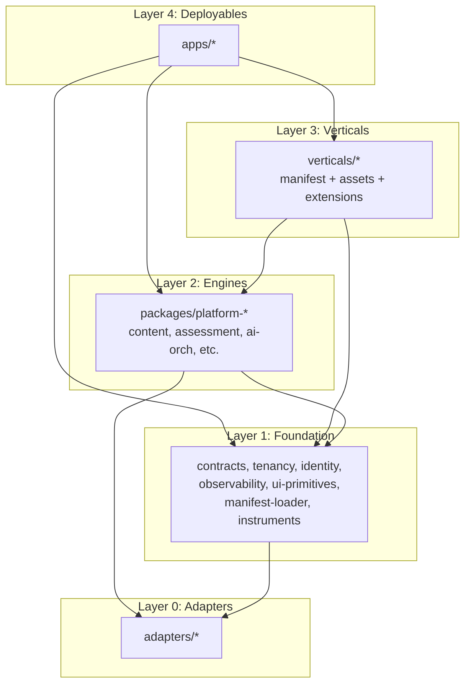
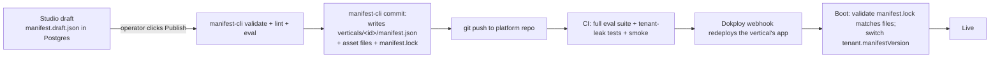

# Implementation Blueprint — SoloFrame Platform

Execution-ready. Citations to real paths in the existing repos. Code where code beats prose.

---

## 1. Executive Summary

**The plan in five sentences.** Stand up a new pnpm + Turbo monorepo (`solofame-platform`) and move both existing apps into it as `apps/gtm` and `apps/dwa` *unchanged on day one*, with `@platform/*` packages extracted incrementally underneath. Tenancy lands first — every request enters a `withTenant()` Drizzle wrapper backed by Postgres RLS, and CI fails any new query that bypasses it. Each first-party vertical stays a **separate Next.js app deployed as its own Dokploy app** sharing the pooled Postgres/Redis — we get rollback granularity without operating multiple control planes. Manifests + prompt/knowledge/scenario/assessment/artifact/workflow packs live in `verticals/<id>/` and are git as the source of truth; the future Studio writes drafts to Postgres and commits-on-publish via a service account. Terraform's role is limited to base infra reproducibility and the (rare) dedicated-tier VPS — Dokploy runs everything else.

**One CHANGE REQUEST surfaced below** (§7.5): treat manifest hot-reload as dev-only, prod reloads at deploy. Everything else from prior decisions stands.

---

## 2. Repo Structure

A new monorepo at `/Volumes/ext-data/github/solofame-platform/`. Existing repos (`prev-gtmos/`, `mental-health-education-platform-main/`) become read-only references during migration, then archive.

```
solofame-platform/
├── pnpm-workspace.yaml
├── turbo.json
├── package.json
├── tsconfig.base.json
├── .github/workflows/                    # one CI pipeline, env matrix
│   ├── ci.yml                            # lint, typecheck, test, tenant-leak suite
│   └── deploy.yml                        # tags → Dokploy webhook redeploy
├── .changeset/                           # semver for @platform/* packages
│
├── apps/                                 # deployable Next.js apps (one Dokploy app each)
│   ├── gtm/                              # was prev-gtmos/, slimmed to shell + vertical wiring
│   ├── dwa/                              # was mental-health-education-platform-main/, same
│   ├── tenant-runtime/                   # constrained shell for Studio-built tenants (Phase 3)
│   └── studio/                           # the Vertical Studio (Phase 3)
│
├── packages/                             # @platform/* — imported, never network-called
│   ├── contracts/                        # Zod + TS — every cross-package interface
│   ├── ui-shell/                         # Cruip Mosaic shell, theme-able
│   ├── ui-primitives/                    # buttons, modals, toasts (the dedup layer)
│   ├── tenancy/                          # tenant, member, RLS, withTenant(), guards
│   ├── identity/                         # Lucia v3 + email + invites + MFA
│   ├── billing/                          # Polar adapter use, plans, entitlements, metering
│   ├── ai-orchestration/                 # client, model router, prompt-pack loader, redaction, token meter
│   ├── prompt-registry/                  # load/diff/version prompt packs from disk
│   ├── content-engine/                   # course/lesson/MDX/lesson-component registry
│   ├── assessment-engine/                # quiz/rubric/instrument/scoring
│   ├── artifact-engine/                  # ArtifactTemplate, instance, PDF/CSV exporters
│   ├── knowledge-engine/                 # ingest, chunk, embed, retrieve, citation
│   ├── roleplay-engine/                  # scenario runtime + evaluator
│   ├── voice/                            # TTS/STT
│   ├── community-engine/                 # pods, matching, activity feed, forum adapter use
│   ├── workflow-engine/                  # native DSL runtime + n8n bridge
│   ├── gamification-engine/              # XP, badges, streaks, milestones
│   ├── analytics-engine/                 # event stream, rollups, Metabase views
│   ├── manifest-loader/                  # parse, validate, freeze, resolve overrides
│   ├── instruments/                      # GAD-7, PHQ-9, PDSS-SR, OCD — platform-owned, immutable
│   ├── eval/                             # prompt + manifest eval suites
│   ├── observability/                    # logger, request-context, error reporter
│   └── testing/                          # tenant-leak harness, fixtures, factories
│
├── adapters/                             # @adapter/* — opt-in, narrow, replaceable
│   ├── llm-openrouter/                   # default
│   ├── llm-openai/                       # fallback
│   ├── llm-anthropic/                    # fallback
│   ├── pay-polar/
│   ├── pay-stripe/                       # added when first asks
│   ├── forum-flarum/                     # used by DWA
│   ├── forum-nodebb/                     # used by GTM
│   ├── crm-attio/
│   ├── crm-pipedrive/
│   ├── crm-hunter/
│   ├── crm-notion/
│   ├── mail-resend/
│   ├── mail-brevo/
│   ├── vector-pgvector/                  # default
│   ├── vector-qdrant/                    # later, behind interface
│   ├── classifier-maia/                  # DWA's DistilBERT
│   ├── classifier-openai-mod/            # generic moderation
│   ├── storage-s3/
│   └── notify-resend/
│
├── verticals/                            # the heart — manifest + content + prompts per vertical
│   ├── gtm/
│   │   ├── manifest.json
│   │   ├── manifest.lock                 # pinned engine versions + content hashes
│   │   ├── branding/{logo.svg,theme.json,emails/}
│   │   ├── navigation.json
│   │   ├── content/courses/              # MDX courses (from prev-gtmos/server/data)
│   │   ├── prompts/                      # {coaching,roleplay,facilitator,quiz_reflection}/v{n}.md
│   │   ├── personas/                     # roleplay personas
│   │   ├── scenarios/
│   │   ├── assessments/                  # founder-readiness, etc.
│   │   ├── artifacts/                    # ICP builder, etc.
│   │   ├── workflows/
│   │   └── extensions/                   # vertical-only TypeScript (sparingly)
│   │       └── outreach/                 # Attio/Pipedrive/Hunter/WhatsApp logic
│   ├── dwa/
│   │   ├── manifest.json
│   │   ├── manifest.lock
│   │   ├── branding/
│   │   ├── navigation.json
│   │   ├── content/courses/{therapeutic,optimization}/
│   │   ├── prompts/
│   │   ├── assessments/                  # references @platform/instruments
│   │   ├── artifacts/                    # thought-record, exposure-hierarchy, tracking-log
│   │   ├── workflows/
│   │   └── extensions/
│   │       ├── clinical-safety/          # wraps Maia, owns crisis policy
│   │       ├── provider-portal/          # NPI, patient roster, alerts (HIPAA module)
│   │       └── clinical-components/      # the 33 React lesson components
│   └── _template/                        # `pnpm new-vertical <id>` scaffolds from this
│
├── services/                             # sidecar containers — only when justified
│   ├── distress-classifier/              # Maia/DistilBERT FastAPI (already exists, lift as-is)
│   ├── flarum/                           # forum sidecar (existing)
│   ├── nodebb/                           # forum sidecar (existing)
│   └── n8n/                              # workflow sidecar (existing)
│
├── infra/
│   ├── dokploy/                          # compose stubs, app templates, env matrix docs
│   │   ├── apps/                         # one yaml per Dokploy app, declarative reference only
│   │   ├── env/{prod,staging,dev}/
│   │   └── README.md
│   ├── migrations/                       # Drizzle migrations — single shared schema
│   ├── seed/                             # idempotent seeders per environment
│   └── terraform/                        # base VPS + dedicated-tier provisioning ONLY
│       ├── modules/{vps-base,dedicated-tenant}/
│       └── envs/{shared-prod,dedicated-acme}/
│
├── tools/
│   ├── manifest-cli/                     # validate, diff, lint, publish
│   ├── tenant-cli/                       # provision, suspend, rotate, calc revenue-share
│   ├── eval-cli/                         # run prompt + manifest evals
│   ├── new-vertical/                     # scaffold from verticals/_template
│   ├── extract-codemod/                  # AST tools to move imports during extraction
│   └── codeowners-check/                 # CI guard for path-blocked rules
│
└── docs/
    ├── adrs/                             # one .md per decision
    ├── runbooks/{deploy,rollback,tenant-onboard,incident}.md
    └── manifest-spec.md
```

**Naming convention.** `@platform/<engine>` for owned engines; `@adapter/<vendor>` for replaceable I/O; `@vertical/<id>` is **not** a published package name — verticals are loaded from disk, never imported.

**Why a new repo and not in-place refactor.** The two existing repos have diverged enough that mutating either in place would force the other into a long-running rebase. A new repo lets you `git mv` from each into `apps/gtm/` and `apps/dwa/` once, preserving history per-app via `git filter-repo`.

---

## 3. Module Boundaries and Dependency Rules

### 3.1 The dependency graph (only allowed arrows)



**Reverse arrows are CI failures.** A `dependency-cruiser` config in CI rejects:
- any import from `packages/*` into `apps/*` or `verticals/*`
- any import from a Layer-2 engine into another Layer-2 engine *except* through `@platform/contracts` types or events
- any import from `verticals/*` into another `verticals/*`
- any import from `adapters/*` into `packages/*` or `apps/*` (adapters are leaves)

### 3.2 Per-engine ownership and constraints

| Package | Owns | Depends on | Forbidden imports | Sync or events? |
|---|---|---|---|---|
| `contracts` | Zod schemas, TS interfaces, event names registry, role registry | nothing (leaf) | anything | n/a — types only |
| `tenancy` | `tenant`, `tenant_member`, `tenant_audit` tables; `withTenant()`; RLS helpers; quota counters | contracts, observability | identity (circular avoided), any engine | sync only |
| `identity` | `user`, `session`; Lucia config; auth flows; invites | contracts, tenancy, observability, adapters/mail-* | engines | sync |
| `manifest-loader` | manifest validation, version pinning, override resolution | contracts, observability | engines, adapters | sync (boot + dev hot-reload) |
| `ai-orchestration` | model router, prompt-pack loader, redaction, token metering | contracts, tenancy, prompt-registry, adapters/llm-* | other engines (must use events) | sync for calls; emits `ai.call.completed` events |
| `prompt-registry` | parse prompt packs from `verticals/*/prompts/`, version diff | contracts, observability | adapters | sync |
| `content-engine` | courses, lessons, MDX render, lesson-component registry, completion events | contracts, tenancy, observability | assessment-engine (use events for "lesson completed → maybe scored") | sync read; emits `lesson.completed` |
| `assessment-engine` | quiz, rubric, instrument runs, attempts, scoring | contracts, tenancy, ai-orchestration, instruments | content-engine internals | sync; emits `assessment.scored` |
| `instruments` | GAD-7/PHQ-9/PDSS-SR/OCD definitions + scoring | contracts | anything else | pure functions |
| `artifact-engine` | template registry, instance CRUD, exporters | contracts, tenancy, storage adapters | assessment-engine internals | sync; emits `artifact.created`/`updated` |
| `knowledge-engine` | ingest, chunk, embed, retrieve, citation | contracts, tenancy, ai-orchestration, adapters/vector-* | content-engine | sync read; async ingest jobs via workflow-engine |
| `roleplay-engine` | scenario runtime, turn loop, evaluator | contracts, tenancy, ai-orchestration, voice, assessment-engine | content-engine | sync; emits `roleplay.completed` |
| `voice` | TTS/STT | contracts, tenancy, adapters/llm-openai | engines | sync |
| `community-engine` | pods, matching, activity feed; forum adapters | contracts, tenancy, ai-orchestration (moderation), adapters/forum-* | engines | sync + subscribes to many events |
| `workflow-engine` | native DSL exec; n8n bridge; outbox dispatcher | contracts, tenancy, observability | engines (calls through manifest-declared step kinds) | both |
| `gamification-engine` | XP, badges, streaks, milestones | contracts, tenancy | engines | subscribes to events only |
| `analytics-engine` | event sink, daily rollups, Metabase view bootstrapper | contracts, tenancy, observability | engines | subscribes to events; sync read for dashboards |
| `billing-engine` | plan resolution, entitlement checks, metering rollups, revenue-share calc | contracts, tenancy, analytics-engine (read), adapters/pay-* | engines | sync entitlement check; subscribes to metering events |

### 3.3 Sync vs. event rules

- **Sync (direct call):** entitlement check, prompt resolve, knowledge retrieve, scoring, artifact CRUD. Anything where the *caller* needs the result before responding to the user.
- **Events (Postgres outbox + LISTEN/NOTIFY):** XP awards, badge grants, analytics rollups, gamification side effects, notification fanout, n8n triggers, forum re-sync. Anything that's a *side effect* of another action.

### 3.4 Tenant enforcement boundary

Tenancy is enforced **only** at the data access layer in `@platform/tenancy`. No call site sets `tenant_id` on a query manually. The only public API:

```ts
// @platform/tenancy
export async function withTenant<T>(
  tenantId: string,
  userId: string | null,
  fn: (tx: TenantTx) => Promise<T>
): Promise<T>;
```

`TenantTx` is a Drizzle transaction with `SET LOCAL app.tenant_id = $1, app.user_id = $2` already issued and a typed query builder that **physically lacks** any escape hatch to other tenants. Any code that needs raw DB access goes through `withSystemAdmin()`, which is grep-able and CODEOWNERS-protected.

---

## 4. Canonical Extraction Map

Source paths are real. Risk: **L** = mechanical move; **M** = merge required (parallel impls); **H** = touches production critical path (auth, payments, crisis). Action verbs: `MOVE` (lift to package), `MERGE` (canonical version is GTM unless noted), `KEEP` (stays in vertical), `EXTENSION` (becomes a vertical extension package), `ARCHIVE` (delete after migration).

### 4.1 Foundation & shared spine

| Source | Destination | Action | Risk | Notes |
|---|---|---|---|---|
| `prev-gtmos/lib/auth-lucia.ts` | `packages/identity/src/lucia.ts` | MERGE (GTM canonical) | H | DWA's version is functionally equivalent; switch DWA's import |
| `mental-health-education-platform-main/lib/auth-lucia.ts` | — | ARCHIVE | H | After DWA imports `@platform/identity` |
| `prev-gtmos/lib/redis.ts` | `packages/observability/src/redis.ts` | MERGE (GTM) | L | |
| `prev-gtmos/lib/security.ts` + `.test.ts` | `packages/identity/src/security.ts` | MERGE (GTM) | M | Verify rate-limit semantics match DWA's expectations |
| `prev-gtmos/lib/logger.ts` | `packages/observability/src/logger.ts` | MERGE (GTM) | L | |
| `mental-health-education-platform-main/lib/request-context.ts` | `packages/observability/src/request-context.ts` | MOVE (DWA canonical) | L | GTM lacks; DWA's pattern is better |
| `prev-gtmos/lib/storage/*` | `adapters/storage-s3/` | MOVE | L | Both apps used identical S3/MinIO client |
| `prev-gtmos/lib/utils.ts`, `mental-health-education-platform-main/lib/utils.ts` | `packages/ui-primitives/src/utils.ts` | MERGE | L | classnames, formatters; dedup |
| `prev-gtmos/lib/db/*`, `mental-health-education-platform-main/lib/db/*` | `infra/migrations/` + `packages/tenancy/src/schema/` | MERGE then RESHAPE | H | See §6 — single schema, tenant_id added everywhere |
| `prev-gtmos/lib/repositories/*` | per-engine `packages/*/src/repo/` | SPLIT | M | Repos move to the engine that owns the entity |

### 4.2 AI / orchestration

| Source | Destination | Action | Risk | Notes |
|---|---|---|---|---|
| `prev-gtmos/lib/ai/client.ts` | `packages/ai-orchestration/src/client.ts` | MERGE (GTM) | M | Both apps have it; GTM is more mature |
| `prev-gtmos/lib/ai/models.ts` | `packages/ai-orchestration/src/router.ts` | MERGE (GTM) | M | Per-task model resolution stays env-overridable |
| `prev-gtmos/lib/ai/fetch-helpers.ts` | `packages/ai-orchestration/src/fetch.ts` | MERGE | L | |
| `prev-gtmos/lib/ai/openai-coaching.ts` | `packages/ai-orchestration/src/coaching.ts` + system prompt → `verticals/gtm/prompts/coaching/v1.md` | EXTRACT prompt | M | Engine accepts PromptPack; GTM-flavored copy moves to vertical |
| `mental-health-education-platform-main/lib/ai/openai-coaching.ts` | system prompt → `verticals/dwa/prompts/coaching/v1.md` | EXTRACT prompt | M | Engine import only |
| `prev-gtmos/lib/ai/openai-flows.ts` | `packages/ai-orchestration/src/flows.ts` | MERGE | M | Compare both copies before merging |
| `mental-health-education-platform-main/lib/ai/rag.ts` | `packages/knowledge-engine/src/retrieval.ts` | MOVE + REWRITE | M | Drop JSONB float-array; switch to pgvector during move |
| `prev-gtmos/lib/ai/vectorizer.ts` | `packages/knowledge-engine/src/vectorize.ts` | MOVE | L | |
| `prev-gtmos/lib/ai/digest-nudge.ts` | `packages/workflow-engine/src/builtins/digest.ts` | MOVE | L | Becomes a built-in workflow step kind |
| `mental-health-education-platform-main/lib/ai/forum-moderation.ts` | `packages/community-engine/src/moderation.ts` | MOVE | M | Categories become manifest config |
| `mental-health-education-platform-main/lib/ai/maia-client.ts` | `adapters/classifier-maia/src/index.ts` | MOVE | L | Adapter behind classifier interface |

### 4.3 Services layer (the biggest dedup)

| Source | Destination | Action | Risk | Notes |
|---|---|---|---|---|
| `prev-gtmos/lib/services/quizService.ts` (+ test) | `packages/assessment-engine/src/quiz.ts` | MERGE (GTM canonical) | M | DWA's [quizService.ts](lib/services/quizService.ts) is younger; GTM has wider rubric support |
| `prev-gtmos/lib/services/profileContextService.ts` (+ test) | `packages/identity/src/profile-context.ts` | MERGE (GTM) | M | DWA's version had more clinical fields — preserve as DWA-overridable extension fields |
| `prev-gtmos/lib/services/profileCoreService.ts` + `profileService.ts` | `packages/identity/src/profile.ts` | MERGE (GTM) | M | |
| `prev-gtmos/lib/services/voiceService.ts` | `packages/voice/src/index.ts` | MERGE (GTM) | L | |
| `prev-gtmos/lib/services/onboardingService.ts` | `packages/workflow-engine/src/onboarding.ts` | MOVE | M | The wizard runtime becomes generic; per-vertical step list in manifest |
| `prev-gtmos/lib/services/roleplayService.{ts,server.ts}` + `roleplayPromptBuilder.ts` (+ tests) | `packages/roleplay-engine/src/` | MOVE | M | Personas/scenarios move to `verticals/gtm/scenarios/` and `verticals/gtm/personas/` |
| `prev-gtmos/lib/services/ragService.ts` | `packages/knowledge-engine/src/service.ts` | MERGE with DWA's `lib/ai/rag.ts` | M | One canonical RAG facade |
| `prev-gtmos/lib/services/badgeService.ts`, `streakService.ts`, `milestoneService.ts`, `unlockService.ts`, `scoreHistoryService.ts` | `packages/gamification-engine/src/` | MOVE | M | XP table content (`lib/data/xp-levels.ts`) becomes manifest config |
| `prev-gtmos/lib/services/certificationService.ts` | `packages/gamification-engine/src/certification.ts` + `adapters/badgr` | MOVE + SPLIT | M | Badgr API call goes to adapter |
| `prev-gtmos/lib/services/podMatchingService.ts`, `podService.ts`, `communityService.ts`, `activityFeedService.ts` | `packages/community-engine/src/` | MOVE | M | |
| `prev-gtmos/lib/services/forumStructureService.ts`, `forumSyncService.ts`, `nodebbUserService.ts` | `packages/community-engine/src/forum/` calls `adapters/forum-nodebb` | MOVE + SPLIT | M | |
| `prev-gtmos/lib/services/facilitatorService.ts` + `prev-gtmos/lib/prompts/facilitator/*` | `packages/workflow-engine/src/builtins/facilitator.ts` + `verticals/gtm/prompts/facilitator/v1/` | SPLIT | M | Engine logic vs prompt content |
| `prev-gtmos/lib/services/digestService.ts`, `coachingNudgeService.ts` | `packages/workflow-engine/src/builtins/{digest,nudge}.ts` | MOVE | L | |
| `prev-gtmos/lib/services/attioSyncService.ts`, `connectedAccountService.ts` | `verticals/gtm/extensions/outreach/` | EXTENSION | M | GTM-only, stays per-vertical |
| `prev-gtmos/lib/services/outreachService.ts`, `pipelineService.ts`, `pitchDayScoreService.ts` | `verticals/gtm/extensions/outreach/` | EXTENSION | M | GTM-specific use cases |
| `prev-gtmos/lib/services/personaService.ts` | `packages/roleplay-engine/src/persona.ts` (engine) + `verticals/gtm/personas/` (data) | SPLIT | L | |
| `mental-health-education-platform-main/lib/services/npiService.ts` | `verticals/dwa/extensions/provider-portal/npi.ts` | EXTENSION | M | DWA-only |
| `mental-health-education-platform-main/lib/services/onboardingService.ts` | step list → `verticals/dwa/manifest.json` `workflows/onboarding`; engine deleted | MERGE into platform | H | Must not break in-flight onboarding sessions — see §10 |

### 4.4 Forms / data / domain content

| Source | Destination | Action | Risk | Notes |
|---|---|---|---|---|
| `prev-gtmos/lib/forms/{definitions,scoring,types,workflows}.ts`, `prev-gtmos/apps/forms/` | `packages/workflow-engine/src/forms/` + UI to `packages/ui-shell/src/forms/` | MOVE | M | Forms engine becomes a workflow step kind |
| `prev-gtmos/lib/data/curriculum.ts`, `landing-curriculum.ts`, `personas.ts`, `terminology.ts`, `quick-win.ts`, `workshops.ts`, `xp-levels.ts`, `country-variants.ts`, `currency-config.ts`, `latam-objections.ts`, `outreach-channels.ts`, `whatsapp-templates.ts`, `personas-forum.ts`, `forum-bots.ts`, `book-structure.ts`, `landing-curriculum.ts`, `artifact-map.ts`, `badges.ts`, `content-status.ts`, `onboarding-data.ts` | `verticals/gtm/{content,assessments,artifacts,workflows,branding}/` | KEEP as vertical assets | L | All GTM-specific content; just relocate |
| `mental-health-education-platform-main/lib/data/{curriculum,landing-curriculum,onboarding-data,optimization-curriculum,personas,terminology}.ts` | `verticals/dwa/{content,workflows,branding}/` | KEEP as vertical assets | L | |
| `mental-health-education-platform-main/lib/{assessments,thought-records,tracking-logs,checklists,pdf-worksheets}.ts` | `packages/artifact-engine/src/builtins/` | MOVE | M | These are generic builders that DWA happens to use; keep DWA-specific instances in `verticals/dwa/artifacts/` |
| `mental-health-education-platform-main/lib/safety/checkDistress.ts` | `verticals/dwa/extensions/clinical-safety/checkDistress.ts` (uses `adapters/classifier-maia`) | EXTENSION | H | Safety policy is DWA-specific; engine pattern is generic but only consumer right now |
| `mental-health-education-platform-main/components/clinical/*` | `verticals/dwa/extensions/clinical-components/` registered via content-engine's lesson-component registry | EXTENSION | M | The 33 components stay DWA-only; registry is generic |
| `mental-health-education-platform-main/lib/flarum.ts` | `adapters/forum-flarum/src/index.ts` | MOVE | L | |

### 4.5 Apps / UI shell

| Source | Destination | Action | Risk | Notes |
|---|---|---|---|---|
| `prev-gtmos/components/{accordion-*,banner*,channel-menu,charts,dashboard,date-select,datepicker,delete-button,dropdown-*,edit-menu*,error-boundary,modal-*,notification,pagination-*,query-provider,search-*,theme-toggle,toast-*,tooltip,ui,utils,locale-switcher,pwa-registration}` | `packages/ui-shell/src/` | MERGE (GTM) | M | DWA has near-identical copies |
| `mental-health-education-platform-main/components/{same set}` | — | ARCHIVE after import switch | M | |
| `prev-gtmos/components/ai/*`, `mental-health-education-platform-main/components/ai/*` | `packages/ui-shell/src/ai/` | MERGE | M | Coaching chat, voice button, etc. |
| `prev-gtmos/components/forms/*`, `mental-health-education-platform-main/components/clinical/*` | per their domain in `packages/ui-shell` (forms) and `verticals/dwa/extensions/clinical-components/` | SPLIT | M | |
| `prev-gtmos/components/{book,celebrations,docs,docs-next,mdx}` | `verticals/gtm/extensions/{book,celebrations,docs}/` | EXTENSION | L | Book reader is GTM-specific |
| `prev-gtmos/i18n/` + `messages/` | `packages/ui-shell/src/i18n/` (runtime) + `verticals/*/messages/` (per-vertical strings) | SPLIT | M | |
| `prev-gtmos/middleware.ts`, `mental-health-education-platform-main/middleware.ts` | `apps/<vertical>/middleware.ts` calling `@platform/tenancy` resolver | KEEP per app | M | Tenant resolution from subdomain happens here |
| `prev-gtmos/proxy.ts` (if exists), `mental-health-education-platform-main/proxy.ts` | per-app, kept | KEEP | L | |

### 4.6 What to archive

- All duplicated UI shell components from DWA after the switch lands.
- `prev-gtmos/_archive/`, `mental-health-education-platform-main/_archive/`.
- Sibling repos `5-pillars-mental-health/`, `mental-health-foundation/`, `customer-acquisition-academy-vps/` — confirm they're superseded, then archive (not delete).
- `prev-gtmos/lib/firebase/` — appears unused; verify with grep, then archive.
- `prev-gtmos/lib/badgr/` — keep only the API wrapper as `adapters/badgr`; archive the rest.

---

## 5. Tenant Model and Deployment Tiers

### 5.1 Tenant kinds (data model)

```ts
// @platform/contracts
export type TenantKind = 'first_party' | 'licensed' | 'self_serve';
export type TenantTier = 'pooled' | 'isolated' | 'dedicated';

export interface Tenant {
  id: string;                // ulid
  slug: string;              // 'gtm', 'dwa', 'acme-clinic', 'jane-coaching'
  kind: TenantKind;
  tier: TenantTier;
  parentManifestId?: string; // for licensed clones: 'dwa'
  manifestVersion: string;   // semver
  status: 'active' | 'suspended' | 'archived';
  domains: { primary: string; aliases?: string[] };
  region: 'shared-eu' | 'shared-us' | 'dedicated';
  pii: { phi: boolean; gdpr: boolean };
  plan: PlanRef;
  createdAt: Date;
  ownerUserId: string;
}
```

### 5.2 Deployment tier matrix

| Tier | Used for | Shared | Isolated | Dokploy footprint | Terraform? | Operational burden | Commercial trigger |
|---|---|---|---|---|---|---|---|
| **Pooled** *(default)* | All first-party verticals; all self-serve tenants; all small licensed tenants | Postgres, Redis, S3 bucket (with prefix-per-tenant), n8n, Flarum, NodeBB, Maia, Metabase | App processes per first-party vertical (so rollback is granular); URLs per tenant; per-tenant data via RLS | One Dokploy *project* per env (`prod`, `staging`); one Dokploy *app* per first-party vertical (`gtm`, `dwa`, `tenant-runtime`, `studio`); shared service apps for Postgres, Redis, sidecars | No | ~0 / tenant. Adding a self-serve tenant is a Postgres row + DNS CNAME. | None — default. |
| **Isolated** | Licensed tenant who needs branded subdomain + dedicated Next.js process for resource isolation/SLA, but no compliance ask | Postgres database (separate schema OR separate database in same instance), Redis (namespace), S3 (prefix), sidecars | Next.js Dokploy app, environment vars, custom domain & cert, optional separate Polar account | New Dokploy app cloned from `apps/dwa` template; same project; new domain in Traefik; separate env file | No (still Dokploy) | ~30 min to provision; ~1 hr/month per tenant for monitoring | Licensed contract, $1k+/mo platform fee or signed enterprise revenue-share |
| **Dedicated** | Licensed tenant with PHI + own BAA + audit requirements; or any tenant who pays for it | Nothing — own VPS, own Postgres, own Redis, own everything | Entire stack | Separate Dokploy *project*; or even separate Dokploy install on the customer's VPS | **Yes** — Terraform module `dedicated-tenant` provisions the VPS, base Dokploy install, DNS, certs | ~4 hrs to provision; ~4 hrs/month per tenant ops | $25k+ setup + $5k+/mo, or signed BAA + enterprise contract |

### 5.3 Operational rules

- **Default everything to pooled.** A licensed tenant is pooled until they ask for isolation.
- **Isolated never crosses environment boundaries** — staging is always pooled.
- **Promotion path** is one-way: pooled → isolated → dedicated. Demoting requires data export + reimport (rare).
- **A tenant's tier is encoded in `tenant.tier`**; the deploy script reads this to decide where to provision.

---

## 6. Database and Tenancy Implementation

### 6.1 Table classification

**Global tables** (no `tenant_id`):

```
tenant, tenant_member, tenant_audit, tenant_quota_counter,
user, session, email_verification, password_reset, invite,
plan, feature_flag, system_audit,
manifest_version, prompt_pack_version, content_pack_version,
event_outbox, event_dispatch_log, ai_call_log_global (token aggregates only),
adapter_secret (per-tenant secrets stored encrypted, but indexed by (tenant_id, kind) — see below)
```

**Tenant-scoped tables** (every row carries `tenant_id uuid not null` + RLS):

```
profile, mood_entry, lesson_progress, lesson_completion,
course_enrollment, assessment_attempt, assessment_result,
artifact_instance, artifact_version,
roleplay_session, roleplay_turn, roleplay_evaluation,
coach_session, coach_message,
ai_call_log_tenant (metadata only when phi=true; redacted bodies otherwise),
classification_event, moderation_log,
content_embedding (with pgvector), knowledge_source, knowledge_chunk,
forum_bookmark, forum_topic_classification,
xp_event, badge_grant, streak, milestone,
provider_profile, provider_patient, patient_assignment, provider_invite,
distress_event, crisis_alert,
workflow_run, workflow_step_run, form_submission,
notification, activity_event,
billing_meter_event, billing_invoice_line
```

Note `adapter_secret` is global-but-tenant-keyed because RLS policies for it must allow the `system_admin` role to provision new tenants. It uses application-level `tenant_id` filtering instead.

### 6.2 The `tenant_id` enforcement pattern — three layers

**Layer 1 — schema constraint:**

```sql
-- example for a tenant-scoped table
CREATE TABLE assessment_attempt (
  id            UUID PRIMARY KEY DEFAULT gen_random_uuid(),
  tenant_id     UUID NOT NULL REFERENCES tenant(id) ON DELETE RESTRICT,
  user_id       UUID NOT NULL,
  assessment_id TEXT NOT NULL,         -- references manifest-loaded assessments
  -- ... domain columns ...
  created_at    TIMESTAMPTZ NOT NULL DEFAULT now(),
  CONSTRAINT fk_user FOREIGN KEY (tenant_id, user_id) REFERENCES tenant_member (tenant_id, user_id)
);
CREATE INDEX assessment_attempt_tenant_idx ON assessment_attempt (tenant_id, user_id, created_at DESC);
```

**Layer 2 — Postgres RLS:**

```sql
ALTER TABLE assessment_attempt ENABLE ROW LEVEL SECURITY;
ALTER TABLE assessment_attempt FORCE ROW LEVEL SECURITY;

CREATE POLICY tenant_isolation ON assessment_attempt
  USING      (tenant_id = current_setting('app.tenant_id', true)::uuid)
  WITH CHECK (tenant_id = current_setting('app.tenant_id', true)::uuid);

-- system role bypass for ops & cross-tenant analytics rollups
CREATE POLICY system_bypass ON assessment_attempt
  TO platform_system
  USING (true) WITH CHECK (true);
```

A migration helper `applyTenantPolicies('assessment_attempt')` generates these statements so you don't write them by hand for 40 tables.

**Layer 3 — Drizzle wrapper:**

```ts
// @platform/tenancy
import { drizzle } from 'drizzle-orm/postgres-js';
import postgres from 'postgres';

const sql = postgres(process.env.DATABASE_URL!, { prepare: false });
export const db = drizzle(sql);

export type TenantTx = typeof db;

export async function withTenant<T>(
  ctx: { tenantId: string; userId: string | null; role?: 'system' | 'tenant' },
  fn: (tx: TenantTx) => Promise<T>
): Promise<T> {
  if (!ctx.tenantId && ctx.role !== 'system') {
    throw new TenancyError('withTenant called without tenantId');
  }
  return await db.transaction(async (tx) => {
    await tx.execute(
      sql`SELECT set_config('app.tenant_id', ${ctx.tenantId}, true),
                 set_config('app.user_id',  ${ctx.userId ?? ''}, true)`
    );
    if (ctx.role === 'system') {
      await tx.execute(sql`SET LOCAL ROLE platform_system`);
    } else {
      await tx.execute(sql`SET LOCAL ROLE platform_tenant`);
    }
    return fn(tx);
  });
}

// Banned export — `db` is NOT exported from the package barrel.
// Engines import `withTenant` only.
```

A custom ESLint rule (`no-direct-db-access`) bans `import { db } from` outside `@platform/tenancy/internal`. CODEOWNERS protects that file.

### 6.3 Tenant resolver (request entry)

In each app's `middleware.ts`:

```ts
import { resolveTenant } from '@platform/tenancy/middleware';

export async function middleware(req: NextRequest) {
  const t = await resolveTenant(req); // by host (subdomain or custom-domain map)
  if (!t) return NextResponse.redirect('/tenant-not-found');
  const res = NextResponse.next();
  res.headers.set('x-tenant-id', t.id);
  res.headers.set('x-tenant-slug', t.slug);
  return res;
}
```

Inside route handlers / server actions, a `getRequestContext()` helper reads the header and produces the `withTenant` ctx. The handler never types a tenant id literal.

### 6.4 Audit log structure

```sql
CREATE TABLE tenant_audit (
  id            BIGSERIAL PRIMARY KEY,
  tenant_id     UUID NOT NULL,
  occurred_at   TIMESTAMPTZ NOT NULL DEFAULT now(),
  user_id       UUID,
  actor_kind    TEXT NOT NULL,                 -- 'user' | 'system' | 'workflow' | 'api_key'
  action        TEXT NOT NULL,                 -- 'lesson.completed', 'crisis.flagged', ...
  resource_kind TEXT NOT NULL,                 -- 'lesson', 'patient', 'manifest', ...
  resource_id   TEXT,
  outcome       TEXT NOT NULL,                 -- 'ok' | 'denied' | 'error'
  meta          JSONB NOT NULL DEFAULT '{}',
  redacted      BOOLEAN NOT NULL DEFAULT false  -- true for PHI tenants
);
CREATE INDEX tenant_audit_tenant_time ON tenant_audit (tenant_id, occurred_at DESC);
-- Retention by partition or pg_partman; 13 months for non-PHI, 7 years for PHI.
```

`system_audit` is the same shape minus `tenant_id`.

### 6.5 Usage metering structure

```sql
CREATE TABLE billing_meter_event (
  id            BIGSERIAL PRIMARY KEY,
  tenant_id     UUID NOT NULL,
  occurred_at   TIMESTAMPTZ NOT NULL DEFAULT now(),
  metric        TEXT NOT NULL,                 -- 'ai.tokens.in', 'ai.tokens.out', 'storage.bytes', 'mau'
  dimensions    JSONB NOT NULL DEFAULT '{}',   -- { model, engine, vertical }
  amount        BIGINT NOT NULL,
  unit          TEXT NOT NULL                  -- 'token', 'byte', 'user'
);
CREATE INDEX billing_meter_tenant_metric_time
  ON billing_meter_event (tenant_id, metric, occurred_at);

-- Nightly rollup
CREATE TABLE billing_meter_daily (
  tenant_id     UUID NOT NULL,
  day           DATE NOT NULL,
  metric        TEXT NOT NULL,
  amount        BIGINT NOT NULL,
  PRIMARY KEY (tenant_id, day, metric)
);
```

Quota enforcement is a **Redis counter** keyed by `quota:{tenant}:{metric}:{period}` with a sliding window; nightly job reconciles to the meter table.

### 6.6 pgvector strategy

Replace the JSONB float-array hack in [lib/ai/rag.ts](lib/ai/rag.ts) on day one of the knowledge-engine extraction:

```sql
CREATE EXTENSION IF NOT EXISTS vector;

CREATE TABLE knowledge_chunk (
  id           UUID PRIMARY KEY DEFAULT gen_random_uuid(),
  tenant_id    UUID NOT NULL,
  source_id    UUID NOT NULL,
  ord          INT NOT NULL,
  body         TEXT NOT NULL,
  metadata     JSONB NOT NULL DEFAULT '{}',
  embedding    VECTOR(1536) NOT NULL,
  created_at   TIMESTAMPTZ NOT NULL DEFAULT now()
);

CREATE INDEX knowledge_chunk_hnsw
  ON knowledge_chunk
  USING hnsw (embedding vector_cosine_ops)
  WITH (m = 16, ef_construction = 64);

CREATE INDEX knowledge_chunk_tenant_source ON knowledge_chunk (tenant_id, source_id);
```

RLS as for any other tenant-scoped table. Migration script reads existing JSONB rows in DWA's `content_embedding`, casts to `vector`, inserts to new table, swaps callers, then drops old table after a one-week grace.

### 6.7 Roles in Postgres

```sql
CREATE ROLE platform_system NOBYPASSRLS NOLOGIN;
CREATE ROLE platform_tenant NOBYPASSRLS NOLOGIN;
CREATE ROLE app_user IN ROLE platform_system, platform_tenant LOGIN PASSWORD '...';
-- Grants on tables go to platform_system & platform_tenant; app_user inherits.
-- `SET LOCAL ROLE` switches per transaction.
```

---

## 7. Manifest and Config Implementation

### 7.1 Folder layout per vertical

```
verticals/<id>/
├── manifest.json              # the canonical, version-pinned definition
├── manifest.lock              # generated; sha256 of every referenced asset
├── manifest.draft.json        # Studio-only; never committed for first-party
├── branding/
│   ├── theme.json             # tokens
│   ├── logo.svg
│   ├── favicon.ico
│   └── emails/                # per email type
├── navigation.json            # route tree → page kind → module binding
├── content/
│   └── courses/
│       ├── _index.json
│       └── <course-id>/
│           ├── course.json
│           └── <lesson-id>.mdx
├── prompts/
│   └── <task>/
│       ├── v1.md              # markdown with YAML frontmatter
│       ├── v2.md
│       └── _active.txt        # one line: "v2"
├── personas/
│   └── <id>/v<n>.json
├── scenarios/
│   └── <id>/v<n>.json
├── assessments/
│   └── <id>/v<n>.json
├── artifacts/
│   └── <id>/v<n>.json
├── workflows/
│   └── <id>/v<n>.json
├── messages/                  # per-locale strings
│   └── <locale>.json
└── extensions/                # only when manifest types can't express it
    └── <pkg>/                 # treated as a TypeScript subpackage
```

### 7.2 Manifest schema (TypeScript)

```ts
// packages/contracts/src/manifest.ts
import { z } from 'zod';

export const ManifestKindZ = z.enum(['first_party', 'licensed', 'self_serve']);

export const ModuleEnablementZ = z.object({
  content:    z.object({ rootPath: z.string() }).optional(),
  assessments:z.object({}).optional(),
  artifacts:  z.object({ exporters: z.array(z.enum(['pdf','csv','json'])).optional() }).optional(),
  knowledge:  z.object({ vector: z.enum(['pgvector','qdrant']).default('pgvector') }).optional(),
  roleplay:   z.object({ voice: z.boolean().default(false) }).optional(),
  voice:      z.object({}).optional(),
  community:  z.object({ provider: z.enum(['flarum','nodebb','native']) }).optional(),
  workflows:  z.object({}).optional(),
  gamification: z.object({ xpLevels: z.array(z.number().int()).optional() }).optional(),
  classifier: z.object({ provider: z.enum(['maia','openai-mod']) }).optional(),
  billing:    z.object({}).optional(),
}).strict();

export const CompliancePolicyZ = z.object({
  phi: z.boolean().default(false),
  gdpr: z.boolean().default(true),
  dataRetentionDays: z.number().int().positive().default(395),
  redactPromptsInAudit: z.boolean().default(false),
}).strict();

export const AIConfigZ = z.object({
  modelOverrides: z.record(z.string()).default({}),         // task → model id
  temperature:    z.record(z.number()).default({}),
  guardrails:     z.array(z.string()).default([]),
}).strict();

export const VerticalManifestZ = z.object({
  $schema: z.literal('https://platform.tld/schemas/vertical-manifest/v1'),
  id:           z.string().regex(/^[a-z][a-z0-9-]{1,30}$/),
  version:      z.string().regex(/^\d+\.\d+\.\d+$/),
  kind:         ManifestKindZ,
  parentManifest: z.string().optional(),                    // 'dwa@2.4.0' for licensed clones
  displayName:  z.string().min(1).max(80),
  modules:      ModuleEnablementZ,
  compliance:   CompliancePolicyZ,
  ai:           AIConfigZ,
  branding:     z.object({ themePath: z.string().default('./branding/theme.json') }),
  navigation:   z.object({ path: z.string().default('./navigation.json') }),
  prompts:      z.array(z.object({ task: z.string(), path: z.string(), version: z.string() })),
  knowledge:    z.array(z.object({ id: z.string(), path: z.string(), version: z.string() })),
  scenarios:    z.array(z.object({ id: z.string(), path: z.string(), version: z.string() })).default([]),
  assessments:  z.array(z.object({ id: z.string(), path: z.string(), version: z.string(), instrumentRef: z.string().optional() })).default([]),
  artifacts:    z.array(z.object({ id: z.string(), path: z.string(), version: z.string() })).default([]),
  workflows:    z.array(z.object({ id: z.string(), path: z.string(), version: z.string() })).default([]),
  events:       z.array(z.string()),                        // event names this vertical emits, validated against registry
  roles:        z.array(z.enum(['super_admin','tenant_admin','operator','member','external_partner'])),
  billingPlans: z.array(z.string()),                        // refs into platform plan catalog
  features:     z.record(z.boolean()).default({}),
  extensions:   z.array(z.object({ id: z.string(), path: z.string() })).default([]),
}).strict();

export type VerticalManifest = z.infer<typeof VerticalManifestZ>;
```

### 7.3 `manifest.lock` purpose

After validation, the loader walks every reference, hashes every file, and writes `manifest.lock`:

```json
{
  "manifest": { "version": "2.4.0", "sha256": "..." },
  "engines": {
    "@platform/content-engine": "1.7.2",
    "@platform/roleplay-engine": "1.3.0",
    "@platform/ai-orchestration": "1.5.1"
  },
  "assets": {
    "prompts/coaching/v3.md": "sha256:...",
    "scenarios/sales-discovery/v2.json": "sha256:...",
    "knowledge/playbook.pdf": "sha256:..."
  }
}
```

A boot-time check verifies live files match the lock. Drift = boot fails. This is what makes manifest versions actually reproducible across environments.

### 7.4 Versioning rules

- `manifest.json#version` is **semver**. Major bumps require a migration script in `verticals/<id>/migrations/<from>-<to>.ts`.
- Asset files inside the manifest never mutate after publish — `prompts/coaching/v3.md` is **immutable**. Edits create `v4.md`, and `_active.txt` flips to `v4`.
- `manifest.lock` is committed; CI rejects PRs that modify a published asset file in place.
- Rolling forward is changing `_active.txt` and bumping the manifest version. Rolling back is a `git revert` of those two changes.

### 7.5 Draft vs published flow

CHANGE REQUEST: **manifest hot-reload → dev only; production reloads at deploy.**
→ *Reason:* mid-flight session state (in-progress assessments, roleplay turns, workflow runs) makes mid-deploy prompt swaps a class of bug we can't afford. Deploys are cheap on Dokploy; "reload manifest without redeploy" gives near-zero benefit and significant correctness risk.

The flow:



For first-party verticals the "Studio draft" step is just a developer editing files in `verticals/gtm/` — same downstream pipeline.

### 7.6 Self-serve edit permissions

| Self-serve user can edit | Self-serve user cannot edit |
|---|---|
| branding/theme.json | manifest.kind, compliance.phi, billingPlans, roles list |
| logo, favicon, email templates (text only) | events list (must be from platform registry) |
| navigation.json (within fixed shell layout) | extensions/* (no custom code) |
| prompts/<allowed tasks>/<new version>.md | prompts for moderation, crisis, instrument scoring |
| knowledge/* (within quota) | classifier provider |
| assessments/* — quizzes only, no instruments | clinical instruments |
| artifacts/* — from template gallery | custom artifact UI components |
| messages/<locale>.json | workflows for billing, classifier, crisis |
| simple workflows (cron, form-trigger, ai-step, http-allowlisted) | webhooks to arbitrary URLs |

### 7.7 Realistic example — `verticals/dwa/manifest.json` (excerpt)

```json
{
  "$schema": "https://platform.tld/schemas/vertical-manifest/v1",
  "id": "dwa",
  "version": "3.1.0",
  "kind": "first_party",
  "displayName": "DigitalWellness Academy",
  "modules": {
    "content":     { "rootPath": "./content/courses" },
    "assessments": {},
    "artifacts":   { "exporters": ["pdf", "json"] },
    "knowledge":   { "vector": "pgvector" },
    "voice":       {},
    "community":   { "provider": "flarum" },
    "workflows":   {},
    "gamification":{ "xpLevels": [0, 100, 250, 500, 1000, 2000] },
    "classifier":  { "provider": "maia" },
    "billing":     {}
  },
  "compliance": {
    "phi": true,
    "gdpr": true,
    "dataRetentionDays": 2557,
    "redactPromptsInAudit": true
  },
  "ai": {
    "modelOverrides": {
      "coaching":         "anthropic/claude-haiku-4-5",
      "quiz_reflection":  "google/gemini-2.5-flash",
      "moderation":       "google/gemini-2.5-flash",
      "rag_synthesis":    "openai/gpt-4o-mini"
    },
    "temperature":  { "coaching": 0.4, "moderation": 0.0 },
    "guardrails":   ["never-diagnose", "always-988-on-crisis"]
  },
  "branding": { "themePath": "./branding/theme.json" },
  "navigation": { "path": "./navigation.json" },
  "prompts": [
    { "task": "coaching",        "path": "./prompts/coaching",        "version": "v4" },
    { "task": "quiz_reflection", "path": "./prompts/quiz_reflection", "version": "v2" },
    { "task": "moderation",      "path": "./prompts/moderation",      "version": "v3" },
    { "task": "rag_synthesis",   "path": "./prompts/rag_synthesis",   "version": "v1" }
  ],
  "knowledge": [
    { "id": "clinical-courses", "path": "./content/courses/therapeutic", "version": "v12" },
    { "id": "instruments",      "path": "./assessments/instrument-corpus", "version": "v3" }
  ],
  "scenarios": [],
  "assessments": [
    { "id": "gad-7",  "instrumentRef": "@platform/instruments/gad-7@1.0.0",  "path": "./assessments/gad-7.json",  "version": "v1" },
    { "id": "phq-9",  "instrumentRef": "@platform/instruments/phq-9@1.0.0",  "path": "./assessments/phq-9.json",  "version": "v1" }
  ],
  "artifacts": [
    { "id": "thought-record",       "path": "./artifacts/thought-record",       "version": "v3" },
    { "id": "exposure-hierarchy",   "path": "./artifacts/exposure-hierarchy",   "version": "v2" },
    { "id": "tracking-log-sleep",   "path": "./artifacts/tracking-log-sleep",   "version": "v2" },
    { "id": "tracking-log-mood",    "path": "./artifacts/tracking-log-mood",    "version": "v2" }
  ],
  "workflows": [
    { "id": "onboarding",      "path": "./workflows/onboarding",      "version": "v5" },
    { "id": "crisis-escalate", "path": "./workflows/crisis-escalate", "version": "v2" },
    { "id": "weekly-digest",   "path": "./workflows/weekly-digest",   "version": "v1" }
  ],
  "events": [
    "lesson.completed", "assessment.scored", "artifact.created",
    "crisis.flagged", "moderation.action", "ai.call.completed",
    "session.created", "user.onboarded"
  ],
  "roles": ["super_admin", "tenant_admin", "operator", "external_partner", "member"],
  "billingPlans": ["dwa-member-monthly", "dwa-member-annual"],
  "features": {
    "providerPortal": true,
    "optimizationSchool": true,
    "forumPosting": true
  },
  "extensions": [
    { "id": "clinical-safety",     "path": "./extensions/clinical-safety" },
    { "id": "provider-portal",     "path": "./extensions/provider-portal" },
    { "id": "clinical-components", "path": "./extensions/clinical-components" }
  ]
}
```

---

## 8. Dokploy Deployment Design

### 8.1 Dokploy project/app layout (per environment)

One Dokploy project per env: `solofame-prod`, `solofame-staging`. Inside `solofame-prod`:

```
Dokploy Project: solofame-prod
├── Apps (Next.js / Node)
│   ├── gtm                     (apps/gtm)            — vertical app
│   ├── dwa                     (apps/dwa)            — vertical app
│   ├── tenant-runtime          (apps/tenant-runtime) — generic shell for self-serve tenants (Phase 3)
│   ├── studio                  (apps/studio)         — Vertical Studio (Phase 3)
│   ├── workers                 (a small worker process that drains event_outbox + workflow runs)
│   └── <licensed-tenant-x>     (clone of dwa or gtm app, isolated tier — added per deal)
│
├── Databases (managed by Dokploy)
│   ├── postgres-primary        (shared; pgvector enabled; PITR snapshots nightly)
│   └── redis-primary           (shared)
│
├── Compose Apps (multi-container sidecars, Dokploy compose blocks)
│   ├── flarum                  (services/flarum) — used by DWA, opt-in for licensed
│   ├── nodebb                  (services/nodebb) — used by GTM
│   ├── distress-classifier     (services/distress-classifier) — Maia/DistilBERT
│   ├── n8n                     (workflow automation)
│   └── metabase                (analytics)
│
└── Domains (Traefik labels)
    ├── ai-solo-gtm-os.soloframehub.com         → gtm
    ├── education.digitalwellness.academy       → dwa
    ├── *.tenants.platform.tld                  → tenant-runtime (wildcard cert via Traefik+ACME-DNS)
    ├── studio.platform.tld                     → studio
    └── <custom-domain-per-licensed-tenant>     → <licensed-tenant-x>
```

### 8.2 Why one Dokploy app per first-party vertical (and not one shared app)

- **Independent rollback.** A bad DWA deploy must not block GTM ships, and vice versa.
- **Independent env vars per vertical** (model overrides, feature flags, classifier toggles).
- **Independent resource limits** in Dokploy.
- **Independent zero-downtime deploys** via Traefik health checks.
- All apps still import the same `@platform/*` packages — code reuse is at build time, not runtime.

### 8.3 Pooled vs isolated topology in Dokploy

- **Pooled tenant** (default, including all self-serve): no new Dokploy app. Just a row in `tenant`, a DNS CNAME (manual or via API) of `<slug>.tenants.platform.tld`, and the wildcard cert handles TLS. Served by `tenant-runtime`.
- **Isolated tenant**: new Dokploy app cloned from a template (`apps/dwa` or `apps/gtm`), separate env vars (different `MANIFEST_ID`, different `BRANDING_OVERRIDE_PATH`), separate domain. Same `postgres-primary`, same `redis-primary`, but RLS still scopes data — isolation is at the *process* layer for SLA, not data.
- **Dedicated tenant**: separate Dokploy *project* (or even separate Dokploy install on a Hostinger VPS the customer pays for). Terraform owns the VPS provisioning (§9).

### 8.4 Env var strategy

Three layers, strictly ordered (later overrides earlier):

1. **Platform defaults** — checked into `infra/dokploy/env/<env>/_platform.env.example` (referenced; secrets injected via Dokploy UI). Contains DB URL, Redis URL, OpenRouter key, base URLs.
2. **App defaults per vertical** — `infra/dokploy/env/<env>/<app>.env.example`. Contains `MANIFEST_ID=dwa`, `MANIFEST_VERSION=3.1.0`, `DEFAULT_MODELS_*`, feature flags.
3. **Tenant overrides** — only for isolated/dedicated tier. `TENANT_OVERRIDE_BRANDING_PATH`, `TENANT_OVERRIDE_DOMAIN`, etc.

Secrets never enter git. The `.env.example` files document keys; values live in Dokploy's encrypted env. A `pnpm env-doctor` script validates the running env against the example.

### 8.5 How manifests map to deployables

- A manifest **does not** map 1:1 to a Dokploy app. Many manifests can be served by one `tenant-runtime` app.
- The Dokploy app reads `MANIFEST_ID` at boot, the `manifest-loader` resolves the path under `verticals/<MANIFEST_ID>/`, validates against `manifest.lock`, and freezes.
- For pooled self-serve tenants, `tenant-runtime` resolves the manifest dynamically from Postgres at request time *only for branding+navigation* (cached in Redis); the engine config is shared per process.

### 8.6 What constitutes a "licensed tenant gets isolated infra"

Trigger any one of:
- Customer signs a contract with $1k+/mo platform fee, OR
- Customer's expected MAU > 1,000, OR
- Customer wants their own resource SLA (uptime, p95 latency in writing), OR
- Customer's brand requires a fully custom domain with no `tenants.platform.tld` in the certificate chain.

PHI requirements alone trigger **dedicated**, not isolated.

### 8.7 Backups, rollback, promotion

- **Backups:** Dokploy nightly snapshots of `postgres-primary` (built-in); offsite to S3 weekly via the Dokploy backup UI; manual snapshot before every manifest publish for first-party verticals.
- **Rollback (code):** Dokploy "Redeploy previous image" button. Each Dokploy app keeps the last 5 images.
- **Rollback (manifest):** `manifest-cli rollback <vertical> <version>` — git reverts the manifest commit, CI redeploys, operator confirms in Dokploy.
- **Promotion (staging → prod):** CI tags `prod-<sha>`; Dokploy webhook triggers a blue/green deploy. Health check on `/api/health` for 60s before traffic switch.
- **Tenant data export:** `tenant-cli export <tenant>` produces a tenant-scoped pg_dump (using a privileged SQL function that bypasses RLS for that one tenant) plus an S3 manifest. Required before any tier change or termination.

### 8.8 Health, observability, alerts

- `/api/health` returns DB+Redis+manifest-loaded checks; Dokploy's health check uses it.
- App logs ship to Dokploy's built-in log tail; structured JSON; error reports go to whatever you already use (keep simple — Sentry or self-hosted GlitchTip).
- Metabase reads `postgres-primary` directly with a read-only role for analytics.

---

## 9. Terraform Role

### 9.1 What Terraform manages

1. **VPS base provisioning** for any new node (Hostinger / Hetzner / Linode):
   - SSH keys, firewall rules, swap, fail2ban, unattended upgrades.
   - Docker engine install.
   - Dokploy install via the official one-line installer wrapped in a `null_resource`.
   - DNS records via the registrar provider for the node's public IP.
2. **Dedicated-tier tenant VPS** — the `dedicated-tenant` Terraform module: VPS + DNS + base Dokploy + initial admin user + monitoring agent. Output: a Dokploy URL the operator logs into to do the rest.
3. **Cloud DNS zones** for `platform.tld` (wildcard for `tenants.platform.tld`, app subdomains).
4. **S3/R2 buckets** with lifecycle rules (artifact storage, manifest snapshots, backup offsite).
5. **Cloudflare/Bunny** in front of static assets if used.

### 9.2 What Terraform does NOT manage (in the first 90 days)

- Dokploy apps, databases, Redis instances, compose stacks, domain records inside Dokploy. Dokploy is the control plane for those.
- Per-tenant provisioning in pooled tier (a Postgres row + CNAME — handled by `tenant-cli`, not Terraform).
- App-level config, env vars, secrets — Dokploy UI / API.
- Manifest deployments — git + CI.
- Monitoring beyond a basic node exporter.

### 9.3 Repo placement

```
infra/terraform/
├── modules/
│   ├── vps-base/
│   ├── dedicated-tenant/
│   └── dns-zone/
├── envs/
│   ├── shared-prod/         # the one VPS that runs Dokploy + all pooled apps
│   ├── shared-staging/
│   └── dedicated-acme/      # one folder per dedicated tenant — opted-in only
├── backend.tf               # remote state in S3, locked via DynamoDB or equivalent
└── README.md                # explicit "Dokploy owns runtime; Terraform owns base"
```

Terraform plans run manually (`terraform plan` with state-lock). No CI auto-apply for Terraform. This is correct — base infra changes are rare and high-blast-radius.

---

## 10. First-30-Day Plan

Two-engineer team assumed. Each item has a verifiable exit criterion. Days are working days.

### Week 1 — Foundations (Days 1–5)

**Day 1 — Repo skeleton.**
- Create `solofame-platform` monorepo with `pnpm-workspace.yaml`, `turbo.json`, `tsconfig.base.json`.
- Land empty packages: `contracts`, `tenancy`, `identity`, `observability`, `ai-orchestration`, `manifest-loader`, `ui-shell`, `ui-primitives`, `testing`.
- Land empty adapters: `llm-openrouter`, `pay-polar`, `forum-flarum`, `forum-nodebb`, `vector-pgvector`, `classifier-maia`, `storage-s3`, `mail-resend`.
- Set up Changesets, ESLint, Prettier, Vitest, dependency-cruiser.
- **Exit:** `pnpm install && pnpm -r build` succeeds with empty packages.

**Day 2 — Bring in apps via `git filter-repo`.**
- `git filter-repo --path <subset>` to lift `prev-gtmos/` → `apps/gtm/` preserving history.
- Same for DWA → `apps/dwa/`.
- Both apps build under the new root with no other changes.
- Add CODEOWNERS protecting `packages/`, `infra/migrations/`, `verticals/*/manifest.json`.
- **Exit:** both apps `pnpm --filter gtm build` and `--filter dwa build` succeed; existing tests pass.

**Day 3 — Contracts package + tenancy schema migration.**
- Land `@platform/contracts` with `Tenant`, `TenantMember`, `TenantAudit`, `BillingMeterEvent`, `EventName` registry, role registry.
- First Drizzle migration in `infra/migrations/0001_tenancy.sql`: `tenant`, `tenant_member`, `tenant_audit`, `billing_meter_event`, `billing_meter_daily`, `event_outbox`, `event_dispatch_log`, Postgres roles.
- **Exit:** migration applies cleanly to a fresh local Postgres; types compile in `contracts`.

**Day 4 — `withTenant()` + RLS scaffolding.**
- Implement `@platform/tenancy` with `withTenant`, `withSystemAdmin`, `resolveTenant` middleware helper.
- Write `infra/migrations/0002_rls_helpers.sql` with the `applyTenantPolicies('table')` helper function and RLS policies on the new tenancy tables.
- Add an ESLint rule `no-direct-db-access` that blocks `import { db }` outside `@platform/tenancy/internal`.
- **Exit:** `withTenant` works in a tiny vitest harness; ESLint rule catches a deliberate violation.

**Day 5 — Tenant-leak test + CI gate.**
- In `@platform/testing`, build `tenantLeakHarness()`: spins up two tenants with one row each in a tenant-scoped fixture table, attempts cross-tenant read with the wrong session, asserts 0 rows + audit-logged denial.
- Wire into CI as a required check.
- Provision two seed tenants in dev: `gtm` (first_party) and `dwa` (first_party).
- **Exit:** CI is red if any future PR introduces a query that reads cross-tenant data without `withSystemAdmin`.

### Week 2 — Identity + AI orchestration (Days 6–10)

**Day 6 — Identity extraction.**
- Extract `prev-gtmos/lib/auth-lucia.ts` → `@platform/identity` (canonical from GTM).
- `apps/gtm` switches its imports.
- `apps/dwa` switches its imports.
- **Exit:** both apps' auth flows pass existing e2e (Playwright) tests.

**Day 7 — Profile services consolidated.**
- Move `prev-gtmos/lib/services/{profileService,profileCoreService,profileContextService}.ts` (+ tests) → `@platform/identity/profile`.
- Both apps consume.
- **Exit:** profile tests green in both apps.

**Day 8 — AI orchestration extraction.**
- Move `prev-gtmos/lib/ai/{client,models,fetch-helpers}.ts` → `@platform/ai-orchestration`.
- Add per-tenant token metering: every call writes to `billing_meter_event`.
- Both apps switch.
- **Exit:** an AI call from each app appears in `billing_meter_event` with correct `tenant_id`.

**Day 9 — Prompt registry minimum.**
- Land `@platform/prompt-registry`: parse `verticals/<id>/prompts/<task>/v<n>.md` files (frontmatter + body), version diff API, in-memory cache.
- Move GTM coaching system prompt out of code into `verticals/gtm/prompts/coaching/v1.md`. Same for DWA.
- AI orchestration loads prompts via the registry.
- **Exit:** changing the prompt file in dev hot-reloads; in prod, change requires redeploy (per CHANGE REQUEST).

**Day 10 — Manifest loader v0.**
- Land `@platform/manifest-loader` reading `verticals/<MANIFEST_ID>/manifest.json` at boot, validating with Zod, computing `manifest.lock`, throwing on drift.
- Each app reads `MANIFEST_ID` env var, loads manifest, exposes `getManifest()`.
- Land minimal `verticals/gtm/manifest.json` and `verticals/dwa/manifest.json` (only branding + module enablement + prompts list).
- **Exit:** both apps boot from manifest; if `manifest.lock` drift, boot fails loudly.

### Week 3 — Assessments, content, knowledge (Days 11–17)

**Day 11–12 — Assessment engine.**
- Move `prev-gtmos/lib/services/quizService.ts` (+ test) → `@platform/assessment-engine`.
- Move DWA's assessments (`lib/assessments.ts`) → `@platform/instruments` for GAD-7/PHQ-9/PDSS-SR (immutable, platform-owned).
- Quizzes per vertical move to `verticals/<id>/assessments/`.
- Both apps switch `/api/academy/quiz/*` and DWA's assessment endpoints to the engine.
- **Exit:** quiz submissions work in both apps; instrument scoring identical to before.

**Day 13–14 — Content engine + lesson-component registry.**
- Land `@platform/content-engine`: course/lesson loader from `verticals/<id>/content/courses/`, MDX renderer, lesson-component registry (a map keyed by component-name → React component, populated by extension packages).
- Move `prev-gtmos/server/data/` curriculum content to `verticals/gtm/content/courses/`.
- Move DWA curriculum content to `verticals/dwa/content/courses/`.
- DWA registers its 33 clinical components via `verticals/dwa/extensions/clinical-components/register.ts`.
- **Exit:** every lesson renders identically to before in both apps.

**Day 15–17 — Knowledge engine + pgvector cutover.**
- Land `@platform/knowledge-engine` + `@adapter/vector-pgvector`.
- `infra/migrations/0003_knowledge.sql`: `knowledge_source`, `knowledge_chunk` with pgvector, RLS.
- Migration script reads DWA's existing `content_embedding` JSONB rows, re-embeds OR casts to vector, inserts to new table.
- DWA's `/api/provider/rag` and chat-with-context paths switch to the engine.
- GTM's `lib/services/ragService.ts` consumers switch.
- Old JSONB table dropped after one-week grace.
- **Exit:** RAG queries return identical citations; latency improves; smoke test on both apps.

### Week 4 — Vertical wiring + Dokploy reality (Days 18–22)

**Day 18 — Voice + roleplay extraction.**
- Move `prev-gtmos/lib/services/voiceService.ts` → `@platform/voice` (both apps).
- Move `prev-gtmos/lib/services/roleplay*` + persona builder → `@platform/roleplay-engine`. Personas/scenarios → `verticals/gtm/{personas,scenarios}/`.
- **Exit:** GTM roleplay still works; DWA doesn't enable the module, doesn't ship the code.

**Day 19 — Workflow engine v0 + onboarding migration.**
- Land `@platform/workflow-engine` with native DSL (just enough): step kinds `form`, `ai_call`, `db_write`, `branch`, `wait`, `event_emit`.
- Migrate GTM's `lib/services/onboardingService.ts` step list to `verticals/gtm/workflows/onboarding/v1.json`.
- Migrate DWA's 9-step onboarding to `verticals/dwa/workflows/onboarding/v1.json`.
- Both apps' `/api/onboarding/*` endpoints route through the engine.
- **Exit:** both onboarding flows work end-to-end; in-flight sessions handled by a shim that still serves the old code path until completed.

**Day 20 — Dokploy app reshape.**
- Convert each app's Dockerfile to multi-stage build from monorepo root.
- In `solofame-prod` Dokploy project, create new apps: `gtm`, `dwa`. Point at the new repo, branch `main`, Dockerfile per app.
- Migrate domains. Switch DNS with TTL low; verify; raise TTL.
- Old Dokploy apps frozen, kept warm for 7 days for emergency rollback.
- **Exit:** both apps live on Dokploy from the new monorepo; rollback path verified by deliberately deploying a broken commit and reverting.

**Day 21 — Tenant resolver in middleware + per-app `MANIFEST_ID`.**
- Add `middleware.ts` tenant resolver to both apps. Resolves `gtm` for the GTM domain, `dwa` for the DWA domain.
- Header `x-tenant-id` propagates; `getRequestContext()` available in route handlers; `withTenant` wraps the canonical request paths (chat, quiz, assessment, lesson completion, RAG).
- Dual-run audit logging: every wrapped request writes to `tenant_audit`.
- **Exit:** `tenant_audit` shows traffic from both verticals; no leakage detected by daily cron query.

**Day 22 — Proof of architecture demo.**
- Live demo:
  1. Edit `verticals/gtm/prompts/coaching/v2.md`. Push. CI runs. Dokploy redeploys `gtm`. New prompt active.
  2. Edit `verticals/dwa/manifest.json` to flip `features.optimizationSchool: false`. Push. Redeploy. Optimization school nav vanishes from DWA.
  3. Run the tenant-leak test in CI; it must be green.
  4. Open Postgres, attempt cross-tenant select as `app_user` without `SET LOCAL app.tenant_id` — must return 0 rows.
- **Exit:** the architecture is real. Phase 2 work (community engine, gamification engine, billing-engine, third vertical) starts day 23.

### Days 23–30 — Burn-down

- Move community/gamification/forum services per the extraction map.
- Land `@platform/billing-engine` thin: entitlement check + plan resolution from manifest.
- Stand up `verticals/_template/` and the `pnpm new-vertical <id>` scaffold.
- Begin `verticals/sales-roleplay-studio/` (the third vertical) as a smoke test of the manifest model.
- Document everything in `docs/runbooks/`.

---

## 11. Guardrails / ADRs / Prohibitions

ADRs land in `docs/adrs/` as numbered markdown. Each is one page max. Initial set:

| ADR # | Title | Decision |
|---|---|---|
| 0001 | Modular monolith over microservices | One Next.js app per vertical, shared packages. Microservices only when an engine sustains >30% of a vertical's CPU. |
| 0002 | Two shells, not infinite | `ui-shell` (workhorse) + `tenant-runtime` (constrained). No per-vertical custom shells without a paid services engagement. |
| 0003 | Shared Postgres + RLS + dedicated-as-SKU | One Postgres for pooled and isolated tiers. Dedicated DB only as a paid topology. |
| 0004 | Tenant enforcement at the data boundary | All DB access through `withTenant`. Direct `db` import banned by ESLint. |
| 0005 | Manifest hot-reload is dev-only | Production reloads on deploy. Mid-flight session safety > config velocity. |
| 0006 | Git is the manifest registry | Studio commits drafts on publish. No separate config server. |
| 0007 | Roles and events are fixed registries | New roles/events require platform PR. |
| 0008 | Clinical instruments are platform-owned | `@platform/instruments` is immutable from a vertical's perspective. |
| 0009 | Postgres outbox for events; BullMQ when it hurts | No Kafka, no SQS. |
| 0010 | n8n + native DSL hybrid for workflows | n8n for cron/customer-visible; native for hot paths. |
| 0011 | Dokploy is the runtime control plane | Terraform only for base infra and dedicated tier. |
| 0012 | One Dokploy app per first-party vertical | Independent rollback/scaling. Pooled self-serve served by `tenant-runtime`. |
| 0013 | OpenRouter primary, native fallback | No custom AI gateway in Phase 1. |
| 0014 | pgvector default | Adapter ready for Qdrant; no premature migration. |
| 0015 | No new code in `apps/*/lib/` | All new shared logic lives in a `packages/*`. CI-enforced. |

### Hard prohibitions (CI- or CODEOWNER-enforced)

- ❌ **No new `apps/*/lib/` files** containing logic shareable across verticals. Lint rule blocks new top-level files in `apps/*/lib/`.
- ❌ **No engine forks per vertical.** PR template asks: "is this code vertical-specific? if yes, is it in `verticals/<id>/extensions/`?"
- ❌ **No Studio work before §10 day 22 demo passes.**
- ❌ **No new microservice or sidecar without an ADR + a second consumer or signed customer ask.**
- ❌ **No custom workflow builder UI before n8n is documented as inadequate** for the specific case asking.
- ❌ **No per-tenant database** in the default tier — tier change requires `tenant.tier` update + signed contract for `dedicated`.
- ❌ **No raw `db` import** outside `@platform/tenancy/internal`.
- ❌ **No mutation of published prompt/scenario/assessment/artifact files** — only new versions via `vN+1`.
- ❌ **No `tenant_id` literals** in application code. Always from request context.
- ❌ **No cross-vertical imports** (`verticals/a` importing `verticals/b`). Lint-blocked.
- ❌ **No new event names** outside `@platform/contracts/events` registry.
- ❌ **No new role names** outside `@platform/contracts/roles` registry.
- ❌ **No "feature flag in env var"** for vertical features — use `manifest.features`.
- ❌ **No Polar/Stripe types** outside `@adapter/pay-*`.
- ❌ **No Terraform-applies in CI** during Phase 1.

### Required PR checks

1. dependency-cruiser graph clean.
2. Tenant-leak harness green.
3. Manifest lint green for any touched `verticals/*`.
4. Type check + unit test for every changed package.
5. Migration dry-run on ephemeral Postgres if any `infra/migrations/` change.
6. CODEOWNERS approval for `packages/contracts/`, `infra/migrations/`, `infra/terraform/`, any `verticals/*/manifest.json`.

---

## 12. Suggested Next Code Changes — Start Today

These are the concrete commits an engineer can make in the first two days, in order. Each is small enough to land independently.

### Commit 1 — Bootstrap monorepo (~1 hr)

```
mkdir solofame-platform && cd solofame-platform
pnpm init
# Add pnpm-workspace.yaml: packages: ["apps/*", "packages/*", "adapters/*", "tools/*"]
# Add turbo.json with build/test/lint pipelines
# Add tsconfig.base.json
mkdir -p apps packages adapters verticals/_template tools infra/{migrations,terraform,dokploy/{apps,env/{prod,staging,dev}}} services docs/{adrs,runbooks}
git init && git add . && git commit -m "chore: monorepo skeleton"
```

### Commit 2 — Lift apps with history (~2 hrs)

```
# In a tmp dir, clone prev-gtmos, run filter-repo --to-subdirectory-filter apps/gtm
# Then `git remote add gtm <tmp> && git fetch gtm && git merge gtm/main --allow-unrelated-histories`
# Repeat for mental-health-education-platform-main → apps/dwa
# Resolve any package.json name collision (rename to @apps/gtm and @apps/dwa)
```

Verify both apps build: `pnpm install && pnpm --filter @apps/gtm build && pnpm --filter @apps/dwa build`.

### Commit 3 — Empty `@platform/contracts` + `@platform/tenancy` (~3 hrs)

Create `packages/contracts/src/{tenant.ts,events.ts,roles.ts,manifest.ts}` with the interfaces from §6 and §7. Create `packages/tenancy/src/{withTenant.ts,resolveTenant.ts,errors.ts}` with stubs (real impl in commit 5).

### Commit 4 — Migration 0001 + Postgres roles (~2 hrs)

`infra/migrations/0001_tenancy.sql`: tenant, tenant_member, tenant_audit, billing_meter_event, event_outbox, Postgres roles (`platform_system`, `platform_tenant`), `set_config('app.tenant_id', ...)` plumbing. Drizzle schema in `packages/tenancy/src/schema/`. Test migration applies cleanly.

### Commit 5 — `withTenant()` real impl + ESLint rule (~4 hrs)

Implement `withTenant` per §6.2. Add `tools/eslint-plugin-platform/no-direct-db-access.ts`. Wire to root ESLint config. Demonstrate it blocks `import { db } from '@platform/tenancy'` from outside `internal/`.

### Commit 6 — Tenant-leak harness in CI (~3 hrs)

`packages/testing/src/tenantLeakHarness.ts`: creates two tenants, inserts via `withTenant(A)`, attempts read via `withTenant(B)`, asserts 0 rows + audit row with `outcome='denied'`. Add to `.github/workflows/ci.yml` as required check.

### Commit 7 — Lift `auth-lucia.ts` into `@platform/identity` (~3 hrs)

Move GTM's [`prev-gtmos/lib/auth-lucia.ts`](../prev-gtmos/lib/auth-lucia.ts) → `packages/identity/src/lucia.ts`. Update `apps/gtm` and `apps/dwa` imports. Run e2e suites locally on both.

### Commit 8 — Lift `lib/ai/client.ts` + `models.ts` into `@platform/ai-orchestration` (~4 hrs)

Move from GTM (canonical). Add token meter call. Update both apps. Verify a chat call writes to `billing_meter_event` with the right tenant.

### Commit 9 — Empty manifest loader + `verticals/gtm/manifest.json` skeleton (~3 hrs)

`packages/manifest-loader/src/index.ts` with Zod parse + lock check. `verticals/gtm/manifest.json` with branding + modules.content+ai. `apps/gtm` reads `MANIFEST_ID=gtm` and boots the manifest. Same for `dwa`.

### Commit 10 — Move GTM coaching system prompt to `verticals/gtm/prompts/coaching/v1.md` (~2 hrs)

Then make `@platform/ai-orchestration` resolve the prompt via `@platform/prompt-registry`. Demonstrate hot-reload in dev. Document the dev-only restriction in ADR 0005.

After Commit 10, you have: a working monorepo, both apps live, tenancy enforced at the DB, the first engine extracted, the first prompt outside code, and a CI gate that prevents regression. **That's the minimum viable platform spine.** Everything in §10 days 11–22 is incremental and safe from this point.

---

## End-state by day 30

- 1 repo, 2 production apps, 2 active manifests, 1 shared Postgres with RLS + tenant-leak CI gate.
- 8+ extracted `@platform/*` packages consumed by both apps.
- 0 remaining instances of the JSONB-float-array RAG hack.
- 1 demonstrable manifest-driven behavior change (prompt edit, feature flip) that ships via `git push` and a Dokploy redeploy.
- 1 documented runbook for adding a new pooled tenant (used internally to provision the third vertical in Phase 2).
- 0 microservices added. 0 Terraform applies in CI. 0 self-serve users. As intended.

That's the spine. Build the third vertical and the first licensed deal on top of it — don't touch the spine again unless a real use case demands it.