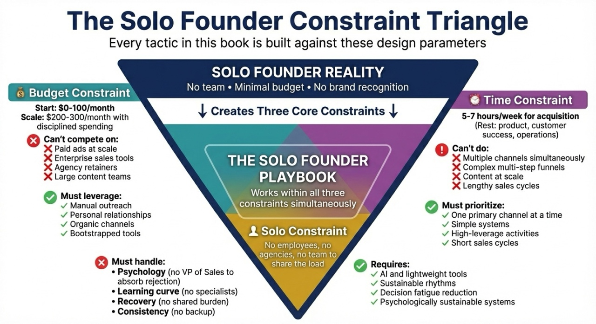

# Introduction: The Solo Founder's Dilemma

**As I was finishing this manuscript, a sales rep at a major cloud provider called me.**

Weeks earlier, a different rep from the same company had asked how he could support my project. I spent hours preparing a detailed document—my architecture, how I was using their services, how we might partner. Great meeting. He said it was fantastic and promised to follow up.

His next email was a cold outreach template. As if we'd never spoken.

So when this second rep started emailing, I ignored him. He persisted. Eventually he called and I picked up without checking the ID.

I agreed to one meeting. On the form I wrote exactly what I needed: clarity on billing, help avoiding surprise charges pre-revenue, understanding my developer credits. No tech help—I'd built the platform without them.

The meeting started. I explained my concerns.

It was as if I was invisible.

He wanted my forecast. $12,000 a year in cloud spend would qualify me for a "comprehensive demo." I told him I didn't need a demo—I'd already built the platform. He pivoted: I could increase spend by adding chatbots. I told him I'd already built those on my VPS. He kept pushing the forecast.

I cancelled my accounts and refactored everything to VPS that week.

**You've probably experienced a salesperson like this**—a SaaS vendor pushing enterprise tiers you didn't need, a platform rep upselling when you just wanted help with the pricing page. Experiences like these shape how many of us think about sales. They create a specific fear: *I don't want to become that person.*

You don't have to. This book teaches a diagnostic approach—listen first, solve real problems, let the customer decide. Your customers will actually want to talk to you.

There's also a structural lesson: **large vendors don't optimize for small customers.** If you're bootstrapping, managing burn, aiming for profitability before raising—their support model isn't built for you. Factor that into every vendor decision. Sometimes control and predictability matter more than features. (More on vendor decisions in Chapter 7.)

In independent SaaS surveys, roughly 55% of companies report a solo founder [1]. You are not the edge case. You are the norm. Yet almost everything written about customer acquisition assumes you are not.

**A note on scope:** This book uses US data and examples; the principles and playbooks apply internationally—adjust pricing, channels, and regulations to your market.

## You built something. Now you need to sell it.

You built something valuable. Maybe it's software that solves a problem you struggled with for years. Maybe it's a course that packages hard-won expertise. Maybe it's a service that helps people handle challenges you've already conquered. The building part, you figured out. The acquiring customers part is killing you.

This isn't a character flaw. It's a structural problem that almost every solo founder faces. You're one person doing the work of an entire company: product development, customer support, marketing, sales, operations, accounting. Customer acquisition is just one more plate to spin, except this particular plate determines whether all the other plates matter.

## The structural reality of building alone

Solo founders operate under constraints that generic playbooks ignore:

**Time.** Most solo founders have a few hours per week for customer acquisition. The rest goes to building and running the business.

**Revenue pressure.** A large share of indie and bootstrapped SaaS businesses earn under $1K in monthly revenue, and many founders spend 6–12 months or more just getting to that first $1K MRR—not because the product is wrong, but because distribution never caught up to development. You cannot compound revenue you never had time to acquire.

**Sales experience.** Many founders come from engineering, product, or specialist roles where "sales" was something other people did.

**Psychology.** Sales carries negative stereotypes for many people. Those associations don't disappear just because you founded a company.

Together, these form a clear pattern: solo founders operate with very little time, very little sales experience, and a deeply ambivalent relationship with selling—yet their survival depends on acquiring customers reliably.

## Why generic advice doesn't work for you

The single biggest cause of startup failure isn't "competition" or "product quality." It's "no market need." Sometimes that's a validation failure. But often, the product *could* solve a real problem, if only the right people knew about it. That's a distribution problem, and it's what this book addresses.

There's no shortage of advice on how to fix that. The problem is who that advice is written for:

| The Playbook | What It Assumes |
|--------------|-----------------|
| **Enterprise Sales** | SDRs filling calendars, AEs running demos, sales engineers handling technical depth |
| **VC Growth** | Five-figure ad budgets, dozens of experiments, "profitability later" mindset |
| **Creator Marketing** | An existing audience of 50k+ followers and hours to post daily |

If you're a solo founder selling $49–$5,000 offers with a limited budget and less than 7 hours per week for customer acquisition, much of that advice doesn't work. You cannot hire an SDR while you "focus on product." You cannot run 10,000-impression ad tests weekly. You cannot redesign your funnel three times a quarter.

Your constraints are different, so your acquisition system has to be different. This book treats those constraints as **design parameters**, not personal failures.

## The Solo Founder Constraint Triangle

This book is written for bootstrapped solo founders operating under three non-negotiable constraints. These are not obstacles to work around. They are the design parameters every tactic in this book is built against.

*Figure I.1: Solo Founder Constraint Triangle. The three non-negotiable constraints for bootstrapped solo founders: budget, time, and going solo. Every tactic in this book is designed against these parameters.*

1. **Budget constraint.** Most founders start spending $0–100 per month on tools and get their first customers through manual outreach, communities, and content. As you scale, $200–300 per month becomes a sensible investment with disciplined spending. This book does not assume five-figure campaigns or agency retainers.

2. **Time constraint.** You have 5–7 hours per week for customer acquisition. The rest goes to product, customer success, and operations. You cannot win with volume. Most founders win with precision—picking one primary channel at a time and building simple systems around it.

3. **Solo constraint.** There are no employees, no agencies, and no team to share the emotional or operational load. Everything must be executable by one person with AI and lightweight tools. That means systems that reduce decision fatigue and make selling psychologically sustainable.

Those constraints rule out paid ads at scale, enterprise sales tools, agency retainers, juggling five channels, complex multi-step funnels, and anything that depends on delegation or a team. They push you toward manual outreach, relationships, organic channels, focused effort on one acquisition path at a time, and systems one person can run sustainably.

Many solo founders reach $3,000–5,000 MRR with zero ad spend and minimal tooling. The promise of this book is simple: if a tactic requires more than a few hundred dollars a month, a dedicated team, or six-month sales cycles, it does not make it into this playbook.

The goal is to give you a **complete customer acquisition system** that works within these constraints, not despite them.

## What you'll walk away with

After reading this book and completing the exercises, you will have:

1. **A diagnostic sales mindset** that makes customer conversations feel like problem-solving, not performing (Chapter 1)
2. **A one-page Ideal Customer Profile** tight enough to stop wasting time on wrong-fit prospects (Chapter 2)
3. **A repeatable outreach system** you can execute in 5–7 hours per week (Chapters 3–4)
4. **Pricing confidence** backed by frameworks, not guesswork (Chapter 5)
5. **AI-assisted workflows** that multiply your output without replacing your judgment (Chapter 7)
6. **A 90-day execution plan** with weekly rhythms, metrics, and milestones (Chapter 10)
7. **Sustainability habits** that prevent burnout and keep acquisition consistent (Chapter 12)

No theory without application. No tactics that require a team. Just the systems that turn solo founders into $3K–$10K MRR businesses—and beyond.

## Why listen to me?

I'm not a guru. I'm a practitioner who's spent decades in the trenches and built the systems in this book under real constraints.

- **30+ years in enterprise tech and startups** — GE Technical Marketing Program, ran western region for a Unisys startup division, AirDefense, AeroScout, CIC. My job was turning technology into revenue: market research, IP strategy, pitch decks, negotiation, delivery.
- **Two wireless security patents** — I've done the technical depth that technical founders respect, and I know how to translate it into revenue.
- **14 years on Upwork, 100% client satisfaction** — I've acquired clients one conversation at a time, with no brand and no team, in a marketplace where most freelancers struggle to stand out.
- **Building SoloFrameHub while teaching it** — I coded and deployed an AI-first course platform and I'm running the acquisition playbook in public, turning it into the Academy that accompanies this book. Not theorizing—building.

This book focuses on the strategic frameworks for individual-first customer acquisition. For deeper, AI-supported implementation—training, practice, and ongoing support designed for solo founders—visit the [Solo Founder's Customer Acquisition Academy](https://soloframehub.com/solo-founders-ai-customer-acquisition-academy.html) at SoloFrameHub.com. The book stands alone; the academy helps you execute what you learn.

The frameworks here (PID, Prescription Frame, MVQ, the diagnostic discovery approach) aren't borrowed from a single bestseller. They're distilled from what actually worked across consulting, services, and product—for solo operators with limited time and budget.

## AI as your force multiplier

AI tools have made capabilities accessible that once required entire teams. A solo founder can now:

- **Research and personalize** outreach at scale (once a full-time SDR role)
- **Analyze discovery calls** for patterns (once a sales enablement role)
- **Generate and test content** without a marketing agency
- **Build automation workflows** without a developer

But the tools are only as good as the strategy behind them. AI-personalized cold emails targeting the wrong people are just faster spam. This book teaches you the strategy first, then shows you how AI amplifies it. Not the other way around.

## What this book does differently

Rather than starting with theory, the chapters are built around specific problems solo founders face:

- **You avoid sales** because it feels like an attack on your identity. Chapter 1 reframes selling as diagnosis, not performance.
- **You're not sure who to target.** Chapter 2 walks you through building an Ideal Customer Profile tight enough to avoid "build it for everyone, sell it to no one."
- **You can't afford spray-and-pray.** The outreach and pricing chapters focus on high-yield activities you can execute in a few focused hours per week.
- **You're overwhelmed by AI hype.** The automation material is about what actually saves time and generates revenue.

Underneath all of this is a simple premise:

> **Solo founders are not failed teams. They are a different species of business that deserves its own playbook.**

## Who this book is for

This book is for solo founders building real businesses. **Primary audience:** technical and creator founders who *are* the sales team—no hires, no agency, 5–7 hours a week for acquisition. Consultants and freelancers who want to systematize pipeline (not just deliver the work) are a strong secondary fit.

**This book is for you if:**

- You're the only person doing sales and marketing (or you have minimal help).
- Your offer is in the $49–$5,000 range—subscriptions, courses, consulting, or implementation.
- You have 5–7 hours per week (or less) for customer acquisition, not a full-time growth team.
- You've built something valuable but struggle with outreach, discovery calls, or closing without feeling pushy.
- You'd rather diagnose a customer's problem than pitch a generic solution.
- You're bootstrapped or running lean—no five-figure ad budgets, no SDR to hand leads to.

*Technical founders* building B2B products: you know the solution works but dread sales conversations. *Creator founders* selling courses or services: you have an audience but can't monetize without feeling sleazy. *Consultants and freelancers*: you're excellent at the work but stuck in feast-famine. The frameworks in this book (ICP, MVQ, Prescription Frame, diagnostic discovery) apply to all three—same system, different channels and offer types.

## Who this book is not for

If you're reading books about hiring SDRs and building sales teams, you're reading the wrong book. *Founding Sales* by Pete Kazanjy is excellent for founders who can hire their first sales rep within 12 months. This book is for founders who ARE the sales team.

If you're selling high-ticket coaching, local services, or consumer products, other books may serve you better. Alex Hormozi's *100M Leads* is powerful for businesses built on paid advertising and high-volume lead generation. This book is for founders selling $49–$5,000 offers where each customer relationship actually matters.

This book is not about manipulating people into buying things they don't need. If your product doesn't solve a real problem, no acquisition strategy will save you.

This book is not about growth at all costs. Every tactic here is designed for profitability, not just growth.

This book is not about becoming someone you're not. The approach here is diagnostic, not performative. You'll learn to be more effective without becoming someone you'd dislike.

| If you're considering… | That book assumes… | This book assumes… |
|------------------------|--------------------|---------------------|
| *Founding Sales* | You'll hire your first rep within 12 months | You *are* the sales team |
| *$100M Leads* | Paid ads and high-volume funnels | Organic channels, manual outreach, $0–300/month |
| *The Mom Test* | You need to validate demand and talk to customers | You've validated; you need to *close* and systematize |
| Generic enterprise playbooks | SDRs, AEs, budget, long cycles | Solo founder, 5–7 hrs/week, $49–$5,000 offers |

## How this book is organized

- **Part I: Psychology & Positioning (Chapters 1–3).** Reframing sales and finding your ideal customer.
- **Part II: Conversations & Conversion (Chapters 4–7).** Discovery calls, pricing with confidence, and using AI.
- **Part III: Systems & Metrics (Chapters 8–12).** Building repeatable habits and handling rejection.
- **Part IV: The Future (Chapters 13–16).** Your 90-day plan, Answer Engine Optimization, and your next 30 days.

You can read straight through, but you don't have to. If you're stuck on pricing, skip to Chapter 5. If your cold emails aren't working, start with Chapter 3. If you're burning out, Chapter 12 addresses sustainability.

**Appendices:** The **Appendix: Glossary** defines key terms (34 terms, A–Z style). The **Appendix: Framework Index** lists all methodologies with chapter references. **Appendix: Sources & Citations** is the unified bibliography. **Appendix: Complete Playbook Examples** (after Chapter 10) gives copy-paste playbook templates. Numbered references in the text [1], [2], etc. point to full citations at the end of the relevant chapter and in Sources & Citations.

Each chapter ends with an exercise. Don't skip them. Reading about customer acquisition doesn't improve your customer acquisition. Doing the exercises does.

## One thing before we start

I've written this book the way I wish someone had written one for me years ago. Not as a guru with all the answers. Not as someone selling a fantasy about passive income and four-hour workweeks. As a practitioner who's made the mistakes, learned from them, and is still learning.

Some of what I share will work perfectly for you. Some won't fit your market or your style. That's fine. Customer acquisition isn't paint-by-numbers. It's a set of principles you adapt to your specific situation.

What I can promise is this: every tactic in this book has been tested. Every framework has been refined through actual use. Every mistake has cost me something. Use it to compress your own learning curve.

The acquiring customers part doesn't have to keep killing you. Let's move on to Part I.

[1] MicroConf, *The 2022 State of Independent SaaS* report. https://issuu.com/microconf/docs/the_2022_state_of_independent_saas_7_. Survey shows 55% of respondents were solo founders (55% solo founder, 35% two co-founders, 8% three co-founders, 2% four or more).
