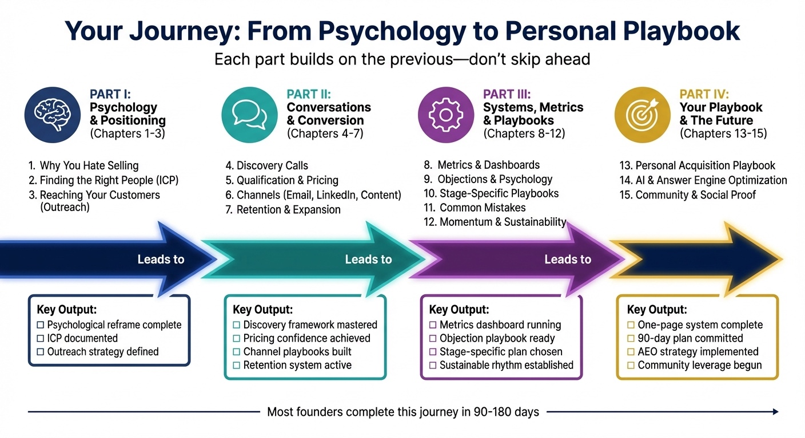

# PART I

## Psychology & Positioning

Most solo founders struggle with customer acquisition not because they lack skills, but because they're fighting their own psychology while targeting the wrong people. This section fixes both problems.

**Chapter 1** examines why sales feels threatening to builders and creators. Your discomfort with selling is actually a strength—you'll learn to reframe customer conversations in a way that aligns with your values instead of contradicting them.

**Chapter 2** gets specific about who deserves your limited time. Not "everyone who might buy"—that's a recipe for exhaustion. You'll define your Ideal Customer Profile: the people you can help most, who can pay you fairly, and who you'll genuinely enjoy working with.

**Chapter 3** covers the mechanics of reaching these people without being pushy or manipulative: where to find your ideal customers, how to start conversations that don't feel like "sales," and which channels actually work for solo founders.

## What You'll Have By the End

- A mental frame for sales that eliminates the identity threat
- A documented Ideal Customer Profile that guides every decision
- A strategy for reaching the right people through the right channels
- Outreach methods that feel authentic, not sleazy

Everything else in this book builds on this foundation. Get these three chapters right, and the rest becomes dramatically easier.

*Figure P.1: Your journey through this book. Psychology → Conversations → Systems → Your Playbook.*

**Turn to Chapter 1: Why You Hate Selling (And Why That's Actually Good News) to begin Part I.**
