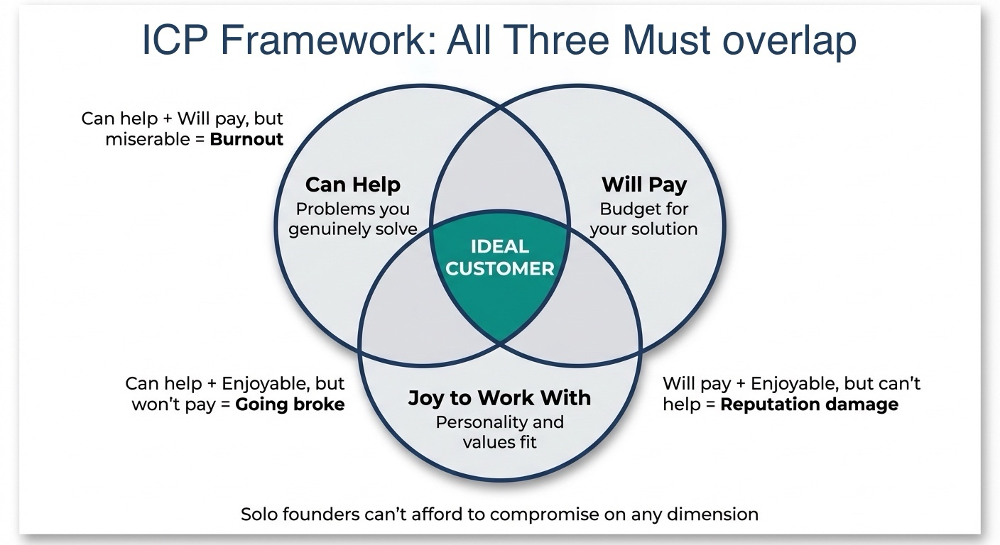

# Chapter 2: Finding the Right People to Talk To

Half of every founder's sales effort goes toward people who were never going to buy. Research on B2B sales qualification bears this out: 40–60% of deals end in "no decision" rather than competitive loss, and approximately 50% of prospects in a typical pipeline are unqualified [1]. The difference qualification makes is dramatic—52% win rates with complete qualification versus 7% with none (Sandler Institute research) [2].

The pattern is predictable: founders accept anyone who shows interest. Startups with no budget. Enterprises with eighteen-month procurement cycles. Clients who want extensive work for minimal investment. Prospects who can't articulate what they actually need.

Every call drains energy. Most go nowhere. The wrong-fit deals that do close often become nightmares—scope creep, payment chasing, and customers fundamentally mismatched with what you offer.

The problem isn't skills or offer quality. The problem is undefined targeting—and qualification is the highest-leverage activity for time-constrained founders.

## The Expensive Mistake of Selling to Everyone

When you're desperate for revenue, any customer looks good. This is a trap. Many of the people you're spending time on were never going to buy—no matter how good your pitch or how persistent your follow-up. Every hour on the wrong prospect is an hour not spent on the right one.

Enterprise sales teams have clear qualification criteria and the pipeline volume to enforce them strictly. But solo founders with 20–30 prospects can't "walk away firmly" from half of them—you need a different approach.

Instead of binary qualify/disqualify, think in tiers: A-tier prospects (perfect fit, prioritize heavily), B-tier (good fit, pursue if time allows), C-tier (marginal fit, keep warm but don't invest heavily). That lets you focus energy appropriately without abandoning opportunities you might need.

You need somewhere to *do* that prioritization. When a deal seems possible, record it: in a CRM deal pipeline (e.g. a deal stage plus a tier or tag like A/B/C), or in a simple tool like Notion, Airtable, or Google Sheets with a column for tier. Segment or filter by tier so you see A-tier first. Prioritization only works if you make it visible—in whatever system you actually update.

## What an Ideal Customer Profile Actually Is

Enterprise qualification frameworks like BANT and MEDDIC were designed for large sales teams chasing six-figure deals with multiple stakeholders. If you're a solo founder selling $49–$5,000 offers, you need lighter, adapted versions—the full enterprise playbook is overkill.

An Ideal Customer Profile (ICP; see Appendix: Glossary) isn't a demographic checkbox exercise. It's not "marketing managers, 28–45, in tech companies." That tells you almost nothing useful.

A real ICP answers one question: Who can I help the most, who will pay what I need to charge, and who will be a joy to work with?

Those three elements (help, pay, enjoy) form three overlapping circles. If a customer fits two but not three, you'll regret taking them on.



*Figure 2.1: The ICP Framework. Your ideal customer sits at the intersection of three circles: people you can genuinely help, people who will pay what you need to charge, and people who are a joy to work with. Compromise on any dimension and you'll pay for it in burnout, broken finances, or damaged reputation.*

- Can help + will pay, but miserable to work with? You'll burn out. Can help + enjoyable, but won't pay enough? You'll go broke. Will pay + enjoyable, but you can't actually help them? You'll destroy your reputation.

> **⚠️ Common Mistake: Defining ICP too broadly**
>
> Trying to serve everyone means serving no one. Your ICP should be specific enough to filter 90% of potential customers OUT.
>
> **Why it happens:** Founders worry about limiting their market and missing opportunities, so they keep targeting broad.
>
> **What to do instead:** Narrow your ICP to a specific person with specific characteristics facing specific problems. You can always expand later—start narrow, dominate that niche, then expand from a position of strength.

> **Case Study: Flowjin—Building for 50 People, Not 50,000**
>
> **Problem:** "Content creators" is a market of millions—impossible to message clearly. Twitter didn't let users download their own Spaces recordings.
>
> **Solution:** Founder Juliana Hahn built exclusively for Twitter Space hosts in web3 (~50 people). Single pain point, single solution. "Build for 10 people first, not 10,000."
>
> **Result:** That community became Flowjin's most loyal customers—word spread fast, premium pricing justified, lower CAC. What looked "too narrow" was perfect focus. Your ICP should be narrow enough that most people think you're crazy.

## The B2B ICP Framework

> **Founder-Type Note:** This section applies primarily to B2B SaaS founders and consultants selling to businesses. If you're a coach or creator selling to individuals, see "The Creator ICP Framework" below. The principles are similar, but the characteristics you're evaluating differ.

If you're selling to businesses—even one-person operations—think about the company and the person separately.

**Company characteristics:**

- Industry or vertical
- Size (employees, revenue, or both)
- Stage (startup, growth, mature)
- Geography (if relevant)
- Technology stack (if selling technical products)
- Budget cycle timing

These matter because selling to a 10-person startup is fundamentally different from selling to a 500-person mid-market company. The startup might buy on a founder's whim after a 15-minute conversation. The mid-market company has procurement processes, budget committees, and security reviews.

**Person characteristics:**

- Job title and function
- Decision-making authority
- Pain points specific to their role
- How they measure success
- What gets them promoted (or fired)

The last point matters more than most founders realize. If you understand what gets someone promoted, you understand what they'll pay attention to. A VP of Sales who's measured on pipeline growth will care about lead generation. A VP of Sales who's measured on close rates will care about sales enablement. Same title, different priorities.

A common pattern: founders start with vague targeting like "IT managers at enterprises" and wonder why outreach falls flat. After analyzing their best customers - the ones who implemented quickly, renewed consistently, and referred others - the specificity emerges.

> **Case Study: Security Consulting Team (Mid-Market Financial Institutions)**
>
> **Problem:** A security team was doing free or heavily discounted implementation work for anyone who showed interest—exhausting, low margin, no clear ICP or path to profitable engagements. They had no outbound marketing.
>
> **Solution:** We defined a focused ICP: mid-sized financial institutions needing independent security assessments for boards, regulators, and insurers (no product-selling agenda). We mapped personas (CISOs, Heads of IT), triggers (audit findings, board pressure, regulatory changes), and repositioned the firm around fixed-scope, paid assessments. I recommended targeted email outreach and rebuilt their website messaging to speak directly to the ICP.
>
> **Result:** Reply rates jumped from typical 3-5% to 12-18% because messaging matched a specific, high-intent audience. The team started closing paid assessments instead of free pilots. Follow-on work—annual reassessments, remediation roadmaps, board reporting—created predictable recurring revenue with the same client type.

## The Creator ICP Framework

> **Founder-Type Note:** This section applies to coaches, consultants selling to individuals, and creators selling digital products. If you're a B2B SaaS founder, the "B2B ICP Framework" above is more relevant. The underlying logic (help, pay, enjoy) is identical, but the characteristics you evaluate differ.

If you're selling courses, coaching, or digital products, your ICP looks different but the underlying logic is identical: Who can I help the most, who will pay what I need to charge, and who will I enjoy working with? You're typically selling to individuals, so "company characteristics" become "life situation characteristics."

**Situation characteristics:**

- Career stage
- Income level or business revenue
- Current challenge or goal
- Failed solutions they've already tried
- Trigger event that created urgency

**Person characteristics:**

- Self-awareness about the problem
- Willingness to invest in solutions
- Ability to implement what you teach
- Coachability
- Expectations that match what you deliver

The uncomfortable truth: not everyone can be your customer. The sooner you accept this, the faster you'll grow.

> **Case Study: Psychiatric Practice—Adjacent ICP for Leverage**
>
> *(This is an advanced example. Your first ICP draft can be much simpler.)*
>
> **Problem:** A psychiatric practice had grown to four practitioners and wanted to expand beyond traditional 1-to-1 appointments.
>
> **Solution:** Instead of a conventional marketing campaign, I recommended practitioner-led digital wellness education—courses and programs targeting an adjacent ICP: people seeking mental health education and self-management skills, not necessarily ready for clinical care. This expands the top of the funnel with a scalable offering that doesn't require additional clinician hours.
>
> **Result:** The digital wellness academy creates cash-pay revenue independent of insurance reimbursement and serves as a pipeline for clinical services—learners who resonate with the content move toward patient appointments. The architecture is designed to be reusable across other practices.
>
> **Takeaway:** When a client's existing ICP is profitable but growth is limited by delivery capacity, look for adjacent ICPs that create leverage without adding headcount.

## The Pain-First Approach

Research on 35,000+ sales calls (Huthwaite International, 12-year study) proved that consultative selling focused on pain identification dramatically outperforms traditional pitch-based approaches [3]. The key insight: in complex sales, the quality of your questions beats the quality of your pitch every time.

Generic demographics don't convert. Pain converts.

The most reliable way to build your ICP is to start with the pain you solve, then work backward to who experiences that pain most acutely.

**Step 1: Define the pain precisely.**

Not "they struggle with marketing." That's too vague.

Better: "They're getting traffic to their website but no one is booking calls."

Even better: "They're getting 500+ visitors per month but less than 1% convert to sales calls, and they've already tried cheaper solutions like chatbots that didn't work."

**Step 2: Identify who feels this pain most intensely.**

Who wakes up at 3 AM worrying about this? Who has tried multiple solutions and failed? Who has budget specifically allocated to solving this problem?

The more acute the pain, the easier the sale. If someone has mild discomfort, they'll put off the decision indefinitely. If they're bleeding, they want surgery now.

**Step 3: Determine who can pay.**

Pain without budget is a dead end. Countless founders have conversations with people who genuinely need help and genuinely can't afford it. Those conversations cost both parties time and create false hope.

Be realistic about what your ideal customer can actually pay. A solo consultant struggling to hit $5K/month is probably not your ideal customer for a $10K coaching program. A funded startup burning $100K/month probably isn't your ideal customer for a $200/month SaaS tool.

**Step 4: Add the "joy" filter.**

You'll spend hours with these people. Do you want to?

A clear ICP changes everything downstream: sharper messaging, faster qualification, higher close rates. The work you do defining it pays dividends in every sales conversation.

## Validation: Testing Your ICP

An ICP that exists only in your head is worthless; test it against reality.

**If you have customers:** Examine who's working well. Not just who pays the most, but who gets the best results, who renews or refers, who you actually enjoy serving. Look for patterns in what makes them great fits.

**If you don't have customers yet (most readers):** Your ICP is a hypothesis, not a fact. That's fine. Your first 5–10 customers will almost certainly be imperfect fits who teach you what actually works. Start with your best guess about who you can help. Interview people who match your hypothetical ICP, not sales calls, but research conversations. You're testing assumptions, not closing deals.

The real validation happens through doing: your first customers reveal patterns you couldn't have predicted. By customer 10, you'll see real clarity about your true ICP. Document what you learn. Revise your ICP monthly in the first year.

**Questions that reveal ICP fit:**

- "What's the biggest challenge you're facing with \[problem area] right now?"
- "Have you tried to solve this before? What happened?"
- "If you could wave a magic wand and fix this, what would be different six months from now?"
- "Is this a priority right now, or more of a someday thing?"
- "Have you set aside resources to solve this?"

Listen for intensity. When someone describes their pain like a minor inconvenience, they're not your ideal customer. When someone describes it like it's ruining their life, pay attention.

## The Disqualification Mindset

Research on sales qualification shows a dramatic correlation between qualification rigor and win rates: [2]

| Qualification Level | Win Rate |
|---------------------|----------|
| Complete (Pain + Budget + Decision) | **52%** |
| Pain + Budget only | 31% |
| Pain only | 14% |
| No structured qualification | 7% |

Complete qualification converts at 7.4x the rate of no qualification. The Sandler Institute's core principle: "You should be as willing to disqualify a prospect as you are to qualify them."

Most founders focus on finding reasons to work with someone. Flip this.

Look for reasons to disqualify people.

This sounds harsh, but it's actually respectful of everyone's time. If someone isn't a good fit, spending months pursuing them doesn't help either of you. The faster you identify misfit, the faster you can both move on.

Here we're defining who belongs in your pipeline in the first place.

**Common disqualification signals:**

**"No budget right now, but..."**
Translation: There will never be budget. Budget is created for priorities. If they haven't created budget for this, it's not a priority.

**"I need to check with my partner/boss/board."**
Translation: They can't make this decision. You're talking to the wrong person.

**"We're looking at several options."**
Not necessarily a disqualifier, but probe deeper. If they're comparing you to radically different solutions, they probably don't understand what you offer.

**"This sounds great - let me think about it."**
Translation: "No, but I'm too polite to say it." People who want to buy don't "think about it." They ask questions about implementation, timing, and next steps.

**"Can you send me more information?"**
Translation: "I want to end this conversation without confrontation." Real buyers ask specific questions, not for generic information.

Not every person who says these things is wasting your time. But these phrases are yellow flags that warrant deeper qualification before investing more energy.

## Documenting Your ICP

Your ICP needs to exist outside your head; writing it down forces clarity and makes it teachable if you ever bring on help.

A proven format:

**For B2B:**

```
Company: [Industry], [Size range], [Stage], [Geography]
Person: [Title/Role], [Reporting structure]
Pain: [Specific problem, in their words]
Trigger: [What event creates urgency]
Budget: [Range and source]
Timeline: [Typical decision cycle]
Disqualifiers: [Automatic no-go criteria]
```

**Example (B2B consulting):**

```
Company: Professional services firms (accounting, law, consulting), 10–50 employees, established 5+ years, US-based
Person: Managing Partner or Marketing Director, makes or heavily influences technology/marketing decisions
Pain: "We're getting referrals but not enough. We tried content marketing and it didn't work. We need leads that don't depend on our personal network."
Trigger: Lost a major client, new partner wants to grow their book, or preparing for eventual exit/succession
Budget: $3K-10K/month, typically comes from marketing line or partner distributions
Timeline: 30–60 days from first conversation to engagement
Disqualifiers: No dedicated marketing budget, under $1M revenue, partners disagree about growth strategy
```

**For Creator businesses:**

```
Person: [Life/career stage], [Income/revenue level], [Key demographic if relevant]
Situation: [Current state], [Goal state], [Failed attempts]
Pain: [Specific problem, in their words]
Trigger: [What event creates urgency]
Budget: [How they think about this purchase]
Mindset: [Attitudes that predict success]
Disqualifiers: [Automatic no-go criteria]
```

**Example:**

```
Person: Service-based solo business owner, $75K-200K annual revenue, 2–5 years in business
Situation: Overwhelmed by fulfillment, can't grow without working more hours, knows they need to productize but doesn't know how
Pain: "I'm maxed out. I can't take more clients without destroying my life. But I also can't raise prices because I'm trading time for money."
Trigger: Burned out after a big launch, turning away clients, or facing a life change (new baby, health issue) that demands more time
Budget: Willing to invest $2K-5K because they understand the ROI of freeing up time
Mindset: Takes responsibility, implements quickly, values results over credentials
Disqualifiers: "Just starting out," wants get-rich-quick solutions, needs hand-holding on basic business fundamentals
```

## Personas and Customer Journey: Who You're Talking To, and Where They Are

Your ICP answers *which kinds* of people or businesses are worth your limited time. Two more tools sharpen how you talk to them and when: **personas** (who you're actually talking to) and **customer journey** (from "never heard of you" to "raving fan"). ICP = who's a good fit; persona = who says yes and what they care about; journey = where they are in the buying path right now.

**Persona: one human inside your ICP.**

A persona is a fictional but evidence-based *individual* that represents a segment inside your ICP. Where the ICP describes a *type* (industry, situation, budget, problem severity), a persona describes *one person*: their goals, fears, objections, and the phrases they use. For B2B: "the technical founder who hates selling" or "the head of ops under board pressure." For creators: "the overwhelmed engineer," "the burned-out therapist," or "the aspiring creator stuck at 1K followers." One to three personas is enough; they make messaging feel written for a specific human, not a category.

**Typical persona fields (solo founder version):**

- Role or life stage (how they describe themselves)
- Goals (what they want to achieve)
- Fears and objections (what holds them back, what they say when they're hesitant)
- Definition of success (how they'll know it worked)
- Phrases they use (language to mirror in your content and outreach)

**Customer journey: the path from stranger to advocate.**

The journey is the sequence of stages: **awareness** → **consideration** → **decision** → **retention** → **advocacy**. For B2B this maps cold email or LinkedIn to signed contract and expansion; for creators, from first content or lead magnet to enrollment, completion, and renewal.

ICP = who gets your time; personas = how to craft messages that resonate; journey = what to say and offer at each stage.

## Where to Find Your Ideal Customers

Once you've defined your ICP and personas, the next question is: where do these specific people already spend time?

**For B2B:**

LinkedIn Sales Navigator is the starting point for most solo founders. At $80–100/month for the Core tier (or $79.99/month billed annually, as of Q1 2026), it's the most cost-effective way to find specific job titles at specific company types [6].

The power is in the filters:

- Industry
- Company size
- Title keywords
- Geography
- Job changes in the last 90 days — people in new roles are significantly more likely to buy new solutions in their first 90 days [4]. Set up saved searches to get alerted automatically.
- Posted on LinkedIn in the last 30 days — eliminates ghost accounts who won't see your outreach

Boolean search operators (AND, OR, NOT, parentheses) let you get surgical: `(Coach OR Consultant) AND (Fitness OR Wellness) AND "Owner"` finds exactly the intersection you want.

Beyond LinkedIn, consider where your ICPs gather: industry conferences (even virtual), trade publications, Slack communities, subreddits, podcasts they listen to.

**LinkedIn as a data source** (using Sales Navigator to find prospects, then enriching emails via tools like Kanbox for cold email campaigns) gives the highest quality leads—this is different from LinkedIn messaging/connection requests, which is a separate channel. Purchased lists are generally low-quality. Conference attendee lists work surprisingly well.

**For Creators:**

Your ideal customers are consuming content somewhere. Where?

- YouTube (comments on videos about your topic)
- Podcasts (who hosts shows your ICP would listen to?)
- Newsletters (who's already reaching your audience?)
- Communities (Slack, Discord, Circle, Facebook groups)
- Social platforms (LinkedIn for B2B-adjacent creators, Instagram/TikTok for consumer)

Justin Welsh built a multi-million dollar business by becoming highly visible where his ideal customers already spend time: LinkedIn [5]. He didn't try to create a new gathering place. He showed up where they were.

The "building in public" approach works because it attracts self-selected prospects. When you share what you're building, the people who resonate with it are more likely to be good fits than people you cold-approach.

Newsletter partnerships are another underused channel. Find creators who reach your ideal audience but don't compete directly. Offer cross-promotions or sponsored placements. A mention in the right newsletter can generate better leads than months of cold outreach, because the readers already trust the source.

An effective approach: guesting on podcasts your ICPs listen to. Don't start your own podcast (that's a long-term play). Guest on ten existing ones. Each appearance is a warm endorsement from a trusted voice, plus content you can repurpose. Go where your ideal customers already gather—don't build a new gathering place from scratch.

## The Ongoing Refinement

Your ICP isn't static. It evolves as you learn.

Every customer interaction and every deal you win, lose, or walk away from refines your understanding of who you're really serving.

Build a habit of reviewing your ICP quarterly. Ask:

- Who were my best customers in the last 90 days? What made them great?
- Who were my worst fits? What should have warned me earlier?
- What patterns am I seeing in objections or deal failures?
- Have my disqualification criteria changed based on experience?

Founders typically revise their ICP three or four times in their first two years. Each revision makes sales more efficient. By the time the ICP matures, win rates are dramatically higher because they're only pursuing people who match their evolved understanding.

## The Courage to Say No

The hardest part of ICP discipline isn't intellectual. It's emotional.

When someone wants to give you money and doesn't fit your ICP, saying no takes courage. Especially when you're early-stage and every dollar feels critical.

But saying yes to the wrong customer has costs:

- Time that could go to right customers
- Energy drained by friction
- Reputation damage if outcomes are poor
- Mental bandwidth consumed by problem clients
- The opportunity cost of the right customer you couldn't serve because you were busy with the wrong one

## Chapter Summary: TL;DR

**The core insight:** Half of every founder's sales effort goes toward people who were never going to buy. Your ICP (Ideal Customer Profile) is the intersection of three circles: people you can help, people who will pay, and people who are a joy to work with. Compromise on any dimension and you'll pay for it. Add 1–3 personas inside your ICP so messaging feels written for a specific human, and map the customer journey (awareness → consideration → decision → retention → advocacy) so you know what to say and offer at each stage.

**Key takeaways:**
- 50% of prospects in typical pipelines are unqualified; ICP criteria differ for solo founders (customers who pay quickly, implement independently)
- B2B ICP: company AND person characteristics; Creator ICP: situation AND person characteristics
- Personas: evidence-based individuals inside your ICP (goals, fears, objections, phrases); journey: awareness → consideration → decision → retention → advocacy
- Your ICP should filter 90% of prospects OUT
- Test your ICP with real outreach, not theory

**Next:** Reaching your ideal customers.

---

## The Exercise: Build Your First ICP Draft

Create a first draft of your ICP. You can use the templates above or create your own format. The structure matters less than the thinking.

Answer these questions:

1. **Who are your best customers (or best hypothetical customers)?** Think about specific people, not abstractions. Give them names if it helps.
2. **What pain do they have that you solve?** Write it in their words, not yours. How would they describe this problem to a friend?
3. **What trigger event creates urgency?** Why would they buy now versus six months from now?
4. **What can they pay?** Be specific about a range.
5. **What are your automatic disqualifiers?** Name at least three things that would make you walk away, no matter how interested the prospect seems.

**Optional (personas and journey):**
6. **Who is one specific persona inside your ICP?** Give them a name or type (e.g. "the technical founder who hates selling"). What are their goals, fears, objections, and a phrase they'd use?
7. **Where do they typically enter your world?** Awareness (first content or outreach), consideration (evaluating you), decision (buying or enrolling), retention (using and staying), or advocacy (referring)? What do you want to say or offer at each stage?

This draft will be wrong. That's fine. The point is to have something concrete to test and refine. Every customer conversation from here on becomes a data point that improves your ICP.

---

## Chapter Checklist

**Complete before continuing:**

- [ ] Written your ICP hypothesis (1-2 pages)
- [ ] Identified your three circles: who you can help, who will pay, who you'll enjoy working with
- [ ] Written a specific ICP statement using the format provided
- [ ] Listed at least 3 automatic disqualifiers
- [ ] Sketched 1–3 personas inside your ICP (goals, fears, objections, phrases they use)
- [ ] Mapped the customer journey for at least one persona (awareness → consideration → decision → retention → advocacy)
- [ ] Identified where your ideal customers gather

**Self-assessment questions:**
- Could I use my ICP to filter 100 prospects down to the 10 most likely to buy?
- Is my ICP specific enough to filter 90% of prospects OUT?
- Have I thought about both company AND person characteristics (for B2B) or situation AND person characteristics (for creators)?
- Do I know which persona I'm talking to when I write content or outreach?
- Do I know what stage (awareness, consideration, decision, etc.) each touchpoint serves?

The ICP work you do now will pay dividends for years. Outreach, discovery, qualification, and closing all get easier when you're talking to the right people from the start.

[1] Gassee, P., "The Greatest Sales Mistakes Founders Make," paulgassee.com, 2024. Research indicates ~50% of prospects in a typical founder's pipeline are unqualified and never convert; 40–60% of B2B deals end in "no decision" rather than competitive loss (Sandler Institute research).

[2] Sandler Institute research on qualification completeness and win rates. https://www.sandler.com/our-research/. Complete qualification (Pain + Budget + Decision) achieves 52% win rates versus 7% with no structured qualification—a 7.4x improvement. The Sandler Method emphasizes "prescription before diagnosis is malpractice."

[3] Rackham, N., *SPIN Selling*, McGraw-Hill, 1988. Based on Huthwaite International analysis of 35,000+ sales calls across 12 years (1976–1988). Key finding: in complex sales, the quality of questions beats the quality of pitch.

[4] LinkedIn, "What You Need to Know About Decision Maker Job Changes," LinkedIn Sales Blog, 2024. https://www.linkedin.com/business/sales/blog/b2b-sales/what-you-need-to-know-about-decision-maker-job-changes. Job changers are significantly more likely to buy new solutions in their first 90 days.

[5] Welsh, J., "Nobody Is Coming to Save You," justinwelsh.me newsletter, 2024. https://www.justinwelsh.me/newsletter/nobody-is-coming-to-save-you. Justin Welsh built a multi-million dollar business using LinkedIn as primary customer acquisition channel.

[6] LinkedIn Sales Solutions pricing page, Q1 2026. Sales Navigator Core: $79.99/month billed annually or ~$100/month billed monthly.
