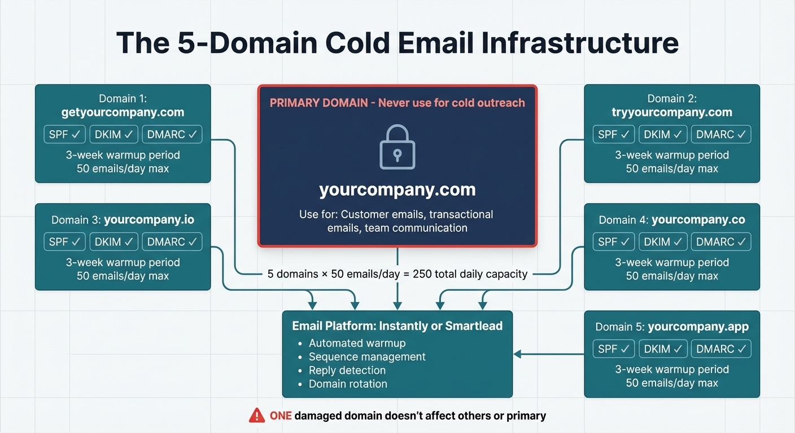

# Chapter 3: Cutting Through the Noise

Your ideal customer is drowning in messages.

They're bombarded with email, LinkedIn connection requests from strangers pushing webinars, and DMs full of "quick question" messages that are actually pitches. Every platform they use is saturated with people trying to get their attention.

Most of that outreach gets ignored, not because the products are bad, but because the approach is wrong.

The real finding isn't "volume is bad." It's that **volume without relevance doesn't work**. A cold email infrastructure capable of sending 1,000 emails a week will still get crickets if the messages are generic; the same infrastructure, pointed at 50–250+ highly targeted messages a day, can reliably generate real conversations once your messaging and ICP are dialed in.

The data backs this up. Belkins' 2025 analysis shows small, tightly targeted campaigns (under 100 recipients) averaging about 5.5% reply rates, while untargeted campaigns blasted to 1,000+ recipients drop to roughly 2.1% or lower [1]. **Important distinction:** These baseline statistics represent manual or semi-manual targeting—selecting the right companies and titles, but without AI-powered deep personalization at scale.

> **Founder-Type Note:** Cold email works best for B2B SaaS founders and consultants selling to businesses. For coaches and creators, LinkedIn engagement and community participation often generate better results than cold email.

A four-stage AI-assisted workflow—prospecting tool → enrichment → AI personalization → sending platform—adds multiple sophistication layers beyond basic targeting: ICP-based segmentation, AI analysis of posts/company descriptions/career trajectories, behavioral-style-matched messaging, and human-refined personalization. In practice, personalization consistently lifts reply rates versus generic outreach.

Mass-blast outreach is mathematically inefficient—you burn your domain reputation reaching people who don't care. The better approach: prove a message works on 1 or more targeted batches, then scale it to more of the right people.

> **⚠️ Common Mistake: Volume over personalization**
>
> Sending 1,000 generic emails instead of 50 personalized ones burns your domain and produces worse results.
>
> **Why it happens:** Volume feels productive—more emails sent means more opportunities, right? Wrong. Generic messaging gets ignored.
>
> **What to do instead:** Test with 30–50 highly personalized messages first. Prove you can get replies. Then scale *that working approach* gradually—100/week, then 500, then 1,000+—using AI-assisted hyper-personalization to maintain quality at volume. The goal isn't staying small; it's scaling what works. With the right AI workflows (prospecting → enrichment → AI personalization → sending), 5,000+ personalized emails per month is achievable while maintaining the quality that gets replies.

Using the ICP framework—the intersection of who you can help, who will pay, and who's a joy to work with—you've defined who your ideal customers are. Now we need to answer three questions: How do you find them? How do you reach them? And how do you start conversations that actually convert?

The difference isn't tactics. It's thinking like the person receiving your message instead of thinking like the person sending it.

## Why Most Outreach Fails

Most outreach dies for four reasons:

- **It's about you, not them.** "I'd love to show you how we can help..." signals a sales pitch immediately. Noise.
- **It's generic.** "Hi \[First Name], I noticed you work at \[Company Name]..." The merge tags are visible. No signal you know anything about them.
- **It asks for too much too soon.** "Would you have 30 minutes this week?" You're asking a stranger to commit significant time based on a cold message.
- **It doesn't earn the right to ask.** Before you can ask for their time, you need to give them a reason to say yes. Most messages are all ask, no give.

## The Warmup Principle

Cold outreach to a complete stranger almost always underperforms warm outreach to someone who's already encountered you.

Think about your own behavior. When you get a LinkedIn request from a name you recognize—someone whose content you've seen, or who commented thoughtfully on your post—you're far more likely to accept than a request from a complete stranger.

The warmup principle is simple: create touchpoints before you make the ask.

**The sequence:**

1. **Visibility.** They've seen your name in a context that positions you as credible.
2. **Value.** They've gotten something useful from you—a comment, a resource, an insight.
3. **Connection.** Now you reach out directly.
4. **Conversation.** The ask comes after trust is established.

This takes longer than blasting cold emails. It's also dramatically more effective.

Research and practitioner benchmarks on LinkedIn outreach consistently show higher acceptance rates when prospects have seen you before. The pattern: engage with their content first—a thoughtful comment on their post, a reaction to their article. When the connection request arrives, they recognize the name.

**3-step LinkedIn warmup (Week 1–3):**  
**Week 1:** Engage with their content (1–2 thoughtful comments).  
**Week 2:** Send a short connection request referencing something specific.  
**Week 3:** Send a value‑first message (question, insight, or resource).

**Case Study**
**Problem:** A business coach's cold LinkedIn requests were stuck around 22% acceptance, and almost none of those connections turned into actual conversations or discovery calls.
**Solution:** She warmed up 50 prospects over two weeks with thoughtful comments, then sent personalized connection requests.
**Result:** Acceptance jumped to 78% (39/50) and, more importantly, produced 5 discovery calls and 2 clients in 60 days ($8,000 from ~10.5 hours of work).

## LinkedIn: A High-Leverage Channel for Many Solo Founders

For many B2B SaaS founders and consultants, LinkedIn is often the highest‑leverage outreach channel. For creators and coaches, LinkedIn can be effective, but community engagement or other platforms may work better depending on where your ideal customers gather.

**Important 2026 LinkedIn Algorithm Changes:**

LinkedIn's algorithm shifted significantly in 2026. The practical implications are simple:

- **External links reduce reach:** Put the value in the post; move links to comments.
- **Comments > Likes:** Prioritize conversation‑worthy posts.
- **Pods backfire:** Authentic engagement beats coordinated activity.

These changes favor authentic, value-first content over promotional tactics—which aligns perfectly with the solo founder's natural advantage of being a real person, not a faceless brand.

**Setting Up Your Profile for Outreach**

Before you send a single message, your profile needs to work for you.

**Profile essentials:**
- **Headline:** Who you help + outcome.
- **Featured:** Proof (case study, testimonial, best content).
- **About:** Speak to their problem in second person.

**The Connection Request**

Keep connection requests short and specific. Reference something relevant, don’t pitch, and make it easy to say yes.

**Using Sales Navigator (or Free LinkedIn) to Find Your People**

**Sales Navigator vs. free:** Free LinkedIn search works for basic prospecting—you can filter by title, company, and location. Sales Navigator (see Chapter 2 for current pricing) adds advanced filters (company size, job changes, recent activity) and InMail credits. If you're just starting out and budget-constrained, free LinkedIn is viable. Once you're doing 20+ prospecting sessions per month, Sales Navigator pays for itself in time saved.

Sales Navigator helps you filter by industry, company size, title, geography, and recent activity. Start smaller than you think: a tight list of 20–30 people per week beats a loose list of 200.

**The Follow-Up Message**

Once connected, wait a few days before you message. Lead with a question or a useful resource, not a pitch.

These messages invite conversation. They don't demand commitment. They give the recipient an easy, low-friction way to engage.

**Weekly cadence (lightweight):**
- **Monday:** Identify 20–30 prospects.
- **Tuesday–Thursday:** Engage with 1–2 posts per prospect.
- **Friday:** Send 15–25 connection requests and 5–10 value‑first messages.

Stay under 100 connection requests per week to avoid LinkedIn restrictions. This keeps outreach consistent without overwhelming your week or triggering platform limits.

**Post‑connection message templates:**
1. **Research ask:** “I’m interviewing \[role] leaders about \[problem]. Would you be open to a 2‑minute perspective question?”
2. **Resource offer:** “I put together a short checklist on \[topic]. Happy to send if useful.”
3. **Curiosity opener:** “You’ve been at \[company] for a while—what changed most about \[their function] this year?”

## Cold Email: Still Effective When Done Right

Cold email isn't dead, but it requires more technical sophistication than it did five years ago.

Google and Yahoo implemented strict sender requirements in February 2024, and enforcement escalated dramatically in November 2025. If you don't have proper authentication—SPF (Sender Policy Framework), DKIM (DomainKeys Identified Mail), and DMARC (Domain-based Message Authentication)—your emails will land in spam. For senders of more than 5,000 emails per day, you must maintain a spam rate below 0.1% or face permanent rejection (Gmail/Yahoo bulk sender requirements, November 2025)[2]. Microsoft followed suit for Outlook/Hotmail in May 2025 with similar enforcement. The threshold to watch is 0.1%—that's where deliverability starts to degrade, and non-compliant emails are now permanently rejected rather than just filtered to spam.

These aren't optional suggestions. They're hard requirements. Founders routinely spend months building lead lists and crafting messages, only to have everything land in spam because they skipped the technical setup.

**The Infrastructure Requirement**

Never send cold outreach from your primary domain. If that domain gets blacklisted, your transactional emails (invoices, receipts, customer communications) will fail too.

Set up at least one separate domain for cold outreach. If you're sending 30–50 personalized emails weekly (typical for early-stage solo founders), one dedicated outreach domain with proper authentication is enough. Start there.

The multi-domain infrastructure (3–5 domains) becomes relevant when you're sending 200+ cold emails weekly and have validated that your messaging works. Until then, it's overkill—you'll spend more time managing domains than sending emails.

**For most solo founders starting out:**
- One outreach domain (something like "get[company].com" or "try[company].com")
- Proper SPF, DKIM, and DMARC authentication
- 2–4 week warmup period before real campaigns
- Stay conservative at 30–50 emails/day/domain

**Setup sequence (simple, not fancy):**
1. **Buy a look‑alike domain** and create one dedicated inbox (e.g., hello@trycompany.com).
2. **Authenticate** the domain (SPF/DKIM/DMARC) and test with a deliverability checker.
3. **Turn on warmup** and let it run for 3–4 weeks while you build your list.
4. **Build a small, high‑quality list** (start with 30–50 people who fit your ICP perfectly).
5. **Write one strong message** and personalize the first line for each prospect.
6. **Send small batches** (10–20/day) and monitor replies.
7. **Iterate weekly**: adjust targeting or messaging based on replies, not opens.

This sequence is intentionally slow. Start smaller than you think, prove you can get replies, then scale.

**When you've proven the approach works and need to scale:**



*Figure 3.1: Multi‑domain setup for scale; most solo founders won’t need this complexity.*

Here's the technical checklist for each domain:
- SPF/DKIM/DMARC authentication
- One‑click unsubscribe (required by major providers)
- Comply with CAN‑SPAM/GDPR where applicable

**Compliance summary:** Include accurate sender info, make opt‑out easy, and honor removals immediately.

**Critical for EU/UK:** GDPR restricts unsolicited B2B email more than US law does. You generally need "legitimate interest" (a clear business reason to contact them) or prior consent. Cold emailing EU prospects without a defensible basis can result in significant fines. If you're targeting EU/UK recipients: use LinkedIn first (which operates under different rules), get warm introductions, or focus on inbound lead magnets. When in doubt, consult a GDPR specialist before running cold email campaigns to EU addresses.

**Deliverability quick checks:**
- Are SPF/DKIM/DMARC passing for your outreach domain?
- Is warmup still running while you ramp volume?
- Are bounce rates or spam complaints rising?
- Do your emails read like a person wrote them (not a template)?

Setting this up takes an afternoon. Skip it and your deliverability will be terrible.

**Domain warmup:** Start at 5–10 emails/day, ramp over 3–4 weeks to 30–50/day. This is essential before real campaigns.

Warmup matters for two reasons: it trains email providers to trust your sending reputation and reduces the chance that recipients mark you as spam. Skip it and you'll burn your domain before you get signal.

**Case Study: Michel Lieben—4,000 Cold Emails to $4M+ ARR**

Michel Lieben sent 4,000 cold emails and generated 1 lead. That one lead grew to $4M+ ARR. The insight that changed everything: "Many spend little time building their lead list, and a lot of time figuring out what to say. Do the opposite."

For an HR SaaS helping with employee churn, Michel looked at Glassdoor reviews and retention signals—problems he could solve. He also gave value upfront: building prospect lists *before* the first email, so the research itself became the outreach.

**Key takeaway:** If you're not solving a real problem, it doesn't matter how many leads you have. Spend time on the list, not the messaging.

**The Message Itself**

Cold emails live or die on the first line.

Most people decide whether to keep reading based on the subject line and opening sentence. If either feels generic, they delete without reading further.

The subject line should be short, specific, and sound like a real person wrote it. "Quick question about your \[role/challenge]" often works. "Transforming Your Operations with AI-Powered Solutions" goes straight to trash.

The opening line should reference something specific about them—not fake specificity, real specificity. Their recent post, their company's announcement, something that shows you actually know who they are.

The body should be brief. State the problem you solve, offer a concrete piece of value (a resource, an insight, a relevant case study), and make a low-friction ask. Not "Let's schedule a 30-minute call" but "Worth a quick look?" or "Open to a 10-minute chat to see if this is relevant?"

Here's a framework that works:

```
Subject: [Specific reference to their situation]

Hi [Name],

[One sentence referencing something specific about them or their company]

[One sentence about the problem you solve, framed in terms of their world]

[One sentence offering value - a resource, case study, or insight]

[Low-friction ask]

[Short signature]
```

**Common cold email mistakes:**
- Over‑explaining your product instead of naming the problem.
- Making the first email a meeting request.
- Using a generic subject line with no relevance.
- Sending to people who don’t fit your ICP.
- Personalizing the wrong thing (e.g., school, hobbies) instead of their business context.

**List quality rules:** Keep your list narrow, current, and role‑specific. A list of 40 great fits beats 400 “maybe” prospects. If you can’t describe why each person is a fit in one sentence, they shouldn’t be on the list.

**Prospecting and list‑building workflow:** Great outreach starts with a tight ICP lens and a clear “why now.” Use three filters:

1. **Role fit:** Who owns the outcome you improve? Not the title you prefer, the role that actually feels the pain.
2. **Signal:** What’s happening that makes your solution relevant? Hiring for a function, launching a feature, posting about a pain, or changing tools are all real signals.
3. **Constraint:** What size or stage makes the problem urgent and solvable? Avoid companies that are too small to need you or too big to care.

Create small segments around these filters. “B2B SaaS founders” is too broad; “Founder‑led B2B SaaS doing outbound without a repeatable email system” is a usable segment. The tighter the segment, the easier it is to write a believable opening line.

When you build your list, capture a one‑sentence reason for every prospect. Your list should answer these three questions for each person:
- **Why them?** (specific role + company context)
- **Why now?** (a trigger or signal you can reference)
- **Why you?** (the value angle that maps to their pain)

If you can’t answer all three, remove them. This keeps your list small, but it protects reply rate and makes personalization faster.

Keep your data simple. A spreadsheet with name, role, company, signal, and personalization angle is enough. You’re optimizing for usable context, not a perfect CRM.

**Subject line patterns that feel human:**
- “Quick question about \[specific initiative]”
- “Saw your post on \[topic]”
- “Re: \[event/announcement]”

**Low‑friction asks:**
- “Worth a quick look?”
- “Open to a 10‑minute chat to see if it’s relevant?”
- “Want me to send the guide?”

**Timing and spacing:** Send mid‑week when inboxes are lighter, and space follow‑ups by a few days. Fast enough to stay on their radar, slow enough to avoid feeling pushy.

**Cold Email Sequence (Email 1–4)**

**Email 1:** Personalized opener + relevant problem + specific value + low‑friction ask.  
**Email 2:** Follow‑up with a new angle or quick question.  
**Email 3:** Add social proof or a relevant insight, then restate the ask.  
**Email 4:** Break‑up email: “Should I close the loop?” + optional resource.

**Example sequence (short):**

**Email 1**  
Subject: Quick question about \[specific detail]  
Hi \[Name], I saw \[specific post/announcement]. Many \[role] teams I talk to struggle with \[problem]. I put together \[resource/insight] on \[topic]—want me to send it?

**Email 2**  
Subject: Re: \[same thread]  
Quick follow‑up—if \[problem] is on your radar this quarter, I can share a 2‑minute breakdown of how teams like \[peer company] are tackling it.

**Email 3**  
Subject: One example  
Short story: \[peer company] fixed \[problem] by \[specific change]. Happy to share the exact steps if useful.

**Email 4**  
Subject: Close the loop?  
Should I close the loop on this, or is there a better person to point me to?

If you want subscriber growth instead of immediate calls, replace the ask in Email 1 with permission to send a resource, then nurture from there.

**Subscriber‑First Variant (Optional)**

Instead of asking for a meeting, use cold email to earn permission to send a useful resource, then nurture until they're ready to buy. The bar is lower for "send me the guide" than "book a call," and the resulting list compounds over time.

Pick one lead magnet that's unmistakably relevant to your ICP's core pain. Repurpose what you already have: a top blog post turned into a PDF guide, a framework as a worksheet, or a short newsletter. "General marketing tips" won't convert. "A 5-step checklist for technical founders to get their first five sales calls" will.

**Example nurture cadence:**
- **Week 1:** Deliver the resource, set expectations.
- **Week 2:** Share a practical insight relevant to their role.
- **Week 3:** Ask one diagnostic question about their current approach.
- **Week 4:** Share a relevant case study.
- **Week 5:** Soft invitation: "If this is helpful, want a quick walkthrough?"

Once someone replies or engages multiple times, move them to a call-first path. The subscriber-first flow is a bridge, not a permanent detour. For high-intent prospects, a direct meeting ask still makes sense.

## The "Building in Public" Advantage

There's an approach to outreach that doesn't feel like outreach at all: building in public.

When you share what you're building - what you're working on, what you're learning, what's failing, what's working - you attract people who resonate with your approach. They self-select into your orbit.

This works for both B2B and creator founders. A developer sharing their progress on a new tool attracts potential users who are interested in that tool. A coach sharing their methodology attracts potential clients who resonate with that methodology.

The key is authenticity. Polished marketing content gets scrolled past. Real stories about real challenges get engagement.

**A reality check on LinkedIn engagement:** Platform-wide averages show carousels getting ~6.6% engagement, videos ~5.6%, and text posts ~4.0% (LinkedIn algorithm research, 2024–2025). These numbers are meaningless for you right now.

If you have under 2,000 connections, expect 0.1–1% engagement initially regardless of format. Your first 50 posts might get 3 likes and zero comments. That's normal—you're building from scratch. The goal isn't hitting benchmarks; it's consistency and pattern-finding.

**What actually matters early on:**
- Post 1–2 times per week (not 3–4— you don't have time)
- Use carousels for frameworks, text posts for stories and takes
- Document what gets responses over 90 days
- Engage with others' content more than you post your own

**A simple 90‑day cadence:** Pick one theme (e.g., customer acquisition for solo founders), rotate formats (framework → story → lesson learned), and keep a short log of what generates DMs or comments. Consistency beats polish. The point is to create a trail of “proof of work” that prospects can skim before replying to you.

"Here's the exact cold email that got me a 0% reply rate—and what I changed to fix it."

"I just lost a deal I thought was locked in. Here's what went wrong."

"This feature took me 3 months to build. Nobody uses it. Here's what that taught me."

These posts invite conversation. People comment with their own experiences. They share advice. They ask questions. Some of them become prospects.

**Content buckets that work:**
- **Progress:** What you built, shipped, or tested this week.
- **Lessons:** What failed, what you changed, and why.
- **Proof:** Screenshots, before/after metrics, customer quotes.
- **Requests:** Ask your network for feedback on a specific decision.

The key is to document reality, not posture. A short post about a failed experiment often sparks more engagement than a polished launch announcement. When people comment, respond thoughtfully and ask one follow‑up question. That response loop is where relationships form.

**Turning visibility into conversations:** Building in public isn’t just about posting. It’s about converting attention into relationships.

Use a simple loop:
1. **Post with a clear audience in mind.** Write as if you’re talking to one person who has the exact problem you solve.
2. **Notice who engages.** Comments and thoughtful likes are signals that someone cares about the topic.
3. **Follow up with a low‑pressure DM.** Thank them for engaging and ask one relevant question.

Example DM:
“Thanks for the comment on the post about \[topic]. Curious—are you working on anything similar right now? If helpful, I can share the checklist I used.”

Keep it human and optional. The goal isn’t to close a sale; it’s to start a conversation with someone who already raised their hand.

If you build in public consistently, you’ll accumulate “ambient credibility.” Prospects will check your profile before replying to cold email or a DM. When they see a trail of thoughtful posts and real experiments, they’re more likely to respond.

Creators like Justin Welsh have discussed building their businesses through this approach: sharing wins, losses, and methodologies openly and consistently in places where their ideal customers spend time. The content does the prospecting for them.

## Community-Based Outreach

Communities - Reddit, Slack groups, Discord servers, industry forums - are outreach channels that most founders use wrong.

The wrong approach: join a community, immediately start posting about your product, get banned or ignored.

The right approach: join a community, become genuinely helpful, build reputation over time, and let opportunities come to you.

**Community engagement checklist:**
- Read the rules and watch how people talk before you post.
- Answer questions in your lane with detail and examples.
- Share frameworks or templates without linking out.
- Ask clarifying questions instead of pitching.
- Only mention your product when it directly solves a step.

Reddit is particularly powerful because of its search visibility. Answers you post in subreddits get indexed by Google. Someone searching for a solution to the problem you solve might find your helpful Reddit answer from two years ago.

But Reddit also has a strong antibody response to self-promotion. Post a link to your product without context and you'll get downvoted and possibly banned. Provide genuine value—a detailed answer, a helpful framework, a real solution—and mention your product only when directly relevant, and you'll build trust.

The "Trojan Horse" approach works well: answer someone's question thoroughly, provide a framework they can use, and if your product helps with one specific step, mention it naturally. "For step 2, I actually built a small tool that automates this - happy to share if useful."

Indie Hackers is particularly good for B2B SaaS founders. The community expects people to share what they're building—that's the culture. But even there, the founders who get traction are the ones who engage with others' projects and share genuine lessons, not just post launch announcements.

For creator-focused products, communities like Superpath (for content marketers), specific Facebook groups, and niche Slack communities work well.

A search query that helps find Reddit threads where you can add value: `site:reddit.com/r/[your niche] "how do I" OR "struggling with" OR "recommendation for"`

Set up alerts for these searches. When someone asks a question you can answer, show up and be helpful. Don't pitch - just help. Over time, people start recognizing you as the person who knows about your topic.

**Finding the right communities:**
- Start where your ICP already asks questions (subreddits, niche Slack groups, industry forums).
- Lurk for a week and map the recurring topics.
- Choose 2–3 communities you can show up in consistently.

**Contribution cadence:**
- 3–5 helpful replies per week
- 1 original post every other week
- A simple log of what topics get replies or DMs

Community channels reward consistency. You won’t feel traction in week one; you will in month two.

**The contribution-to-conversion path:** Treat communities like long-term trust channels, not lead lists. Answer the same kinds of questions repeatedly—that repetition signals reliability. Once people associate you with a specific problem, they'll start tagging you.

When someone thanks you or asks a follow-up, that's the moment to move the conversation private. Use permission-based language: "If helpful, I can share the template I use." In DMs, stay curious—ask one question about their situation before offering a call. Community outreach is slower than blast outreach, but the trust compounds over time.

## Partnerships and Cross-Promotion

One of the fastest ways to reach your ideal customers is through people who already have their attention.

Start with newsletter swaps or guest content for creators who reach your audience but don’t compete directly. If you pitch podcasts, target niche shows and lead with a specific topic your ICP will care about.

Partnership outreach follows the same principles as prospect outreach: be specific, lead with value, make the ask easy to say yes to.

**Simple partnership template:**
“Loved your \[newsletter/episode] on \[topic]. I work with \[ICP] on \[problem], and I think your audience would value a short piece on \[specific angle]. Happy to draft the content or do a 20‑minute guest segment. If it’s useful, I can feature you to my audience as well.”

## Outreach for Creators: Warm Audience First

> **Founder-Type Note:** If you're a coach, course creator, or service provider selling to individuals, this section is for you. The principles above still apply, but your primary channel is often your existing audience—not cold outreach.

Creators have an advantage B2B founders don't: an audience that already knows and trusts you. The mistake is treating that audience like a cold list instead of a warm relationship.

**Warm outreach to your existing audience:**

- **Email launch sequences:** When you have something to sell, your subscriber list is your first channel. A 5-email sequence (announce → value → social proof → urgency → final call) typically converts 2–5% of an engaged list.
- **DMs to engaged followers:** Someone who comments on your posts or replies to your newsletter is signaling interest. A simple "Thanks for the comment—curious if you're working on [problem] right now?" opens conversations without feeling salesy.
- **Pinned content and community posts:** YouTube cards, pinned tweets, Discord announcements, and community posts drive traffic to offers without cold outreach.

**Webinars and challenges as pre-qualification:**

Free events (webinars, challenges, workshops) let prospects experience your teaching before buying. The attendees self-select as interested—making follow-up outreach warm, not cold. A simple structure: teach something valuable for 45 minutes, then offer a relevant paid solution for the last 15 minutes.

**When to supplement with cold outreach:**

Even creators benefit from cold channels when:
- You're launching to a new audience segment
- Your existing audience is small (<1,000 subscribers)
- You're testing a new offer and need faster signal

In these cases, LinkedIn engagement and community participation (covered above) work better than cold email for most creator businesses.

**The hybrid approach:** Use cold channels to grow your warm audience, then convert from the warm audience. Cold outreach → lead magnet → nurture sequence → offer. This builds a compounding asset instead of starting from zero each launch.

## The Follow-Up Imperative

Most founders give up too soon.

Silence usually means "not right now" or "your message got buried." Following up isn't pestering—it's persistence. **The rule of thumb: 5–7 touches over 2–3 weeks before you move on.** After that, if there's still no response, close the loop with a final "Should I stop reaching out?" message and shift your energy elsewhere.

Follow‑ups need to add value, not repeat the ask. Each touchpoint should offer something new: a different angle, a relevant insight, or a helpful resource. Give prospects a few days between touches so you don't feel pushy.

**Value‑add follow‑up ideas:**
- A short checklist they can use immediately
- A relevant stat or trend with a one‑sentence takeaway
- A short comparison between two common approaches
- A “here’s how others solved this” mini‑story

## The Metrics That Matter

When you're doing outreach, track the right numbers:

- **Connection/acceptance rate** (LinkedIn)
- **Response rate** (email/DM)
- **Meeting conversion** (positive replies → booked calls)
- **Pipeline velocity** (how fast deals move)
- **Bounce rate** (use verification to protect deliverability)

Don't measure activity - measure results. Sending 500 emails means nothing if none of them convert.

Review these metrics weekly, not daily. You’re looking for trendlines, not noise. If response rate drops, check list quality and messaging first before changing tools.

When a metric changes, diagnose in order: list quality → message relevance → timing → deliverability. Most founders jump to “the channel is dead” before checking whether they’re targeting the right people with the right message.

**Qualitative signals are just as useful as numbers:**
- **Reply quality:** Are responses thoughtful or dismissive? “Not a fit” is different from “We already solved this.”
- **Objection patterns:** If the same objection shows up repeatedly, your positioning is off.
- **Time‑to‑reply:** Fast replies often signal a real pain; slow replies usually mean low urgency.
- **Referral replies:** “Talk to my colleague” is still a win; track how often you get redirected.

Pick a small batch of replies each week and review them like a researcher. Highlight the phrases people use to describe their problems, then mirror that language in your next outreach batch. This creates a feedback loop where your messaging evolves based on real conversations, not guesses.

## The Solo Founder Outreach Stack

You don't need expensive tools to do effective outreach.

**For LinkedIn:**

- Sales Navigator Core for advanced search and InMail credits
- A scheduling tool like SocialBee or Buffer for consistent content posting
- Your profile, optimized as described above

**For cold email:**

- 2–3 lookalike domains (registrar pricing varies)
- Instantly or Smartlead (starter plans in the ~$37–39/month range as of January 2026) for sending, warmup, and inbox management [3][4]
- A simple CRM or spreadsheet to track conversations

**For community outreach:**

- F5Bot (free) for Reddit keyword alerts
- A list of 5–10 communities where your ideal customers gather
- Time blocked for consistent participation

**For partnerships:**

- A list of newsletters, podcasts, and creators in your space
- A template for outreach (customized for each)

The total investment is typically a few hundred dollars per month depending on plan level and tools.

**If you can only afford one channel:** Start with LinkedIn if your ICP is active there (most B2B and many creator audiences). It's lower risk (no deliverability issues), builds your personal brand, and warms prospects before you message them. Add cold email once LinkedIn is working and you need more volume. Cold email scales better but requires more setup and has higher failure modes.

## AI Personalization: Guardrails

AI tools can research prospects and draft personalized openers at scale. The workflow: prospecting tool → enrichment → AI personalization → sending platform. But bad AI personalization is obvious and counterproductive.

**Rules:**
- Never reference facts you can't verify from a public source.
- Don't over-personalize with personal details (family, hobbies, schools); it feels creepy.
- Name a specific decision, post, or initiative—not generic praise like "love your company."
- One tight personalization line beats a paragraph of forced context.
- If this message could be sent to 100 other people, it's not personal enough.

**Triage your list:** Manually personalize the top 20%, lightly personalize the next 30%, and skip the rest. Let AI do the research, not the persuasion.

Outreach is a series of small experiments. Treat every reply—positive or negative—as data. No response? Wrong fit or wrong time. Move on. Hostile reply? Block and forget. The goal is genuine conversations with people who have problems you can solve.

## Chapter Summary: TL;DR

**The core insight:** Volume without relevance doesn't work. Personalization is primary; automation is secondary support. Focus on quality over quantity first—prove you can get replies with 30–50 highly personalized messages, then scale that approach.

**Key takeaways:**
- Targeted campaigns (sub-100 recipients) average ~5.5% reply rates; untargeted blasts drop closer to ~2.1% [1]
- Personalization beats volume—50 personalized emails with 10 responses beats 1,000 generic with 5
- LinkedIn warmup: Engage with content first, then connect, then message
- Cold email infrastructure: Separate domain, SPF/DKIM/DMARC, warmup service (3–4 weeks)
- Follow-ups matter—most deals require multiple touches
- For coaches/creators: LinkedIn engagement and community often work better than cold email

**If you're dreading outreach or skipping it:** See Chapter 12 (sustainability and recovery).

**Next:** Discovery calls that qualify prospects efficiently using the MVQ framework.

---

## The Exercise: Set Up Your First Outreach Campaign

Before moving on, set up the foundation for at least one outreach channel.

**If you're prioritizing LinkedIn:**

1. Audit your profile against the criteria in this chapter. Fix your headline, Featured section, and About.
2. Create a saved search in Sales Navigator (or regular LinkedIn) for your ICP.
3. Identify 10 prospects to warm up this week. Engage with their content before connecting.

**If you're prioritizing cold email:**

1. Purchase at least one alternate domain.
2. Set up SPF, DKIM, and DMARC.
3. Sign up for a warmup service and start the 3–4 week warmup process.
4. While you wait, build your prospect list and draft your message templates.

**If you're prioritizing community outreach:**

1. Identify 3–5 communities where your ideal customers gather.
2. Set up keyword alerts (F5Bot for Reddit, or equivalent).
3. Commit to adding value in those communities for 30 days before mentioning your product.

You don't have to do all three. Pick the one that makes most sense for your ICP and your strengths. Better to do one channel well than three channels poorly.

---

## Chapter Checklist

**Before moving to Chapter 4, complete:**

- [ ] Chosen your primary outreach channel (cold email, LinkedIn, or community)
- [ ] Set up infrastructure for your chosen channel (domain, authentication, warmup OR LinkedIn profile optimization)
- [ ] Built prospect list of 50-100 verified contacts matching your ICP
- [ ] Drafted 3-5 personalized message templates
- [ ] Set up tracking system (spreadsheet or CRM)

**Self-assessment questions:**
- Am I focusing on quality (personalization) or quantity (volume)?
- Have I set up proper infrastructure to avoid deliverability issues?
- Do my messages reference something specific about each prospect?
- Am I following up consistently (5+ touchpoints)?

Outreach gets you conversations. But a conversation with the wrong person, or a conversation handled poorly, doesn't convert. In Chapter 4, we'll cover the MVQ (Pain-Impact-Decision) framework for running discovery calls that qualify prospects efficiently and move real opportunities forward.

[1] Belkins. (2025). What are B2B cold email response rates? Belkins' 2025 study. Campaigns under 100 recipients averaged 5.5% reply rates; campaigns targeting 10+ contacts per company averaged 3.8%. https://belkins.io/blog/cold-email-response-rates

[2] Google, "Email sender guidelines," Google Postmaster Tools, 2024. https://support.google.com/a/answer/81126. February 2024 requirements mandate SPF, DKIM, and DMARC authentication, one-click unsubscribe headers, and spam complaint rates below 0.3% (with 0.1% as the practical threshold).

[3] Instantly pricing (starter plan pricing as of January 2026). https://instantly.ai/price

[4] Smartlead pricing (starter plan pricing as of January 2026). https://www.smartlead.ai/pricing
