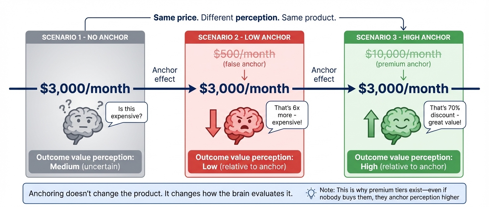
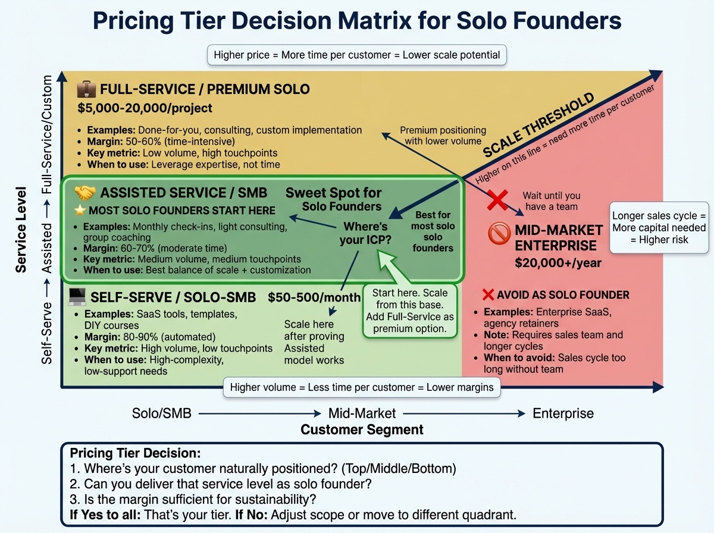

# Chapter 5: Presenting Your Solution (And Talking About Money)

The discovery call went well. You've qualified them properly. You understand their problem. They understand that you understand their problem. Now comes the part that trips up most founders: presenting your solution and naming your price.

This is the moment when your palms get sweaty. When the number you planned to say suddenly feels too high, and you hear yourself offering a discount before they've even objected.

That reaction isn't random—it's imposter syndrome showing up uninvited. 84% of entrepreneurs experience this [3]. Founders use low prices as a psychological shield: if the price is low, the risk of rejection feels lower. Women entrepreneurs are particularly affected—studies show they believe they need to price below competitors to win work, helping explain a 28% earnings gap [4].

But underpricing doesn't just cost you money. It signals low value, attracts price-sensitive customers, and creates a business that can't sustain itself.

The research is clear: companies implementing value-based pricing grow at nearly twice the rate of those using cost-plus models [1]. Sales teams with high collective confidence in their pricing approach show significantly better firm performance [2].

> **Founder-Type Note:** Pricing models differ by business type. B2B SaaS founders typically use subscription pricing, while coaches use program-based pricing ($X for a 12-week program) or high-ticket offers. Creators may use product ladders (free → $50 → $500 → $2,000). The principles of value-based pricing apply to all, but the structure differs.

This chapter helps you present your solution and name your price without flinching—through the same diagnosis-first approach we've been building.

## Why Presentations Fail

Three consistent failure patterns undermine solution presentations.

**Feature dumping.** Founders, nervous about silence, fill it with features. Each additional feature is something the prospect can critique. The best presentations are short—present exactly what they need, nothing more.

**Presenting before diagnosing.** If you haven't done thorough discovery, you're guessing. Your presentation becomes generic—a pitch rather than a prescription.

**Avoiding the money conversation.** Founders present the solution beautifully, then mumble the price like an afterthought. This signals discomfort with your own value, and prospects pick up on it immediately.

## The Prescription Frame

"Prescription before diagnosis is malpractice" [5]. The most effective way to present your solution is the prescription frame: you're a doctor writing a prescription, not a salesperson pushing a product.

A doctor doesn't walk into the exam room and start listing medications. They examine the patient, listen to symptoms, and then—only then—prescribe a specific treatment. Your presentation works the same way. You've done the examination (discovery). Now you're prescribing based on what you learned.

The prescription frame changes everything. You're not "pitching"—you're recommending. Instead of asking "will you buy this?" you're saying "based on what you told me, here's what I recommend."

But discovery does more than gather information—it builds the relationship. When you ask sharp questions about how their business works, how decisions get made, and what their customers care about, you signal that you take their reality seriously. Buyers start to feel "this person gets us" long before you name a price. Great discovery shifts the dynamic from vendor to consultant, earning you the right to make recommendations as a peer. When buyers experience you as a consultative peer who understands their world, your price feels like a professional recommendation, not a gamble on a stranger.

The transition sounds like this: "I'd like to summarize my understanding to make sure I've got everything right. From what you've shared, you're losing about 10 hours a week to manual processes, you have a deadline in Q2, and you're concerned about team buy-in. Did I capture that correctly?"

Before presenting anything, you're asking permission to summarize and inviting correction. This confirms understanding, gives them a chance to add context, and reminds them why they need a solution. Only after they confirm do you move to: "Based on that, I'd recommend [specific solution]."

**Case Study (Prescription Frame):**
**Problem:** A marketing consultant had 12 discovery calls over 3 months but only closed 2 deals (17% close rate); presentations walked through entire methodology.
**Solution:** Restructured around the prescription frame: "Based on what you shared—$8,000/month on ads generating leads but only 2% convert—I'd recommend we fix lead qualification first."
**Result:** Close rate 17% → 42% over the next 3 months. Same services, same prospects—only the framing changed.

## Structure of an Effective Presentation

An effective solution presentation has four parts:

**Part 1: Recap the diagnosis.** Summarize your understanding and invite correction. "You said [pain point], which is costing you [impact], and you need to solve this by [timeline]. Did I capture that correctly?" If they correct you, that's valuable—better to know now than present a solution to the wrong problem.

**Part 2: Present the solution (connected to their words).** Connect every element to something they said in discovery. Not "our product has automated reporting" but "you mentioned spending 10 hours a week building reports manually—here's how we automate that entirely."

Use their language, not yours. If they called it "the spreadsheet nightmare," you call it "the spreadsheet nightmare." Keep this focused: 3-5 key points maximum.

**Part 3: Establish the outcome.** Paint a picture of life after the problem is solved using their words. "You said success would mean having your mornings back instead of firefighting reports. That's exactly what this delivers."

**Part 4: Name the price and propose next steps.** State the investment clearly, then immediately connect it to value. Don't trail off vaguely. End with a clear, actionable proposal.

## The Pricing Conversation

Naming your price feels like the moment of maximum vulnerability. The way you present it signals what you believe about your value. If you sound apologetic, they'll wonder what's wrong. If you sound matter-of-fact—this is the investment, here's what you get—you signal confidence [2].

**Present price, then value, in the same breath.** This is value anchoring: never let the price hang alone. Research shows consumers adjust price judgments based on initial reference values [6][7].

*Figure 5.1: How Anchoring Affects Value Perception. The same $3,000 price feels expensive or like a bargain depending on the anchor. Establish the cost of their problem before presenting your solution.*

Bad: "It's $2,500."

Better: "The investment is $2,500, and based on what you shared about losing $4,000 a month to this problem, you'd see ROI within three weeks."

**Anchor to the cost of inaction.** During discovery, you established what the problem costs them. Use that number: "This problem costs you roughly $5,000 a month. The solution is $2,500—half a month's current losses to solve it permanently."

**When they don't know their costs:** Help them estimate during discovery: "How many hours does your team spend on this? What's that time worth?" If they can't estimate, anchor to similar customers: "Most clients in your situation lose 10–15 hours a week to this."

**State the price, then pause.** After you name your price, stop. Don't fill the silence with caveats, discounts, or nervous justification—that signals you don't believe your own number. Let the prospect react. Once they do, transition to next steps: walk through the project timeline, what happens during onboarding, and what success looks like. You've already anchored value; now show them you've thought past the sale—which reinforces they're making the right decision.

### Value Anchoring in Practice

**Case Study (Value Anchoring):**
**Problem:** A SaaS founder at $297/month lost deals; prospects said "more than expected." Price was reasonable—presentation wasn't.
**Solution:** Old: "The subscription is $297 per month." New: "Your team spends 15 hours a week on this—that's over $3,000 a month. The solution is $297 a month. You'd be saving ten times what you're investing."
**Result:** Same price; close rate doubled. Price alone felt expensive; anchored to $3,000 waste it felt like an obvious decision.

**Case Study (Course Creator):**
**Problem:** Priced at $497 ("what felt reasonable"); prospects asked "Is that all?"—signal the price was too low.
**Solution:** Implemented value anchoring (showed $3,000–$5,000 alternatives); raised price to $997.
**Result:** Revenue per sale doubled; higher price attracted more committed students who completed at higher rates and became referral sources.

### B2B Buyers Are Betting Their Reputation

In B2B, especially with larger or regulated customers, your buyer isn't just spending budget—they're putting their reputation, and sometimes their job, on the line if the project goes badly. That's why they'll often choose the partner they trust over the cheapest option.

**Acknowledge this directly in your presentation:** "I know you're not just evaluating solutions—you're choosing who you'll be accountable for selecting. My goal is to make you look good, both when this launches and when issues come up."

**Position your support as reputation insurance:** "Here's how we handle problems—because they will happen. You'll have my direct line, we review weekly, and if something breaks, I'm the one explaining it to your team with you, not leaving you to defend the decision alone."

**Case Study (Reputation-Focused vs. ROI-Focused):**
**Problem:** An enterprise software founder tested two presentation approaches on similar prospects.
**Solution:** The ROI approach emphasized 3x return and efficiency gains. The reputation approach led with: "When this goes to your leadership team, I want you confident that you picked a partner who won't disappear when things get hard."
**Result:** Reputation-focused approach closed at 38% vs. 24% for ROI-focused—same price, same product, different frame.

## Handling Price Objections

72% of price objections aren't actually about price [8]. They represent unvalidated value, unaddressed risk, or competitive confusion. When someone says "too expensive," your job is to diagnose what they're really saying.

In B2B specifically, "too expensive" often means "I'm not yet convinced this will work, and I'm the one who will be blamed if it doesn't." Your job is to lower perceived risk: show proof you've solved this before, outline how you handle issues when they arise, and make it clear you'll be there when things go sideways.

**"That's more than I expected."**

Don't immediately discount. First, understand what they expected: "Can you tell me what you were expecting? It helps me understand whether there's a mismatch."

Research shows: 47% have budget but don't see value yet, 23% have genuine budget constraints, 18% are comparing to cheaper alternatives that won't solve the problem [9]. You can't respond effectively until you know which one.

**Bad response:** "I can do $1,800 instead of $2,500." (You just lost $700 without learning anything.)

**Better response:** "What were you expecting?" → They say "$1,500." → "What made you think that range?" → Often reveals they're comparing to a DIY tool or junior freelancer—different solutions entirely. Now you can address the real gap.

**Best response:** "Help me understand—is it the total investment, or uncertainty about the return?" This separates price from value and opens the real conversation.

**"I need to check with [spouse/partner/boss]."**

This is often legitimate. Don't treat it as an objection—treat it as part of the process.

"Absolutely. What do you think their main concern will be? I want to make sure you have what you need to explain the value."

Equip them to sell internally. Offer to join a call with the other decision-maker.

**"Can I get a discount?"**

This is where most founders cave. Don't. Instead, tie any discount to something you get in return: "I can offer 15% off if you can commit today and provide a testimonial once you see results."

Alternatively, reduce scope rather than price: "I could offer a more focused version that covers [subset] for [lower price]."

What you never do: discount for nothing. 64% of sales reps respond to price objections by immediately discounting, destroying margin [8]. The best hold their pricing and focus on value. When they do offer concessions, they extract something meaningful in return. **When to consider a discount:** pilot/trial with clear scope and testimonial, or multi-year/referral commitment. **When not to:** to close a single deal with no quid pro quo.

**"We're looking at other options."**

Good—competition is normal. "What are you comparing us to? I'd like to help you make the right decision, even if that's not us." This gives you information about how they're framing the decision.

**"I need to think about it."**

This objection usually masks unresolved budget concerns, missing information, or authority issues [10]. It's rarely about needing more time.

**Bad response:** "No problem, take your time!" (You just lost the deal—they'll ghost you.)

**Better response:** "What specifically do you want to think about? If it's something I can clarify now, I'd like to help."

**Best response:** "Of course. When people say that, it's usually one of three things—questions about fit, concerns about timing, or something about the investment. Which is closest for you?" This gives them permission to name the real objection without feeling pressured.

## The Close: Asking for the Decision

Many founders do everything right until the end, then fail to actually ask. Asking for the decision isn't pushy—it's respectful.

The close should be direct: "Based on our conversation, I think this is the right solution for you. Ready to get started?"

If they're not ready: "What would need to happen for you to move forward?"

**Propose specific next steps:** "I'll send the agreement this afternoon. Once you sign, we'll schedule onboarding next week. Does Wednesday or Thursday work better?"

You've moved into implementation mode—asking which day works, not whether they want to proceed.

**The "assumptive close"—use with caution.** When they're asking implementation questions ("how quickly can we get started?") and objections have been addressed, assuming the sale feels natural. If uncertain, ask directly: "Does this solution seem right for what you're facing?" One warning: when you hear "yes," confirm next steps and end the call. Founders talk themselves out of deals by continuing to pitch after the prospect has already decided.

## When to Walk Away

Not every presentation ends in a sale, and not every sale is worth making. Sometimes the prospect wants something you can't deliver, their budget genuinely doesn't work, or you realize mid-presentation they're not going to be a good customer.

Walking away is hard when you need revenue. If you're desperate, take the deal and manage the consequences—survival comes first. But once you have runway, being selective pays off.

**Signs you should walk away:**
- Aggressive haggling after you've explained value (predicts ongoing friction)
- Expectations don't match what you deliver (disappointed customer who damages reputation)
- Dismissive of your process (unlikely to implement well)
- Your gut says no (trust it)

Walking away sounds like: "I don't think we're the right fit. Let me recommend [alternative] who might be better suited."

## Adapting to Buyer Style

The DISC framework matters in presentations too. Match your approach to their communication style:

**High D (Dominant):** Keep it short. Get to the bottom line quickly. "Investment: $X. ROI: [calculation]. Ready to move forward?" They respect confident pricing backed by clear ROI.

**High I (Influence):** Let them talk. Share testimonials and success stories. Emphasize the experience: "You're going to love working with us. Let's get started."

**High S (Steadiness):** Don't push. Emphasize support and guarantees. Be patient: "Take the time you need. I'll send materials to review, and we can reconnect next week."

**High C (Conscientiousness):** Bring data. Be precise about what's included. Answer detailed questions thoroughly. Close with logic: "Based on the specifications we discussed, this addresses your requirements. Does that align with your analysis?" High C buyers respond well to ROI calculators—if you show them a spreadsheet proving 3:1 ROI, they'll trust your pricing.

The presentation that works for a High D will frustrate a High C. Adapting to their style isn't manipulation—it's communication.

## After the Presentation

**If they said yes:** Send confirmation immediately. Within an hour: "As discussed, [summary]. Next step: [action]. Agreement attached." Speed matters—the longer you wait, the more time for doubt.

**If they said no:** Thank them gracefully. Ask what drove the decision. Offer to stay in touch. Sometimes "no" becomes "yes" months later.

**If they need to think about it:** Establish a specific follow-up: "I'll follow up Tuesday—does that work?" 80% of sales require at least five follow-ups [13].

## The Psychology of Pricing Confidence

Most pricing problems are psychological, not mathematical. Founders underprice for emotional reasons: fear of rejection, imposter syndrome, not wanting to seem greedy. When you price too low, you attract price-sensitive customers and signal you don't believe in your own value.

The fix: price based on value delivered, then communicate confidently.

Calculate the ROI your solution delivers. If your $2,000 product saves them $10,000 in year one, your price represents a 5x return. That's not expensive—that's a bargain. ROI calculators help buyers quantify impact before purchasing [11].

Practice saying your price: "The investment is $2,000, and based on what my clients experience, you'll see returns of five times that in year one." That's not bragging—that's helping them understand the value.

If you haven't delivered results yet, start with prices that feel slightly uncomfortable and raise them as you gather evidence. If you don't believe your price is fair, either your price is wrong or your understanding of your value is wrong.

## Pricing Structure Decisions

Should you offer one price or multiple tiers? Research shows optimal pricing includes 3-4 tiers, with the middle option designed as most attractive [12].

**Start with one tier until you understand your market.** Early on, you don't have enough data to design meaningful tiers. Premature tiering creates complexity without insight.

**Add tiers when you see natural segments.** Once you have 10-20 customers, you'll notice patterns—some need basics, others want everything plus custom support.

**Make each tier obviously different.** Each tier should solve a clearly different problem or serve a different customer size. **Use the high tier as an anchor**—having a premium option makes the middle tier feel more reasonable [6].

Don't agonize over tier design before you have customers. Start simple. Add complexity when customers tell you they need it.

*Figure 5.2: The Pricing Tier Decision Matrix. For solo founders, the "sweet spot" is typically Assisted Service for SMB customers ($500-$5,000/month).*

## Chapter Summary: TL;DR

**The core insight:** Present your solution as a prescription, not a pitch. Discovery builds the relationship—your questions do more to earn trust than your pitch ever will. In B2B, buyers are betting their reputation on you, so trust matters as much as ROI.

**Key takeaways:**
- Prescription frame: You've done the examination (discovery), now prescribe the solution
- Discovery builds relationships: Sharp questions about their business shift you from vendor to consultative peer
- B2B buyer risk: Buyers are putting their reputation on the line—they want a partner who'll be there when things go wrong
- Value anchoring: Never let price hang alone—state it, then immediately connect to value
- Price objections often mask risk: "Too expensive" often means "I'm not convinced this will work and I'll be blamed"
- DISC presentation scripts: High D wants bottom line, High I wants stories, High S wants reassurance, High C wants data
- 64% of sales reps respond to price objections by immediately discounting—don't be one of them

**If pricing conversations drain you or you're avoiding them:** See Chapter 12 (sustainability and recovery).

**Next chapter:** Chapter 6 covers retention, referrals, and growing revenue from existing customers.

---

## The Exercise: Prepare Your Presentation

Before your next qualified prospect:

1. **Write your transition statement.** Draft the exact words to summarize their situation and propose your solution.
2. **Map features to problems.** List 3-5 elements, each connected to a specific problem they described.
3. **Calculate their ROI.** Be specific. Practice saying it naturally.
4. **Practice your price statement.** State price, then value connection. Do this until it sounds natural.
5. **Prepare for objections.** Write responses to the three most common. Practice delivering them without sounding defensive.
6. **Script your close.** Make it direct and specific.

The goal isn't memorization—it's internalizing the structure so you can adapt in the moment.

---

## Chapter Checklist

**Before moving to Chapter 6, complete:**

- [ ] Written your transition statement (from discovery to presentation)
- [ ] Mapped 3-5 solution features to specific problems from discovery
- [ ] Calculated ROI for typical customer scenarios
- [ ] Practiced price statement with value connection
- [ ] Prepared responses for 3 most common objections
- [ ] Scripted your close question

**Self-assessment questions:**
- Am I presenting as a prescription (based on diagnosis) or a pitch (generic)?
- Can I state my price confidently with immediate value connection?
- Have I adapted my presentation approach to their DISC type?

[1] Research on value-based pricing in B2B markets reveals that companies implementing value-based approaches grow at nearly twice the rate of those using cost-plus models. Source: McKinsey & Company pricing studies and B2B growth research, 2023-2024.

[2] Study of 507 B2B account management professionals examining the relationship between pricing capabilities, sales collective confidence, and firm performance. Companies with well-defined pricing practices generate greater confidence, which translates directly into better financial outcomes. Source: Pricing research examining value-based pricing orientation, 2024.

[3] Charlenepedro.com, "Impostor Syndrome: A Big Obstacle for Success in Business," 2024. Research indicates 84% of entrepreneurs experience imposter syndrome.

[4] FreshBooks study on women entrepreneurs and pricing, cited in "The Confidence Tax: How Imposter Syndrome Costs Women Business Owners Money." Research shows male entrepreneurs outearn female entrepreneurs by 28%, partly driven by pricing differences influenced by imposter syndrome.

[5] The Sandler Selling System validates the "Prescription before diagnosis is malpractice" principle—borrowed from medicine and applied to consultative sales. Source: Sandler Training methodology, established framework in professional sales development.

[6] Comprehensive experimental research on price anchoring effects, including analysis of external vs internal anchoring mechanisms and moderating factors. Research shows consumers adjust price judgments based on initial reference values, with effects moderated by personality traits and product knowledge. Source: Experimental research on price anchoring, 2024.

[7] A comprehensive experimental study found that consumers were significantly affected by anchoring when making price judgments, with high anchors increasing estimated values dramatically compared to low anchor conditions. Source: Behavioral economics research on price perception, Journal of Consumer Research, 2023.

[8] Sales Executive Council (now Gartner) research on price objections, showing that 72% of price objections represent unvalidated value, unaddressed risk, budget allocation challenges, or competitive comparison confusion rather than genuine price concerns. Source: B2B sales effectiveness research.

[9] Analysis of price objection patterns breaking down "too expensive" objections: 47% have budget but don't see value yet, 23% see value but have genuine budget constraints, 18% are comparing to cheaper alternatives, 8% are risk-averse from past experiences, 4% are negotiating tactically. Source: Sales research, 2024.

[10] Research analyzing thousands of sales conversations on the "I need to think about it" objection, finding it typically masks unresolved budget concerns, missing information, or authority issues rather than genuine need for consideration time. Source: Sales research, 2024.

[11] Research on ROI calculator effectiveness in B2B sales, showing that interactive calculators help buyers quantify financial impact before purchasing decisions, increasing confidence and accelerating sales cycles through personalization and concrete metrics. Source: B2B sales effectiveness studies, 2024.

[12] Research on tiered pricing optimization in B2B SaaS, showing optimal structures include 3–4 tiers with the middle option designed as most attractive for the majority of target customers. Studies by OpenView and pricing optimization experts, 2024.

[13] Research on follow-up effectiveness varies, but multiple studies suggest 80% of sales require 5+ touchpoints. The exact number depends on context, but the principle—persistence matters—is consistent.
