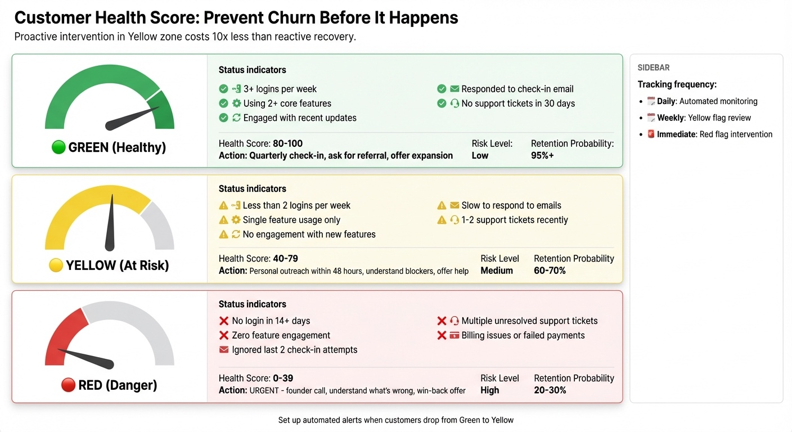

# Chapter 6: After the Sale—Retention, Referrals, and Growing Revenue

Acquiring a new customer costs 5–25 times more than retaining an existing one. Referral-acquired customers cost 67% less than paid search customers and show 37% higher retention rates [1]. A 5% increase in customer retention can boost profits by 25–95% [2].

The sale isn't the end of the customer relationship—it's the beginning.

Most founders focus intensely on acquisition—finding prospects, qualifying them, closing deals—and then treat what happens afterward as an afterthought. This is backwards. For solo founders without dedicated customer success teams, the math is even more lopsided: you can't outspend competitors on acquisition, but you can out-care them on retention. Every customer who stays, expands, and refers others compounds your growth without additional acquisition costs. The retention flywheel—every retained customer reduces acquisition pressure and expands growth potential—is one of the highest-impact activities a solo founder can focus on.

*Figure 6.1: The Retention Flywheel. Great Product → Happy Customers → Testimonials & Proof → Better Leads → Ideal Customer Fit → Product Improvements → back to Great Product. Each component accelerates the next, creating compounding growth. Focus on 1–2 nodes at a time.*

This chapter covers what happens after someone says yes: onboarding them effectively, keeping them successful, expanding revenue from existing customers, and turning happy customers into your best salespeople.

## The Economics of Retention

Before we get tactical, let's talk math. Three metrics matter most:

**LTV:CAC ratio** (see Appendix: Glossary) measures lifetime value against acquisition cost. LTV is the total revenue you expect from a customer over their relationship with you—for subscription products, it's monthly revenue times average customer lifespan; for one-time purchases, it's the purchase price plus any repeat purchases or upsells. A 3:1 ratio is the minimum healthy benchmark—earn at least three dollars for every dollar spent acquiring a customer. Industry data shows a median of 3.2:1 for B2B SaaS, with top performers reaching 4:1 or 5:1 [3]. If your ratio is below 3:1, you're either spending too much on acquisition, charging too little, or losing customers too quickly.

**Net Revenue Retention (NRR;** see Appendix: Glossary) measures revenue from existing customers over time, including expansions, contractions, and churn. NRR above 100% means your existing customers are worth more this year than last year, even accounting for those who left. For solo founders targeting SMB customers, 90–105% is realistic; mid-market focused businesses can achieve 105–115% [4]. Elite companies grow their revenue even if they stop acquiring new customers.

**Churn** is the percentage of customers who leave in a given period. Average monthly churn for B2B SaaS is 3.5%. For SMB-focused businesses at low price points ($500-$5,000), monthly churn of 3–7% is typical—meaning 31–58% of customers leave annually. Mid-market companies achieve 1.5–3% monthly churn. Any annual churn rate under 5% is the benchmark for sustainable growth [5]. For detailed benchmark ranges by segment, see Chapter 8.

> **Founder-Type Note:** Retention metrics differ by business model. For B2B SaaS founders, focus on monthly/annual churn, LTV:CAC ratios, and NRR. For coaches and creators, "retention" means repeat purchases, upsells to higher-ticket offers, and referrals rather than subscription renewals. A customer who buys a $500 course, then a $2,000 group program, then refers three friends has dramatically higher lifetime value than one who buys once and disappears. The principle (retention is cheaper than acquisition) applies to all, but how you measure and optimize it differs.

## Onboarding: The First 48 Hours

The period immediately after purchase is when customers are most engaged—and most likely to churn if they don't see value quickly.

Customers who reach their first "success moment" within 48 hours are dramatically more likely to stay. Time-to-value under 1 hour drives 2–3x higher Day 7 retention; under 15 minutes creates 4–5x higher retention [6]. The same applies to courses and coaching: if someone buys your program and doesn't engage within two days, the odds of them ever completing it drop precipitously.

**Case Study (B2B SaaS):** A founder selling analytics tools tracked onboarding completion vs. retention. Customers who completed core setup within 24 hours had 67% 6-month retention; those who took 7+ days had only 23% retention. The founder restructured onboarding with a step-by-step wizard and pre-populated sample data to guide users to their first insight in under 15 minutes. Result: 6-month retention improved from 34% to 58%.

**Case Study (Creator):** A course creator selling a $497 LinkedIn marketing course found students who completed Module 1 within 48 hours had 72% completion rates; those who took 7+ days had only 18%. The creator restructured onboarding: immediate welcome video, Module 1 designed to deliver a tangible result in under 2 hours, daily email check-ins for the first week. Result: course completion improved from 28% to 61%.

**For B2B products:**
- Welcome email within minutes of purchase
- Clear next steps: "Here's exactly what to do first"
- A quick win they can achieve in their first session
- Check-in at 24–48 hours: "Did you hit [first milestone]?"

**For creator products:**

Course creators face a unique challenge: people buy courses but don't complete them. Industry data suggests completion rates of 5–15% for self-paced online courses. That's not a delivery problem—it's an engagement problem.

The fix is front-loading value and building momentum:

- Welcome video that sets expectations and creates excitement
- Module 1 designed to deliver a tangible win, not just theory
- Daily or every-other-day emails for the first week keeping them on track
- Community or accountability mechanism to create social pressure

**For coaching programs, onboarding means setting the container for success:**

- A kickoff call that establishes the working relationship
- Clear expectations about what you'll cover and what they need to do
- First homework assignment immediately, before they have time to procrastinate
- Check-in mechanism (email, Slack, Voxer) established from day one

**The "Implementation Intent" Question**

During onboarding, ask a version of: "When specifically are you going to work on this?"

Research on habit formation shows that implementation intentions—"I will work on Module 2 on Tuesday at 7am"—dramatically increase follow-through compared to vague commitments like "I'll work on it this week."

Get them to commit to a specific time and place. Put it on their calendar. Send a reminder. The more concrete their commitment, the more likely they are to actually engage with what they bought.

## Health Scoring: Knowing Who Needs Attention

*Figure 6.2: Customer Health Score Framework. Scores of 75-100 indicate healthy customers ready for expansion; 40-74 means at-risk; below 40 requires immediate intervention.*

You don't need elaborate enterprise health scores. What matters is knowing who's at risk and who's thriving.

**The Solo Founder Health Score**

Track four factors in a spreadsheet or Airtable:

- **Usage (50% weight):** Login frequency, core action completion, active seats (B2B) or course progress, module completion, coaching attendance (creators). >7 days inactivity is a red signal.
- **Sentiment (20%):** Support ticket volume and tone (B2B) or community engagement and direct feedback (creators). High-severity tickets or negative feedback are red signals.
- **Financial (20%):** Payment reliability, recent upgrades or downgrades. Failed payments are a red signal.
- **Engagement (10%):** Email opens, community participation, feature adoption. Gone dark is a red signal.

**The Traffic Light System**

To make the score actionable, categorize it:

- **Green (75-100):** Healthy—candidate for referrals, case studies, or expansion. No intervention needed—focus on growth opportunities.
- **Yellow (40-74):** At risk—schedule a check-in call within 1-2 weeks. Automated nurture campaigns should be triggered.
- **Red (0-39):** Churn imminent—reach out immediately. This requires personal intervention.

**Operationalizing Without Data Science**

You don't need sophisticated tools. This model can be built using Zapier to feed data from payment processors (Stripe) and product analytics into a central Airtable base. A simple formula field calculates the score, and an automation triggers a Slack alert when a key account drops into the "Red" zone. This "management by exception" approach ensures you spend time only on high-leverage interventions. Review weekly for high-touch products, monthly for low-touch—and reach out proactively when you see warning signs.

**The "Absence of Signal" Paradox**

Silence often indicates danger. A customer with zero support tickets may have failed to adopt, not succeeded. A customer who hasn't logged in for 30 days is higher risk than one submitting feature requests. "Time Since Last Contact" should be a negative factor in your health model.

**Yellow Zone Outreach**

When a customer shows warning signs—reduced usage, missed sessions, unanswered emails—don't wait until they cancel.

A simple message works: "I noticed you haven't logged in for a while. Everything okay? Is there something I can help with?"

This yellow zone outreach isn't pushy—it's caring. Customers who feel seen are less likely to churn. And sometimes you'll learn about problems you can fix: a confusing feature, a life event that interrupted their progress, a misunderstanding about how to get value.

Clients who get a "just checking in" call at the 30-day mark stay longer than those who only hear from you when something's wrong. The content matters less than the signal that someone is paying attention.

**Track Wins, Not Just Problems**

Beyond tracking problems, track wins. When a customer achieves something meaningful—completes a module, closes their first deal using your methodology, ships a feature using your tool—acknowledge it.

Success milestone recognition can be automated: "Congratulations! You just [achievement]. You're ahead of 80% of customers at this stage." Or personal: a quick Loom video saying "Saw you hit [milestone]. Nice work—here's what I'd focus on next."

These success moments are also perfect for asking for testimonials, referrals, or presenting the next offer. People who feel successful are more likely to stay, more likely to recommend you, and more likely to buy more.

## Preventing Churn: The Exit Interview

Some customers will leave despite your best efforts. What matters is learning from every departure.

**When someone cancels or doesn't renew, ask:**
- What prompted this decision?
- What could we have done differently?
- Would you recommend us to others, despite leaving?
- Is there anything that would bring you back in the future?

Most people will tell you the truth if you ask genuinely. And that truth is invaluable for improving retention.

**Common reasons for churn:**
- **They never got started.** This is an onboarding problem. You didn't get them to value fast enough.
- **They got what they needed.** Sometimes people buy for a specific outcome and achieve it. This isn't failure—but consider whether there's a next step you could offer.
- **Their situation changed.** Budget cuts, job changes, life events. Often there's nothing you could have done.
- **The product didn't work for them.** Either a sales qualification issue (they weren't the right fit) or a product issue (it doesn't actually solve their problem).
- **They found a better alternative.** Competitive churn. Learn what the competitor did better.

Track these reasons. If 60% of your churn is "never got started," double down on onboarding. If 40% is "found a better alternative," study your competitors.

**Service Recovery Paradox**

Customers who experience a problem resolved well often become more loyal than customers who never had a problem. When something goes wrong: acknowledge it immediately, take responsibility, fix it faster than expected, and follow up to confirm resolution. A founder whose team caused a significant implementation problem owned it personally, fixed it over a weekend, and followed up daily until stable. That client became one of their strongest references.

## Expansion Revenue: Growing Without New Customers

The probability of selling to an existing customer is 60–70%, compared to 5–20% for a new prospect. Customers hitting 80% of usage limits convert at 25–30% to upgrades, while customers who invite 3+ colleagues who all activate convert at 40–45% to team plans [7]. If you're only focused on new acquisition, you're leaving money on the table.

**Timing note:** Expansion requires customers to expand. If you're pre-revenue or have only a handful of customers, focus on acquisition and delivering exceptional results for the customers you have. Expansion becomes relevant once you have 10+ customers with varying needs—and only after you've proven you can keep them happy.

**For B2B products:**

Expansion revenue typically comes from:

- **Seat expansion:** They add more users as their team grows
- **Usage expansion:** They exceed limits on their current plan
- **Tier upgrades:** They want features on a higher plan
- **Add-on products:** They buy complementary offerings

The key is making expansion feel natural, not pushy. Usage-based pricing does this automatically—as they grow, they pay more. Feature gates can feel punitive ("you can't do this") while usage gates feel like success ("you're growing so fast you need more capacity").

When someone hits 80% of a limit, send a helpful email: "You're using 80% of your monthly credits—great progress! If you need more, here's how to upgrade." Make the upgrade frictionless: one click, no sales call required.

**B2B Example:** A SaaS founder selling project management software started with a single user at a design agency. After three months of consistent usage and positive feedback, he noticed the customer had invited two colleagues as viewers but hit the collaboration limits. Instead of a generic upgrade prompt, he sent a personal note: "Saw your team is growing—congrats! Happy to set up a quick call to show you the team plan features." That conversation led to a 3x account expansion, and six months later, the customer introduced him to two similar agencies. One customer became three accounts.

**For creator products:**

The "backend offer" is where real money is made. Someone who bought your $500 course is pre-qualified for your $3,000 group program. Someone who completed your group program is a candidate for your $10,000 mastermind or 1:1 coaching.

Your frontend offer (the first thing they buy) exists partly to identify people ready for your backend offer. Not everyone will ascend, but those who do represent the majority of your lifetime value.

Timing matters. The best moment to present the next offer is when they've just experienced success with the current one.

**Creator Example:** A business coach sold a $497 LinkedIn marketing course. Sarah completed all modules within three weeks and posted in the community that she'd landed her first two clients. The coach reached out personally: "Sarah, that's amazing—two clients in three weeks! You're clearly implementing fast. I think you'd be perfect for my group coaching program where we go deeper on scaling. Interested in a quick call?" Sarah joined the $2,000 program and later referred three colleagues. Lifetime value went from $497 to over $6,000 when counting referrals.

When someone finishes your course and posts a win in the community, that's when you reach out: "Congratulations on [specific result]! I think you'd be a great fit for [next level program]. Interested in hearing more?"

This progression-based offer isn't sleazy—it's helping them continue their progress. The sale happens because they already trust you, already got results, and want more.

## Referrals: Your Best Acquisition Channel

Referral-acquired customers cost 67% less than paid search customers, show 37% higher retention, and have 18% lower churn [8]. Double-sided referral programs (rewarding both referrer and referee) consistently outperform single-sided programs, but most founders leave referrals to chance instead of systematizing them.

**The Referral Timing Principle**

Don't ask randomly. Ask during "high-dopamine moments" when the customer just experienced value:

- They completed a milestone
- They got a specific result
- They posted a win or success story
- They just renewed or upgraded

A referral request at these moments feels natural. A referral request two weeks after a frustrating support ticket feels tone-deaf.

**Simple Referral Structures**

You don't need complex affiliate systems. A simple approach works:

**For B2B:** "Give $50, Get $50." When a referred customer signs up, both parties get a credit. Altruism motivates—people like helping their friends get a discount.

**For creators:** "Unlock the bonus module by referring one friend." Exclusive content can be more motivating than cash, especially for courses and communities.

**Implementation:** Tools like Rewardful integrate with Stripe and handle tracking automatically. Or keep it manual: ask for referrals, track them in a spreadsheet, apply credits by hand. At small scale, manual works fine.

**Asking for Referrals**

Most founders never ask. That's the biggest mistake.

After a positive interaction, simply say: "I'm glad this worked for you. Do you know anyone else who might benefit from [what you offer]? I'd love an introduction if so."

Or in email form: "You mentioned [specific result you achieved]. I'd love to help more people like you. If you know anyone struggling with [problem you solve], I'd be grateful for an introduction."

The specificity of your ask matters. "Do you know anyone who might benefit?" is vague. "Do you know any early-stage SaaS founders struggling with customer acquisition?" gives them a specific person to think of.

## Building Advocates: Your Unofficial Sales Team

Beyond one-off referrals, some customers become true advocates—people who actively promote you without being asked.

**The Client Advisory Board (When You're Ready)**

This tactic requires customers first. If you have fewer than 10 paying customers, skip this and focus on serving the ones you have exceptionally well.

Once you have 10+ customers, pick your 5-10 best and invite them into a private group. The pitch: "I'm planning my roadmap for next quarter. I want your input before anyone else."

What this actually does:

- Makes them feel ownership over your product's direction
- Gives you direct access to your most engaged users
- Creates a peer group of advocates who reinforce each other's enthusiasm
- Provides a source of testimonials, case studies, and referrals

The participants become your most vocal advocates. They defend you in industry forums, introduce you to peers, and provide testimonials without being asked. The investment is minimal—a quarterly call and occasional swag—but the return is enormous.

For creator businesses, the equivalent is a private Slack or WhatsApp group for your most engaged customers. Call it the "Inner Circle" or "Alumni Network." These people get early access to new content, input on what you create next, and the sense of being an insider.

**Testimonials That Actually Work**

Generic testimonials ("Great product!") are worthless. Specific testimonials convert.

Good testimonials include:

- The specific problem they had before
- The specific result they achieved
- Quantified impact (time saved, revenue gained, stress reduced)
- Why they chose you over alternatives

When asking for testimonials, prompt for specificity: "What was your situation before? What specific results did you get? Would you recommend this to others like you? Why?"

Video testimonials are even more powerful—harder to fake and more emotionally engaging.

**Where to Display Social Proof**

Don't hide your testimonials on a separate page nobody visits. Put them:

- On your home page, near the call-to-action
- In your sales emails, matched to objections the prospect might have
- On your pricing page, addressing price concerns specifically

The right testimonial at the right moment can be the difference between a hesitant "maybe" and a confident "yes."

**The "Anti-Testimonial"**

A surprisingly effective tactic is the balanced review. Instead of only collecting glowing praise, include testimonials that acknowledge limitations:

"This course isn't for you if you want a quick fix. It's hard work. But it works."

"The onboarding took longer than I expected. But once we got it set up, we saved 15 hours a week."

Why does this work? Perfect 5-star reviews breed skepticism. Modern buyers have been trained to distrust unblemished praise. A 4.8-star review with honest caveats feels real in a way that a wall of "Amazing! Life-changing! Best thing ever!" testimonials doesn't.

## Communication Cadence: Staying in Touch Without Being Annoying

For subscription products, the worst thing you can do is only contact customers when their renewal is coming or when something goes wrong. They should hear from you regularly, in ways that add value.

**Monthly check-in email:** "Here's what's new this month" + "Here's how others are using [feature]" + "Here are resources you might find helpful." Keep it brief. Link to useful things. Don't always be selling.

**Quarterly business review (lite version):** For higher-touch products with established customers, a 15-minute quarterly call to review their progress, discuss what's working, and identify opportunities. This prevents churn by catching problems early and deepens the relationship. Note: if you have fewer than 10 customers, replace formal QBRs with informal "how's it going?" calls whenever the relationship warrants it. Don't create process complexity before you have scale.

**Milestone celebrations:** Automated emails when they hit achievements. "You just saved your 100th hour with [product]!" These reinforce value and create positive touchpoints.

**The "Personal Touch" at Scale**

Even as you grow, maintain personal touchpoints. Founders should send personal welcome emails to new customers when possible. Not automated—actually typed, mentioning something specific about them.

This doesn't scale forever. Eventually you need automation. But in the early stages, the personal touch differentiates you from competitors who treat customers as numbers. Even later, you can reserve personal outreach for your highest-value customers while automating the rest.

The balance: automate the predictable, personalize the meaningful. Automated welcome sequences are fine. But a handwritten note when someone renews for their second year? That's memorable.

**For creator products:**

The email list is your retention mechanism. Regular valuable content keeps you top of mind without feeling promotional.

The rhythm that works for most creator businesses: 1-2 emails per week mixing useful content with occasional offers. The ratio should be at least 3:1 value to ask. Build trust deposits before you make withdrawals.

## When to Let Customers Go

Not every customer is worth saving.

Some customers are net negative—they consume disproportionate support resources, damage your energy, and never become advocates. These customers cost more to keep than you earn from them. Paradoxically, firing the wrong customers is one of the most important retention activities you can do—it frees you to serve the right customers exceptionally well.

**Signs a customer isn't worth the effort:**

- Constant complaints with no willingness to work toward solutions
- Demands that go far beyond what they're paying for
- Hostility toward you or your team
- Refusal to follow your process or implement recommendations
- 3x+ average support time while paying below-average rates

**Before firing, make sure the problem isn't you:**

- Did you set clear expectations? If they're demanding things you never said you wouldn't do, the fault may be in your sales process.
- Have you had a direct conversation? Many "difficult" customers simply have unaddressed concerns. A frank conversation often resolves issues.
- Is this a temporary situation? A customer going through a business crisis may be demanding now but valuable later.

Only fire customers after you've genuinely tried to fix the relationship. But once you've tried and the pattern continues, don't let guilt keep you in a draining situation.

**The Graceful Exit**

When you've determined a customer needs to go, handle it professionally:

1. Frame it as a fit issue, not a customer problem. You accepted them as a customer; you're acknowledging that was a mistake.
2. Offer a clean exit: prorated refund, transition time, or help finding an alternative.
3. Recommend an alternative when possible—even a competitor. This shows good faith.

**Case Study:** A consultant noticed 3 of her 18 clients consumed 40% of her support time while representing 12% of revenue. These clients had a pattern: constant scope creep, missed meetings, and requests beyond their retainer. She had direct conversations with each about expectations. Two improved; one didn't. She offered a graceful exit with a partial refund and recommended another consultant who might be a better fit. Result: recovered 15 hours per month, took on two better-fit clients, and increased monthly revenue by $3,400. The fired client even sent a thank-you note six months later—they'd found a provider who was actually right for them.

## Putting It All Together: FeedbackPanda

Arvid Kahl and Danielle Simpson built FeedbackPanda, an automated teacher feedback tool, to $55K MRR with 5,000 customers in just two years—without hiring a single employee. The secret was systematic automation of every retention activity.

**The origin:** Danielle, an opera singer with an ESL teacher side hustle, struggled completing student feedback reports—wasting hours re-typing identical messages nightly. Arvid built a tool allowing teachers to select from pre-scripted feedback options, accelerating the comment process from hours to minutes.

**The retention system:** Instead of hiring, they automated. Arvid wrote scripts that generated emails when a customer's credit card bounced. Every support question became an entry in a self-service knowledge center. They documented everything—code, business processes, customer service complaints—making the business "sellable from day 1."

**The outcome:** Within 9 months they hit $20K MRR; at 24 months they reached $55K MRR and were acquired by SureSwift Capital for a "seven-figure, life-changing amount of money."

**The retention lesson:** Documentation and automation weren't just efficiency plays—they were retention mechanisms. Customers could self-serve answers 24/7. Payment issues got resolved automatically. The automated touches freed founder energy for high-value customer interactions. The acquirer later scaled the team from 2 to 7 employees and expanded to mobile/desktop/browser extensions—proving the foundation was solid.

## Chapter Summary: TL;DR

**The core insight:** Acquiring a new customer costs 5-25x more than retaining an existing one. The retention flywheel—onboarding → success → expansion → referrals—is the highest-leverage activity for solo founders.

**Key takeaways:**
- First 48 hours are critical: customers who reach their first "success moment" quickly are dramatically more likely to stay
- Health scoring predicts churn 60-90 days before renewal—track usage, sentiment, financials, and engagement
- Silence often signals danger: a customer with zero support tickets may have failed to adopt, not succeeded
- Expansion revenue: 60-70% probability of selling to existing customers vs. 5-20% for new prospects
- Referral-acquired customers cost 67% less and have 37% higher retention than paid acquisition
- Service recovery paradox: customers who experience problems resolved well often become more loyal

**Next chapter:** Chapter 7 covers scaling your system with AI and automation.

---

## The Exercise: Build Your Retention System

Before moving on, set up the foundation of your retention operation:

1. **Map your onboarding sequence.** What happens in the first 48 hours after purchase? Write out every touchpoint: emails, calls, resources, milestones. Identify where customers typically get stuck.

2. **Define your health indicators and calculate baselines.** What 3-5 metrics tell you whether a customer is thriving or at risk? What's your current churn rate, expansion revenue, and LTV:CAC? Set up a simple system (even a spreadsheet) to track these weekly or monthly.

3. **Draft your check-in templates.** Write the emails you'll send for: welcome, 7-day check-in, monthly update, early warning outreach, referral request. Having templates ready means you'll actually send them.

4. **Plan your expansion path.** What's the natural next step for customers who succeed with your current offer? How will you introduce it? When?

5. **Create your referral ask.** Write out exactly what you'll say when asking for referrals. Practice it until it feels natural.

6. **Identify your best customers.** Who are the 5-10 customers who love you most? Write their names down. These are the seeds of your advocacy program. Reach out this week to start building deeper relationships with them.

---

## Chapter Checklist

**Before moving to Chapter 7, complete:**

- [ ] Mapped your onboarding sequence (first 48 hours)
- [ ] Defined 3-5 health indicators for at-risk vs. thriving customers
- [ ] Created check-in email templates (welcome, 7-day, monthly, warning, referral)
- [ ] Identified your expansion path (next offer for successful customers)
- [ ] Listed your 5-10 best customers for advocacy outreach
- [ ] Calculated baseline retention metrics (churn rate, LTV:CAC, NRR if applicable)

**Self-assessment questions:**
- Do I know which customers are at risk before they cancel?
- Have I asked my best customers for referrals in the last 30 days?
- Is my onboarding designed to get customers to their first win within 48 hours?
- Do I have a system to track customer health, even if it's just a spreadsheet?

[1] Referral-acquired customers cost 67% less than paid search customers ($400 vs $1,200 CAC) and show 37% higher retention rates with 18% lower churn. Source: FirstPageSage B2B SaaS CAC Report, 2024; Prefinery, "10 Key Referral Program Metrics," 2025.

[2] A 5% increase in customer retention can boost profits by 25-95%. Source: Harvard Business Review research on customer success and retention strategies, 2014-2022.

[3] FirstPageSage B2B SaaS Customer Acquisition Cost Report, 2024. Median LTV:CAC ratio across 612 B2B SaaS companies is 3.2:1.

[4] Optif.ai, "B2B SaaS Net Revenue Retention Benchmark," 2025. Median NRR for venture-backed SaaS is 106%, with top quartile at 110-120%.

[5] Vitally, "SaaS Churn Benchmarks," 2025. Average monthly churn rate for B2B SaaS is 3.5%. For detailed benchmark ranges by segment, see Chapter 8.

[6] Userpilot, "Time-to-Value Benchmark Report," 2024. TTV under 1 hour = 2-3x higher Day 7 retention; under 15 minutes = 4-5x higher retention.

[7] June.so, "Expansion Revenue," 2024. Probability of selling to existing customer: 60-70% vs. 5-20% for new prospects. Rework, "Usage-Based Sales Triggers," 2025. 80% usage limit = 25-30% conversion; 3+ colleague invitations = 40-45% conversion to team plans.

[8] FirstPageSage B2B SaaS CAC Report, 2024. Referral CAC averages $400 vs. $1,200 for paid search.
