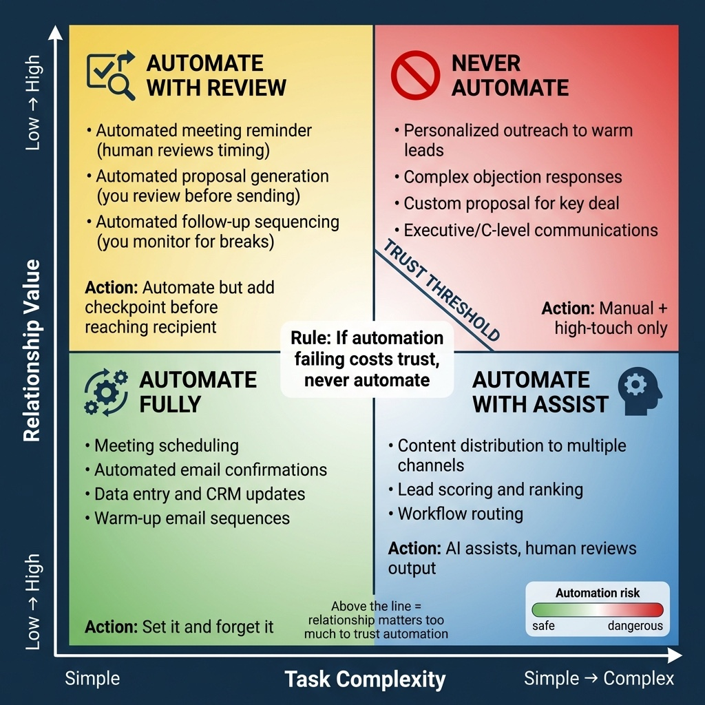
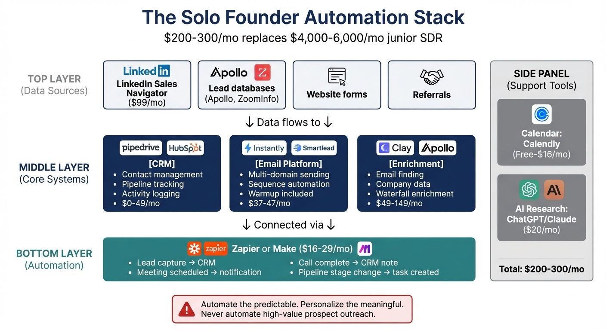
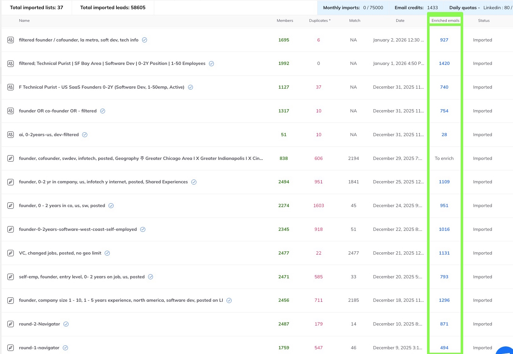
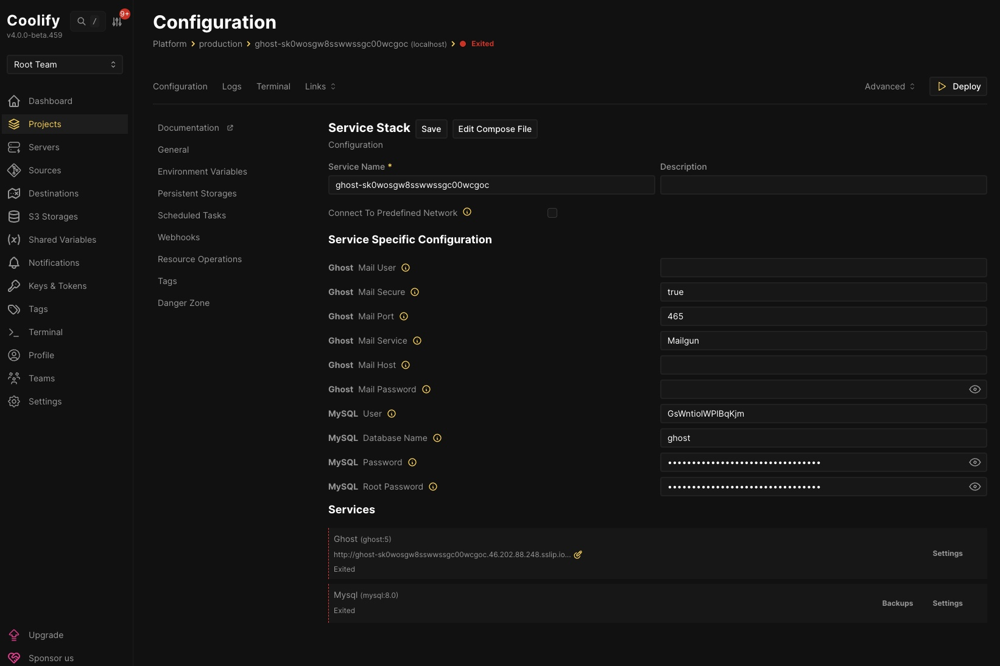

# Chapter 7: Using AI and Automation Without Losing the Human Touch

Every solo founder faces the same constraint: there's only one of you.

You can't outwork a sales team of ten. You can't produce content as fast as a media company. You can't personally respond to every prospect at the moment they're most interested.

But here's what the data shows: research on automation ROI for small businesses reveals that marketing/sales automation can reduce manual follow-up time by 20–40% and increase lead response speed and conversion rates, especially where no systematic follow-up previously existed [1]. The economic advantage is clear: the traditional alternative—hiring a junior SDR—would cost $4,000–$6,000/month plus management overhead. An automation stack provides superior data accuracy, 24/7 operation, and infinite scalability for roughly 5% of that cost [2].

You can use technology to multiply your efforts—if you know what to automate, what to keep human, and how to avoid the traps that make automation feel robotic.

This chapter isn't a guide to every AI tool—those change too quickly. It's about how to think about AI and automation as a solo founder with limited time: what actually works in 2026, workflows that scale without breaking, and the principles that keep your communication authentic even when machines are involved.

> **Founder-Type Note:** Automation applications differ by business model. **B2B SaaS founders** benefit most from cold email infrastructure, CRM automation, and AI-powered prospect research at scale. **Coaches and creators** benefit most from content repurposing, newsletter automation, and community engagement tools. The principles (automate the predictable, personalize the meaningful) apply to both, but the specific workflows differ. This chapter covers both approaches—look for the sections most relevant to your model.

## The Automation Principle: Automate the Predictable, Personalize the Meaningful

**Critical Foundation: Personalization is primary; automation is secondary support.** This principle applies throughout this chapter. Automation should amplify your personalized approach, not replace it. The worst automation is when a prospect receives a message that's obviously templated, mass-produced, and not written with them in mind. That automation costs you more than it saves.

The best automation handles tasks that are:

- Predictable (they happen the same way every time)
- Time-consuming (they eat hours you could spend on higher-value work)
- Not relationship-dependent (the prospect doesn't care if a human did them)

The worst automation handles tasks that are:

- Context-dependent (they require judgment about the specific situation)
- Relationship-building (the prospect values knowing a human cared enough to do them)
- Your competitive advantage (if anyone can automate it, it's not differentiation)

> **Case Study: Founder (Cold Email Infrastructure)**
>
> **Problem:** Scaling cold email outreach while maintaining personalization for high-value prospects.
>
> **Solution:** Automated the predictable (infrastructure, deliverability, scheduling) while keeping human judgment for top-tier prospect messaging. (Full setup details in "My Automation Setup" later in this chapter.)
>
> **Result:** Infrastructure automated, judgment stayed human.

> **Case Study: Creator (Automation Stack)**
>
> **Problem:** A creator spent 12 hours/week on prospect research (3h), email follow-up (4h), meeting scheduling (2h), CRM updates (3h).
>
> **Solution:** Folk CRM with AI enrichment (1h/week), Instantly sequences (30min setup + 15min/week), Calendly (automated), Zapier (30min/week). New total: 2.25 hours/week. Redeployed time: 20h customer conversations, 10h content, 9h recovery.
>
> **Result:** 18 conversations/month vs 8 previously; worked 45h/week vs 58h—fewer hours and better acquisition.

Before we look at tools, two boundaries: what *not* to automate, and a trap to avoid.

## What NOT to Automate

*Figure 7.1: The Automation Failure Matrix. Not everything should be automated. This framework helps you identify which tasks benefit from automation (predictable, time-consuming, not relationship-dependent) versus which must stay human (context-dependent, relationship-building, your competitive advantage). The worst automation handles tasks where prospects value knowing a human cared enough to do them.*

Some things should stay manual, even when you're tempted to automate them.

**First messages to high-value prospects.** Your top 20% of targets—the ones that would be transformative customers—deserve personal attention. Automate the research, but write the message yourself.

**Responses to replies.** When someone responds to your outreach, that's the beginning of a relationship. Never automate replies. Take the time to respond thoughtfully.

**Anything that requires reading the room.** Should you push back on this objection or let it go? Should you follow up now or give them space? These judgment calls can't be automated.

**Content that represents your perspective.** Your ideas, opinions, and experiences are what differentiate you. AI can help with formatting and research, but your voice needs to stay your own.

**Customer success touchpoints.** When a customer hits a milestone, celebrate it personally. When a customer seems at risk, reach out personally. These moments build loyalty that automation can't create.

## The Productivity Trap

A warning: automation can become a procrastination strategy.

"I need to set up the perfect system before I start selling" is often code for "I'm afraid of rejection, so I'm going to build infrastructure instead of talking to people."

The tell-tale signs of the productivity trap:

- Spending weeks perfecting your CRM setup
- Building elaborate Zapier workflows before you have any leads
- Researching email tools instead of sending emails
- "Optimizing" systems that have too little data to optimize

The productivity trap fix is simple: do the manual version first. Prove that the activity works before you automate it. Send 50 cold emails by hand before setting up automation. Make 20 discovery calls before building elaborate post-call workflows.

> **Case Study: Founder (Productivity Trap)**
>
> **Problem:** A technical founder spent six weeks building an "automated lead gen machine"—Zapier, AI lead scoring, multi-channel sequences—before sending a single outreach message.
>
> **Solution:** None initially. At launch, messaging assumed wrong pain points and ICP was assumption-based; automation scaled a broken process.
>
> **Result:** Two months, 3,000 emails, 2 responses. He scrapped it, sent 50 manual emails to test value props, found messaging that worked (12% response), then rebuilt automation around it. Pattern: test manually first, then automate what proves effective.

Build the system after you understand what works. Not before.

## The Solo Founder's Automation Stack

*Figure 7.2: The Solo Founder Automation Stack. A practical automation architecture for customer acquisition showing the four core layers: CRM as single source of truth, email automation for sequences, calendar automation for scheduling, and workflow automation for connecting your tools. Each layer handles predictable, time-consuming tasks while preserving human judgment for relationship-dependent decisions.*

Here's what a practical automation setup looks like for customer acquisition at the solo founder level.

**CRM: Your Single Source of Truth**

You need one place where all your prospect and customer information lives. Without it, you'll lose track of conversations, forget follow-ups, and waste time recreating context you already gathered.

For most solo founders, the choice is between:

**Close or Pipedrive ($15–50/month as of January 2026):** Best if you're doing volume B2B sales. These tools automatically log emails and calls, track pipeline stages, and remind you to follow up. Close is particularly good for founders who hate data entry—it captures communication automatically.

**Folk ($19/month as of January 2026):** Best if your sales process is relationship-based rather than volume-based. It's designed for managing a network of contacts rather than a high-velocity pipeline. The AI enrichment feature saves hours on research.

**Notion or Airtable (Free-$20/month as of January 2026):** Flexible but dangerous. Solo founders often spend more time building the perfect CRM than actually using it. If you go this route, use an existing template and resist the urge to customize endlessly.

**AI-native CRMs (Attio, etc.):** Newer tools like Attio are built for GTM builders who want CRM, automation, and AI in one place. They pull in data from email, product, and billing, run intelligent workflows, and let you build custom apps directly inside the CRM instead of duct-taping tools together [11]. Best if you're comfortable building workflows and want your CRM to be the system of action, not just a database.

The rule: pick one, set it up in an afternoon, and use it consistently. A simple system you actually use beats an elaborate system you abandon.

**Email Automation: Sequences That Don't Feel Automated**

Email sequences—automated follow-up emails that send on a schedule—can dramatically increase your response rates. Persistence matters: 80% of sales require at least five touchpoints, but most people give up after one or two [3]. Automation ensures you maintain that persistence without manually tracking every follow-up.

Tools like Instantly ($37–47/month as of January 2026), Smartlead (similar pricing as of January 2026), or Lemlist handle the mechanics: scheduling, sending, tracking opens and replies. These platforms include unlimited warmup and multi-domain support, critical features for maintaining deliverability in 2026 [4]. But the content still needs to feel human.

The difference between good and bad email sequences:

**Bad sequence:** Same generic message sent to everyone, obvious templates, no reference to anything specific about the recipient.

**Good sequence:** Personalized first email, follow-ups that reference something from your research, a reason for each touchpoint beyond "just checking in."

Here's a structure that works:

- **Email 1:** Personalized introduction. Reference something specific about them—a post they wrote, a job change, a company announcement. Make the value proposition clear in one sentence.
- **Email 2 (3 days later):** Short follow-up. Add one new piece of value—a relevant resource, a specific insight about their industry.
- **Email 3 (5 days later):** Different angle. If email 1 was about their problem, email 3 is about a similar company you helped.
- **Email 4 (7 days later):** Direct ask. "Is this something worth a 15-minute conversation, or should I stop reaching out?"

That final direct-ask email performs surprisingly well. It gives them permission to say no, which paradoxically often prompts a response.

**Marketing Automation & Nurture**

Cold email sequences handle outbound. But once people are in your world—newsletter subscribers, webinar attendees, content downloaders—you need nurture automation. Tools like HubSpot, ActiveCampaign, MailerLite, or Venturz handle newsletters, drip sequences, and basic funnels. The CRM tracks deals; marketing automation keeps warm leads from going cold. For most solo founders, start with your CRM's built-in email features before adding a separate marketing automation layer.

**Calendar Automation: Remove the Friction**

Scheduling calls by email is a waste of everyone's time. Use Calendly, Cal.com, or a similar tool.

The key is making the scheduling experience reflect your brand:

- Clear instructions about what the call is for
- Time zone detection that works
- Reminders that reduce no-shows
- A brief questionnaire that gathers context before the call

A pre-call questionnaire with three questions works well: What's your biggest challenge right now? What have you tried so far? What would success look like? The answers enable preparation for the call and demonstrate that homework was done when the call starts.

**Meeting recording and automation:** Record your calls (with explicit permission) for multiple purposes. Tools like Otter.ai, Fathom, Fireflies, or Zoom's built-in transcription automatically transcribe and summarize meetings. The value is multi-layered:

- **Training and improvement:** Review your own calls to identify patterns—where you rush, where you miss follow-up questions, how you handle objections. This is the fastest way to improve your discovery and presentation skills.

- **Automatic summaries:** AI tools generate meeting summaries that you review and refine before sharing. These summaries capture key points, action items, and next steps for both parties. Send the reviewed summary to the prospect within 24 hours—it demonstrates attention to detail and creates a written record of what was discussed.

- **CRM documentation:** Meeting transcripts and summaries automatically populate your CRM notes, ensuring you never forget important details from conversations. This is especially valuable when deals have long sales cycles—you can reference specific points from months earlier.

- **Pattern recognition:** Over time, analyzing transcripts across multiple calls reveals patterns in objections, common pain points, and what language resonates with your ICP. This data informs your messaging and positioning.

The key is always getting permission first: "I'd like to record this call for my notes and to make sure I capture everything accurately. Is that okay with you?" Most prospects say yes when they understand it's for accuracy and follow-up, not surveillance.

**Workflow Automation: Zapier/Make for the Connections**

Zapier and Make (formerly Integromat) connect your tools so data flows automatically between them.

Three workflows worth setting up:

**1. The Lead Catcher:** When someone books a call via Calendly or submits a form on your website, automatically create a contact in your CRM and send yourself a notification. Speed to lead matters—responding within five minutes dramatically increases conversion [12].

**2. The Meeting Logger:** When a call ends (via Zoom or Google Meet), create a note in your CRM with the date and attendee names pre-filled. This meeting logger removes the friction of opening the CRM manually, which means you're more likely to actually document the conversation.

**3. The Follow-Up Reminder:** When you move a deal to "Proposal Sent" in your CRM, create a task to follow up in three days if you haven't heard back. Don't rely on memory—you'll forget, and deals will stall.

**One more thing: basic funnel metrics.** Your CRM or marketing automation tool should show you which sources and automations actually produce pipeline—not just opens and clicks. If you can't see "LinkedIn outreach → booked call → closed deal," you're optimizing blind.

These automations are unsexy. They don't feel transformative. But they eliminate dozens of small tasks that accumulate into hours of lost time and missed opportunities.

## AI for Research: Where It Actually Helps

AI tools genuinely accelerate the research phase of prospecting. They're less useful for the communication phase.

**What AI does well:**

- **Summarizing company information:** Paste a company's website into Claude or ChatGPT and ask for a summary of what they do, their target market, and recent news. Faster than reading through it yourself.
- **Finding patterns in your data:** Upload your customer list and ask which characteristics your best customers share. AI can spot patterns you'd miss.
- **Drafting first versions:** AI can write a first draft of almost anything—emails, proposals, content. The draft usually needs editing, but it's faster to edit than to write from scratch.
- **Researching competitors:** Ask AI to compare your product to alternatives, or to summarize what customers say about competitors in reviews.
- **AI-personalized outreach:** Tools like Clay ($149/month starter tier as of January 2026) use waterfall enrichment to query multiple data providers sequentially, achieving 80%+ find rates even in niche markets [5]. When AI generates first-line personalization based on recent posts or company news, reply rates can jump from 2–3% for generic outreach to 10–15% for properly personalized messages [6].

**What AI does poorly:**

- **Authentic personalization:** AI-generated personalization often reads as generic. "I noticed you went to Stanford—great school!" isn't personalization. It's a fact with no connection to why you're reaching out. Conjointly's 2025 study shows consumer skepticism toward AI-generated marketing is rising even when detection rates remain low—people sense inauthenticity even if they can't articulate why [7].
- **Emotional nuance:** AI misses the subtle signals in a conversation. It can't tell when someone is politely saying no versus when they're genuinely interested but hesitant.
- **Relationship judgment:** Should you follow up now or wait? Should you push back on an objection or let it go? These require human judgment that AI can't replicate.

**The human-in-the-loop principle:** The most effective solo founder approach in 2026 is AI for research and first drafts, human decision-making on every high-impact step. Design automation systems where humans review AI outputs at critical decision points—approving outbound before it goes to new segments, overriding AI suggestions for pricing or commitments. Threshold routing works well: let AI handle routine, low-risk work like logging data or drafting low-stakes follow-ups, but route uncertain or high-stakes outputs to human review [8].

**The practical application:** Before every discovery call, paste the prospect's LinkedIn profile and company website into AI and ask: "What are the top three challenges this person likely faces in their role?" The answers aren't always perfect, but they give you a starting point. The human work is deciding which challenges are actually relevant and how to bring them up naturally.

## A Real Workflow: Discover → Enrich → Analyze → Send

**The tools don't matter; the architecture does.** Any stack that can (1) discover, (2) enrich, (3) analyze with AI, (4) apply a human quality gate, and (5) send reliably will work. What follows is a tool-agnostic workflow you can adapt to whatever platforms you prefer.

**Case Study (AI-Powered Prospect Enrichment at Scale):**
**Problem:** Pre-launch: thousands of "interesting LinkedIn profiles" needed to become a clean, verified, personalized outbound database for a solo founder.
**Solution:** 3-week workflow: discover → enrich → verify emails → AI personalization → human review → queue in sending platform.
**Result:** 58,605 leads discovered, 12,530 verified emails (≈21.4% enrichment), fully personalized campaigns queued for launch day.

**Step 1: Discover your ICP in a list platform.** Use a list discovery platform (LinkedIn Sales Navigator, Apollo, Clay, or similar) to build searches that match your ICP: role, company size, geography, funding/bootstrapped signals, price band, and buying triggers.

**Key move:** Filter for recent activity (e.g., "posted in the last 30–180 days") so you're only pulling people who are actually alive on the platform and have content you can reference later.

**Step 2: Enrich with verified emails.** Export those lists into a contact enrichment tool that can guess company email patterns, validate addresses via SMTP, and return a clean CSV of verified work emails.

In my case, 14 tightly defined lists produced:
- 58,605 total records
- 12,530 verified emails
- ≈21.4% overall enrichment, with the best segments landing in the 30–40% range

*Figure 7.3: Email List Enrichment Results. 14 lists, 58,605 total leads, 12,530 enriched emails (21.4% rate). Higher-quality lists with active posting filters achieved 30–40% enrichment.*

**Compliance note:** Use enrichment features that rely on standard practices (pattern guessing + email verification) and avoid anything that violates platform terms of service. Treat "finding people" and "emailing people" as separate systems.

**Step 3: Use AI to score and personalize at scale.** Upload the enriched CSV into an AI batch processor (Gemini, Claude, ChatGPT, or equivalent) along with your ICP definition, your value proposition, any frameworks you use (e.g., DISC), and optionally your positioning documents as context.

Have AI:
- Score each contact for ICP fit on a 1–10 scale
- Flag solo-founder/buyer signals (wears multiple hats, "bootstrapped," indie-hacker energy, etc.)
- Infer communication style (DISC-ish) from headline/summary
- Pull out specific personalization hooks (recent posts, company description, role changes)
- Draft a personalized first line that ties their situation to your offer

This is where AI shines: crunching thousands of rows to surface patterns you would miss by hand.

**Step 4: Act as the human quality gate.** Don't ship AI output raw. Sort by ICP score and focus on the top bands. Skim samples per segment and delete anything that sounds robotic or creepy. Adjust tone for how you actually speak. Write or tighten the offer and CTA yourself.

Your job becomes "editor-in-chief of personalization" instead of "manual first-line writer for 12,000 contacts."

**Step 5: Send through your cold email infrastructure.** Import the cleaned, AI-annotated CSV into your cold email platform (Instantly, Smartlead, Lemlist, or similar), mapped to template variables like `{{first_line}}`, `{{angle_tag}}`, `{{company}}`, `{{role}}`.

Let the infrastructure handle multiple warmed domains, SPF/DKIM/DMARC authentication, 30–50 emails/day/inbox pacing, and sequencing with follow-ups.

You're now sending at "system scale," but the emails still read like a human did the research.

**Performance expectations:** Research across multiple AI-personalization studies shows reply rates in the 9–21% range for well-executed personalized campaigns, versus 1–5% for generic blasts [6]. The gain doesn't come from volume; it comes from relevance that's actually specific.

This workflow stacks those gains: ICP-tight lists, verified contact data, AI-assisted personalization, and a human quality gate on top of solid email infrastructure. On well-targeted segments, expect 12–15% reply rates once messaging is dialed in—but your results will depend on your ICP and execution.

## AI for Content and the Authenticity Trap

Content creation is one of the most time-consuming aspects of building visibility. AI can help—but it creates a specific failure mode worth addressing.

**Where AI helps:**

- First drafts you plan to heavily edit
- Repurposing (long post → tweet threads, video script → blog post)
- Outlines, structures, and research summaries
- Formatting and proofreading

**Where AI fails:**

- Anything requiring your personal experience or perspective
- Technical content where accuracy is critical (AI hallucinates details)
- Content that needs to sound like you specifically
- Actual messages to high-value prospects

The AI content that gets ignored follows a pattern: generic, vaguely helpful, sounds like everything else. The content that works in 2026 has something AI can't fake: your actual experience. "Here's how I lost my first customer" is interesting. "Here are five tips for customer retention" is not.

**The authenticity test:** If someone who knows you well read the content, would they recognize it as yours? If the answer is no, you've automated too much.

> **Case Study: Pieter Levels—$3M+ ARR with Zero Employees**
>
> **Problem:** Competing with venture-backed competitors as a solo founder.
>
> **Solution:** Pieter built Nomad List and Remote OK by automating infrastructure (APIs, auto-generated pages, meetup creation) while keeping his voice authentic via building in public on Twitter/X.
>
> **Result:** $3M+ ARR with zero employees. Automate what doesn't need you; keep time for insights, relationships, and authentic content. His systems handle thousands of data points; his tweets stay distinctly his.

> **Case Study: Building with AI—The Moat Problem**
>
> **Problem:** Mental health education platform built with AI-assisted development; early content felt "too AI-generated" to providers.
>
> **Solution:** Provider feedback steered the product toward more interactive, therapeutic content. (MVP: [mental-wellness-education.soloframehub.com](https://mental-wellness-education.soloframehub.com))
>
> **Result:** Better product fit. Lesson: with public AI tools, build proprietary domain capability. Your moat is curation, expertise, workflows, and distribution—not the AI output itself.

Authenticity compounds. Generic content doesn't.

## Answer Engine Optimization: Getting Cited by AI

Search has fundamentally changed. As of late 2024, 60% of Google searches end without a click to a website (77% on mobile) [9]. Google's AI Overviews, ChatGPT, Perplexity—these tools answer questions directly.

**The goal shifts from "getting the click" to "getting the citation."** When someone asks an AI assistant about your topic, you want to be the source the AI references.

**How to get cited by AI:**

**1. Answer questions directly in your first paragraph.** AI models read the top of your content first. If you bury the answer after three paragraphs of introduction, the AI might not find it.

Bad: "In this article, we'll explore the many benefits of cold email outreach and how it can transform your business..."

Good: "Cold email response rates average 1–5%, but can reach 15–20% with proper targeting and personalization. Here's how to achieve the higher end..."

**2. Use question-and-answer formatting.** Structure content with questions as headers and direct answers as the first sentence of each section. This mirrors how people ask AI assistants questions.

**3. Create original data and frameworks.** AI needs sources. If you publish original research - "We surveyed 200 solo founders about their sales process" - AI has to cite you. If you coin a term or framework, AI models have to reference your definition.

**4. Get cited by other trusted sources.** AI models trust what trusted sites say about you. Getting mentioned on Reddit, industry publications, or established blogs helps AI "trust" your content as a source.

This doesn't replace traditional content marketing. It adds a layer. The fundamentals—creating genuinely useful content, building email lists, establishing authority in your niche—still matter. But now you also need to think about how machines read your content, not just humans.

## The "Warmup" Automation Pattern

One valuable pattern is automating the warmup, not the outreach.

There are two separate motions: using LinkedIn as a *data source* for cold email (the list platform → enrichment tool → AI → sending platform workflow), and using LinkedIn as a *conversation channel* (DMs and comments). The warmup pattern applies to the conversation side.

**Start smaller than you think.** The volume recommendations below (20–30 people per week) assume you have time to actually interact with them. If you're just starting, begin with 5–10 people per week and do it manually. Learn what gets replies before you add automation.

**On LinkedIn (relationship-first):**

- Use Sales Navigator to build a small list of people who match your ICP
- Warm them up by engaging with their posts—comments with real thoughts, not "great post"; resharing something they wrote with your perspective; answering questions they've asked in public
- Only after a few genuine touchpoints, send a short, human DM that references that interaction and invites a conversation or offers a resource
- Keep the DM itself human-written. If you use AI at all, use it to draft options, then heavily edit so it sounds like you

Tools like Dripify or LinkedHelper can automate the engagement phase (though be careful—LinkedIn's terms of service prohibit some automation, and aggressive automation can get your account restricted). The connection request and subsequent messages stay manual.

The warmup result: when your connection request arrives, they recognize your name. Acceptance rates jump from 20% to over 50% [13].

**For cold email (list-building):**

Use Sales Navigator and tools like Kanbox purely as a way to *find and enrich* leads. This is data collection, not relationship-building. The "warmup" here is different—it happens in the inbox through multiple respectful, relevant emails over time, not one blast.

If you want to bridge the two channels:

1. Week 1: Add to your cold email list, begin researching
2. Week 2: If they post content on LinkedIn, engage with it (manually or via alerts)
3. Week 3: Send first cold email, optionally referencing your earlier engagement

This multi-channel approach is slower than blast outreach. It's also dramatically more effective per send.

## My Automation Setup: What Actually Works

Here's what works in practice—not theoretical possibilities, but a working system.

**The cold email infrastructure:** Five domains, each with proper Sender Policy Framework (SPF), DomainKeys Identified Mail (DKIM), and Domain-based Message Authentication, Reporting & Conformance (DMARC) authentication. These email authentication protocols verify your domain's legitimacy and prevent spoofing. Each domain warms up for 3–4 weeks before sending real campaigns. Instantly (as of January 2026) handles the warmup and sending, integrated with CRM so responses flow back automatically. Volume: 30–50 emails per day per domain, conservative enough to maintain deliverability.

**The LinkedIn prospecting rhythm:** Monday: identify 20–30 prospects in Sales Navigator. Tuesday-Thursday: engage with their content (this is mostly manual—automated engagement feels hollow). Friday: send connection requests. The follow-up DMs happen after they accept, timed for early in their week when they're more likely to respond.

**The research pipeline:** For every discovery call, run the same prompts in Claude: summarize this person's LinkedIn, identify likely challenges for their role, note anything that connects to your solution. This provides a one-page brief before every call. Takes 10 minutes of AI time versus an hour of manual research.

**The follow-up system:** The Zapier workflows described earlier (Lead Catcher, Meeting Logger, Follow-Up Reminder) aren't sophisticated—they're just failsafes so deals don't slip through cracks. Add a "Negotiation" timer: if a deal sits for more than a week, trigger a reminder.

**What this actually costs:** Your stack depends on your approach. Not everyone needs every tool, and costs vary based on volume and how you structure your workflow. Here's a realistic breakdown (as of January 2026) [10]:

- **LinkedIn Sales Navigator Core ($80–100/mo as of January 2026):** Essential for ICP-targeted prospecting. One month of Navigator searches can yield 2–3 months of leads if you're thorough, so you may not need it continuously.
- **Email enrichment:** Kanbox or similar, pricing varies by volume
- **Cold email platform:** Instantly Growth starts at $37/mo for 1,000 contacts and 5,000 emails. If you need higher volume, Hypergrowth is $97/mo for 25,000 contacts and 100,000 emails. Add annual domain costs (~$12/year each) and potentially dedicated email accounts if purchasing through Instantly.
- **AI personalization:** Gemini (free tier or $20/mo for Pro) can handle batch personalization - no need for expensive tools like Clay ($149/mo) if you're comfortable with prompts and CSV workflows.
- **CRM:** HubSpot Free works for most solo founders. Paid options like Folk ($18/mo) or Pipedrive add features but aren't essential early on.
- **Workflow automation:** Make or Zapier ($16–20/mo) if you need tool connections. If you're using Gemini batches for personalization and self-hosted n8n for other workflows, you may not need these at all.

A minimal stack (Navigator + Kanbox + Instantly Growth + Gemini free + HubSpot Free) runs $120-150/mo. A fuller stack reaches $300-400/mo—still a fraction of human help costs [10].

**For technical founders who want maximum control and reduced cost:** You can build a self-hosted bootstrap stack using open-source tools. For workflow automation, n8n gives you a visual, node-based way to connect APIs without much code; Trigger.dev is an open-source background jobs and AI-workflow framework that lets you write workflows as normal async TypeScript in your app, with retries and detailed run logs—better when you want automations to live inside your codebase with proper typing and tests. Add Supabase for data storage, tools like Flowise or Budibase for custom interfaces. Hosting on a VPS or cloud platform gives you full ownership and typically runs under $100/month versus $200-500+ for the SaaS stack as you scale.

**Important caveat:** This is an advanced path that makes sense only if you (a) already have infrastructure skills, (b) have revenue or runway that doesn't depend on customer acquisition working immediately, and (c) genuinely enjoy ops work. For most solo founders - especially those who are pre-revenue or time-constrained - the SaaS stack is the right answer. Don't let "I could build this myself" become another form of procrastibuilding. The goal is customers, not infrastructure.

In my own setup (part of "building in public"—see Chapter 15), a single $50/month VPS runs Ghost for the main site, three NodeBB communities, Listmonk for newsletters, n8n for automation, plus databases—all managed through Coolify with plenty of room to spare. Managed hosting for each would easily be $200-400/month with less control. I'm semi-technical: engineering degree, but my work has been in strategy, digital transformation, and customer acquisition, not full-time dev. So when I touch VPS or Coolify config, I use a code editor (VS Code, Cursor, and Google Antigravity with AI) with API access or Perplexity Comet for setup and changes. The point isn't that you need to be an engineer. It's that with AI-assisted workflows, this path is within reach if you're willing to follow docs and let the tools do the heavy lifting.

*Figure 7.4: One VPS, many apps: Coolify turns a $50/month server into the equivalent of multiple managed SaaS subscriptions.*

*Figure 7.5: Self-Hosted AI Qualification System Using n8n. This workflow automates community applications: Gemini AI evaluates applicant fit, then automatically creates accounts for approved applicants and sends personalized emails—or sends respectful rejection emails. Runs on the VPS.*

> **Cross-Reference:** This AI qualification system applies the MVQ framework (Pain, Impact, Decision) programmatically. The AI evaluates applicants against criteria you'd use in a discovery call—but at scale.

## Time Allocation: 5–7 Hours Per Week

How should you allocate your 5–7 weekly hours of customer acquisition when AI and automation are handling the predictable work?

**Outreach and follow-up (2–3 hours/week):** Review responses, send personal replies, execute outreach. AI handles research compilation, sequence scheduling, and reminder triggers.

**Content and visibility (1–2 hours/week):** Create one piece of content or engage meaningfully in communities. AI handles outline drafting, repurposing to other formats, and topic research.

**Calls and relationships (1–2 hours/week):** Discovery calls, follow-ups, customer check-ins. AI handles pre-call research briefings and post-call summary drafts.

**Admin and system maintenance (30 min/week):** CRM cleanup, review automation performance. AI handles logging, reminders, and data aggregation.

The 60/40 principle: roughly 60% of your time goes to human work (conversations, relationship-building, judgment calls) and 40% to reviewing and directing automated work. Automation doesn't reduce the hours—it shifts them from administrative overhead to revenue-generating activity.

## Chapter Summary: TL;DR

**The core insight:** Automate the predictable, personalize the meaningful. Personalization is primary; automation is secondary support. The goal isn't maximum automation—it's maximum leverage on your limited time while maintaining authentic human connection.

**Key takeaways:**
- Automation ROI: reduces manual follow-up time by 20-40% at ~5% the cost of hiring an SDR
- The Minimum Viable Sales Stack (CRM + calendar + one automation) costs $120-150/month
- AI-personalized outreach achieves 10-15% reply rates vs. 2-3% for generic messages
- Never automate: discovery calls, high-stakes negotiations, service recovery, relationship moments
- 60/40 rule for time: 60% human work (conversations, judgment), 40% automated support
- Consumer skepticism toward AI content is rising—authenticity matters more than ever

**Next chapter:** Chapter 8 covers the metrics that tell you whether your system is working and where to focus improvement efforts.

---

## The Exercise: Build Your Starter Stack

Before moving on, set up the minimum viable automation stack for your sales process.

1. **Choose your CRM.** If you don't have one, pick from the options in this chapter and set it up this week. Don't over-customize—use a template and start tracking deals.
2. **Set up calendar automation.** Get Calendly or similar running. Create a booking page for discovery calls with a brief pre-call questionnaire.
3. **Build one Zapier/Make workflow.** Start with the Lead Catcher: new form submission or calendar booking → create CRM contact + send yourself a notification.
4. **Define your AI research process.** What prompts will you use to research prospects? Write them out so you can reuse them consistently.
5. **Identify your "never automate" list.** What activities will you keep manual no matter what? Write these down to remind yourself when you're tempted.

---

## Chapter Checklist

**Before moving to Chapter 8, complete:**

- [ ] Chosen and set up your CRM (Folk, HubSpot Free, Pipedrive, or Attio)
- [ ] Set up calendar automation with pre-call questionnaire
- [ ] Built one automation workflow (form submission → CRM contact + notification)
- [ ] Written your AI research prompts for prospect research
- [ ] Defined your "never automate" list
- [ ] Documented your current time allocation (human vs. automated tasks)

**Self-assessment questions:**
- Am I automating for leverage or avoiding human connection?
- Do my automated messages still sound like me?
- Have I validated my approach manually before scaling with automation?
- Is my 60/40 time split protecting space for relationship-building?

[1] Research on automation ROI for small businesses reveals that marketing/sales automation can reduce manual follow-up time by 20–40% and increase lead response speed and conversion rates, especially where previously no systematic follow-up existed. Source: AI & Automation for Customer Acquisition (Solo Founders, 2025).

[2] The traditional alternative - hiring a junior SDR - would cost $4,000-$6,000/month plus management overhead. An automation stack provides superior data accuracy, 24/7 operation, and infinite scalability for roughly 5% of that cost. Source: "The Autonomous Founder" research, 2025.

[3] Research on follow-up effectiveness suggests 80% of sales require 5+ touchpoints. The specific percentage varies by study and context, but the principle - persistence matters - is consistent across research. Source: "The Autonomous Founder" research, 2025.

[4] Pricing data from Instantly, Smartlead, and similar cold email platforms as of 2025. These platforms commoditized email warmup and multi-domain infrastructure, making enterprise-grade deliverability accessible to solo founders.

[5] Clay waterfall enrichment methodology from "The Autonomous Founder" analysis, 2025. Clay's innovation allows sequential querying of multiple data providers (ZoomInfo, Prospeo, Datagma) to maximize coverage, achieving 80%+ find rates even in niche markets.

[6] AI-personalized outreach effectiveness data from "AI & Automation for Customer Acquisition (Solo Founders, 2025)" research compilation. When AI generates first-line personalization based on recent posts or company news, reply rates can jump from 2–3% for generic outreach to 10–15% for properly personalized messages.

[7] Consumer skepticism toward AI marketing from Conjointly 2025 study and similar consumer sentiment research. Detection ability remains near random (~50–52% accuracy) but sentiment toward AI content is declining. People sense inauthenticity even if they can't articulate why.

[8] Human-in-the-loop (HITL) best practices from review of AI automation research, 2024–2025. Sources include enterprise AI deployment guides and solo founder automation case studies. Design automation systems where humans review AI outputs at critical decision points.

[9] Search has fundamentally changed. As of late 2024, 60% of Google searches now end without a click to a website. On mobile, that number is 77%. Source: Search evolution research, 2024–2025.

[10] Minimum Viable Sales Stack (MVSS) pricing and economic analysis from "The Autonomous Founder" research, 2025. Cost comparisons based on standard hiring costs for virtual assistants and junior SDRs in the US market.

[11] AI-native CRM category emergence from Attio Series B announcement and industry analysis, 2025. These platforms differentiate from traditional CRMs by building AI and automation as core architecture rather than add-on features.

[12] Speed-to-lead research consistently shows that response time within 5 minutes increases contact and qualification rates by 8-10x compared to 30-minute response times. Source: Lead Response Management studies and sales effectiveness research, 2020-2025.

[13] LinkedIn warmup engagement effectiveness based on practitioner data and outbound sales research. Pre-engagement (commenting, resharing) before connection requests typically doubles acceptance rates from baseline cold outreach. Source: LinkedIn outreach best practices compilation, 2024-2025.
