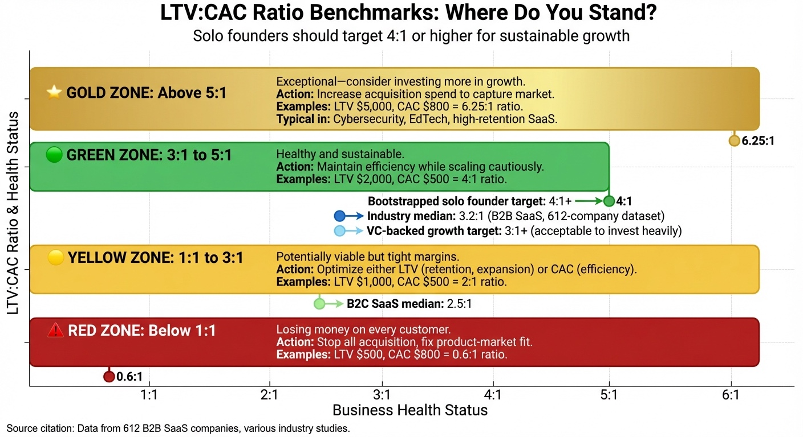
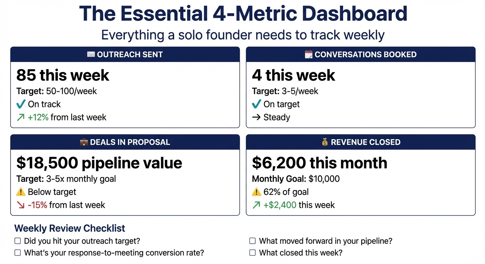

# Chapter 8: Measuring What Matters—Metrics for Solo Founders

You just had your best week. Eighty outreach messages sent. Six responses. Two discovery calls booked. You close your laptop feeling productive.

But was it actually good?

Without the right metrics, you can't answer that question. Maybe those six responses came from unqualified prospects who'll never buy. Maybe your two calls were with tire-kickers while three serious buyers got lost in your follow-up. Maybe you're celebrating activity while missing the signal buried in the noise.

Most solo founders face a measurement paradox: either tracking nothing or tracking everything. Both approaches fail.

Tracking nothing leaves you flying blind. You can't identify which channels produce the best customers, which messaging resonates, or where your process breaks down. You're guessing instead of deciding.

Tracking everything creates analysis paralysis. You spend hours updating dashboards nobody reviews, monitoring vanity metrics that feel good but don't matter, and analyzing your way out of actually doing the work.

FirstPageSage's 2024 analysis of 612 B2B SaaS companies found that businesses tracking 5–7 core metrics achieve 38% better sales velocity than those drowning in data [1]. Not more metrics. Not fewer. The right metrics.

Using your acquisition system—outreach, discovery, pricing, channels, retention—this chapter gives you the instrument panel to know whether that system is working. The handful of numbers that indicate health, focus improvement efforts, and signal when something is broken.

Not enterprise sales analytics designed for 50-person sales teams. Not growth-at-all-costs vanity metrics for VC-funded companies. The specific numbers that help you—one person, limited time—make better decisions.

> **Founder-Type Note:** The core metrics (LTV:CAC, churn, conversion rates) apply to all business models, but how you calculate them differs. B2B SaaS founders track monthly/annual recurring revenue and subscription churn. Coaches and creators track repeat purchases, upsells, and referral rates. Model-specific guidance varies by business type.

## The Only Three Questions Your Metrics Need to Answer

Every useful metric answers one of three questions:

**Question 1: Is my acquisition working?**

Are people responding to my outreach? Are they booking calls? Are they buying? Is the top of the funnel producing opportunities, and are those opportunities converting to revenue?

**Question 2: Am I building a sustainable business?**

Are my customers staying? Are they profitable? Am I spending more to acquire customers than they're worth? They show whether you're building something that can last or burning through cash on customers who leave.

**Question 3: Where is my process broken?**

Where are prospects dropping out? Which stage has the biggest gap between what's possible and what's happening? These diagnostic metrics help you focus your improvement efforts on the right problems.

If a metric doesn't answer one of these questions, you probably don't need to track it.

## The Core Acquisition Metrics

**Response Rate Benchmarks:**

| Outreach Type | Typical Reply Rate | Notes |
|---------------|--------------------|-------|
| **Targeted cold email (under 100 recipients)** | ~5.5% | Belkins 2025 benchmarks [3] |
| **Broader cold email patterns (10+ contacts/company)** | ~3.8% | Belkins 2025 benchmarks [3] |
| **Highly personalized outreach** | Above baseline | Case studies vary by market and message |

Use these benchmarks as starting points, not targets—your own baseline matters more than any industry average.

**Response Rate**

For outbound channels—cold email, LinkedIn outreach, direct messages—response rate is your primary signal. It tells you whether your messaging resonates and whether you're reaching the right people.

Divide responses by outreach attempts.

Cold email: low single-digit rates; below baseline = targeting, deliverability, or messaging [3]. LinkedIn: warm up first; lead with context, not pitch.

**Case Study (Segment Analysis):**
**Problem:** Solo founder selling analytics software targeted both marketing directors and CTOs; after three months, marketing directors showed 12% response, 8% meeting rate, $2,400 avg deal vs. CTOs 3% response, 1% meeting rate, $3,200 avg deal—far fewer CTOs engaged.
**Solution:** He shifted 80% of outreach to marketing directors.
**Result:** Monthly revenue rose from $4,800 to $9,600 on the same email volume. Limited time was better spent where the math worked.

**Meetings Booked**

Response rate alone doesn't tell you if those responses convert to opportunities. Meetings booked is the metric that bridges outreach and pipeline.

Track this as an absolute number and as a conversion rate from responses. If you get 50 responses and book ten meetings, your response-to-meeting rate is 20%.

The meetings-booked metric often reveals messaging problems. High response rates with low meeting booking rates usually means your initial message is interesting but your follow-up doesn't close the call. Or your respondents are curious but not qualified.

**Pipeline Value**

Your pipeline is the total potential value of all active opportunities. If you have ten deals at various stages, each worth $2,000, your pipeline value is $20,000.

Roughly what revenue is possible if everything closes; typically 20–30% of pipeline converts to revenue.

Warning sign: if your pipeline value is less than 3x your revenue target, you probably won't hit your number. A healthy pipeline for solo founder B2B sales is typically 3–5x target revenue.

**Win Rate**

Divide closed deals by total opportunities for win rate. Twenty discovery calls and five closed deals = 25% win rate.

Win rate is where many founders deceive themselves. They count everyone who expressed interest as an "opportunity," then wonder why their win rate is 5%. A true opportunity is a qualified prospect who's had a real conversation about buying—not everyone who opened your email.

**Win Rate Benchmarks:**

Win rates vary widely by channel, deal size, and qualification rigor. Use the 44% Livespace.io average as a loose reference point, but prioritize your own baseline and trend over time [4].

**Important caveat:** These benchmarks require sufficient deal volume to be meaningful. If you've had fewer than 20 qualified conversations total, your win rate will swing wildly based on small sample sizes—one lucky or unlucky week changes everything. Don't optimize for win rate until you have enough data to trust the number. Until then, focus on volume: get more conversations happening. Win rate becomes useful after you've had 30–50 qualified opportunities.

If your win rate is below 15% with meaningful volume, you're either qualifying poorly (letting unqualified prospects into your pipeline) or presenting poorly (failing to convert qualified prospects). The diagnostic work is figuring out which.

**Sales Cycle Length**

How long does it take from first contact to closed deal? This matters for forecasting and for identifying stuck deals.

Track the average and distribution. Mixed cycle lengths (e.g., 7 days vs 90 days) often indicate different customer types; use this to set expectations and flag stalled deals.

**Sales Cycle Length Benchmarks:**

| Deal Size (ACV) | Typical Sales Cycle | Notes |
|-----------------|---------------------|-------|
| **SMB (under $15,000)** | 14–30 days | Growleady.io 2025 analysis [7] |
| **Solo Founder Sub-$5K** | 14–30 days | Typical for solo founder deals |
| **Mid-Market ($15,000–$100,000)** | 30–90 days | Growleady.io 2025 analysis [7] |
| **Enterprise (over $100,000)** | 90–180+ days | Growleady.io 2025 analysis [7] |
| **Overall B2B Median** | 84 days (2.1 months) | Databox 2025 research [6] |

**Warning:** Solo founder deals under $5K taking over 45 days = process friction.

## The Sustainability Metrics

**Note for early-stage founders:** The metrics in this section require customers to measure. If you're pre-revenue or have fewer than 10 customers, these numbers won't be statistically meaningful yet. Read this section to understand what you're building toward, but focus your energy on the acquisition metrics above. Come back to sustainability metrics once you have 3–6 months of customer data to analyze.

These metrics indicate whether purchases build a lasting business. FirstPageSage's 2024 analysis of 612 B2B SaaS companies shows median LTV:CAC 3.2:1 (top performers 4:1–5:1) [8]; Vitally's 2025 research shows B2B SaaS median 3.5% monthly churn, with under 5% annual representing sustainable growth [9]. Benchmark details are in the tables below.

**Customer Acquisition Cost (CAC)**

CAC = total spend to acquire a customer (tools, ads, your time, contractors). Example: $500/month for 5 customers = $100 CAC. Meaningful only relative to LTV.

**CAC Benchmarks by Industry:**

| Industry | Average CAC | Notes |
|----------|-------------|-------|
| **B2B SaaS** | $536 - $702 | FirstPageSage 2024 analysis [2] |
| **Fintech** | ~$1,450 | Higher due to regulatory complexity and longer sales cycles |
| **B2C SaaS** | Lower than B2B | Higher volume, lower touch model |
| **Organic/SEO** | $30.33 | Bootstrapped B2B SaaS (playbooks) |
| **Paid Ads** | $59.17 | Bootstrapped B2B SaaS (playbooks) |

**Note:** CAC varies significantly by channel, deal size, and business model. Track your own CAC by channel to identify the most efficient acquisition paths [5].

**Lifetime Value (LTV)**

LTV = total revenue expected from a customer. Subscription: monthly revenue × lifespan. One-time: purchase price + repeat/upsells. Rough estimate: average sale × average number of purchases. Example: $500 product, 20% buy $1K follow-up → LTV ≈ $700.

**LTV:CAC Ratio**

*Figure 8.1: LTV:CAC Ratio Benchmarks. The metric that tells you whether your business model works. Below 1:1 means you're losing money on every customer. 1:1 to 3:1 is tight margins but potentially viable. 3:1 or higher is healthy and sustainable. The median across B2B SaaS is 3.2:1, with top performers reaching 4:1 or 5:1.*

Divide lifetime value by customer acquisition cost. The ratio tells you whether your business model works.

Example: $700 LTV ÷ $100 CAC = 7:1 (excellent).

**LTV:CAC Ratio Benchmarks:**

| Ratio | Status | Notes |
|-------|--------|-------|
| **5:1+** | Excellent | Cybersecurity, EdTech; top performers with room to invest more |
| **4:1** | Strong | B2B SaaS target (Phoenix Strategy Group 2025) |
| **3:1–3.2:1** | Healthy | B2B SaaS median, solo founder minimum sustainable [8] |
| **2.5:1** | Acceptable | B2C SaaS efficient ratio (higher volume model) |
| **1:1–3:1** | Tight margins | Potentially viable but risky |
| **Below 1:1** | Unsustainable | Losing money on every customer |

**Case Study (LTV:CAC in Action):**
**Problem:** B2B SaaS founder needed to decide where to invest: organic content vs. paid ads vs. referral.
**Solution:** After 12 months he calculated: LTV $2,400 ($200/mo × 12 mo); organic CAC $0; paid CAC $450 (5.3:1). Referral: $0 CAC, 18-mo LTV $3,600.
**Result:** Ratios justified continuing content investment and doubling down on organic rather than rushing to paid ads.

**Churn Rate**

For subscription businesses, churn = the percentage of customers who leave in a given period. If you start the month with 100 customers and lose five, your monthly churn is 5%.

The churn math compounds significantly. At 5% monthly churn, you lose 46% of your customers annually. At 2% monthly churn, you lose 22%. That difference—46% vs 22%—is the difference between a business that grows and one that constantly refills a leaky bucket.

Vitally's 2025 research: B2B SaaS median 3.5% monthly churn (2.6% voluntary, 0.8% involuntary); under 5% annual = sustainable benchmark [9]. Churn is highly sensitive to ACV and segment. A monolithic "good churn rate" doesn't exist—it's relative to your business model:

- **Enterprise SaaS:** <1% monthly churn, <10% annual churn. Primary churn drivers are stakeholder changes and M&A.
- **SMB SaaS:** 3-7% monthly churn, 30-50%+ annual churn. Primary drivers are price sensitivity and business failure rates among small clients.
- **Freemium/Usage-based:** 5-10%+ monthly churn, >50% annual churn. Primary drivers are low commitment and "tourist" users who never fully adopt.

For solo founders targeting SMB customers, monthly churn below 3% is healthy. Below 5% is acceptable. Above 5%, fixing churn should be the top priority—it's almost impossible to grow faster than customers are being lost. The metric of "Revenue Churn" is far more critical than "Logo Churn"—losing ten customers on a $10/month plan is less damaging than losing one customer on a $500/month plan.

**Net Revenue Retention (NRR)**

NRR accounts for both churn and expansion: of the customers you had 12 months ago, how much are they paying you today?

If a cohort of customers paid you $10,000 twelve months ago and those same customers (minus churned ones, plus their upsells) pay you $11,000 today, your NRR is 110%.

NRR above 100%—the holy grail of subscription businesses—means your existing customers are growing faster than they're churning. You grow even without acquiring new customers.

Optif.ai's 2025 research shows the median NRR for venture-backed SaaS companies is 106%, with elite companies hitting 120%+ NRR [10]. For solo founders, SMB-focused businesses should target 90–105% NRR, while mid-market businesses can achieve 105–115%.

For bootstrapped solo founders, 90–100% NRR is healthy [10]. Above 100% is exceptional. Below 85% indicates a retention or expansion problem.

**CAC Payback Period**

CAC payback period = how long until that customer's revenue recovers your acquisition cost. If your CAC is $500 and your customer pays $100/month, your payback period is 5 months.

**CAC Payback Period Benchmarks:**

| Business Model | Target Payback Period | Notes |
|----------------|----------------------|-------|
| **B2B SaaS (Bootstrapped)** | 4–6 months | Solo founder target for sustainable cash flow |
| **B2B SaaS (VC-backed)** | 6–12 months | Can afford longer payback with funding |
| **SMB SaaS** | 3–6 months | Lower ACV requires faster payback |
| **Mid-Market SaaS** | 6–12 months | Higher ACV allows longer payback |
| **Enterprise SaaS** | 12–18 months | Very high ACV, longer sales cycles acceptable |

Faster payback = better cash flow. Payback + LTV:CAC tell the full story. Target: recover CAC within 6 months for bootstrapped solo founders.

## The Diagnostic Metrics

**Stage Conversion Rates**

Track how many prospects move from each stage to the next. These stage metrics are where you'll find most of your problems.

| Stage | Conversion Rate | Notes |
|-------|----------------|-------|
| **Lead → MQL** | 39% | Marketing Qualified Lead (B2B SaaS benchmark) [11] |
| **MQL → SQL** | 38% | Sales Qualified Lead (B2B SaaS benchmark) [11] |
| **SQL → Opportunity** | 42% | Qualified opportunity (B2B SaaS benchmark) [11] |
| **Opportunity → Closed Won** | 37% | Closed deal (B2B SaaS benchmark) [11] |
| **Response → Meeting** | 20% | Typical for solo founders (50 responses → 10 meetings) |
| **Meeting → Qualified** | 60-70% | If using proper MVQ qualification |
| **Qualified → Closed** | 15-40% | Varies by channel (see Win Rate Benchmarks) |

- Lead -> Contacted: Did you reach them?
- Contacted -> Response: Did they engage?
- Response -> Discovery: Did you get a conversation?
- Discovery -> Proposal: Were they qualified?
- Proposal -> Closed: Did they buy?

Each stage tells you something different. Low lead-to-contacted means your data is bad or your outreach is blocked. Low contacted-to-response means your messaging isn't resonating. Low discovery-to-proposal means you're talking to unqualified prospects. Low proposal-to-closed means your pricing, presentation, or timing is off.

Drops week-over-week often signal data quality or timing; systematic tracking distinguishes real problems from noise.

**Channel Performance**

Not all acquisition channels produce equally. Track metrics by source so you know where to invest more time.

The channels to compare:

- Cold email
- LinkedIn outreach
- Content/inbound
- Referrals
- Partnerships

For each, track: leads generated, meetings booked, deals closed, revenue generated, and time invested.

Analysis typically reveals that one or two channels significantly outperform the others. Invest more time in those. Reduce or eliminate the rest.

**Case Study (Channel Mix):**
**Problem:** Solo founder was splitting time across cold email and referrals without measuring efficiency.
**Solution:** He measured revenue per hour: referrals 3x cold email. Cold email still fed referral sources.
**Result:** He shifted prospecting time toward referrals while keeping cold email for pipeline; overall yield improved.

**Time in Stage**

How long do deals sit in each pipeline stage before moving forward (or dying)?

Track the average and watch for outliers. A deal that's been in "Proposal Sent" for 45 days isn't going to close—it's dead and you should mark it as such. A deal that's been in "Discovery" for 3 weeks needs a push to determine if there's real interest.

Benchmark: For solo founder deals, healthy stage times are:

- Discovery: 1–2 weeks
- Proposal: 1–2 weeks
- Negotiation: 1 week
- Total cycle: 3–6 weeks

If your average time in any stage exceeds 3 weeks, deals are stalling. Either your process is creating friction or you're not pushing hard enough for decisions.

## What Not to Measure

Not everything that can be measured should be measured. These are the metrics that waste your time:

**Metrics without context.** Website visitors, social media followers, email list size—useful only when paired with outcomes. A founder with 100 subscribers at 10% convert beats 10,000 at 0.1%. The key is tracking these metrics *in relation to* conversion rates and revenue. Track top-of-funnel metrics, but always pair them with bottom-of-funnel outcomes.

**Metrics you can't act on.** If tracking a number won't change your behavior, don't track it. Email open rates illustrate this principle: even if open rates drop, the response is identical to when response rates drop. Response rates are the actionable metric; open rates are noise.

**Lagging indicators without leading indicators.** Revenue is a lagging indicator - by the time you see it, the work that produced it happened weeks or months ago. Track leading indicators (outreach volume, response rates, meetings booked) that you can influence today. Use lagging indicators (revenue, churn) to validate that your leading indicators are the right ones.

**Metrics that require more tracking time than improvement time.** If you spend an hour updating your dashboard and ten minutes analyzing it, something is wrong. The measurement overhead should be trivial compared to the insight gained.

## Building Your Solo Founder Dashboard

*Figure 8.2: The Essential 4-Metric Dashboard. These four metrics tell you everything you need to know when you're starting out: outreach sent, conversations booked, deals in proposal stage, and revenue closed. Update them weekly in a simple spreadsheet. If these four metrics are healthy, your acquisition system is working.*

A minimal dashboard that covers what matters:

**The Essential Dashboard (For Most Solo Founders)**

Start simple. If you're pre-revenue, these are the only metrics that matter:

1. **Outreach sent:** Personalized messages sent (Target: 50–100/week)
2. **Conversations booked:** Discovery calls scheduled (Target: 3–5/week from 50 outreach)
3. **Deals in proposal stage:** Qualified opportunities active (Target: 3–5x monthly revenue goal)
4. **Revenue closed:** What closed this week/month (track against goal)

Four numbers. Update weekly in a spreadsheet. If these are healthy, your acquisition system is working.

**Tooling doesn't matter as much as review cadence.** A 15-minute weekly review in Google Sheets beats an elaborate dashboard you check once a month. Pick something simple enough that you'll actually use it. (See "The Metric Review Rhythm" later in this chapter for daily/weekly/monthly schedules.)

### When You're Ready for More

Add complexity only when you have consistent data and a clear need. The sustainability metrics (CAC, LTV, LTV:CAC, NRR) and diagnostic metrics (sales cycle length, time in stage, channel attribution) covered earlier in this chapter become relevant once you have 20+ customers and 3–6 months of data.

### Tracking Across Multiple Tools

Most solo founders have data scattered across a CRM, a payment processor, an outbound tool, and possibly a product or course platform. You don't need a data warehouse to make this work.

**The minimal tracking stack:**

- **CRM** as the source of truth for deals and pipeline stages
- **Payment processor** (Stripe, PayPal, or your accounting tool) as the source of truth for revenue
- **Spreadsheet** where you calculate LTV, CAC, churn, and NRR from weekly/monthly exports

Once a week or month, export deals and stages from your CRM, new customers and revenue from your payment tool, and outreach volume from your email/LinkedIn tools. Then calculate your core metrics in that single spreadsheet. Many modern CRMs (HubSpot, Attio, Close) integrate directly with Stripe, Calendly, and email tools—so some of this stitching can be automated as you scale.

**Channel-level metrics:** Once you have 20+ customers, calculate CAC and LTV *by acquisition channel* (cold email vs. referrals vs. content). This is where the big allocation decisions come from. You may discover that referrals have 3x the LTV of cold email customers at half the CAC—that insight changes how you spend your time.

**For SaaS/app founders:** If you have a product with user logins, consider lightweight product analytics (PostHog, Mixpanel, or simple server-side event logging) for usage-based churn prediction. This is optional and adds complexity—only add it when you feel pain from not having it.

### Self-Hosted Analytics (Optional Advanced)

If you're a technical founder running a VPS stack (Chapter 7), you can pull data from your SaaS tools into your own database and dashboards. A common pattern:

- Central Postgres database on your VPS
- ETL/automation with n8n or Trigger.dev pulling data from Stripe, your CRM, and outbound tools on a schedule
- Lightweight BI tool (Metabase, Lightdash, or Grafana) for dashboards

This setup gives you one place to calculate LTV, CAC, churn, and NRR across all your tools—and you're not locked into any one vendor's reports.

**When to move to this:** If you're under ~50 customers and a few thousand in MRR, a spreadsheet plus exports will give you 90% of the insight for 10% of the effort. Move to a central database and BI only when you feel pain from manual exports—usually when you're updating the same spreadsheet for the third time that week and wishing it would just refresh automatically.

## The "One Metric That Matters" Framework

Startup investor Sean Ellis coined the term "North Star metric" to reduce administrative overhead, simplify meetings, and align entire organizations around a singular growth goal [12]. When everything is a priority, nothing is. At any given time, you should have one metric that's your primary focus.

The OMTM (One Metric That Matters) is the single number that best reflects the health of your business at this stage. The OMTM changes as your business evolves.

**Pre-product-market fit:** Conversations. Are you talking to potential customers and learning from them?

**Early sales:** Win rate. When you talk to qualified prospects, are they buying?

**Growth stage:** Pipeline velocity. Is your acquisition engine producing enough qualified opportunities?

**Scaling:** LTV:CAC ratio. Is growth sustainable and profitable?

**Retention focus:** NRR. Are existing customers providing a foundation for growth?

Pick one. Make it visible. Let it guide your daily decisions about where to spend time. When everything is a priority, nothing is.

**Case Study (OMTM—Discovery Calls Booked):**
**Problem:** B2B SaaS founder needed a clear pipeline lever.
**Solution:** OMTM = "discovery calls booked" for 90 days. Each week: refine ICP, then personalization, then A/B test.
**Result:** 4% → 18% meeting rate; 66 calls, 19 customers (29% close), $47,500. One metric created clarity; ten created confusion.

## Forecasting: Predicting Revenue Without Crystal Balls

Forecasting as a solo founder is challenging: insufficient deals for statistical models, pipeline fluctuations too large for trend analysis [13].

A simple forecasting approach for small deal volumes:

**The Binary Method**

For each active deal, make a forced choice: Commit or Upside.

- **Commit:** You'd bet your own money this closes this month. The prospect has confirmed intent, has budget, and there are no remaining blockers you know of.
- **Upside:** Everything else.

Your forecast = Sum of Commits. That's it.

Don't count the maybe deals. They're not predictable enough to forecast.

With 10 deals, variance is too high for probability weighting; Commit/Upside is more accurate.

**The Pipeline Coverage Test**

A simpler check: is your pipeline large enough to hit your target?

If you want $10,000 in revenue this month and your win rate is 25%, you need $40,000 in pipeline (opportunities at the proposal stage or later).

If you have $20,000 in pipeline, you probably won't hit $10,000 - even if everything goes well.

**Pre-revenue:** If you have few deals or one dominates, focus on adding more. Pipeline coverage math becomes useful at 5–10 active opportunities.

This backward math is harsh but clarifying. It forces you to confront whether your activity level matches your revenue goals.

## When to Worry (And When Not To)

Metrics should inform decisions, not create anxiety. How to interpret what you're seeing:

**Worry when:** A metric trends in the wrong direction for 3+ weeks consecutively. One bad week is noise. Three bad weeks is a pattern that needs attention.

**Don't worry when:** Weekly variation is normal. Response rates will fluctuate. Some weeks you'll close three deals, some weeks zero. Look at rolling averages, not individual data points.

**Worry when:** Your LTV:CAC is below 3:1 and you're trying to grow. You're spending more on acquisition than you're getting back.

**Don't worry when:** You're investing in channels that take time to mature (content, community). Track leading indicators of future payoff (audience growth, engagement) while the revenue catches up.

**Worry when:** Win rate is declining while pipeline is growing. You're generating more opportunities but converting fewer—probably a qualification problem.

**Don't worry when:** Win rate is high but volume is low. This isn't a conversion problem; it's an acquisition problem. Focus on generating more opportunities, not optimizing conversion.

## The Metric Review Rhythm

Research on review cadences shows that daily detailed tracking creates burnout, while monthly-only reviews allow problems to compound [14]. Consistency matters more than sophistication. A rhythm that works:

**Daily (2 minutes):** Glance at activity. Did you hit your outreach target? Any responses or meetings to schedule? This isn't analysis—it's awareness. You're checking that the machine is running. A quick glance catches problems before they compound.

**Weekly (15 minutes):** Pull up your numbers. What moved? What stalled? Note concerns for investigation; don't rabbit-hole during the review.

Friday afternoon works well—closes the week with clarity for Monday focus.

**Monthly (30 minutes):** Zoom out. What are the trends? Are channels improving or declining? Is your win rate changing? This is when you make decisions about where to invest more time and what to cut. Use AI as a pattern spotter: prompt it with your metrics and ask "What patterns? What should concern me?" AI catches cross-metric shifts you'd miss—response rate steady but response-to-meeting down 15%, or a deal stuck in proposal twice the median length.

**Quarterly (1 hour):** LTV:CAC (is acquisition still profitable?), NRR (are existing customers growing or shrinking?), sales cycle trends, forecast accuracy, resource allocation.

## Learning From the Numbers

Research shows that founders who get the most from their metrics are curious about the stories behind the numbers—they don't just record that response rates dropped; they figure out why and fix it [15]. The value of metrics isn't in the tracking—it's in what you learn and what you change.

Every metric tells a story. When your response rate drops, something changed—your list quality, your message, your timing, or the market. When your win rate climbs, you've gotten better at something—qualification, presentation, or prospect selection. The skill is developing hypotheses about what the numbers mean and testing them systematically.

**Case Study (Diagnosing a Drop):**
**Problem:** A solo founder noticed cold email response rates dropping.
**Solution:** He tested three hypotheses: list quality, message staleness, segment fatigue. Fresh lists performed best.
**Result:** The list vendor had started including lower-quality data. Diagnosis required systematic metric tracking.

## A Note on Enterprise Analytics

Enterprise sales analytics—dozens of metrics, attribution models, cohort analyses, Salesforce dashboards—doesn't scale down to solo founders. You don't have the data volume for statistical significance, the team to maintain dashboards, or the budget for enterprise tools. With 50 leads/month, you're often reading noise as signal. Track enough to learn, not so much that tracking becomes procrastination.

## Chapter Summary: TL;DR

**The core insight:** Metrics are tools, not goals. Track 5–7 core metrics maximum, focus on leading indicators you can influence, and establish a weekly review cadence. The OMTM (One Metric That Matters) approach prevents metric overload.

**Key takeaways:**
- Companies tracking 5–7 core metrics achieve 38% better sales velocity than those drowning in data
- Leading indicators (outreach sent, calls booked) predict results; lagging indicators (revenue, churn) confirm them
- LTV:CAC ratio: 3:1 minimum healthy, top performers reach 4:1 or 5:1
- Average B2B SaaS monthly churn: 3.5%; under 5% annual churn is sustainable
- Weekly reviews with daily glances—enough to catch issues, not so much it becomes procrastination
- Minimal tracking stack: CRM for deals, payment processor for revenue, spreadsheet for calculations

**Next chapter:** Chapter 9 covers handling obstacles—objections, rejections, and the psychology of selling as a solo founder.

---

## The Exercise: Build Your Metrics System

Before moving on, set up the minimum viable metrics system for your business.

1. **Choose your tracking tool.** A spreadsheet is fine. Notion, Airtable, or your CRM work too. Pick something simple that you'll actually update.
2. **Define your pipeline stages.** What are the steps from first contact to closed deal? Write them down with clear criteria for what moves a deal from one stage to the next.
3. **Identify your OMTM.** Based on your current stage, what's the one metric that matters most? This becomes your primary focus.
4. **Set up your weekly review.** Block 15 minutes every Friday to update your numbers and review what they're telling you. Make it a recurring appointment.
5. **Establish baselines.** You need a starting point to measure improvement against. Even if your numbers are bad, write them down. In three months, you'll be glad you did.
6. **Create alert thresholds.** What numbers would trigger concern? If response rate drops below X or churn exceeds Y, that's a signal to investigate.

---

## Chapter Checklist

**Before moving to Chapter 9, complete:**

- [ ] Chosen your tracking tool (spreadsheet, Notion, Airtable, or CRM)
- [ ] Identified your data sources (CRM for deals, payment processor for revenue)
- [ ] Defined your pipeline stages with clear transition criteria
- [ ] Identified your OMTM (One Metric That Matters) for current stage
- [ ] Blocked 15 minutes weekly for metrics review
- [ ] Established baseline numbers for key metrics
- [ ] Set alert thresholds for concerning changes

**Self-assessment questions:**
- Can I name the 5–7 metrics that matter most to my business right now?
- Do I know which leading indicators predict my results?
- Am I reviewing weekly, or is my data sitting unused?
- Can I explain what my current numbers mean for my business health?

[1] FirstPageSage, "The SaaS LTV to CAC Ratio," 2024. Analysis of 612 B2B SaaS companies reveals that businesses tracking 5–7 core metrics achieve 38% better sales velocity than those drowning in data. Companies maintaining sales cycles between 30–45 days achieve 38% better velocity than those with longer cycles.

[2] FirstPageSage, "The SaaS LTV to CAC Ratio," 2024. Median LTV:CAC across 612 B2B SaaS companies is 3.2:1, with top performers reaching 4:1 or 5:1.

[3] Belkins. (2025). What are B2B cold email response rates? Belkins' 2025 study. Campaigns under 100 recipients averaged 5.5% reply rates; campaigns targeting 10+ contacts per company averaged 3.8%. https://belkins.io/blog/cold-email-response-rates

[4] Livespace.io, "B2B Sales Benchmarks Report," 2025. According to Livespace's B2B Sales Benchmarks Report, the average B2B win rate is 44% (calculated by dividing the number of won deals by total closed deals). Among Livespace CRM customers, the average win rate is 56% with a standard deviation of 30%, indicating substantial variation depending on industry and sales approach.

[5] Channel-level CAC analysis is a core principle of unit economics for acquisition. Calculating CAC by channel (organic, paid, referral, outbound) reveals which acquisition paths are most efficient and informs resource allocation. Multiple sources on SaaS unit economics, 2024-2025.

[6] Databox, "B2B Sales Cycle Length," 2025. Median B2B SaaS sales cycle is 84 days (2.1 months). Optif.ai, "Sales Cycle Length Benchmark," 2025.

[7] Growleady.io, "How Long Does B2B Sales Take," 2025. SMB deals (under $15K ACV): 14–30 days; mid-market ($15K-$100K): 30–90 days; enterprise (over $100K): 90–180+ days.

[8] FirstPageSage, "The SaaS LTV to CAC Ratio," 2024. Median LTV:CAC across 612 B2B SaaS companies is 3.2:1. Phoenix Strategy Group, "LTV/CAC Ratio SaaS Benchmarks," 2025. B2B SaaS companies typically target 4:1 ratios, while B2C SaaS operates efficiently at 2.5:1 due to higher volume. Specialized sectors like cybersecurity and EdTech often achieve 5:1 ratios because of higher lifetime values and lower churn. Top performers reach 4:1 or 5:1.

[9] Vitally, "SaaS Churn Benchmarks," 2025. Average monthly churn for B2B SaaS is 3.5% (2.6% voluntary, 0.8% involuntary). Powered by Search, "B2B SaaS Churn Rate Benchmarks," 2025. Annual churn under 5% is sustainable growth benchmark.

[10] Optif.ai, "B2B SaaS Net Revenue Retention Benchmark," 2025. Median NRR for venture-backed SaaS is 106%, with elite companies at 120%+. Directive Consulting, "B2B SaaS Marketing Guide," 2026. For solo founders, SMB-focused businesses should target 90–105% NRR, while mid-market businesses can achieve 105–115%.

[11] Research on B2B SaaS funnel conversion rates shows typical funnels convert 39% of leads to Marketing Qualified Leads (MQLs), 38% of MQLs to Sales Qualified Leads (SQLs), 42% of SQLs to Opportunities, and 37% of opportunities to closed won customers. Multiple sources, 2024–2025.

[12] Startup investor Sean Ellis coined the term "North Star metric" to reduce administrative overhead, simplify meetings, and align entire organizations around a singular growth goal. The concept draws from Polaris, the star lying directly above Earth's northern pole - a fixed point providing reliable navigation.

[13] Statistical significance requires volume. VC-backed companies with 1,000 leads per month can test messaging variations and see meaningful patterns, while solo founders with 50 leads per month are reading noise as signal. The A/B test that "proves" Message A beats Message B might just be random variation.

[14] Research on review cadences shows that daily detailed tracking creates burnout, while monthly-only reviews allow problems to compound. The weekly review with daily glances strikes the optimal balance—enough awareness to catch issues early, not so much analysis that it becomes procrastination.

[15] Research shows that founders who get the most from their metrics are curious about the stories behind the numbers—they don't just record that response rates dropped; they figure out why and fix it. The skill is developing hypotheses about what the numbers mean and testing them systematically.
