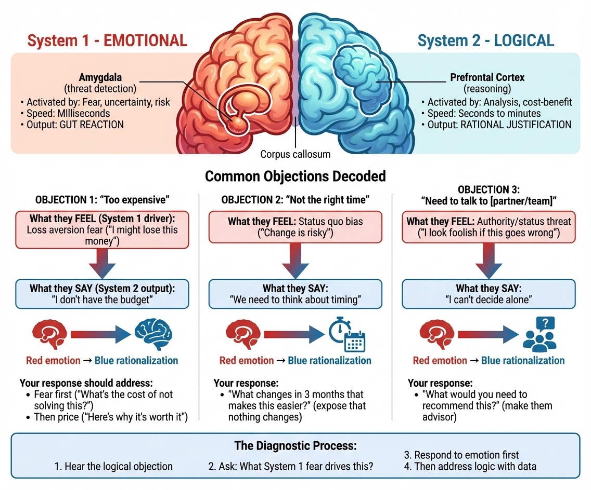

# Chapter 9: Handling Obstacles—Objections, Rejection, and the Psychology of Selling

The prospect said they needed to "think about it." That was three weeks ago. You've followed up twice. Silence.

Another lead went cold after a promising discovery call. A third said your price was "more than expected"—and you immediately offered 20% off, which they still declined.

Each rejection lands harder than the last. You start wondering if you're cut out for this.

Here's what no one tells you: rejection is inevitable in sales. Most outreach won't receive responses. Most responses won't convert to purchases. Most assumptions about customer needs will prove incorrect. This isn't failure—it's the normal terrain of customer acquisition.

The founders who build successful businesses aren't those who avoid rejection. They're those who develop a healthy relationship with it. They learn to hear "no" as information rather than identity. They build systems that make rejection manageable instead of devastating.

The research backs this up: 72% of price objections aren't actually about price—they represent unvalidated value, unaddressed risk, or concerns the prospect hasn't voiced [1]. 80% of sales require at least five touchpoints, but most people give up after one or two [2]. And negativity bias means every rejection feels disproportionately significant [3].

> **Founder-Type Note:** Objection patterns differ by business model. B2B SaaS founders often hear "we need to evaluate other options" or "budget approval required." Coaches and creators more frequently hear "I can't afford this right now" or "I need to think about it." The underlying psychology is the same, but specific objections differ. See Chapters 4 and 5 for tactical responses; this chapter covers the mindset that makes those responses effective.

This chapter covers the psychological and tactical side of handling obstacles: the objections prospects raise, the rejection that's inevitable in any sales process, and the mental frameworks that keep you moving forward.

## The Psychology of Why Selling Feels Hard

LinkedIn analysis of technical founder sales struggles shows that identity-role conflict creates significant cognitive load, particularly for founders transitioning from "founder mode" to "seller mode" [4]. Understanding why selling feels difficult isn't about character flaws—it's about psychology.

**The Identity-Role Conflict**

Most solo founders experience selling as a conflict between their "builder" identity and the "seller" role. When attempting to sell, the brain signals acting "out of character," triggering anxiety.

**For new founders:** If you don't have an established builder identity yet, the conflict feels more like "I don't know who I am in this role." That ambiguity is normal—your identity is being forged through these uncomfortable experiences.

The question isn't whether you'll feel this conflict—you will. The question is how you respond when objections and rejection amplify it.

**Negativity Bias and Rejection**

Negativity bias research indicates negative stimuli are processed 3–5x more intensely than positive stimuli [3]. One "no" can overshadow five "yes" responses.

For solo founders, this negativity bias is amplified. When there's no team to share the rejection, every "no" feels entirely personal. A prospect rejecting your software feels like they're saying your code is bad. A prospect rejecting your coaching feels like they're saying you're not worth it.

This reaction is irrational but real. Understanding it doesn't make it disappear, but it helps you recognize when your brain is overweighting negative feedback.

> **⚠️ Common Mistake: Discounting at the first price objection**
>
> When a prospect says "that's more than I expected," the instinct is to immediately offer a discount. This signals that your original price wasn't real—and often still doesn't close the deal.
>
> **Why it happens:** Rejection feels personal, and discounting feels like a way to remove the obstacle and end the discomfort.
>
> **What to do instead:** Explore what's behind the objection. "When you say it's more than expected, what were you comparing it to?" or "What would make this feel like a worthwhile investment?" Most price objections aren't about price—they're about unvalidated value. Address the real concern before adjusting price.

**The Imposter Syndrome Tax**

84% of entrepreneurs experience imposter syndrome—the feeling that they're not qualified despite evidence to the contrary [5]. This shows up in sales as underpricing, over-qualifying yourself before making the ask, and interpreting any hesitation as confirmation that you're not good enough.

Imposter syndrome creates a vicious cycle. You underprice because you're not confident. Low prices attract difficult customers. Difficult customers reinforce your sense that you're not good enough. You underprice more.

Breaking this cycle requires external evidence. Track your wins. Document your successes. When imposter syndrome whispers that you're not qualified, you need data that proves otherwise.

**When you don't have wins to track yet:** Early-stage founders face a chicken-and-egg problem—imposter syndrome prevents selling, and lack of sales reinforces imposter syndrome. In this case, track effort rather than outcomes. Log every outreach sent, every conversation had, every piece of feedback received. These are wins too. They're evidence that you're doing the work despite the fear. Outcome-based wins will follow effort-based wins.

## Reframing Sales: From Extraction to Service

The most effective psychological shift for founder-led selling is changing how you think about what sales actually is.

**The Old Frame (Extraction):** "I am trying to get money from you."

This frame makes every sales conversation feel adversarial. You're on opposite sides. If they give you money, they lose something. Your job is to convince them to lose.

**The New Frame (Service):** "I am trying to see if I can solve your problem."

This frame makes sales collaborative. You're on the same side, figuring out together whether there's a fit. If there's a fit, you both win—they get their problem solved, you get compensated for the solution. If there's no fit, you've both learned something useful.

The service frame isn't just a mental trick. It changes how you behave in sales conversations. You ask more questions. You listen more carefully. You're genuinely curious about whether you can help rather than anxious about whether they'll buy. Prospects feel the difference.

**The Scientist Frame (For Technical Founders)**

If you're a founder who struggles with sales, try treating every conversation as research. Your goal isn't to "close the deal." Your goal is to gather data. What problems does this person face? How do they currently solve them? What would make a solution valuable to them? What would make them not buy?

This reframe works because it aligns with how technical people naturally think. You're not performing—you're investigating. The pressure to be "good at sales" disappears. You're just learning.

**When you're desperate for revenue:** This reframe is easier to adopt when you have runway. When you're three months from broke, treating every conversation as "research" feels like a luxury. In survival mode, you need both: the scientist mindset (curious, diagnostic) combined with direct asks for the business.

**Case Study (Identity + Scientist Reframe):**
**Problem:** Technical founder had performance anxiety before sales calls—felt like pretending to be someone else.
**Solution:** Reframed selling as an extension of technical expertise (adding a skill, not replacing identity) and shifted the goal from "convince them to buy" to "understand their situation so well you could write a case study about it."
**Result:** Pressure dropped; selling became investigation rather than performance.

**The Invitation Frame (For Creators)**

If you're a creator selling courses, coaching, or services, the invitation frame helps.

You've created something valuable. You're inviting people to participate if it fits their needs. Not begging them to buy. Not convincing them they need it. Offering them the opportunity.

"I've built this program for people facing [specific challenge]. If that's you, you're invited to join. If it's not, no problem—this isn't for everyone."

This frame removes the pressure to "convert" people who aren't right fits. It respects the relationship you've built with your audience. And paradoxically, it often converts better because the confidence is attractive.

## Objections: The Psychology Behind the Tactics

You've already learned the tactical responses to common objections—Chapter 4 covers objection handling during discovery calls, and Chapter 5 covers price objections during presentations. This section focuses on what those chapters don't cover: the psychological dimension of objections and how your mindset affects your ability to handle them.

*Figure 9.1: The Emotional-Logical Split. Objections operate on two levels: what the prospect says (logical) and what they actually feel (emotional). "It's too expensive" might mean they don't see the value yet. "I need to think about it" often signals unvoiced concerns. Effective objection handling addresses both layers—the stated concern and the underlying emotion.*

**The key insight:** 72% of price objections aren't actually about price [1]. They represent unvalidated value, unaddressed risk, or concerns the prospect hasn't voiced. When you understand this, objections stop feeling like attacks and start feeling like diagnostic information.

### Why Your Mindset Matters More Than Your Script

Two founders can say the exact same words in response to "that's too expensive." One closes the deal; the other doesn't. The difference isn't the script—it's the energy behind it.

When you're operating from fear—fear of rejection, fear of losing the deal, fear that maybe your price really is too high—prospects feel it. Your voice tightens. Your questions sound defensive rather than curious. You rush to discount because you want the discomfort to end.

When you're operating from the service frame—genuinely curious about whether there's a fit, confident in your value, willing to walk away if it's not right—the same words land differently. Your questions feel like genuine exploration. Your price feels like a fair exchange for real value. The prospect relaxes because they sense you're not desperate.

**The reframes from earlier in this chapter directly affect objection handling:**

- **Service frame** makes objections feel like diagnostic information, not personal attacks
- **Scientist frame** turns objections into data points to investigate
- **Invitation frame** (for creators) removes the pressure to "overcome" anything

### The Creator-Specific Objection: "I'm Not Ready"

One objection deserves special attention because it's uniquely common in coaching and creator businesses and isn't covered in earlier chapters.

**"I'm not sure I'm ready for this."**

**Why it happens:** Fear of failure; past negative experiences; capacity concerns; imposter syndrome; genuine timing issue; commitment fear; or value uncertainty.

**The psychological reality:** This objection often comes from people who are *exactly* ready—they're just scared. The people who confidently say "yes" without hesitation are often less coachable than those who thoughtfully consider whether they can commit.

**Response approach:**

**Step 1 - Validate and explore:** "I appreciate your honesty. What would make you feel ready? What specifically concerns you?"

Listen carefully: Are they talking about external circumstances (timing, resources) or internal concerns (confidence, fear)? This distinction matters.

**Step 2 - Distinguish timing from confidence:**

**If timing (legitimate):** They have real external constraints—a major project, family situation, or other priority.
Response: "It sounds like [timeframe] might make more sense. Would it be helpful if I checked in then?"

Respect genuine timing issues. Pushing someone who truly isn't available creates problems for both of you.

**If confidence (addressable):** They're questioning their ability, capacity, or worthiness.
Response: "I hear this concern often. The people who think they're not ready are often exactly the people who benefit most. They're thoughtful, take it seriously, and commit to doing the work."

**Step 3 - Address specific fears:**
- **Fear of failure:** "What's the cost of not trying? Sometimes staying where you are is riskier than trying something new."
- **Past experiences:** "What didn't work before? I want to address those concerns upfront."
- **Imposter syndrome:** Share a success story with a similar starting point.

**Case Study (Waitlist for "Not Ready"):**
**Problem:** Course creator got consistent "can't afford" and "need to think about it"; tracking 50 calls showed many "can't afford" prospects bought within 3 months when she stayed in touch—objection was timing/trust, not budget.
**Solution:** Stopped discounting; offered payment plans and a waitlist with monthly free resources for people not ready.
**Result:** 40% of waitlist converted at full price within 6 months vs. 0% when she said "let me know when you're ready." Objections often mask timing, not fundamental problems.

**Key insight:** Know when to walk away. Someone genuinely not ready will become a problem client. But someone who's scared and needs reassurance? That's often your best customer.

### Building Your Objection Confidence

Tactical objection responses only work when you've internalized them deeply enough that they feel natural. Until then, objections trigger your threat response, and you default to whatever feels safest—usually discounting or retreating.

**The practice requirement:** Handling objections smoothly comes from drilling responses until they're automatic. Role-play with a friend. Practice out loud until the words don't feel foreign. The goal is that when a real prospect catches you off-guard, your response emerges from confidence rather than panic.

**The mindset shift:** Every objection is either:
1. A request for more information (they need something you haven't provided)
2. A signal of misalignment (they're not the right fit)
3. A test of your confidence (they want to see if you believe in your value)

None of these are personal attacks. All of them are navigable when you're operating from the right frame.

## Handling Rejection Without Breaking

Rejection is inevitable. The question isn't whether you'll face it—it's how you'll process it.

**The Separation Practice**

Every time you receive a rejection, practice this mental separation: "They rejected the offer. They didn't reject me."

This separation sounds simple. It's not. Your brain wants to conflate the two. But an offer is a hypothesis about value. When someone says no, they're testing that hypothesis and finding it doesn't fit their situation. That's data, not identity.

When someone didn't book a call, they rejected your message or timing—not you personally. When someone didn't buy after a discovery call, they rejected the fit between their problem and your solution—not your worth as a human being.

**The Numbers Game Mindset**

At scale, rejection becomes statistical rather than personal.

If 10% of qualified prospects buy, then every 10 conversations should yield one sale. The 9 rejections aren't failures—they're part of the process leading to the 1 success.

This mindset only works with volume. If you send 5 emails and get rejected 5 times, it feels devastating. If you send 100 emails and close 10 deals while getting rejected 90 times, rejection becomes a cost of doing business.

**Case Study (Calibrated Expectations):**
**Problem:** Non-responses to cold email feel like rejection.
**Solution:** Founder calibrated from the start: most emails won't get responses; that's the game.
**Result:** Non-responses became tolerable. Founders who struggle send 10 emails expecting 8 meetings; reality-based expectations prevent devastation.

**The Learning Extraction**

Every rejection contains potential learning. Not every rejection teaches something, but many do.

After a lost deal, ask: Was this a qualification problem (wrong prospect)? A presentation problem (right prospect, wrong pitch)? A timing problem (right everything, wrong moment)?

**Case Study (Learning from Lost Deals):**
**Problem:** Deals were lost; pattern unclear.
**Solution:** Founder tracked lost deals and noticed: losses clustered when prospects mentioned budget constraints early—insufficient budget qualification in discovery.
**Result:** Adjusted discovery to qualify budget earlier; pattern eliminated.

**The Recovery Routine**

Some rejections hit harder than others. When you lose a deal you really wanted, you need a way to recover.

A recovery routine involves doing one productive thing immediately after rejection: send another outreach email, make another call, write content. The worst response is to retreat and ruminate. Immediate action breaks the negative spiral.

Find your own recovery routine. Physical exercise works for some. Talking to a friend helps others. The specific activity matters less than having a consistent response that moves you forward.

**When rejections pile up:** Advice to "take immediate action" assumes you have emotional reserves. Some days you won't. When rejections compound and you genuinely can't bounce back immediately, give yourself a defined recovery period—a few hours, a walk, the rest of the afternoon—then commit to returning. The danger isn't taking a break; it's letting the break become permanent avoidance. Set a specific time you'll resume, and honor it.

## The Mindset of Professional Persistence

There's a difference between annoying persistence and professional persistence.

Annoying persistence ignores signals. The prospect said they're not interested. You keep emailing with the same message, hoping something changes.

Professional persistence adds value with each touchpoint. The prospect said they need to think about it. You follow up with a relevant resource. A few weeks later, you share a case study from a similar company. When their situation changes, you're top of mind because you've been consistently helpful—not consistently nagging.

**The Follow-Up Framework**

Here's a structure for persistent follow-up that doesn't feel pushy:

**Follow-up 1 (3 days after silence):** Brief and direct. "Following up on our conversation. Any questions I can answer?"

**Follow-up 2 (7 days later):** Add value. "Thought you might find this relevant—[link to article, case study, or resource related to their situation]."

**Follow-up 3 (2 weeks later):** Different angle. "I was thinking about what you mentioned regarding [their challenge]. Have you considered [specific approach]?"

**Follow-up 4 (1 month later):** Direct check-in. "Wanted to see if your situation has changed or if there's anything I can help with."

**Follow-up 5 (Breakup):** Give them an out. "I haven't heard back, so I'm guessing the timing isn't right. I'll stop reaching out, but feel free to get in touch if things change."

That breakup email often gets a response. Some people were busy or distracted. Others appreciate that you respected their silence. Either way, you've closed the loop professionally.

**When you have few opportunities:** This framework assumes a pipeline large enough that moving on makes sense. If you only have 3-5 active opportunities, "breaking up" with one feels like giving up on 20-30% of potential revenue. In that case, extend the timeline—follow-up 6 becomes a quarterly check-in, follow-up 7 becomes semi-annual. But also recognize this as a signal: if you can't afford to let prospects go, you don't have enough pipeline. The solution isn't infinite persistence with a few prospects—it's generating more opportunities so you can apply professional persistence to a larger pool.

## When You're the Problem

Sometimes the obstacle isn't the prospect—it's you.

**Procrastibuilding**

Founders are particularly susceptible to procrastibuilding: building features instead of selling. "I'll start outreach once I add one more capability." "The product isn't ready yet."

The product is probably ready enough. The next feature won't make sales conversations easier. You're avoiding rejection by hiding in building mode.

The fix is commitment. Block time for sales activity before you open your development environment. Make outreach the first thing you do, not the thing you'll get to after you finish what feels like the "real work."

**The Content Treadmill**

Creators have their version: posting endless free content to avoid making offers. "I need to build more audience first." "I'll launch next month when I have more followers."

Audience size rarely causes sales problems. Offer clarity and confidence does. You can have 100 engaged followers and make sales. You can have 10,000 followers and make nothing because you never ask.

The fix is the same: commitment. Decide when you'll make offers and make them regardless of whether you feel ready.

## The Emotional Rollercoaster

Selling as a solo founder means riding an emotional rollercoaster alone. One hour you're celebrating a closed deal. The next hour you're processing a harsh rejection. There's no team to absorb the swings.

**Managing the Highs**

Success can be as dangerous as failure if you handle it wrong. Close a big deal and you might coast. Get a surge of responses and you might stop prospecting because "things are going well."

The best founders maintain consistent activity regardless of recent results. Pipeline work happens every day, whether yesterday was a win or a loss. This discipline isn't dependent on mood.

**Managing the Lows**

Low periods are inevitable. Sometimes you'll go weeks without a meaningful response. You'll lose deals you were counting on. Prospects will ghost you after promising conversations.

During low periods, return to basics: activity volume. More outreach, more calls, more content. Activity itself creates energy. Sitting and worrying about why things aren't working never helps. Taking action does.

The other thing that helps: talking to actual customers. Not prospects—existing customers who already value what you do. Their feedback reminds you that your work matters, even when the pipeline feels empty.

**The Support System**

Solo founder doesn't mean isolated founder. Find a peer group—other founders at similar stages facing similar challenges. Share wins and losses. Get perspective when you're spiraling.

**Case Study: Nathan Barry's Critical Reframe**
**Problem:** Nathan Barry watched ConvertKit MRR drop from $2,000 to $1,300 in year one; drowning in self-doubt.
**Solution:** He sought perspective from Hiten Shah (KISSmetrics), who reframed: "Either shut it down or focus on it 100%." Barry invested $50,000 savings and committed fully.
**Result:** ConvertKit now valued at $200M. The mentor didn't provide a magic solution—he provided clarity when Barry's judgment was clouded.

You don't have to process every rejection alone. Build a support system that helps you maintain perspective.

## Building Resilience Over Time

Rejection tolerance isn't fixed. It builds with exposure.

The first cold email you send feels terrifying. The 500th is routine. The first time someone says "no" on a sales call stings. After 50 calls, you barely notice.

**Deliberate Exposure**

The fastest way to build resilience is deliberate exposure. Do more of the thing that scares you.

If cold outreach feels hard, commit to sending 10 messages every day for 30 days. By the end, it won't feel hard anymore. The anxiety fades through repetition.

If sales calls make you nervous, book more of them. Don't wait until you feel ready. The readiness comes from doing, not from preparing.

**Tracking Your Wins**

Your brain naturally focuses on losses. Counteract this negativity bias by tracking wins.

Keep a simple log: every response, every meeting booked, every deal closed. When you're feeling discouraged, review the log. This evidence reminds you that progress is happening, even when it doesn't feel like it.

Tracking wins weekly creates a cumulative record. Some weeks the wins are small—a good response to an email, a productive call even if it didn't close. Some weeks there are bigger wins. The cumulative record provides proof that the work is working, counteracting negativity bias.

**The Long Game Perspective**

Customer acquisition is a long game. The email you send today might not convert until six months from now. The relationship you're building might not produce revenue for a year.

This long timeline makes it hard to see progress in real-time. You're planting seeds and not knowing which will grow.

The founders who succeed are those who maintain consistent activity despite uncertain short-term results. They trust the process because they understand that consistency compounds.

## Chapter Summary: TL;DR

**The core insight:** Most price objections aren't about price—they're about unvalidated value, unaddressed risk, or hidden concerns [1]. Rejection is data, not identity. The founders who succeed aren't those who avoid rejection, but those who develop a healthy relationship with it.

**Key takeaways:**
- 80% of sales require 5+ touchpoints, but most give up after 1-2 attempts
- Your brain processes negative feedback 3-5x more intensely than positive—one "no" overshadows five "yes" responses
- Reframe sales from extraction to service, science, or invitation to handle objections from a confident mindset
- Common objections have underlying patterns: unvalidated value, timing issues, trust gaps, hidden stakeholders (see Chapters 4-5 for tactical responses)
- Procrastibuilding (endless preparation instead of selling) is the most common avoidance pattern
- Build resilience through deliberate exposure and tracking wins—rejection tolerance increases with volume

**Next chapter:** Chapter 10 provides specific playbooks for different solo founder contexts—from zero to first customers and from traction to scale.

---

## The Exercise: Build Your Objection-Handling Toolkit

Before moving on, prepare yourself for the obstacles you'll face.

**Part 1: Create Your Living Objection Document**

The objection response frameworks in Chapters 4 and 5 are starting points, not the complete list. Your actual conversations will surface objections specific to your market, offer, and customer type.

1. **Start with the objections from Chapters 4 and 5.** Copy the core objections (price, "need to think about it," stakeholder involvement, competitor comparison) into a document you can reference during sales calls.
2. **After every sales conversation, add new objections you encounter.** Include the exact wording the prospect used, not your paraphrase. Context matters.
3. **Label each objection** as B2B, Creator/Coach, or Universal based on where it appears.
4. **Draft response frameworks** for objections you hear repeatedly. Not scripts—principles and questions that help you explore what's really behind the objection.
5. **Review and refine monthly.** Which objections are you hearing most often? Which responses are working? Which need adjustment?

This document becomes more valuable over time. After six months of real conversations, your objection list will be far more useful than any generic sales training material.

**Part 2: Prepare for Obstacles**

1. **Identify your avoidance pattern.** Are you procrastibuilding? Trapped on the content treadmill? Doing easy activities instead of hard ones? Be honest with yourself.
2. **Create a rejection recovery routine.** What will you do immediately after a hard rejection to get back on track? Write it down so you can execute without thinking.
3. **Set a commitment for uncomfortable activity.** How many outreach messages will you send this week? How many sales conversations will you have? Make the commitment specific and hold yourself to it.
4. **Start a wins log.** Create a simple document or note where you'll record every small victory. Start adding to it this week.

---

## Chapter Checklist

**Before moving to Chapter 10, complete:**

- [ ] Created your living objection document (starting with objections from Chapters 4-5)
- [ ] Identified your primary avoidance pattern (procrastibuilding, content treadmill, etc.)
- [ ] Designed your rejection recovery routine
- [ ] Set a specific weekly commitment for uncomfortable activity (outreach, calls)
- [ ] Started a wins log for small victories
- [ ] Identified which reframe (service, scientist, invitation) resonates most with you

**Self-assessment questions:**
- Can I hear "no" as information rather than identity threat?
- Do I have a system for processing rejection without spiraling?
- Am I doing productive work or productive-feeling avoidance?
- Have I committed to a specific number of uncomfortable activities this week?

[1] Sales Executive Council research, compiled by GetMonetizely and Hinterhuber Consulting, 2024–2025. 72% of price objections aren't actually about price—they represent unvalidated value, unaddressed risk, budget allocation challenges, competitive comparison confusion, or implementation concerns.

[2] Research on follow-up effectiveness compiled across multiple sales studies, 2024. 80% of sales require 5+ touchpoints, but most salespeople give up after 1–2 attempts. The specific percentages vary by study and context, but the principle of persistent follow-up is consistent.

[3] Negativity bias research indicates negative stimuli are processed with greater intensity than positive stimuli, typically estimated at 3–5x greater weight. Source: Multiple cognitive psychology studies compiled in sales psychology literature.

[4] LinkedIn analysis of technical founder sales struggles and research on entrepreneurial psychology, 2025. Identity-role conflict creates cognitive load particularly for technical founders transitioning from "founder mode" to "seller mode."

[5] Imposter syndrome prevalence among entrepreneurs is frequently cited at 84% in entrepreneurship research. Source: Kajabi study, November 2020.
