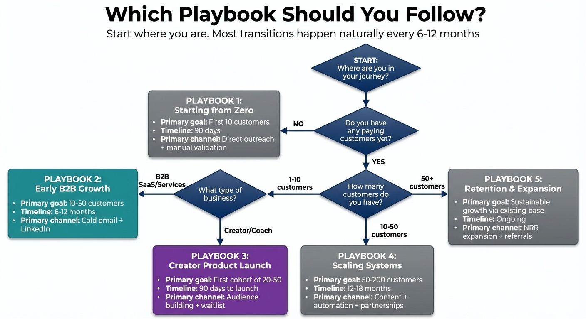

# Chapter 10: Playbooks for Different Starting Points

You've read the frameworks. You understand the principles. But when you sit down to execute, you hit a wall: "Does this apply to me?"

A founder with zero customers faces different constraints than one with 50. A B2B SaaS product requires different tactics than a coaching business. And if you're bootstrapped, you can't follow VC playbooks that assume burning cash for market capture.

Here's what the data shows: bootstrapped solo founders should *target* 4–6 month CAC payback for SMB deals, though 8–12 months is more common in practice for early-stage SaaS. VC-backed companies can accept 12–24 month payback periods [1]. This funding difference isn't better or worse—it's different. Your constraints determine your playbook.

This chapter provides specific playbooks for different solo founder situations. Find the one that matches your current reality and follow it.

> **Founder-Type Note:** The five playbooks below address distinct situations, not distinct people. Many founders span multiple categories—a coach who also sells courses (Playbook 3 + 4), or a SaaS founder just starting out (Playbook 1 + 2). If you're in between, read both relevant sections and blend the approaches. The principles are consistent; the tactics differ based on your primary constraints.

> **⚠️ Common Mistake: Switching playbooks too frequently**
>
> Founders often abandon an approach after 2-3 weeks because "it's not working." Most playbooks need 60-90 days of consistent execution before you can accurately evaluate results.
>
> **Why it happens:** Early results are always underwhelming. Jumping to a new approach feels like progress.
>
> **What to do instead:** Commit to 90 days of one playbook before major pivots. Track weekly inputs (outreach sent, content published, calls completed), not just outputs (revenue). Adjust tactics within your playbook, but don't abandon the strategy until you've given it a fair test.

## Decision Map: Which Playbook Is Right for You?

*Figure 10.1: The Playbook Selection Framework. Use this decision map to quickly identify which playbook matches your situation: Starting from Zero, B2B SaaS Founder, Coach/Consultant, Creator, or Scaling from 50 to 500.*

**START HERE:**

→ **Do you have any paying customers yet?**
   - **No** → Go to **Playbook 1: Starting from Zero**
   - **Yes** → Continue below

→ **What are you primarily selling?**
   - **B2B Software (SaaS)** → Go to **Playbook 2: B2B SaaS Founder**
   - **Services to businesses or individuals (coaching, consulting, done-for-you)** → Go to **Playbook 3: Coach or Consultant**
   - **Digital products to an audience (courses, templates, communities)** → Go to **Playbook 4: Creator**
   - **I have customers but need to scale systematically** → Go to **Playbook 5: Scaling from 50 to 500**

**Quick Context Guide:**

- **Playbook 1 (Zero Customers):** Manual, intensive, learning-focused. Get to 10 customers to validate your hypothesis.
- **Playbook 2 (B2B SaaS):** LinkedIn + cold email + content. Multi-stakeholder sales, longer cycles.
- **Playbook 3 (Coach/Consultant):** Content-first trust building. Product ladder from free to high-ticket.
- **Playbook 4 (Creator):** Audience building + email list + launches. Platform-specific content strategy.
- **Playbook 5 (Scaling):** Systematizing what works. Automation + delegation without losing quality.

## Playbook 1: Starting from Zero (No Customers, No Audience)

This is the hardest starting point. You have a product or service, but no one knows about it, no one is buying it, and you have no proof it works.

**Your constraints:**
- No testimonials or case studies
- No referral network
- No organic reach or audience
- Maximum uncertainty about product-market fit

**Your one job:** Get to 10 paying customers as fast as possible. Everything else is distraction.

**The Zero-to-Ten Sprint: 12-Week Operational Cadence**

**Phase 1: Foundation & First Outreach (Weeks 1-4)**

*Week 1-2: ICP Hypothesis & Initial Research*

**Deliverables:**
- Written ICP hypothesis (1-2 pages): Who you think your ideal customer is, why, and what problem you solve for them
- List of 50-100 verified prospects with contact information
- Notes on where these prospects gather (LinkedIn, forums, communities, events)

**Daily Activities:**
- Days 1-2: Write your ICP hypothesis. Be specific: "Marketing agencies with 5-15 employees in the United States who struggle with client reporting" not "small businesses."
- Days 3-5: Manual prospect research. Use LinkedIn, industry directories, community forums. For each prospect, note: name, company, role, why they might be a fit, where you found them.
- Days 6-7: Verify contact information. Find email addresses, LinkedIn profiles. Create a simple spreadsheet or CRM entry for each prospect.

*Week 3-4: First Outreach Wave*

**Deliverables:**
- 20-30 personalized outreach messages sent
- Engagement tracking system in place
- Initial responses received

**Daily Activities:**
- Days 1-2: Send first 10 outreach messages. Use warmup approach: engage with their content first (if on LinkedIn), then connect, then message.
- Days 3-4: Send next 10-15 outreach messages. Continue personalizing each one.
- Day 5: Follow up with any early responders. Schedule discovery calls.
- Days 6-7: Review responses. Note what messaging worked. Adjust approach for next wave.

**Metrics to Track:**
- Messages sent
- Response rate (target: 10-15% for personalized outreach)
- Discovery calls scheduled
- Time spent per message (aim for 10-15 minutes including research)

**Phase 2: Discovery & Learning (Weeks 5-8)**

*Week 5-6: Discovery Calls & ICP Refinement*

**Deliverables:**
- 8-12 discovery calls completed
- Refined ICP based on learnings
- List of qualified opportunities identified

**Daily Activities:**
- Days 1-3: Conduct discovery calls (2-3 per day). Use the MVQ framework. Focus on understanding problems, not pitching solutions.
- Day 4: Review all discovery call notes. Identify patterns: What problems keep coming up? What language do they use? Who seems most interested?
- Days 5-6: Refine your ICP if needed. Update prospect targeting criteria based on what you learned.
- Day 7: Identify qualified opportunities. Who has acute pain, significant impact, and decision authority?

*Week 7-8: First Offers & Early Customers*

**Deliverables:**
- 2-4 first customers closed
- Pricing validated
- Product feedback collected

**Daily Activities:**
- Days 1-3: Present offers to qualified opportunities using the prescription frame. Be honest about being early-stage and offer significant discount in exchange for feedback.
- Days 4-5: Follow up on offers. Handle objections professionally.
- Days 6-7: Close first customers. Onboard them immediately. Collect feedback on product, pricing, messaging.

**Metrics to Track:**
- Offers presented
- Close rate (target: 30-40% for qualified opportunities)
- First customers acquired
- Pricing feedback collected

**Phase 3: Scale & Systematize (Weeks 9-12)**

*Week 9-10: Scale Outreach & Refine Process*

**Deliverables:**
- Outreach process documented
- 50-100 additional prospects identified
- Messaging templates refined based on what worked

**Daily Activities:**
- Days 1-2: Document what worked in weeks 1-8. Create messaging templates based on successful outreach.
- Days 3-5: Identify 50-100 additional prospects using refined ICP criteria.
- Days 6-7: Begin scaling outreach. You can now use templates, but still personalize the opening line for each prospect.

*Week 11-12: Automation Setup & Final Push to 10 Customers*

**Deliverables:**
- Basic automation in place (email sequences, CRM workflows)
- 10 total customers acquired
- Validated playbook ready to scale

**Daily Activities:**
- Days 1-3: Set up basic automation tools. Email sequences for follow-ups, CRM workflows for tracking.
- Days 4-6: Final push to reach 10 customers. Follow up with all opportunities. Close remaining deals.
- Day 7: Review entire 12-week sprint. Document what worked, what didn't, what to do differently next time.

**Success Metrics:**
- 10 paying customers by end of Week 12
- Response rate: 10-15% for personalized outreach
- Discovery call conversion: 60-70% of responses
- Close rate: 30-40% of qualified opportunities
- CAC: Should be low (mostly time investment)

**Key Principles:**
- Weeks 1-8: Everything manual, personal, and intensive. You're learning what actually works in your market.
- Weeks 9-12: Begin systematizing what worked. Templates and automation amplify proven approaches—they don't replace the learning process.

Ten customers is not a business. But it proves that someone will pay for what you're building. Research analyzing early-stage founders through YC startup libraries and Indie Hackers reveals a consistent insight: "At your stage, customer acquisition isn't a marketing problem; it's a learning problem" [6]. Those ten customers give you:
- Real feedback on what works and what doesn't
- Stories and quotes you can use in marketing
- Confidence that the underlying idea is viable
- Data to refine your ICP
- The exact language customers use to describe their pain

And once you have satisfied customers, referrals typically convert 3–5x higher than cold leads because they come with social proof built in [4].

You've now completed the hardest phase. From here, everything gets easier—not easy, but easier. You have proof, you have stories, and you have a playbook that works. The next phase is scaling what you've built.

## Playbook 2: The B2B SaaS Founder (Selling Software to Businesses)

For bootstrapped B2B SaaS founders, content marketing and SEO often deliver lower CAC than paid advertising, though benchmarks vary by industry, offer, and channel mix. The key is combining direct outreach (for short-term pipeline) with content (for long-term compounding).

**Your primary channels:**
- LinkedIn (prospecting and content)
- Cold email
- Content marketing for inbound leads
- Partnerships and integrations

**The Unique B2B Challenge**

B2B sales involve multiple stakeholders, longer decision cycles, and more risk aversion than selling to individuals. The person who uses your product often isn't the person who pays for it. The person who pays for it often needs approval from someone else.

This multi-stakeholder reality means your sales process must account for the buying committee, even when you're talking to an individual. Questions like "Who else needs to weigh in on this decision?" and "What's the approval process for a purchase like this?" should be part of every discovery conversation.

**For your first few deals:** Multi-stakeholder navigation is advanced terrain. If you're closing your first 5–10 B2B customers, focus on finding single-decision-maker opportunities where possible—smaller companies, founder-led businesses, or champions with budget authority. Complex buying committees are hard enough for experienced salespeople; as you're learning, simplify where you can. You'll develop multi-stakeholder skills as your deal sizes grow.

One B2B founder discovered that the fastest-closing deals weren't necessarily those with the most enthusiastic champion—they were those where the internal buying process was understood and navigated effectively. A lukewarm champion who could shepherd the deal through procurement outperformed an excited champion who had no idea how to get budget approved.

**Case Study (composite):** A developer tools founder followed the Zero-to-Ten Sprint for 90 days. Month 1: 50 personal emails, 8 responses (16%), 3 customers ($891 MRR). Month 2: 100 refined emails, 21 responses (21%), 4 more customers ($2,079 MRR). Month 3: Automated with Instantly using proven messaging, 20 calls booked, 3 more customers. Result: 10 customers, $2,970 MRR, validated playbook. The key: manual validation first meant month 3 automation worked immediately instead of optimizing broken messaging.

**The Weekly Rhythm**

Monday: Prospect identification. Use LinkedIn Sales Navigator to find 20–30 new prospects who match your ICP. Add them to your CRM with notes about why they're a fit.

Tuesday-Thursday: Engagement and outreach. Engage with prospects' content on LinkedIn. Send connection requests to those you've warmed up. Follow up with existing conversations. Send cold emails to new prospects.

Friday: Content and administration. Publish one piece of content (LinkedIn post, blog article, newsletter). Clean up your CRM. Review your metrics from the week.

**The B2B Content Strategy**

Your content should demonstrate expertise in your customers' problems—not your product's features.

If you sell HR software, write about hiring challenges, onboarding best practices, and employee retention strategies. If you sell marketing automation, write about campaign strategy, lead nurturing, and conversion optimization.

The content establishes you as someone who understands their world. When they're ready to consider solutions, you're already trusted.

Format matters: LinkedIn carousels achieve 6.6% engagement vs. 4.0% for text posts, and native video has rebounded to 5–7% engagement in 2026 [2]. A 5–7 slide breakdown of a framework you use with customers creates more engagement and shareability than a text post with the same information.

But the payoff takes time—plan for 6–12 months before organic traffic gains real momentum. This timeline is why you can't rely solely on content; you need direct outreach while content compounds in the background.

**The Cold Email Infrastructure**

Key principles for B2B SaaS cold email:
- Never send from your primary domain—use dedicated outbound domains
- **Warm-up period is critical:** New domains should start at 5–10 emails/day and gradually increase over 4–6 weeks to build sender reputation. Jumping straight to high volume triggers spam filters.
- Volume: 30–50 emails per day per domain is sustainable for B2B—but only *after* the warm-up period
- Message structure: Personalized first line + one-sentence value prop + low-friction ask
- Example ask: "Worth a 15-minute conversation?"
- **Compliance:** Always include a one-click unsubscribe option (List-Unsubscribe header) and a visible opt-out link in your footer—this is now table stakes for deliverability
- Target benchmarks: 3–5% reply rate is healthy; keep bounce rate under 2% and spam complaints under 0.1% [3]

**Pricing and Packaging**

B2B buyers expect to talk to someone for deals over $2,000-3,000/year. Below that threshold, self-serve makes sense. Above it, some human interaction increases conversion rates significantly.

Have clear pricing on your website, even for enterprise deals. Hiding pricing frustrates buyers and wastes everyone's time with unqualified conversations.

Annual deals reduce churn. Offer a discount (10-20%) for annual payment to incentivize commitment.

**The Partnership Accelerator**

B2B growth often comes through partnerships with complementary products. If you sell to the same customer as another tool but don't compete, you can help each other.

Integration partnerships (your product works with theirs), referral partnerships (they send you customers, you send them customers), and co-marketing partnerships (joint webinars, shared content) all work.

The approach: identify 10–15 products your ideal customers also use. Reach out to their founders or partnership teams with a specific proposal: "I think our customers overlap. Want to do a joint webinar on [relevant topic]?"

One good partnership can produce more leads than months of cold outreach.

**AI Leverage Points for B2B SaaS**

AI tools can significantly accelerate your B2B playbook execution without replacing the human judgment that closes deals:
- **Prospect research:** AI-powered CRMs (like Attio) can automatically research prospects and enrich contact data
- **Email personalization:** Tools like Instantly's AI Reply Agent can help craft personalized follow-ups at scale
- **Content creation:** Use AI to draft LinkedIn carousel slides, blog outlines, or email sequences—then edit for your voice
- **Customer research:** AI can help analyze discovery call transcripts to identify patterns in customer language and pain points

The principle remains: validate manually first, then use AI to scale what works. Don't automate broken processes—AI amplifies both good and bad approaches.

**B2B SaaS Reality Check**

The B2B SaaS playbook requires patience. Enterprise sales cycles can stretch 3-6 months. Content compounds over 6-12 months. Building a referral network takes years. If you need revenue immediately, consider starting with smaller deals and shorter sales cycles while you build toward larger enterprise opportunities.

The founders who succeed in B2B SaaS are those who commit to the long game while maintaining short-term cash flow through smaller wins along the way.

## Playbook 3: The Coach or Consultant (Selling Services to Individuals or Businesses)

You're selling your expertise—coaching, consulting, training, or done-for-you services. Your offers might range from $500 one-time products to $10,000+ high-ticket programs. Your buyers are individuals making decisions about their personal or professional development.

**Your primary channels:**
- Content and audience building (LinkedIn, YouTube, newsletters)
- Referrals from satisfied clients
- Speaking and guesting (podcasts, webinars, events)
- Communities where your ideal clients gather

**The Content-First Approach**

For service businesses, content does most of the selling work. People buy coaching and consulting from people they trust. Trust builds through consistent demonstration of expertise.

Your content strategy: teach everything you know. Don't hold back information hoping people will pay for it. Give away the "what" and the "how"—people pay for implementation, accountability, and personalized guidance.

The founder who shares their best frameworks publicly attracts clients who want help applying those frameworks to their specific situation. The founder who hoards information attracts no one.

**The Product Ladder**

Most successful coaching and consulting businesses have multiple offerings at different price points:

- **Free content:** Blog posts, social media, YouTube videos, podcast episodes. Attracts attention and builds trust.
- **Low-ticket offer ($50-500):** eBook, course, workshop, templates. Provides value and identifies serious prospects.
- **Mid-ticket offer ($500-3,000):** Group program, cohort-based course, one-day intensive. Deeper transformation with group dynamics.
- **High-ticket offer ($3,000-10,000+):** 1:1 coaching, done-for-you services, VIP days. Maximum value delivery with premium pricing.

Each tier feeds the next in a natural progression. Free content builds an audience. Some audience members buy the low-ticket offer. Some low-ticket buyers upgrade to mid-ticket. Some mid-ticket clients become high-ticket clients.

**The realistic path:** You don't need all four tiers immediately—and trying to build them all at once is a recipe for scattered effort. Start with one tier (usually mid or high-ticket for coaches, since that's where the revenue is). Prove you can consistently sell that tier before adding others. Many successful coaches operate with just two tiers for years: free content and one paid offering.

**The Enrollment Conversation**

High-ticket services require conversations. The discovery call framework applies directly, with some adjustments.

The frame is diagnostic: "I want to understand your situation and see if I can help. If I can, I'll explain how. If I can't, I'll tell you that too."

Qualification matters more than closing. Taking clients who aren't a good fit creates problems—they don't get results, they complain, they don't refer others. Be willing to turn away people who aren't right for your methodology.

**Case Study (composite):** A marketing consultant learned that qualification matters more than closing. First 6 months (weak qualification): accepted 8 clients—anyone who could pay. The problems multiplied: one client wanted "more leads" but had no idea what a qualified lead looked like. Another said they wanted strategy but actually wanted someone to execute tactics. A third had stretched their budget and was counting on the engagement to "save the business." Five of eight (63%) churned within 3 months. Each required 2-3x more support hours than estimated. None became success stories or referred others.

After implementing three non-negotiable criteria (pain clarity, implementation capacity, realistic timeline), they accepted only 5 clients over the next 6 months. Result: 80% completed successfully, each referred 2-3 others, revenue per client increased 40%, total revenue increased despite fewer clients. The math: 8 weak-fit clients × weak retention × no referrals < 5 strong-fit clients × strong retention × referral multiplier. Qualification isn't about being picky—it's about building a sustainable business where clients succeed.

## Playbook 4: The Creator (Selling Digital Products to an Audience)

You're building an audience and monetizing through digital products—courses, templates, communities, newsletters. Your buyers are individuals who've discovered you through your content.

**Your primary channels:**
- Platform-specific content (YouTube, Twitter/X, LinkedIn, TikTok, newsletters)
- Email list building
- Product launches to your audience
- Collaborations with other creators

**Building the Audience**

The creator business model requires audience first, monetization second. You need people paying attention before you can sell to them.

> **⚠️ Common Mistake: Spreading across too many channels**
>
> Trying to master LinkedIn, cold email, content, AND community simultaneously.
>
> **Why it happens:** FOMO—you see others succeeding on different channels and worry you're missing opportunities.
>
> **What to do instead:** Pick one primary channel and commit to it for 90 days. Master it before adding a second. Channel focus beats channel proliferation—better to be great at one channel than mediocre at four.

Where do your ideal customers already spend time? That's where you build.

Consistency beats quality in the early stages. Posting three times a week for a year builds more audience than posting once a month with "perfect" content. The algorithm rewards consistency, and so does audience habit formation.

**The Email List and Newsletter Nurture**

Social platforms can change their algorithms or ban your account. Your email list is the asset you own. Every piece of content should have a path to it — offer something valuable in exchange for the email (a checklist, a template, a short guide). The most effective lead magnets aren't new content — they're repurposed versions of your best-performing content.

Your newsletter is a multi-touch nurture system. Most B2B sales require 5–7 touchpoints before a purchase decision [5].

The principle: 80%+ of emails should be pure value with no sales pitch. Deliver the lead magnet, share frameworks and case studies for a few weeks, then introduce your paid offering with a soft ask. Your subscribers should look forward to your emails because they consistently deliver insights they can't get elsewhere.

*Figure 10.3: The Multi-Touch Newsletter Journey. Most buyers require 5–7 touchpoints before purchasing. Your newsletter creates these touchpoints systematically.*

This doesn't happen in a week. It might take 6–12 weeks of consistent value delivery. But by the time they're ready to buy, they already know, like, and trust you. The sale becomes a natural next step, not a cold pitch.

**Launch Strategy**

Digital products sell best in concentrated launch windows. The "evergreen" approach generates steady but lower revenue. Launches create urgency and event energy.

A simple launch structure:

**Pre-launch (2 weeks):** Seed the problem. Talk about the challenge your product solves. Share relevant content. Build anticipation.

**Launch window (5-7 days):** Open the product for purchase. Send daily emails. Post daily content about the offer. Create urgency with a real deadline.

**Post-launch:** Close the doors or remove bonuses. Deliver the product. Gather feedback for the next launch.

**The Creator's Pricing Psychology**

Creators often underprice because they're comparing themselves to free content. "Why would someone pay $500 for my course when they can learn the same thing on YouTube for free?"

The answer: they're not paying for information. They're paying for curation, structure, accountability, and access to you. The course that organizes scattered information into a clear path, provides exercises that create accountability, and offers community or direct access to the creator is worth dramatically more than raw information.

Price based on the transformation, not the hours of video. If your course helps someone land a job that pays $20,000 more per year, it's worth thousands—not $49. The founder who prices confidently signals value. The founder who apologizes for their pricing signals doubt.

**Community as Moat**

For creators, community is both a product and a retention mechanism. A paid community provides ongoing value, creates switching costs, and generates recurring revenue.

The community model works when you can facilitate valuable connections and conversations beyond just your own content. If the community is just a place for you to answer questions, that's support—not a product. If it's a place where members help each other, learn from each other, and build relationships, it has standalone value.

Communities take time to build. They require ongoing attention. But a thriving community becomes your strongest competitive advantage—something that can't be easily replicated.

**Creator Reality Check**

The creator path looks glamorous from the outside—passive income, lifestyle freedom, creative control. The reality is different. Building an audience takes years of consistent content creation. Most creators give up after 6-12 months when they don't see immediate results. The ones who succeed are those who treat content as a long-term investment, not a short-term tactic.

If you need revenue immediately, consider offering services first while building your audience in the background. Many successful creators started as consultants, built an audience through their work, and only transitioned to products once their audience was large enough to support that business model.

## Playbook 5: Scaling from 50 to 500 Customers

You have traction. You've validated the market. Now you need to grow without breaking what works.

**Your constraints:**
- Time becomes the bottleneck
- Manual processes don't scale
- Quality consistency matters more
- Systems and automation become necessary

**What to Systematize First**

Not everything should be automated. Start with the highest-volume, lowest-judgment activities:

- **Lead capture and routing:** Automatic CRM creation when someone fills out a form or books a call.
- **Follow-up sequences:** Automated email sequences for post-call nurturing and post-purchase onboarding.
- **Scheduling:** Calendar booking that eliminates email tennis.
- **Reporting:** Dashboards that update automatically so you're not manually calculating metrics.

Keep the high-judgment activities manual: discovery calls, proposal customization, customer success check-ins for key accounts. Automate the administrative overhead, not relationship building.

**Hiring or Outsourcing**

At some point, you'll hit capacity. The choice is: limit growth to what you can personally handle, or bring in help.

**Budget reality check:** If you can't afford contractors yet, this section is aspirational, not prescriptive. Many founders scale from 50 to 200+ customers before their revenue justifies hiring help. The tactics below assume you have consistent monthly revenue ($5K+ MRR) before investing in support.

For solo founders who want to stay solo and have budget to invest, the answer is usually contractors for specific functions:
- Virtual assistant for scheduling, CRM maintenance, basic research
- Specialist freelancers for content production, email setup, technical work
- Fractional sales support for overflow or specific campaigns

The key is keeping the core activities that differentiate you—strategy, high-touch sales, key relationships—while delegating execution work that anyone competent can do.

**Maintaining Quality at Scale**

The danger of growth is that quality slips. Response times increase. Personalization decreases. The experience that created your initial success degrades. Founders who rush to scale — automating unproven processes, hiring before they can afford to, chasing growth metrics over quality metrics — scale their problems along with their revenue.

Build quality indicators into your metrics: response times, satisfaction scores, referral rates. If these decline as you grow, you're scaling too fast or automating the wrong things. Scale deliberately — each new system should make the next customer easier to serve. Growth should feel like progress, not chaos.

## Choosing Your Playbook

The playbooks overlap. A B2B SaaS founder might also be building content. A coach might need the zero-to-ten sprint before implementing the service business playbook. A creator might eventually move to B2B.

Start with the playbook that matches your primary motion right now. But borrow tactics from other playbooks when appropriate. The fundamentals from earlier chapters (ICP, discovery, follow-up, retention) run through all of them—the tactics differ, but the principles don't.

**The Hybrid Path**

Many successful solo founders don't fit neatly into one category. They might sell B2B software AND offer consulting services. They might be a coach AND sell courses to their audience.

The hybrid approach works when the pieces reinforce each other. Consulting informs your software development. Your course content feeds your coaching pipeline. Your audience gives you data for your B2B product.

The hybrid approach doesn't work when the pieces compete for your attention. If you're spreading yourself across three unrelated businesses, you're not a hybrid—you're unfocused.

Find the connective thread in your hybrid approach. If you can't articulate it clearly, you might be doing too many things.

My own path has been hybrid—enterprise technology background, startup growth experience, and current work combining B2B thinking with creator-style content. The pieces connect because they're all about helping founders sell effectively. That connective thread makes the hybrid approach work rather than feeling scattered.

## The 90-Day Focus

*Figure 10.2: The Playbook Progression. Each playbook builds toward a sustainable acquisition engine. The 90-day commitment isn't arbitrary—it's the minimum time needed to generate meaningful data about what's working.*

Whichever playbook you're following, commit to it for 90 days before evaluating. (The Common Mistake callout at the top of this chapter explains why.)

**The Milestone Checkpoints**

Within your 90-day commitment, set checkpoint milestones to ensure you're on track:

**Day 30:** Have you established your weekly rhythm? Are you hitting your activity targets consistently? If not, the issue is execution discipline, not strategy.

**Day 60:** Are you seeing leading indicators of success? Responses to your outreach? Engagement on your content? Conversations with potential customers? If not, something in your approach might need adjustment.

**Day 90:** What are the actual results? Revenue? Pipeline value? Audience growth? How do these results compare to your initial goals? What worked well? What didn't?

The day 30 checkpoint is particularly important. Most playbook failures aren't strategy failures—they're consistency failures. You had a good plan, but you didn't execute it. The day 30 checkpoint catches execution problems early enough to correct course.

**When to Pivot**

After 90 days of consistent execution, you have real data. Sometimes that data tells you to keep going. Sometimes it tells you to adjust.

Signs you should keep going:
- Leading indicators are positive (responses, engagement, conversations)
- Early revenue or strong signals of imminent revenue
- Clear learning about what resonates with customers
- Improving metrics week over week

Signs you should adjust:
- Zero or minimal leading indicators despite consistent activity
- Negative feedback pattern (same objection repeatedly, consistent ghosting at same stage)
- Fundamental misalignment between your offer and what prospects want
- Inability to maintain the required activity level

Adjusting doesn't mean abandoning. Adjustment might mean shifting your ICP slightly, changing your messaging, trying a different channel, or refining your offer. The goal is to learn from the data and iterate thoughtfully, not to start from scratch every time something doesn't work immediately.

## When to Graduate to Paid Acquisition

This book focuses on manual, organic methods—cold email, LinkedIn outreach, content, community. That's intentional. Paid acquisition requires different skills, different budgets, and different risk profiles. Most solo founders should master the manual methods first.

**But there comes a point where paid makes sense.**

**Signals you're ready for paid:**

1. **You've proven manual methods work.** You're consistently generating leads through cold outreach or content. You know your ICP, your messaging converts, and you understand your customer journey. Paid amplifies what works—it doesn't fix what's broken.

2. **You have predictable unit economics.** You know your Customer Acquisition Cost (CAC), your Lifetime Value (LTV), and your conversion rates at each stage.

3. **You're capacity-constrained, not knowledge-constrained.** You're turning away opportunities because you don't have time, not because you don't have leads.

4. **You have 3-6 months of runway.** Paid acquisition has a learning curve. You'll spend money learning what works before you optimize.

**The bootstrap approach to paid:**

Start small. Test with $500-1,000/month before scaling. Focus on one channel rather than spreading thin. Track everything—you need to know if paid is actually cheaper than your time spent on manual methods.

**The reality:** Many solo founders reach $50K–100K MRR with organic/manual methods alone, but a small paid budget ($500–1K/month for retargeting or content amplification) can accelerate growth once you've validated your messaging and unit economics. Paid becomes especially valuable when you're ready to hire and need to generate leads faster than one person can manually create them.

**Bottom line:** Master the manual methods in this book first. When you're consistently generating leads and revenue through organic channels, then consider paid as an accelerator, not a replacement.

## Chapter Summary: TL;DR

**The core insight:** Your constraints determine your playbook. Bootstrapped founders can't follow VC playbooks—but manual methods can scale to $50K–100K MRR with consistent execution; a small paid budget can accelerate once you've validated. Pick the playbook that matches your situation and commit to 90 days before evaluating.

**Key takeaways:**
- Zero to 10 customers is a validation phase—manual, intensive, learning-focused
- B2B SaaS requires multi-stakeholder navigation; fastest-closing deals often have champions who understand internal buying processes
- Coaches/consultants: qualification matters more than closing; wrong-fit clients cost more than they're worth
- Creators: your low-ticket offer identifies people ready for high-ticket; your email list is the asset you own
- Scaling (50-500): systems and processes become critical; what worked manually won't scale without documentation
- Manual methods can reach $50K–100K MRR; small paid budgets can accelerate once you've validated messaging and unit economics

**Next chapter:** Chapter 11 builds a diagnostic framework for when your acquisition system breaks—so you can identify what's wrong and fix it faster.

---

## The Exercise: Create Your 90-Day Plan

Based on the playbook that matches your situation, create a specific 90-day plan.

1. **Identify your playbook.** Which of the five scenarios best describes your current situation? Be honest about where you are.
2. **Define your weekly rhythm.** What specific activities will you do each week? Block time on your calendar for outreach, content, calls, and administration.
3. **Set your 90-day goals.** What measurable outcomes are you targeting? Number of conversations? Pipeline value? Revenue? Be specific.
4. **Identify your constraints.** What's most likely to derail you? Time management? Consistency? Fear of outreach? Plan for how you'll handle these obstacles.
5. **Create accountability.** How will you ensure you follow through? Peer accountability, public commitment, weekly review with someone who will hold you to your plan?
6. **Schedule your 90-day review.** Put a date on the calendar. On that day, you'll evaluate results, identify what worked, and adjust the plan for the next 90 days.

**Want Copy-Paste Examples?** For complete, filled-out examples you can print and use immediately, see the **Appendix: Complete Playbook Examples** following this chapter. Each example includes specific ICP definitions, messaging templates, weekly rhythms, and 90-day projections for five founder profiles.

---

## Chapter Checklist

**Before moving to Chapter 11, complete:**

- [ ] Identified which playbook(s) match your current situation
- [ ] Defined your specific weekly rhythm (what activities, when)
- [ ] Set measurable 90-day goals
- [ ] Identified your primary constraints and obstacles
- [ ] Created accountability mechanism (peer, public commitment, weekly review)
- [ ] Scheduled your 90-day review date

**Self-assessment questions:**
- Am I being honest about where I am, or following a playbook for where I want to be?
- Have I committed to 90 days, or am I likely to abandon ship at week 3?
- Do I have accountability that will hold me to my plan?
- Have I blocked calendar time for the specific activities in my playbook?

[1] Bootstrapped SaaS companies target CAC payback periods of 4–6 months for SMB deals, though 8–12 months is common in practice for early-stage SaaS. VC-backed companies can accept 12–24 months. This fundamental constraint forces different strategic approaches. Source: Bootstrap vs VC-funded customer acquisition research, 2024–2026.

[2] LinkedIn content performance research, 2026. Carousels achieve 6.6% engagement vs. 4.0% for text posts. Native video has rebounded in 2026, now achieving 5–7% engagement with 5x higher interaction rates; LinkedIn Live videos hit 29.6% engagement. Single-image posts underperform text by 30%.

[3] Cold email deliverability benchmarks, 2025–2026. New domains require 4–6 week warm-up periods starting at 5–10 emails/day. Sustained volume of 30–50 emails/day per domain is achievable after warm-up. Target metrics: 3–5% reply rate (top performers exceed 10%), bounce rate under 2%, spam complaints under 0.1%. Sources: Instantly Cold Email Benchmark Report 2026; Supersend deliverability research.

[4] Referral conversion rates vary by industry and context, but multiple studies report referred customers converting at 3–5x the rate of cold outreach. This is attributed to pre-existing trust transfer and implicit social proof. Source: B2B referral marketing research synthesis, 2024–2025.

[5] The "5–7 touchpoints before purchase" range is commonly cited in B2B sales literature. Exact numbers vary by deal size, industry, and sales cycle length—enterprise deals may require 10+ touchpoints while transactional SMB sales may convert faster. The principle (multi-touch nurture outperforms single-touch outreach) is consistent across contexts.

[6] Framework synthesized from analysis of early-stage founder experiences documented in YC startup libraries, Indie Hackers podcast episodes, and founder blogs (2023–2025). The 60-day timeline and milestone structure reflect common patterns across successful validation sprints.
