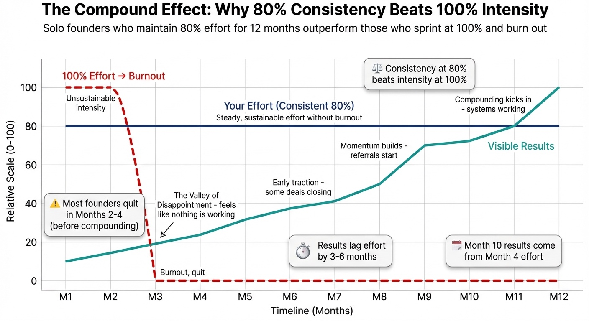

# Chapter 12: Maintaining Momentum—Building Sustainable Habits That Keep Your Acquisition Engine Running

Research on habit formation shows that successful long-term behavior change requires removing dependency on motivation entirely [1]. The numbers on founder burnout are sobering:

| Burnout Metric | Percentage | Description |
|----------------|------------|-------------|
| **Past Year Burnout** | 54% | Founders who experienced burnout in the past year [2] |
| **High Stress** | 83% | Founders reporting high stress in the past year [2] |
| **Anxiety** | 75% | Founders reporting anxiety [2] |
| **Poor Mental Health** | 46% | Founders rating their mental health as "bad" or "very bad" [2] |

When broader mental health issues are combined—anxiety, depression, or burnout—the number rises to 87% of founders reporting at least one [10]. These aren't struggling founders—they're people actively running companies and meeting business objectives while suffering psychologically.

The correlation between sales activity and emotional exhaustion is well-documented: sales professionals encounter higher-than-average rejections and disappointments, making emotional exhaustion a very real hazard. Research demonstrates that emotional exhaustion increases the likelihood of unethical sales behaviors, which in turn decreases overall sales performance—creating a dangerous cycle where stress leads to poor decisions, which create more stress [3]. For solo founders without a team to distribute the psychological load, this exhaustion compounds faster.

As we covered in Chapter 1's identity threat framework, selling feels psychologically difficult because it conflicts with your builder identity. That psychological load compounds over time—every rejection, every awkward conversation, every moment of discomfort adds to the cognitive burden. Without sustainable systems, that load becomes burnout.

This is where most solo founders fail. Not at the beginning, when enthusiasm carries you through the learning curve. Not at the 30-day mark, when you're still tracking against your initial goals. At day 90, day 120, day 180—when customer acquisition becomes routine maintenance rather than an exciting project.

The founders who succeed long-term aren't the ones with better systems or smarter strategies. They're the ones who figure out how to keep going when they don't feel like it.

## Relapse Is Normal (And Recovery Is What Matters)

Before we talk about systems and rhythms, let's establish something critical: **you will have bad weeks.**

You will skip your acquisition routine. You will let your pipeline go cold. You will fall off the wagon for days or weeks at a time. This isn't failure—it's being human.

The difference between founders who build sustainable businesses and those who burn out isn't perfection. It's recovery.

**Case Study (Relapse and Recovery):**
**Problem:** Marketing consultant had a perfect rhythm (30 min morning outreach, Friday pipeline reviews). Father got sick; acquisition stopped for two weeks. She returned feeling "I broke my streak. Everything is ruined."
**Solution:** She didn't try to catch up in a burst. She resumed where she'd left off.
**Result:** Pipeline hadn't evaporated. Three nurtured prospects had responded during the pause; one became a client. The two-week pause didn't ruin the business—the week of paralysis afterward almost did.

**The relapse-recovery framework:**

1. **Expect relapse:** Life happens. Illness, family emergencies, burnout, major life transitions—something will interrupt your rhythm. Plan for it instead of being surprised by it.

2. **Make resuming easier than restarting:** When you fall off, you don't start over from zero. Your contacts are still warm. Your content is still published. Your infrastructure still exists. Just pick up where you left off.

3. **The "one thing" restart:** After a break, don't try to resume everything at once. Do one outreach activity. Send one follow-up. Make one sales call. Momentum builds from small actions.

4. **No shame spirals:** Beating yourself up for missing a week doesn't help you resume. It delays recovery. Acknowledge what happened, understand why, adjust if needed, and get back to work.

The point isn't to be perfect. The point is to resume quickly when you fall off. A founder who maintains 80% consistency over two years outperforms a founder who maintains 100% consistency for three months before burning out completely.

## The Motivation Myth

Here's what nobody tells you about customer acquisition: motivation is unreliable. You'll have great weeks where everything clicks and terrible weeks where nothing works. If you depend on motivation to drive acquisition activities, you'll be inconsistent. And inconsistency kills pipelines.

The goal isn't to stay motivated—it's to build systems that work even when you're not motivated. The shift: from "I'll do acquisition when I'm motivated" to "I do acquisition because it's Tuesday" [4].

## The Sustainable Rhythm

Research shows consistent daily, weekly, and monthly rhythms produce 15% higher win rates than sporadic intense efforts [5]. The most sustainable acquisition systems are built on rhythm, not willpower.

**The Revenue Rhythm Model** defines tempo for key sales activities through three recurring cycles: Daily (lead follow-ups, opportunity updates, short-term commitments), Weekly (pipeline review, forecast adjustments, deal progression analysis), and Monthly (performance reflection, strategy recalibration, enablement sessions). Teams that operate in rhythm close more consistently because they spend less time reacting and more time executing [5].

A rhythm is a recurring pattern of activity that happens at predictable intervals. You don't decide whether to brush your teeth each morning—you just do it because it's part of your morning routine. The decision is already made.

Customer acquisition needs the same treatment.

### The Daily Rhythm

At the daily level, you need activities small enough to complete in 30–60 minutes, even on your worst days.

**The "Morning 30" approach:**

Every morning, before you check email, before you open Slack, before you start on product work, you spend 30 minutes on acquisition. Not 90 minutes. Not "as long as it takes." Exactly 30 minutes.

In 30 minutes, you can:

- Send 5–10 personalized outreach messages
- Follow up with 3–5 prospects in your pipeline
- Engage with content from 10 target accounts
- Reply to inbound inquiries

The specific activities matter less than consistency. Thirty minutes every day beats four hours once a week. Daily contact with your acquisition activities keeps them present in your mind and prevents the pipeline from going cold.

**Case Study: GummySearch's 10-Minute Daily Routine**
**Problem:** Solo founder needed marketing that didn't consume the day.
**Solution:** Fed (GummySearch, 135K+ founders before 2025 acquisition) built around a 10-minute daily rhythm: keyword tracking + responding to relevant Reddit conversations. Some days deep engagement; some days just a few replies.
**Result:** "Incredible ROI on marketing time spent." Consistency compounded—one well-timed comment brought 100+ high-intent visitors.

### The Weekly Rhythm

*Figure 12.1: The Sustainable Weekly Rhythm. Customer acquisition needs rhythm, not willpower. This framework shows how daily, weekly, and monthly activities stack into a sustainable system. The "Morning 30" daily block, "Pipeline Friday" weekly review, and "First of Month" strategic assessment create consistent momentum without burning out.*

The weekly rhythm handles the activities that don't fit into a 30-minute block.

**The "Pipeline Friday" approach:**

Every Friday afternoon, spend 60–90 minutes on pipeline maintenance:

- Review every active opportunity in your CRM
- Update stages based on recent activity
- Identify stuck deals that need intervention
- Plan next actions for the coming week
- Review metrics from the past week

This weekly review prevents deals from slipping through cracks and keeps you honest about where your pipeline stands. The specific day doesn't matter. Pick one and protect it.

### The Monthly Rhythm

Monthly is for stepping back and evaluating strategy.

**The "First of Month" review:**

- Calculate last month's metrics (calls, conversion rates, new customers)
- Compare against previous months to spot trends
- Identify what's working and what isn't
- Make strategic adjustments (but sparingly—don't change everything every month)
- Set specific targets for the coming month

The monthly rhythm prevents drift. Without it, you might spend three months on a failing strategy before realizing it's not working.

## Protecting Your Acquisition Time

Rhythms only work if they're protected.

Solo founders face constant time pressure. Product needs building. Customers need support. Admin tasks accumulate. It's easy to let acquisition activities slide when other demands feel more urgent.

But acquisition is the lifeblood of your business. Everything else depends on having customers. When you skip acquisition work, you're borrowing from your future self.

### The Calendar Block

Put your acquisition time on your calendar as an immovable appointment. Not "try to do prospecting in the morning" but "Acquisition Block 8:00–8:30 AM" with notifications and everything.

Treat it like a meeting with your most important customer. You wouldn't cancel that for an admin task. Don't cancel your acquisition time either.

### The "Closed for Business" Signal

Let the world know you're unavailable during your acquisition time:

- Close email and Slack
- Put your phone in another room
- Use a website blocker if needed
- Tell family or housemates you're in a work block

The goal is eliminating interruptions that break your focus and give you an excuse to stop early.

### The "Bad Day" Protocol

Even with protection, you'll have days when you can't do the full routine. Illness, emergencies, travel—life happens.

Plan for this in advance. Define a "minimum viable acquisition day" that takes 10 minutes and keeps the habit alive:

- Send one follow-up email
- Engage with one prospect's content
- Update one pipeline entry

This isn't productive—it's symbolic. You're telling yourself that acquisition matters enough to do even when everything else is falling apart. The streak continues, and tomorrow you'll be back to full capacity.

**Case Study (MVA While Traveling):**
**Problem:** Founder traveling for family event; full routine impossible.
**Solution:** Minimum viable acquisition from phone in hotel lobby—three emails, five minutes.
**Result:** When home, slipped back into full routine without restart friction.

**Case Study (Restart After Product Launch):**
**Problem:** SaaS founder had six months of consistent outreach; major product update stopped acquisition for three weeks (bugs, support).
**Solution:** Resisted catch-up push. Restarted with normal rhythm: 30 minutes that first morning back.
**Result:** Back to full speed within a week; avoided burnout from catch-up.

## Managing Energy, Not Just Time

Research shows employees who excel at energy management are 50% more engaged and 21% more productive than those who focus solely on time management [6]. A Harvard Business Review study found that employees who adopted energy-management strategies—scheduling crucial tasks during peak productivity times and allowing for intentional recovery breaks—significantly outperformed control groups [7].

Time management advice assumes all hours are equal, but they're not.

Your energy fluctuates throughout the day. Some hours you're sharp and creative. Other hours you're running on fumes. Customer acquisition activities should be scheduled during your high-energy windows.

For most people, this means mornings. Energy and focus are highest when you first wake up, before decision fatigue accumulates [8]. By afternoon, after you've made dozens of decisions and dealt with unexpected problems, you have less capacity for activities that require focus and resilience.

This is why the "Morning 30" approach works. You do acquisition when you're at peak capacity, before the day has drained you.

### Energy Replenishment

Long-term sustainability requires managing energy in, not just energy out. The basics matter more than you think: sleep, movement, and real breaks (away from screens, not doom-scrolling) directly affect your capacity for the resilience-demanding work of acquisition. Schedule at least one full day per week with no acquisition work—your brain needs recovery to maintain quality.

**Case Study: When the System Breaks You**
**Problem:** Consultant ran 60+ hour weeks for 7 months, no real breaks. Results good ($180K) but warning signs: dreading calls, avoiding follow-ups, quality slipping. Month 8: panic attack on a client call—hard stop.
**Solution:** Recovery protocol: 40-hour weeks, hard boundaries, MVA only (30 min daily), one day off/week, quarterly 5-day breaks scheduled.
**Result:** Dropped from 12 to 8 clients per 6 months. Energy returned; satisfaction 7.8 → 9.2/10; referrals 4 in 6 months vs 1 in prior 18. Revenue flat—founder didn't quit. Sustainable pace compounds; burnout ends abruptly.

## Staying Connected to Purpose

Rhythms and energy management are mechanics. But mechanics alone won't sustain you through the hard stretches.

You also need to stay connected to why you're doing this.

Solo founders start their businesses for reasons—freedom, impact, income, creative expression, escaping corporate life. Those reasons are real, but they fade into the background during daily grinding.

### The "Why Chain"

When acquisition work feels pointless, trace the chain: emails → calls → customers → revenue → the life you're building. The daily activities are just the mechanism. When it feels like drudgery, reconnect with the actual reason you started.

### The Customer Connection

Another powerful reconnection: spend time with current customers—not sales calls, actual conversations about how they're using what you built. Their success stories remind you that acquisition isn't abstract. Every prospect is a potential person you can genuinely help.

## Building in Accountability

Solo means you don't have a boss checking whether you hit your targets. That's freedom, but it's also risk. Without external accountability, it's easy to let standards slip.

### The Accountability Partner

Find someone who will hold you to your commitments:

- Another solo founder with similar acquisition goals
- A coach or mentor
- A mastermind group
- A friend who understands what you're building

The arrangement is simple: share your weekly acquisition targets, report your results, and call each other out when you fall short.

The key is choosing someone who will actually hold you accountable, not someone who will accept your excuses. Some founders also make their targets public—in a community or newsletter—which creates real pressure to perform (though this can create anxiety, so it's not for everyone).

Your metrics dashboard (Chapter 8) serves as self-accountability too—when you track numbers weekly, you can't lie to yourself about how much work you're doing.

### The Isolation Factor

One of the strongest predictors of founder burnout isn't work hours—it's isolation.

Solo founders experience higher isolation than co-founder teams by definition. There's no one to share the load, celebrate wins, or commiserate after tough calls. Research shows that founders with mentors and emotional support are 50% more likely to report high resilience [10].

The protective factors are clear:

- **Community access:** Founders in mastermind groups, founder communities, or regular peer conversations report significantly lower burnout rates.
- **Work-life boundaries:** Founders who maintain clear boundaries between work and non-work experience 67% less high burnout than those without boundaries [10].
- **Mentorship:** Having someone who's navigated similar challenges reduces the psychological weight of solo decision-making.

This isn't about having a co-founder. It's about having *someone*—a mentor, a peer group, a community, a coach—who understands what you're building and can provide perspective when you're too deep in the weeds.

## Preventing Burnout

*Figure 12.2: The Neuroscience of Momentum. Burnout isn't just psychological—it's physiological. Research shows 54% of founders experienced burnout in the past year, with 46% rating their mental health as "bad" or "very bad." Understanding the warning signs helps you intervene before it's too late.*

Sustainable acquisition isn't about maximum effort—it's about consistent effort over long timeframes.

Burnout happens when you push too hard for too long without adequate recovery. Solo founders are particularly vulnerable because there's no one to tell them to slow down.

### The Warning Signs

Learn to recognize early burnout indicators:

- Dreading acquisition activities you used to find interesting
- Declining quality of your outreach (rushing, cutting corners)
- Shorter temper and less patience on calls
- Difficulty focusing during work blocks
- Physical symptoms: persistent fatigue, sleep problems, headaches

If you notice these signs, you need more recovery, not more hustle.

### The Sustainable Pace

Figure out what pace you can maintain indefinitely.

This is different from what pace you can maintain for a sprint. Most people can work 60-hour weeks for a month if they need to. Almost no one can maintain that for a year.

What's your sustainable pace? 40 hours? 35 hours? The number matters less than being honest about it.

Once you know your sustainable pace, defend it.

### Recovery Practices

Build recovery into your schedule, not as an afterthought but as a requirement:

- Daily: breaks between work blocks, transition time between work and non-work
- Weekly: at least one full day with no work
- Quarterly: longer breaks of several days or a week
- Annually: genuine vacations with no checking email

## Practical Tools for Sustainability

Beyond mindset and rhythms, specific tools can automate the friction out of consistent acquisition.

### Automation That Preserves Authenticity

The goal of automation isn't to remove yourself from acquisition—it's to remove the friction that makes consistency difficult.

**What to automate:**

- Email warmup (tools like Instantly or Smartlead handle this automatically)
- Follow-up sequences (scheduled sends that trigger if prospects don't respond)
- Pipeline reminders (CRM notifications for stale deals)
- Data enrichment (tools that find prospect information so you don't have to)

**What not to automate:**

- The first outreach message (this needs genuine personalization)
- Discovery calls (the whole point is human connection)
- Relationship building (automated "checking in" messages feel hollow)

The test is whether the recipient would know it's automated. If they can tell, you've gone too far.

### The "Systems Not Goals" Mindset

Goals are useful for direction, but systems are what produce results.

A goal says: "I want 10 new customers this quarter."
A system says: "Every weekday I send 10 personalized emails and follow up with 5 existing prospects."

The goal might be hit or missed depending on factors outside your control. The system runs regardless. And if you run the system consistently, you'll probably hit the goal.

**Case Study: Justin Welsh's Operating System**
**Problem:** Goals and motivation are unreliable; results need to be predictable.
**Solution:** Welsh built a $4M+ solo creator business (94% margins) by replacing goals with systems: "My weeks are scheduled to execute the same behaviors each day; technology automates the rest. Everything I do is intentional."
**Result:** Results highly predictable. He doesn't wake up deciding what to work on—the system dictates; numbers follow.

### The Weekly Planning Ritual

Every Sunday evening, spend 15 minutes planning the coming week's acquisition activities:

- What three acquisition outcomes would make this week successful?
- What specific activities will drive those outcomes?
- When, exactly, will I do those activities?

Writing this on a single index card that sits on your desk all week helps maintain focus. This isn't complex planning software. It's deliberately simple because simple systems get used.

## When Results Don't Match Effort

The hardest sustainability challenge comes when you're doing everything right and still not seeing results.

This happens. Customer acquisition involves factors outside your control. Market conditions change. Competition intensifies. Your ICP shifts. Luck plays a role.

### The "Keep Going" Decision

When results disappoint, you face a choice: give up or adjust and continue.

Most founders give up too early. They conclude that "cold email doesn't work" based on insufficient data. Real patterns take months to emerge.

At the same time, persistence without adaptation is stubbornness, not strategy.

The right response is: diagnose, adjust, continue.

### The Diagnostic Questions

When results lag effort, ask:

1. **Is my volume sufficient?** Fifty emails a month won't generate meaningful data.
2. **Is my targeting accurate?** Wrong ICP means even perfect execution produces poor results.
3. **Is my message resonating?** Low response rates suggest the message isn't landing.
4. **Is my timing off?** Some markets are seasonal.
5. **Is the channel wrong?** After sufficient testing, it's reasonable to shift approaches.

Answer these questions with data, not intuition. Diagnose before changing.

### The Adjustment Protocol

When you identify a problem, make one change at a time.

If you change your targeting, messaging, and channel simultaneously, you won't know which change made the difference. Change one variable, run it for 2-4 weeks, evaluate, then decide on the next change.

## The Long Game

Customer acquisition is a years-long endeavor, not a 90-day sprint.

The relationships you're building, the reputation you're developing, the skills you're honing—these compound over time.

### Compound Effects

*Figure 12.3: The Compound Effect. Why 80% consistency beats 100% intensity. Email domain reputation, LinkedIn network, content archive, customer referrals, market knowledge, and skills all compound over time—but only if you stay in the game.*

Consider what compounds over time:

- **Email domain reputation:** The longer you send quality emails from a domain, the better your deliverability
- **LinkedIn network:** Each connection is a potential future prospect or referral source
- **Content archive:** Old content continues generating inbound leads while you create new content
- **Customer referrals:** Each customer can refer multiple future customers
- **Market knowledge:** Your understanding of what works deepens with every campaign
- **Skills:** You get better at discovery calls, objection handling, and closing with practice

None of these compound effects are visible in the first 30 days. They're barely visible at 90 days. But at 12 months, 24 months, 36 months, the differences between consistent and inconsistent founders become obvious.

**Case Study (Compound Effect):**
**Problem:** Results feel delayed; effort today doesn't show immediately.
**Solution:** Founder tracked where current results actually came from: LinkedIn connections from 2022, content from 2023, infrastructure built over quarters.
**Result:** Today's results are yesterday's consistency. Compound effects need time—12–36 months separate consistent from inconsistent founders.

### Playing Infinite Games

Philosopher James P. Carse introduced a useful framework: finite games versus infinite games [9].

A finite game has clear rules, defined players, and an end point. Someone wins, the game ends.

An infinite game has fluid rules, changing players, and no end point. The goal isn't to win—it's to keep playing.

Customer acquisition is an infinite game. There's no point where you "win" and stop. As long as you run a business, you need customers. The goal is to stay in the game indefinitely.

## Why Team Advice Doesn't Transfer

Most advice about sales momentum comes from contexts that don't match yours.

**From sales managers:** "Your reps should be making 100 calls a day." But you're not a rep—you're also the product person, the support person, and the accountant.

**From VC-backed founders:** "We had SDRs doing outbound while I focused on strategy." You don't have SDRs.

**From corporate training:** "Salespeople need to keep their pipeline full at all times." True, but corporate training assumes you have a marketing team generating leads and a CRM maintained by ops.

The sustainability challenge for solo founders is fundamentally different. Teams distribute the work; when one person is exhausted, others carry the load. You don't have that buffer.

The founders who burn out are often the ones who tried to run a team playbook alone. The founders who last are the ones who accept that their approach must be structurally different, not just smaller.

## AI as Sales Memory

Here's a pattern I've noticed in solo founder sales: when you're energized, you remember everything. You recall that a prospect mentioned their daughter's soccer game, that they're worried about their Q2 budget review, that they tried Competitor X last year and hated the onboarding.

When you're depleted—sick, stressed, scattered—all of that context evaporates. You show up to a follow-up call with no memory of what mattered to them.

AI solves this. It becomes your external sales memory.

**Automated conversation capture.** Tools like Fireflies, Otter.ai, and Fathom now auto-transcribe calls and extract key insights without manual effort. AI-native CRMs (Attio, HubSpot with AI features, Clay) automatically create summaries and surface relationship context [11]. On low-energy days when your brain isn't retaining details, these tools maintain continuity for you.

For manual capture, paste conversation content into an AI with the instruction: "Summarize this conversation. What does this person care about? What should I remember for next time?" The AI creates a profile reviewable in two minutes before the next interaction.

**Pattern recognition across conversations.** After a dozen prospect conversations, ask the AI: "What patterns do you see? What objections keep coming up?" The AI surfaces patterns you'd miss: "Four out of your last six prospects mentioned 'implementation complexity' as a concern." Many CRM platforms now build this pattern recognition directly into their dashboards.

**Energy-adjusted engagement.** On bad days, the AI helps maintain continuity you couldn't generate on your own. Review what the AI remembers, craft a follow-up that sounds attentive, and keep the relationship moving even when running on fumes.

This isn't about automating away the human work. The discovery call is still a conversation between two humans. AI just ensures the cognitive load of remembering every detail across dozens of relationships doesn't crush you during the inevitable hard weeks.

In Chapter 13, we'll bring everything together—creating your personal acquisition playbook that integrates the frameworks, strategies, and practices from this book.

## Chapter Summary: TL;DR

**The core insight:** Motivation fades; systems persist. Design for sustainability, not intensity. The founders still acquiring customers years from now aren't the ones who worked hardest—they're the ones who built systems they could maintain.

**Key takeaways:**
- 54% of founders experienced burnout in the past year; 87% report anxiety, depression, or burnout (or all three)
- Founders with mentors/community are 50% more resilient; work-life boundaries reduce high burnout by 67%
- Habits take 66 days on average to become automatic (range: 18-254 days), not the mythical 21 days
- Energy management beats time management—schedule high-stakes activities for peak energy
- Consistent daily/weekly rhythms produce 15% higher win rates than sporadic intense efforts
- Relapse is normal; recovery speed matters more than perfect streaks
- 80% consistency over two years beats 100% consistency for three months followed by burnout

**Next chapter:** Chapter 13 brings everything together—creating your personal acquisition playbook that integrates all the frameworks from this book.

---

## The Exercise: Design Your Sustainable System

Before moving on, design your personal sustainability system:

1. **Define your rhythms:**
    - Daily: What 30-minute block will you protect for acquisition?
    - Weekly: What day and time will you do pipeline review?
    - Monthly: When will you do strategic review?
2. **Protect your time:**
    - How will you signal to others that you're unavailable?
    - What's your "minimum viable acquisition day" for bad days?
3. **Manage your energy:**
    - When are you at peak energy?
    - What recovery practices will you build in?
4. **Build accountability:**
    - Who will hold you accountable?
    - How often will you report to them?
5. **Connect to purpose:**
    - Finish this sentence: "I'm doing customer acquisition because..."
    - Schedule a monthly check-in with a current customer
6. **Define your sustainable pace:**
    - How many hours per week can you work indefinitely?
    - What are your burnout warning signs?

Write these down. Share them with your accountability partner. Review them monthly.

---

## Chapter Checklist

**Before moving to Chapter 13, complete:**

- [ ] Defined your minimum viable daily rhythm (the baseline you can maintain indefinitely)
- [ ] Identified your peak energy hours for high-stakes activities
- [ ] Set up weekly and monthly review cadences
- [ ] Established accountability (partner, public commitment, or structured review)
- [ ] Identified your support network (mentor, peer group, or community) to combat isolation
- [ ] Documented your burnout warning signs and recovery protocol
- [ ] Defined clear work-life boundaries (when work ends, what's off-limits)
- [ ] Created your relapse recovery plan (what to do when you fall off)

**Self-assessment questions:**
- Am I building a system I can maintain for years, or sprinting toward burnout?
- Do I know my sustainable capacity vs. my maximum capacity?
- Have I scheduled recovery, or am I hoping it happens naturally?
- What's my plan for when (not if) I fall off the wagon?

[1] James Clear, *Atomic Habits*, discusses the role of identity and environment in habit formation. The original Lally et al. (2009) study, confirmed by 2024 meta-analysis, found 66 days for behaviors to reach *automaticity*—performing them without conscious thought (range: 18-254 days). Important distinction: for customer acquisition, you don't need automaticity; conscious consistency is sufficient. The popular "21-day habit myth" has been debunked—complex behaviors can take 2-5 months of consistent practice.

[2] Sifted. (2025). More than half of founders experienced burnout last year. Survey of 138 founders: 54% experienced burnout, 83% reported high stress, 75% reported anxiety, and 46% rated mental health as "bad" or "very bad."

[3] Baylor University Keller Center research on effects of emotional exhaustion on ethical behavior in sales, 2021. Research demonstrates that emotional exhaustion increases the likelihood of unethical sales behaviors, which decreases overall sales performance—creating a dangerous cycle.

[4] Justin Welsh has discussed his systems-based approach in multiple interviews, emphasizing process over motivation. Building in public and systematic content creation formed the foundation of his $10M+ solo business.

[5] The Revenue Rhythm Model and sales rhythm research, 2024-2025. Teams implementing clear, intentional rhythms report 15% higher win rates and improved forecasting accuracy.

[6] Energy management effectiveness data from Fortune article "Why Executives Should Focus on Energy Management Over Time Management" and related workplace productivity research, 2024-2025.

[7] Harvard Business Review study with Wachovia Bank on energy management strategies. Employees adopting intentional recovery breaks and peak-time scheduling significantly outperformed control groups.

[8] While the original "ego depletion" theory (Baumeister et al.) faced replication challenges in 2023-2024, the practical finding remains supported: energy and focus are generally higher earlier in the day before decision fatigue accumulates. The mechanism is more nuanced than "depleting a resource," but the implication—do demanding work in morning hours—holds.

[9] James P. Carse, *Finite and Infinite Games* (1986). A philosophical framework (not academic game theory) widely adopted in startup communities. Shopify's Toby Lütke and others have applied it to business sustainability. The goal isn't to win—it's to keep playing.

[10] Fortune. (2025). Research on founder burnout, mental health, and resilience. Key findings: 87% of founders report experiencing anxiety, depression, or burnout (or all three). Founders with mentors and emotional support are 50% more likely to report high resilience. Founders with work-life boundaries experience 67% less high burnout (23% vs. 67% for non-boundary-setters).

[11] AI-native CRM platforms like Attio ($52M Series B, 2025) and established players like HubSpot have integrated AI-powered call transcription, automatic summary generation, and relationship intelligence as standard features. Auto-transcription tools (Fireflies, Otter.ai, Fathom) have become standard infrastructure for sales conversations.
