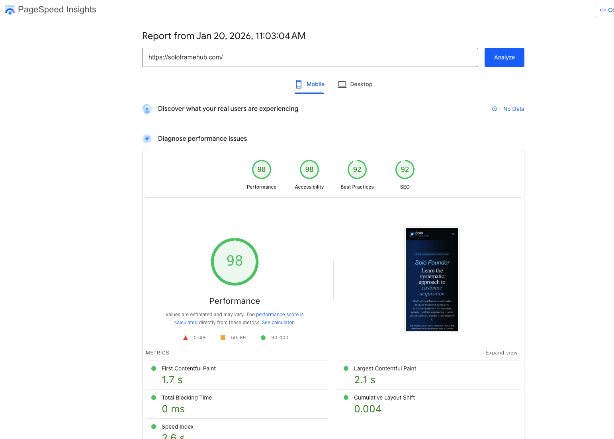
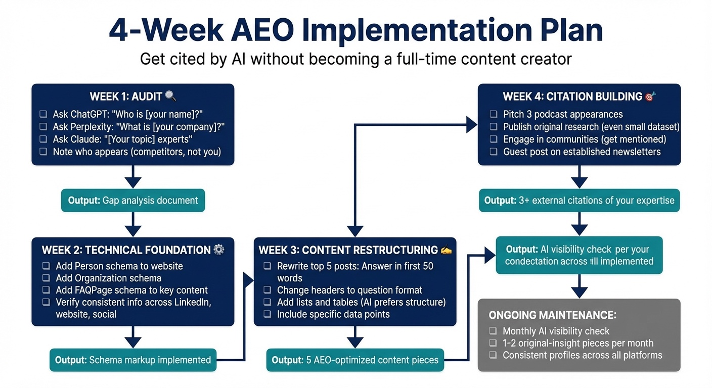

# Chapter 14: The Future of Customer Acquisition—Getting Found When Search Changes Everything

In Chapters 3–5, you learned outreach, discovery, and closing. In Chapter 6, you built retention and referrals. But there's something those chapters didn't address: every prospect will research you before responding.

They'll Google your name. They'll ask ChatGPT about your company. They'll check if you're legitimate before booking that discovery call.

What they find determines whether your outreach works.

If AI systems describe you as a recognized expert in your domain, your cold emails land differently. If you appear in AI-generated answers about your topic, you have credibility you didn't build manually. The founder whose name appears when prospects research their problem has a structural advantage over the founder who doesn't.

And here's where it gets urgent: the search landscape is shifting beneath our feet.

Zero-click searches—where users get answers without clicking any result—hit 65% of all queries by mid-2025, up from 58.5% in late 2024 [1]. When AI Overviews appear, the numbers are worse: 83% zero-click rate versus 60% for traditional results [2]. Google's AI Overviews now appear on 30%+ of queries (up from 13% in March 2025), and when they appear, organic click-through rates collapse—Ahrefs found a 34.5% drop for the #1 result, while Amsive's broader study showed organic CTR fell 61% overall (from 1.76% to 0.61%) [3][4].

The shift is accelerating. In January 2026, Google launched AI Mode as a permanent tab in Search—a fully conversational interface with no traditional blue links at all [5]. Some publishers have already felt the impact: HubSpot lost 70–80% of its organic traffic between 2024 and 2025, and news publishers collectively lost 26% of organic visits as AI answered questions directly [6]. By 2026, Gartner predicts 25% of traditional search volume will migrate to AI-generated answers—not disappearing, but shifting to ChatGPT, Perplexity, and Google AI Mode [9].

The game has changed from "get the click" to "get the citation." This chapter shows you how to get cited.

Think of it as a hierarchy of needs: (1) **Performance**—if your site doesn't load, nothing else matters; (2) **Technical SEO**—if search engines can't crawl or index you, you don't exist; (3) **AEO (Answer Engine Optimization)**—if AI can't understand and cite you, you lose the zero-click search. We'll build all three layers without you needing to become a full-time developer.

## The Zero-Click Reality

For twenty years, the deal was simple: create content, get ranked, receive traffic. That deal is over. More than half of all searches are now satisfied by what appears on the results page itself—featured snippets, knowledge panels, and AI Overviews.

The threat is obvious: if people get answers without visiting your site, traditional content marketing becomes less effective. But AI systems need sources to cite. If you become one of those sources, you get mentioned in answers whether people click through or not.

## What Is Answer Engine Optimization?

Traditional SEO optimizes for search engine rankings. You want your page to appear when someone searches for relevant terms.

Answer Engine Optimization (AEO; see Appendix: Glossary) optimizes for AI citation. You want your content, your name, or your business to appear when AI systems answer questions in your domain.

The distinction matters because AI systems work differently than traditional search.

**Traditional search** presents a list of links. The user decides which to click. Your job is to appear high on the list with a compelling title and description.

**AI-powered search** synthesizes an answer from multiple sources. The user often doesn't see the sources at all—or sees them only as small citations at the bottom of a generated response. Your job is to be the source the AI trusts and quotes.

This isn't going away. ChatGPT Search (which evolved from the SearchGPT prototype in October 2024), Perplexity, Claude, and Google AI Mode are growing rapidly. They're not switching back to traditional search.

## Google AI Mode: The New Search Interface (January 2026)

As of January 2026, Google has rolled out **AI Mode** as a permanent tab in Search (alongside Images, Videos, Shopping, etc.). This is fundamentally different from AI Overviews [10]:

**AI Overviews** appear at the top of traditional search results and include links to sources. Users still see the familiar 10 blue links below. It's an enhancement to traditional search.

**AI Mode** is a conversational interface with **no traditional results**—just AI-generated answers with citations in a sidebar. Powered by Gemini 3, it uses "query fan-out" to issue multiple simultaneous searches (up to 16 queries) to synthesize comprehensive answers [11]. Access it at google.com/aimode or click the AI Mode tab in Search.

**Why this matters for solo founders:**

AI Mode is Google's bet on the future of search—conversational, follow-up-friendly, and deeply personalized. When prospects use AI Mode to research you or your category, they won't see a list of links—they'll see a synthesized answer. **If you're not cited in that answer, you don't exist.**

The data confirms the stakes: only 53% of domains cited in AI Mode sidebars match Google's traditional top 10 results, and just 35% show exact URL overlap [11]. Ranking well in traditional search no longer guarantees AI Mode visibility.

**How to optimize for AI Mode:**

The same AEO principles apply (schema, structured content, original data, topical authority), but with higher stakes: there's no "scroll to position 3" in AI Mode—you're either mentioned in the answer or you're invisible.

**Personal Intelligence (January 2026):** Google AI Mode can now access users' Gmail and Google Photos (opt-in only) to provide personalized answers [12]. For solo founders, this means prospects researching you in AI Mode might see personalized context you can't control—making your public-facing content (LinkedIn, website, schema) even more critical as the baseline others see.

## Why This Matters for Solo Founders

You might be thinking: "I do outbound sales and LinkedIn. Why do I care about search optimization?"

Because this ties directly back to the solo-founder constraints we established in earlier chapters. You don't have a brand team building awareness. You don't have a PR department managing your reputation. You don't have the budget to compete on paid advertising. What you have is your expertise, your content, and your ability to be findable when prospects look.

AEO leverages everything you've built in Chapters 1–13. As we covered in Chapter 2's ICP framework—the intersection of who you can help, who will pay, and who's a joy to work with—that work tells you what topics to own. The content from your outreach in Chapter 3 becomes the raw material for AI citation. The frameworks from your discovery process (Chapters 4–5) become named methodologies AI can reference. Your retention case studies from Chapter 6 become the proof points that establish authority.

This affects both B2B and creator founders:

**B2B founders:** When a prospect asks an AI "What's the best \[category] tool for \[use case]?", you want to be mentioned. When they research vendors, you want AI to describe you as a credible option. Forrester reports that 89% of B2B buyers have adopted generative AI as a self‑guided research source, and Gartner finds that 61% prefer a rep‑free buying experience—making AI visibility critical for self‑serve buyers [15][16].

**Creator founders:** When someone asks "Who should I learn \[topic] from?", you want your name to appear. When they evaluate courses or coaches, you want AI to cite your expertise. McKinsey's B2B survey data shows 77% of decision‑makers would spend $50K+ through remote or self‑serve channels, and 35% would spend $500K+—making your AI‑searchable presence your salesperson [17].

## The Dual Entity Problem

AI systems don't just rank pages. They try to understand entities—people, companies, products, concepts.

For solo founders, this creates the dual entity problem: you need to establish authority for both yourself (the person) and your offering (the product or service).

**The Person Entity**

AI systems try to understand who you are. They look for:

- Consistent information across platforms (LinkedIn, Twitter, website, podcast appearances)
- Credentials and experience markers
- Content that demonstrates expertise
- References from other authoritative sources

When someone asks "Who is \[your name]?", what does AI say? Try it. The answer might surprise you.

If AI returns nothing useful, you have an entity problem. You exist in the real world, but not in AI's understanding of the world.

**The Product/Service Entity**

Similarly, AI tries to understand what your offering is. It looks for:

- Clear description of what you provide
- Comparison to alternatives
- Reviews and testimonials from trusted sources
- Documentation or detailed information

When someone asks "What is \[your product]?" or "Who offers \[your service]?", your offering should appear in relevant answers.

The B2B founder and the creator founder optimize differently:

| Focus | B2B Founder | Creator Founder |
| --- | --- | --- |
| Primary entity | The product/company | The person |
| Validation sources | G2, Capterra, integration partners, documentation | Social profiles, podcasts, books, newsletters |
| Target questions | "What is the best \[category] for \[use case]?" | "Who is \[name] and are they legit?" |

Both need what's called "topical authority"—AI must see you as a definitive source in a narrow niche. Better to be the obvious expert on a small topic than a minor voice on a broad one.

## The Technical Foundation

Getting cited by AI requires technical signals that establish trust.

> **For non-developers:** The code examples below are optional. You can add meta tags and schema using plugins (e.g., Yoast, Rank Math) or your CMS—no coding required. The concepts (what to include and why) matter more than the syntax.

**Traditional SEO Foundation**

Before diving into AEO-specific optimization, you need solid traditional SEO fundamentals. These work alongside AEO—search engines still need to understand and rank your content, and AI systems often train on search results.

Here's the complete SEO implementation from SoloFrameHub.com's landing page (part of my "building in public" project—see Chapter 15):

```html
<title>Solo Founder's AI Customer Acquisition Academy | SoloFrameHub</title>
<meta name="description"
    content="Master systematic customer acquisition with AI-powered roleplay, versioned artifacts, and frameworks built for technical founders. Book + Academy launching February 21, 2026. $49/month.">
<meta name="keywords"
    content="customer acquisition, technical founders, solo founder sales, founder-led sales, B2B SaaS sales system, AI sales coaching, bootstrapped founder sales, MAGNETS framework, DISC selling">
<link rel="canonical" href="https://soloframehub.com/" />

<!-- Open Graph / Facebook -->
<meta property="og:type" content="website">
<meta property="og:url" content="https://soloframehub.com/">
<meta property="og:title" content="Solo Founder's AI Customer Acquisition Academy: AI-Powered Systems for Solo Founders">
<meta property="og:description"
    content="Turn customer acquisition into a repeatable engineering system. AI-powered roleplay and frameworks designed for solo technical founders.">
<meta property="og:image" content="https://soloframehub.com/assets/images/customer-acquisition-academy.webp">

<!-- Twitter -->
<meta property="twitter:card" content="summary_large_image">
<meta property="twitter:url" content="https://soloframehub.com/">
<meta property="twitter:title" content="Solo Founder's AI Customer Acquisition Academy: AI-Powered Systems for Solo Founders">
<meta property="twitter:description"
    content="Turn customer acquisition into a repeatable engineering system. AI-powered roleplay and frameworks designed for solo technical founders.">
<meta property="twitter:image" content="https://soloframehub.com/assets/images/customer-acquisition-academy.webp">
```

**What each element does:**

- **Title tag:** Appears in search results and browser tabs. Include your primary keyword and brand name. Keep it under 60 characters to avoid truncation.
- **Meta description:** The snippet that appears under your title in search results. Write for humans (they still click), include a clear value proposition, and stay under 160 characters.
- **Keywords meta tag:** Less important than it used to be, but still useful for internal organization and some search engines. Focus on 5–10 relevant terms.
- **Canonical URL:** Tells search engines which version of a page is the "master" version, preventing duplicate content issues.
- **Open Graph tags:** Control how your content appears when shared on Facebook, LinkedIn, and other social platforms. Essential for social sharing visibility.
- **Twitter Card tags:** Similar to Open Graph but specifically for Twitter/X. The `summary_large_image` format shows a large preview image when your link is shared.

These traditional SEO elements work in tandem with AEO. Search engines use them to understand and rank your content, and AI systems often reference search results when training or generating answers.

**Schema Markup**

Schema markup is code that tells AI systems what your content is. Without it, AI has to guess. With it, AI knows explicitly: "This is an FAQ," "This is a person," "This is a product."

The most important schema types for solo founders:

- **Person schema:** Establishes you as an entity with credentials, social profiles, and expertise areas
- **FAQPage schema:** Marks content as authoritative answers to specific questions
- **Product schema:** Describes your offering with clear attributes
- **Organization schema:** Establishes your business as a recognized entity

You don't need to code this yourself. Tools like Schema.org generators create the JSON-LD code you can add to your site. Most modern CMS platforms have plugins that handle this.

**Content Structure**

AI models read content predictably. They weight the beginning more heavily than the end. They look for clear structure. For 2026 AEO optimization, these principles are critical:

1. **Answer-first content:** Place the direct answer at the top of the page (for AI extraction) rather than burying it. Start every piece with a clear, quotable statement that answers the implied question up front. Not "In this article, we'll explore..." but "Customer acquisition cost for solo founders typically ranges from $50–150 depending on channel."

2. **Entity clarity for knowledge graphs:** AI assistants prioritize local relevance and clear entity definitions. Ensure your brand, name, and key concepts are consistently defined across platforms. Use schema markup to establish entity relationships—for example, linking yourself as a Person entity to your Organization entity, and your Organization to your Product entities.

3. **Question-formatted headers:** Use H2s as questions ("How do you reduce CAC?") with the immediate paragraph as the direct answer. This mimics how AI training data is structured and increases extraction probability.

4. **Lists and tables:** AI prefers structured data. Lists and comparison tables are easier to extract than long prose, so structure your content accordingly.

5. **Specific data:** AI craves citable facts. Original research, benchmark data, specific numbers—these get cited more than general advice. AI cannot hallucinate original data, so publishing even modest research creates citation opportunities.

**Case Study:** A founder restructured several blog posts following these principles and noticed them appearing in AI answers within weeks. The content was the same; the structure made it machine-readable.

**A Real Example: Graph Schema (Knowledge Graph)**

AI models use **structured data (Schema)** best when entities are linked in a **graph**: Organization → founder (Person) → author of Course and Book, with FAQPage answering common questions. Using `@id` to connect entities builds E-E-A-T—AI sees who you are, what you offer, and how they relate. Below is the JSON-LD graph used on SoloFrameHub (part of my "building in public" project—see Chapter 15). Replace the Person details with your own name, URLs, and social profiles.

```html
<script type="application/ld+json">
{
  "@context": "https://schema.org",
  "@graph": [
    {
      "@type": "Organization",
      "@id": "https://soloframehub.com/#organization",
      "name": "SoloFrameHub",
      "url": "https://soloframehub.com",
      "logo": "https://soloframehub.com/assets/images/soloframehub-site-icon.png",
      "founder": { "@id": "https://soloframehub.com/#founder" },
      "sameAs": [
        "https://www.linkedin.com/in/mikejsullivan/",
        "https://x.com/soloframehub"
      ]
    },
    {
      "@type": "Person",
      "@id": "https://soloframehub.com/#founder",
      "name": "Mike Sullivan",
      "description": "Solo founder, author, and technical sales expert.",
      "url": "https://soloframehub.com/about",
      "image": "https://soloframehub.com/assets/images/author-photo.jpg",
      "sameAs": [
        "https://www.linkedin.com/in/mikejsullivan/",
        "https://x.com/soloframehub"
      ]
    },
    {
      "@type": "Course",
      "@id": "https://soloframehub.com/solo-founders-ai-customer-acquisition-academy.html#course",
      "name": "Solo Founder's AI Customer Acquisition Academy",
      "description": "A complete system to go from zero to $10k MRR using AI-powered workflows and founder-led sales tactics.",
      "provider": { "@id": "https://soloframehub.com/#organization" },
      "author": { "@id": "https://soloframehub.com/#founder" },
      "url": "https://soloframehub.com/solo-founders-ai-customer-acquisition-academy.html",
      "offers": {
        "@type": "Offer",
        "price": "49",
        "priceCurrency": "USD",
        "availability": "https://schema.org/InStock"
      }
    },
    {
      "@type": "Book",
      "@id": "https://soloframehub.com/solo-founders-ai-customer-acquisition-playbook.html#book",
      "name": "The Solo Founder's AI-Powered Customer Acquisition Playbook",
      "author": { "@id": "https://soloframehub.com/#founder" },
      "url": "https://soloframehub.com/solo-founders-ai-customer-acquisition-playbook.html",
      "workExample": {
        "@type": "Book",
        "isbn": "978-YOUR-ISBN-HERE",
        "bookFormat": "https://schema.org/EBook"
      }
    },
    {
      "@type": "FAQPage",
      "@id": "https://soloframehub.com/solo-founders-ai-customer-acquisition-academy.html#faq",
      "mainEntity": [
        {
          "@type": "Question",
          "name": "Who is the Customer Acquisition Academy for?",
          "acceptedAnswer": {
            "@type": "Answer",
            "text": "This academy is specifically designed for solo technical founders, bootstrapped entrepreneurs, and creators who need to build a sales engine without a sales team. It focuses on high-leverage systems rather than high-volume burnout."
          }
        },
        {
          "@type": "Question",
          "name": "Do I need sales experience to join?",
          "acceptedAnswer": {
            "@type": "Answer",
            "text": "No. The course is built on the premise that 'sales is a system,' not a personality trait. It provides scripts, templates, and AI workflows that replace the need for traditional sales extroversion."
          }
        },
        {
          "@type": "Question",
          "name": "What tools are required for the course?",
          "acceptedAnswer": {
            "@type": "Answer",
            "text": "We focus on a lean stack: a CRM (like Folk or HubSpot), a cold email tool (like Instantly), and AI research tools (ChatGPT/Claude). Most recommended tools have free tiers."
          }
        },
        {
          "@type": "Question",
          "name": "Is this for VC-backed or bootstrapped founders?",
          "acceptedAnswer": {
            "@type": "Answer",
            "text": "The playbooks are optimized for bootstrapped constraints (limited time/budget), but the principles apply to any founder-led sales motion."
          }
        }
      ]
    }
  ]
}
</script>
```

When someone asks Perplexity or ChatGPT "Who created SoloFrameHub and is the course worth it?" the AI sees the **Person** linked to the **Course**, the **FAQ** answering "Who is this for?" and "Do I need sales experience?"—and can cite you with high confidence because you provided the map. Validate your schema using the [Google Rich Results Test](https://search.google.com/test/rich-results).

For solo founders: Start with Organization + Person (linked with `@id`) and one content type (Course, Product, or Service). Add FAQPage schema for common questions. The implementation takes 30–60 minutes but persists for years.

**Site Performance**

Page speed affects both traditional SEO and AEO. Google's Core Web Vitals—Largest Contentful Paint (LCP), Cumulative Layout Shift (CLS), and Interaction to Next Paint (INP)—are ranking signals. Slow sites get deprioritized in search results, which means less visibility for AI systems to crawl and cite.

Speed is also a **crawl budget** issue: AI crawlers (such as OpenAI's OAI-SearchBot or Google's Googlebot) have limited resources. If your site is slow or heavy with code, they crawl fewer pages, index you less often, and may skip deep content. A fast site gets fully crawled and stays in the index that AI systems read.

**Case Study: SoloFrameHub.com Performance Optimization**

When building SoloFrameHub.com using Aura.build, the initial PageSpeed Insights score was 70 for Performance. After four rounds of AI-assisted optimization, scores hit 100 Performance on desktop, 98 on mobile, with 98 Accessibility. Key fixes: self-hosted WOFF2 fonts with `font-display: swap`, WebP images with width/height attributes, Brotli compression, and eliminating external CDN dependencies.



*Figure 14.2: PageSpeed Insights Results for SoloFrameHub.com After Optimization. Mobile scores: Performance 98, Accessibility 98, Best Practices 92, SEO 92.*

You don't need to understand every technical detail. The point is: page speed is fixable without hiring a developer, and it matters for visibility.

**What Lives on Your Website**

Your website isn't a brochure—it's the **source of record** that search engines and AI models use to understand what you do and who you help. Think of it as the canonical version of your expertise that all other platforms point back to.

At minimum, your site should host:

- **An Offer page for each core offer** (SaaS, services, or programs), written in the same diagnosis-first language you use on discovery calls.
- **A Results/Proof hub** with case studies, testimonials, and before/after stories you can link from outreach, social content, and AI answers.
- **A living Resources section** where you keep frameworks, benchmarks, scripts, and tools that change over time—content too dynamic for a static book.
- **A Founder page** that tells a credibility-driven version of your story (who you help, what you've done, why your approach works), not a generic bio.
- **Topic hubs** around your niche problems, with internal links to deeper articles—this creates the "map" that models and search engines use to understand your expertise.

Anything that is highly changeable (tool screenshots, step-by-step setups), heavily linkable (checklists, templates, calculators), or too long-form for the book (full case studies, extended essays) belongs on the site first, then gets summarized or referenced elsewhere.

**The AEO connection:** Your goal is that when someone types your name, your offer, or your specialty into a search engine or AI assistant, they land on pages you control—your offer pages, your proof hub, your topic hubs—not random social posts or third-party mentions. The site structure above creates that destination.

**For Technical Founders: Code-First Advantages**

If you can write code (or use AI to write it), building your site with a modern stack—Astro, Next.js, or static HTML with Tailwind—gives you AEO advantages over traditional CMS platforms:

- **Direct schema control:** Add JSON-LD programmatically without plugins
- **Performance by default:** Static sites ship minimal code; no database queries slowing page load
- **AI-assisted updates:** Tools like Claude Code or Cursor can update schema, add pages, and restructure content in minutes—not hours of clicking through WordPress admin
- **No plugin tax:** WordPress often requires 5-10 plugins for SEO, schema, caching, and performance, each adding maintenance overhead and potential conflicts

The tradeoff: higher initial setup if you're starting from scratch. But for founders already comfortable with code, the long-term efficiency gain is substantial—especially as AI coding tools improve.

**Getting Indexed: The "Hello, I'm Here" Signal**

You can't wait for crawlers to find you—you have to announce yourself. Before AI systems can cite you, search engines need to find you. Here's the landscape:

| Search Engine | Global Share | Why It Matters for AEO |
|---------------|--------------|------------------------|
| Google | ~90% | Primary training source for most AI systems |
| Bing | ~4-5% | Powers ChatGPT search and Yahoo results |
| Yahoo | ~1.5% | Uses Bing's index |
| DuckDuckGo | ~0.7% | Privacy-focused; growing in North America |
| Brave | <1% | Used by Claude's web search, among other sources |

The key insight: **AI systems inherit from traditional search indexes.** ChatGPT uses Bing's index plus OpenAI's own crawler. Perplexity has its own crawler but draws from the broader web. Claude draws from Brave Search among other sources. Google's AI Overviews use Google's index. Getting indexed in Google + Bing covers the foundation for nearly all AI citation.

**Google Search Console Setup**

Go to search.google.com/search-console and add your site as a property. Google offers two verification methods:

- **Domain property:** Covers all subdomains and protocols (recommended). Requires adding a DNS TXT record through your domain registrar.
- **URL prefix property:** Covers only one specific URL pattern. Can verify via HTML file upload, meta tag, Google Analytics, or Google Tag Manager.

For most solo founders, URL prefix verification via meta tag is fastest: Google gives you a meta tag to add to your site's `<head>`, you deploy, and you're verified within minutes.

**Creating Your Sitemap**

A sitemap tells search engines what pages exist on your site and when they were last updated. For simple sites, create a `sitemap.xml` file in your root directory:

```xml
<?xml version="1.0" encoding="UTF-8"?>
<urlset xmlns="http://www.sitemaps.org/schemas/sitemap/0.9">
  <url>
    <loc>https://yourdomain.com/</loc>
    <lastmod>2026-01-15</lastmod>
    <priority>1.0</priority>
  </url>
  <url>
    <loc>https://yourdomain.com/about</loc>
    <lastmod>2026-01-10</lastmod>
    <priority>0.8</priority>
  </url>
  <!-- Add all important pages -->
</urlset>
```

For dynamic sites, most frameworks (Next.js, Astro, WordPress) can auto-generate sitemaps. Cloudflare Pages and similar platforms often include sitemap plugins.

In Search Console, navigate to "Sitemaps" in the left sidebar, enter your sitemap URL (typically `https://yourdomain.com/sitemap.xml`), and click Submit. Check back in 2-3 days—the "Pages" report shows which URLs Google has indexed and any errors preventing indexing.

**Bing Webmaster Tools**

Since Bing powers ChatGPT's search and also feeds Yahoo results, Bing Webmaster Tools is your second priority. Go to bing.com/webmasters, and if you've already set up Google Search Console, Bing offers a one-click import that pulls your site verification and sitemap automatically.

Bing also supports the **IndexNow protocol**—an open standard that notifies multiple search engines (Bing, Yandex, and others) instantly when you publish or update content. Many platforms support IndexNow automatically: Cloudflare, Wix, WordPress (via plugins like Yoast or RankMath). If yours doesn't, you can implement it manually with a simple API ping.

**What About Direct AI Submission?**

Currently, there's no "ChatGPT Search Console" or "Perplexity Webmaster Tools." Here's how each AI system sources content:

- **ChatGPT Search:** Uses Bing's index + OpenAI's OAI-SearchBot crawler + news partners (Reuters, AP, Financial Times, and others). Getting indexed in Bing = appearing in ChatGPT Search. ChatGPT Search launched October 2024 as an evolution of the SearchGPT prototype, and is now available to all users including free tier [13].
- **Google AI Mode:** Uses Google's index but selects sources differently—only 53% of cited domains match traditional top 10 results. Search Console covers this, but ranking well doesn't guarantee citation.
- **Perplexity:** Runs its own PerplexityBot crawler. Pro users can submit URLs directly for indexing (similar to Search Console). Perplexity Pages allows users to create and publish shareable content that gets indexed [14].
- **Claude:** Draws from Brave Search among other sources. Brave has webmaster tools at search.brave.com/webmasters if you want to verify there, but the audience is smaller.
- **Google AI Overviews:** Uses Google's index. Search Console covers this.

**The bottom line:** Set up Google Search Console and Bing Webmaster Tools. Submit your sitemap to both. Enable IndexNow if your platform supports it. This covers the vast majority of AI citation sources—Google (AI Overviews + AI Mode), ChatGPT Search (via Bing), and Perplexity (via open web crawling). Time investment: 30-60 minutes for both, then it runs automatically.

## Building Citation Worthiness

Technical signals get you noticed. Citation worthiness gets you quoted.

**Original Research**

AI cannot hallucinate original data. When you publish a "2025 Benchmarks Report" or "State of \[Industry] Survey," you create something AI must cite if it wants to reference those statistics.

This sounds daunting, but it doesn't require large research budgets. Survey your customers or email list. Analyze your own data. Publish specific numbers that don't exist elsewhere.

**Case Study:** A solo founder published a simple report on response rates for different cold email subject lines, based on their own sending data. It's cited constantly by AI systems discussing email outreach because it's one of the few sources with original, specific data.

**Proprietary Frameworks**

Creating named frameworks builds entity recognition.

If you develop the "ABC Method" or the "XYZ Framework," you own that term. When someone asks about it, AI must cite you. You become the definitional authority.

The frameworks from this book—MVQ (Minimum Viable Qualification), the one-page acquisition system, the 90-day commitment—are designed partly with this in mind. Specific, named approaches that can be referenced.

**Comprehensive Resources (Books and Courses)**

Books and courses are authority-building at scale. A blog post establishes you said something once. A book establishes you as someone worth listening to on an entire topic. AI systems weight comprehensive, structured resources more heavily than scattered content—they're signals of deep expertise.

This book exists partly for this reason. It's content marketing at book scale, creating topical authority that no amount of LinkedIn posts could match. If you have deep expertise in a narrow domain, a book or comprehensive course transforms you from "someone who talks about X" to "the person who wrote the book on X."

**Citation Networks**

AI trusts sources that are trusted by other sources.

Getting mentioned on Reddit, in industry newsletters, on podcasts, in guest posts on authoritative sites—these citations compound. Each mention reinforces your entity in AI's understanding.

## The Generational Shift

Understanding how different generations use AI search changes how you optimize.

**Gen Z (ages 18–27):** Surveys show very high AI usage among Gen Z workers—Resume.org found 77% use ChatGPT for job tasks [7], and 60% report talking to AI as much or more than coworkers [8]. Many treat AI as a starting point for product discovery, learning, and decision support. For founders targeting younger audiences, being present in AI answers isn't optional. If AI doesn't mention you, you don't exist to this audience.

**Millennials (ages 28–43):** 74% use AI tools, but they "triangulate"—checking AI, then Google, then Reddit to verify. They're more skeptical of any single source. For founders targeting this demographic, consistency across sources matters more.

**Gen X and older:** Still primarily use traditional search, but increasingly exposed to AI Overviews in Google results. They may not realize they're consuming AI-synthesized answers. Traditional SEO still matters—but AI Overviews are changing what appears even in traditional search results.

## Measuring AI Visibility

Traditional SEO metrics don't capture AI visibility. You need new measurement approaches.

**Share of Model**

This emerging metric asks: when AI answers questions in your domain, how often are you mentioned or cited?

Tools like ZipTie.dev, Keyword.com, and Relixir track whether your brand appears in ChatGPT, Perplexity, and Google AI Overview answers for specific queries. This is becoming essential for understanding your actual visibility.

**AI Referral Tracking**

Traffic from AI sources often appears as "direct" in analytics because the referral headers aren't passed correctly.

In Google Analytics 4, you can set up custom filters to catch traffic from perplexity.ai, chatgpt.com, and claude.ai. This reveals how much traffic AI is actually sending, which is often more than default analytics suggest.

**Citation Audits**

Regularly ask AI systems questions in your domain. See if you're mentioned. Note who is mentioned instead.

This manual process reveals gaps in your AI visibility. If competitors appear and you don't, you have work to do.

## SEO and Content Research Tools

The technical foundation is necessary but not sufficient. You need tools for keyword research, content optimization, and competitive analysis. Here's what's worth your budget at different stages.

**Free Tier: Start Here**

- **Google Search Console:** Your primary source of truth for queries, traffic, and indexing status.
- **Ahrefs Webmaster Tools:** Free limited access to backlink data and site audits for sites you own (ahrefs.com/webmaster-tools).
- **Answer Socrates:** Free visual tool showing what questions people ask around any topic. Useful for content planning.

**Budget Tier ($17–57/month): Once You Have Revenue**

*For keyword research:*
- **Mangools/KWFinder ($24/month):** Beginner-friendly keyword research with difficulty scores and SERP analysis. Good enough for most solo founders.
- **KeySearch ($17/month):** Similar to Mangools at a lower price point. Less polished but functional.

*For content optimization:*
- **Neuronwriter ($19–57/month):** The solo founder's alternative to Surfer SEO ($99/mo) and Clearscope ($189/mo). Rates 4.9/5 on Capterra and AppSumo. Offers comparable NLP/semantic analysis—scoring your content against top-ranking competitors and suggesting terms they use—at roughly 1/5 the price. The tradeoff: less robust keyword research (supplement with free tools above). The BYOK (Bring Your Own Key) option lets you use your own OpenAI API key for unlimited AI content generation, dramatically reducing per-article costs. Lifetime deals occasionally appear on AppSumo (~$109).

**Professional Tier ($100+/month): When Content Is Your Primary Channel**

- **Surfer SEO ($99/month):** Full-suite content optimization with keyword research, AI writing, and team collaboration built in. Worth it when you need everything in one tool or have a content team.
- **Ahrefs ($29/month Starter, $129/month Lite):** Industry-standard for backlink analysis, keyword research, and competitive intelligence. The Starter plan's credits run out fast; Lite is where it becomes useful. Worth it when SEO drives meaningful revenue.
- **Semrush ($139/month):** Similar to Ahrefs with different strengths in PPC and social tracking. Most solo founders don't need both.

**The Budget Reality**

At $0–5K MRR, use free tools only. Google Search Console + Answer Socrates + manual competitor analysis is enough to start.

At $5–10K MRR, Neuronwriter or Mangools makes sense if you're publishing weekly. The time savings justify the cost.

Above $10K MRR with content as a core channel, Ahrefs Lite pays for itself in competitive intelligence and content gap analysis.

**One tool that changes the math:** Neuronwriter's BYOK API feature. Instead of paying per-article AI fees, you pay OpenAI API costs directly (typically $0.01–0.10 per article). If you're creating significant content volume—website, course, newsletter—this feature alone justifies the subscription.

## Real Implementation Examples

Abstract principles are useless without concrete implementation. Here's how this actually works.

**Example 1: Pieter Levels — Nomad List ($700K ARR through SEO + Automation)**

Pieter Levels built Nomad List as a solo founder serving digital nomads. His AEO implementation demonstrates compounding visibility:

1. **Entity establishment:** Created city pages with structured data—each location becomes an indexable entity with cost of living, internet speed, and safety scores that AI systems can extract and cite.
2. **Content as infrastructure:** Built tools with Nomad List data (Hoodmaps, city comparisons) that generate backlinks and citations naturally. Engineering as marketing—the tools themselves create SEO value.
3. **Original data:** Published proprietary data that doesn't exist elsewhere. When AI answers "best cities for remote workers" or "cost of living for digital nomads," it must cite sources with original data—and Nomad List has it.
4. **Building in public:** Documented the entire journey on social media, creating entity reinforcement across platforms. His name and Nomad List became synonymous with digital nomad resources.

Result (publicly reported): $700K ARR from Nomad List, $2M+ ARR from Remote OK, $3M+ total portfolio—all as a solo founder. When someone asks an AI "Where should I work remotely?" or "What's the best city for digital nomads?", Pieter's properties appear consistently because they're the definitive data source.

**Example 2: Justin Welsh — $4M+ Revenue through Creator Authority**

Justin Welsh has publicly reported building a $4M+ creator business with 94% margins, zero ads, entirely through organic LinkedIn presence. His AEO implementation shows how personal authority compounds:

1. **Person entity dominance:** Consistent presence across LinkedIn (500K+ followers), newsletter, courses, and podcast appearances. When AI systems try to understand "who teaches solopreneurship," his entity appears everywhere.
2. **Framework development:** Created named approaches like "The Saturday Solopreneur" and documented methodologies in courses (The LinkedIn Playbook, The Content OS). These become citable frameworks AI must attribute.
3. **Original insight publishing:** Weekly posts about specific learnings—"Here's what 10 freelancers told me about missed invoices"—create unique content AI can't synthesize from elsewhere.
4. **Operating system documentation:** Published detailed breakdowns of his business system—tools, workflows, revenue splits—that become reference material for AI answering questions about creator businesses.

Result: When someone asks ChatGPT "How do I build a solopreneur business?" or "Who should I learn LinkedIn from?", Justin Welsh appears consistently. His courses reportedly sell $90K/month primarily through organic discovery—people find him through AI and search, already pre-sold on his expertise.

## Common Mistakes in AEO Implementation

As AEO becomes more discussed, founders make predictable mistakes.

**Mistake 1: Optimizing for AI at the expense of humans**

Your content still needs to serve human readers. If you write only for machines, humans will bounce and engagement signals will suffer. The goal is content that serves both.

**Mistake 2: Focusing only on ChatGPT**

ChatGPT is the most well-known, but Perplexity, Claude, Google AI Overviews, and other systems matter too. Optimize for the principles that work across systems: clear structure, original data, established authority.

**Mistake 3: Expecting immediate results**

AI systems update their knowledge periodically, not continuously. Schema you add today might not affect AI responses for weeks or months. Treat AEO as a long-term investment.

**Mistake 4: Neglecting the human citation network**

AI trusts sources that humans trust. If you're not getting mentioned in podcasts, newsletters, and industry discussions, you're missing the human signals that train AI's authority assessments.

**Mistake 5: Ignoring your existing content**

Many founders focus on creating new AEO-optimized content while their existing library remains unoptimized. Start with your best-performing existing content. Restructure it. Add schema. This often produces faster results than creating new content from scratch.

**Mistake 6: Optimizing only for traditional search**

Many founders still think of SEO as "rank in the 10 blue links." But with AI Overviews (in traditional search) and AI Mode (the new conversational tab), Google is rapidly shifting to AI-first answers. AI Mode has no traditional results at all—just synthesized answers with citation sidebars. If your content isn't structured for AI citation—schema markup, clear answers, named frameworks—you'll become invisible even if your traditional rankings hold. The data is clear: only 53% of domains cited in AI Mode sidebars match the traditional top 10 results [11]. Ranking well is no longer enough.

## The Content Shift

AEO changes what content you should create.

**Less valuable:** Generic "What is X?" definitions that AI can easily summarize; listicles without original insight; content that exists primarily for keyword coverage.

**More valuable:** Original data and research; unique perspectives and frameworks; personal experience and case studies; detailed technical documentation.

DIY/home improvement sites focused on generic "How to X" tutorials are especially vulnerable because AI can summarize those answers without sending traffic. Sites focusing on proprietary data and unique opinions are more likely to be cited because AI cannot synthesize original information.

This is good news for solo founders. You can't compete with content farms on volume. But you can out-teach them. Your specific experience—the lessons from your failures, the insights from your wins—is content AI cannot fabricate.

## E-E-A-T for Solo Founders

Google's E-E-A-T framework (Experience, Expertise, Authoritativeness, Trustworthiness) originally guided human quality raters. Now it influences AI's source selection.

**Experience:** AI prefers sources that have actually done what they're discussing. "I tried this approach and here's what happened" outperforms "Here's what you should do" from someone with no evident experience. Document your experience publicly.

**Expertise:** Demonstrated deep knowledge in a domain. Not broad surface coverage, but focused depth. For solo founders, this means narrowing rather than broadening. Better to be recognized as expert in "cold email for B2B SaaS founders" than "marketing."

**Authoritativeness:** Recognition from others in the field. Citations, mentions, quotes, collaborations with established authorities. Get on podcasts. Write guest posts. Get quoted in industry publications.

**Trustworthiness:** Accuracy, transparency, and reliability over time. Don't make claims you can't support. Cite your sources. Be honest about limitations. Trustworthiness compounds—or erodes—with every piece of content.

## The Practical Playbook



*Figure 14.1: The 4-Week AEO Implementation Plan. A practical timeline for implementing Answer Engine Optimization without consuming your limited time. Week 1: Audit & performance. Week 2: Indexing. Week 3: Schema. Week 4: Content & citation.*

Here's how to implement AEO without it consuming your limited time, aligned with the three layers: performance, indexing, and AEO.

**Week 1: Audit & Performance**

- Run your site through [PageSpeed Insights](https://pagespeed.web.dev/). Fix red flags (unoptimized images, unused JavaScript).
- Ensure every core page has a unique title tag and meta description.
- Ask ChatGPT, Perplexity, and Claude questions in your domain. Note who appears. Check if your name and company return useful results. Identify gaps between your expertise and your AI visibility.

**Week 2: Indexing (The "Hello, I'm Here" Signal)**

- Set up **Google Search Console** and **Bing Webmaster Tools**. Submit your XML sitemap to both—Bing matters because it powers ChatGPT Search.
- Fix any "Coverage" or indexing errors in Search Console.
- Enable IndexNow on your platform if supported (Cloudflare, many CMS plugins).

**Week 3: Schema (AEO)**

- Implement graph schema: Organization + Person (you) linked with `@id`, plus Course or Product and FAQPage. Use the example in this chapter as a template; replace with your name, URLs, and social profiles.
- Validate your markup with the [Google Rich Results Test](https://search.google.com/test/rich-results).
- Ensure consistent information across LinkedIn, website, and social profiles.

**Week 4: Content & Citation Building**

- Audit your top 5 pages. Rewrite intros to be answer-first (direct answer in the first 50 words). Add lists or tables where appropriate; include specific data points.
- Publish one piece of original research or data (even small)—AI can't hallucinate it, so you become the citable source.
- Pitch 3 podcast appearances or engage in communities where your expertise is valued. Human citations reinforce AI's authority signals.

**Ongoing:**

- Track AI mentions monthly (e.g., ask AI questions in your domain and note if you're cited).
- Publish 1–2 pieces of original-insight content per month.
- Maintain consistency across all public profiles.

This isn't a one-time project. AI systems continuously update their understanding. Your ongoing visibility depends on ongoing signals.

## Chapter Summary: TL;DR

**The core insight:** In the AI era, being found requires a three-layer stack: **Performance** (speed—slow sites get ignored by crawlers), **Technical SEO** (indexing—submit sitemaps to Google and Bing), and **AEO** (structured data and answer-first content so AI can cite you). By 2026, an estimated 25% of traditional search volume will shift to AI-generated answers [9]. Being visible to AI systems is becoming as important as traditional SEO.

**Key takeaways:**
- **Three layers:** Performance → indexing → schema/AEO. Build in that order.
- Zero‑click searches hit 65% by mid-2025, rising to 83% for AI Overview queries [1][2]
- Google AI Mode (January 2026) is a conversational search tab with no traditional blue links—if you're not cited, you're invisible [10][11]
- **Speed is a crawl-budget issue:** Slow sites get crawled less by AI; optimize for Core Web Vitals.
- **Bing matters:** Bing powers ChatGPT Search—submit your sitemap to Bing Webmaster Tools as well as Google.
- **Schema should be a graph:** Link Organization, Person (you), and Course/Product with `@id` for E-E-A-T. Validate with [Google Rich Results Test](https://search.google.com/test/rich-results).
- Answer-first content and FAQ schema help AI extract and cite your answers.
- The 4-week playbook: Week 1 audit & performance → Week 2 indexing (GSC + Bing) → Week 3 schema → Week 4 content & citation building

**Next chapter:** Chapter 15 covers community-led growth and social proof—building credibility through genuine participation.

---

## The Exercise: Your AEO Baseline

Before implementing anything, establish your current baseline:

1. **Ask AI about yourself:** Search your name in ChatGPT, Perplexity, and Claude. What appears? Is it accurate? Is it useful?
2. **Ask AI about your domain:** Search questions your customers would ask. Who appears in the answers? Are you there?
3. **Check your entity consistency:** Is your information consistent across LinkedIn, website, and other profiles? Inconsistency confuses AI systems.
4. **Audit your content structure:** Do your key pages answer questions in the first 50 words? Do they use structured formats?
5. **Identify your data gap:** What original data or unique insight could you publish that doesn't exist elsewhere?

Document your findings. This baseline will let you measure progress as you implement the AEO playbook.

---

## Chapter Checklist

**Before moving to Chapter 15, complete:**

- [ ] Validated site speed (green on Core Web Vitals in PageSpeed Insights)
- [ ] Submitted sitemaps to **Google Search Console** and **Bing Webmaster Tools**
- [ ] Implemented graph schema (Organization + Person + Course/Product, linked with `@id`) on your key pages
- [ ] Validated schema using the [Google Rich Results Test](https://search.google.com/test/rich-results)
- [ ] Audited top pages for answer-first structure (direct answer near the top; lists/tables where appropriate)
- [ ] Set up monitoring for AI citation tracking (e.g., monthly check: ask AI questions in your domain—are you cited?)

**Self-assessment questions:**
- Does my site load quickly on mobile? (Performance is a crawl-budget issue for AI.)
- Does my schema explicitly link me (Person/author) to my brand and offerings?
- Am I using FAQ schema to own the answers to common questions about my offer?
- Is my content structured for AI extraction (lists, tables, clear answers)?
- Am I monitoring whether AI systems are citing my content?

[1] SparkToro. (2024). New Research: We analyzed 332 million queries over 21 months. Zero‑click searches in the U.S. were ~58.5% in late 2024. https://sparktoro.com/blog/new-research-we-analyzed-332-million-queries-over-21-months-to-uncover-never-before-published-data-on-how-people-use-google/

[2] Click-Vision. (2025). Zero Click Search Statistics 2025: Data, Trends & Impact. Reports 65% zero-click by mid-2025, 83% for AI Overview queries. https://click-vision.com/zero-click-search-statistics

[3] Ahrefs. (2025). AI Overviews Reduce Clicks by 34.5%. Analysis of 300,000 keywords showing CTR decline for position 1. https://ahrefs.com/blog/ai-overviews-reduce-clicks/

[4] Search Engine Land. (2025). New data: Google AI Overviews are hurting click-through rates. Reports on Amsive study showing 61% organic CTR drop (1.76% → 0.61%). https://searchengineland.com/google-ai-overviews-hurt-click-through-rates-454428

[5] Google. (2026, January 27). AI Mode in Google Search and AI Overviews get Gemini upgrades. Announces AI Mode tab and Gemini 3 as default model. https://blog.google/products-and-platforms/products/search/ai-mode-ai-overviews-updates/

[6] Search Engine Land. (2025). HubSpot's SEO collapse: What went wrong and why? Reports 70–80% organic traffic loss. https://searchengineland.com/hubspot-seo-organic-traffic-drop-451096

[7] Resume.org. (2025). Majority of Gen Z Workers Use ChatGPT to Slack Off at Work. Survey reports 77% of Gen Z workers use ChatGPT for job tasks. https://www.resume.org/majority-of-gen-z-workers-use-chatgpt-to-slack-off-at-work/

[8] AllWork. (2025). Six in Ten Gen Z Workers Talk to AI More Than Coworkers. Reports 60% of Gen Z talk to AI as much or more than coworkers. https://allwork.space/2025/10/six-in-ten-gen-z-workers-talk-to-ai-more-than-coworkers/

[9] Gartner. (2024, February 19). Gartner predicts search engine volume will drop 25% by 2026 due to AI chatbots and other virtual agents. https://www.gartner.com/en/newsroom/press-releases/2024-02-19-gartner-predicts-search-engine-volume-will-drop-25-percent-by-2026-due-to-ai-chatbots-and-other-virtual-agents

[10] SEO.com. (2025). Google AI Mode: What SEOs Need to Know (And Do) Before 2026. Explains difference between AI Mode and AI Overviews. https://www.seo.com/ai/google-ai-mode/

[11] Semrush. (2026). Google AI Mode: What It Is and How It Works. Reports 53% domain overlap with traditional top 10, query fan-out technique. https://www.semrush.com/blog/google-ai-mode/

[12] PhoneArena. (2026, January 22). Google Search's AI Mode just got a new superpower, and it involves your personal info. Reports on Personal Intelligence feature accessing Gmail and Google Photos. https://www.phonearena.com/news/google-searchs-ai-mode-just-got-a-new-superpower-and-it-involves-your-personal-info_id177628

[13] Search Engine Land. (2024, October 31). ChatGPT search officially launches. Reports on ChatGPT Search launch and SearchGPT prototype evolution. https://searchengineland.com/chatgpt-search-officially-launches-447919

[14] Perplexity. (2024). Perplexity Pages. Allows Pro users to create and publish shareable content for indexing. https://www.perplexity.ai/hub/blog/perplexity-pages

[15] Forrester. (2025). B2B Buyer Adoption Of Generative AI. Summary reports 89% of B2B buyers have adopted generative AI as a self‑guided information source. https://www.forrester.com/report/b2b-buyer-adoption-of-generative-ai/RES181769

[16] Gartner. (2023, November 28). Gartner survey shows 61% of B2B buyers prefer a rep‑free buying experience. https://www.gartner.com/en/newsroom/press-releases/2023-11-28-gartner-survey-shows-61-percent-of-b2b-buyers-prefer-a-rep-free-buying-experience

[17] McKinsey. (2024). B2B buyers are open to spending $50K+ via remote or self‑serve channels (77%) and $500K+ (35%). https://www.mckinsey.com/capabilities/growth-marketing-and-sales/our-insights/b2b-sales-omnichannel-everywhere-every-time
