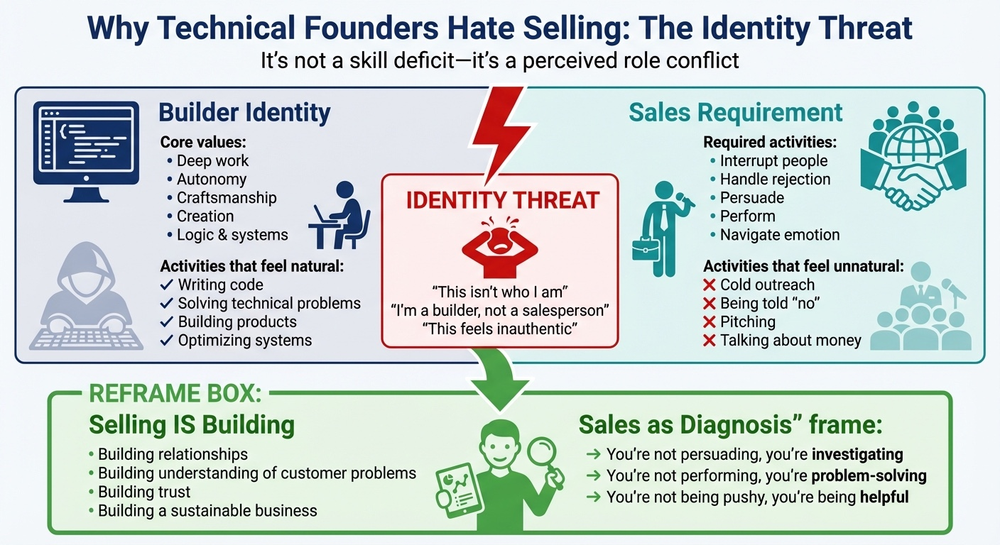
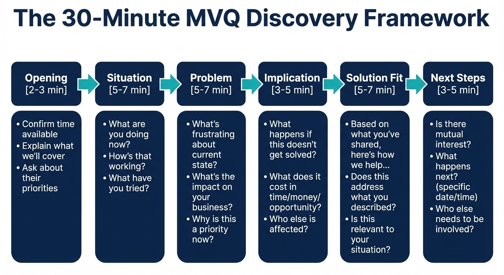
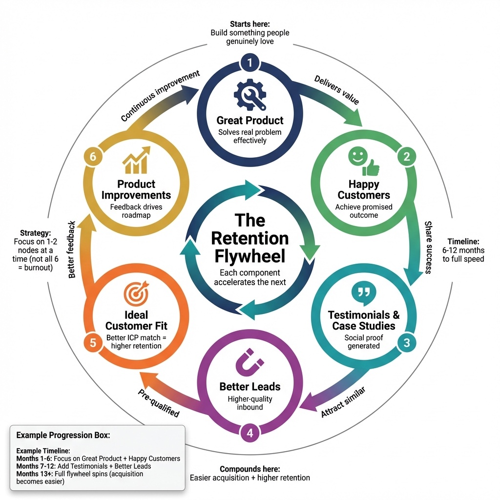
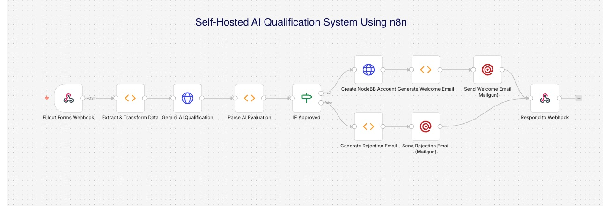
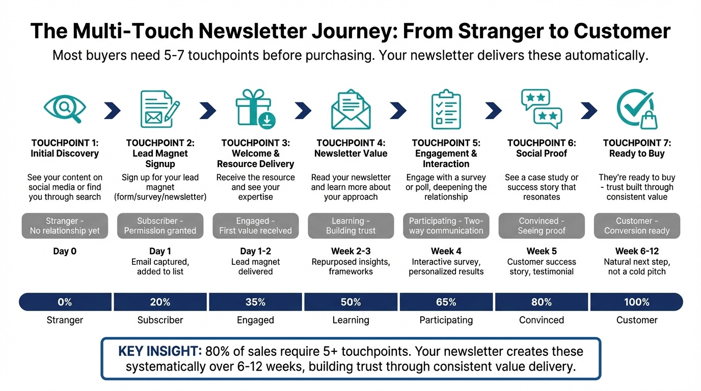
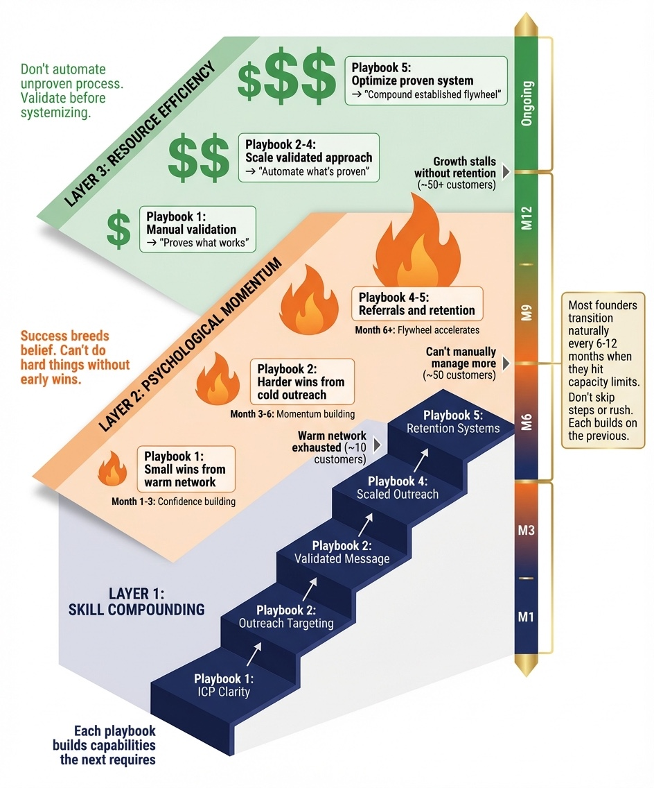
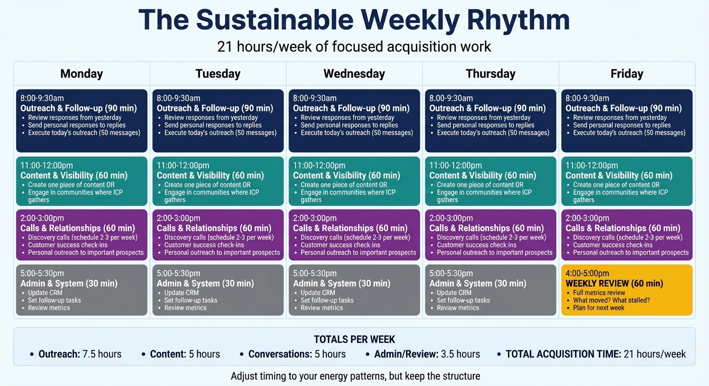
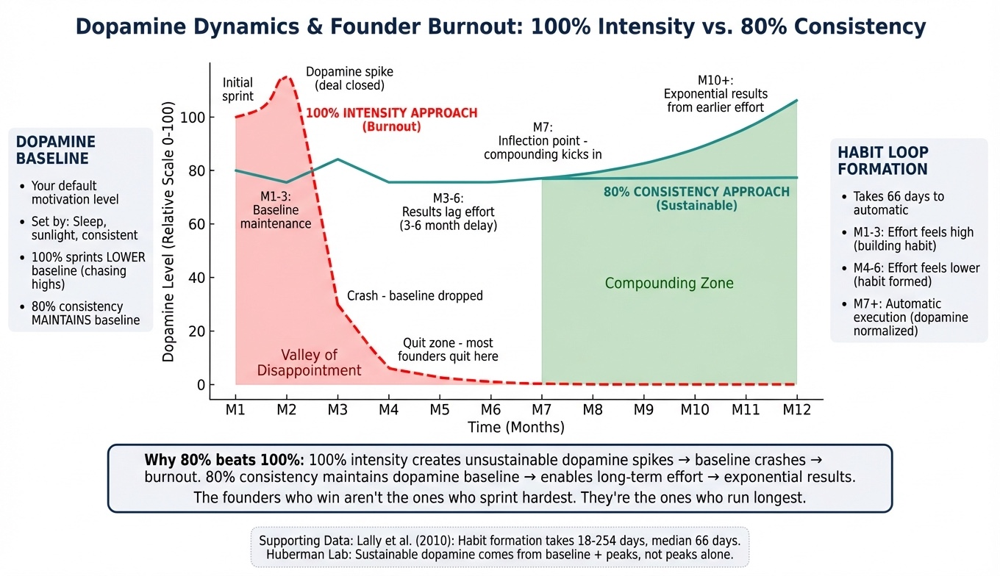
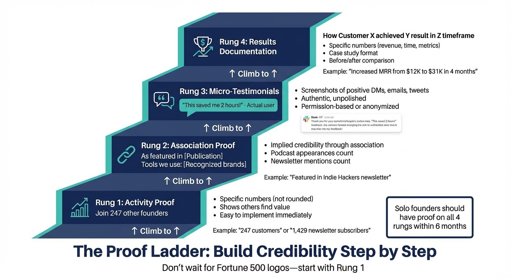

# Introduction: The Solo Founder's Dilemma

In the United States, roughly 59% of all companies have a single owner, consistently outnumbering multi-owner businesses year after year[1]. In independent SaaS (bootstrapped) surveys, roughly 55% of companies report a solo founder[2].

In other words, *you* are not the edge case. You are the norm.

**A note on scope:** This book uses US data and examples; the principles and playbooks apply internationally—adjust pricing, channels, and regulations to your market.

Yet almost everything written about customer acquisition assumes you are not.

## You built something. Now you need to sell it.

You built something valuable. Maybe it's software that solves a problem you struggled with for years. Maybe it's a course that packages hard-won expertise. Maybe it's a service that helps people handle challenges you've already conquered. The building part, you figured out. The acquiring customers part is killing you.

This isn't a character flaw. It's a structural problem that almost every solo founder faces. You're one person doing the work of an entire company: product development, customer support, marketing, sales, operations, accounting. Customer acquisition is just one more plate to spin, except this particular plate determines whether all the other plates matter.

## The structural reality of building alone

Solo founders operate under constraints that generic playbooks ignore:

**Time.** A 2024 Constant Contact report found that 56% of small businesses have an hour or less per day for marketing[3]. For most solo founders, that translates to roughly five hours a week to devote to growth.

**Revenue pressure.** Census nonemployer statistics show $1.7 trillion in receipts across 29.8 million nonemployer businesses in 2022—about $57,000 per business on average (derived from totals)[4]. That's not a failure of talent; it's often a failure of distribution. You cannot compound revenue you never had time to acquire.

**Sales experience.** Many founders come from engineering, product, or specialist roles where "sales" was something other people did.

**Psychology.** Sales carries negative stereotypes for many people. Those associations don't disappear just because you founded a company.

Together, these form a clear pattern: a large and growing share of businesses are founded by one person with very little time, very little sales experience, and a deeply ambivalent relationship with selling—yet whose survival depends on acquiring customers reliably.

## Why generic advice doesn't work for you

The single biggest cause of startup failure isn't "competition" or "product quality." It's "no market need." Sometimes that's a validation failure. But often, the product *could* solve a real problem, if only the right people knew about it. That's a distribution problem, and it's what this book addresses.

There's no shortage of advice on how to fix that. The problem is who that advice is written for:

| The Playbook | What It Assumes |
|--------------|-----------------|
| **Enterprise Sales** | SDRs filling calendars, AEs running demos, sales engineers handling technical depth |
| **VC Growth** | Five-figure ad budgets, dozens of experiments, "profitability later" mindset |
| **Creator Marketing** | An existing audience of 50k+ followers and hours to post daily |

If you're a solo founder selling $49-$5,000 offers with a limited budget and less than seven hours per week for customer acquisition, much of that advice quietly breaks. You cannot hire an SDR while you "focus on product." You cannot run 10,000-impression ad tests weekly. You cannot redesign your funnel three times a quarter.

Your constraints are different, so your acquisition system has to be different. This book treats those constraints as **design parameters**, not personal failures.

## The Solo Founder Constraint Triangle

This book is written for bootstrapped solo founders operating under three non-negotiable constraints. These are not obstacles to work around. They are the design parameters every tactic in this book is built against.


1. **Budget constraint.** Most founders start spending $0 - 100 per month on tools and get their first customers through manual outreach, communities, and content. As you scale, $200 - 300 per month becomes a sensible investment with disciplined spending. This book does not assume five-figure campaigns or agency retainers.

2. **Time constraint.** You have 5 - 7 hours per week for customer acquisition. The rest goes to product, customer success, and operations. You cannot win with volume. Most founders win with precision—picking one primary channel at a time and building simple systems around it.

3. **Solo constraint.** There are no employees, no agencies, and no team to share the emotional or operational load. Everything must be executable by one person with AI and lightweight tools. That means systems that reduce decision fatigue and make selling psychologically sustainable.

Those constraints rule out paid ads at scale, enterprise sales tools, agency retainers, juggling five channels, complex multi-step funnels, and anything that depends on delegation or a team. They push you toward manual outreach, relationships, organic channels, focused effort on one acquisition path at a time, and systems one person can run sustainably.

Many solo founders reach $3,000 - 5,000 MRR with zero ad spend and minimal tooling. The promise of this book is simple: if a tactic requires more than a few hundred dollars a month, a dedicated team, or six-month sales cycles, it does not make it into this playbook.

The goal is to give you a **complete customer acquisition system** that works within these constraints, not despite them.

## Where this book comes from

For two decades in Silicon Valley, my job title was effectively "the person who turns technology into revenue." I often owned the entire chain from lab to signed contract: market research, IP strategy, pitch decks, negotiation, and delivery.

For the past fifteen years, I've consulted for founders on these same challenges. As AI began removing friction from the startup process, I developed frameworks that became the backbone of my own AI-native education platform, SoloFrameHub.com. I'm "building in public" (see Chapter 15) by releasing 3 books with matching Course Academies over the first 4 months of 2026—documenting the entire process from book writing to course creation to platform development—so you can see these frameworks in action.

The systems in this book are the essential pieces of a full-stack go-to-market motion (market research, positioning, outreach, negotiation) distilled for the reality of a solo founder.

### AI as your force multiplier

AI tools have made capabilities accessible that once required entire teams. A solo founder can now:

- **Research and personalize** outreach at scale (once a full-time SDR role)
- **Analyze discovery calls** for patterns (once a sales enablement role)
- **Generate and test content** without a marketing agency
- **Build automation workflows** without a developer

But the tools are only as good as the strategy behind them. AI-personalized cold emails targeting the wrong people are just faster spam. This book teaches you the strategy first, then shows you how AI amplifies it. Not the other way around.

## What this book does differently

Rather than starting with theory, the chapters are built around specific problems solo founders face:

- **You avoid sales** because it feels like an attack on your identity. Chapter 1 reframes selling as diagnosis, not performance.
- **You're not sure who to target.** Chapter 2 walks you through building an Ideal Customer Profile tight enough to avoid "build it for everyone, sell it to no one."
- **You can't afford spray-and-pray.** The outreach and pricing chapters focus on high-yield activities you can execute in a few focused hours per week.
- **You're overwhelmed by AI hype.** The automation material is about what actually saves time and generates revenue.

Underneath all of this is a simple premise:

> **Solo founders are not failed teams. They are a different species of business that deserves its own playbook.**

## Who this book is for

This book is for solo founders building real businesses:

- **Technical founders** building B2B products who know their solution works but struggle with sales conversations. You're more comfortable debugging code than running a discovery call.
- **Creator founders** selling courses, coaching, or services who have an audience but can't monetize without feeling sleazy. You've been giving value for free and hoping people eventually buy.
- **Consultants and freelancers** who are excellent at the work but inconsistent at the pipeline. The feast-famine cycle never ends.

Whether your average sale is a $49/month subscription, a $297 course, or a $4,800 implementation project, the underlying problem is the same: you need a repeatable way to find the right people, start real conversations, and turn interest into revenue without burning yourself out.

## Who this book is not for

If you're reading books about hiring SDRs and building sales teams, you're reading the wrong book. *Founding Sales* by Pete Kazanjy is excellent for founders who can hire their first sales rep within 12 months. This book is for founders who ARE the sales team.

If you're selling high-ticket coaching, local services, or consumer products, other books may serve you better. Alex Hormozi's *100M Leads* is powerful for businesses built on paid advertising and high-volume lead generation. This book is for founders selling $49-$5,000 offers where each customer relationship actually matters.

This book is not about manipulating people into buying things they don't need. If your product doesn't solve a real problem, no acquisition strategy will save you.

This book is not about growth at all costs. Every tactic here is designed for profitability, not just growth.

This book is not about becoming someone you're not. The approach here is diagnostic, not performative. You'll learn to be more effective without becoming someone you'd dislike.

## How this book is organized

- **Part I: Psychology & Positioning (Chapters 1–3).** Reframing sales and finding your ideal customer.
- **Part II: Conversations & Conversion (Chapters 4–7).** Discovery calls, pricing with confidence, and using AI.
- **Part III: Systems & Metrics (Chapters 8–12).** Building repeatable habits and handling rejection.
- **Part IV: The Future (Chapters 13–15).** Your 90-day plan and Answer Engine Optimization.

You can read straight through, but you don't have to. If you're stuck on pricing, skip to Chapter 5. If your cold emails aren't working, start with Chapter 3. If you're burning out, Chapter 12 addresses sustainability. The **Appendix: Glossary** defines key terms (AEO, DISC, ICP, LTV:CAC, MVQ, NRR); the **Framework Index** lists all methodologies with chapter references.

Each chapter ends with an exercise. Don't skip them. Reading about customer acquisition doesn't improve your customer acquisition. Doing the exercises does.

## One thing before we start

I've written this book the way I wish someone had written one for me years ago. Not as a guru with all the answers. Not as someone selling a fantasy about passive income and four-hour workweeks. As a practitioner who's made the mistakes, learned from them, and is still learning.

Some of what I share will work perfectly for you. Some won't fit your market or your style. That's fine. Customer acquisition isn't paint-by-numbers. It's a set of principles you adapt to your specific situation.

What I can promise is this: every tactic in this book has been tested. Every framework has been refined through actual use. Every mistake has cost me something. Use it to compress your own learning curve.

The acquiring customers part doesn't have to keep killing you. Let's change that.

**Turn to Chapter 1: Why You Hate Selling (And Why That's Actually Good News)**


[1] U.S. Census Bureau, America Counts. "Most U.S. Businesses Have Only One Owner," November 21, 2024. Annual Business Survey analysis shows an average 59.2% share of single-owner businesses (2017–2021).

[2] MicroConf, *The 2022 State of Independent SaaS* report. Survey shows 55% of respondents were solo founders. (Bootstrapped SaaS survey.)

[3] Constant Contact, "New research from Constant Contact reveals small businesses struggle to market effectively due to low confidence, limited time, and lack of knowledge," April 23, 2024. 56% of SMBs surveyed reported an hour or less per day for marketing.

[4] U.S. Census Bureau, America Counts. "Telling the Story of the Nation’s Smallest Businesses," May 6, 2025. 2022 Nonemployer Statistics: 29.8 million nonemployer businesses and $1.7 trillion in receipts (average receipts derived).


# PART I

## Psychology & Positioning

Most solo founders struggle with customer acquisition not because they lack skills, but because they're fighting their own psychology while targeting the wrong people. It's like running a marathon with a backpack full of rocks—you might have the endurance, but you've made it unnecessarily hard.

This section fixes both problems.

**Chapter 1** examines why sales feels threatening to builders and creators. Your discomfort with selling is actually a strength - you'll learn to reframe customer conversations in a way that aligns with your values instead of contradicting them.

**Chapter 2** gets specific about who deserves your limited time. Not "everyone who might buy"—that's a recipe for exhaustion. You'll define your Ideal Customer Profile: the people you can help most, who can pay you fairly, and who you'll genuinely enjoy working with.

**Chapter 3** covers the mechanics of reaching these people without being pushy or manipulative: where to find your ideal customers, how to start conversations that don't feel like "sales," and which channels actually work for solo founders.

## What You'll Have By the End

- A mental frame for sales that eliminates the identity threat
- A documented Ideal Customer Profile that guides every decision
- A strategy for reaching the right people through the right channels
- Outreach methods that feel authentic, not sleazy

Everything else in this book builds on this foundation. Get these three chapters right, and the rest becomes dramatically easier.


*Figure P.1: Your journey through this book. Psychology → Conversations → Systems → Your Playbook.*


# Chapter 1: Why You Hate Selling (And Why That's Actually Good News)

You hate selling.

The thought of cold calling makes your stomach turn. Writing outreach emails feels like begging. Following up with a prospect who went quiet feels desperate. The moment a conversation shifts from "let me show you what I built" to "would you like to buy it?" - that's when you'd rather go add another feature instead.

Good.

That discomfort means you're not the kind of person who manipulates others. You've been on the receiving end of pushy pitches, manipulative tactics, and conversations that felt more like extractions than exchanges. The resistance to becoming *that person* is rational. It's pattern recognition, not weakness.

Here's what the research shows: 84% of entrepreneurs experience imposter syndrome, and technical founders show particular resistance to sales activities [1]. They can architect complex systems or ship products under pressure - but customer acquisition triggers avoidance behaviors that have nothing to do with skill deficits.

Understanding why this happens - and what to do instead - starts with neuroscience.

## The Identity War Inside Your Head

Technical and semi-technical founders - engineers, product managers, and builders who create more than they sell - show a consistent pattern. People who can architect complex systems hit a wall when it comes to customer acquisition: the prospecting, outreach, conversations, and closing that turn a product into a business.

> **Founder-Type Note:** While this chapter focuses on the psychological barriers to selling that affect all solo founders, the specific tactics and approaches that follow in later chapters will differ by business model. B2B SaaS founders selling to businesses face different challenges than coaches selling to individuals or creators selling digital products. Chapter 10's playbooks address these differences in detail, but you'll see callouts throughout the book indicating when guidance applies primarily to one business model versus another.

The conventional assumption is that they just need "sales training." But research on founder psychology tells a different story. The resistance isn't a skills problem. It's an identity threat.

Dr. William Marston's behavioral research (which later became the DISC framework—a behavioral model categorizing people as Dominant, Influential, Steady, or Conscientious based on how they perceive their environment and themselves) identified that humans experience significant distress when asked to act in ways that contradict their self-concept [2]. For builders and creators, "salesperson" often represents everything they're not: pushy, superficial, focused on manipulation rather than value creation.

When you sit down to write a sales email or pick up the phone to call a prospect, your brain registers a threat - not physical danger, but something more insidious. A threat to your self-concept as a craftsman, a problem-solver, an honest person.

This explains the "just one more feature" delay. Founders tell themselves: "I'll start selling once the product is ready." But "ready" becomes a moving target, always one feature away.



*Figure 1.1: The Identity Threat Framework. The conflict isn't a skill deficit - it's a perceived role conflict between your builder identity (deep work, autonomy, craftsmanship) and what you think sales requires (interruption, performance, persuasion). The resolution: reframe selling as building - building relationships, building understanding, building trust.*

Creator founders have their own version: the content treadmill. Posting valuable content endlessly, building an audience, but never making a direct offer. The implicit logic is: "If I give enough, they'll buy without me having to ask." Except they rarely do.

Both patterns serve the same psychological function: avoiding the moment where rejection becomes possible.

> **⚠️ Common Mistake: Waiting until you "feel ready" to start selling**
>
> Founders delay outreach until the product is "ready," their pitch is "polished," or they "feel confident." That moment never arrives.
>
> **Why it happens:** The discomfort of selling feels like a signal that something is wrong—that you need more preparation. It's not. The discomfort is the work itself.
>
> **What to do instead:** Start before you're ready. Your first 10 sales conversations will be awkward—that's how you learn what actually works. Waiting for confidence is backwards; confidence comes from doing, not preparing. Set a date and start, even if you're not ready.

## The Math Your Brain Gets Wrong

Research on negativity bias shows that brains process negative feedback 3–5 times more intensely than positive feedback [3]. This isn't a character flaw—it's evolution. Our ancestors who were hyper-sensitive to social rejection survived longer. Getting kicked out of the tribe meant death. Your nervous system hasn't caught up to the fact that a prospect saying "no thanks" to your SaaS product isn't the same as being abandoned on the savanna.

Research shows that social rejection and physical pain activate the same brain regions[4]. When a founder experiences rejection from a prospect, their brain processes it similarly to physical pain. This isn't just a metaphor—brain imaging studies demonstrate that the same neural pathways light up for both experiences. The "piggyback theory" of social pain suggests that because human infants depend entirely on caregivers for survival, the social attachment system evolved by co-opting the existing physical-pain architecture. In ancestral environments, social isolation meant death; the brain therefore treats a "no" from a prospect with the same urgency as a physical threat.

**The practical implication:** Some founders may be more sensitive to rejection due to genetic factors that influence how they process social pain. This isn't a character flaw or weakness—it's biology. The good news is that understanding this helps you reframe rejection: it's not personal failure, it's your nervous system doing what it evolved to do. The solution isn't to eliminate the discomfort (you can't), but to recognize it for what it is and develop systems that help you move through it anyway.

*For readers interested in the neuroscience details: The specific brain regions involved (dACC, anterior insula, RVPFC), the role of opioid systems in social distress regulation, and research on genetic variations (including the OPRM1 gene) that influence rejection sensitivity are covered in the Appendix: Sources & Citations (Neuroscience of Sales Resistance).*

Founders take every rejection personally. A "no" means they're incompetent. A stalled deal means they said something wrong.

**The Negativity Bias and Feedback Asymmetry**

The human brain is wired with a "negativity bias," meaning it processes and retains negative information more rapidly and deeply than positive information. Psychological research suggests that to maintain a flourishing mental state, individuals require a "positivity ratio" of approximately 3:1 or even 5:1 (positive to negative interactions).

For a technical founder accustomed to the deterministic environment of engineering—where the feedback loop is immediate, objective, and generally positive (problem solved)—the sales environment is a hostile inversion of reality. The "No" signal is dominant. If a founder requires a 3:1 positivity ratio to maintain motivation but encounters a 1:20 ratio in cold outreach, the psychological cost of perseverance becomes unsustainable without significant cognitive reframing. This leads to "burnout" that is specifically isolated to sales activities, even if the founder retains high energy for coding.

**Case Study (B2B):** A B2B founder spent weeks researching a prospect's operations, tailoring a proposal, rehearsing his presentation. The VP seemed interested, asked good questions, requested a follow-up meeting. Then nothing. Calls went to voicemail. Emails disappeared into the void. The founder assumed he'd blown it somehow.

Three months later, the truth emerged: the parent company had frozen all capital expenditures during a merger. The VP couldn't have bought from anyone, no matter how perfect the pitch. That rejection had nothing to do with the founder. Zero.

**Case Study (Creator/Coach):** A business coach spent two weeks preparing a custom proposal for a potential client who seemed perfect—they'd had multiple discovery calls, the client was enthusiastic, and they'd discussed specific outcomes. The coach sent the proposal and waited. No response. Follow-up emails went unanswered. The coach assumed they'd priced too high or the proposal wasn't compelling enough.

Six weeks later, the client reached out: their spouse had been diagnosed with a serious illness, and all non-essential spending was on hold while they focused on family. The client apologized and said they'd be in touch when things stabilized. That rejection had nothing to do with the coach's pricing, proposal, or value—it was life circumstances completely outside their control.

Most rejections fall into three buckets:

1. **Wrong timing.** Budget cycles, internal politics, competing priorities the founder knew nothing about.
2. **Wrong fit.** The prospect genuinely needed something the founder couldn't provide. Finding that out quickly is a gift, not a failure.
3. **Wrong person.** The founder was talking to someone without decision authority who was too polite to say so.

None of these reflect the founder's worth as a human being or the value of what they're selling.

But your brain doesn't naturally make these distinctions. When you're a solo founder and someone rejects your offer, the mental math gets distorted: *They rejected my product → I built my product → They rejected me.*

The numbers are stark: 84% of entrepreneurs experience imposter syndrome, and 71% of U.S. CEOs report the same[5]. The solo founder has no team to absorb the rejection. Every "no" lands directly on one person.

> **📊 Research Insight: Founder Personality Types and Solo Founder Disadvantage**
>
> A landmark study of 21,187 startups identified six distinct founder personality types using machine learning analysis: Fighters (competitive, aggressive), Operators (process-oriented, efficient), Accomplishers (achievement-focused), Leaders (vision-oriented, inspirational), Engineers (analytical, technical), and Developers (technical with higher extraversion). The algorithm distinguished successful entrepreneurs from employees with 82.5% accuracy.
>
> **Key findings relevant to solo founders:**
> - Founder personality is 5x more predictive of success than industry sector
> - 3+ founders are 2x more likely to succeed than solo founders
> - Personality-diverse teams are 8-10x more successful than single founders
> - Solo technical founders face a structural disadvantage (50% lower success rate)
>
> This research validates why technical founders struggle with sales (engineer personality type) and supports the need for systematic behavioral adaptation training to compensate for solo founder disadvantage. The good news: understanding your personality type and learning to adapt your communication style (as covered in Chapter 4's DISC framework) can help bridge this gap.

## The Two Flavors of Avoidance

Whether building B2B software or selling courses and digital products, founders exhibit identical underlying fears. The avoidance patterns differ by founder type.

**Technical founders fear incompetence and inefficiency.**

The internal narrative sounds like: "I'm not a salesperson. I'm an engineer." The underlying belief: "The product should sell itself if it's good enough." This leads to procrastibuilding - adding features nobody asked for instead of talking to customers who might say no.

If you've taken a DISC assessment, you probably scored high in Compliance (C) or Steadiness (S). High C founders suffer from analysis paralysis, refusing to sell until the product is "perfect." High S founders avoid the interpersonal tension of sales because they prioritize harmony over closing [6].

**Case Study:** A technical founder spent eight months perfecting his analytics dashboard before showing it to a single paying customer. When he finally did, they wanted something completely different. He'd built the wrong thing because he was too afraid to ask what they actually needed.

**Creator founders fear inauthenticity and betrayal.**

The internal narrative sounds like: "If I sell too hard, I'll become one of those sleazy gurus. My audience will stop trusting me." This leads to endless free content, massive newsletters, and zero revenue.

Jay Clouse, founder of Creator Science, described this as "Midwestern shame around selling."[7] The irony: his audience *wanted* to buy from him. They just didn't know what to buy because he never made a clear offer.

Both patterns lead to the same place: founders who are busy but broke.

## The Behavioral Economics of the Builder's Trap

From a purely rational perspective, a founder should prioritize the activity with the highest marginal return: sales. However, behavioral economics explains why founders consistently choose the lower-value activity of coding.

**Hyperbolic Discounting and the Dopamine of Code**

Hyperbolic discounting is the cognitive bias where individuals prefer smaller, immediate rewards over larger, later rewards.

- **Code as immediate reward:** Coding provides a tight, deterministic feedback loop. A founder writes a function, runs the test, sees green lights. Dopamine hits immediately. The reward is certain and instant.
- **Sales as delayed reward:** Sales involves a loose, probabilistic feedback loop. A founder makes 50 calls, gets 48 rejections, 2 conversations, and *maybe* a check in 90 days. The reward is uncertain and delayed.

The founder's brain, seeking dopamine efficiency, naturally gravitates toward the "Build" loop. They rationalize this by believing that "better code" increases the probability of future sales, but in reality, they are simply choosing the path of least neurochemical resistance.

**Opportunity Cost and Sunk Cost Fallacies**

The opportunity cost of coding is the revenue lost by not selling. But opportunity costs are abstract ("unrealized gains"), while the pain of sales is concrete ("realized stress"). Humans are loss-averse—we fight harder to avoid pain than to gain pleasure.

Technical founders often fall victim to the sunk cost fallacy. Having spent thousands of hours learning to code, they feel compelled to use that skill ("If I'm not coding, I'm wasting my talent"). Engaging in sales feels like "waste" because it doesn't utilize their primary asset. This leads to "feature creep" - the continuous addition of features to avoid the market test. Each new feature is a justification to delay the launch (and the potential rejection) by another two weeks.

**The Economic Impact of Call Reluctance**

The cost of this psychological barrier is not theoretical. Research by Behavioral Sciences Research Press has quantified the impact of "Sales Call Reluctance":

- **Individual cost:** In traditional sales roles, call reluctance costs an individual over $10,800 annually in lost commissions.
- **Venture cost:** For a startup, the cost is often the entire company. "Running out of cash" (16-29% of failures) is frequently a lagging indicator of call reluctance. The founder burns through their runway building a product, only attempting to sell when cash is critical - at which point, the desperation makes them less effective sellers.

**The "Feast and Famine" Cycle in Consultants**

For technical consultants or service-based solo founders, sales avoidance creates a destructive "feast and famine" cycle:

1. **Feast:** The founder lands a client. They immediately stop all sales activity to focus on "delivery" (delighted to be back in Maker Mode).
2. **Famine:** The project ends. The pipeline is empty because no prospecting occurred during the Feast. The founder experiences financial panic.
3. **Panic selling:** The anxiety of bankruptcy temporarily overrides the fear of sales. They hustle, land a client, and the cycle repeats. This cycle prevents scaling and traps the founder in a reactive state, unable to build a predictable revenue engine.

## The Price of Underpricing

A common pattern: founders terrified of charging "too much" price at the bottom of the market, then wonder why customers don't take them seriously.

This isn't humility. It's imposter syndrome wearing a strategic costume.

When founders don't believe they're worth $3,000, they charge $300. But the low price creates its own problems: you attract price-sensitive customers who demand more and appreciate less, you burn out delivering unrealistic value, and you signal to serious buyers that you're probably not serious yourself.

The formula for underpricing: *If they say no to $300, it's probably just the wrong fit. If they say no to $3,000, it means I'm not worth $3,000.* Your brain would rather avoid testing the second hypothesis.

## The Reframe That Actually Works

Most sales psychology advice prescribes "confidence" as the cure for sales anxiety. Just believe in yourself! Visualize success! Fake it till you make it!

This advice is useless. You can't will yourself into a different identity. But you can change the frame around what selling actually is.

The most effective psychological intervention is reframing selling from "extraction" to "diagnosis" [8].

When a doctor asks about your symptoms, you don't feel manipulated. When they recommend a treatment, you don't feel "sold to." The questions serve a purpose: understanding your problem so they can offer an appropriate solution.

Founder-led sales can work exactly the same way.

Instead of: "I'm trying to get money from this person."
Try: "I'm trying to find out if I can solve their problem."

This isn't just a mental trick. It changes the questions you ask, the tone of your conversations, and your emotional response to "no." When the goal is diagnosis, rejection becomes information. "No" means "this particular solution doesn't fit this particular problem for this particular person at this particular time." That's useful data, not a verdict on your worth.

**Case Study:** A solo founder selling B2B automation software was competing against established players for a manufacturing client. His competitors were scheduling pitch meetings and preparing slide decks.

He tried something different: asking for a meeting just to understand their situation. No slides. No proposal. Just questions.

The operations director talked for forty-five minutes about supply chain deadlines, budget constraints, skepticism from floor supervisors, and his personal fear that this project would define his credibility.

The founder took notes. Asked clarifying questions. Didn't mention his product once.

At the end, the director said: "You're the first vendor who actually listened."

By the third meeting, when he finally presented a solution, he knew exactly what mattered. The proposal wrote itself. He won the deal.

## The Scientist Reframe (For Technical Founders)

If you're a technical founder, here's a reframe that works with your existing identity instead of against it.

Stop thinking of customer calls as "sales conversations." Start thinking of them as "data collection."

Engineers love data. You probably already gather metrics on everything: server performance, user behavior, conversion rates. Customer conversations are just another data source - one that happens to be qualitative instead of quantitative.

Every call teaches you something:

- What language do prospects use to describe their problems?
- What features do they actually care about (vs. what you assumed)?
- What objections come up consistently?
- What's their buying timeline and process?

This data makes your product better, your marketing more effective, and your sales conversations more relevant. But you only get it by having the conversations you've been avoiding.

A bootstrapped founder who grew to $1M ARR without any sales experience described his breakthrough: "I stopped thinking of it as sales and started thinking of it as research. I was just meeting customers to hear their pain. And they loved talking about their pain."[9]

The reframe works because it's true. You are collecting data. The fact that some of that data collection results in revenue doesn't make it manipulation.

## The Invitation Reframe (For Creator Founders)

If you're a creator selling courses, coaching, or services, your fear is different. You're not worried about incompetence - you're worried about corrupting the authentic relationship you have with your audience.

The reframe: you're not selling. You're extending an invitation.

"I've created this solution. You're invited to join if it fits your needs."

This removes the pressure to "convince" anyone of anything. You're not persuading - you're describing an option and letting people self-select.

The math supports this: your audience is already following you, consuming your content, and trusting your perspective. They *want* a way to go deeper. By never making an offer, you're not protecting the relationship - you're leaving them without the option to take the next step.

Justin Welsh built a multi-million dollar business selling digital products to his LinkedIn audience using this approach[10]. His sales are "invisible" - he simply states the price and lets people decide. No pressure. No artificial scarcity. No manipulation.

"The less I tried to 'sell', the more successful I was," he notes.

The irony: creators who avoid selling often force their audience to buy from inferior competitors who aren't afraid to make an offer.

## Separating Self-Worth from Market Feedback

Here's the hardest shift, and the one that matters most.

*What you offer is not who you are.*

When someone declines your consulting package, they're not rejecting your value as a human being. They're saying this particular offer doesn't fit their particular situation right now. These are different things, even though your nervous system treats them as identical.

Bad mental model: "They said no, so I am a failure."

Better mental model: "They said no, so the *offer* needs iteration."

The first model treats rejection as a judgment of your worth. The second model treats rejection as feedback on a variable you can adjust.

Price, positioning, timing, packaging, audience - all of these affect whether someone buys. All of these can be changed. Your fundamental value as a person isn't on the table.

This cognitive shift takes time. You won't believe it immediately just because you read it in a book. But every conversation where you practice seeing "no" as information rather than verdict builds the new pattern.

## What Actually Happens When You Start

Most of the fear around sales comes from imagining the worst-case scenario: being pushy, making people uncomfortable, damaging relationships, and still not making any sales.

Here's what actually happens when you approach customer acquisition as diagnosis rather than extraction:

**People appreciate the conversation.** When you're genuinely curious about their problems instead of pitching at them, prospects feel heard. They'll often thank you even if they don't buy.

**You learn faster.** Every conversation teaches you something about your market, your offer, and your positioning. Founders who avoid sales stay confused about their customers. Founders who engage get smarter.

**Rejection stops hurting as much.** The first few "no" responses sting. By the twentieth, you've recalibrated. You know it's not about you.

**Your product improves.** Customer feedback only comes from conversations you're willing to have.

**Revenue follows.** You cannot make money from customers you never talk to.

## The Cost of Avoidance

The alternative to facing these fears isn't safety - it's a slow-motion disaster.

You keep building features nobody asked for. You keep posting content without making offers. You keep your prices low to avoid the risk of real rejection. You stay busy but broke.

**Case Study:** A developer built an exceptional project management tool over two years, convinced that perfection would eventually attract customers organically. It didn't. Competitors with inferior products but better sales skills captured the market. By the time he finally started reaching out to potential customers, they'd already committed to other solutions.

**Case Study:** A business coach built an email list of 15,000 subscribers over three years. Great content. Loyal audience. Zero products for sale. When she finally launched a course, it flopped - not because people didn't want to learn from her, but because she'd trained her audience to expect free value and never set up the expectation that she was building a business.

Research on founder sales mistakes identifies "Happy Ears" as the most expensive error - hearing interest as intent, assuming that someone who seems engaged will eventually buy, without ever asking directly[11].

The result: pipelines full of "maybes" that never convert. Approximately 50% of prospects in a typical solo founder's pipeline are unqualified and never convert[12]. Half of your "opportunities" were never going to buy. You just didn't ask the questions that would have revealed this truth earlier.

The fix is simple but uncomfortable: ask direct questions early.

"Is solving this problem a priority right now, or is it more of a someday thing?"
"Have you set aside resources for this, or would this require finding new budget?"
"What would need to be true for you to move forward in the next 30 days?"

These questions feel risky because they invite "no." But "no" now is infinitely better than "no" after six months of false hope. Early disqualification is a gift that frees you to spend time on prospects who can actually become customers.

## Permission to Be Bad at It

One more thing before we move on.

You have permission to be bad at sales.

Not forever - you'll get better with practice. But right now, in your first conversations, you're going to stumble. You'll ask awkward questions. You'll forget important points. You'll feel uncomfortable.

That's fine.

**Case Study:** A founder had his talking points memorized and hit every feature benefit. The prospect listened politely, then asked: "Do you have any idea what my actual problems are?"

He didn't. He'd been so focused on what he wanted to say that he never asked what the prospect needed to hear.

That conversation taught him more than any formal training. And he only got to have it because he was willing to be bad at sales for long enough to get better.

Your prospects don't expect you to be a polished sales machine. Many of them specifically chose to talk to founders *because* they're tired of polished sales machines. They want authenticity, directness, and someone who actually understands their problem.

You have those things. You just need to stop letting fear convince you otherwise.

## Chapter Summary: TL;DR

**The core insight:** Your resistance to selling isn't a skill deficit - it's an identity threat. Your brain treats sales activities as a conflict with your builder identity, triggering the same neural pathways as physical pain. Understanding this helps you reframe selling as diagnosis (helping) rather than extraction (manipulation).

**Key takeaways:**
- 84% of entrepreneurs experience imposter syndrome—you're not alone
- Identity threat (not lack of skills) drives sales avoidance
- Negativity bias makes rejection feel 3–5x more significant than it is
- Reframing selling as "helping" reduces the psychological conflict
- Technical founders (high C or high S) face specific challenges with sales activities; Chapter 4's DISC framework helps you adapt

**Next chapter:** Chapter 2 helps you define exactly who to talk to - your Ideal Customer Profile. The diagnostic mindset becomes powerful when applied to targeting.

---

## The Exercise

Before you move on to the next chapter, try this:

Write down the last three times you avoided a sales-related activity. Maybe you delayed a follow-up email. Maybe you decided to "polish" your product a bit more before showing it to customers. Maybe you posted content instead of making an offer.

For each avoidance, ask yourself: what was I actually afraid of?

Usually it comes down to one of three things:

1. **Fear of rejection.** "They might say no, and that would mean I'm not good enough."
2. **Fear of judgment.** "They might think I'm pushy or sleazy."
3. **Fear of confirmation.** "If they say no, it proves what I already suspected - that I can't do this."

None of these fears are facts. They're predictions about outcomes that may or may not happen, filtered through negativity bias that makes rejection feel more significant than it actually is.

Experience is what updates these predictions. One conversation at a time, you'll accumulate evidence that selling doesn't have to feel manipulative, that rejection isn't personal, and that your fear of judgment vastly exceeds the actual judgment you receive.

Start with one conversation. See what happens.

---

## Chapter Checklist

**Before moving to Chapter 2, complete:**

- [ ] Identified your specific avoidance pattern (procrastibuilding, content treadmill, or other)
- [ ] Written down the last 3 times you avoided sales activities and what you were actually afraid of
- [ ] Understood that rejection sensitivity is biological, not personal
- [ ] Reframed selling as "helping" rather than "extraction"
- [ ] Committed to starting with one conversation to test the reframe

**Self-assessment questions:**
- What's my primary fear around selling? (Rejection, judgment, or confirmation)
- When I think about "selling," what image comes to mind? (This reveals your mental model)
- What would "helping" look like instead of "selling" in my specific context?

The shift we've covered in this chapter - from seeing sales as extraction to seeing it as diagnosis - is foundational. Every tactic in this book builds on it.

But even with the right psychological frame, you can still waste enormous energy talking to the wrong people. A founder with perfect sales skills targeting the wrong customers will fail just as surely as a founder with the right customers who never makes contact.

In Chapter 2, you'll define exactly who to talk to. The diagnostic mindset becomes powerful when applied to your Ideal Customer Profile - the exact people you can help most, who can pay you fairly, and who you'll genuinely enjoy serving. Getting this targeting right makes everything else dramatically easier.

[1] Pedro, C., "Impostor Syndrome: A Big Obstacle for Success in Business," Charlenepedro.com, 2024. Based on Kajabi 2020 survey (N=600).

[2] Marston, W. M., *Emotions of Normal People*, 1928. Marston's work on behavioral psychology formed the foundation for the DISC framework.

[3] Forbes, "Overcoming Negativity Bias: A Key to Better Business Decision Making," December 2024.

[4] Eisenberger, N. I., and Lieberman, M. D., "Why rejection hurts: a common neural alarm system for physical and social pain," Trends in Cognitive Sciences, 2004.

[5] Korn Ferry, "71% of U.S. CEOs Say They Have Imposter Syndrome," CNBC, June 2024.

[6] Marston, W. M., *Emotions of Normal People*, 1928. DISC behavioral patterns validated through psychometric research on technical roles.

[7] Clouse, J., Creator Science, 2024.

[8] Hyperbound AI, "Introvert Guide: Cold Calling Anxiety," 2024. Additional support from consultative selling research.

[9] Reddit r/startups, "Solo Technical Founders: When It Came to Sales..." discussion thread, 2024.

[10] Welsh, J., "Nobody Is Coming to Save You," justinwelsh.me newsletter, 2024.

[11] Gassee, P., "The Greatest Sales Mistakes Founders Make," paulgassee.com, 2024.

[12] Gassee, P., "The Greatest Sales Mistakes Founders Make," 2024.


# Chapter 2: Finding the Right People to Talk To

Research on B2B sales qualification reveals a stark reality: 40–60% of deals end in "no decision" rather than competitive loss, and approximately 50% of prospects in a typical solo founder's pipeline are unqualified and never convert [1]. Proper qualification correlates with 7.4x higher win rates—52% with complete qualification versus 7% with none (Sandler Institute research across thousands of deals) [2].

Half of every founder's sales effort goes toward people who were never going to buy. The pattern is predictable: founders accept anyone who shows interest. Startups with no budget. Enterprises with eighteen-month procurement cycles. Clients who want extensive work for minimal investment. Prospects who can't articulate what they actually need.

Every call drains energy. Most go nowhere. The ones that close often become nightmares - scope creep, payment chasing, and customers fundamentally wrong for what's being offered.

The problem isn't skills or offer quality. The problem is undefined targeting - and qualification is the highest-leverage activity for time-constrained founders.


## The Expensive Mistake of Selling to Everyone


When you're desperate for revenue, any customer looks good. This is a trap. Half of the people you're spending time on were never going to buy—no matter how good your pitch or how persistent your follow-up. Every hour on the wrong prospect is an hour not spent on the right one.


Enterprise sales teams have clear qualification criteria and the pipeline volume to enforce them strictly. But solo founders with 20–30 prospects can't "walk away firmly" from half of them—you need a different approach.

Instead of binary qualify/disqualify, think in tiers: A-tier prospects (perfect fit, prioritize heavily), B-tier (good fit, pursue if time allows), C-tier (marginal fit, keep warm but don't invest heavily). That lets you focus energy appropriately without abandoning opportunities you might need.

You need somewhere to *do* that prioritization. When a deal seems possible, record it: in a CRM deal pipeline (e.g. a deal stage plus a tier or tag like A/B/C), or in a simple list with a column for tier. Segment or filter by tier so you see A-tier first. Prioritization only works if you make it visible—in a pipeline, a spreadsheet, or whatever you actually update.


Most sales training targets either VC-funded teams or pure content creators with established audiences; the solo founder middle ground is rarely addressed. Your ICP criteria differ fundamentally from VC-backed companies: bootstrapped founders need customers who pay quickly, implement independently, and don't require extensive hand-holding. You're selling personal expertise and direct access, not just a product.


## What an Ideal Customer Profile Actually Is

Enterprise qualification frameworks like BANT (IBM, 1950s) and MEDDIC (PTC, 1990s) were built for large sales teams pursuing $100K+ deals. Research shows BANT delivers 23% faster sales cycles and 53% higher win rates when applied correctly [3]. But solo founders selling $500–$50K solutions need adapted frameworks—the full enterprise approach is overkill.

An Ideal Customer Profile (ICP; see Appendix: Glossary) isn't a demographic checkbox exercise. It's not "marketing managers, 28–45, in tech companies." That tells you almost nothing useful.

A real ICP answers one question: Who can I help the most, who will pay what I need to charge, and who will be a joy to work with?


Those three elements (help, pay, enjoy) form three overlapping circles. If a customer fits two but not three, you'll regret taking them on.


*Figure 2.1: The ICP Framework. Your ideal customer sits at the intersection of three circles: people you can genuinely help, people who will pay what you need to charge, and people who are a joy to work with. Compromise on any dimension and you'll pay for it in burnout, broken finances, or damaged reputation.*

- Can help + will pay, but miserable to work with? You'll burn out. Can help + enjoyable, but won't pay enough? You'll go broke. Will pay + enjoyable, but you can't actually help them? You'll destroy your reputation.

> **⚠️ Common Mistake: Defining ICP too broadly**
>
> Trying to serve everyone means serving no one. Your ICP should be specific enough to filter 90% of potential customers OUT.
>
> **Why it happens:** Founders worry about limiting their market and missing opportunities, so they keep targeting broad.
>
> **What to do instead:** Narrow your ICP to a specific person with specific characteristics facing specific problems. You can always expand later—start narrow, dominate that niche, then expand from a position of strength.

> **Case Study: Flowjin—Building for 50 People, Not 50,000**
>
> **Problem:** "Content creators" is a market of millions—impossible to message clearly. Twitter didn't let users download their own Spaces recordings.
>
> **Solution:** Founder Juliana Hahn built exclusively for Twitter Space hosts in web3 (~50 people). Single pain point, single solution. "Build for 10 people first, not 10,000."
>
> **Result:** That community became Flowjin's most loyal customers—word spread fast, premium pricing justified, lower CAC. What looked "too narrow" was perfect focus. Your ICP should be narrow enough that most people think you're crazy.

> **Case Study: Psychiatric Practice—Expanding ICP**
>
> **Problem:** A psychiatric practice had outgrown their original ICP (local insured patients seeking treatment). They wanted to scale but their market was geographically limited.
>
> **Solution:** I identified a new ICP: education seekers interested in mental health and human flourishing (broader geography, different value proposition). I built a course academy that positioned the practice as thought leaders while generating leads for treatment.
>
> **Result:** The practice will gain a digital marketing channel and educational authority. The platform is designed to be licensable to other practices—differentiation for them, a new revenue line for me. (MVP: [mental-wellness-education.soloframehub.com](https://mental-wellness-education.soloframehub.com))
>
> **Takeaway:** When expanding a client's ICP, look for opportunities to structure the work so it becomes licensable. See Chapter 7 for lessons learned about building with AI tools.


## The B2B ICP Framework

> **Founder-Type Note:** This section applies primarily to B2B SaaS founders and consultants selling to businesses. If you're a coach or creator selling to individuals, see "The Creator ICP Framework" below. The principles are similar, but the characteristics you're evaluating differ.

If you're selling to businesses—even one-person operations—think about the company and the person separately.


**Company characteristics:**


- Industry or vertical
- Size (employees, revenue, or both)
- Stage (startup, growth, mature)
- Geography (if relevant)
- Technology stack (if selling technical products)
- Budget cycle timing


These matter because selling to a 10-person startup is fundamentally different from selling to a 500-person mid-market company. The startup might buy on a founder's whim after a 15-minute conversation. The mid-market company has procurement processes, budget committees, and security reviews.


**Person characteristics:**


- Job title and function
- Decision-making authority
- Pain points specific to their role
- How they measure success
- What gets them promoted (or fired)


The last point matters more than most founders realize. If you understand what gets someone promoted, you understand what they'll pay attention to. A VP of Sales who's measured on pipeline growth will care about lead generation. A VP of Sales who's measured on close rates will care about sales enablement. Same title, different priorities.


A common pattern: founders start with vague targeting like "IT managers at enterprises" and wonder why outreach falls flat. After analyzing their best customers - the ones who implemented quickly, renewed consistently, and referred others - the specificity emerges.

> **Case Study: Security Consulting Team (Mid-Market Financial Institutions)**
>
> **Problem:** A security team was doing free or heavily discounted implementation work for anyone who showed interest—exhausting, low margin, no clear ICP or path to profitable engagements.
>
> **Solution:** We defined a focused ICP: mid-sized financial institutions needing independent security assessments for boards, regulators, and insurers (no product-selling agenda). We mapped personas (CISOs, Heads of IT), triggers (audit findings, board pressure, regulatory changes), and repositioned the firm around fixed-scope, paid assessments.
>
> **Result:** Email and website messaging spoke directly to that ICP. Open and reply rates jumped into the high double-digits; the team started closing paid assessments instead of free pilots. Follow-on projects with the same client type made work profitable and predictable.


## The Creator ICP Framework

> **Founder-Type Note:** This section applies to coaches, consultants selling to individuals, and creators selling digital products. If you're a B2B SaaS founder, the "B2B ICP Framework" above is more relevant. The underlying logic (help, pay, enjoy) is identical, but the characteristics you evaluate differ.

If you're selling courses, coaching, or digital products, your ICP looks different but the underlying logic is identical: Who can I help the most, who will pay what I need to charge, and who will I enjoy working with? You're typically selling to individuals, so "company characteristics" become "life situation characteristics."


**Situation characteristics:**


- Career stage
- Income level or business revenue
- Current challenge or goal
- Failed solutions they've already tried
- Trigger event that created urgency


**Person characteristics:**


- Self-awareness about the problem
- Willingness to invest in solutions
- Ability to implement what you teach
- Coachability
- Expectations that match what you deliver


> **Case Study: Coaches Who Narrowed Their ICP**
>
> **Problem:** A business coach attracted "someday" builders; a productivity coach accepted anyone "getting more done," but half her clients couldn't implement. **Solution:** The first tightened to "service providers making $50K+ who want $200K without hiring"; the second added coachability filters (homework, feedback, progress tracking). **Result:** Enrollment dropped but completion rates and testimonials tripled; referrals attracted more clients like them.


The uncomfortable truth: not everyone can be your customer. The sooner you accept this, the faster you'll grow.


## The Pain-First Approach

Research on 35,000+ sales calls (Huthwaite International, 12-year study) proved that consultative selling focused on pain identification dramatically outperforms traditional pitch-based approaches[4]. The key insight: in complex sales, the quality of your questions beats the quality of your pitch every time.

Generic demographics don't convert. Pain converts.

The most reliable way to build your ICP is to start with the pain you solve, then work backward to who experiences that pain most acutely.


**Step 1: Define the pain precisely.**


Not "they struggle with marketing." That's too vague.


Better: "They're getting traffic to their website but no one is booking calls."


Even better: "They're getting 500+ visitors per month but less than 1% convert to sales calls, and they've already tried cheaper solutions like chatbots that didn't work."


**Step 2: Identify who feels this pain most intensely.**


Who wakes up at 3 AM worrying about this? Who has tried multiple solutions and failed? Who has budget specifically allocated to solving this problem?


The more acute the pain, the easier the sale. If someone has mild discomfort, they'll put off the decision indefinitely. If they're bleeding, they want surgery now.


**Step 3: Determine who can pay.**


Pain without budget is a dead end. Countless founders have conversations with people who genuinely need help and genuinely can't afford it. Those conversations cost both parties time and create false hope.


Be realistic about what your ideal customer can actually pay. A solo consultant struggling to hit $5K/month is probably not your ideal customer for a $10K coaching program. A funded startup burning $100K/month probably isn't your ideal customer for a $200/month SaaS tool.


**Step 4: Add the "joy" filter.**


You'll spend hours with these people. Do you want to?


> **Case Study: Deep-Tech Platform (From Custom Pilots to Qualified Pipeline)**
>
> **Problem:** A deep-tech company chased any opportunity—custom pilots, one-off projects, global bespoke demos—with no pattern in who bought. Qualified leads were rare, close rates low, team exhausted.
>
> **Solution:** We defined a specific ICP (segments where the platform solved a clear, expensive problem and buyers had urgency and budget), trained the team on how to talk to those customers and demo against the ICP, and added website SEO plus lead scoring so only high-fit opportunities reached sales.
>
> **Result:** Qualified lead volume increased 79%; close rate roughly tripled. The same sales effort produced far more revenue because almost every opportunity in the pipeline fit a clear “who we help best” profile.

A clear ICP changes everything downstream: sharper messaging, faster qualification, higher close rates. The work you do defining it pays dividends in every sales conversation.


## Validation: Testing Your ICP


An ICP that exists only in your head is worthless; test it against reality.


**If you have customers:** Examine who's working well. Not just who pays the most, but who gets the best results, who renews or refers, who you actually enjoy serving. Look for patterns in what makes them great fits.

**If you don't have customers yet (most readers):** Your ICP is a hypothesis, not a fact. That's fine. Your first 5–10 customers will almost certainly be imperfect fits who teach you what actually works. Start with your best guess about who you can help. Interview people who match your hypothetical ICP, not sales calls, but research conversations. You're testing assumptions, not closing deals.

The real validation happens through doing: your first customers reveal patterns you couldn't have predicted. By customer 10, you'll see real clarity about your true ICP. Document what you learn. Revise your ICP monthly in the first year.


**Questions that reveal ICP fit:**


- "What's the biggest challenge you're facing with \[problem area] right now?"
- "Have you tried to solve this before? What happened?"
- "If you could wave a magic wand and fix this, what would be different six months from now?"
- "Is this a priority right now, or more of a someday thing?"
- "Have you set aside resources to solve this?"


Listen for intensity. When someone describes their pain like a minor inconvenience, they're not your ideal customer. When someone describes it like it's ruining their life, pay attention.

**Case Study (ICP Validation Through Rejection):**
**Problem:** Founder with broad ICP ("HR teams at growing companies") had 15 discovery calls and zero customers.
**Solution:** He reviewed notes: under-50 said too small; over-500 had enterprise solutions. Maybes clustered at 75–200 employees, new HR generalist, no onboarding specialist. He refined ICP to "HR generalists at 75–200 employee companies who've hired 10+ in the last 6 months and are drowning in manual onboarding" and targeted only that segment.
**Result:** Next 10 calls: seven strong interest, three customers in 60 days. Close rate 0% → 30%. Rejections were data.


## The Disqualification Mindset

Research on sales qualification shows a dramatic correlation between qualification rigor and win rates:[2]

| Qualification Level | Win Rate |
|---------------------|----------|
| Complete (Pain + Budget + Decision) | **52%** |
| Pain + Budget only | 31% |
| Pain only | 14% |
| No structured qualification | 7% |

Deals with complete qualification convert at 3.7x higher rates than partial qualification and 7.4x higher than no qualification. The Sandler Institute's core principle: "You should be as willing to disqualify a prospect as you are to qualify them."

Most founders focus on finding reasons to work with someone. Flip this.

Look for reasons to disqualify people.

This sounds harsh, but it's actually respectful of everyone's time. If someone isn't a good fit, spending months pursuing them doesn't help either of you. The faster you identify misfit, the faster you can both move on.


Here we're defining who belongs in your pipeline in the first place.


**Common disqualification signals:**


**"No budget right now, but..."**
Translation: There will never be budget. Budget is created for priorities. If they haven't created budget for this, it's not a priority.


**"I need to check with my partner/boss/board."**
Translation: They can't make this decision. You're talking to the wrong person.


**"We're looking at several options."**
Not necessarily a disqualifier, but probe deeper. If they're comparing you to radically different solutions, they probably don't understand what you offer.


**"This sounds great - let me think about it."**
Translation: "No, but I'm too polite to say it." People who want to buy don't "think about it." They ask questions about implementation, timing, and next steps.


**"Can you send me more information?"**
Translation: "I want to end this conversation without confrontation." Real buyers ask specific questions, not for generic information.


Not every person who says these things is wasting your time. But these phrases are yellow flags that warrant deeper qualification before investing more energy.


## Documenting Your ICP


Your ICP needs to exist outside your head; writing it down forces clarity and makes it teachable if you ever bring on help.


A proven format:


**For B2B:**


```
Company: [Industry], [Size range], [Stage], [Geography]
Person: [Title/Role], [Reporting structure]
Pain: [Specific problem, in their words]
Trigger: [What event creates urgency]
Budget: [Range and source]
Timeline: [Typical decision cycle]
Disqualifiers: [Automatic no-go criteria]
```


**Example (B2B consulting):**


```
Company: Professional services firms (accounting, law, consulting), 10 - 50 employees, established 5+ years, US-based
Person: Managing Partner or Marketing Director, makes or heavily influences technology/marketing decisions
Pain: "We're getting referrals but not enough. We tried content marketing and it didn't work. We need leads that don't depend on our personal network."
Trigger: Lost a major client, new partner wants to grow their book, or preparing for eventual exit/succession
Budget: $3K-10K/month, typically comes from marketing line or partner distributions
Timeline: 30 - 60 days from first conversation to engagement
Disqualifiers: No dedicated marketing budget, under $1M revenue, partners disagree about growth strategy
```


**For Creator businesses:**


```
Person: [Life/career stage], [Income/revenue level], [Key demographic if relevant]
Situation: [Current state], [Goal state], [Failed attempts]
Pain: [Specific problem, in their words]
Trigger: [What event creates urgency]
Budget: [How they think about this purchase]
Mindset: [Attitudes that predict success]
Disqualifiers: [Automatic no-go criteria]
```


**Example:**


```
Person: Service-based solo business owner, $75K-200K annual revenue, 2 - 5 years in business
Situation: Overwhelmed by fulfillment, can't grow without working more hours, knows they need to productize but doesn't know how
Pain: "I'm maxed out. I can't take more clients without destroying my life. But I also can't raise prices because I'm trading time for money."
Trigger: Burned out after a big launch, turning away clients, or facing a life change (new baby, health issue) that demands more time
Budget: Willing to invest $2K-5K because they understand the ROI of freeing up time
Mindset: Takes responsibility, implements quickly, values results over credentials
Disqualifiers: "Just starting out," wants get-rich-quick solutions, needs hand-holding on basic business fundamentals
```


## Personas and Customer Journey: Who You're Talking To, and Where They Are

Your ICP answers *which kinds* of people or businesses are worth your limited time. Two more tools sharpen how you talk to them and when: **personas** (who you're actually talking to) and **customer journey** (from "never heard of you" to "raving fan"). ICP = who's a good fit; persona = who says yes and what they care about; journey = where they are in the buying path right now.


**Persona: one human inside your ICP.**

A persona is a fictional but evidence-based *individual* that represents a segment inside your ICP. Where the ICP describes a *type* (industry, situation, budget, problem severity), a persona describes *one person*: their goals, fears, objections, and the phrases they use. For B2B: "the technical founder who hates selling" or "the head of ops under board pressure." For creators: "the overwhelmed engineer," "the burned-out therapist," or "the aspiring creator stuck at 1K followers." One to three personas is enough; they make messaging feel written for a specific human, not a category.


**Typical persona fields (solo founder version):**

- Role or life stage (how they describe themselves)
- Goals (what they want to achieve)
- Fears and objections (what holds them back, what they say when they're hesitant)
- Definition of success (how they'll know it worked)
- Phrases they use (language to mirror in your content and outreach)


**Customer journey: the path from stranger to advocate.**

The journey is the sequence of stages: **awareness** → **consideration** → **decision** → **retention** → **advocacy**. For B2B this maps cold email or LinkedIn to signed contract and expansion; for creators, from first content or lead magnet to enrollment, completion, and renewal.


**How they work together:**

1. **Start with ICP** so you avoid talking to the wrong people altogether—who *should* win with your offer?
2. **Add 1–3 personas** inside that ICP so messaging and offers feel written for a specific human, not a category.
3. **Map the journey** for each key persona so you know what to say and offer at each stage: content for awareness, outreach and discovery for consideration, enrollment or close for decision, onboarding and success for retention, referrals and testimonials for advocacy.


In short: ICP = who gets your time; personas = how to craft messages that resonate; journey = what to say and offer at each stage.


## Where to Find Your Ideal Customers


Once you know who you're looking for, you need to know where they gather.


**For B2B:**


LinkedIn Sales Navigator is the starting point for most solo founders. At $80–100/month for the Core tier (or $79.99/month billed annually, as of Q1 2026), it's the most cost-effective way to find specific job titles at specific company types [7].


The power is in the filters:


- Industry
- Company size
- Title keywords
- Geography
- Job changes in the last 90 days [5]
- Posted on LinkedIn in the last 30 days (filters out inactive accounts)


"Posted on LinkedIn in the last 30 days" is one of Sales Navigator's most underused filters—it eliminates ghost accounts who won't see your request, content, or messages.


Boolean search is the other power feature. Most founders use basic keyword searches. But stringing together operators like AND, OR, NOT, and parentheses lets you get surgical. For example: `(Coach OR Consultant) AND (Fitness OR Wellness) AND "Owner"` finds exactly the intersection you want.


Beyond LinkedIn, consider where your ICPs gather professionally. Industry conferences (even virtual ones). Trade publications. Slack communities. Subreddits. Podcasts they listen to.


Testing across different lead sources reveals consistent patterns. **LinkedIn as a data source** (using Sales Navigator to find prospects, then enriching emails via tools like Kanbox for cold email campaigns) gives the highest quality leads - this is different from LinkedIn messaging/connection requests, which is a separate channel. Purchased lists are generally low-quality. Scraping conference attendee lists works surprisingly well for reaching decision-makers.


The job change signal deserves special attention. Someone who just started a new role as VP of Operations is under pressure to prove value quickly. They're actively looking for solutions that make them look smart to their new boss. According to LinkedIn research, these people are three times more likely to buy new solutions in their first 90 days [5]. Sales Navigator alerts you to these changes automatically if you set up saved searches. LinkedIn Sales Navigator Core costs $80–100/month (or $79.99/month billed annually) as of Q1 2026, making it one of the highest-ROI tools for B2B solo founders when used strategically [7].


**For Creators:**


Your ideal customers are consuming content somewhere. Where?


- YouTube (comments on videos about your topic)
- Podcasts (who hosts shows your ICP would listen to?)
- Newsletters (who's already reaching your audience?)
- Communities (Slack, Discord, Circle, Facebook groups)
- Social platforms (LinkedIn for B2B-adjacent creators, Instagram/TikTok for consumer)


Justin Welsh built a multi-million dollar business by becoming highly visible where his ideal customers already spend time: LinkedIn[6]. He didn't try to create a new gathering place. He showed up where they were.


The "building in public" approach works because it attracts self-selected prospects. When you share what you're building, the people who resonate with it are more likely to be good fits than people you cold-approach.


Newsletter partnerships are another underused channel. Find creators who reach your ideal audience but don't compete directly. Offer cross-promotions or sponsored placements. A mention in the right newsletter can generate better leads than months of cold outreach, because the readers already trust the source.


An effective approach for creator-economy founders: guesting on podcasts your ICPs listen to. Don't start your own podcast (that's a long-term play). Guest on ten existing ones. Each appearance is a warm endorsement from a trusted voice, plus a backlink for SEO, plus content you can repurpose.


Go where your ideal customers already gather—existing communities, publications, events, and platforms. Don't try to build a new gathering place from scratch; that's a years-long project.


## The Ongoing Refinement


Your ICP isn't static. It evolves as you learn.


Every customer interaction and every deal you win, lose, or walk away from refines your understanding of who you're really serving.


Build a habit of reviewing your ICP quarterly. Ask:


- Who were my best customers in the last 90 days? What made them great?
- Who were my worst fits? What should have warned me earlier?
- What patterns am I seeing in objections or deal failures?
- Have my disqualification criteria changed based on experience?


Founders typically revise their ICP three or four times in their first two years. Each revision makes sales more efficient. By the time the ICP matures, win rates are dramatically higher because they're only pursuing people who match their evolved understanding.


## The Courage to Say No


The hardest part of ICP discipline isn't intellectual. It's emotional.


When someone wants to give you money and doesn't fit your ICP, saying no takes courage. Especially when you're early-stage and every dollar feels critical.


But saying yes to the wrong customer has costs:


- Time that could go to right customers
- Energy drained by friction
- Reputation damage if outcomes are poor
- Mental bandwidth consumed by problem clients
- The opportunity cost of the right customer you couldn't serve because you were busy with the wrong one


**Case Study (Wrong Customer—Cost of Saying Yes):**
**Problem:** Consultant accepted a project that was wrong—different industry, unclear requirements, budget didn't match scope—because the prospect was eager and he needed the money.
**Solution:** (None at acceptance.) He took the work; it dragged twice as long, client unhappy, he lost money and had to turn away two perfect-fit prospects.
**Result:** ~$20,000 in lost revenue and months of frustration. Effective acquisition starts with defining who you're *not* going to pursue.


## Chapter Summary: TL;DR

**The core insight:** Half of every founder's sales effort goes toward people who were never going to buy. Your ICP (Ideal Customer Profile) is the intersection of three circles: people you can help, people who will pay, and people who are a joy to work with. Compromise on any dimension and you'll pay for it. Add 1–3 personas inside your ICP so messaging feels written for a specific human, and map the customer journey (awareness → consideration → decision → retention → advocacy) so you know what to say and offer at each stage.

**Key takeaways:**
- 50% of prospects in typical pipelines are unqualified; ICP criteria differ for solo founders (customers who pay quickly, implement independently)
- B2B ICP: company AND person characteristics; Creator ICP: situation AND person characteristics
- Personas: evidence-based individuals inside your ICP (goals, fears, objections, phrases); journey: awareness → consideration → decision → retention → advocacy
- Your ICP should filter 90% of prospects OUT
- Test your ICP with real outreach, not theory

**Next:** Reaching your ideal customers.

---

## The Exercise: Build Your First ICP Draft


Create a first draft of your ICP. You can use the templates above or create your own format. The structure matters less than the thinking.


Answer these questions:


1. **Who are your best customers (or best hypothetical customers)?** Think about specific people, not abstractions. Give them names if it helps.
2. **What pain do they have that you solve?** Write it in their words, not yours. How would they describe this problem to a friend?
3. **What trigger event creates urgency?** Why would they buy now versus six months from now?
4. **What can they pay?** Be specific about a range.
5. **What are your automatic disqualifiers?** Name at least three things that would make you walk away, no matter how interested the prospect seems.

**Optional (personas and journey):**
6. **Who is one specific persona inside your ICP?** Give them a name or type (e.g. "the technical founder who hates selling"). What are their goals, fears, objections, and a phrase they'd use?
7. **Where do they typically enter your world?** Awareness (first content or outreach), consideration (evaluating you), decision (buying or enrolling), retention (using and staying), or advocacy (referring)? What do you want to say or offer at each stage?


This draft will be wrong. That's fine. The point is to have something concrete to test and refine. Every customer conversation from here on becomes a data point that improves your ICP.

---

## Chapter Checklist

**Complete before continuing:**

- [ ] Written your ICP hypothesis (1-2 pages)
- [ ] Identified your three circles: who you can help, who will pay, who you'll enjoy working with
- [ ] Written a specific ICP statement using the format provided
- [ ] Listed at least 3 automatic disqualifiers
- [ ] Sketched 1–3 personas inside your ICP (goals, fears, objections, phrases they use)
- [ ] Mapped the customer journey for at least one persona (awareness → consideration → decision → retention → advocacy)
- [ ] Identified where your ideal customers gather

**Self-assessment questions:**
- Could I use my ICP to filter 100 prospects down to the 10 most likely to buy?
- Is my ICP specific enough to filter 90% of prospects OUT?
- Have I thought about both company AND person characteristics (for B2B) or situation AND person characteristics (for creators)?
- Do I know which persona I'm talking to when I write content or outreach?
- Do I know what stage (awareness, consideration, decision, etc.) each touchpoint serves?

The ICP work you do now will pay dividends for years. Outreach, discovery, qualification, and closing all get easier when you're talking to the right people from the start.

[1] Research indicates that approximately 50% of prospects in a typical founder's pipeline are unqualified and never convert, and 40 - 60% of B2B deals end in "no decision" rather than competitive loss. Source: Gassee, P., "The Greatest Sales Mistakes Founders Make," paulgassee.com, 2024; Sandler Institute research on sales qualification outcomes.

[2] Sandler Institute research on qualification completeness and win rates. Complete qualification (Pain + Budget + Decision) achieves 52% win rates versus 7% with no structured qualification - a 7.4x improvement. The Sandler Method, created by David Sandler, emphasizes "prescription before diagnosis is malpractice" - borrowed from medicine to capture the consultative approach. TDIndustries case study showed conversion rate improvement from 5% to 50% over 3 years using rigorous qualification.

[3] BANT (Budget, Authority, Need, Timeline) was developed by IBM in the 1950s. Research shows 23% faster sales cycles, 53% higher win rates, and 25 - 30% improvement in forecast accuracy. Mid-market SaaS case study: win rate improved from 18% to 29% (61% improvement), sales cycle reduced from 68 to 51 days (25% reduction). Source: Multiple sales methodology studies, 2024 - 2025.

[4] SPIN Selling was developed by Neil Rackham and Huthwaite International based on analysis of 35,000+ sales calls across 12 years (1976 - 1988). Key finding: in complex sales, the quality of questions beats the quality of pitch. Traditional "hard sell" approaches led to buyer resistance; consultative selling focused on understanding unique customer needs outperformed significantly. Source: Rackham, N., "SPIN Selling," 1988.

[5] LinkedIn research on job change correlation with purchasing behavior. Job changers are three times more likely to buy new solutions in their first 90 days. Referenced in Sales Navigator documentation and multiple LinkedIn prospecting guides, 2024.

[6] Welsh, J., "Nobody Is Coming to Save You," justinwelsh.me newsletter, 2024. Justin Welsh built a multi-million dollar business using LinkedIn as primary customer acquisition channel.

[7] Sales Navigator Core pricing as of Q1 2026: $80–100/month or $79.99/month billed annually. Source: LinkedIn Sales Solutions pricing page.


# Chapter 3: Cutting Through the Noise

Your ideal customer is drowning in messages.

They're bombarded with email, LinkedIn connection requests from strangers pushing webinars, and DMs full of "quick question" messages that are actually pitches. Every platform they use is saturated with people trying to get their attention.

Most of that outreach gets ignored, not because the products are bad, but because the approach is wrong.

The real finding isn't "volume is bad." It's that **volume without relevance doesn't work**. A cold email infrastructure capable of sending 1,000 emails a week will still get crickets if the messages are generic; the same infrastructure, pointed at 50–250+ highly targeted messages a day, can reliably generate real conversations once your messaging and ICP are dialed in.

The data backs this up. Belkins' 2025 analysis shows small, tightly targeted campaigns (under 100 recipients) averaging about 5.5% reply rates, while untargeted campaigns blasted to 1,000+ recipients drop to roughly 2.1% or lower[1]. **Important distinction:** These baseline statistics represent manual or semi-manual targeting—selecting the right companies and titles, but without AI-powered deep personalization at scale.

> **Founder-Type Note:** Cold email works best for B2B SaaS founders and consultants selling to businesses. For coaches and creators, LinkedIn engagement and community participation often generate better results than cold email. The personalization principles still apply, but the channel effectiveness differs by business model. 

The Navigator → Kanbox → Gemini → Instantly workflow adds multiple sophistication layers beyond basic targeting: ICP-based segmentation, AI analysis of posts/company descriptions/career trajectories, DISC-matched messaging, and human-refined personalization. In practice, personalization consistently lifts reply rates versus generic outreach. This workflow applies that methodology with additional sophistication layers.

**Expected performance note:** Based on component analysis (validated personalization principles plus enhanced targeting and DISC matching), I expect it to outperform generic outreach for well-targeted segments. However, this is expected performance based on component benchmarks, not validated campaign results. Actual performance will depend on ICP accuracy, personalization quality, messaging refinement, and market conditions. This workflow combines precise targeting with personalized messaging at scale in a way that basic targeting cannot. Mass‑blast outreach is mathematically inefficient when the message isn’t relevant—you burn your domain reputation reaching people who don’t care, instead of taking a proven, higher-response message and scaling it to more of the right people.

> **⚠️ Common Mistake: Volume over personalization**
>
> Sending 1,000 generic emails instead of 50 personalized ones burns your domain and produces worse results.
>
> **Why it happens:** Volume feels productive—more emails sent means more opportunities, right? Wrong. Generic messaging gets ignored.
>
> **What to do instead:** **Personalization is primary; automation is secondary support.** Focus on quality over quantity *first*. Prove you can get replies with 30–50 highly personalized messages that reference something specific about the recipient, then scale *that* to 100–200 a week using infrastructure and AI. Better to send 50 personalized emails that get 10 responses and then increase volume, than 1,000 generic ones that get 5. Automation should amplify your personalized approach, not replace it.

Using the ICP framework—the intersection of who you can help, who will pay, and who's a joy to work with—you've defined who your ideal customers are. Now we need to answer three questions: How do you find them? How do you reach them? And how do you start conversations that actually convert?

The difference isn't tactics. It's thinking like the person receiving your message instead of thinking like the person sending it.


## Why Most Outreach Fails


Before we talk about what works, you need to understand why most outreach doesn't.


**It's about you, not them.**


The typical outreach message starts with what the sender wants: "I'd love to show you how we can help you..." This signals immediately that it's a sales pitch. The recipient's brain categorizes it as noise and moves on.


**It's generic.**


"Hi \[First Name], I noticed you work at \[Company Name]..." The merge tags are visible. The message could have been sent to 10,000 other people. There's no signal that you actually know anything about them or their situation.


**It asks for too much too soon.**


"Would you have 30 minutes this week to discuss how we can transform your operations?" You're asking a stranger to commit significant time based on a cold message. The bar is too high.


**It doesn't earn the right to ask.**


Before you can ask someone for their time, you need to give them a reason to say yes. Most outreach messages are all ask, no give.


A common pattern: founders blast generic pitch emails to massive lists. Response rates are dismal—often under 1%. Meanwhile, founders who get results send fewer emails with dramatically better targeting. They spend time on personalization instead of volume.


The math is simple: 100 generic emails with 1% response equals 1 conversation. 20 personalized emails with 20% response equals 4 conversations. Which approach do you want?


## The Warmup Principle


Cold outreach to a complete stranger almost always underperforms warm outreach to someone who's already encountered you.


Think about your own behavior. When you get a LinkedIn request from a name you recognize—someone whose content you've seen, or who commented thoughtfully on your post—you're far more likely to accept than a request from a complete stranger.


The warmup principle is simple: create touchpoints before you make the ask.


**The sequence:**


1. **Visibility.** They've seen your name in a context that positions you as credible.
2. **Value.** They've gotten something useful from you—a comment, a resource, an insight.
3. **Connection.** Now you reach out directly.
4. **Conversation.** The ask comes after trust is established.


This takes longer than blasting cold emails. It's also dramatically more effective.


Research and practitioner benchmarks on LinkedIn outreach consistently show higher acceptance rates when prospects have seen you before. The pattern: engage with their content first—a thoughtful comment on their post, a reaction to their article. When the connection request arrives, they recognize the name.

**3-step LinkedIn warmup (Week 1–3):**  
**Week 1:** Engage with their content (1–2 thoughtful comments).  
**Week 2:** Send a short connection request referencing something specific.  
**Week 3:** Send a value‑first message (question, insight, or resource).

**Case Study**  
**Problem:** A business coach’s cold requests were getting ignored (22% acceptance).  
**Solution:** She warmed up 50 prospects over two weeks with thoughtful comments, then sent personalized connection requests.  
**Result:** 78% acceptance (39/50), 5 discovery calls, 2 clients in 60 days ($8,000 revenue) from ~10.5 hours of effort.


## LinkedIn: A High-Leverage Channel for Many Solo Founders


For many B2B SaaS founders and consultants, LinkedIn is often the highest‑leverage outreach channel. For creators and coaches, LinkedIn can be effective, but community engagement or other platforms may work better depending on where your ideal customers gather.


**Important 2026 LinkedIn Algorithm Changes:**


LinkedIn's algorithm shifted significantly in 2026. The practical implications are simple:


- **External links reduce reach:** Put the value in the post; move links to comments.
- **Comments > Likes:** Prioritize conversation‑worthy posts.
- **Pods backfire:** Authentic engagement beats coordinated activity.


These changes favor authentic, value-first content over promotional tactics—which aligns perfectly with the solo founder's natural advantage of being a real person, not a faceless brand.


**Setting Up Your Profile for Outreach**


Before you send a single message, your profile needs to work for you.


**Profile essentials:**
- **Headline:** Who you help + outcome.
- **Featured:** Proof (case study, testimonial, best content).
- **About:** Speak to their problem in second person.


**The Connection Request**


Keep connection requests short and specific. Reference something relevant, don’t pitch, and make it easy to say yes.


**Using Sales Navigator to Find Your People**


Sales Navigator helps you filter by industry, company size, title, geography, and recent activity. Start smaller than you think: a tight list of 20–30 people per week beats a loose list of 200.


**The Follow-Up Message**


Once connected, wait a few days before you message. Lead with a question or a useful resource, not a pitch.


These messages invite conversation. They don't demand commitment. They give the recipient an easy, low-friction way to engage.

**Weekly cadence (lightweight):**
- **Monday:** Identify 20–30 prospects.
- **Tuesday–Thursday:** Engage with 1–2 posts per prospect.
- **Friday:** Send connection requests and 5–10 value‑first messages.

This keeps outreach consistent without overwhelming your week.

**Post‑connection message templates:**
1. **Research ask:** “I’m interviewing \[role] leaders about \[problem]. Would you be open to a 2‑minute perspective question?”
2. **Resource offer:** “I put together a short checklist on \[topic]. Happy to send if useful.”
3. **Curiosity opener:** “You’ve been at \[company] for a while—what changed most about \[their function] this year?”


## Cold Email: Still Effective When Done Right


Cold email isn't dead, but it requires more technical sophistication than it did five years ago.


Google and Yahoo implemented strict sender requirements in February 2024, and enforcement escalated dramatically in November 2025. If you don't have proper authentication - SPF (Sender Policy Framework), DKIM (DomainKeys Identified Mail), and DMARC (Domain-based Message Authentication) - your emails will land in spam. For senders of more than 5,000 emails per day, you must maintain a spam rate below 0.1% or face permanent rejection (Gmail/Yahoo bulk sender requirements, November 2025)[2]. Microsoft followed suit for Outlook/Hotmail in May 2025 with similar enforcement. The threshold to watch is 0.1% - that's where deliverability starts to degrade, and non-compliant emails are now permanently rejected rather than just filtered to spam.


These aren't optional suggestions. They're hard requirements. Founders routinely spend months building lead lists and crafting messages, only to have everything land in spam because they skipped the technical setup.


**The Infrastructure Requirement**


Never send cold outreach from your primary domain. If that domain gets blacklisted, your transactional emails (invoices, receipts, customer communications) will fail too.


Set up at least one separate domain for cold outreach. If you're sending 30 - 50 personalized emails weekly (typical for early-stage solo founders), one dedicated outreach domain with proper authentication is enough. Start there.

The multi-domain infrastructure (3 - 5 domains) becomes relevant when you're sending 200+ cold emails weekly and have validated that your messaging works. Until then, it's overkill - you'll spend more time managing domains than sending emails.

**For most solo founders starting out:**
- One outreach domain (something like "get[company].com" or "try[company].com")
- Proper SPF, DKIM, and DMARC authentication
- 2 - 4 week warmup period before real campaigns
- Stay conservative at 30 - 50 emails/day/domain

**Setup sequence (simple, not fancy):**
1. **Buy a look‑alike domain** and create one dedicated inbox (e.g., hello@trycompany.com).
2. **Authenticate** the domain (SPF/DKIM/DMARC) and test with a deliverability checker.
3. **Turn on warmup** and let it run for 3–4 weeks while you build your list.
4. **Build a small, high‑quality list** (start with 30–50 people who fit your ICP perfectly).
5. **Write one strong message** and personalize the first line for each prospect.
6. **Send small batches** (10–20/day) and monitor replies.
7. **Iterate weekly**: adjust targeting or messaging based on replies, not opens.

This sequence is intentionally slow. Start smaller than you think, prove you can get replies, then scale.

**When you've proven the approach works and need to scale:**


*Figure 3.1: Multi‑domain setup for scale; most solo founders won’t need this complexity.*

Here's the technical checklist for each domain:
- SPF/DKIM/DMARC authentication
- One‑click unsubscribe (required by major providers)
- Comply with CAN‑SPAM/GDPR where applicable

Compliance summary: include accurate sender info, make opt‑out easy, and honor removals immediately. If you’re targeting EU/UK recipients, be explicit about why you’re emailing and how you obtained their data. When in doubt, use warmer channels (LinkedIn or referrals) until you can verify compliance.

**Deliverability quick checks:**
- Are SPF/DKIM/DMARC passing for your outreach domain?
- Is warmup still running while you ramp volume?
- Are bounce rates or spam complaints rising?
- Do your emails read like a person wrote them (not a template)?

Setting this up takes an afternoon. Skip it and your deliverability will be terrible.

**Domain warmup:** Start at 5–10 emails/day, ramp over 3–4 weeks to 30–50/day. This is essential before real campaigns.

Warmup matters for two reasons: it trains email providers to trust your sending reputation and reduces the chance that recipients mark you as spam. Skip it and you’ll burn your domain before you get signal.

**Case Study**
**Problem:** A B2B consultant skipped warmup and sent 200 emails/day.
**Solution:** Restarted with a new domain and a 4‑week warmup ramp.
**Result:** Inbox placement recovered to 91% with ~7% reply rates, but six weeks were lost.

**Case Study: Michel Lieben—4,000 Cold Emails to $4M+ ARR**

Michel Lieben started with 4,000 cold emails sent, generated 1 lead. That one lead eventually grew to $4M+ ARR and a 30-person team. The insight that changed everything:

"Many spend little time building their lead list, and a lot of time figuring out what to say. Do the opposite."

**The lead list strategy:** "You want to identify people/companies struggling with a problem you can solve." For an HR SaaS helping with employee churn, Michel looked at Glassdoor reviews, average employee tenure, and companies showing retention problems—signals that indicated the pain was real and urgent.

**Free value upfront:** "Think about the first thing you would do for them if you signed them as clients. And do it already… for free." When targeting recruitment firms, he built a list of Talent Acquisition Directors in companies hiring for 10+ roles *before* sending the first email. That research became the value in the outreach.

**Deliverability fundamentals:** <50 emails/day per mailbox, SPF/DKIM/DMARC setup, no open rate tracking (hurts deliverability), secondary domains, email warmup protocols.

**The fundamental insight:** "If you're not solving a real problem you're not making sales. It doesn't matter how many leads you have." Early struggles don't predict long-term failure—persistence with proper systems wins.

**The Message Itself**


Cold emails live or die on the first line.


Most people decide whether to keep reading based on the subject line and opening sentence. If either feels generic, they delete without reading further.


The subject line should be short, specific, and sound like a real person wrote it. "Quick question about your \[role/challenge]" often works. "Transforming Your Operations with AI-Powered Solutions" goes straight to trash.


The opening line should reference something specific about them - not fake specificity, real specificity. Their recent post, their company's announcement, something that shows you actually know who they are.


The body should be brief. State the problem you solve, offer a concrete piece of value (a resource, an insight, a relevant case study), and make a low-friction ask. Not "Let's schedule a 30-minute call" but "Worth a quick look?" or "Open to a 10-minute chat to see if this is relevant?"


Here's a framework that works:


```
Subject: [Specific reference to their situation]

Hi [Name],

[One sentence referencing something specific about them or their company]

[One sentence about the problem you solve, framed in terms of their world]

[One sentence offering value - a resource, case study, or insight]

[Low-friction ask]

[Short signature]
```

**Common cold email mistakes:**
- Over‑explaining your product instead of naming the problem.
- Making the first email a meeting request.
- Using a generic subject line with no relevance.
- Sending to people who don’t fit your ICP.
- Personalizing the wrong thing (e.g., school, hobbies) instead of their business context.

**List quality rules:** Keep your list narrow, current, and role‑specific. A list of 40 great fits beats 400 “maybe” prospects. If you can’t describe why each person is a fit in one sentence, they shouldn’t be on the list.

**Prospecting and list‑building workflow:** Great outreach starts with a tight ICP lens and a clear “why now.” Use three filters:

1. **Role fit:** Who owns the outcome you improve? Not the title you prefer, the role that actually feels the pain.
2. **Signal:** What’s happening that makes your solution relevant? Hiring for a function, launching a feature, posting about a pain, or changing tools are all real signals.
3. **Constraint:** What size or stage makes the problem urgent and solvable? Avoid companies that are too small to need you or too big to care.

Create small segments around these filters. “B2B SaaS founders” is too broad; “Founder‑led B2B SaaS doing outbound without a repeatable email system” is a usable segment. The tighter the segment, the easier it is to write a believable opening line.

When you build your list, capture a one‑sentence reason for every prospect. Your list should answer these three questions for each person:
- **Why them?** (specific role + company context)
- **Why now?** (a trigger or signal you can reference)
- **Why you?** (the value angle that maps to their pain)

If you can’t answer all three, remove them. This keeps your list small, but it protects reply rate and makes personalization faster.

Keep your data simple. A spreadsheet with name, role, company, signal, and personalization angle is enough. You’re optimizing for usable context, not a perfect CRM.

**Subject line patterns that feel human:**
- “Quick question about \[specific initiative]”
- “Saw your post on \[topic]”
- “Re: \[event/announcement]”

**Low‑friction asks:**
- “Worth a quick look?”
- “Open to a 10‑minute chat to see if it’s relevant?”
- “Want me to send the guide?”

**Timing and spacing:** Send mid‑week when inboxes are lighter, and space follow‑ups by a few days. Fast enough to stay on their radar, slow enough to avoid feeling pushy.

**Cold Email Sequence (Email 1–4)**

**Email 1:** Personalized opener + relevant problem + specific value + low‑friction ask.  
**Email 2:** Follow‑up with a new angle or quick question.  
**Email 3:** Add social proof or a relevant insight, then restate the ask.  
**Email 4:** Break‑up email: “Should I close the loop?” + optional resource.

**Example sequence (short):**

**Email 1**  
Subject: Quick question about \[specific detail]  
Hi \[Name], I saw \[specific post/announcement]. Many \[role] teams I talk to struggle with \[problem]. I put together \[resource/insight] on \[topic]—want me to send it?

**Email 2**  
Subject: Re: \[same thread]  
Quick follow‑up—if \[problem] is on your radar this quarter, I can share a 2‑minute breakdown of how teams like \[peer company] are tackling it.

**Email 3**  
Subject: One example  
Short story: \[peer company] fixed \[problem] by \[specific change]. Happy to share the exact steps if useful.

**Email 4**  
Subject: Close the loop?  
Should I close the loop on this, or is there a better person to point me to?

If you want subscriber growth instead of immediate calls, replace the ask in Email 1 with permission to send a resource, then nurture from there.

**Subscriber‑First Variant (Optional)**

Most founders think of cold email as a direct sales channel—send email, book meeting, close deal. A subscriber‑first variant can work better for solo founders: use cold email to earn permission to send a useful resource, then nurture people until they’re ready to buy. The bar is lower for “send me the guide” than for “book a call,” and the resulting list compounds over time.

**Lead magnet options (repurpose, don’t create from scratch):**
- **Best blog post → PDF guide:** Turn a high‑performing article into a one‑page guide.
- **Framework template:** Export your process as a worksheet or checklist.
- **Survey + results:** Invite prospects to a short survey, then share aggregated insights.
- **Newsletter:** Offer weekly insights on a specific problem your ICP cares about.

Pick one lead magnet and make it unmistakably relevant. “General marketing tips” won’t convert. “A 5‑step checklist for technical founders to get their first five sales calls” will. The lead magnet isn’t a bribe; it’s proof you understand the problem.

**Nurture content ideas (rotate these):**
- A short teardown of a common mistake in your market
- A mini‑framework with one actionable step
- A “before/after” snapshot of a simple improvement
- A short FAQ response to a common objection
- A link to a relevant industry update with your 2‑sentence take
- A one‑question survey that helps you segment by pain

**Nurture sequence (example cadence):**
- **Week 1:** Deliver the resource and set expectations for what you’ll send next.
- **Week 2:** Share a practical insight or teardown relevant to their role.
- **Week 3:** Ask one diagnostic question to learn their current approach.
- **Week 4:** Share a relevant case study or short success narrative.
- **Week 5:** Soft invitation: “If this is helpful, want a quick walkthrough?”

**Why this works:**
1. **Lower friction:** Permission to send a resource feels safe and non‑salesy.  
2. **Trust over time:** Multiple value touches build credibility before you ask.  
3. **Self‑qualification:** People who opt in signal real interest in the problem.  
4. **Compounding asset:** Your list becomes an owned channel you can re‑engage.

There are multiple conversion paths: some people reply immediately and book calls, some convert after three or four emails, and some never buy but refer you later. The list becomes a long‑term distribution asset that keeps paying back your initial outreach.

**Implementation checklist:**
1. Pick a single lead magnet that matches your ICP’s core pain.
2. Create a simple opt‑in form and thank‑you page.
3. Draft a 5‑email nurture sequence that teaches, not pitches.
4. Update Email 1 to ask permission to send the resource.
5. Track opt‑ins → replies → booked calls to validate the path.

**List hygiene matters:** prune inactive subscribers, avoid blasting everyone with every topic, and segment by role or pain when you can. A smaller engaged list outperforms a large ignored list.

**When to switch to direct:** once someone replies, asks a question, or engages multiple times, move them to a call‑first path. The subscriber‑first flow is a bridge, not a permanent detour.

This doesn’t replace direct sales emails. For high‑intent prospects, a meeting ask still makes sense. The subscriber‑first path simply gives you a second conversion route that’s easier to sustain when you’re short on time.


## The "Building in Public" Advantage


There's an approach to outreach that doesn't feel like outreach at all: building in public.


When you share what you're building - what you're working on, what you're learning, what's failing, what's working - you attract people who resonate with your approach. They self-select into your orbit.


This works for both B2B and creator founders. A developer sharing their progress on a new tool attracts potential users who are interested in that tool. A coach sharing their methodology attracts potential clients who resonate with that methodology.


The key is authenticity. Polished marketing content gets scrolled past. Real stories about real challenges get engagement.


**A reality check on LinkedIn engagement:** Platform-wide averages show carousels getting ~6.6% engagement, videos ~5.6%, and text posts ~4.0% (LinkedIn algorithm research, 2024 - 2025). These numbers are meaningless for you right now.

If you have under 2,000 connections, expect 0.1 - 1% engagement initially regardless of format. Your first 50 posts might get 3 likes and zero comments. That's normal - you're building from scratch. The goal isn't hitting benchmarks; it's consistency and pattern-finding.

**What actually matters early on:**
- Post 1 - 2 times per week (not 3 - 4 - you don't have time)
- Use carousels for frameworks, text posts for stories and takes
- Document what gets responses over 90 days
- Engage with others' content more than you post your own

**A simple 90‑day cadence:** Pick one theme (e.g., customer acquisition for solo founders), rotate formats (framework → story → lesson learned), and keep a short log of what generates DMs or comments. Consistency beats polish. The point is to create a trail of “proof of work” that prospects can skim before replying to you.


"Here's the exact cold email that got me a 0% reply rate - and what I changed to fix it."


"I just lost a deal I thought was locked in. Here's what went wrong."


"This feature took me 3 months to build. Nobody uses it. Here's what that taught me."


These posts invite conversation. People comment with their own experiences. They share advice. They ask questions. Some of them become prospects.

**Content buckets that work:**
- **Progress:** What you built, shipped, or tested this week.
- **Lessons:** What failed, what you changed, and why.
- **Proof:** Screenshots, before/after metrics, customer quotes.
- **Requests:** Ask your network for feedback on a specific decision.

The key is to document reality, not posture. A short post about a failed experiment often sparks more engagement than a polished launch announcement. When people comment, respond thoughtfully and ask one follow‑up question. That response loop is where relationships form.

**Turning visibility into conversations:** Building in public isn’t just about posting. It’s about converting attention into relationships.

Use a simple loop:
1. **Post with a clear audience in mind.** Write as if you’re talking to one person who has the exact problem you solve.
2. **Notice who engages.** Comments and thoughtful likes are signals that someone cares about the topic.
3. **Follow up with a low‑pressure DM.** Thank them for engaging and ask one relevant question.

Example DM:
“Thanks for the comment on the post about \[topic]. Curious—are you working on anything similar right now? If helpful, I can share the checklist I used.”

Keep it human and optional. The goal isn’t to close a sale; it’s to start a conversation with someone who already raised their hand.

If you build in public consistently, you’ll accumulate “ambient credibility.” Prospects will check your profile before replying to cold email or a DM. When they see a trail of thoughtful posts and real experiments, they’re more likely to respond.

Creators like Justin Welsh have discussed building their businesses through this approach: sharing wins, losses, and methodologies openly and consistently in places where their ideal customers spend time. The content does the prospecting for them.


## Community-Based Outreach


Communities - Reddit, Slack groups, Discord servers, industry forums - are outreach channels that most founders use wrong.


The wrong approach: join a community, immediately start posting about your product, get banned or ignored.


The right approach: join a community, become genuinely helpful, build reputation over time, and let opportunities come to you.

**Community engagement checklist:**
- Read the rules and watch how people talk before you post.
- Answer questions in your lane with detail and examples.
- Share frameworks or templates without linking out.
- Ask clarifying questions instead of pitching.
- Only mention your product when it directly solves a step.


Reddit is particularly powerful because of its search visibility. Answers you post in subreddits get indexed by Google. Someone searching for a solution to the problem you solve might find your helpful Reddit answer from two years ago.


But Reddit also has a strong antibody response to self-promotion. Post a link to your product without context and you'll get downvoted and possibly banned. Provide genuine value - a detailed answer, a helpful framework, a real solution - and mention your product only when directly relevant, and you'll build trust.


The "Trojan Horse" approach works well: answer someone's question thoroughly, provide a framework they can use, and if your product helps with one specific step, mention it naturally. "For step 2, I actually built a small tool that automates this - happy to share if useful."


Indie Hackers is particularly good for B2B SaaS founders. The community expects people to share what they're building - that's the culture. But even there, the founders who get traction are the ones who engage with others' projects and share genuine lessons, not just post launch announcements.


For creator-focused products, communities like Superpath (for content marketers), specific Facebook groups, and niche Slack communities work well.


A search query that helps find Reddit threads where you can add value: `site:reddit.com/r/[your niche] "how do I" OR "struggling with" OR "recommendation for"`


Set up alerts for these searches. When someone asks a question you can answer, show up and be helpful. Don't pitch - just help. Over time, people start recognizing you as the person who knows about your topic.

**Finding the right communities:**
- Start where your ICP already asks questions (subreddits, niche Slack groups, industry forums).
- Lurk for a week and map the recurring topics.
- Choose 2–3 communities you can show up in consistently.

**Contribution cadence:**
- 3–5 helpful replies per week
- 1 original post every other week
- A simple log of what topics get replies or DMs

Community channels reward consistency. You won’t feel traction in week one; you will in month two.

**The contribution‑to‑conversion path:** Treat communities like long‑term trust channels, not lead lists.

Start by answering the same kinds of questions repeatedly. That repetition is a signal to the community that you’re reliable. Once people associate you with a specific problem, they’ll begin tagging you or referencing your replies.

When someone asks a follow‑up or thanks you publicly, you’ve earned the right to offer a resource. Use permission‑based language: “If helpful, I can share the template I use.” This keeps the tone non‑salesy and lets them opt in.

The moment someone opts in, move to a private conversation. In DMs, stay curious: ask one question about their situation before offering a call. Most founders skip this and jump to a pitch, which feels abrupt.

Community-based outreach is slower than blast outreach. It's also more sustainable. The trust you build in communities compounds over time.

**Transitioning to DMs:** Once someone responds to your comment or thanks you for a helpful answer, that’s the moment to move the conversation private. Ask a small, curiosity‑based question (“Is this a current priority?”) or offer a resource you already created. Keep it low‑pressure and let them opt in.


## Partnerships and Cross-Promotion


One of the fastest ways to reach your ideal customers is through people who already have their attention.

Start with newsletter swaps or guest content for creators who reach your audience but don’t compete directly. If you pitch podcasts, target niche shows and lead with a specific topic your ICP will care about.

Partnership outreach follows the same principles as prospect outreach: be specific, lead with value, make the ask easy to say yes to.

**Simple partnership template:**
“Loved your \[newsletter/episode] on \[topic]. I work with \[ICP] on \[problem], and I think your audience would value a short piece on \[specific angle]. Happy to draft the content or do a 20‑minute guest segment. If it’s useful, I can feature you to my audience as well.”


## The Follow-Up Imperative


Most founders give up too soon.

Silence usually means "not right now" or "your message got buried." Following up isn't pestering—it’s persistence.

Follow‑ups need to add value, not repeat the ask. Each touchpoint should offer something new: a different angle, a relevant insight, or a helpful resource. Give prospects a few days between touches so you don’t feel pushy.

**Value‑add follow‑up ideas:**
- A short checklist they can use immediately
- A relevant stat or trend with a one‑sentence takeaway
- A short comparison between two common approaches
- A “here’s how others solved this” mini‑story


## The Metrics That Matter


When you're doing outreach, track the right numbers:

- **Connection/acceptance rate** (LinkedIn)
- **Response rate** (email/DM)
- **Meeting conversion** (positive replies → booked calls)
- **Pipeline velocity** (how fast deals move)
- **Bounce rate** (use verification to protect deliverability)

Don't measure activity - measure results. Sending 500 emails means nothing if none of them convert.

Review these metrics weekly, not daily. You’re looking for trendlines, not noise. If response rate drops, check list quality and messaging first before changing tools.

When a metric changes, diagnose in order: list quality → message relevance → timing → deliverability. Most founders jump to “the channel is dead” before checking whether they’re targeting the right people with the right message.

**Qualitative signals are just as useful as numbers:**
- **Reply quality:** Are responses thoughtful or dismissive? “Not a fit” is different from “We already solved this.”
- **Objection patterns:** If the same objection shows up repeatedly, your positioning is off.
- **Time‑to‑reply:** Fast replies often signal a real pain; slow replies usually mean low urgency.
- **Referral replies:** “Talk to my colleague” is still a win; track how often you get redirected.

Pick a small batch of replies each week and review them like a researcher. Highlight the phrases people use to describe their problems, then mirror that language in your next outreach batch. This creates a feedback loop where your messaging evolves based on real conversations, not guesses.


## The Solo Founder Outreach Stack


You don't need expensive tools to do effective outreach.


**For LinkedIn:**


- Sales Navigator Core (US list price $119.99/month, as of January 2026) for advanced search and InMail credits[3]
- A scheduling tool like SocialBee or Buffer for consistent content posting
- Your profile, optimized as described above


**For cold email:**

- 2 - 3 lookalike domains (registrar pricing varies)
- Instantly or Smartlead (starter plans in the ~$37 - 39/month range as of January 2026) for sending, warmup, and inbox management[4][5]
- A simple CRM or spreadsheet to track conversations

**For community outreach:**

- F5Bot (free) for Reddit keyword alerts
- A list of 5 - 10 communities where your ideal customers gather
- Time blocked for consistent participation

**For partnerships:**

- A list of newsletters, podcasts, and creators in your space
- A template for outreach (customized for each)

The total investment is typically a few hundred dollars per month depending on plan level and tools. The returns, if you execute well, are dramatically higher than paid advertising at this stage.


## AI Personalization: When It Helps, When It Hurts


AI tools can research prospects and draft personalized opening lines at scale. Use them to gather context (posts, job history, company news), then write the message like a human.

Bad AI personalization is obvious and superficial. Good AI personalization connects a real insight to a relevant problem.

**Guardrails for AI use:**
- Never reference facts you can’t verify from a public source.
- Don’t over‑personalize with personal details (family, hobbies, schools); it feels creepy.
- Avoid generic praise like “love your company.” Name the specific decision, post, or initiative instead.
- Keep it short. One tight personalization line beats a paragraph of forced context.

**Workflow to scale personalization:** Sales Navigator → Kanbox → Gemini → Instantly. Use Sales Navigator to find the right people, Kanbox to enrich, Gemini to draft personalization, and Instantly to send at scale. Review and edit the top‑fit prospects by hand.

**Personalization quality check:**
- Does this reference something specific they actually did or said?
- Is the insight relevant to their role or goals?
- Could this message be sent to 100 other people? If yes, it’s not personal enough.
- Is the ask low‑friction for a stranger?

Rule of thumb: let AI do the research, not the persuasion. For your best‑fit prospects, write the opener yourself and let AI handle the rest of the draft.

If you’re short on time, triage your list: manually personalize the top 20%, lightly personalize the next 30%, and skip the rest. Precision beats volume.


One thing AI can't fake: genuine curiosity. If you're not actually interested in your prospect's challenges, that comes through no matter how sophisticated your tools are.


## The Outreach Mindset


The tactical advice in this chapter only works if you approach outreach with the right mindset.

Outreach is a long series of small experiments. Some messages land, some don’t. The goal isn’t to avoid rejection; it’s to learn what resonates and iterate quickly. Treat every reply—positive or negative—as data you can use to sharpen your targeting and messaging.

You're not trying to trick people into conversations. You're not pestering them until they give in. You're trying to find people who have a problem you can solve, start genuine conversations, and see if there's a fit.


If someone doesn't respond, they might not be the right fit, or it might not be the right time. That's useful information. Move on.


If someone says no, thank them for their honesty and move on. Every no gets you closer to the right yes.


If someone is hostile - it happens rarely but it happens - don't engage. Block, move on, forget about it.


The goal is conversations with people who might become customers. Not everyone will. Most won't. But every genuine conversation teaches you something and moves you forward.


## The Exercise: Set Up Your First Outreach Campaign


Before moving on, set up the foundation for at least one outreach channel.


**If you're prioritizing LinkedIn:**


1. Audit your profile against the criteria in this chapter. Fix your headline, Featured section, and About.
2. Create a saved search in Sales Navigator (or regular LinkedIn) for your ICP.
3. Identify 10 prospects to warm up this week. Engage with their content before connecting.


**If you're prioritizing cold email:**


1. Purchase at least one alternate domain.
2. Set up SPF, DKIM, and DMARC.
3. Sign up for a warmup service and start the 3 - 4 week warmup process.
4. While you wait, build your prospect list and draft your message templates.


**If you're prioritizing community outreach:**


1. Identify 3 - 5 communities where your ideal customers gather.
2. Set up keyword alerts (F5Bot for Reddit, or equivalent).
3. Commit to adding value in those communities for 30 days before mentioning your product.


You don't have to do all three. Pick the one that makes most sense for your ICP and your strengths. Better to do one channel well than three channels poorly.

---

## Chapter Summary: TL;DR

**The core insight:** Volume without relevance doesn't work. Personalization is primary; automation is secondary support. Focus on quality over quantity first - prove you can get replies with 30-50 highly personalized messages, then scale that approach.

**Key takeaways:**
- Targeted campaigns (sub-100 recipients) average ~5.5% reply rates; untargeted blasts drop closer to ~2.1%[1]
- Personalization beats volume - 50 personalized emails with 10 responses beats 1,000 generic with 5
- LinkedIn warmup: Engage with content first, then connect, then message
- Cold email infrastructure: Separate domain, SPF/DKIM/DMARC, warmup service (3-4 weeks)
- Follow-ups matter - most deals require multiple touches, so automation helps consistency
- For coaches/creators: LinkedIn engagement and community often work better than cold email

**If you're dreading outreach or skipping it:** See Chapter 12 (sustainability and recovery).

**Next chapter:** Chapter 4 covers discovery calls that qualify prospects efficiently using the MVQ framework.

---

## Chapter Checklist

**Before moving to Chapter 4, complete:**

- [ ] Chosen your primary outreach channel (cold email, LinkedIn, or community)
- [ ] Set up infrastructure for your chosen channel (domain, authentication, warmup OR LinkedIn profile optimization)
- [ ] Built prospect list of 50-100 verified contacts matching your ICP
- [ ] Drafted 3-5 personalized message templates
- [ ] Set up tracking system (spreadsheet or CRM)

**Self-assessment questions:**
- Am I focusing on quality (personalization) or quantity (volume)?
- Have I set up proper infrastructure to avoid deliverability issues?
- Do my messages reference something specific about each prospect?
- Am I following up consistently (5+ touchpoints)?

Outreach gets you conversations. But a conversation with the wrong person, or a conversation handled poorly, doesn't convert.


In Chapter 4, we'll explore the MVQ (Pain-Impact-Decision) framework for running discovery calls that qualify prospects efficiently and move real opportunities forward - while letting bad fits exit gracefully.


[1] Belkins. (2025). What are B2B cold email response rates? Belkins' 2025 study. Campaigns under 100 recipients averaged 5.5% reply rates; campaigns targeting 10+ contacts per company averaged 3.8%. https://belkins.io/blog/cold-email-response-rates


[2] Google and Yahoo February 2024 sender requirements mandate SPF, DKIM, and DMARC authentication, one-click unsubscribe headers, and spam complaint rates below 0.3% (with 0.1% as the practical threshold for maintaining good deliverability). Sources: Google Postmaster Guidelines 2024; AWS Messaging Blog on Bulk Sender Changes.


[3] LinkedIn Sales Navigator pricing (Core plan list price $119.99/month, US). https://business.linkedin.com/sales-solutions/sales-navigator/pricing


[4] Instantly pricing (starter plan pricing as of January 2026). https://instantly.ai/price


[5] Smartlead pricing (starter plan pricing as of January 2026). https://www.smartlead.ai/pricing


# PART II

## Conversations & Conversion

You know why selling feels hard. You know who you're targeting. You know where to find them and how to start conversations.

Now comes the part that actually turns interest into revenue.

This is where most solo founders stumble. They can generate interest, book calls, and have pleasant conversations—but when it comes time to qualify hard, name a price, or ask for the sale, they freeze. The result: calendars full of conversations that feel productive but generate no revenue.

Part II fixes this.

You'll learn how to run discovery calls that diagnose real problems instead of just collecting pleasantries. You'll master the art of qualification—separating real opportunities from time-wasting "maybes." You'll develop the confidence to name your price without flinching and the clarity to know when to walk away.

We'll also cover the channel-specific tactics that actually work for solo founders: cold email that doesn't get ignored, LinkedIn outreach that starts real conversations, and content that generates inbound interest. No generic "best practices"—just what works when you're doing everything yourself.

Finally, we'll address something most acquisition books ignore: retention and expansion. The cheapest customer to acquire is the one you already have. You'll learn how to keep customers happy, expand accounts naturally, and generate referrals that reduce your acquisition burden.

## What You'll Get From This Part

By the end of Part II, you'll have:

- A discovery call framework that uncovers real problems and buying intent
- Qualification criteria that save you from wasting time on "maybes"
- Scripts and techniques for pricing conversations that feel confident, not desperate
- Channel-specific playbooks for cold email, LinkedIn, and content
- A retention system that turns customers into advocates and referral sources

This is where theory becomes revenue. Everything in Part I prepared you for this. Everything in Part III will help you systematize it.

**The Journey**

*Psychology → Conversations → Systems → Your Playbook*

You're in the conversations phase. Once you can consistently convert interest into paying customers, Part III will show you how to make that process repeatable and measurable.


# Chapter 4: The Discovery Call That Actually Works

Research analyzing 35,000+ sales calls (Huthwaite International, 12-year study) proved that consultative selling focused on pain identification dramatically outperforms traditional pitch-based approaches [1]. The key insight: in complex sales, the quality of your questions typically beats the quality of your pitch—especially when selling to buyers who need to understand their problem before evaluating solutions.

Yet analysis of founder discovery calls reveals a consistent pattern: founders treat discovery as interrogation rather than diagnosis. They ask checklist questions without listening to answers. They rush to pitch before understanding the problem. The data shows why this fails: discovery calls under 5 minutes have a 3.2% success rate, while calls lasting 30–60 minutes achieve 22.1% success—nearly 7x higher [2]. The difference isn't duration alone; it's whether the call serves as diagnosis or pitch.

The principle is clear: discovery calls aren't about convincing anyone of anything. They're about finding out whether you can help this specific person with their specific problem. If you can, the "sale" becomes a logical next step. If you can't, you've saved everyone's time.

That's what discovery should feel like: a doctor diagnosing a patient, not a salesperson pushing a product. The Sandler Method validates this approach: "Prescription before diagnosis is malpractice"—a principle borrowed from medicine that applies equally to sales [3]. The founders who close consistently make discovery feel like a collaborative exploration, not a qualification gauntlet.

> **Founder-Type Note:** **B2B founders** often navigate multiple stakeholders and approval processes; **coaches and creators** deal with individual decision-makers where emotional readiness matters more. MVQ applies to both; decision-mapping differs.


## Why Traditional Qualification Fails

Enterprise sales teams use frameworks like BANT (Budget, Authority, Need, Timeline) and MEDDIC (Metrics, Economic Buyer, Decision Criteria, Decision Process, Identify Pain, Champion). These frameworks work for large organizations selling six-figure deals to buying committees.

BANT was developed by IBM in the 1950s for mainframe sales [4]. While BANT delivers measurable ROI for enterprise deals (23% faster sales cycles, 53% higher win rates), the rigid "do you have budget" questioning feels like an interrogation at lower price points [5]. At $500-$5,000 price points, budget is often created on the spot if the value is clear—especially when someone can put it on a credit card.

MEDDIC requires identifying champions, mapping decision processes, and tracking multiple stakeholders. For a solo founder selling to a small business owner or individual buyer, there often isn't a complex decision process to map. MEDDIC was designed for $100K+ enterprise deals with long sales cycles; for deals under $5K, the full framework is overkill [6].

Here's what really matters: deals with structured qualification across pain, budget, and decision criteria convert at a 52% win rate versus 7% with no structured qualification—a 7.4x difference [7]. When you're a solo founder without a sales team to work volume, that difference is everything.

The qualification framework that works for founder-led sales needs to be simpler—but still rigorous. The goal is to figure out quickly whether this person has a problem you can solve, whether they're motivated to solve it now, and whether they can make the decision to buy.


## The MVQ Framework: Minimum Viable Qualification

Research on small deal adaptations reveals that three pillars correlate highest with closed deals in SMB contexts: Pain, Impact, and Decision [8]. For solo founders selling to individuals—whether B2B or creator context—a simplified framework called MVQ (Minimum Viable Qualification; see Appendix: Glossary) compresses the core elements of MEDDIC into what actually matters at the $500-$5K price point.

**For Creators/Coaches:** Discovery calls with individual buyers are about emotional readiness and transformation. Your MVQ focuses on: Do they have the pain you address? Are they ready for change now (not "someday")? Can they make the decision without extended deliberation? You're typically dealing with a single decision-maker, but may need to account for spouse/partner input on financial decisions.

**For B2B SaaS/Consultants:** Even at lower price points, you're often navigating multiple stakeholders. Your MVQ must account for: Who else influences this decision? What's the internal budget/approval process? Are there competing initiatives that might deprioritize this? B2B deals often involve buying committees, even at $2,000-$5,000 price points.

**Pain:** Do they have a specific problem you can solve?

Not a vague dissatisfaction. A concrete pain point that's causing real friction in their life or business. The more specific, the better. "Marketing isn't working" is vague. "We're spending $5K/month on ads and getting zero qualified leads" is specific.

**Impact:** What's the cost of not solving this?

Pain alone isn't enough. People live with pain all the time. What makes them act is understanding what the pain is costing them—in money, time, stress, opportunity, or risk. If the impact is small, they won't prioritize solving it.

**Decision:** Can they decide to buy?

Not "are they the decision maker" in a formal sense, but can they actually commit resources to solving this problem? For B2B, this might mean budget authority. For individuals, it might mean whether they need to discuss it with a spouse or partner. The goal isn't to exclude people with partners—it's to know who else needs to be part of the conversation.

When all three are present—acute pain, significant impact, and decision authority—you have a real opportunity. When one or more is missing, you either need to develop it or move on.

This isn't just intuition. 40–60% of B2B deals end in "no decision"—not because you lost to a competitor, but because the buyer couldn't answer with confidence whether changing was worth the risk [9]. The MVQ framework forces those questions early, before you invest weeks in a deal that was never going to close.

**Case Study (Creator/Coach—MVQ in Practice):**
**Problem:** A leadership coach spent 45-minute discovery calls with anyone who booked; most never converted.
**Solution:** She implemented MVQ with explicit pain/impact/decision checks. For vague answers ("I want to be a better leader") she probed for the specific trigger; for impact she asked cost of inaction (e.g., three departures at $15K each); for decision she confirmed spouse/budget. MVQ complete in 12 minutes.
**Result:** Close rate improved from 18% to 41% over 6 months.


## The 30-Minute Discovery Structure

Research shows longer discovery calls convert better—30–60 minute calls achieve 22.1% success versus 3.2% for under-5-minute calls [2]. But here's the solo founder math problem: if you're managing 30 prospects and giving each a 30-minute call, that's 15 hours per week just on discovery—before any follow-up, prep, or actual work.

**The realistic approach:**
- Use short qualification calls (10–15 min) to filter aggressively upfront
- Reserve 25–30 minute deep discovery for A-tier prospects only
- Accept that you'll say no to most inbound inquiries

The structure below works for your deep discovery calls with qualified prospects. Most should take 20–30 minutes. Any longer and you're probably talking too much.



*Figure 4.1: The 30-Minute MVQ Discovery Framework. A structured flow from Opening (2–3 min) through Situation, Problem, Implication, Solution Fit, and Next Steps—each with specific questions designed to qualify efficiently while making prospects feel heard rather than interrogated.*

**Minutes 1–3: Set the Frame**

Start by establishing what the call is and isn't.

"Thanks for taking the time. I want to use our 30 minutes to understand your situation and see if I can help. I'll ask some questions about what you're dealing with. If it looks like there's a fit, I'll walk you through how we might work together. If not, I'll try to point you toward something that might be better suited. Sound fair?"

This does several things: sets expectations for length, positions you as problem-solver (not pusher), makes clear you'll be asking questions, and gets their explicit buy-in.

**Minutes 3–15: Diagnose the Pain**

This is where most of your time goes. You're trying to understand three things: what's the problem, how bad is it, and what have they tried already.

Key questions:

"What prompted you to book this call today?" This gets at the trigger. Something happened that moved them from passive awareness to active exploration. Understanding that trigger tells you about their urgency.

"Tell me more about the challenge you're facing with [relevant area]." Open-ended, lets them describe the problem in their own words. Listen carefully to the language they use—you'll want to reflect it back later.

> **⚠️ Common Mistake: Happy Ears**
>
> Hearing interest as buying intent. "That's interesting" and "Tell me more" aren't commitments—probe for real urgency and timeline.
>
> **What to do instead:** Ask "What would need to happen for you to move forward?" If they can't articulate a clear answer with timeline and decision criteria, they're not a real opportunity.

"How long has this been going on?" Problems that have persisted for years without being solved usually don't get solved now either, unless something changed. Problems that are new and acute get attention.

"What have you tried so far to fix this?" This tells you what approaches they've already rejected, what alternatives they're comparing you to, and how sophisticated their understanding is.

"What happened?" Follow up on their attempted solutions. Why didn't those work? This helps you understand what would actually solve the problem.

**Minutes 15–20: Quantify the Impact**

Now you need to understand why this matters enough to act on.

"If you don't solve this in the next 6–12 months, what happens?" This is the "cost of inaction" question. If the answer is "nothing much," you don't have an urgent opportunity. If the answer involves real consequences—lost revenue, missed opportunities, continued stress—you do.

"If we could fix this, what would that mean for you/your business?" This is the "future state" question. Understanding what success looks like helps you position your solution and test whether your offer actually delivers what they're looking for.

For intangible outcomes (confidence, clarity, peace of mind), try the scale method: "On a scale of 1–10, where are you now with [the problem]? Where would you need to be to feel like this was solved?"

**Minutes 20–25: Understand the Decision**

Now you need to know whether this person can actually buy.

"Is solving this problem a priority right now, or more of a someday thing?" Direct question. If it's not a priority, they're unlikely to act regardless of how good your offer is.

"Have you set aside resources to solve this?" This gets at budget without asking directly—a question that often produces guarded answers. You're learning whether they have money, time, and bandwidth.

"Besides yourself, is anyone else involved in making this decision?" This isn't just about B2B buying committees. For individuals buying courses or coaching, spouses often need to be aligned. For small businesses, there might be a partner.

"If we talked and you thought this was the right solution, what would your process look like for moving forward?" This question surfaces hidden obstacles. Some people need to "think about it" as a matter of policy. Some need to check with their accountant. Knowing the process helps you work through it together.

**Minutes 25–30: Transition or Close**

Based on what you've learned, you're now in one of three positions:

**Strong fit:** Pain is acute, impact is significant, they can decide. Present your solution briefly, connect it to what they've told you, and propose next steps.

**Unclear fit:** Some elements are present but you need more information. Propose a follow-up conversation with any additional stakeholders, or suggest they complete some homework before you continue.

**Weak fit:** Pain is vague, impact is low, or they can't decide. Be honest: "Based on what you've shared, I'm not sure we're the right fit right now. Here's why..." and recommend an alternative if you have one. This builds trust and sometimes they come back later when circumstances change.


## The "Magic Wand" Question

One question that works remarkably well in discovery:

"If we were talking 6 months from now and you were thrilled with how this turned out—what exactly would have changed?"

This question does several things. It gets them to articulate their ideal future state in concrete terms. It reveals what they actually care about (which is sometimes different from what they initially said). And it gives you language to use in your proposal: "You said you wanted X—here's how we deliver that."

The magic wand question works because it gets past what people think they should want to what they actually want. It reveals the specific outcomes that matter—not just technical requirements, but personal wins, organizational goals, and the real measures of success.


## Reading Buyer Behavior with DISC

Different people want different things from a discovery call. The DISC (see Appendix: Glossary) behavioral framework—categorizing people as Dominant, Influential, Steady, or Conscientious—helps you adapt your approach based on how someone naturally communicates.

Research on adaptive selling shows 22–29% improvement in conversion rates when salespeople match their communication style to buyer behavioral preferences [14]. Additionally, personality-matched approaches show 24% reduction in sales cycle length, 18% increase in average deal values, and 31.6% higher response rates for personality-tailored messages [13].

Important caveat: DISC is labeled pseudoscientific by academic psychologists. It's not valid for hiring decisions or predicting job performance. For adapting communication style in sales conversations? The evidence is strong. Think of DISC as a "translation layer"—a practical framework for speaking someone's language, not a psychological diagnostic tool.

> **Founder-Type Note:** On your first 10–20 calls, focus on MVQ and listening. After 30+ calls, patterns (speed vs. details vs. reassurance) become visible—then DISC is useful.


### The 60-Second Identification Method

Within the first few minutes of a call, you can identify someone's primary style using a two-axis framework: experienced practitioners can accurately classify behavioral styles within 60 seconds, and AI systems analyzing linguistic patterns achieve 91.7% accuracy [13].

**Axis 1: Pace (Fast vs. Slow)**
- **Fast pace:** Quick responses, interrupts, gets to the point immediately, talks over you
- **Slow pace:** Pauses to think, asks clarifying questions, processes before responding, methodical speech

**Axis 2: Focus (Task vs. People)**
- **Task focus:** Discusses processes, data, outcomes, efficiency, results
- **People focus:** Discusses relationships, team dynamics, collaboration, feelings, impact on others

**The Four Combinations:**
- **Fast + Task = High D (Dominant):** "Just tell me the bottom line and what it costs."
- **Fast + People = High I (Influence):** "Who else is using this? I'd love to hear their stories!"
- **Slow + People = High S (Steadiness):** "I need to think about how this affects my team. Can we take our time?"
- **Slow + Task = High C (Conscientiousness):** "Can you send me the technical specifications? I need to analyze this thoroughly."

**60-Second Identification: Cues Table**

| DISC Type | Verbal Cues | Behavioral Cues |
|-----------|-------------|-----------------|
| **High D** | "Bottom line," "Cut to the chase," "What's the ROI?" | Direct eye contact, checking phone/watch, minimal small talk |
| **High I** | "Tell me more," "Who else uses this?" "That's exciting!" | Animated gestures, enthusiastic tone, personal stories |
| **High S** | "Let me think about that," "How does this affect the team?" | Calm demeanor, thoughtful pauses, collaborative language |
| **High C** | "Can you send me the specs?" "What's the methodology?" | Takes notes, asks detailed questions, methodical |


### Adapting to Each DISC Type

**High D (Dominant):** Fast pace, task focus.

These buyers are direct, impatient, and want to get to the point. They'll interrupt you. They value bottom-line results, ROI, speed to implementation, and competitive advantage. Decision-making is fast with minimal data—they're results-focused.

*How to adapt:* Be brief. Get to results quickly. Don't over-explain. Skip rapport-building chit-chat. Lead with outcomes, not process. Use bullet points, not paragraphs.

*Discovery approach:* "Thanks for the time. I know you're busy, so I'll be direct. What's the biggest challenge you're facing with [problem area]? What's that costing you? If we could solve that in [timeframe], what would that mean for you?"

*Closing phrase:* "This is the fastest path to [result]. Ready to move forward?"

**High I (Influence):** Fast pace, people focus.

These buyers are enthusiastic, talkative, and story-driven. They'll go on tangents. They value social proof, testimonials, community belonging, and recognition. Decision-making is emotional and relationship-driven.

*How to adapt:* Match their energy. Share testimonials and success stories. Use their name. Let them talk. Don't bore them with technical details.

*Discovery approach:* "Thanks for taking the time! I'm excited to learn about what you're working on. Tell me about [their situation]. That's interesting! I've worked with [similar person] who had a similar challenge. Does that resonate?"

*Closing phrase:* "You're going to love the [community/results/experience]. Let's get you started."

**High S (Steadiness):** Slow pace, people focus.

These buyers are thoughtful, risk-averse, and want reassurance. They'll need time to process. They value safety, guarantees, ongoing support, consistency, and stability. Decision-making is slow and deliberate—they need reassurance and processing time.

*How to adapt:* Slow down. Emphasize stability and support. Use "we" language. Offer guarantees. Don't push for a same-call decision. Give them time to think, provide warm reassurance.

*Discovery approach:* "I want to make sure we take this at a pace that works for you. Can you tell me about what your team is dealing with? We always make sure there's plenty of support throughout the process. What would make you feel most comfortable moving forward?"

*Closing phrase:* "Take your time to decide. We have a [guarantee] so there's no risk to you."

**High C (Conscientiousness):** Slow pace, task focus.

These buyers are analytical, skeptical, and detail-oriented. They'll ask specific questions about methodology, data, and process. They don't want vague claims. They value accuracy, documented evidence, and proven methodology. Decision-making is methodical and data-intensive.

*How to adapt:* Be precise. Have data ready. Answer their specific questions thoroughly. Send documentation in advance if possible. Don't use hype. Give them time to analyze—don't pressure for immediate decisions.

*Discovery approach:* "Can you walk me through how you're currently handling [problem area]? What specific metrics are you tracking? Based on what you've shared, I think our approach might be relevant. I can send you detailed documentation on our methodology and case studies. Would that be helpful?"

*Closing phrase:* "Based on the specifications we discussed, this solves your [specific problem]. Does that align with your analysis?"

**Case Study (Healthcare IT—High C Navigation):**
**Problem:** A founder (High I) selling compliance software responded to a hospital Director of IT Security (High C) with success stories; the director said "I need specifications, not testimonials."
**Solution:** He slowed down, pulled up technical documentation, walked through security protocols methodically, and for HIPAA shared certification and audit reports instead of claims.
**Result:** Closed a $24K annual contract in two weeks. High C buyers need proof, not promises.


### DISC-Based Objection Patterns

Each DISC type tends to object in predictable ways. Recognizing the pattern helps you respond appropriately rather than defensively.

**High D Objections:**
- "I don't have time for this" → They're testing whether you respect their time. Respond with a 60-second bottom-line summary.
- "This seems expensive" → Respond with ROI: "It's $5K, but it saves you $20K in Q1. That's a 4x return in 90 days."
- "I need to think about it" → Usually means "not convinced yet." Ask: "What specifically do you need to think about?"

**High I Objections:**
- "I need to run this by my team" → Offer a team demo to build collective enthusiasm.
- "I'm not sure if this is right for us" → Share testimonials and success stories from similar customers.
- "Can I see who else is using this?" → Provide customer logos, invite them to join user community.

**High S Objections:**
- "I'm not sure if this is the right fit" → Emphasize trial periods, guarantees, and ongoing support.
- "I need more time to decide" → Legitimate for S-types. Don't pressure. Offer: "Take all the time you need. I'll send materials to review."
- "What if it doesn't work?" → Address directly with guarantees, support promises, and examples of how you handle problems.

**High C Objections:**
- "I need to analyze this more" → Send detailed documentation. Schedule follow-up after their review period.
- "Can you provide more data on X?" → Provide comprehensive documentation, answer specific questions thoroughly.
- "I'm not sure about the methodology" → Walk through process step-by-step, provide evidence for each claim.

**Case Study (DISC Adaptation—Before and After):**
**Problem:** A SaaS founder used the same thorough feature explanation for every prospect; close rate 19% across 50 calls.
**Solution:** He adapted by DISC type: for High D, led with results and ROI in 10 minutes; for High S, shared testimonials, 30-day guarantee, and support—no rush.
**Result:** Close rate 19% → 32% (68% improvement) over the next 50 calls. Same product, same pricing; the only variable was communication style.

Technical founders are likely high C themselves—81–89% of software engineers are thinking types [11]. The natural instinct is to show all the data, explain the methodology, walk through edge cases. That works brilliantly when selling to another C-type. But when selling to a high D executive who just wants the bottom line? The detailed explanation feels like wasting their time.

Learning to lead with results and only go deep on request takes practice. It may feel unnatural at first—like being superficial—but different buyers need different approaches. The principle is simple: sell the way they want to buy, not the way you prefer to sell.


### DISC Adaptation for Email and Async Communication

Most of your initial outreach happens via email or LinkedIn messages, not live calls. You can still identify DISC type from written communication and adapt your messaging accordingly.

**Identifying DISC Type from Email/LinkedIn:**

**High D indicators:** Short, direct messages; bullet points or numbered lists; action-oriented language ("Let's schedule," "What's next?"); minimal pleasantries; direct questions about ROI.

**High I indicators:** Enthusiastic language with exclamation points; personal anecdotes; questions about others ("Who else uses this?"); emojis or casual tone; focus on community.

**High S indicators:** Longer, thoughtful messages; "we" language (team-focused); questions about support, guarantees, or risk; cautious language; focus on collaboration.

**High C indicators:** Detailed questions about methodology; requests for documentation or data; technical language; structured format; focus on accuracy and proven processes.

**Adapting Email by DISC Type:**

**For High D:** Short (3-4 sentences max). Skip pleasantries. Lead with results and ROI. Direct CTA: "Ready to move forward? Let's schedule 15 minutes."

**For High I:** Medium length, story-driven. Personal connection. Social proof and testimonials. Enthusiastic invitation: "You're going to love this! Let's chat."

**For High S:** Medium length, reassuring. Warm, collaborative tone. Emphasize support, guarantees, low risk. Low-pressure CTA: "No pressure, but I'd love to help if it makes sense."

**For High C:** Can be longer, detail-rich. Reference specific data or methodology. Technical details and case studies with metrics. Offer documentation first: "I can send you detailed specs if helpful."


## The Questions That Disqualify

Discovery isn't just about finding reasons to work with someone. It's also about finding reasons not to.

The mindset shift: be as willing to disqualify a prospect as you are to qualify them. Roughly 50% of prospects in a typical pipeline are unqualified [16]. Every hour spent on a prospect who will never buy is an hour not spent on one who would.

**Disqualifying questions:**

**"Why now?"** If they can't answer this question, there's likely no urgency. This single question is often the most important in your entire discovery process. Prospects who articulate a clear trigger—"our biggest client just asked for this," "my boss gave me until Q2," "I'm burning out and something has to change"—typically close. Prospects who say "just exploring options" rarely do.

**"What would make this project a failure?"** Surfaces hidden concerns and misaligned expectations. If their definition of success is something you can't deliver, better to know now.

**"What would need to be true for you to move forward in the next 30 days?"** Reveals obstacles. Some are real (budget approval process), some are stalling tactics. Either way, you learn something.

**"If budget wasn't a factor, would you do this?"** If the answer is "still not sure," the objection isn't really budget. There's something else holding them back.

Pay attention to vague answers. Real buyers with real problems give specific answers.


## Handling Common Objections

Objections on discovery calls are usually signals that you need more information, not arguments to overcome.

**"What's the price?"** If this comes early in the call, before you've understood their problem, redirect: "I want to make sure I give you accurate pricing, which depends on your specific situation. Can I ask a few more questions first?" If it comes after discovery, answer directly. Avoiding the price question erodes trust.

**"I need to think about it."** This usually means you haven't created enough clarity or urgency. Try: "That's totally fair. What specifically do you want to think about? I might be able to help clarify right now." If they genuinely need processing time (common with High S and High C), schedule a specific follow-up.

**"I need to talk to my [spouse/partner/boss]."** Legitimate. Equip them: "When you discuss it with them, what do you think their main concern will be? How can I help you address it?" Sometimes the right move is to invite the other person to a follow-up call.

**"We're looking at other options."** Find out what options: "What are you comparing us to?" Reveals how they're thinking about the problem and where they might have misconceptions.

**"I don't have budget right now."** Probe to understand: "Is this a timing issue—the budget is coming later—or is this not a priority for the organization?" If budget genuinely isn't there, stay in touch for when circumstances change.


## The No-Pitch Discovery Call

Here's a counterintuitive approach that works well for founder-led sales: don't pitch at all on the first call.

Use the entire call for diagnosis. At the end, summarize what you heard: "So if I understand correctly, you're dealing with X, which is causing Y, and you've tried Z without success. Is that right?"

Then: "Based on what you've shared, I have some ideas on how we could help. Would you like me to put together a recommendation for you to review?"

This positions you as a consultant, not a salesperson. The "recommendation" you send afterward is your pitch—but it arrives after you've demonstrated that you understand their situation. It's not generic; it's tailored to what they told you.

**Case Study (B2B Consultant):**
**Problem:** Consultant pitched on call one; close rate 18%, average deal $8K.
**Solution:** First call: diagnosis only. Second call: tailored recommendations based on what they'd shared.
**Result:** Close rate 18% → 42%; average deal $8K → $12K over 45 calls (6 months).

**Case Study (Creator/Coach):**
**Problem:** Business coach presented program structure on discovery; close rate 27%, average enrollment $1,500.
**Solution:** She asked deep questions, then sent a personalized program recommendation by email after the call.
**Result:** Close rate 27% → 53%; average enrollment $1,500 → $2,400 over 30 calls (4 months).

This is especially important for technical founders who instinctively want to demonstrate the product. Feature dumping—explaining modules, architecture, edge cases—increases objections by giving prospects more things to critique. By the time you're done explaining, they're evaluating technical details instead of business value.


## After the Call: What Happens Next

The discovery call isn't complete until you've documented what you learned and established clear next steps.

**Within 1 hour of the call:** Send a brief recap email.

"Thanks for the conversation today. Here's what I heard: [2–3 bullet summary of their situation and goals]. Next step: [whatever you agreed to]. Let me know if I missed anything."

This confirms alignment and creates a paper trail. It also gives them a chance to correct any misunderstandings.

**For your own records:** Update your CRM or tracking system with:
- Pain (in their words)
- Impact (quantified if possible)
- Decision process and stakeholders
- Next step and date
- Your assessment of fit (Strong/Medium/Weak)

This documentation matters more than most founders realize. You don't need a CRM to start—a spreadsheet or even a structured notes document works. The key is consistency. **Example:** A founder lost a $5K deal because a key detail from a previous conversation wasn't referenced in the follow-up. The prospect mentioned their Q2 deadline in the discovery call, but the proposal didn't address timeline urgency. The prospect concluded the founder wasn't paying attention and chose a competitor who referenced the deadline explicitly. The fix was simple: a template with five fields (pain, impact, timeline, decision process, next step) filled out immediately after each call.

**If next step is a proposal:** Don't send a generic document. Reference specific things they said. Connect each element of your offer to a problem they articulated.

A proposal that begins "Based on our conversation about [their specific challenge], here's what I recommend..." performs dramatically better than one that opens with "Thank you for considering our services."

**Timing on follow-up:** If you promised to send something, send it within 24 hours. Every day of delay reduces momentum. 78% of B2B buyers buy from the vendor who responds first. Wait an extra hour? Your odds drop 7x [15]. Speed matters because deals stall when nothing moves forward.


## When Discovery Goes Wrong

Not every discovery call goes well. Here's how to handle common problems:

**They take over and won't let you ask questions.** Gently redirect: "I'm learning a lot—thank you. Can I ask a specific question to make sure I understand correctly?"

**They won't open up about their real problems.** They don't yet trust you. Slow down. Share a relevant story about a similar client who faced a comparable challenge. Modeling vulnerability helps them open up.

**They're clearly not a fit but won't accept it.** Test of your integrity. "I appreciate your confidence in us, but I don't think we're the right solution for what you're describing. Here's why, and here's who I'd recommend instead." Saying no to revenue is hard. But taking money you can't earn through results destroys your reputation.

**They go silent after the call.** Follow up once with value, wait a few days, follow up once more, then let it go. Chasing people who've gone silent rarely converts them.

**Case Study (Discovery Gone Wrong—The Early Pitch Mistake):**
**Problem:** SaaS founder got an inbound from a 50-person agency; prospect said "drowning in spreadsheets." He demoed for 15 minutes. She said "Let me think about it" and never returned.
**Solution:** (Post-mortem.) He hadn't asked which spreadsheets, why they were drowning, or what solving it would mean. A competitor's rep spent 30 minutes asking questions and learned the real issue was resource allocation visibility—not task management—and positioned around that.
**Result:** Lost a $12K deal. Lesson: don't demo until you've diagnosed; the urge to show your product is the enemy of understanding their problem.


## The Numbers Behind Good Discovery

Analysis of discovery calls across B2B software, consulting, and coaching reveals consistent patterns:

**The 70/30 rule:** On a good discovery call, the prospect talks about 70% of the time. If you're talking more than 30%, you're not discovering—you're pitching.

**The question-to-statement ratio:** Aim for at least 3:1 questions to statements during the diagnosis phase. Every time you catch yourself making a statement, ask yourself if you could have asked a question instead.

**The pause principle:** After asking a question, wait. Count to three silently if you have to. The prospect will fill the silence, often with information they wouldn't have volunteered otherwise. The most revealing answers come after the obvious ones.

**Follow-up depth:** Surface-level questions get surface-level answers. When someone says "we're looking to improve our marketing," that tells you nothing. Follow up: "What specifically about your marketing isn't working?" Then again: "What happened when you tried to fix that?" Keep going until you hit bedrock—the actual problem, not the symptom.

Here's what the data shows:

Top-performing sales reps ask 39% more questions during discovery than average performers, and their discovery calls run 76% longer [12]. They're not just better at asking questions—they're better at staying in discovery mode instead of jumping to pitch mode.


## AI-Augmented Discovery

AI changes the discovery call equation in three ways:

**Pre-call research that used to take hours now takes minutes.** Before a discovery call, feed the prospect's LinkedIn profile, company website, and any recent news into an AI assistant. Ask: "What are the likely challenges this person faces in their role? What's their company's competitive position? What questions should I prioritize based on their situation?"

The AI doesn't give a script—it gives context. Walk into the call understanding their industry, their likely pain points, and the terminology they use. That understanding enables better questions and faster pattern recognition.

**Call transcription reveals patterns you'd never see.** Recording discovery calls (with permission) and running them through transcription provides data unavailable any other way. AI can analyze the transcript for talk-time ratios, question frequency, and topics that generated the most engagement.

**Example:** A founder analyzed 50 calls using AI transcription. The analysis revealed spending too much time on technical questions and not enough on impact questions. The AI flagged that every stalled deal had weak impact discussion in the discovery. That pattern was invisible in the moment but obvious in the aggregate data.

**Post-call synthesis captures what you'd otherwise forget.** Immediately after a discovery call, paste notes into an AI and ask: "What are the key pain points mentioned? What was the implied urgency? What questions should I have asked but didn't?" The AI helps process the conversation while it's fresh and prepares for the follow-up.

The AI doesn't replace the human skill of listening, reading emotional cues, and building rapport. It amplifies the parts of discovery that are research-intensive and pattern-dependent. The call itself is still human-to-human—the preparation and analysis surrounding it is where AI creates high-impact efficiency.


## The Exercise: Prepare Your Discovery Framework

Before moving on, prepare for your next discovery call:

1. **Write out your opening frame.** What will you say in the first 60 seconds to set expectations? Practice it out loud until it sounds natural, not scripted. You want to know it well enough that you can deliver it conversationally without reading.
2. **List your 5–7 core discovery questions.** These should cover pain, impact, and decision. Write them out word-for-word at first, then internalize them so you can ask them naturally, adapting the language to each conversation.
3. **Identify your disqualifiers.** What answers would tell you this person isn't a good fit? Write down the specific phrases or situations that should trigger a "not right now" response. What will you say when you hear those answers?
4. **Prepare for DISC adaptation.** Create a one-page cheat sheet with the four styles, how to recognize each, and your closing phrase for each. Review it before calls until the patterns become automatic.
5. **Draft your recap email template.** Have a structure ready so you can quickly customize after each call. Include placeholders for: their main pain point (in their words), the impact they described, and the agreed next step.
6. **Schedule your practice.** If possible, do a dry run with a friend or colleague playing the prospect. Record yourself and listen back. You'll catch verbal tics, rushing, and missed follow-up opportunities you didn't notice in the moment.

Discovery is a skill that improves with practice. Every call teaches you something—about your market, your offer, and your ability to uncover what prospects actually need. The founders who get good at this treat each call as deliberate practice, not just another meeting.

These exercises get you started. Competency comes from repetition with feedback.

You've now got conversations happening with qualified prospects who have real problems you can solve—and with each call, you're getting sharper at uncovering true pain, understanding their organizational reality, identifying who really makes decisions, and sensing which opportunities will close versus stall.

---

## Chapter Summary: TL;DR

**The core insight:** Discovery calls are diagnosis, not pitch. The MVQ framework (Pain, Impact, Decision) qualifies prospects efficiently. DISC adaptation helps you match communication style to buyer preferences, improving conversion rates by 22-29%.

**Key takeaways:**
- Discovery calls under 5 minutes: 3.2% success vs. 30–60 minutes: 22.1% success (7x difference)
- MVQ framework: Pain (specific problem), Impact (cost of not solving), Decision (can they decide to buy?)
- 60-second DISC identification: Fast/Slow pace + Task/People focus = 4 types
- 70/30 rule: Prospect talks 70%, you talk 30%
- Top performers ask 39% more questions and run calls 76% longer

**If you're dreading discovery calls or avoiding them:** See Chapter 12 (sustainability and recovery).

**Next chapter:** Chapter 5 covers presenting your solution using the prescription frame and handling pricing conversations.

---

## Chapter Checklist

**Before moving to Chapter 5, complete:**

- [ ] Written your opening frame (first 60 seconds of discovery call)
- [ ] Listed 5–7 core discovery questions covering Pain, Impact, Decision
- [ ] Created DISC identification cheat sheet (4 types, recognition cues, closing phrases)
- [ ] Drafted recap email template with placeholders
- [ ] Practiced discovery framework (dry run if possible)

**Self-assessment questions:**
- Can I identify DISC type within 60 seconds of a call?
- Do I have specific questions for Pain, Impact, and Decision?
- Am I talking more than 30% of the time on discovery calls?
- Do I know what answers would disqualify a prospect?


[1] Research analyzing 35,000+ sales calls (Huthwaite International, 12-year study) proved that consultative selling focused on pain identification dramatically outperforms traditional pitch-based approaches. Source: Huthwaite International SPIN Selling research, 1988.

[2] Discovery call duration impact on success rates. Calls under 5 minutes: 3.2% success; calls 30–60 minutes: 22.1% success. Source: Focus Digital, "Average Sales Call Time Benchmarks," 2025.

[3] Research on the Sandler Method validates the "Prescription before diagnosis is malpractice" principle. Source: Sandler Sales Methodology research.

[4] BANT was developed by IBM in the 1950s for enterprise mainframe sales. Source: Oliv.ai, "BANT Sales Methodology," 2024.

[5] BANT delivers measurable ROI for enterprise deals: 23% faster sales cycles, 53% higher win rates. Source: Research discovery call frameworks and qualification methodologies.

[6] MEDDIC was designed for $100K+ enterprise deals with long sales cycles. Source: Research discovery call frameworks and qualification methodologies.

[7] Research on qualification completeness shows deals with structured qualification convert at 52% win rate vs. 7% with no structured qualification—a 7.4x difference. Source: Oliv.ai, "Sandler Sales Methodology," 2024.

[8] Research on small deal adaptations reveals three pillars correlate highest with closed deals in SMB contexts: Pain, Impact, and Decision. Source: Research discovery call frameworks and qualification methodologies.

[9] Between 40–60% of B2B deals end in "no decision" rather than competitive loss. Source: Martal Group, "10 Questions to Ask Your Sales Team," 2024.

[10] For $500–$5K deals, the optimal discovery call duration is 15–30 minutes. Source: Research discovery call frameworks and qualification methodologies.

[11] Software engineer personality research showing 81–89% thinking types. Source: University of Western Ontario, "MBTI and Software Engineering," 2015; arXiv, "Personality Types in Software Engineering," 2015.

[12] Top-performing sales reps ask 39% more questions and conduct discovery calls 76% longer than average performers. Source: Sales Genie, "Cold Calling Statistics for Sales Representatives," 2024.

[13] Rapid DISC identification validated through practitioner experience and AI linguistic analysis achieving 91.7% accuracy. Source: European Journals of Business Management, "AI-Driven Personality Matching," 2025.

[14] Communication style matching to buyer behavioral preferences shows 22–29% improvement in conversion rates. Source: European Journals of Business Management, "AI-Driven Personality Matching," 2025.

[15] First-responder advantage research: 78% of B2B buyers purchase from first vendor to respond; one-hour delay reduces odds 7x. Source: LinkedIn analysis by Samir Smajic, 2025.

[16] Pipeline qualification research suggests approximately 50% of prospects in typical sales pipelines are unqualified. Source: PrimaResource, "Why Should Sales Opportunities Be Disqualified Instead of Qualified," 2024.


# Chapter 5: Presenting Your Solution (And Talking About Money)

The discovery call went well. You've qualified them properly. You understand their problem. They understand that you understand their problem. Now comes the part that trips up most founders: presenting your solution and naming your price.

This is the moment when your palms get sweaty. When the number you planned to say suddenly feels too high, and you hear yourself offering a discount before they've even objected.

That reaction isn't random—it's imposter syndrome showing up uninvited. 84% of entrepreneurs experience this [3]. Founders use low prices as a psychological shield: if the price is low, the risk of rejection feels lower. Women entrepreneurs are particularly affected—studies show they believe they need to price below competitors to win work, helping explain a 28% earnings gap [4].

But underpricing doesn't just cost you money. It signals low value, attracts price-sensitive customers, and creates a business that can't sustain itself.

The research is clear: companies implementing value-based pricing grow at nearly twice the rate of those using cost-plus models [1]. Sales teams with high collective confidence in their pricing approach show significantly better firm performance [2].

> **Founder-Type Note:** Pricing models differ by business type. B2B SaaS founders typically use subscription pricing, while coaches use program-based pricing ($X for a 12-week program) or high-ticket offers. Creators may use product ladders (free → $50 → $500 → $2,000). The principles of value-based pricing apply to all, but the structure differs.

This chapter helps you present your solution and name your price without flinching—through the same diagnosis-first approach we've been building.


## Why Presentations Fail

Three consistent failure patterns undermine solution presentations.

**Feature dumping.** Founders, nervous about silence, fill it with features. Each additional feature is something the prospect can critique. The best presentations are short—present exactly what they need, nothing more.

**Presenting before diagnosing.** If you haven't done thorough discovery, you're guessing. Your presentation becomes generic—a pitch rather than a prescription.

**Avoiding the money conversation.** Founders present the solution beautifully, then mumble the price like an afterthought. This signals discomfort with your own value, and prospects pick up on it immediately.


## The Prescription Frame

"Prescription before diagnosis is malpractice" [5]. The most effective way to present your solution is the prescription frame: you're a doctor writing a prescription, not a salesperson pushing a product.

A doctor doesn't walk into the exam room and start listing medications. They examine the patient, listen to symptoms, and then—only then—prescribe a specific treatment. Your presentation works the same way. You've done the examination (discovery). Now you're prescribing based on what you learned.

The prescription frame changes everything. You're not "pitching"—you're recommending. Instead of asking "will you buy this?" you're saying "based on what you told me, here's what I recommend."

The transition sounds like this: "I'd like to summarize my understanding to make sure I've got everything right. From what you've shared, you're losing about 10 hours a week to manual processes, you have a deadline in Q2, and you're concerned about team buy-in. Did I capture that correctly?"

Before presenting anything, you're asking permission to summarize and inviting correction. This confirms understanding, gives them a chance to add context, and reminds them why they need a solution. Only after they confirm do you move to: "Based on that, I'd recommend [specific solution]."

**Case Study (Prescription Frame):**
**Problem:** A marketing consultant had 12 discovery calls over 3 months but only closed 2 deals (17% close rate); presentations walked through entire methodology.
**Solution:** Restructured around the prescription frame: "Based on what you shared—$8,000/month on ads generating leads but only 2% convert—I'd recommend we fix lead qualification first."
**Result:** Close rate 17% → 42% over the next 3 months. Same services, same prospects—only the framing changed.


## Structure of an Effective Presentation

An effective solution presentation has four parts:

**Part 1: Recap the diagnosis.** Summarize your understanding and invite correction. "You said [pain point], which is costing you [impact], and you need to solve this by [timeline]. Did I capture that correctly?" If they correct you, that's valuable—better to know now than present a solution to the wrong problem.

**Part 2: Present the solution (connected to their words).** Connect every element to something they said in discovery. Not "our product has automated reporting" but "you mentioned spending 10 hours a week building reports manually—here's how we automate that entirely."

Use their language, not yours. If they called it "the spreadsheet nightmare," you call it "the spreadsheet nightmare." Keep this focused: 3-5 key points maximum.

**Part 3: Establish the outcome.** Paint a picture of life after the problem is solved using their words. "You said success would mean having your mornings back instead of firefighting reports. That's exactly what this delivers."

**Part 4: Name the price and propose next steps.** State the investment clearly, then immediately connect it to value. Don't trail off vaguely. End with a clear, actionable proposal.


## The Pricing Conversation

Naming your price feels like the moment of maximum vulnerability. The way you present it signals what you believe about your value. If you sound apologetic, they'll wonder what's wrong. If you sound matter-of-fact—this is the investment, here's what you get—you signal confidence [2].

**Present price, then value, in the same breath.** This is value anchoring: never let the price hang alone. Research shows consumers adjust price judgments based on initial reference values [6][7].


*Figure 5.1: How Anchoring Affects Value Perception. The same $3,000 price feels expensive or like a bargain depending on the anchor. Establish the cost of their problem before presenting your solution.*

Bad: "It's $2,500."

Better: "The investment is $2,500, and based on what you shared about losing $4,000 a month to this problem, you'd see ROI within three weeks."

**Anchor to the cost of inaction.** During discovery, you established what the problem costs them. Use that number: "This problem costs you roughly $5,000 a month. The solution is $2,500—half a month's current losses to solve it permanently."

**When they don't know their costs:** Help them estimate during discovery: "How many hours does your team spend on this? What's that time worth?" If they can't estimate, anchor to similar customers: "Most clients in your situation lose 10–15 hours a week to this."

**State the price and stop talking.** After you name your price, be quiet. Don't fill silence with caveats or nervous chatter. The prospect needs a moment to process. If you jump in to soften, you undermine your position.

### Value Anchoring in Practice

**Case Study (Value Anchoring):**
**Problem:** A SaaS founder at $297/month lost deals; prospects said "more than expected." Price was reasonable—presentation wasn't.
**Solution:** Old: "The subscription is $297 per month." New: "Your team spends 15 hours a week on this—that's over $3,000 a month. The solution is $297 a month. You'd be saving ten times what you're investing."
**Result:** Same price; close rate doubled. Price alone felt expensive; anchored to $3,000 waste it felt like an obvious decision.

**Case Study (Course Creator):**
**Problem:** Priced at $497 ("what felt reasonable"); prospects asked "Is that all?"—signal the price was too low.
**Solution:** Implemented value anchoring (showed $3,000–$5,000 alternatives); raised price to $997.
**Result:** Revenue per sale doubled; higher price attracted more committed students who completed at higher rates and became referral sources.

## Handling Price Objections

72% of price objections aren't actually about price [8]. They represent unvalidated value, unaddressed risk, or competitive confusion. When someone says "too expensive," your job is to diagnose what they're really saying.

**"That's more than I expected."**

Don't immediately discount. First, understand what they expected: "Can you tell me what you were expecting? It helps me understand whether there's a mismatch."

Research shows: 47% have budget but don't see value yet, 23% have genuine budget constraints, 18% are comparing to cheaper alternatives that won't solve the problem [9]. You can't respond effectively until you know which one.

If they genuinely can't afford it: smaller scope, payment plans, or acknowledge you're not the right fit. But don't collapse at first resistance.

**"I need to check with [spouse/partner/boss]."**

This is often legitimate. Don't treat it as an objection—treat it as part of the process.

"Absolutely. What do you think their main concern will be? I want to make sure you have what you need to explain the value."

Equip them to sell internally. Offer to join a call with the other decision-maker.

**"Can I get a discount?"**

This is where most founders cave. Don't.


Instead, tie any discount to something you get in return. "I can offer 15% off if you can commit today and provide a testimonial once you see results." This maintains the value of your offering while giving them a path to pay less.


Alternatively, reduce scope rather than price: "I could offer a more focused version that covers [subset] for [lower price]."

What you never do: discount for nothing. 64% of sales reps respond to price objections by immediately discounting, destroying margin [8]. The best hold their pricing and focus on value. When they do offer concessions, they extract something meaningful in return. **When to consider a discount:** pilot/trial with clear scope and testimonial, or multi-year/referral commitment. **When not to:** to close a single deal with no quid pro quo.

**"We're looking at other options."**

Good—competition is normal. "What are you comparing us to? I'd like to help you make the right decision, even if that's not us." This gives you information about how they're framing the decision.

**"I need to think about it."**

> **⚠️ Common Mistake: Collapsing at first objection**
>
> Cutting price immediately signals you didn't believe in your value. When you hear "too expensive," first acknowledge: "I understand price is a consideration." Then explore: "Is this about the total investment, or about the value you'd get?"

This objection usually masks unresolved budget concerns, missing information, or authority issues [10]. It's rarely about needing more time.

"What specifically do you want to think about? If it's something I can clarify now, I'd like to help."

## The Close: Asking for the Decision

Many founders do everything right until the end, then fail to actually ask. Asking for the decision isn't pushy—it's respectful.

The close should be direct: "Based on our conversation, I think this is the right solution for you. Ready to get started?"

If they're not ready: "What would need to happen for you to move forward?"

**Propose specific next steps:** "I'll send the agreement this afternoon. Once you sign, we'll schedule onboarding next week. Does Wednesday or Thursday work better?"

You've moved into implementation mode—asking which day works, not whether they want to proceed.

**The "assumptive close"—use with caution.** Earn it through thorough discovery. When they're asking implementation questions and objections have been addressed, assuming the sale feels natural. If uncertain, ask directly: "Does this solution seem right for what you're facing?"


The key is reading the moment. When they've nodded along to your presentation, when their objections have been addressed, when they're asking implementation questions ("how quickly can we get started?")—that's when the assumptive close works. If they're still uncertain, a softer close is better: "Based on what we've discussed, does this solution seem right for what you're facing?"


## When to Walk Away


Not every presentation ends in a sale, and not every sale is worth making.


Sometimes the prospect wants something you can't deliver. Sometimes their budget genuinely doesn't work. Sometimes you realize, mid-presentation, that they're not going to be a good customer.


Walking away is hard when you need revenue. If you're desperate, take the deal and manage the consequences—survival comes first. But once you have runway, being selective pays off.

**Signs you should walk away:**
- Aggressive haggling after you've explained value (predicts ongoing friction)
- Expectations don't match what you deliver (disappointed customer who damages reputation)
- Dismissive of your process (unlikely to implement well)
- Your gut says no (trust it)

Walking away sounds like: "I don't think we're the right fit. Let me recommend [alternative] who might be better suited."


## Adapting to Buyer Style

The DISC framework matters in presentations too. Match your approach to their communication style:

**High D (Dominant):** Keep it short. Get to the bottom line quickly. "Investment: $X. ROI: [calculation]. Ready to move forward?" They respect confident pricing backed by clear ROI.

**High I (Influence):** Let them talk. Share testimonials and success stories. Emphasize the experience: "You're going to love working with us. Let's get started."

**High S (Steadiness):** Don't push. Emphasize support and guarantees. Be patient: "Take the time you need. I'll send materials to review, and we can reconnect next week."

**High C (Conscientiousness):** Bring data. Be precise about what's included. Answer detailed questions thoroughly. Close with logic: "Based on the specifications we discussed, this addresses your requirements. Does that align with your analysis?" High C buyers respond well to ROI calculators—if you show them a spreadsheet proving 3:1 ROI, they'll trust your pricing.

The presentation that works for a High D will frustrate a High C. Adapting to their style isn't manipulation—it's communication.

## After the Presentation

**If they said yes:** Send confirmation immediately. Within an hour: "As discussed, [summary]. Next step: [action]. Agreement attached." Speed matters—the longer you wait, the more time for doubt.

**If they said no:** Thank them gracefully. Ask what drove the decision. Offer to stay in touch. Sometimes "no" becomes "yes" months later.

**If they need to think about it:** Establish a specific follow-up: "I'll follow up Tuesday—does that work?" 80% of sales require at least five follow-ups [13].

## The Psychology of Pricing Confidence

Most pricing problems are psychological, not mathematical. Founders underprice for emotional reasons: fear of rejection, imposter syndrome, not wanting to seem greedy. When you price too low, you attract price-sensitive customers and signal you don't believe in your own value.

The fix: price based on value delivered, then communicate confidently.

Calculate the ROI your solution delivers. If your $2,000 product saves them $10,000 in year one, your price represents a 5x return. That's not expensive—that's a bargain. ROI calculators help buyers quantify impact before purchasing [11].

Practice saying your price: "The investment is $2,000, and based on what my clients experience, you'll see returns of five times that in year one." That's not bragging—that's helping them understand the value.

If you haven't delivered results yet, start with prices that feel slightly uncomfortable and raise them as you gather evidence. If you don't believe your price is fair, either your price is wrong or your understanding of your value is wrong.

## Pricing Structure Decisions

Should you offer one price or multiple tiers? Research shows optimal pricing includes 3-4 tiers, with the middle option designed as most attractive [12].

**Start with one tier until you understand your market.** Early on, you don't have enough data to design meaningful tiers. Premature tiering creates complexity without insight.

**Add tiers when you see natural segments.** Once you have 10-20 customers, you'll notice patterns—some need basics, others want everything plus custom support.

**Make each tier obviously different.** Each tier should solve a clearly different problem or serve a different customer size. **Use the high tier as an anchor**—having a premium option makes the middle tier feel more reasonable [6].

Don't agonize over tier design before you have customers. Start simple. Add complexity when customers tell you they need it.


*Figure 5.2: The Pricing Tier Decision Matrix. For solo founders, the "sweet spot" is typically Assisted Service for SMB customers ($500-$5,000/month).*

## Common Presentation Mistakes

**Presenting to the wrong person.** You do a beautiful presentation to someone who can't make the decision. Establish who else needs to be involved during discovery.

**Failing to address the real concern.** The stated objection isn't always the real one. "Too expensive" often means "I'm not sure it will work."

**Rushing to discount.** This teaches buyers to always push back. Hold your price and only discount if you get something in return.

**Ignoring buying signals.** When they ask implementation questions—"How quickly can we start?"—they've decided. Transition to closing.

**Talking past the close.** When you hear "yes," confirm next steps and end the call. Salespeople talk themselves out of deals by continuing to pitch.


## The Exercise: Prepare Your Presentation

Before your next qualified prospect:

1. **Write your transition statement.** Draft the exact words to summarize their situation and propose your solution.
2. **Map features to problems.** List 3-5 elements, each connected to a specific problem they described.
3. **Calculate their ROI.** Be specific. Practice saying it naturally.
4. **Practice your price statement.** State price, then value connection. Do this until it sounds natural.
5. **Prepare for objections.** Write responses to the three most common. Practice delivering them without sounding defensive.
6. **Script your close.** Make it direct and specific.

The goal isn't memorization—it's internalizing the structure so you can adapt in the moment.

---

## Chapter Summary: TL;DR

**The core insight:** Present your solution as a prescription, not a pitch. Value anchoring connects price to value in the same breath. DISC adaptation matters in presentations too - match your approach to their communication style.

**Key takeaways:**
- Prescription frame: You've done the examination (discovery), now prescribe the solution
- Value anchoring: Never let price hang alone - state it, then immediately connect to value
- Pricing confidence: Sales teams with high pricing confidence show significantly better firm performance
- DISC presentation scripts: High D wants bottom line, High I wants stories, High S wants reassurance, High C wants data
- 64% of sales reps respond to price objections by immediately discounting - don't be one of them
- Pricing models differ by business type (subscription vs. program-based vs. product ladders)

**If pricing conversations drain you or you're avoiding them:** See Chapter 12 (sustainability and recovery).

**Next chapter:** Chapter 6 covers retention, referrals, and growing revenue from existing customers.

---

## Chapter Checklist

**Before moving to Chapter 6, complete:**

- [ ] Written your transition statement (from discovery to presentation)
- [ ] Mapped 3-5 solution features to specific problems from discovery
- [ ] Calculated ROI for typical customer scenarios
- [ ] Practiced price statement with value connection
- [ ] Prepared responses for 3 most common objections
- [ ] Scripted your close question

**Self-assessment questions:**
- Am I presenting as a prescription (based on diagnosis) or a pitch (generic)?
- Can I state my price confidently with immediate value connection?
- Have I adapted my presentation approach to their DISC type?

You've got a qualified prospect who understands your solution. Chapter 6 covers what happens after the sale—retention, referrals, and growing revenue from existing customers.


[1] Research on value-based pricing in B2B markets reveals that companies implementing value-based approaches grow at nearly twice the rate of those using cost-plus models. Source: Research pricing psychology and objection handling.

[2] Study of 507 B2B account management professionals examining the relationship between pricing capabilities, sales collective confidence, and firm performance. Companies with well-defined pricing practices generate greater confidence, which translates directly into better financial outcomes. Source: Pricing research examining value-based pricing orientation, 2024.

[3] Charlenepedro.com, "Impostor Syndrome: A Big Obstacle for Success in Business," 2024. Research indicates 84% of entrepreneurs experience imposter syndrome.

[4] FreshBooks study on women entrepreneurs and pricing, cited in "The Confidence Tax: How Imposter Syndrome Costs Women Business Owners Money." Research shows male entrepreneurs outearn female entrepreneurs by 28%, partly driven by pricing differences influenced by imposter syndrome.

[5] Research on the Sandler Method validates the "Prescription before diagnosis is malpractice" principle—borrowed from medicine and applied to sales. Source: Sandler Sales Methodology research.

[6] Comprehensive experimental research on price anchoring effects, including analysis of external vs internal anchoring mechanisms and moderating factors. Research shows consumers adjust price judgments based on initial reference values, with effects moderated by personality traits and product knowledge. Source: Experimental research on price anchoring, 2024.

[7] A comprehensive experimental study found that consumers were significantly affected by anchoring when making price judgments, with high anchors increasing estimated values dramatically compared to low anchor conditions. Source: Research pricing psychology and objection handling.

[8] Sales Executive Council research on price objections, showing that 72% of price objections represent unvalidated value, unaddressed risk, budget allocation challenges, or competitive comparison confusion rather than genuine price concerns.

[9] Analysis of price objection patterns breaking down "too expensive" objections: 47% have budget but don't see value yet, 23% see value but have genuine budget constraints, 18% are comparing to cheaper alternatives, 8% are risk-averse from past experiences, 4% are negotiating tactically. Source: Sales research, 2024.

[10] Research analyzing thousands of sales conversations on the "I need to think about it" objection, finding it typically masks unresolved budget concerns, missing information, or authority issues rather than genuine need for consideration time. Source: Sales research, 2024.

[11] Research on ROI calculator effectiveness in B2B sales, showing that interactive calculators help buyers quantify financial impact before purchasing decisions, increasing confidence and accelerating sales cycles through personalization and concrete metrics. Source: B2B sales effectiveness studies, 2024.

[12] Research on tiered pricing optimization in B2B SaaS, showing optimal structures include 3 - 4 tiers with the middle option designed as most attractive for the majority of target customers. Studies by OpenView and pricing optimization experts, 2024.

[13] Research on follow-up effectiveness varies, but multiple studies suggest 80% of sales require 5+ touchpoints. The exact number depends on context, but the principle—persistence matters—is consistent.


# Chapter 6: After the Sale—Retention, Referrals, and Growing Revenue

Acquiring a new customer costs 5–25 times more than retaining an existing one. Referral-acquired customers cost 67% less than paid search customers and show 37% higher retention rates [1]. A 5% increase in customer retention can boost profits by 25–95% [2].

The sale isn't the end of the customer relationship—it's the beginning.

Keeping customers reduces the pressure on acquisition and increases the ROI of everything in earlier chapters. When customers stay longer, every dollar you spent acquiring them goes further. When they expand their spend, your revenue grows without new acquisition costs. When they refer others, your cost per acquisition drops.

> **⚠️ Common Mistake: Chasing new customers while ignoring existing ones**
>
> **Why it happens:** New customers feel more exciting. Acquisition has clear metrics—emails sent, calls booked, deals closed. Retention is less visible and less immediate.
>
> **What to do instead:** Build retention into your weekly rhythm. Check in with customers regularly. Track engagement and reach out proactively when you see warning signs. Make expansion and referrals a deliberate part of your process.

Most founders focus intensely on acquisition—finding prospects, qualifying them, closing deals—and then treat what happens afterward as an afterthought. This is backwards. For solo founders without dedicated customer success teams, the economics are even more stark. You can't outspend competitors on acquisition, but you can out-care them on retention. Every customer who stays, expands, and refers others compounds your growth without additional acquisition costs. The retention flywheel—every retained customer reduces acquisition pressure and expands growth potential—is one of the highest-impact activities a solo founder can focus on.



*Figure 6.1: The Retention Flywheel. Great Product → Happy Customers → Testimonials & Proof → Better Leads → Ideal Customer Fit → Product Improvements → back to Great Product. Each component accelerates the next, creating compounding growth. Focus on 1–2 nodes at a time.*

This chapter covers what happens after someone says yes: onboarding them effectively, keeping them successful, expanding revenue from existing customers, and turning happy customers into your best salespeople.


## The Economics of Retention

Before we get tactical, let's talk math. Three metrics matter most:

**LTV:CAC ratio** (see Appendix: Glossary) measures lifetime value against acquisition cost. LTV is the total revenue you expect from a customer over their relationship with you—for subscription products, it's monthly revenue times average customer lifespan; for one-time purchases, it's the purchase price plus any repeat purchases or upsells. A 3:1 ratio is the minimum healthy benchmark—earn at least three dollars for every dollar spent acquiring a customer. Industry data shows a median of 3.2:1 for B2B SaaS, with top performers reaching 4:1 or 5:1 [3]. If your ratio is below 3:1, you're either spending too much on acquisition, charging too little, or losing customers too quickly.

**Net Revenue Retention (NRR;** see Appendix: Glossary) measures revenue from existing customers over time, including expansions, contractions, and churn. NRR above 100% means your existing customers are worth more this year than last year, even accounting for those who left. For solo founders targeting SMB customers, 90–105% is realistic; mid-market focused businesses can achieve 105–115% [4]. Elite companies grow their revenue even if they stop acquiring new customers.

**Churn** is the percentage of customers who leave in a given period. Average monthly churn for B2B SaaS is 3.5%. For SMB-focused businesses at low price points ($500-$5,000), monthly churn of 3–7% is typical—meaning 31–58% of customers leave annually. Mid-market companies achieve 1.5–3% monthly churn. Any annual churn rate under 5% is the benchmark for sustainable growth [5]. For detailed benchmark ranges by segment, see Chapter 8.

> **Founder-Type Note:** Retention metrics differ by business model. For B2B SaaS founders, focus on monthly/annual churn, LTV:CAC ratios, and NRR. For coaches and creators, "retention" means repeat purchases, upsells to higher-ticket offers, and referrals rather than subscription renewals. A customer who buys a $500 course, then a $2,000 group program, then refers three friends has dramatically higher lifetime value than one who buys once and disappears. The principle (retention is cheaper than acquisition) applies to all, but how you measure and optimize it differs.

Retention economics form the foundation of a sustainable solo business.


## Onboarding: The First 48 Hours

The period immediately after purchase is when customers are most engaged—and most likely to churn if they don't see value quickly.

Customers who reach their first "success moment" within 48 hours are dramatically more likely to stay. Time-to-value under 1 hour drives 2–3x higher Day 7 retention; under 15 minutes creates 4–5x higher retention [6]. The same applies to courses and coaching: if someone buys your program and doesn't engage within two days, the odds of them ever completing it drop precipitously.

**Case Study (B2B SaaS):** A founder selling analytics tools tracked onboarding completion vs. retention. Customers who completed core setup within 24 hours had 67% 6-month retention; those who took 7+ days had only 23% retention. The founder restructured onboarding with a step-by-step wizard and pre-populated sample data to guide users to their first insight in under 15 minutes. Result: 6-month retention improved from 34% to 58%.

**Case Study (Creator):** A course creator selling a $497 LinkedIn marketing course found students who completed Module 1 within 48 hours had 72% completion rates; those who took 7+ days had only 18%. The creator restructured onboarding: immediate welcome video, Module 1 designed to deliver a tangible result in under 2 hours, daily email check-ins for the first week. Result: course completion improved from 28% to 61%.

**For B2B products:**
- Welcome email within minutes of purchase
- Clear next steps: "Here's exactly what to do first"
- A quick win they can achieve in their first session
- Check-in at 24–48 hours: "Did you hit [first milestone]?"

**For creator products:**

Course creators face a unique challenge: people buy courses but don't complete them. Industry data suggests completion rates of 5–15% for self-paced online courses. That's not a delivery problem—it's an engagement problem.

The fix is front-loading value and building momentum:

- Welcome video that sets expectations and creates excitement
- Module 1 designed to deliver a tangible win, not just theory
- Daily or every-other-day emails for the first week keeping them on track
- Community or accountability mechanism to create social pressure

**For coaching programs, onboarding means setting the container for success:**

- A kickoff call that establishes the working relationship
- Clear expectations about what you'll cover and what they need to do
- First homework assignment immediately, before they have time to procrastinate
- Check-in mechanism (email, Slack, Voxer) established from day one

**The "Implementation Intent" Question**

During onboarding, ask a version of: "When specifically are you going to work on this?"

Research on habit formation shows that implementation intentions—"I will work on Module 2 on Tuesday at 7am"—dramatically increase follow-through compared to vague commitments like "I'll work on it this week."

Get them to commit to a specific time and place. Put it on their calendar. Send a reminder. The more concrete their commitment, the more likely they are to actually engage with what they bought.


## Health Scoring: Knowing Who Needs Attention


*Figure 6.2: Customer Health Score Framework. Scores of 75-100 indicate healthy customers ready for expansion; 40-74 means at-risk; below 40 requires immediate intervention.*

You don't need elaborate enterprise health scores. What matters is knowing who's at risk and who's thriving.

**The Solo Founder Health Score**

Track four factors in a spreadsheet or Airtable:

- **Usage (50% weight):** Login frequency, core action completion, active seats. >7 days inactivity is a red signal.
- **Sentiment (20%):** Support ticket volume and tone. High-severity tickets or negative feedback are red signals.
- **Financial (20%):** Payment reliability, recent upgrades or downgrades. Failed payments are a red signal.
- **Engagement (10%):** Email opens, community participation. Gone dark is a red signal.

**The Traffic Light System**

To make the score actionable, categorize it:

- **Green (75-100):** Healthy—candidate for referrals, case studies, or expansion. No intervention needed—focus on growth opportunities.
- **Yellow (40-74):** At risk—schedule a check-in call within 1-2 weeks. Automated nurture campaigns should be triggered.
- **Red (0-39):** Churn imminent—reach out immediately. This requires personal intervention.

**Operationalizing Without Data Science**

You don't need sophisticated tools. This model can be built using Zapier to feed data from payment processors (Stripe) and product analytics into a central Airtable base. A simple formula field calculates the score, and an automation triggers a Slack alert when a key account drops into the "Red" zone. This "management by exception" approach ensures you spend time only on high-leverage interventions.

**For B2B products, track:**

- Login frequency (are they using it?)
- Core action completion (are they doing the thing that creates value?)
- Support ticket patterns (increasing tickets can signal frustration)
- Payment status (failed payments are an early churn signal)

**For creator products, track:**

- Course progress (what percentage have completed? Where do they drop off?)
- Community engagement (are they posting, commenting, showing up?)
- Email opens (have they gone dark?)
- Coaching session attendance (are they using what they paid for?)

You don't need sophisticated software for this. A spreadsheet works. The key is reviewing it regularly—weekly for high-touch products, monthly for low-touch—and reaching out proactively when you see warning signs.

**The "Absence of Signal" Paradox**

Silence often indicates danger. A customer with zero support tickets may have failed to adopt, not succeeded. A customer who hasn't logged in for 30 days is higher risk than one submitting feature requests. "Time Since Last Contact" should be a negative factor in your health model.

**Yellow Zone Outreach**

When a customer shows warning signs—reduced usage, missed sessions, unanswered emails—don't wait until they cancel.

A simple message works: "I noticed you haven't logged in for a while. Everything okay? Is there something I can help with?"

This yellow zone outreach isn't pushy—it's caring. Customers who feel seen are less likely to churn. And sometimes you'll learn about problems you can fix: a confusing feature, a life event that interrupted their progress, a misunderstanding about how to get value.

Clients who get a "just checking in" call at the 30-day mark stay longer than those who only hear from you when something's wrong. The content matters less than the signal that someone is paying attention.

**Track Wins, Not Just Problems**

Beyond tracking problems, track wins. When a customer achieves something meaningful—completes a module, closes their first deal using your methodology, ships a feature using your tool—acknowledge it.

Success milestone recognition can be automated: "Congratulations! You just [achievement]. You're ahead of 80% of customers at this stage." Or personal: a quick Loom video saying "Saw you hit [milestone]. Nice work—here's what I'd focus on next."

These success moments are also perfect for asking for testimonials, referrals, or presenting the next offer. People who feel successful are more likely to stay, more likely to recommend you, and more likely to buy more.


## Preventing Churn: The Exit Interview

Some customers will leave despite your best efforts. What matters is learning from every departure.

**When someone cancels or doesn't renew, ask:**
- What prompted this decision?
- What could we have done differently?
- Would you recommend us to others, despite leaving?
- Is there anything that would bring you back in the future?

Most people will tell you the truth if you ask genuinely. And that truth is invaluable for improving retention.

**Common reasons for churn:**
- **They never got started.** This is an onboarding problem. You didn't get them to value fast enough.
- **They got what they needed.** Sometimes people buy for a specific outcome and achieve it. This isn't failure—but consider whether there's a next step you could offer.
- **Their situation changed.** Budget cuts, job changes, life events. Often there's nothing you could have done.
- **The product didn't work for them.** Either a sales qualification issue (they weren't the right fit) or a product issue (it doesn't actually solve their problem).
- **They found a better alternative.** Competitive churn. Learn what the competitor did better.

Track these reasons. If 60% of your churn is "never got started," double down on onboarding. If 40% is "found a better alternative," study your competitors.

**Service Recovery Paradox**

Customers who experience a problem resolved well often become more loyal than customers who never had a problem. When something goes wrong: acknowledge it immediately, take responsibility, fix it faster than expected, and follow up to confirm resolution. A founder whose team caused a significant implementation problem owned it personally, fixed it over a weekend, and followed up daily until stable. That client became one of their strongest references.


## Expansion Revenue: Growing Without New Customers

The probability of selling to an existing customer is 60–70%, compared to 5–20% for a new prospect. Customers hitting 80% of usage limits convert at 25–30% to upgrades, while customers who invite 3+ colleagues who all activate convert at 40–45% to team plans [7]. If you're only focused on new acquisition, you're leaving money on the table.

**Timing note:** Expansion requires customers to expand. If you're pre-revenue or have only a handful of customers, focus on acquisition and delivering exceptional results for the customers you have. Expansion becomes relevant once you have 10+ customers with varying needs—and only after you've proven you can keep them happy.

**For B2B products:**

Expansion revenue typically comes from:

- **Seat expansion:** They add more users as their team grows
- **Usage expansion:** They exceed limits on their current plan
- **Tier upgrades:** They want features on a higher plan
- **Add-on products:** They buy complementary offerings

The key is making expansion feel natural, not pushy. Usage-based pricing does this automatically—as they grow, they pay more. Feature gates can feel punitive ("you can't do this") while usage gates feel like success ("you're growing so fast you need more capacity").

When someone hits 80% of a limit, send a helpful email: "You're using 80% of your monthly credits—great progress! If you need more, here's how to upgrade." Make the upgrade frictionless: one click, no sales call required.

**B2B Example:** A SaaS founder selling project management software started with a single user at a design agency. After three months of consistent usage and positive feedback, he noticed the customer had invited two colleagues as viewers but hit the collaboration limits. Instead of a generic upgrade prompt, he sent a personal note: "Saw your team is growing—congrats! Happy to set up a quick call to show you the team plan features." That conversation led to a 3x account expansion, and six months later, the customer introduced him to two similar agencies. One customer became three accounts.

**For creator products:**

The "backend offer" is where real money is made. Someone who bought your $500 course is pre-qualified for your $3,000 group program. Someone who completed your group program is a candidate for your $10,000 mastermind or 1:1 coaching.

Your frontend offer (the first thing they buy) exists partly to identify people ready for your backend offer. Not everyone will ascend, but those who do represent the majority of your lifetime value.

Timing matters. The best moment to present the next offer is when they've just experienced success with the current one.

**Creator Example:** A business coach sold a $497 LinkedIn marketing course. Sarah completed all modules within three weeks and posted in the community that she'd landed her first two clients. The coach reached out personally: "Sarah, that's amazing—two clients in three weeks! You're clearly implementing fast. I think you'd be perfect for my group coaching program where we go deeper on scaling. Interested in a quick call?" Sarah joined the $2,000 program and later referred three colleagues. Lifetime value went from $497 to over $6,000 when counting referrals.

When someone finishes your course and posts a win in the community, that's when you reach out: "Congratulations on [specific result]! I think you'd be a great fit for [next level program]. Interested in hearing more?"

This progression-based offer isn't sleazy—it's helping them continue their progress. The sale happens because they already trust you, already got results, and want more.


## Referrals: Your Best Acquisition Channel

Referral-acquired customers cost 67% less than paid search customers, show 37% higher retention, and have 18% lower churn [8]. Double-sided referral programs (rewarding both referrer and referee) consistently outperform single-sided programs, but most founders leave referrals to chance instead of systematizing them.

**The Referral Timing Principle**

Don't ask randomly. Ask during "high-dopamine moments" when the customer just experienced value:

- They completed a milestone
- They got a specific result
- They posted a win or success story
- They just renewed or upgraded

A referral request at these moments feels natural. A referral request two weeks after a frustrating support ticket feels tone-deaf.

**Simple Referral Structures**

You don't need complex affiliate systems. A simple approach works:

**For B2B:** "Give $50, Get $50." When a referred customer signs up, both parties get a credit. Altruism motivates—people like helping their friends get a discount.

**For creators:** "Unlock the bonus module by referring one friend." Exclusive content can be more motivating than cash, especially for courses and communities.

**Implementation:** Tools like Rewardful integrate with Stripe and handle tracking automatically. Or keep it manual: ask for referrals, track them in a spreadsheet, apply credits by hand. At small scale, manual works fine.

**Asking for Referrals**

Most founders never ask. That's the biggest mistake.

After a positive interaction, simply say: "I'm glad this worked for you. Do you know anyone else who might benefit from [what you offer]? I'd love an introduction if so."

Or in email form: "You mentioned [specific result you achieved]. I'd love to help more people like you. If you know anyone struggling with [problem you solve], I'd be grateful for an introduction."

The specificity of your ask matters. "Do you know anyone who might benefit?" is vague. "Do you know any early-stage SaaS founders struggling with customer acquisition?" gives them a specific person to think of.


## Building Advocates: Your Unofficial Sales Team

Beyond one-off referrals, some customers become true advocates—people who actively promote you without being asked.

**The Client Advisory Board (When You're Ready)**

This tactic requires customers first. If you have fewer than 10 paying customers, skip this and focus on serving the ones you have exceptionally well.

Once you have 10+ customers, pick your 5-10 best and invite them into a private group. The pitch: "I'm planning my roadmap for next quarter. I want your input before anyone else."

What this actually does:

- Makes them feel ownership over your product's direction
- Gives you direct access to your most engaged users
- Creates a peer group of advocates who reinforce each other's enthusiasm
- Provides a source of testimonials, case studies, and referrals

The participants become your most vocal advocates. They defend you in industry forums, introduce you to peers, and provide testimonials without being asked. The investment is minimal—a quarterly call and occasional swag—but the return is enormous.

For creator businesses, the equivalent is a private Slack or WhatsApp group for your most engaged customers. Call it the "Inner Circle" or "Alumni Network." These people get early access to new content, input on what you create next, and the sense of being an insider.

**Testimonials That Actually Work**

Generic testimonials ("Great product!") are worthless. Specific testimonials convert.

Good testimonials include:

- The specific problem they had before
- The specific result they achieved
- Quantified impact (time saved, revenue gained, stress reduced)
- Why they chose you over alternatives

When asking for testimonials, prompt for specificity: "What was your situation before? What specific results did you get? Would you recommend this to others like you? Why?"

Video testimonials are even more powerful—harder to fake and more emotionally engaging.

**Where to Display Social Proof**

Don't hide your testimonials on a separate page nobody visits. Put them:

- On your home page, near the call-to-action
- In your sales emails, matched to objections the prospect might have
- On your pricing page, addressing price concerns specifically

The right testimonial at the right moment can be the difference between a hesitant "maybe" and a confident "yes."

**The "Anti-Testimonial"**

A surprisingly effective tactic is the balanced review. Instead of only collecting glowing praise, include testimonials that acknowledge limitations:

"This course isn't for you if you want a quick fix. It's hard work. But it works."

"The onboarding took longer than I expected. But once we got it set up, we saved 15 hours a week."

Why does this work? Perfect 5-star reviews breed skepticism. Modern buyers have been trained to distrust unblemished praise. A 4.8-star review with honest caveats feels real in a way that a wall of "Amazing! Life-changing! Best thing ever!" testimonials doesn't.


## Communication Cadence: Staying in Touch Without Being Annoying

For subscription products, the worst thing you can do is only contact customers when their renewal is coming or when something goes wrong. They should hear from you regularly, in ways that add value.

**Monthly check-in email:** "Here's what's new this month" + "Here's how others are using [feature]" + "Here are resources you might find helpful." Keep it brief. Link to useful things. Don't always be selling.

**Quarterly business review (lite version):** For higher-touch products with established customers, a 15-minute quarterly call to review their progress, discuss what's working, and identify opportunities. This prevents churn by catching problems early and deepens the relationship. Note: if you have fewer than 10 customers, replace formal QBRs with informal "how's it going?" calls whenever the relationship warrants it. Don't create process complexity before you have scale.

**Milestone celebrations:** Automated emails when they hit achievements. "You just saved your 100th hour with [product]!" These reinforce value and create positive touchpoints.

**The "Personal Touch" at Scale**

Even as you grow, maintain personal touchpoints. Founders should send personal welcome emails to new customers when possible. Not automated—actually typed, mentioning something specific about them.

This doesn't scale forever. Eventually you need automation. But in the early stages, the personal touch differentiates you from competitors who treat customers as numbers. Even later, you can reserve personal outreach for your highest-value customers while automating the rest.

The balance: automate the predictable, personalize the meaningful. Automated welcome sequences are fine. But a handwritten note when someone renews for their second year? That's memorable.

**For creator products:**

The email list is your retention mechanism. Regular valuable content keeps you top of mind without feeling promotional.

The rhythm that works for most creator businesses: 1-2 emails per week mixing useful content with occasional offers. The ratio should be at least 3:1 value to ask. Build trust deposits before you make withdrawals.


## When to Let Customers Go

Not every customer is worth saving.

Some customers are net negative—they consume disproportionate support resources, damage your energy, and never become advocates. These customers cost more to keep than you earn from them. Paradoxically, firing the wrong customers is one of the most important retention activities you can do—it frees you to serve the right customers exceptionally well.

**Signs a customer isn't worth the effort:**

- Constant complaints with no willingness to work toward solutions
- Demands that go far beyond what they're paying for
- Hostility toward you or your team
- Refusal to follow your process or implement recommendations
- 3x+ average support time while paying below-average rates

**Before firing, make sure the problem isn't you:**

- Did you set clear expectations? If they're demanding things you never said you wouldn't do, the fault may be in your sales process.
- Have you had a direct conversation? Many "difficult" customers simply have unaddressed concerns. A frank conversation often resolves issues.
- Is this a temporary situation? A customer going through a business crisis may be demanding now but valuable later.

Only fire customers after you've genuinely tried to fix the relationship. But once you've tried and the pattern continues, don't let guilt keep you in a draining situation.

**The Graceful Exit**

When you've determined a customer needs to go, handle it professionally:

1. Frame it as a fit issue, not a customer problem. You accepted them as a customer; you're acknowledging that was a mistake.
2. Offer a clean exit: prorated refund, transition time, or help finding an alternative.
3. Recommend an alternative when possible—even a competitor. This shows good faith.

**Case Study:** A consultant noticed 3 of her 18 clients consumed 40% of her support time while representing 12% of revenue. These clients had a pattern: constant scope creep, missed meetings, and requests beyond their retainer. She had direct conversations with each about expectations. Two improved; one didn't. She offered a graceful exit with a partial refund and recommended another consultant who might be a better fit. Result: recovered 15 hours per month, took on two better-fit clients, and increased monthly revenue by $3,400. The fired client even sent a thank-you note six months later—they'd found a provider who was actually right for them.

**Case Study: FeedbackPanda—$55K MRR with Zero Employees**

Arvid Kahl and Danielle Simpson built FeedbackPanda, an automated teacher feedback tool, to $55K MRR with 5,000 customers in just two years—without hiring a single employee. The secret was systematic automation of every retention activity.

**The origin:** Danielle, an opera singer with an ESL teacher side hustle, struggled completing student feedback reports—wasting hours re-typing identical messages nightly. Arvid built a tool allowing teachers to select from pre-scripted feedback options, accelerating the comment process from hours to minutes.

**The retention system:** Instead of hiring, they automated. Arvid wrote scripts that generated emails when a customer's credit card bounced. Every support question became an entry in a self-service knowledge center. They documented everything—code, business processes, customer service complaints—making the business "sellable from day 1."

**The distribution advantage:** They stuck with their niche of ESL teachers in a handful of high-traffic online communities. "These tribal gatherings were tight-knit forums which allowed Simpson to post her product solution and reach thousands of teachers instantly. The partners avoided investing in paid advertising because word travelled so quickly in their tiny niche."

**The outcome:** Within 9 months they hit $20K MRR; at 24 months they reached $55K MRR and were acquired by SureSwift Capital for a "seven-figure, life-changing amount of money."

**The retention lesson:** Documentation and automation weren't just efficiency plays—they were retention mechanisms. Customers could self-serve answers 24/7. Payment issues got resolved automatically. The automated touches freed founder energy for high-value customer interactions. The acquirer later scaled the team from 2 to 7 employees and expanded to mobile/desktop/browser extensions—proving the foundation was solid.


## The Exercise: Build Your Retention System

Before moving on, set up the foundation of your retention operation:

1. **Map your onboarding sequence.** What happens in the first 48 hours after purchase? Write out every touchpoint: emails, calls, resources, milestones. Identify where customers typically get stuck.

2. **Define your health indicators.** What 3-5 metrics tell you whether a customer is thriving or at risk? How will you track them? Set up a simple system (even a spreadsheet) to review weekly or monthly.

3. **Draft your check-in templates.** Write the emails you'll send for: welcome, 7-day check-in, monthly update, early warning outreach, referral request. Having templates ready means you'll actually send them.

4. **Plan your expansion path.** What's the natural next step for customers who succeed with your current offer? How will you introduce it? When?

5. **Create your referral ask.** Write out exactly what you'll say when asking for referrals. Practice it until it feels natural.

6. **Identify your best customers.** Who are the 5-10 customers who love you most? Write their names down. These are the seeds of your advocacy program. Reach out this week to start building deeper relationships with them.

7. **Calculate your current retention metrics.** What's your churn rate? What's your expansion revenue? If you don't know, that's a problem. Start tracking this month so you have a baseline to improve against.

Retention isn't glamorous work. It's not the exciting part of building a business. But retention economics are where sustainable growth comes from. Every customer you keep is a customer you don't have to replace. Every referral is acquisition you didn't have to pay for. Every expansion sale is revenue with zero new CAC.

The founders who build lasting businesses aren't the ones with the best acquisition tactics—they're the ones who keep the customers they acquire and turn them into advocates.

---

## Chapter Summary: TL;DR

**The core insight:** Acquiring a new customer costs 5-25x more than retaining an existing one. The retention flywheel—onboarding → success → expansion → referrals—is the highest-leverage activity for solo founders.

**Key takeaways:**
- First 48 hours are critical: customers who reach their first "success moment" quickly are dramatically more likely to stay
- Health scoring predicts churn 60-90 days before renewal—track usage, sentiment, financials, and engagement
- Silence often signals danger: a customer with zero support tickets may have failed to adopt, not succeeded
- Expansion revenue: 60-70% probability of selling to existing customers vs. 5-20% for new prospects
- Referral-acquired customers cost 67% less and have 37% higher retention than paid acquisition
- Service recovery paradox: customers who experience problems resolved well often become more loyal

**Next chapter:** Chapter 7 covers scaling your system with AI and automation.

---

## Chapter Checklist

**Before moving to Chapter 7, complete:**

- [ ] Mapped your onboarding sequence (first 48 hours)
- [ ] Defined 3-5 health indicators for at-risk vs. thriving customers
- [ ] Created check-in email templates (welcome, 7-day, monthly, warning, referral)
- [ ] Identified your expansion path (next offer for successful customers)
- [ ] Listed your 5-10 best customers for advocacy outreach
- [ ] Calculated baseline retention metrics (churn rate, LTV:CAC, NRR if applicable)

**Self-assessment questions:**
- Do I know which customers are at risk before they cancel?
- Have I asked my best customers for referrals in the last 30 days?
- Is my onboarding designed to get customers to their first win within 48 hours?
- Do I have a system to track customer health, even if it's just a spreadsheet?

You've now got a complete system: identifying the right customers (Chapter 2), reaching them (Chapter 3), qualifying them (Chapter 4), closing them (Chapter 5), and keeping them. We'll track the retention metrics that matter in Chapter 8's metrics framework, and you'll see common retention mistakes to avoid in Chapter 11's troubleshooting index. In Chapter 7, we'll look at scaling this system with AI and automation—using technology to multiply your efforts without losing the personal touch that makes solo founders effective.


[1] Referral-acquired customers cost 67% less than paid search customers ($400 vs $1,200 CAC) and show 37% higher retention rates with 18% lower churn. Source: FirstPageSage B2B SaaS CAC Report, 2024; Prefinery, "10 Key Referral Program Metrics," 2025.

[2] A 5% increase in customer retention can boost profits by 25-95%. Source: Harvard Business Review research on customer success and retention strategies, 2014-2022.

[3] FirstPageSage B2B SaaS Customer Acquisition Cost Report, 2024. Median LTV:CAC ratio across 612 B2B SaaS companies is 3.2:1.

[4] Optif.ai, "B2B SaaS Net Revenue Retention Benchmark," 2025. Median NRR for venture-backed SaaS is 106%, with top quartile at 110-120%.

[5] Vitally, "SaaS Churn Benchmarks," 2025. Average monthly churn rate for B2B SaaS is 3.5%. For detailed benchmark ranges by segment, see Chapter 8.

[6] Userpilot, "Time-to-Value Benchmark Report," 2024. TTV under 1 hour = 2-3x higher Day 7 retention; under 15 minutes = 4-5x higher retention.

[7] June.so, "Expansion Revenue," 2024. Probability of selling to existing customer: 60-70% vs. 5-20% for new prospects. Rework, "Usage-Based Sales Triggers," 2025. 80% usage limit = 25-30% conversion; 3+ colleague invitations = 40-45% conversion to team plans.

[8] FirstPageSage B2B SaaS CAC Report, 2024. Referral CAC averages $400 vs. $1,200 for paid search.


# Chapter 7: Using AI and Automation Without Losing the Human Touch

Every solo founder faces the same constraint: there's only one of you.

You can't outwork a sales team of ten. You can't produce content as fast as a media company. You can't personally respond to every prospect at the moment they're most interested.

But here's what the data shows: research on automation ROI for small businesses reveals that marketing/sales automation can reduce manual follow-up time by 20–40% and increase lead response speed and conversion rates, especially where no systematic follow-up previously existed [1]. The economic advantage is clear: the traditional alternative—hiring a junior SDR—would cost $4,000–$6,000/month plus management overhead. An automation stack provides superior data accuracy, 24/7 operation, and infinite scalability for roughly 5% of that cost[2].

You can use technology to multiply your efforts—if you know what to automate, what to keep human, and how to avoid the traps that make automation feel robotic.

This chapter is not a guide to every AI tool or automation platform—those change too quickly. Instead, it's about how to think about AI and automation as a solo founder with limited time. The specific tools will evolve, but the principles remain: automate the predictable, personalize the meaningful, and maintain your authentic voice even when using automation tools.

This chapter covers the practical application of AI and automation for customer acquisition. Not the theoretical promise, but what actually works for solo founders in 2025: tools that save time, workflows that scale without breaking, and the principles that keep your communication authentic even when machines are involved.

> **Founder-Type Note:** Automation applications differ by business model. **B2B SaaS founders** benefit most from cold email infrastructure, CRM automation, and AI-powered prospect research at scale. **Coaches and creators** benefit most from content repurposing, newsletter automation, and community engagement tools. The principles (automate the predictable, personalize the meaningful) apply to both, but the specific workflows differ. This chapter covers both approaches—look for the sections most relevant to your model.


## The Automation Principle: Automate the Predictable, Personalize the Meaningful

**Critical Foundation: Personalization is primary; automation is secondary support.** This principle applies throughout this chapter. Automation should amplify your personalized approach, not replace it. The worst automation is when a prospect receives a message that's obviously templated, mass-produced, and not written with them in mind. That automation costs you more than it saves.

The best automation handles tasks that are:


- Predictable (they happen the same way every time)
- Time-consuming (they eat hours you could spend on higher-value work)
- Not relationship-dependent (the prospect doesn't care if a human did them)


The worst automation handles tasks that are:


- Context-dependent (they require judgment about the specific situation)
- Relationship-building (the prospect values knowing a human cared enough to do them)
- Your competitive advantage (if anyone can automate it, it's not differentiation)


> **Case Study: Founder (Cold Email Infrastructure)**
>
> **Problem:** Scaling cold email outreach while maintaining personalization for high-value prospects.
>
> **Solution:** Automated infrastructure (five domains, 250/day capacity, authentication, deliverability, warming, scheduling) while keeping human judgment for top-tier prospect messaging.
>
> **Result:** Infrastructure automated, judgment stayed human. Automation handles the predictable; human judgment handles relationship-dependent messaging.

**Case Study (Creator—Automation Stack):**
**Problem:** A creator spent 12 hours/week on prospect research (3h), email follow-up (4h), meeting scheduling (2h), CRM updates (3h).
**Solution:** Folk CRM with AI enrichment (1h/week), Instantly sequences (30min setup + 15min/week), Calendly (automated), Zapier (30min/week). New total: 2.25 hours/week. Redeployed time: 20h customer conversations, 10h content, 9h recovery.
**Result:** 18 conversations/month vs 8 previously; worked 45h/week vs 58h—fewer hours and better acquisition.

Before we look at tools, two boundaries: what *not* to automate, and a trap to avoid.

## What NOT to Automate


*Figure 7.3: The Automation Failure Matrix. Not everything should be automated. This framework helps you identify which tasks benefit from automation (predictable, time-consuming, not relationship-dependent) versus which must stay human (context-dependent, relationship-building, your competitive advantage). The worst automation handles tasks where prospects value knowing a human cared enough to do them.*

Some things should stay manual, even when you're tempted to automate them.

**First messages to high-value prospects.** Your top 20% of targets—the ones that would be transformative customers—deserve personal attention. Automate the research, but write the message yourself.

**Responses to replies.** When someone responds to your outreach, that's the beginning of a relationship. Never automate replies. Take the time to respond thoughtfully.

**Anything that requires reading the room.** Should you push back on this objection or let it go? Should you follow up now or give them space? These judgment calls can't be automated.

**Content that represents your perspective.** Your ideas, opinions, and experiences are what differentiate you. AI can help with formatting and research, but your voice needs to stay your own.

**Customer success touchpoints.** When a customer hits a milestone, celebrate it personally. When a customer seems at risk, reach out personally. These moments build loyalty that automation can't create.

## The Productivity Trap

A warning: automation can become a procrastination strategy.

"I need to set up the perfect system before I start selling" is often code for "I'm afraid of rejection, so I'm going to build infrastructure instead of talking to people."

The tell-tale signs of the productivity trap:

- Spending weeks perfecting your CRM setup
- Building elaborate Zapier workflows before you have any leads
- Researching email tools instead of sending emails
- "Optimizing" systems that have too little data to optimize

The productivity trap fix is simple: do the manual version first. Prove that the activity works before you automate it. Send 50 cold emails by hand before setting up automation. Make 20 discovery calls before building elaborate post-call workflows.

> **Case Study: Founder (Productivity Trap)**
>
> **Problem:** A technical founder spent six weeks building an "automated lead gen machine"—Zapier, AI lead scoring, multi-channel sequences—before sending a single outreach message.
>
> **Solution:** None initially. At launch, messaging assumed wrong pain points and ICP was assumption-based; automation scaled a broken process.
>
> **Result:** Two months, 3,000 emails, 2 responses. He scrapped it, sent 50 manual emails to test value props, found messaging that worked (12% response), then rebuilt automation around it. Pattern: test manually first, then automate what proves effective.

Build the system after you understand what works. Not before.

## The Solo Founder's Automation Stack


*Figure 7.1: The Solo Founder Automation Stack. A practical automation architecture for customer acquisition showing the four core layers: CRM as single source of truth, email automation for sequences, calendar automation for scheduling, and workflow automation for connecting your tools. Each layer handles predictable, time-consuming tasks while preserving human judgment for relationship-dependent decisions.*

Here's what a practical automation setup looks like for customer acquisition at the solo founder level.


**CRM: Your Single Source of Truth**


You need one place where all your prospect and customer information lives. Without it, you'll lose track of conversations, forget follow-ups, and waste time recreating context you already gathered.


For most solo founders, the choice is between:


**Close or Pipedrive ($15–50/month as of January 2026):** Best if you're doing volume B2B sales. These tools automatically log emails and calls, track pipeline stages, and remind you to follow up. Close is particularly good for founders who hate data entry—it captures communication automatically.


**Folk ($19/month as of January 2026):** Best if your sales process is relationship-based rather than volume-based. It's designed for managing a network of contacts rather than a high-velocity pipeline. The AI enrichment feature saves hours on research.


**Notion or Airtable (Free-$20/month as of January 2026):** Flexible but dangerous. Solo founders often spend more time building the perfect CRM than actually using it. If you go this route, use an existing template and resist the urge to customize endlessly.


The rule: pick one, set it up in an afternoon, and use it consistently. A simple system you actually use beats an elaborate system you abandon.


**Email Automation: Sequences That Don't Feel Automated**


Email sequences—automated follow-up emails that send on a schedule—can dramatically increase your response rates. Persistence matters: 80% of sales require at least five touchpoints, but most people give up after one or two [3]. Automation ensures you maintain that persistence without manually tracking every follow-up.


Tools like Instantly ($37–47/month as of January 2026), Smartlead (similar pricing as of January 2026), or Lemlist handle the mechanics: scheduling, sending, tracking opens and replies. These platforms include unlimited warmup and multi-domain support, critical features for maintaining deliverability in 2025[4]. But the content still needs to feel human.


The difference between good and bad email sequences:


**Bad sequence:** Same generic message sent to everyone, obvious templates, no reference to anything specific about the recipient.


**Good sequence:** Personalized first email, follow-ups that reference something from your research, a reason for each touchpoint beyond "just checking in."


Here's a structure that works:


- **Email 1:** Personalized introduction. Reference something specific about them—a post they wrote, a job change, a company announcement. Make the value proposition clear in one sentence.
- **Email 2 (3 days later):** Short follow-up. Add one new piece of value—a relevant resource, a specific insight about their industry.
- **Email 3 (5 days later):** Different angle. If email 1 was about their problem, email 3 is about a similar company you helped.
- **Email 4 (7 days later):** Direct ask. "Is this something worth a 15-minute conversation, or should I stop reaching out?"


That final direct-ask email performs surprisingly well. It gives them permission to say no, which paradoxically often prompts a response.


**Calendar Automation: Remove the Friction**


Scheduling calls by email is a waste of everyone's time. Use Calendly, Cal.com, or a similar tool.


The key is making the scheduling experience reflect your brand:


- Clear instructions about what the call is for
- Time zone detection that works
- Reminders that reduce no-shows
- A brief questionnaire that gathers context before the call


A pre-call questionnaire with three questions works well: What's your biggest challenge right now? What have you tried so far? What would success look like? The answers enable preparation for the call and demonstrate that homework was done when the call starts.


**Meeting recording and automation:** Record your calls (with explicit permission) for multiple purposes. Tools like Otter.ai, Fathom, Fireflies, or Zoom's built-in transcription automatically transcribe and summarize meetings. The value is multi-layered:


- **Training and improvement:** Review your own calls to identify patterns—where you rush, where you miss follow-up questions, how you handle objections. This is the fastest way to improve your discovery and presentation skills.


- **Automatic summaries:** AI tools generate meeting summaries that you review and refine before sharing. These summaries capture key points, action items, and next steps for both parties. Send the reviewed summary to the prospect within 24 hours—it demonstrates attention to detail and creates a written record of what was discussed.


- **CRM documentation:** Meeting transcripts and summaries automatically populate your CRM notes, ensuring you never forget important details from conversations. This is especially valuable when deals have long sales cycles—you can reference specific points from months earlier.


- **Pattern recognition:** Over time, analyzing transcripts across multiple calls reveals patterns in objections, common pain points, and what language resonates with your ICP. This data informs your messaging and positioning.


The key is always getting permission first: "I'd like to record this call for my notes and to make sure I capture everything accurately. Is that okay with you?" Most prospects say yes when they understand it's for accuracy and follow-up, not surveillance.


**Workflow Automation: Zapier/Make for the Connections**


Zapier and Make (formerly Integromat) connect your tools so data flows automatically between them.


Three workflows worth setting up:


**1. The Lead Catcher:** When someone books a call via Calendly or submits a form on your website, automatically create a contact in your CRM and send yourself a notification. Speed to lead matters—responding within five minutes dramatically increases conversion.


**2. The Meeting Logger:** When a call ends (via Zoom or Google Meet), create a note in your CRM with the date and attendee names pre-filled. This meeting logger removes the friction of opening the CRM manually, which means you're more likely to actually document the conversation.


**3. The Follow-Up Reminder:** When you move a deal to "Proposal Sent" in your CRM, create a task to follow up in three days if you haven't heard back. Don't rely on memory—you'll forget, and deals will stall.


These automations are unsexy. They don't feel transformative. But they eliminate dozens of small tasks that accumulate into hours of lost time and missed opportunities.


## AI for Research: Where It Actually Helps


AI tools genuinely accelerate the research phase of prospecting. They're less useful for the communication phase.


**What AI does well:**


- **Summarizing company information:** Paste a company's website into Claude or ChatGPT and ask for a summary of what they do, their target market, and recent news. Faster than reading through it yourself.
- **Finding patterns in your data:** Upload your customer list and ask which characteristics your best customers share. AI can spot patterns you'd miss.
- **Drafting first versions:** AI can write a first draft of almost anything—emails, proposals, content. The draft usually needs editing, but it's faster to edit than to write from scratch.
- **Researching competitors:** Ask AI to compare your product to alternatives, or to summarize what customers say about competitors in reviews.
- **AI-personalized outreach:** Tools like Clay ($149/month starter tier as of January 2026) use waterfall enrichment to query multiple data providers sequentially, achieving 80%+ find rates even in niche markets[5]. When AI generates first-line personalization based on recent posts or company news, reply rates can jump from 2–3% for generic outreach to 10–15% for properly personalized messages [6].


**What AI does poorly:**


- **Authentic personalization:** AI-generated personalization often reads as generic. "I noticed you went to Stanford—great school!" isn't personalization. It's a fact with no connection to why you're reaching out. Conjointly's 2025 study shows consumer skepticism toward AI-generated marketing is rising even when detection rates remain low—people sense inauthenticity even if they can't articulate why [7].
- **Emotional nuance:** AI misses the subtle signals in a conversation. It can't tell when someone is politely saying no versus when they're genuinely interested but hesitant.
- **Relationship judgment:** Should you follow up now or wait? Should you push back on an objection or let it go? These require human judgment that AI can't replicate.

**The human-in-the-loop principle:** The most effective solo founder approach in 2026 is AI for research and first drafts, human decision-making on every high-impact step. Design automation systems where humans review AI outputs at critical decision points—approving outbound before it goes to new segments, overriding AI suggestions for pricing or commitments. Threshold routing works well: let AI handle routine, low-risk work like logging data or drafting low-stakes follow-ups, but route uncertain or high-stakes outputs to human review[8].


**The practical application:**


Use AI for research. Have AI compile information about your prospect's company, recent posts, industry trends. Then use your human judgment to identify what's actually relevant and how to connect it to your offer.


AI can research every prospect before a discovery call. Paste their LinkedIn profile and company website, instruct the AI to research for updated information and ask: "What are the top three challenges this person likely faces in their role?" The answers aren't always perfect, but they provide a starting point. The human work is deciding which challenges are actually relevant and how to bring them up naturally.


## Where Personalization Must Remain Human

**Remember: Personalization is primary; automation is secondary support.** While AI can help with research and drafting, certain aspects of personalization must remain human to maintain authenticity and build genuine relationships.

**High-value prospect messaging:** For your top-tier prospects (A-list targets, high-value deals, strategic accounts), write personalized messages yourself. AI can research and suggest angles, but you should craft the actual message. The personal touch matters most when the stakes are highest.

**Discovery call preparation:** AI can research prospects and suggest questions, but you should review and adapt those questions based on your understanding of the conversation flow. The best discovery questions emerge from active listening, not pre-written scripts.

**Objection handling:** When prospects raise objections, AI can suggest responses, but your judgment about tone, timing, and whether to push back or let it go must be human. Reading emotional cues and adapting in real-time requires human empathy.

**Relationship-building moments:** Thank-you notes, congratulations on achievements, check-ins during difficult times—these should be authentically human. AI can remind you to send them, but the message itself should come from you.

**The rule of thumb:** If the interaction is relationship-dependent or requires emotional intelligence, keep it human. If it's predictable, time-consuming, and not relationship-dependent, automate it. Automation amplifies your personalized approach; it doesn't replace your judgment about when personalization matters most.


## A Real Workflow: Discover → Enrich → Analyze → Send

**The tools don't matter; the architecture does.** Any stack that can (1) discover, (2) enrich, (3) analyze with AI, (4) apply a human quality gate, and (5) send reliably will work. What follows is a tool-agnostic workflow you can adapt to whatever platforms you prefer.

**Case Study (AI-Powered Prospect Enrichment at Scale):**
**Problem:** Pre-launch: thousands of "interesting LinkedIn profiles" needed to become a clean, verified, personalized outbound database for a solo founder.
**Solution:** 3-week workflow: discover → enrich → verify emails → AI personalization → human review → queue in sending platform.
**Result:** 58,605 leads discovered, 12,530 verified emails (≈21.4% enrichment), fully personalized campaigns queued for launch day.

**Step 1: Discover your ICP in a list platform.** Use a list discovery platform (LinkedIn Sales Navigator, Apollo, Clay, or similar) to build searches that match your ICP: role, company size, geography, funding/bootstrapped signals, price band, and buying triggers.

**Key move:** Filter for recent activity (e.g., "posted in the last 30–180 days") so you're only pulling people who are actually alive on the platform and have content you can reference later.

**Step 2: Enrich with verified emails.** Export those lists into a contact enrichment tool that can guess company email patterns, validate addresses via SMTP, and return a clean CSV of verified work emails.

In my case, 14 tightly defined lists produced:
- 58,605 total records
- 12,530 verified emails
- ≈21.4% overall enrichment, with the best segments landing in the 30–40% range


*Figure 7.2: Email List Enrichment Results. 14 lists, 58,605 total leads, 12,530 enriched emails (21.4% rate). Higher-quality lists with active posting filters achieved 30–40% enrichment.*

**Compliance note:** Use enrichment features that rely on standard practices (pattern guessing + email verification) and avoid anything that violates platform terms of service. Treat "finding people" and "emailing people" as separate systems.

**Step 3: Use AI to score and personalize at scale.** Upload the enriched CSV into an AI batch processor (Gemini, Claude, ChatGPT, or equivalent) along with your ICP definition, your value proposition, any frameworks you use (e.g., DISC), and optionally your positioning documents as context.

Have AI:
- Score each contact for ICP fit on a 1–10 scale
- Flag solo-founder/buyer signals (wears multiple hats, "bootstrapped," indie-hacker energy, etc.)
- Infer communication style (DISC-ish) from headline/summary
- Pull out specific personalization hooks (recent posts, company description, role changes)
- Draft a personalized first line that ties their situation to your offer

This is where AI shines: crunching thousands of rows to surface patterns you would miss by hand.

**Step 4: Act as the human quality gate.** Don't ship AI output raw. Sort by ICP score and focus on the top bands. Skim samples per segment and delete anything that sounds robotic or creepy. Adjust tone for how you actually speak. Write or tighten the offer and CTA yourself.

Your job becomes "editor-in-chief of personalization" instead of "manual first-line writer for 12,000 contacts."

**Step 5: Send through your cold email infrastructure.** Import the cleaned, AI-annotated CSV into your cold email platform (Instantly, Smartlead, Lemlist, or similar), mapped to template variables like `{{first_line}}`, `{{angle_tag}}`, `{{company}}`, `{{role}}`.

Let the infrastructure handle multiple warmed domains, SPF/DKIM/DMARC authentication, 30–50 emails/day/inbox pacing, and sequencing with follow-ups.

You're now sending at "system scale," but the emails still read like a human did the research.

**Performance expectations:** Research across multiple AI-personalization studies shows reply rates in the 9–21% range for well-executed personalized campaigns, versus 1–5% for generic blasts [6]. The gain doesn't come from volume; it comes from relevance that's actually specific.

This workflow stacks those gains: ICP-tight lists, verified contact data, AI-assisted personalization, and a human quality gate on top of solid email infrastructure. On well-targeted segments, expect 12–15% reply rates once messaging is dialed in—but your results will depend on your ICP and execution.


## AI for Content: Creating Without Drowning


Content creation is one of the most time-consuming aspects of building visibility. AI can help—with significant caveats.


**Where AI content works:**


- First drafts you plan to heavily edit
- Repurposing (turning a long post into tweet threads, or a video script into a blog post)
- Outlines and structures
- Research summaries and roundups


**Where AI content fails:**


- Anything that requires your personal experience
- Opinion pieces where your perspective is the point
- Technical content where accuracy is critical (AI hallucinates details)
- Content that needs to sound like you specifically


The AI-generated content that gets ignored follows a pattern: it's generic, vaguely helpful, and sounds like everything else. It answers the question without any perspective, experience, or edge.


The content that works in 2025 has something AI can't fake: your actual experience. "Here's how I lost my first customer" is interesting. "Here are five tips for customer retention" is not.


**The hybrid approach:**


Use AI to handle the parts of content creation that don't require you—research, outlining, formatting. Keep the parts that require your voice, experience, and perspective.


When writing a post about a topic you know well, don't use AI for the writing. But when you need to research a topic, summarize data, or format content for different platforms, AI saves hours.


## Answer Engine Optimization: Getting Cited by AI


Search has fundamentally changed. As of late 2024, 60% of Google searches end without a click to a website (77% on mobile) [9]. Google's AI Overviews, ChatGPT, Perplexity—these tools answer questions directly.


**The goal shifts from "getting the click" to "getting the citation."** When someone asks an AI assistant about your topic, you want to be the source the AI references.


**How to get cited by AI:**


**1. Answer questions directly in your first paragraph.** AI models read the top of your content first. If you bury the answer after three paragraphs of introduction, the AI might not find it.


Bad: "In this article, we'll explore the many benefits of cold email outreach and how it can transform your business..."


Good: "Cold email response rates average 1–5%, but can reach 15–20% with proper targeting and personalization. Here's how to achieve the higher end..."


**2. Use question-and-answer formatting.** Structure content with questions as headers and direct answers as the first sentence of each section. This mirrors how people ask AI assistants questions.


**3. Create original data and frameworks.** AI needs sources. If you publish original research - "We surveyed 200 solo founders about their sales process" - AI has to cite you. If you coin a term or framework, AI models have to reference your definition.


**4. Get cited by other trusted sources.** AI models trust what trusted sites say about you. Getting mentioned on Reddit, industry publications, or established blogs helps AI "trust" your content as a source.


This doesn't replace traditional content marketing. It adds a layer. The fundamentals—creating genuinely useful content, building email lists, establishing authority in your niche—still matter. But now you also need to think about how machines read your content, not just humans.


## The "Warmup" Automation Pattern


One valuable pattern is automating the warmup, not the outreach.

There are two separate motions: using LinkedIn as a *data source* for cold email (the Navigator → Kanbox → Gemini → Instantly workflow), and using LinkedIn as a *conversation channel* (DMs and comments). The warmup pattern applies to the conversation side.

**Start smaller than you think.** The volume recommendations below (20–30 people per week) assume you have time to actually interact with them. If you're just starting, begin with 5–10 people per week and do it manually. Learn what gets replies before you add automation.

**On LinkedIn (relationship-first):**

- Use Sales Navigator to build a small list of people who match your ICP
- Warm them up by engaging with their posts—comments with real thoughts, not "great post"; resharing something they wrote with your perspective; answering questions they've asked in public
- Only after a few genuine touchpoints, send a short, human DM that references that interaction and invites a conversation or offers a resource
- Keep the DM itself human-written. If you use AI at all, use it to draft options, then heavily edit so it sounds like you

Tools like Dripify or LinkedHelper can automate the engagement phase (though be careful—LinkedIn's terms of service prohibit some automation, and aggressive automation can get your account restricted). The connection request and subsequent messages stay manual.

The warmup result: when your connection request arrives, they recognize your name. Acceptance rates jump from 20% to over 50%.

**For cold email (list-building):**

Use Sales Navigator and tools like Kanbox purely as a way to *find and enrich* leads. This is data collection, not relationship-building. The "warmup" here is different—it happens in the inbox through multiple respectful, relevant emails over time, not one blast.

If you want to bridge the two channels:

1. Week 1: Add to your cold email list, begin researching
2. Week 2: If they post content on LinkedIn, engage with it (manually or via alerts)
3. Week 3: Send first cold email, optionally referencing your earlier engagement

This multi-channel approach is slower than blast outreach. It's also dramatically more effective per send.


## My Automation Setup: What Actually Works

Here's what works in practice - not theoretical possibilities, but a working system.


**The cold email infrastructure:** Five domains, each with proper Sender Policy Framework (SPF), DomainKeys Identified Mail (DKIM), and Domain-based Message Authentication, Reporting & Conformance (DMARC) authentication. These email authentication protocols verify your domain's legitimacy and prevent spoofing. Each domain warms up for 3 - 4 weeks before sending real campaigns. Instantly (as of January 2026) handles the warmup and sending, integrated with CRM so responses flow back automatically. Volume: 30 - 50 emails per day per domain, conservative enough to maintain deliverability.

**The LinkedIn prospecting rhythm:** Monday: identify 20 - 30 prospects in Sales Navigator. Tuesday-Thursday: engage with their content (this is mostly manual - automated engagement feels hollow). Friday: send connection requests. The follow-up DMs happen after they accept, timed for early in their week when they're more likely to respond.

**The research pipeline:** For every discovery call, run the same prompts in Claude: summarize this person's LinkedIn, identify likely challenges for their role, note anything that connects to your solution. This provides a one-page brief before every call. Takes 10 minutes of AI time versus an hour of manual research.

**The follow-up system:** Zapier watches the CRM. When a deal moves to "Proposal Sent," it creates a follow-up task for 3 days later. When a deal sits in "Negotiation" for more than a week, a reminder is triggered. These aren't sophisticated - they're just failsafes so deals don't slip through cracks.


**What this actually costs:** Your stack depends on your approach. Not everyone needs every tool, and costs vary based on volume and how you structure your workflow. Here's a realistic breakdown (as of January 2026)[10]:

- **LinkedIn Sales Navigator Core ($80 - 100/mo as of January 2026):** Essential for ICP-targeted prospecting. One month of Navigator searches can yield 2 - 3 months of leads if you're thorough, so you may not need it continuously.
- **Email enrichment:** Kanbox or similar, pricing varies by volume
- **Cold email platform:** Instantly Growth starts at $37/mo for 1,000 contacts and 5,000 emails. If you need higher volume, Hypergrowth is $97/mo for 25,000 contacts and 100,000 emails. Add annual domain costs (~$12/year each) and potentially dedicated email accounts if purchasing through Instantly.
- **AI personalization:** Gemini (free tier or $20/mo for Pro) can handle batch personalization - no need for expensive tools like Clay ($149/mo) if you're comfortable with prompts and CSV workflows.
- **CRM:** HubSpot Free works for most solo founders. Paid options like Folk ($18/mo) or Pipedrive add features but aren't essential early on.
- **Workflow automation:** Make or Zapier ($16 - 20/mo) if you need tool connections. If you're using Gemini batches for personalization and self-hosted n8n for other workflows, you may not need these at all.

A minimal stack (Navigator + Kanbox + Instantly Growth + Gemini free + HubSpot Free) runs $120-150/mo. A fuller stack reaches $300-400/mo—still a fraction of human help costs [10].

**For technical founders who want maximum control and reduced cost:** You can build a self-hosted bootstrap stack using open-source tools - n8n for workflow automation, Supabase for data storage, tools like Flowise or Budibase for custom interfaces. Hosting on a VPS or cloud platform gives you full ownership and typically runs under $100/month versus $200 - 500+ for the SaaS stack as you scale.

**Important caveat:** This is an advanced path that makes sense only if you (a) already have infrastructure skills, (b) have revenue or runway that doesn't depend on customer acquisition working immediately, and (c) genuinely enjoy ops work. For most solo founders - especially those who are pre-revenue or time-constrained - the SaaS stack is the right answer. Don't let "I could build this myself" become another form of procrastibuilding. The goal is customers, not infrastructure.

In my own setup (part of "building in public"—see Chapter 15), a single $50/month VPS runs Ghost for the main site, three NodeBB communities, Listmonk for email, n8n for automation, plus databases—all managed through Coolify. Managed hosting for each would easily be $200-400/month with less control.


*Figure 7.4: One VPS, many apps: Coolify turns a $50/month server into the equivalent of multiple managed SaaS subscriptions.*



*Figure 7.5: Self-Hosted AI Qualification System Using n8n. This workflow automates community applications: Gemini AI evaluates applicant fit, then automatically creates accounts for approved applicants and sends personalized emails—or sends respectful rejection emails. Runs on a self-hosted VPS for under $10/month in compute costs.*

> **Cross-Reference:** This AI qualification system applies the MVQ framework (Pain, Impact, Decision) programmatically. The AI evaluates applicants against criteria you'd use in a discovery call—but at scale.


## Avoiding the AI Authenticity Trap


There's a specific failure mode to address: using AI in ways that destroy authenticity.


**The problem:** You're busy, so you have AI write your LinkedIn posts. Or your emails. Or your newsletter. The content is technically correct, but it sounds like everyone else's AI-generated content. You've traded your distinctive voice for efficiency.


**The authenticity solution:** Use AI for the parts that don't require your voice, and keep your voice human.


For content creation, this means:


- AI can research and outline
- AI can repurpose (turn your video into a blog post)
- AI can edit for clarity
- AI should NOT write from scratch in your voice


For email, this means:


- AI can research the prospect
- AI can suggest angles based on their content
- AI can format and proofread
- AI should NOT write the actual message to high-value prospects


The authenticity test: if someone who knows you well read the content, would they recognize it as yours? If the answer is no, you've automated too much.


> **Case Study: Pieter Levels—$3M+ ARR with Zero Employees**
>
> **Problem:** Competing with venture-backed competitors as a solo founder.
>
> **Solution:** Pieter built Nomad List and Remote OK by automating infrastructure (APIs, auto-generated pages, meetup creation) while keeping his voice authentic via building in public on Twitter/X.
>
> **Result:** $3M+ ARR with zero employees. Automate what doesn't need you; keep time for insights, relationships, and authentic content. His systems handle thousands of data points; his tweets stay distinctly his.

> **Case Study: Building with AI—The Moat Problem**
>
> **Problem:** Mental health education platform built with AI-assisted development; early content felt "too AI-generated" to providers.
>
> **Solution:** Provider feedback steered the product toward more interactive, therapeutic content. (MVP: [mental-wellness-education.soloframehub.com](https://mental-wellness-education.soloframehub.com))
>
> **Result:** Better product fit. Lesson: with public AI tools, build proprietary domain capability. Your moat is curation, expertise, workflows, and distribution—not the AI output itself.

Authenticity compounds. Generic content doesn't.


## The Time Allocation for AI-Augmented Selling


How should you actually spend your time when AI and automation are handling parts of your process?


Here's a practical time allocation split for a solo founder doing 20 - 30 hours per week on growth:


**Morning (90 minutes): Outreach and follow-up**


- Review responses to yesterday's outreach
- Send personal responses to replies
- Execute today's outreach (whether automated sequences or manual sends)
- AI handles: research compilation, sequence scheduling, reminder triggers


**Midday (60 minutes): Content and visibility**


- Create one piece of content or engage meaningfully in communities
- Record short-form content if that's part of your strategy
- AI handles: outline drafting, repurposing to other formats, research for topics


**Afternoon (60 minutes): Calls and relationships**


- Discovery calls, follow-up calls, customer success calls
- Personal check-ins with important prospects or customers
- AI handles: pre-call research briefings, post-call summary drafts


**End of day (30 minutes): Admin and system maintenance**


- CRM cleanup: update deal stages, add notes, set follow-up tasks
- Review automation performance: open rates, reply rates, what's working
- AI handles: logging, reminders, data aggregation


This time allocation split protects the time for human work - conversations, relationship-building, judgment calls - while letting automation handle the administrative overhead.


## The Exercise: Build Your Starter Stack


Before moving on, set up the minimum viable automation stack for your sales process.


1. **Choose your CRM.** If you don't have one, pick from the options in this chapter and set it up this week. Don't over-customize - use a template and start tracking deals.
2. **Set up calendar automation.** Get Calendly or similar running. Create a booking page for discovery calls with a brief pre-call questionnaire.
3. **Build one Zapier/Make workflow.** Start with the Lead Catcher: new form submission or calendar booking -> create CRM contact + send yourself a notification. This one workflow will save hours.
4. **Define your AI research process.** What prompts will you use to research prospects? Write them out so you can reuse them consistently.
5. **Identify your "never automate" list.** What activities will you keep manual no matter what? Write these down to remind yourself when you're tempted.


The goal isn't a perfect automation system. The goal is a system that works well enough that you spend more time selling and less time on administrative overhead.


You've now got the complete picture: finding customers, reaching them, qualifying them, closing them, keeping them, and using technology to do it efficiently. In Chapter 8, we'll look at measuring what matters—the specific metrics that tell you whether your system is working and where to focus improvement efforts.

---

## Chapter Summary: TL;DR

**The core insight:** Automate the predictable, personalize the meaningful. Personalization is primary; automation is secondary support. The goal isn't maximum automation—it's maximum leverage on your limited time while maintaining authentic human connection.

**Key takeaways:**
- Automation ROI: reduces manual follow-up time by 20-40% at ~5% the cost of hiring an SDR
- The Minimum Viable Sales Stack (CRM + calendar + one automation) costs $120-150/month
- AI-personalized outreach achieves 10-15% reply rates vs. 2-3% for generic messages
- Never automate: discovery calls, high-stakes negotiations, service recovery, relationship moments
- 60/40 rule for time: 60% human work (conversations, judgment), 40% automated support
- Consumer skepticism toward AI content is rising—authenticity matters more than ever

**Next chapter:** Chapter 8 covers the metrics that tell you whether your system is working and where to focus improvement efforts.

---

## Chapter Checklist

**Before moving to Chapter 8, complete:**

- [ ] Chosen and set up your CRM (Folk, HubSpot Free, or Pipedrive)
- [ ] Set up calendar automation with pre-call questionnaire
- [ ] Built one automation workflow (form submission → CRM contact + notification)
- [ ] Written your AI research prompts for prospect research
- [ ] Defined your "never automate" list
- [ ] Documented your current time allocation (human vs. automated tasks)

**Self-assessment questions:**
- Am I automating for leverage or avoiding human connection?
- Do my automated messages still sound like me?
- Have I validated my approach manually before scaling with automation?
- Is my 60/40 time split protecting space for relationship-building?


[1] Research on automation ROI for small businesses reveals that marketing/sales automation can reduce manual follow-up time by 20 - 40% and increase lead response speed and conversion rates, especially where previously no systematic follow-up existed. Source: AI & Automation for Customer Acquisition (Solo Founders, 2025).

[2] The traditional alternative - hiring a junior SDR - would cost $4,000-$6,000/month plus management overhead. An automation stack provides superior data accuracy, 24/7 operation, and infinite scalability for roughly 5% of that cost. Source: "The Autonomous Founder" research, 2025.

[3] Research on follow-up effectiveness suggests 80% of sales require 5+ touchpoints. The specific percentage varies by study and context, but the principle - persistence matters - is consistent across research. Source: "The Autonomous Founder" research, 2025.

[4] Pricing data from Instantly, Smartlead, and similar cold email platforms as of 2025. These platforms commoditized email warmup and multi-domain infrastructure, making enterprise-grade deliverability accessible to solo founders.

[5] Clay waterfall enrichment methodology from "The Autonomous Founder" analysis, 2025. Clay's innovation allows sequential querying of multiple data providers (ZoomInfo, Prospeo, Datagma) to maximize coverage, achieving 80%+ find rates even in niche markets.

[6] AI-personalized outreach effectiveness data from "AI & Automation for Customer Acquisition (Solo Founders, 2025)" research compilation. When AI generates first-line personalization based on recent posts or company news, reply rates can jump from 2 - 3% for generic outreach to 10 - 15% for properly personalized messages.

[7] Consumer skepticism toward AI marketing from Conjointly 2025 study and similar consumer sentiment research. Detection ability remains near random (~50 - 52% accuracy) but sentiment toward AI content is declining. People sense inauthenticity even if they can't articulate why.

[8] Human-in-the-loop (HITL) best practices from review of AI automation research, 2024 - 2025. Sources include enterprise AI deployment guides and solo founder automation case studies. Design automation systems where humans review AI outputs at critical decision points.

[9] Search has fundamentally changed. As of late 2024, 60% of Google searches now end without a click to a website. On mobile, that number is 77%. Source: Search evolution research, 2024 - 2025.

[10] Minimum Viable Sales Stack (MVSS) pricing and economic analysis from "The Autonomous Founder" research, 2025. Cost comparisons based on standard hiring costs for virtual assistants and junior SDRs in the US market.


# PART III

## Systems, Metrics & Playbooks

You can have effective conversations. You can qualify prospects. You can close deals. You can keep customers.

But if you're doing all of this reactively—waking up each day wondering "what should I do today?"—you'll burn out before you build anything sustainable.

This is where most solo founders hit a wall. They know how to do the work, but they don't have a system for doing it consistently. They chase shiny objects instead of tracking what actually works. They make the same mistakes repeatedly because they never documented what went wrong. They rely on motivation instead of structure, and when motivation fades, so does momentum.

Part III turns customer acquisition from a series of one-off efforts into a repeatable system.

You'll learn what to measure and what to ignore. Most founders drown in vanity metrics while missing the leading indicators that actually predict revenue. We'll build a simple dashboard that tells you exactly where to focus your energy.

You'll develop a playbook for handling the objections you hear over and over. Instead of improvising every time someone says "I need to think about it," you'll have a tested response ready.

You'll get situation-specific playbooks: what to do if you have zero customers, what to do if you're stuck at $10K MRR, what to do if you're scaling from 50 to 500 customers. Each starting point requires a different focus.

We'll also cover the common mistakes that derail solo founder acquisition—not so you can beat yourself up for making them, but so you can diagnose what's not working and fix it faster.

Finally, you'll learn how to build sustainable momentum. Not the kind that requires superhuman discipline, but the kind that comes from good systems, weekly rhythms, and knowing how to recover when you inevitably slip.

## What You'll Get From This Part

By the end of Part III, you'll have:

- A simple metrics dashboard that shows you exactly where your acquisition system is breaking down
- A documented objection playbook you can reference during any sales conversation
- Situation-specific playbooks matched to your current stage and business model
- A diagnostic framework for identifying and fixing the most common acquisition mistakes
- Weekly rhythms and recovery protocols that make consistent effort sustainable

This is where acquisition becomes a system instead of a struggle. Everything in Parts I and II taught you the skills. Part III makes those skills repeatable.

**The Journey**

*Psychology → Conversations → Systems → Your Playbook*

You're in the systems phase. Once you have metrics, processes, and playbooks in place, Part IV will help you customize everything into your personal acquisition operating system and prepare for the future of AI-driven search and discovery.


# Chapter 8: Measuring What Matters—Metrics for Solo Founders

You just had your best week. Eighty outreach messages sent. Six responses. Two discovery calls booked. You close your laptop feeling productive.

But was it actually good?

Without the right metrics, you can't answer that question. Maybe those six responses came from unqualified prospects who'll never buy. Maybe your two calls were with tire-kickers while three serious buyers got lost in your follow-up. Maybe you're celebrating activity while missing the signal buried in the noise.

Most solo founders face a measurement paradox: either tracking nothing or tracking everything. Both approaches fail.

Tracking nothing leaves you flying blind. You can't identify which channels produce the best customers, which messaging resonates, or where your process breaks down. You're guessing instead of deciding.

Tracking everything creates analysis paralysis. You spend hours updating dashboards nobody reviews, monitoring vanity metrics that feel good but don't matter, and analyzing your way out of actually doing the work.

> **⚠️ Common Mistake: Tracking 20 metrics instead of 5**
>
> Vanity metrics feel productive but create analysis paralysis. Track only the 5–7 numbers that actually drive revenue decisions.
>
> **Why it happens:** More metrics feels like more control. You want to see everything, so you track everything—even metrics that don't inform decisions.
>
> **What to do instead:** Focus on the metrics that answer: Are you acquiring customers? Are they staying? Are you profitable? Track 5–7 core metrics maximum. Every metric should drive a specific decision—if it doesn't, stop tracking it.

FirstPageSage's 2024 analysis of 612 B2B SaaS companies found that businesses tracking 5–7 core metrics achieve 38% better sales velocity than those drowning in data [1]. The median Customer Lifetime Value to Customer Acquisition Cost (LTV:CAC) ratio across these companies is 3.2:1, with top performers reaching 4:1 or 5:1—metrics that directly inform whether acquisition investments are sustainable [2]. Not more metrics. Not fewer. The right metrics.

Using your acquisition system—outreach, discovery, pricing, channels, retention—this chapter gives you the instrument panel to know whether that system is working. The handful of numbers that indicate health, focus improvement efforts, and signal when something is broken.

Not enterprise sales analytics designed for 50-person sales teams. Not growth-at-all-costs vanity metrics for VC-funded companies. The specific numbers that help you—one person, limited time—make better decisions.

> **Founder-Type Note:** The core metrics (LTV:CAC, churn, conversion rates) apply to all business models, but how you calculate them differs. B2B SaaS founders track monthly/annual recurring revenue and subscription churn. Coaches and creators track repeat purchases, upsells, and referral rates. Model-specific guidance varies by business type.


## The Only Three Questions Your Metrics Need to Answer


Every useful metric answers one of three questions:


**Question 1: Is my acquisition working?**


Are people responding to my outreach? Are they booking calls? Are they buying? Is the top of the funnel producing opportunities, and are those opportunities converting to revenue?


**Question 2: Am I building a sustainable business?**


Are my customers staying? Are they profitable? Am I spending more to acquire customers than they're worth? They show whether you're building something that can last or burning through cash on customers who leave.


**Question 3: Where is my process broken?**


Where are prospects dropping out? Which stage has the biggest gap between what's possible and what's happening? These diagnostic metrics help you focus your improvement efforts on the right problems.


If a metric doesn't answer one of these questions, you probably don't need to track it.


## The Core Acquisition Metrics


**Response Rate Benchmarks:**

| Outreach Type | Typical Reply Rate | Notes |
|---------------|--------------------|-------|
| **Targeted cold email (under 100 recipients)** | ~5.5% | Belkins 2025 benchmarks[4] |
| **Broader cold email patterns (10+ contacts/company)** | ~3.8% | Belkins 2025 benchmarks[4] |
| **Highly personalized outreach** | Above baseline | Case studies vary by market and message |

Livespace.io's 2025 research indicates the average B2B win rate is 44%, with substantial variation by industry and sales approach[5]. Use these benchmarks as context, not gospel—your own baseline matters more than any industry average.


**Response Rate**


For outbound channels—cold email, LinkedIn outreach, direct messages—response rate is your primary signal. It tells you whether your messaging resonates and whether you're reaching the right people.


Divide responses by outreach attempts.


Cold email: low single-digit rates; below baseline = targeting, deliverability, or messaging[4]. LinkedIn: warm up first; lead with context, not pitch.


**Case Study (Segment Analysis):**
**Problem:** Solo founder selling analytics software targeted both marketing directors and CTOs; after three months, marketing directors showed 12% response, 8% meeting rate, $2,400 avg deal vs. CTOs 3% response, 1% meeting rate, $3,200 avg deal—far fewer CTOs engaged.
**Solution:** He shifted 80% of outreach to marketing directors.
**Result:** Monthly revenue rose from $4,800 to $9,600 on the same email volume. Limited time was better spent where the math worked.


**Meetings Booked**


Response rate alone doesn't tell you if those responses convert to opportunities. Meetings booked is the metric that bridges outreach and pipeline.


Track this as an absolute number and as a conversion rate from responses. If you get 50 responses and book ten meetings, your response-to-meeting rate is 20%.


The meetings-booked metric often reveals messaging problems. High response rates with low meeting booking rates usually means your initial message is interesting but your follow-up doesn't close the call. Or your respondents are curious but not qualified.


**Pipeline Value**


Your pipeline is the total potential value of all active opportunities. If you have ten deals at various stages, each worth $2,000, your pipeline value is $20,000.


Roughly what revenue is possible if everything closes; typically 20–30% of pipeline converts to revenue.


Warning sign: if your pipeline value is less than 3x your revenue target, you probably won't hit your number. A healthy pipeline for solo founder B2B sales is typically 3–5x target revenue.


**Win Rate**


Divide closed deals by total opportunities for win rate. Twenty discovery calls and five closed deals = 25% win rate.


Win rate is where many founders deceive themselves. They count everyone who expressed interest as an "opportunity," then wonder why their win rate is 5%. A true opportunity is a qualified prospect who's had a real conversation about buying—not everyone who opened your email.


**Win Rate Benchmarks:**

Win rates vary widely by channel, deal size, and qualification rigor. Use the 44% Livespace.io average as a loose reference point, but prioritize your own baseline and trend over time[5].

**Important caveat:** These benchmarks require sufficient deal volume to be meaningful. If you've had fewer than 20 qualified conversations total, your win rate will swing wildly based on small sample sizes—one lucky or unlucky week changes everything. Don't optimize for win rate until you have enough data to trust the number. Until then, focus on volume: get more conversations happening. Win rate becomes useful after you've had 30–50 qualified opportunities.

If your win rate is below 15% with meaningful volume, you're either qualifying poorly (letting unqualified prospects into your pipeline) or presenting poorly (failing to convert qualified prospects). The diagnostic work is figuring out which.


**Sales Cycle Length**


How long does it take from first contact to closed deal? This matters for forecasting and for identifying stuck deals.


Track the average and distribution. Mixed cycle lengths (e.g., 7 days vs 90 days) often indicate different customer types; use this to set expectations and flag stalled deals.


**Sales Cycle Length Benchmarks:**

| Deal Size (ACV) | Typical Sales Cycle | Notes |
|-----------------|---------------------|-------|
| **SMB (under $15,000)** | 14–30 days | Growleady.io 2025 analysis [8] |
| **Solo Founder Sub-$5K** | 14–30 days | Typical for solo founder deals |
| **Mid-Market ($15,000–$100,000)** | 30–90 days | Growleady.io 2025 analysis [8] |
| **Enterprise (over $100,000)** | 90–180+ days | Growleady.io 2025 analysis [8] |
| **Overall B2B Median** | 84 days (2.1 months) | Databox 2025 research[7] |

**Warning:** Solo founder deals under $5K taking over 45 days = process friction.


## The Sustainability Metrics

**Note for early-stage founders:** The metrics in this section require customers to measure. If you're pre-revenue or have fewer than 10 customers, these numbers won't be statistically meaningful yet. Read this section to understand what you're building toward, but focus your energy on the acquisition metrics above. Come back to sustainability metrics once you have 3–6 months of customer data to analyze.

These metrics indicate whether purchases build a lasting business. FirstPageSage's 2024 analysis of 612 B2B SaaS companies shows median LTV:CAC 3.2:1 (top performers 4:1–5:1)[9]; Vitally's 2025 research shows B2B SaaS median 3.5% monthly churn, with under 5% annual representing sustainable growth[10]. Benchmark details are in the tables below.


**Customer Acquisition Cost (CAC)**


CAC = total spend to acquire a customer (tools, ads, your time, contractors). Example: $500/month for 5 customers = $100 CAC. Meaningful only relative to LTV.

**CAC Benchmarks by Industry:**

| Industry | Average CAC | Notes |
|----------|-------------|-------|
| **B2B SaaS** | $536 - $702 | FirstPageSage 2024 analysis[2] |
| **Fintech** | ~$1,450 | Higher due to regulatory complexity and longer sales cycles |
| **B2C SaaS** | Lower than B2B | Higher volume, lower touch model |
| **Organic/SEO** | $30.33 | Bootstrapped B2B SaaS (playbooks) |
| **Paid Ads** | $59.17 | Bootstrapped B2B SaaS (playbooks) |

**Note:** CAC varies significantly by channel, deal size, and business model. Track your own CAC by channel to identify the most efficient acquisition paths.


**Lifetime Value (LTV)**


LTV = total revenue expected from a customer. Subscription: monthly revenue × lifespan. One-time: purchase price + repeat/upsells. Rough estimate: average sale × average number of purchases. Example: $500 product, 20% buy $1K follow-up → LTV ≈ $700.


**LTV:CAC Ratio**


*Figure 8.1: LTV:CAC Ratio Benchmarks. The metric that tells you whether your business model works. Below 1:1 means you're losing money on every customer. 1:1 to 3:1 is tight margins but potentially viable. 3:1 or higher is healthy and sustainable. The median across B2B SaaS is 3.2:1, with top performers reaching 4:1 or 5:1.*

Divide lifetime value by customer acquisition cost. The ratio tells you whether your business model works.


Example: $700 LTV ÷ $100 CAC = 7:1 (excellent).


**LTV:CAC Ratio Benchmarks:**

| Ratio | Status | Notes |
|-------|--------|-------|
| **5:1 or higher** | Excellent | Top performers, potential to invest more in growth |
| **4:1** | Strong | B2B SaaS target (Phoenix Strategy Group 2025) |
| **3:1–3.2:1** | Healthy | Median for B2B SaaS, sustainable baseline [9] |
| **2.5:1** | Acceptable | B2C SaaS efficient ratio (higher volume model) |
| **1:1–3:1** | Tight margins | Potentially viable but risky |
| **Below 1:1** | Unsustainable | Losing money on every customer |

**Industry-Specific LTV:CAC Targets:**

| Industry/Sector | Typical Ratio | Notes |
|-----------------|---------------|-------|
| **B2B SaaS (General)** | 3.2:1–4:1 | FirstPageSage 2024 median [9] |
| **Cybersecurity** | 5:1+ | Higher LTV, lower churn |
| **EdTech** | 5:1+ | Higher LTV, lower churn |
| **B2C SaaS** | 2.5:1 | Higher volume, lower touch |
| **Solo Founder Bootstrapped** | 3:1+ | Minimum sustainable target |


**Case Study (LTV:CAC in Action):**
**Problem:** B2B SaaS founder needed to decide where to invest: organic content vs. paid ads vs. referral.
**Solution:** After 12 months he calculated: LTV $2,400 ($200/mo × 12 mo); organic CAC $0; paid CAC $450 (5.3:1). Referral: $0 CAC, 18-mo LTV $3,600.
**Result:** Ratios justified continuing content investment and doubling down on organic rather than rushing to paid ads.


**Churn Rate**


For subscription businesses, churn = the percentage of customers who leave in a given period. If you start the month with 100 customers and lose five, your monthly churn is 5%.


The churn math compounds significantly. At 5% monthly churn, you lose 46% of your customers annually. At 2% monthly churn, you lose 22%. That difference—46% vs 22%—is the difference between a business that grows and one that constantly refills a leaky bucket.


Vitally's 2025 research: B2B SaaS median 3.5% monthly churn (2.6% voluntary, 0.8% involuntary); under 5% annual = sustainable benchmark[10]. Churn is highly sensitive to ACV and segment. A monolithic "good churn rate" doesn't exist—it's relative to your business model:

- **Enterprise SaaS:** <1% monthly churn, <10% annual churn. Primary churn drivers are stakeholder changes and M&A.
- **SMB SaaS:** 3-7% monthly churn, 30-50%+ annual churn. Primary drivers are price sensitivity and business failure rates among small clients.
- **Freemium/Usage-based:** 5-10%+ monthly churn, >50% annual churn. Primary drivers are low commitment and "tourist" users who never fully adopt.

For solo founders targeting SMB customers, monthly churn below 3% is healthy. Below 5% is acceptable. Above 5%, fixing churn should be the top priority—it's almost impossible to grow faster than customers are being lost. The metric of "Revenue Churn" is far more critical than "Logo Churn"—losing ten customers on a $10/month plan is less damaging than losing one customer on a $500/month plan.


**Net Revenue Retention (NRR)**


NRR accounts for both churn and expansion: of the customers you had 12 months ago, how much are they paying you today?


If a cohort of customers paid you $10,000 twelve months ago and those same customers (minus churned ones, plus their upsells) pay you $11,000 today, your NRR is 110%.


NRR above 100% means your existing customers are growing faster than they're churning. NRR above 100% is the holy grail of subscription businesses—you grow even without acquiring new customers.


Optif.ai's 2025 research shows the median NRR for venture-backed SaaS companies is 106%, with elite companies hitting 120%+ NRR [11]. For solo founders, SMB-focused businesses should target 90–105% NRR, while mid-market businesses can achieve 105–115%.

For bootstrapped solo founders, 90–100% NRR is healthy[11]. Above 100% is exceptional. Below 85% indicates a retention or expansion problem.


**CAC Payback Period**


CAC payback period = how long until that customer's revenue recovers your acquisition cost. If your CAC is $500 and your customer pays $100/month, your payback period is 5 months.


**CAC Payback Period Benchmarks:**

| Business Model | Target Payback Period | Notes |
|----------------|----------------------|-------|
| **B2B SaaS (Bootstrapped)** | 4–6 months | Solo founder target for sustainable cash flow |
| **B2B SaaS (VC-backed)** | 6–12 months | Can afford longer payback with funding |
| **SMB SaaS** | 3–6 months | Lower ACV requires faster payback |
| **Mid-Market SaaS** | 6–12 months | Higher ACV allows longer payback |
| **Enterprise SaaS** | 12–18 months | Very high ACV, longer sales cycles acceptable |

Faster payback = better cash flow. Payback + LTV:CAC tell the full story. Target: recover CAC within 6 months for bootstrapped solo founders.


## The Diagnostic Metrics


**Stage Conversion Rate Benchmarks:**

| Stage | Conversion Rate | Notes |
|-------|----------------|-------|
| **Lead → MQL** | 39% | Marketing Qualified Lead (B2B SaaS benchmark)[11] |
| **MQL → SQL** | 38% | Sales Qualified Lead (B2B SaaS benchmark)[11] |
| **SQL → Opportunity** | 42% | Qualified opportunity (B2B SaaS benchmark)[11] |
| **Opportunity → Closed Won** | 37% | Closed deal (B2B SaaS benchmark)[11] |
| **Response → Meeting** | 20% | Typical for solo founders (50 responses → 10 meetings) |
| **Meeting → Qualified** | 60-70% | If using proper MVQ qualification |
| **Qualified → Closed** | 15-40% | Varies by channel (see Win Rate Benchmarks table) |

Use these benchmarks to identify where processes break.


**Stage Conversion Rates (The Stage Metrics)**


Track how many prospects move from each stage to the next. These stage metrics are where you'll find most of your problems:


- Lead -> Contacted: Did you reach them?
- Contacted -> Response: Did they engage?
- Response -> Discovery: Did you get a conversation?
- Discovery -> Proposal: Were they qualified?
- Proposal -> Closed: Did they buy?


Each stage tells you something different. Low lead-to-contacted means your data is bad or your outreach is blocked. Low contacted-to-response means your messaging isn't resonating. Low discovery-to-proposal means you're talking to unqualified prospects. Low proposal-to-closed means your pricing, presentation, or timing is off.


Drops week-over-week often signal data quality or timing; systematic tracking distinguishes real problems from noise.


**Channel Performance**


Not all acquisition channels produce equally. Track metrics by source so you know where to invest more time.


The channels to compare:


- Cold email
- LinkedIn outreach
- Content/inbound
- Referrals
- Partnerships


For each, track: leads generated, meetings booked, deals closed, revenue generated, and time invested.


Analysis typically reveals that one or two channels significantly outperform the others. Invest more time in those. Reduce or eliminate the rest.


**Case Study (Channel Mix):**
**Problem:** Solo founder was splitting time across cold email and referrals without measuring efficiency.
**Solution:** He measured revenue per hour: referrals 3x cold email. Cold email still fed referral sources.
**Result:** He shifted prospecting time toward referrals while keeping cold email for pipeline; overall yield improved.


**Time in Stage**


How long do deals sit in each pipeline stage before moving forward (or dying)?


Track the average and watch for outliers. A deal that's been in "Proposal Sent" for 45 days isn't going to close—it's dead and you should mark it as such. A deal that's been in "Discovery" for 3 weeks needs a push to determine if there's real interest.


Benchmark: For solo founder deals, healthy stage times are:


- Discovery: 1–2 weeks
- Proposal: 1–2 weeks
- Negotiation: 1 week
- Total cycle: 3–6 weeks


If your average time in any stage exceeds 3 weeks, deals are stalling. Either your process is creating friction or you're not pushing hard enough for decisions.


## What Not to Measure


Not everything that can be measured should be measured. These are the metrics that waste your time:


**Metrics without context.** Website visitors, social media followers, email list size—useful only when paired with outcomes. A founder with 100 subscribers at 10% convert beats 10,000 at 0.1%. The key is tracking these metrics *in relation to* conversion rates and revenue. Track top-of-funnel metrics, but always pair them with bottom-of-funnel outcomes.


**Metrics you can't act on.** If tracking a number won't change your behavior, don't track it. Email open rates illustrate this principle: even if open rates drop, the response is identical to when response rates drop. Response rates are the actionable metric; open rates are noise.


**Lagging indicators without leading indicators.** Revenue is a lagging indicator - by the time you see it, the work that produced it happened weeks or months ago. Track leading indicators (outreach volume, response rates, meetings booked) that you can influence today. Use lagging indicators (revenue, churn) to validate that your leading indicators are the right ones.


**Metrics that require more tracking time than improvement time.** If you spend an hour updating your dashboard and ten minutes analyzing it, something is wrong. The measurement overhead should be trivial compared to the insight gained.


## Building Your Solo Founder Dashboard


*Figure 8.2: The Essential 4-Metric Dashboard. These four metrics tell you everything you need to know when you're starting out: outreach sent, conversations booked, deals in proposal stage, and revenue closed. Update them weekly in a simple spreadsheet. If these four metrics are healthy, your acquisition system is working.*

A minimal dashboard that covers what matters:

**The Essential Dashboard (For Most Solo Founders)**

Start simple. If you're pre-revenue, these are the only metrics that matter:

1. **Outreach sent:** Personalized messages sent (Target: 50–100/week)
2. **Conversations booked:** Discovery calls scheduled (Target: 3–5/week from 50 outreach)
3. **Deals in proposal stage:** Qualified opportunities active (Target: 3–5x monthly revenue goal)
4. **Revenue closed:** What closed this week/month (track against goal)

Four numbers. Update weekly in a spreadsheet. If these are healthy, your acquisition system is working.

**Weekly Review (15 minutes):**


1. Did you hit your outreach target?
2. What's your response-to-meeting conversion rate?
3. What moved forward in your pipeline?
4. What closed this week?


**Monthly Review (30 minutes):**


1. Win rate: Closed deals divided by qualified opportunities
2. Channel performance: Which channels produced the most revenue per hour?
3. Stage conversion rates: Where are prospects dropping off?
4. Churn: Who left and why?


### When You're Ready for More

Add complexity only when you have consistent data and a clear need.

**Advanced Sustainability Metrics:** CAC (total acquisition spend ÷ new customers). LTV (total revenue expected from a customer). LTV:CAC ratio—3:1 or higher for sustainable growth; below 3:1 you're spending too much; above 5:1 you might underinvest. NRR—90–100% healthy for solo founders; above 100% exceptional.

**Advanced Diagnostic Metrics:** Sales cycle length (first contact to closed deal). Time in stage—deals that stall 3+ weeks need intervention. Channel attribution (which channels produce which customers at what cost).


**Quarterly Review (1 hour):** LTV:CAC (is acquisition still profitable?), NRR (are existing customers growing or shrinking?), sales cycle trends, forecast accuracy, resource allocation. A spreadsheet works; the discipline of reviewing regularly matters more than the tool.


## The "One Metric That Matters" Framework


Startup investor Sean Ellis coined the term "North Star metric" to reduce administrative overhead, simplify meetings, and align entire organizations around a singular growth goal[13]. When everything is a priority, nothing is. At any given time, you should have one metric that's your primary focus.


The OMTM (One Metric That Matters) is the single number that best reflects the health of your business at this stage. The OMTM changes as your business evolves.


**Pre-product-market fit:** Conversations. Are you talking to potential customers and learning from them?


**Early sales:** Win rate. When you talk to qualified prospects, are they buying?


**Growth stage:** Pipeline velocity. Is your acquisition engine producing enough qualified opportunities?


**Scaling:** LTV:CAC ratio. Is growth sustainable and profitable?


**Retention focus:** NRR. Are existing customers providing a foundation for growth?


Pick one. Make it visible. Let it guide your daily decisions about where to spend time. When everything is a priority, nothing is.


**Case Study (OMTM—Single-Metric Focus):**
**Problem:** Solo founder optimized win rate, response rate, CAC, churn at once—decision paralysis.
**Solution:** One metric: meetings booked. "If more qualified meetings, everything else follows."
**Result:** Six months of single-metric focus beat two years of scattered optimization.

**Case Study (OMTM—Discovery Calls Booked):**
**Problem:** B2B SaaS founder needed a clear pipeline lever.
**Solution:** OMTM = "discovery calls booked" for 90 days. Each week: refine ICP, then personalization, then A/B test.
**Result:** 4% → 18% meeting rate; 66 calls, 19 customers (29% close), $47,500. One metric created clarity; ten created confusion.


## Forecasting: Predicting Revenue Without Crystal Balls


Forecasting as a solo founder is challenging: insufficient deals for statistical models, pipeline fluctuations too large for trend analysis[14].


A simple forecasting approach for small deal volumes:


**The Binary Method**


For each active deal, make a forced choice: Commit or Upside.


- **Commit:** You'd bet your own money this closes this month. The prospect has confirmed intent, has budget, and there are no remaining blockers you know of.
- **Upside:** Everything else.


Your forecast = Sum of Commits + (0 - Upside).


Yes, zero. Don't count the maybe deals. They're not predictable enough to forecast.


With 10 deals, variance is too high for probability weighting; Commit/Upside is more accurate.


**The Pipeline Coverage Test**


A simpler check: is your pipeline large enough to hit your target?


If you want $10,000 in revenue this month and your win rate is 25%, you need $40,000 in pipeline (opportunities at the proposal stage or later).


If you have $20,000 in pipeline, you probably won't hit $10,000 - even if everything goes well.

**Pre-revenue:** If you have few deals or one dominates, focus on adding more. Pipeline coverage math becomes useful at 5–10 active opportunities.

This backward math is harsh but clarifying. It forces you to confront whether your activity level matches your revenue goals.


## When to Worry (And When Not To)


Metrics should inform decisions, not create anxiety. How to interpret what you're seeing:


**Worry when:** A metric trends in the wrong direction for 3+ weeks consecutively. One bad week is noise. Three bad weeks is a pattern that needs attention.


**Don't worry when:** Weekly variation is normal. Response rates will fluctuate. Some weeks you'll close three deals, some weeks zero. Look at rolling averages, not individual data points.


**Worry when:** Your LTV:CAC is below 3:1 and you're trying to grow. You're spending more on acquisition than you're getting back.


**Don't worry when:** You're investing in channels that take time to mature (content, community). Track leading indicators of future payoff (audience growth, engagement) while the revenue catches up.


**Worry when:** Win rate is declining while pipeline is growing. You're generating more opportunities but converting fewer—probably a qualification problem.


**Don't worry when:** Win rate is high but volume is low. This isn't a conversion problem; it's an acquisition problem. Focus on generating more opportunities, not optimizing conversion.


## The Metric Review Rhythm


Research on review cadences shows that daily detailed tracking creates burnout, while monthly-only reviews allow problems to compound[15]. Consistency matters more than sophistication. A rhythm that works:


**Daily (2 minutes):** Glance at activity. Did you hit your outreach target? Any responses or meetings to schedule? This isn't analysis—it's awareness. You're checking that the machine is running. A quick glance catches problems before they compound.


**Weekly (15 minutes):** Pull up your numbers. What moved? What stalled? Note concerns for investigation; don't rabbit-hole during the review.


Friday afternoon works well—closes the week with clarity for Monday focus.


**Monthly (30 minutes):** Zoom out. What are the trends? Are channels improving or declining? Is your win rate changing? This is when you make decisions about where to invest more time and what to cut.


## Learning From the Numbers


Research shows that founders who get the most from their metrics are curious about the stories behind the numbers—they don't just record that response rates dropped; they figure out why and fix it [16]. The value of metrics isn't in the tracking—it's in what you learn and what you change.


Every metric tells a story. When your response rate drops, something changed—your list quality, your message, your timing, or the market. When your win rate climbs, you've gotten better at something—qualification, presentation, or prospect selection. The skill is developing hypotheses about what the numbers mean and testing them systematically.


**Case Study (Diagnosing a Drop):**
**Problem:** A solo founder noticed cold email response rates dropping.
**Solution:** He tested three hypotheses: list quality, message staleness, segment fatigue. Fresh lists performed best.
**Result:** The list vendor had started including lower-quality data. Diagnosis required systematic metric tracking.


## Why VC-Style Analytics Fails Here


Venture-backed advice shows dashboards with dozens of metrics, attribution models, cohort analyses. This doesn't work for solo founders:

**Data volume:** Statistical significance requires volume. A VC-backed company with 1,000 leads/month can test messaging and see patterns; with 50 leads/month you're often reading noise as signal.

**Team:** Enterprise analytics assume someone is looking at the data full-time. You don't have that. Every minute building dashboards is a minute not selling.

**Speed:** Waiting for statistically significant data means waiting months. By then the market has shifted.

**Tools:** Enterprise analytics—Salesforce, HubSpot, Gong—cost hundreds or thousands per month. Using them to track 20 deals is a sledgehammer for a picture frame.


This chapter's metrics approach fits your reality: low volume, no team, limited tools, and the need for speed. Track enough to learn, not so much that tracking becomes procrastination. The goal is better decisions, not better dashboards.


## When AI Reads Your Metrics


AI adds pattern recognition across data that couldn't be processed manually—the closest you'll get to a revenue ops person on staff.

**Analysis:** Prompt monthly metrics: "What patterns? What should concern me?" AI spots cross-metric shifts (e.g., response rate steady but response-to-meeting down 15%) in seconds.

**Anomaly detection:** Flags outliers—outreach 40% below average, deal stuck in proposal twice median length.

**Hypothesis generation:** "Response rate dropped 12%→6% over three weeks. Possible causes and how to test?" AI suggests list fatigue, deliverability, seasonal, message staleness.

**What AI can't do:** AI can spot patterns and generate hypotheses, but it can't tell you why things are happening. It might notice deals stall at the proposal stage, but it can't feel the hesitation in a prospect's voice. The numbers tell you where to look; human judgment tells you what to do about it.


## The Exercise: Build Your Metrics System


Before moving on, set up the minimum viable metrics system for your business. Start with these six steps.


1. **Choose your tracking tool.** A spreadsheet is fine. Notion, Airtable, or your CRM work too. Pick something simple that you'll actually update.
2. **Define your pipeline stages.** What are the steps from first contact to closed deal? Write them down with clear criteria for what moves a deal from one stage to the next.
3. **Identify your OMTM.** Based on your current stage, what's the one metric that matters most? This becomes your primary focus.
4. **Set up your weekly review.** Block 15 minutes every Friday to update your numbers and review what they're telling you. Make it a recurring appointment.
5. **Establish baselines.** You need a starting point to measure improvement against. Even if your numbers are bad, write them down. In three months, you'll be glad you did.
6. **Create alert thresholds.** What numbers would trigger concern? If response rate drops below X or churn exceeds Y, that's a signal to investigate. Define these thresholds now so you're not making emotional decisions in the moment when numbers shift.


Metrics are tools, not goals. The point isn't to have the best dashboard or the most detailed tracking. The point is to make better decisions about where to spend your limited time and resources. The founders who build sustainable businesses aren't the ones with the most data—they're the ones who know which data matters, check it regularly, and act on what it tells them.

---

## Chapter Summary: TL;DR

**The core insight:** Metrics are tools, not goals. Track 5-7 core metrics maximum, focus on leading indicators you can influence, and establish a weekly review cadence. The OMTM (One Metric That Matters) approach prevents metric overload.

**Key takeaways:**
- Companies tracking 5-7 core metrics achieve 38% better sales velocity than those drowning in data
- Leading indicators (outreach sent, calls booked) predict results; lagging indicators (revenue, churn) confirm them
- LTV:CAC ratio: 3:1 minimum healthy, top performers reach 4:1 or 5:1
- Average B2B SaaS monthly churn: 3.5%; under 5% annual churn is sustainable
- Weekly reviews with daily glances—enough to catch issues, not so much it becomes procrastination
- Statistical significance requires volume—with 50 leads/month, you're often reading noise as signal

**Next chapter:** Chapter 9 covers handling obstacles—objections, rejections, and the psychology of selling as a solo founder.

---

## Chapter Checklist

**Before moving to Chapter 9, complete:**

- [ ] Chosen your tracking tool (spreadsheet, Notion, Airtable, or CRM)
- [ ] Defined your pipeline stages with clear transition criteria
- [ ] Identified your OMTM (One Metric That Matters) for current stage
- [ ] Blocked 15 minutes weekly for metrics review
- [ ] Established baseline numbers for key metrics
- [ ] Set alert thresholds for concerning changes

**Self-assessment questions:**
- Can I name the 5-7 metrics that matter most to my business right now?
- Do I know which leading indicators predict my results?
- Am I reviewing weekly, or is my data sitting unused?
- Can I explain what my current numbers mean for my business health?

You now have a complete system for acquiring customers and knowing whether that system is working. Next we look at the inevitable obstacles—objections, rejections, and the psychological challenges of selling as a solo founder.


[1] FirstPageSage, "The SaaS LTV to CAC Ratio," 2024. Analysis of 612 B2B SaaS companies reveals that businesses tracking 5 - 7 core metrics achieve 38% better sales velocity than those drowning in data. Companies maintaining sales cycles between 30 - 45 days achieve 38% better velocity than those with longer cycles.

[2] FirstPageSage, "The SaaS LTV to CAC Ratio," 2024. Median LTV:CAC across 612 B2B SaaS companies is 3.2:1, with top performers reaching 4:1 or 5:1.

[3] Research on minimum viable tracking for solo founders shows successful founders focus on a maximum of 5 - 7 core metrics that directly impact revenue, avoiding the complexity of enterprise sales analytics while maintaining visibility into what drives results. Multiple sources, 2024 - 2025.

[4] Belkins. (2025). What are B2B cold email response rates? Belkins' 2025 study. Campaigns under 100 recipients averaged 5.5% reply rates; campaigns targeting 10+ contacts per company averaged 3.8%. https://belkins.io/blog/cold-email-response-rates

[5] Livespace.io, "B2B Sales Benchmarks Report," 2025. According to Livespace's B2B Sales Benchmarks Report, the average B2B win rate is 44% (calculated by dividing the number of won deals by total closed deals). Among Livespace CRM customers, the average win rate is 56% with a standard deviation of 30%, indicating substantial variation depending on industry and sales approach.

[7] Databox, "B2B Sales Cycle Length," 2025. Median B2B SaaS sales cycle is 84 days (2.1 months). Optif.ai, "Sales Cycle Length Benchmark," 2025.

[8] Growleady.io, "How Long Does B2B Sales Take," 2025. SMB deals (under $15K ACV): 14 - 30 days; mid-market ($15K-$100K): 30 - 90 days; enterprise (over $100K): 90 - 180+ days.

[9] FirstPageSage, "The SaaS LTV to CAC Ratio," 2024. Median LTV:CAC across 612 B2B SaaS companies is 3.2:1. Phoenix Strategy Group, "LTV/CAC Ratio SaaS Benchmarks," 2025. B2B SaaS companies typically target 4:1 ratios, while B2C SaaS operates efficiently at 2.5:1 due to higher volume. Specialized sectors like cybersecurity and EdTech often achieve 5:1 ratios because of higher lifetime values and lower churn. Top performers reach 4:1 or 5:1.

[10] Vitally, "SaaS Churn Benchmarks," 2025. Average monthly churn for B2B SaaS is 3.5% (2.6% voluntary, 0.8% involuntary). Powered by Search, "B2B SaaS Churn Rate Benchmarks," 2025. Annual churn under 5% is sustainable growth benchmark.

[11] Optif.ai, "B2B SaaS Net Revenue Retention Benchmark," 2025. Median NRR for venture-backed SaaS is 106%, with elite companies at 120%+. Directive Consulting, "B2B SaaS Marketing Guide," 2026. For solo founders, SMB-focused businesses should target 90 - 105% NRR, while mid-market businesses can achieve 105 - 115%.

[12] Research on B2B SaaS funnel conversion rates shows typical funnels convert 39% of leads to Marketing Qualified Leads (MQLs), 38% of MQLs to Sales Qualified Leads (SQLs), 42% of SQLs to Opportunities, and 37% of opportunities to closed won customers. Multiple sources, 2024 - 2025.

[13] Startup investor Sean Ellis coined the term "North Star metric" to reduce administrative overhead, simplify meetings, and align entire organizations around a singular growth goal. The concept draws from Polaris, the star lying directly above Earth's northern pole - a fixed point providing reliable navigation.

[14] Statistical significance requires volume. VC-backed companies with 1,000 leads per month can test messaging variations and see meaningful patterns, while solo founders with 50 leads per month are reading noise as signal. The A/B test that "proves" Message A beats Message B might just be random variation.

[15] Research on review cadences shows that daily detailed tracking creates burnout, while monthly-only reviews allow problems to compound. The weekly review with daily glances strikes the optimal balance—enough awareness to catch issues early, not so much analysis that it becomes procrastination.

[16] Research shows that founders who get the most from their metrics are curious about the stories behind the numbers - they don't just record that response rates dropped; they figure out why and fix it. The skill is developing hypotheses about what the numbers mean and testing them systematically.


# Chapter 9: Handling Obstacles—Objections, Rejection, and the Psychology of Selling

The prospect said they needed to "think about it." That was three weeks ago. You've followed up twice. Silence.

Another lead went cold after a promising discovery call. A third said your price was "more than expected"—and you immediately offered 20% off, which they still declined.

Each rejection lands harder than the last. You start wondering if you're cut out for this.

Here's what no one tells you: rejection is inevitable in sales. Most outreach won't receive responses. Most responses won't convert to purchases. Most assumptions about customer needs will prove incorrect. This isn't failure—it's the normal terrain of customer acquisition.

The founders who build successful businesses aren't those who avoid rejection. They're those who develop a healthy relationship with it. They learn to hear "no" as information rather than identity. They build systems that make rejection manageable instead of devastating.

The research backs this up: 72% of price objections aren't actually about price—they represent unvalidated value, unaddressed risk, or concerns the prospect hasn't voiced [1]. 80% of sales require at least five touchpoints, but most people give up after one or two [2]. And your brain processes negative feedback 3–5x more intensely than positive feedback, making every rejection feel disproportionately significant [3].

> **Founder-Type Note:** Objection patterns differ by business model. B2B SaaS founders often hear "we need to evaluate other options" or "budget approval required." Coaches and creators more frequently hear "I can't afford this right now" or "I need to think about it." The underlying psychology is the same, but specific objections differ. See the objection handling section below for model-specific guidance.

This chapter covers the psychological and tactical side of handling obstacles: the objections prospects raise, the rejection that's inevitable in any sales process, and the mental frameworks that keep you moving forward.


## The Psychology of Why Selling Feels Hard

LinkedIn analysis of technical founder sales struggles shows that identity-role conflict creates significant cognitive load, particularly for founders transitioning from "founder mode" to "seller mode" [4]. Understanding why selling feels difficult isn't about character flaws—it's about psychology.

**The Identity-Role Conflict**

Most solo founders experience selling as a conflict between their "builder" identity and the "seller" role. When attempting to sell, the brain signals acting "out of character," triggering anxiety.

**For new founders:** If you're early enough that you don't have an established "builder identity" yet, the conflict may feel different—less "this isn't me" and more "I don't know who I am in this role." That ambiguity is normal. Your identity as a founder is being forged through these experiences, including the uncomfortable ones. The sales conversations you're dreading are part of what shapes who you become.

The question isn't whether you'll feel this conflict—you will. The question is how you respond when objections and rejection amplify it.

**Case Study (Identity Reframe):**
**Problem:** Technical specialist at a large industrial company struggled on sales calls—felt like pretending to be someone else.
**Solution:** Reframed sales as adding a skill to existing identity: integrate selling into technical expertise rather than replace identity.
**Result:** Could show up authentically; selling became an extension of expertise, not a performance.

**Negativity Bias and Rejection**

Negativity bias research indicates negative stimuli are processed 3–5x more intensely than positive stimuli [3]. One "no" can overshadow five "yes" responses.

For solo founders, this negativity bias is amplified. When there's no team to share the rejection, every "no" feels entirely personal. A prospect rejecting your software feels like they're saying your code is bad. A prospect rejecting your coaching feels like they're saying you're not worth it.

This reaction is irrational but real. Understanding it doesn't make it disappear, but it helps you recognize when your brain is overweighting negative feedback.

> **⚠️ Common Mistake: Discounting at the first price objection**
>
> When a prospect says "that's more than I expected," the instinct is to immediately offer a discount. This signals that your original price wasn't real—and often still doesn't close the deal.
>
> **Why it happens:** Rejection feels personal, and discounting feels like a way to remove the obstacle and end the discomfort.
>
> **What to do instead:** Explore what's behind the objection. "When you say it's more than expected, what were you comparing it to?" or "What would make this feel like a worthwhile investment?" 72% of price objections aren't actually about price—they're about unvalidated value. Address the real concern before adjusting price.

**The Imposter Syndrome Tax**

84% of entrepreneurs experience imposter syndrome—the feeling that they're not qualified despite evidence to the contrary [5]. This shows up in sales as underpricing, over-qualifying yourself before making the ask, and interpreting any hesitation as confirmation that you're not good enough.

Imposter syndrome creates a vicious cycle. You underprice because you're not confident. Low prices attract difficult customers. Difficult customers reinforce your sense that you're not good enough. You underprice more.

Breaking this cycle requires external evidence. Track your wins. Document your successes. When imposter syndrome whispers that you're not qualified, you need data that proves otherwise.

**When you don't have wins to track yet:** Early-stage founders face a chicken-and-egg problem—imposter syndrome prevents selling, and lack of sales reinforces imposter syndrome. In this case, track effort rather than outcomes. Log every outreach sent, every conversation had, every piece of feedback received. These are wins too. They're evidence that you're doing the work despite the fear. Outcome-based wins will follow effort-based wins.


## Reframing Sales: From Extraction to Service

The most effective psychological shift for founder-led selling is changing how you think about what sales actually is.

**The Old Frame (Extraction):** "I am trying to get money from you."

This frame makes every sales conversation feel adversarial. You're on opposite sides. If they give you money, they lose something. Your job is to convince them to lose.

**The New Frame (Service):** "I am trying to see if I can solve your problem."

This frame makes sales collaborative. You're on the same side, figuring out together whether there's a fit. If there's a fit, you both win—they get their problem solved, you get compensated for the solution. If there's no fit, you've both learned something useful.

The service frame isn't just a mental trick. It changes how you behave in sales conversations. You ask more questions. You listen more carefully. You're genuinely curious about whether you can help rather than anxious about whether they'll buy. Prospects feel the difference.

**The Scientist Frame (For Technical Founders)**

If you're a founder who struggles with sales, try treating every conversation as research. Your goal isn't to "close the deal." Your goal is to gather data. What problems does this person face? How do they currently solve them? What would make a solution valuable to them? What would make them not buy?

This reframe works because it aligns with how technical people naturally think. You're not performing—you're investigating. The pressure to be "good at sales" disappears. You're just learning.

**When you're desperate for revenue:** This reframe is easier to adopt when you have runway. When you're three months from broke, treating every conversation as "research" feels like a luxury. In survival mode, you need both: the scientist mindset (curious, diagnostic) combined with direct asks for the business.

**Case Study (Scientist Frame):**
**Problem:** Founder had performance anxiety before sales calls.
**Solution:** Reframed goal from "convince them to buy" to "understand their situation so well you could write a case study about it."
**Result:** Pressure dropped; attention shifted to discovery, not persuasion.

**The Invitation Frame (For Creators)**

If you're a creator selling courses, coaching, or services, the invitation frame helps.

You've created something valuable. You're inviting people to participate if it fits their needs. Not begging them to buy. Not convincing them they need it. Offering them the opportunity.

"I've built this program for people facing [specific challenge]. If that's you, you're invited to join. If it's not, no problem—this isn't for everyone."

This frame removes the pressure to "convert" people who aren't right fits. It respects the relationship you've built with your audience. And paradoxically, it often converts better because the confidence is attractive.

**The Consultant Frame**

Consider reframing from a sales mentality to a consultant mentality. You're not trying to extract money—you're providing valuable insights and expertise, whether they buy or not.

In every conversation, you're sharing your expertise. You're diagnosing their situation, asking thoughtful questions, and offering insights based on your experience. Even if they don't buy, they've gained something valuable from talking to you. And you've gained insights too.

This frame changes how you approach objections. You're not defensive or pushy. You're confident in your expertise and genuinely curious about their situation. When they raise concerns, you're not trying to "overcome" them—you're diagnosing whether there's a fit.

**Case Study (Consultant Frame):**
**Problem:** B2B founder struggled with price objections—felt defensive.
**Solution:** Reframed from "convince them my price is fair" to "consulting on whether this investment makes sense for their situation."
**Result:** Genuine conversations about value, ROI, fit. Stronger relationships and referrals even when deals didn't close immediately.


## The Common Objections (And How to Handle Them)

Research reveals that 72% of price objections aren't actually about price—they represent unvalidated value, unaddressed risk, budget allocation challenges, competitive comparison confusion, or implementation concerns [1]. Analysis of thousands of sales calls shows that "I need to think about it" typically signals incomplete discovery—the salesperson skipped a step in understanding needs, establishing value, or identifying decision criteria [6]. When discovery is incomplete, objections surface that should have been addressed during qualification.


*Figure 9.1: The Emotional-Logical Split. Objections operate on two levels: what the prospect says (logical) and what they actually feel (emotional). "It's too expensive" might mean they don't see the value yet. "I need to think about it" often signals unvoiced concerns. Effective objection handling addresses both layers—the stated concern and the underlying emotion.*

This section covers the core objections you'll encounter. Each is labeled by context: **B2B**, **Creator/Coach**, or **Universal**. Use these as starting points, then build your own objection list as a living document that evolves with your real conversations.

**Approaching objections with a consultant mindset:** Remember the consultant frame from earlier. You're not trying to "overcome" objections—you're diagnosing whether there's a fit and helping them think through their decision.


### Objection 1: "It's too expensive." [Universal]

**Why it happens:** They don't understand the value yet; they lack budget authority; they're comparing to inappropriate benchmarks; they perceive risk; or price is masking a hidden objection.

**Response approach:**

Start with empathy and curiosity: "I hear you. Can you help me understand—is it that the price seems high relative to what you'd expect, or is it that this isn't in budget right now?"

Then dig deeper based on their response:
- **If higher than expected:** "What were you comparing it to?" This reveals whether they're using an appropriate benchmark.
- **If not in budget:** "Is this a timing issue, or is there no budget allocated for this type of solution?" This distinguishes temporary budget constraints from fundamental affordability.
- **If vague:** "What would need to be true for this price to make sense?" This forces them to articulate their value criteria.

**Value gap (most common):** You haven't done enough discovery work. Go back to their problem: "Earlier you mentioned [specific pain]. What's that costing you right now in terms of time, money, or opportunity?" Reconnect the price to the problem. Calculate the cost of inaction: "If this problem continues for another six months, what's that going to cost you?" Then compare: "So we're talking about [cost of problem] versus [your price]. Does that math work?"

**For B2B:** Probe total cost of ownership—implementation, training, support. A higher upfront price may be more cost-effective than a cheaper alternative requiring extensive customization.

**Key mistakes:** Don't rush to discount (it signals your original price wasn't real). Don't defend—explore. Don't assume it's about money (usually it's about value, risk, or authority).

**Advanced techniques:**
- **The "what would it take" question:** "What would need to be true for this price to make sense?" This forces them to articulate their value criteria, which you can then address.
- **The ROI calculation:** Walk through the math together. "If this saves you 10 hours per week, and your time is worth $X, that's $Y per month. At our price of $Z, you're getting a 3x return. Does that math work?"
- **The alternative cost:** "What happens if you don't solve this? What's the cost of continuing with the current situation?" Make the cost of inaction visible.


### Objection 2: "I need to think about it." [Universal]

**Why it happens:** Unvoiced concerns; missing information; lack of urgency; trust gap; decision paralysis; or they want to appear thoughtful rather than impulsive [6].

**Response approach:**

**Layer 1 - Acknowledge and probe:** "I completely understand. What specifically are you weighing? I want to make sure I've addressed everything."

This often reveals the real objection. Sometimes they'll say: "I'm just not sure it will work for my specific situation" or "I need to check with my partner." Now you can address that directly.

**Layer 2 (if still vague):** "What would need to be true for you to feel ready to move forward? Is it about the solution itself, the timing, the investment, or something else?"

**Layer 3:** Proactively address common concerns: "People usually want to think about it because they're not sure it will work, they're concerned about the investment, or the timing doesn't feel right. Which resonates, or is it something else?"

This gives them permission to be honest and often surfaces the real issue.

**If they genuinely need time:** Respect it, but establish a specific follow-up: "That makes sense. I'll follow up Thursday—does that work? In the meantime, is there anything I can send that would be helpful?"

Then actually follow up on Thursday. 80% of sales require at least five follow-ups, but most give up after one or two [2]. Professional persistence adds value at each touchpoint—relevant resources, case studies, different angles on their situation—not repetitive nagging.

**Key mistakes:** Don't accept it at face value ("I need to think about it" is almost never just about thinking). Don't push too hard after 2-3 probes. Don't follow up without adding value.

**Advanced techniques:**
- **The "what's the worst that could happen" question:** "If you decide to move forward and it doesn't work out, what's the worst-case scenario? And what's the worst-case scenario if you don't move forward?" This helps them see the risk of inaction.
- **The "what would make you say yes" question:** "What would need to be true for you to feel confident saying yes right now?" This flips the frame from "why not" to "what would make it a yes."
- **The trial close:** "If I could address [their specific concern], would you be ready to move forward?" This tests whether you've identified the real objection.

**The Multi-Touch Reality:** The "80% of sales require five touchpoints" statistic isn't just about follow-up emails—it's about the entire customer journey. Most buyers need multiple interactions before they're ready to purchase. This is why newsletters, lead magnets, and consistent value delivery matter: they create systematic touchpoints that build trust over time. The subscriber-first approach (using cold outreach to grow a list, then nurturing with value) often converts better than direct sales because it respects buyers' natural decision timelines.


### Objection 3: "I need to check with my partner/boss/team." [B2B]

**Why it happens:** Genuine multi-stakeholder decision; authority gap; risk mitigation; budget approval needed; or it's a brush-off.

**Response approach:**

**Step 1 - Map the decision structure:** "Of course. Can you help me understand who else would be involved in a decision like this? What's their role in the process?"

This shows you understand B2B sales involve multiple people, and it helps you map the full decision-making structure.

**Step 2 - Understand their concerns:** "What do you think their main questions will be? Are they typically focused on budget, implementation, ROI, or risk?"

This helps you understand objections you'll face from other stakeholders.

**Step 3 - Equip your champion:** Help them advocate for you. "Let me help you prepare. When they ask about [concern], here's how you could frame it: [specific talking point]." Create a brief summary document they can share: key benefits, ROI calculation, timeline, risk mitigation.

**Step 4 - Offer to join:** "Would it be helpful if they joined our next conversation? I'm happy to answer their questions directly. Sometimes it's easier when they can hear answers firsthand."

This is powerful because it shows confidence, prevents miscommunication, and speeds up the decision process.

**Step 5 - Set timeline:** "When do you think you'll have that conversation? When should I follow up?"

**Key mistakes:** Don't treat it as rejection. Don't leave your champion unprepared. Don't be afraid to ask to speak with decision-makers directly.

**Advanced techniques:**
- **The stakeholder map:** Create a visual map of who's involved: "So you're the user, [boss] is the budget approver, and [IT] needs to sign off on implementation. Is that right? What's each person's main concern?"
- **The pre-meeting brief:** Before they talk to stakeholders, send a brief email: "Here's a quick summary you can share with [stakeholder] - key points, ROI, timeline. Happy to jump on a call if they have questions."
- **The conditional close:** "If [stakeholder] approves, what's the timeline for moving forward? And what would need to happen for them to approve?"


### Objection 4: "We're already using [competitor]." [B2B]

**Why it happens:** Active dissatisfaction; exploratory evaluation; contract renewal coming; needs have outgrown current solution; or genuinely satisfied (rare if they're talking to you).

**Why this is good:** They're likely qualified—they have the problem, budget, and understand the value. Often a better prospect than someone with no solution at all.

**Response approach:**

**Step 1:** "That makes sense. How's that working for you?" Listen carefully. Often there's dissatisfaction beneath the surface. Pay attention to pauses, sighs, or hedging language ("it's okay, but...").

**Step 2 - Dig into specifics:**
- "What do you like about [competitor]? What's working well?"
- "What's the most frustrating part? Where do you run into limitations?"
- "If you could change one thing, what would it be?"

These questions uncover pain points you can address and gather competitive intelligence.

**Step 3 - Identify the gap:** Connect their pain points to your solution without badmouthing the competitor. "We take a different approach to [pain point]" beats "They're terrible at that."

**Step 4 - Test switching threshold:** "What would need to be true for you to consider making a change? Is it about the switching cost, the risk, or something else?"

**If they have significant pain:** "It sounds like [pain point] is costing you [impact]. Would it make sense to explore how we handle that differently?"

**If they're just exploring:** "Would it be helpful if I followed up in a few months? I can send you some resources on [relevant topic] in the meantime."

**Key mistakes:** Don't walk away immediately. Don't badmouth competitors. Don't assume they're locked in—companies switch regularly. Even if they don't buy now, they'll have a positive impression when their contract is up for renewal.

**Advanced techniques:**
- **The renewal timing:** "When does your contract with [competitor] come up for renewal? Would it make sense to evaluate options before then?"
- **The pilot approach:** "I understand switching feels risky. Would it help to run a pilot in one department or for one use case? That way you can see the difference without committing to a full switch."
- **The reference connection:** "I'd be happy to connect you with [customer] who switched from [competitor] for similar reasons. Would that be helpful?"


### Objection 5: "I'm not the right person." [B2B]

**Why it happens:** Genuine mismatch; polite brush-off; wrong department; authority confusion; or risk avoidance.

**Response approach:**

**Step 1 - Validate and probe:** "I appreciate you telling me. Is this something handled by a different department, or is it just not a priority for your organization right now?"

This distinguishes between "wrong person" (fixable) and "not interested" (harder to fix).

**Step 2 - Get to the right person:** "Who would be the right person to talk to? Would you be comfortable making an introduction, or should I reach out directly?"

The introduction is gold—much better than cold outreach. But if they won't introduce you, at least you have a name: "I was speaking with [their name] and they suggested I reach out."

**Step 3 - Gather intelligence:** "Can you help me understand how decisions like this are typically made here?"

**If they won't help:** This is likely a brush-off. Test: "Is this something your organization would be interested in, or is it just not a fit right now?"

**Key mistakes:** Don't push if they won't help. Always ask for an introduction. Don't burn bridges—they might be the right person later, or might remember you when someone asks for a recommendation.


### Objection 6: "Send me some information." [Universal]

**Why it happens:** Polite brush-off (most common); genuine information gathering; delegation; time pressure; or trust building.

**Response approach:**

**Step 1 - Test for genuine interest:** "I'm happy to. What specifically would be most useful—pricing, case studies, technical details?"

If they can articulate something specific, they might actually be interested. If they're vague ("just send whatever you have"), they're probably not.

**Step 2 - Reframe to conversation:** "I could do that, but honestly our materials are pretty generic. A 15-minute call would tell you more than any brochure. Do you have time Thursday?"

This reframes from "send me info" (which they'll likely ignore) to "let's have a conversation" (much higher conversion rate).

**Step 3 - If they insist, make it conditional:** "I'll send that over. Can I follow up in a few days to see if you have questions?"

This ensures you have a reason to reconnect.

**Step 4 - Send something valuable:** Not generic brochures. Reference your conversation: "As we discussed, here's how we handle [their specific challenge]." Include a next step. Follow up within 2-3 days with added value, not just "did you review it?"

**Key mistakes:** Don't send generic materials. Don't skip follow-up. Always try to move to a conversation first.

**Advanced techniques:**
- **The "what would be most helpful" question:** "What would be most helpful for you to see - a case study from a similar company, technical documentation, pricing, or something else?" This forces specificity and reveals their priorities.
- **The value-first send:** "I'll send you [specific resource] that addresses [their specific challenge]. After you review it, would you be open to a quick call to discuss how it might apply to your situation?"
- **The micro-commitment:** "I'll send that over. Can I follow up on Thursday to see if you have questions?" Getting them to agree to a follow-up is a small commitment that increases engagement.


### Objection 7: "I'm not sure I'm ready for this." [Creator/Coach]

**Why it happens:** Fear of failure; past negative experiences; capacity concerns; imposter syndrome; genuine timing issue; commitment fear; or value uncertainty.

**Response approach:**

**Step 1 - Validate and explore:** "I appreciate your honesty. What would make you feel ready? What specifically concerns you?"

Listen: Are they talking about external circumstances (timing, resources) or internal concerns (confidence, fear)? This distinction matters.

**Step 2 - Distinguish timing from confidence:**

**If timing (legitimate):** They have real external constraints—a major project, family situation, or other priority.
Response: "It sounds like [timeframe] might make more sense. Would it be helpful if I checked in then? In the meantime, is there anything I can share that would be helpful?"

Respect genuine timing issues. Pushing someone who truly isn't available creates problems for both of you.

**If confidence (addressable):** They're questioning their ability, capacity, or worthiness.
Response: "I hear this concern often. Here's how the program is designed to meet people where they are: [explain support structure]." Then share a success story with a similar starting point.

**Step 3 - Address specific concerns:**
- **Fear of failure:** "What's the cost of not trying? Sometimes staying where you are is riskier than trying something new."
- **Past experiences:** "What didn't work before? I want to address those concerns upfront."
- **Capacity:** "Let's talk about what it actually requires. Does that feel manageable?"
- **Imposter syndrome:** "The people who think they're not ready are often exactly the people who benefit most. They're thoughtful, take it seriously, and commit to doing the work."

**Case Study (Waitlist for "Not Ready"):**
**Problem:** Course creator got consistent "can't afford" and "need to think about it"; tracking 50 calls showed many "can't afford" prospects bought within 3 months when she stayed in touch—objection was timing/trust, not budget.
**Solution:** Stopped discounting; offered payment plans and a waitlist with monthly free resources for people not ready.
**Result:** 40% of waitlist converted at full price within 6 months vs. 0% when she said "let me know when you're ready." Objections often mask timing, not fundamental problems.

**Key mistakes:** Don't push someone genuinely not ready. Don't dismiss fears with "you'll be fine." Know when to walk away—bad-fit clients create problems for both of you.

**Advanced techniques:**
- **The "what would ready look like" question:** "What would need to be true for you to feel ready? And is that realistic, or is it a standard you'd never meet?" This helps them see if they're waiting for an impossible ideal.
- **The "cost of waiting" question:** "I understand wanting to feel ready. But what's the cost of waiting? Is the problem getting better or worse? What would need to change for you to feel ready?"
- **The trial or pilot:** "I understand the commitment feels big. Would it help to start with [smaller commitment/pilot] to see how it feels? Then we can decide about the full program."

These seven objections cover most situations you'll encounter. The specific wording will vary, but the underlying concerns remain consistent. Handling objections smoothly comes from drilling these responses until they're automatic—so you're ready when a real prospect catches you off-guard.


## Handling Rejection Without Breaking

Rejection is inevitable. The question isn't whether you'll face it—it's how you'll process it.

**The Separation Practice**

Every time you receive a rejection, practice this mental separation: "They rejected the offer. They didn't reject me."

This separation sounds simple. It's not. Your brain wants to conflate the two. But an offer is a hypothesis about value. When someone says no, they're testing that hypothesis and finding it doesn't fit their situation. That's data, not identity.

When someone didn't book a call, they rejected your message or timing—not you personally. When someone didn't buy after a discovery call, they rejected the fit between their problem and your solution—not your worth as a human being.

**The Numbers Game Mindset**

At scale, rejection becomes statistical rather than personal.

If 10% of qualified prospects buy, then every 10 conversations should yield one sale. The 9 rejections aren't failures—they're part of the process leading to the 1 success.

This mindset only works with volume. If you send 5 emails and get rejected 5 times, it feels devastating. If you send 100 emails and close 10 deals while getting rejected 90 times, rejection becomes a cost of doing business.

**Case Study (Calibrated Expectations):**
**Problem:** Non-responses to cold email feel like rejection.
**Solution:** Founder calibrated from the start: most emails won't get responses; that's the game.
**Result:** Non-responses became tolerable. Founders who struggle send 10 emails expecting 8 meetings; reality-based expectations prevent devastation.

**The Learning Extraction**

Every rejection contains potential learning. Not every rejection teaches something, but many do.

After a lost deal, ask: Was this a qualification problem (wrong prospect)? A presentation problem (right prospect, wrong pitch)? A timing problem (right everything, wrong moment)?

**Case Study (Learning from Lost Deals):**
**Problem:** Deals were lost; pattern unclear.
**Solution:** Founder tracked lost deals and noticed: losses clustered when prospects mentioned budget constraints early—insufficient budget qualification in discovery.
**Result:** Adjusted discovery to qualify budget earlier; pattern eliminated.

**The Recovery Routine**

Some rejections hit harder than others. When you lose a deal you really wanted, you need a way to recover.

A recovery routine involves doing one productive thing immediately after rejection: send another outreach email, make another call, write content. The worst response is to retreat and ruminate. Immediate action breaks the negative spiral.

Find your own recovery routine. Physical exercise works for some. Talking to a friend helps others. The specific activity matters less than having a consistent response that moves you forward.

**When rejections pile up:** Advice to "take immediate action" assumes you have emotional reserves. Some days you won't. When rejections compound and you genuinely can't bounce back immediately, give yourself a defined recovery period—a few hours, a walk, the rest of the afternoon—then commit to returning. The danger isn't taking a break; it's letting the break become permanent avoidance. Set a specific time you'll resume, and honor it.


## The Mindset of Professional Persistence

There's a difference between annoying persistence and professional persistence.

Annoying persistence ignores signals. The prospect said they're not interested. You keep emailing with the same message, hoping something changes.

Professional persistence adds value with each touchpoint. The prospect said they need to think about it. You follow up with a relevant resource. A few weeks later, you share a case study from a similar company. When their situation changes, you're top of mind because you've been consistently helpful—not consistently nagging.

**The Follow-Up Framework**

Here's a structure for persistent follow-up that doesn't feel pushy:

**Follow-up 1 (3 days after silence):** Brief and direct. "Following up on our conversation. Any questions I can answer?"

**Follow-up 2 (7 days later):** Add value. "Thought you might find this relevant—[link to article, case study, or resource related to their situation]."

**Follow-up 3 (2 weeks later):** Different angle. "I was thinking about what you mentioned regarding [their challenge]. Have you considered [specific approach]?"

**Follow-up 4 (1 month later):** Direct check-in. "Wanted to see if your situation has changed or if there's anything I can help with."

**Follow-up 5 (Breakup):** Give them an out. "I haven't heard back, so I'm guessing the timing isn't right. I'll stop reaching out, but feel free to get in touch if things change."

That breakup email often gets a response. Some people were busy or distracted. Others appreciate that you respected their silence. Either way, you've closed the loop professionally.

**When you have few opportunities:** This framework assumes a pipeline large enough that moving on makes sense. If you only have 3-5 active opportunities, "breaking up" with one feels like giving up on 20-30% of potential revenue. In that case, extend the timeline—follow-up 6 becomes a quarterly check-in, follow-up 7 becomes semi-annual. But also recognize this as a signal: if you can't afford to let prospects go, you don't have enough pipeline. The solution isn't infinite persistence with a few prospects—it's generating more opportunities so you can apply professional persistence to a larger pool.


## When You're the Problem

Sometimes the obstacle isn't the prospect—it's you.

**Procrastibuilding**

Founders are particularly susceptible to procrastibuilding: building features instead of selling. "I'll start outreach once I add one more capability." "The product isn't ready yet."

The product is probably ready enough. The next feature won't make sales conversations easier. You're avoiding rejection by hiding in building mode.

The fix is commitment. Block time for sales activity before you open your development environment. Make outreach the first thing you do, not the thing you'll get to after you finish what feels like the "real work."

**The Content Treadmill**

Creators have their version: posting endless free content to avoid making offers. "I need to build more audience first." "I'll launch next month when I have more followers."

Audience size rarely causes sales problems. Offer clarity and confidence does. You can have 100 engaged followers and make sales. You can have 10,000 followers and make nothing because you never ask.

The fix is the same: commitment. Decide when you'll make offers and make them regardless of whether you feel ready.

**Avoiding the Uncomfortable**

Both founder types share this pattern: they do the easy activities (more building, more content) and avoid the hard ones (direct outreach, sales conversations, asking for money).

Look at your last week honestly. What percentage of your "growth" time went to activities that could directly result in revenue versus activities that felt productive but had no direct path to a sale?

If you're spending 90% of your time on content and 10% on conversations with potential customers, your business will grow slowly. Flip that ratio and watch what happens.


## The Emotional Rollercoaster

Selling as a solo founder means riding an emotional rollercoaster alone. One hour you're celebrating a closed deal. The next hour you're processing a harsh rejection. There's no team to absorb the swings.

**Managing the Highs**

Success can be as dangerous as failure if you handle it wrong. Close a big deal and you might coast. Get a surge of responses and you might stop prospecting because "things are going well."

The best founders maintain consistent activity regardless of recent results. Pipeline work happens every day, whether yesterday was a win or a loss. This discipline isn't dependent on mood.

**Managing the Lows**

Low periods are inevitable. Sometimes you'll go weeks without a meaningful response. You'll lose deals you were counting on. Prospects will ghost you after promising conversations.

During low periods, return to basics: activity volume. More outreach, more calls, more content. Activity itself creates energy. Sitting and worrying about why things aren't working never helps. Taking action does.

The other thing that helps: talking to actual customers. Not prospects—existing customers who already value what you do. Their feedback reminds you that your work matters, even when the pipeline feels empty.

**The Support System**

Solo founder doesn't mean isolated founder. Find a peer group—other founders at similar stages facing similar challenges. Share wins and losses. Get perspective when you're spiraling.

**Case Study: Nathan Barry's Critical Reframe**
**Problem:** Nathan Barry watched ConvertKit MRR drop from $2,000 to $1,300 in year one; drowning in self-doubt.
**Solution:** He sought perspective from Hiten Shah (KISSmetrics), who reframed: "Either shut it down or focus on it 100%." Barry invested $50,000 savings and committed fully.
**Result:** ConvertKit now valued at $200M. The mentor didn't provide a magic solution—he provided clarity when Barry's judgment was clouded.

You don't have to process every rejection alone. Build a support system that helps you maintain perspective.


## Building Resilience Over Time

Rejection tolerance isn't fixed. It builds with exposure.

The first cold email you send feels terrifying. The 500th is routine. The first time someone says "no" on a sales call stings. After 50 calls, you barely notice.

**Deliberate Exposure**

The fastest way to build resilience is deliberate exposure. Do more of the thing that scares you.

If cold outreach feels hard, commit to sending 10 messages every day for 30 days. By the end, it won't feel hard anymore. The anxiety fades through repetition.

If sales calls make you nervous, book more of them. Don't wait until you feel ready. The readiness comes from doing, not from preparing.

**Tracking Your Wins**

Your brain naturally focuses on losses. Counteract this negativity bias by tracking wins.

Keep a simple log: every response, every meeting booked, every deal closed. When you're feeling discouraged, review the log. This evidence reminds you that progress is happening, even when it doesn't feel like it.

Tracking wins weekly creates a cumulative record. Some weeks the wins are small—a good response to an email, a productive call even if it didn't close. Some weeks there are bigger wins. The cumulative record provides proof that the work is working, counteracting negativity bias.

**The Long Game Perspective**

Customer acquisition is a long game. The email you send today might not convert until six months from now. The relationship you're building might not produce revenue for a year.

This long timeline makes it hard to see progress in real-time. You're planting seeds and not knowing which will grow.

The founders who succeed are those who maintain consistent activity despite uncertain short-term results. They trust the process because they understand that consistency compounds.


## The Exercise: Build Your Objection-Handling Toolkit

Before moving on, prepare yourself for the obstacles you'll face.

**Part 1: Create Your Living Objection Document**

The seven objections in this chapter are starting points, not the complete list. Your actual conversations will surface objections specific to your market, offer, and customer type.

1. **Start with the seven core objections above.** Copy them into a document you can reference during sales calls.
2. **After every sales conversation, add new objections you encounter.** Include the exact wording the prospect used, not your paraphrase. Context matters.
3. **Label each objection** as B2B, Creator/Coach, or Universal based on where it appears.
4. **Draft response frameworks** for objections you hear repeatedly. Not scripts—principles and questions that help you explore what's really behind the objection.
5. **Review and refine monthly.** Which objections are you hearing most often? Which responses are working? Which need adjustment?

This document becomes more valuable over time. After six months of real conversations, your objection list will be far more useful than any generic sales training material.

**Part 2: Prepare for Obstacles**

1. **Identify your avoidance pattern.** Are you procrastibuilding? Trapped on the content treadmill? Doing easy activities instead of hard ones? Be honest with yourself.
2. **Create a rejection recovery routine.** What will you do immediately after a hard rejection to get back on track? Write it down so you can execute without thinking.
3. **Set a commitment for uncomfortable activity.** How many outreach messages will you send this week? How many sales conversations will you have? Make the commitment specific and hold yourself to it.
4. **Start a wins log.** Create a simple document or note where you'll record every small victory. Start adding to it this week.


The obstacles in customer acquisition aren't signs that something is wrong. They're the normal terrain of building a business. The founders who treat objections as problems to solve, rejection as data to learn from, and discomfort as a sign they're pushing their limits—these founders succeed.

You've now got the complete toolkit: understanding your customers, reaching them, qualifying them, closing them, keeping them, measuring your progress, and handling the inevitable obstacles. In Chapter 10, we'll pull it all together with specific playbooks for different solo founder contexts—what to do when you're starting from zero versus what to do when you're scaling.

---

## Chapter Summary: TL;DR

**The core insight:** 72% of price objections aren't about price—they're about unvalidated value, unaddressed risk, or hidden concerns. Rejection is data, not identity. The founders who succeed aren't those who avoid rejection, but those who develop a healthy relationship with it.

**Key takeaways:**
- 80% of sales require 5+ touchpoints, but most give up after 1-2 attempts
- Your brain processes negative feedback 3-5x more intensely than positive—one "no" overshadows five "yes" responses
- "I need to think about it" usually signals incomplete discovery or hidden objections
- The seven common objections have underlying patterns: unvalidated value, timing issues, trust gaps, hidden stakeholders
- Procrastibuilding (endless preparation instead of selling) is the most common avoidance pattern
- Track objections in a living document—after 6 months, your list will be more valuable than any training

**Next chapter:** Chapter 10 provides specific playbooks for different solo founder contexts—from zero to first customers and from traction to scale.

---

## Chapter Checklist

**Before moving to Chapter 10, complete:**

- [ ] Created your living objection document with the seven core objections
- [ ] Identified your primary avoidance pattern (procrastibuilding, content treadmill, etc.)
- [ ] Designed your rejection recovery routine
- [ ] Set a specific weekly commitment for uncomfortable activity (outreach, calls)
- [ ] Started a wins log for small victories
- [ ] Drafted response frameworks for your 3 most common objections

**Self-assessment questions:**
- Can I hear "no" as information rather than identity threat?
- Do I have a system for processing rejection without spiraling?
- Am I doing productive work or productive-feeling avoidance?
- Have I committed to a specific number of uncomfortable activities this week?


[1] Sales Executive Council research, compiled by GetMonetizely and Hinterhuber Consulting, 2024 - 2025. 72% of price objections aren't actually about price - they represent unvalidated value, unaddressed risk, budget allocation challenges, competitive comparison confusion, or implementation concerns.

[2] Research on follow-up effectiveness compiled across multiple sales studies, 2024. 80% of sales require 5+ touchpoints, but most salespeople give up after 1 - 2 attempts. The specific percentages vary by study and context, but the principle of persistent follow-up is consistent.

[3] Negativity bias research indicates negative stimuli are processed with greater intensity than positive stimuli, typically estimated at 3 - 5x greater weight. Source: Multiple cognitive psychology studies compiled in sales psychology literature.

[4] LinkedIn analysis of technical founder sales struggles and research on entrepreneurial psychology, 2025. Identity-role conflict creates cognitive load particularly for technical founders transitioning from "founder mode" to "seller mode."

[5] Imposter syndrome prevalence among entrepreneurs is frequently cited at 84% in entrepreneurship research. Source: Charlenepedro.com compilation of entrepreneur psychology research.

[6] Jeremy Lee Miner, drawing from analysis of thousands of sales calls over 17 years. "I need to think about it" signals incomplete discovery and hidden objections due to trust gaps. Research compiled in objection handling frameworks, 2024 - 2025.


# Chapter 10: Playbooks for Different Starting Points

You've read the frameworks. You understand the principles. But when you sit down to execute, you hit a wall: "Does this apply to me?"

A founder with zero customers faces different constraints than one with 50. A B2B SaaS product requires different tactics than a coaching business. And if you're bootstrapped, you can't follow VC playbooks that assume burning cash for market capture.

Here's what the data shows: bootstrapped companies operate with 4–6 month CAC payback requirements and must achieve profitability quickly, while VC-backed companies can accept 12–24 month payback periods [1]. This funding difference isn't better or worse—it's different. Your constraints determine your playbook.

The principles in this book work regardless of where you're starting. But the specific actions you should take depend heavily on your context. This chapter provides specific playbooks for different solo founder situations. Find the scenario that matches your current reality, and follow that playbook. As your situation changes, return to the relevant section.

> **Founder-Type Note:** The five playbooks below address distinct situations, not distinct people. Many founders span multiple categories—a coach who also sells courses (Playbook 3 + 4), or a SaaS founder just starting out (Playbook 1 + 2). If you're in between, read both relevant sections and blend the approaches. The principles are consistent; the tactics differ based on your primary constraints.

> **⚠️ Common Mistake: Switching playbooks too frequently**
>
> Founders often abandon an approach after 2-3 weeks because "it's not working." Most playbooks need 60-90 days of consistent execution before you can accurately evaluate results.
>
> **Why it happens:** Early results are always underwhelming. Jumping to a new approach feels like progress.
>
> **What to do instead:** Commit to 90 days of one playbook before major pivots. Track weekly inputs (outreach sent, content published, calls completed), not just outputs (revenue). Adjust tactics within your playbook, but don't abandon the strategy until you've given it a fair test.


## Decision Map: Which Playbook Is Right for You?


*Figure 10.1: The Playbook Selection Framework. Use this decision map to quickly identify which playbook matches your situation: Starting from Zero, B2B SaaS Founder, Coach/Consultant, Creator, or Scaling from 50 to 500.*

Use this decision map to quickly identify which playbook matches your situation. Read that section first, then explore others as needed.

**START HERE:**

→ **Do you have any paying customers yet?**
   - **No** → Go to **Playbook 1: Starting from Zero**
   - **Yes** → Continue below

→ **What are you primarily selling?**
   - **B2B Software (SaaS)** → Go to **Playbook 2: B2B SaaS Founder**
   - **Services to businesses or individuals (coaching, consulting, done-for-you)** → Go to **Playbook 3: Coach or Consultant**
   - **Digital products to an audience (courses, templates, communities)** → Go to **Playbook 4: Creator**
   - **I have customers but need to scale systematically** → Go to **Playbook 5: Scaling from 50 to 500**

**Quick Context Guide:**

- **Playbook 1 (Zero Customers):** Manual, intensive, learning-focused. Get to 10 customers to validate your hypothesis.
- **Playbook 2 (B2B SaaS):** LinkedIn + cold email + content. Multi-stakeholder sales, longer cycles.
- **Playbook 3 (Coach/Consultant):** Content-first trust building. Product ladder from free to high-ticket.
- **Playbook 4 (Creator):** Audience building + email list + launches. Platform-specific content strategy.
- **Playbook 5 (Scaling):** Systematizing what works. Automation + delegation without losing quality.


## Playbook 1: Starting from Zero (No Customers, No Audience)

This is the hardest starting point. You have a product or service, but no one knows about it, no one is buying it, and you have no proof it works.

**Your constraints:**
- No testimonials or case studies
- No referral network
- No organic reach or audience
- Maximum uncertainty about product-market fit

**Your one job:** Get to 10 paying customers as fast as possible. Everything else is distraction.

**The Zero-to-Ten Sprint: 12-Week Operational Cadence**

**Phase 1: Foundation & First Outreach (Weeks 1-4)**

*Week 1-2: ICP Hypothesis & Initial Research*

**Deliverables:**
- Written ICP hypothesis (1-2 pages): Who you think your ideal customer is, why, and what problem you solve for them
- List of 50-100 verified prospects with contact information
- Notes on where these prospects gather (LinkedIn, forums, communities, events)

**Daily Activities:**
- Days 1-2: Write your ICP hypothesis. Be specific: "Marketing agencies with 5-15 employees in the United States who struggle with client reporting" not "small businesses."
- Days 3-5: Manual prospect research. Use LinkedIn, industry directories, community forums. For each prospect, note: name, company, role, why they might be a fit, where you found them.
- Days 6-7: Verify contact information. Find email addresses, LinkedIn profiles. Create a simple spreadsheet or CRM entry for each prospect.

*Week 3-4: First Outreach Wave*

**Deliverables:**
- 20-30 personalized outreach messages sent
- Engagement tracking system in place
- Initial responses received

**Daily Activities:**
- Days 1-2: Send first 10 outreach messages. Use warmup approach: engage with their content first (if on LinkedIn), then connect, then message.
- Days 3-4: Send next 10-15 outreach messages. Continue personalizing each one.
- Day 5: Follow up with any early responders. Schedule discovery calls.
- Days 6-7: Review responses. Note what messaging worked. Adjust approach for next wave.

**Metrics to Track:**
- Messages sent
- Response rate (target: 10-15% for personalized outreach)
- Discovery calls scheduled
- Time spent per message (aim for 10-15 minutes including research)

**Phase 2: Discovery & Learning (Weeks 5-8)**

*Week 5-6: Discovery Calls & ICP Refinement*

**Deliverables:**
- 8-12 discovery calls completed
- Refined ICP based on learnings
- List of qualified opportunities identified

**Daily Activities:**
- Days 1-3: Conduct discovery calls (2-3 per day). Use the MVQ framework. Focus on understanding problems, not pitching solutions.
- Day 4: Review all discovery call notes. Identify patterns: What problems keep coming up? What language do they use? Who seems most interested?
- Days 5-6: Refine your ICP if needed. Update prospect targeting criteria based on what you learned.
- Day 7: Identify qualified opportunities. Who has acute pain, significant impact, and decision authority?

*Week 7-8: First Offers & Early Customers*

**Deliverables:**
- 2-4 first customers closed
- Pricing validated
- Product feedback collected

**Daily Activities:**
- Days 1-3: Present offers to qualified opportunities using the prescription frame. Be honest about being early-stage and offer significant discount in exchange for feedback.
- Days 4-5: Follow up on offers. Handle objections professionally.
- Days 6-7: Close first customers. Onboard them immediately. Collect feedback on product, pricing, messaging.

**Metrics to Track:**
- Offers presented
- Close rate (target: 30-40% for qualified opportunities)
- First customers acquired
- Pricing feedback collected

**Phase 3: Scale & Systematize (Weeks 9-12)**

*Week 9-10: Scale Outreach & Refine Process*

**Deliverables:**
- Outreach process documented
- 50-100 additional prospects identified
- Messaging templates refined based on what worked

**Daily Activities:**
- Days 1-2: Document what worked in weeks 1-8. Create messaging templates based on successful outreach.
- Days 3-5: Identify 50-100 additional prospects using refined ICP criteria.
- Days 6-7: Begin scaling outreach. You can now use templates, but still personalize the opening line for each prospect.

*Week 11-12: Automation Setup & Final Push to 10 Customers*

**Deliverables:**
- Basic automation in place (email sequences, CRM workflows)
- 10 total customers acquired
- Validated playbook ready to scale

**Daily Activities:**
- Days 1-3: Set up basic automation tools. Email sequences for follow-ups, CRM workflows for tracking.
- Days 4-6: Final push to reach 10 customers. Follow up with all opportunities. Close remaining deals.
- Day 7: Review entire 12-week sprint. Document what worked, what didn't, what to do differently next time.

**Success Metrics:**
- 10 paying customers by end of Week 12
- Response rate: 10-15% for personalized outreach
- Discovery call conversion: 60-70% of responses
- Close rate: 30-40% of qualified opportunities
- CAC: Should be low (mostly time investment)

**Key Principles:**
- Weeks 1-8: Everything manual, personal, and intensive. You're learning what actually works in your market.
- Weeks 9-12: Begin systematizing what worked. Templates and automation amplify proven approaches—they don't replace the learning process.

Ten customers is not a business. But it proves that someone will pay for what you're building. It gives you:
- Real feedback on what works and what doesn't
- Stories and quotes you can use in marketing
- Confidence that the underlying idea is viable
- Data to refine your ICP

**The Under30CEO 60-Day Validation Framework**

Research analyzing 20+ solo and small founding teams through YC startup libraries, founder blogs, and podcasts like Indie Hackers validated a similar framework with this core insight: "At your stage, customer acquisition isn't a marketing problem; it's a learning problem."

**The 60-Day Playbook:**
- **Weeks 1-2:** Send 50 personalized DMs or emails explaining what you're solving, asking for 15-minute calls
- **Weeks 3-4:** Conduct discovery calls using Past-Present-Future format, note top 3 repeated pain points
- **Weeks 5-6:** Create single landing page describing one pain point, offer to manually resolve it for 3 users for a fee
- **Weeks 7-8:** Post learnings publicly, ask each paying user for referral, document outreach-to-sale ratio

**The benchmark:** Within 60 days, founders should achieve: (1) one repeatable acquisition channel identified, (2) 5-10 paying users closed, (3) exact language customers use to describe their pain extracted. Referrals convert 3-5x higher than cold leads because they come with social proof built in.

In the early days, every customer is a conquest. You don't have fancy automation or refined processes. You have a good product and founders who will do whatever it takes to win business. That intensity is appropriate at zero. It's not sustainable, but it's necessary.

You've now completed the hardest phase. From here, everything gets easier—not easy, but easier. You have proof, you have stories, and you have a playbook that works. The next phase is scaling what you've built.


## Playbook 2: The B2B SaaS Founder (Selling Software to Businesses)

LinkedIn content performance research (2025) shows carousels achieve 6.6% engagement vs. 4.0% for text posts. However, video content experienced a significant setback in 2025, with performance declining 35% compared to previous years as the platform shifted away from prioritizing video [2]. For bootstrapped B2B SaaS founders, content marketing and SEO often deliver lower CAC than paid advertising, though benchmarks vary by industry, offer, and channel mix.

**Your primary channels:**
- LinkedIn (prospecting and content)
- Cold email
- Content marketing for inbound leads
- Partnerships and integrations

**The Unique B2B Challenge**

B2B sales involve multiple stakeholders, longer decision cycles, and more risk aversion than selling to individuals. The person who uses your product often isn't the person who pays for it. The person who pays for it often needs approval from someone else.

This multi-stakeholder reality means your sales process must account for the buying committee, even when you're talking to an individual. Questions like "Who else needs to weigh in on this decision?" and "What's the approval process for a purchase like this?" should be part of every discovery conversation.

**For your first few deals:** Multi-stakeholder navigation is advanced terrain. If you're closing your first 5–10 B2B customers, focus on finding single-decision-maker opportunities where possible—smaller companies, founder-led businesses, or champions with budget authority. Complex buying committees are hard enough for experienced salespeople; as you're learning, simplify where you can. You'll develop multi-stakeholder skills as your deal sizes grow.

One B2B founder discovered that the fastest-closing deals weren't necessarily those with the most enthusiastic champion—they were those where the internal buying process was understood and navigated effectively. A lukewarm champion who could shepherd the deal through procurement outperformed an excited champion who had no idea how to get budget approved.

**Case Study:** A developer tools founder followed the Zero-to-Ten Sprint for 90 days. Month 1: 50 personal emails, 8 responses (16%), 3 customers ($891 MRR). Month 2: 100 refined emails, 21 responses (21%), 4 more customers ($2,079 MRR). Month 3: Automated with Instantly using proven messaging, 20 calls booked, 3 more customers. Result: 10 customers, $2,970 MRR, validated playbook. The key: manual validation first meant month 3 automation worked immediately instead of optimizing broken messaging.

**The Weekly Rhythm**

Monday: Prospect identification. Use LinkedIn Sales Navigator to find 20–30 new prospects who match your ICP. Add them to your CRM with notes about why they're a fit.

Tuesday-Thursday: Engagement and outreach. Engage with prospects' content on LinkedIn. Send connection requests to those you've warmed up. Follow up with existing conversations. Send cold emails to new prospects.

Friday: Content and administration. Publish one piece of content (LinkedIn post, blog article, newsletter). Clean up your CRM. Review your metrics from the week.

**The B2B Content Strategy**

Your content should demonstrate expertise in your customers' problems—not your product's features.

If you sell HR software, write about hiring challenges, onboarding best practices, and employee retention strategies. If you sell marketing automation, write about campaign strategy, lead nurturing, and conversion optimization.

The content establishes you as someone who understands their world. When they're ready to consider solutions, you're already trusted.

Format matters: LinkedIn carousels (PDF documents) and short videos outperform plain text posts. A 5–7 slide breakdown of a framework you use with customers creates more engagement and shareability than a text post with the same information.

But the payoff takes time—plan for 6–12 months before organic traffic gains real momentum. This timeline is why you can't rely solely on content; you need direct outreach while content compounds in the background.

**The Cold Email Infrastructure**

Key principles for B2B SaaS cold email:
- Never send from your primary domain—use dedicated outbound domains
- Volume: 30–50 emails per day per domain is sustainable for B2B
- Message structure: Personalized first line + one-sentence value prop + low-friction ask
- Example ask: "Worth a 15-minute conversation?"

**Pricing and Packaging**

B2B buyers expect to talk to someone for deals over $2,000-3,000/year. Below that threshold, self-serve makes sense. Above it, some human interaction increases conversion rates significantly.

Have clear pricing on your website, even for enterprise deals. Hiding pricing frustrates buyers and wastes everyone's time with unqualified conversations.

Annual deals reduce churn. Offer a discount (10-20%) for annual payment to incentivize commitment.

**The Partnership Accelerator**

B2B growth often comes through partnerships with complementary products. If you sell to the same customer as another tool but don't compete, you can help each other.

Integration partnerships (your product works with theirs), referral partnerships (they send you customers, you send them customers), and co-marketing partnerships (joint webinars, shared content) all work.

The approach: identify 10–15 products your ideal customers also use. Reach out to their founders or partnership teams with a specific proposal: "I think our customers overlap. Want to do a joint webinar on [relevant topic]?"

One good partnership can produce more leads than months of cold outreach.

**B2B SaaS Reality Check**

The B2B SaaS playbook requires patience. Enterprise sales cycles can stretch 3-6 months. Content compounds over 6-12 months. Building a referral network takes years. If you need revenue immediately, consider starting with smaller deals and shorter sales cycles while you build toward larger enterprise opportunities.

The founders who succeed in B2B SaaS are those who commit to the long game while maintaining short-term cash flow through smaller wins along the way.


## Playbook 3: The Coach or Consultant (Selling Services to Individuals or Businesses)

You're selling your expertise—coaching, consulting, training, or done-for-you services. Your offers might range from $500 one-time products to $10,000+ high-ticket programs. Your buyers are individuals making decisions about their personal or professional development.

**Your primary channels:**
- Content and audience building (LinkedIn, YouTube, newsletters)
- Referrals from satisfied clients
- Speaking and guesting (podcasts, webinars, events)
- Communities where your ideal clients gather

**The Content-First Approach**

For service businesses, content does most of the selling work. People buy coaching and consulting from people they trust. Trust builds through consistent demonstration of expertise.

Your content strategy: teach everything you know. Don't hold back information hoping people will pay for it. Give away the "what" and the "how"—people pay for implementation, accountability, and personalized guidance.

The founder who shares their best frameworks publicly attracts clients who want help applying those frameworks to their specific situation. The founder who hoards information attracts no one.

**The Product Ladder**

Most successful coaching and consulting businesses have multiple offerings at different price points:

- **Free content:** Blog posts, social media, YouTube videos, podcast episodes. Attracts attention and builds trust.
- **Low-ticket offer ($50-500):** eBook, course, workshop, templates. Provides value and identifies serious prospects.
- **Mid-ticket offer ($500-3,000):** Group program, cohort-based course, one-day intensive. Deeper transformation with group dynamics.
- **High-ticket offer ($3,000-25,000+):** 1:1 coaching, done-for-you services, VIP days. Maximum value delivery with premium pricing.

Each tier feeds the next in a natural progression. Free content builds an audience. Some audience members buy the low-ticket offer. Some low-ticket buyers upgrade to mid-ticket. Some mid-ticket clients become high-ticket clients.

**The realistic path:** You don't need all four tiers immediately—and trying to build them all at once is a recipe for scattered effort. Start with one tier (usually mid or high-ticket for coaches, since that's where the revenue is). Prove you can consistently sell that tier before adding others. Many successful coaches operate with just two tiers for years: free content and one paid offering.

**The Enrollment Conversation**

High-ticket services require conversations. The discovery call framework applies directly, with some adjustments.

The frame is diagnostic: "I want to understand your situation and see if I can help. If I can, I'll explain how. If I can't, I'll tell you that too."

Qualification matters more than closing. Taking clients who aren't a good fit creates problems—they don't get results, they complain, they don't refer others. Be willing to turn away people who aren't right for your methodology.

**Case Study:** A marketing consultant learned that qualification matters more than closing. First 6 months (weak qualification): accepted 8 clients—anyone who could pay. The problems multiplied: one client wanted "more leads" but had no idea what a qualified lead looked like. Another said they wanted strategy but actually wanted someone to execute tactics. A third had stretched their budget and was counting on the engagement to "save the business." Five of eight (63%) churned within 3 months. Each required 2-3x more support hours than estimated. None became success stories or referred others.

After implementing three non-negotiable criteria (pain clarity, implementation capacity, realistic timeline), they accepted only 5 clients over the next 6 months. Result: 80% completed successfully, each referred 2-3 others, revenue per client increased 40%, total revenue increased despite fewer clients. The math: 8 weak-fit clients × weak retention × no referrals < 5 strong-fit clients × strong retention × referral multiplier. Qualification isn't about being picky—it's about building a sustainable business where clients succeed.


## Playbook 4: The Creator (Selling Digital Products to an Audience)

You're building an audience and monetizing through digital products—courses, templates, communities, newsletters. Your buyers are individuals who've discovered you through your content.

**Your primary channels:**
- Platform-specific content (YouTube, Twitter/X, LinkedIn, TikTok, newsletters)
- Email list building
- Product launches to your audience
- Collaborations with other creators

**Building the Audience**

The creator business model requires audience first, monetization second. You need people paying attention before you can sell to them.

> **⚠️ Common Mistake: Spreading across too many channels**
>
> Trying to master LinkedIn, cold email, content, AND community simultaneously. Pick one primary channel and go deep for 90 days.
>
> **Why it happens:** FOMO—you see others succeeding on different channels and worry you're missing opportunities.
>
> **What to do instead:** Pick one primary channel and commit to it for 90 days. Master it before adding a second channel. Channel focus beats channel proliferation—better to be great at one channel than mediocre at four.

Where do your ideal customers already spend time? That's where you build.

Consistency beats quality in the early stages. Posting three times a week for a year builds more audience than posting once a month with "perfect" content. The algorithm rewards consistency, and so does audience habit formation.

**The Email List Priority**

Social platforms can change their algorithms or ban your account. Your email list is the asset you own.

Every piece of content should have a path to the email list. Offer something valuable in exchange for the email: a free guide, a template, access to exclusive content.

The email list is where your highest-value subscribers live. These are people who trust you enough to give you access to their inbox. Treat that trust carefully—provide value in most emails, sell occasionally.

**Website Forms, Surveys, and Newsletters**

The most effective lead magnets aren't new content—they're repurposed versions of your best-performing content.

**Website Forms as Lead Capture:**

Every piece of content should have a simple form that captures emails:
- **Low-friction:** Name and email only—don't ask for company, role, or other details upfront
- **Value-first:** The form should clearly state what they're getting: "Get the [Resource Name] delivered to your inbox"
- **Trust signals:** Include subscriber count ("Join 1,247 creators getting weekly insights") or social proof

Place forms strategically at the end of blog posts, as exit-intent pop-ups (used sparingly), on dedicated landing pages, and in social media bios.

**Surveys as Lead Magnets:**

Surveys work particularly well because they create a genuine two-way value exchange. You ask thoughtful questions about their challenges, then deliver aggregated insights based on the responses. This approach:
- Captures qualified leads (people who take the time to complete a survey are engaged)
- Generates content (survey results become future blog posts and newsletters)
- Provides data (you learn about your audience's actual challenges)
- Creates urgency ("Get early access to the 2025 Creator Benchmarks Report")

**Newsletters as Nurture Sequences:**

Your newsletter isn't just content distribution—it's a multi-touch nurture system. Research shows that 80% of sales require at least five touchpoints before a purchase decision [2].

Structure your newsletter to deliver value while gradually introducing your offerings:
- Week 1 (Welcome): Deliver the lead magnet they signed up for, introduce yourself, set expectations
- Weeks 2-3 (Value): Share your best insights, frameworks, and case studies
- Week 4 (Engagement): Ask a question or run a poll—this data becomes future content
- Week 5 (Social Proof): Share a customer success story or testimonial
- Week 6 (Soft Offer): Introduce your paid offering: "If you found this useful, you might be interested in..."
- Week 7+ (Ongoing Value): Continue delivering value, with occasional soft offers

Most emails (80%+) should be pure value with no sales pitch. Your subscribers should look forward to your emails because they consistently deliver insights they can't get elsewhere.

**The Multi-Touch Conversion Path:**

This approach recognizes that most buyers need multiple touchpoints before purchasing:
1. They see your content on social media or find you through search
2. They sign up for your lead magnet
3. They receive the resource and see your expertise
4. They read your newsletter and learn more about your approach
5. They engage with a survey or poll, deepening the relationship
6. They see a case study that resonates
7. They're ready to buy—and you've built trust through consistent value



*Figure 10.3: The Multi-Touch Newsletter Journey. Most buyers require 5–7 touchpoints before purchasing. Your newsletter creates these touchpoints systematically.*

This doesn't happen in a week. It might take 6–12 weeks of consistent value delivery. But by the time they're ready to buy, they already know, like, and trust you. The sale becomes a natural next step, not a cold pitch.

**Launch Strategy**

Digital products sell best in concentrated launch windows. The "evergreen" approach generates steady but lower revenue. Launches create urgency and event energy.

A simple launch structure:

**Pre-launch (2 weeks):** Seed the problem. Talk about the challenge your product solves. Share relevant content. Build anticipation.

**Launch window (5-7 days):** Open the product for purchase. Send daily emails. Post daily content about the offer. Create urgency with a real deadline.

**Post-launch:** Close the doors or remove bonuses. Deliver the product. Gather feedback for the next launch.

**The Creator's Pricing Psychology**

Creators often underprice because they're comparing themselves to free content. "Why would someone pay $500 for my course when they can learn the same thing on YouTube for free?"

The answer: they're not paying for information. They're paying for curation, structure, accountability, and access to you. The course that organizes scattered information into a clear path, provides exercises that create accountability, and offers community or direct access to the creator is worth dramatically more than raw information.

Price based on the transformation, not the hours of video. If your course helps someone land a job that pays $20,000 more per year, it's worth thousands—not $49. The founder who prices confidently signals value. The founder who apologizes for their pricing signals doubt.

**Community as Moat**

For creators, community is both a product and a retention mechanism. A paid community provides ongoing value, creates switching costs, and generates recurring revenue.

The community model works when you can facilitate valuable connections and conversations beyond just your own content. If the community is just a place for you to answer questions, that's support—not a product. If it's a place where members help each other, learn from each other, and build relationships, it has standalone value.

Communities take time to build. They require ongoing attention. But a thriving community becomes your strongest competitive advantage—something that can't be easily replicated.

**Creator Reality Check**

The creator path looks glamorous from the outside—passive income, lifestyle freedom, creative control. The reality is different. Building an audience takes years of consistent content creation. Most creators give up after 6-12 months when they don't see immediate results. The ones who succeed are those who treat content as a long-term investment, not a short-term tactic.

If you need revenue immediately, consider offering services first while building your audience in the background. Many successful creators started as consultants, built an audience through their work, and only transitioned to products once their audience was large enough to support that business model.


## Playbook 5: Scaling from 50 to 500 Customers

You have traction. You've validated the market. Now you need to grow without breaking what works.

**Your constraints:**
- Time becomes the bottleneck
- Manual processes don't scale
- Quality consistency matters more
- Systems and automation become necessary

**What to Systematize First**

Not everything should be automated. Start with the highest-volume, lowest-judgment activities:

- **Lead capture and routing:** Automatic CRM creation when someone fills out a form or books a call.
- **Follow-up sequences:** Automated email sequences for post-call nurturing and post-purchase onboarding.
- **Scheduling:** Calendar booking that eliminates email tennis.
- **Reporting:** Dashboards that update automatically so you're not manually calculating metrics.

Keep the high-judgment activities manual: discovery calls, proposal customization, customer success check-ins for key accounts. Automate the administrative overhead, not relationship building.

**Hiring or Outsourcing**

At some point, you'll hit capacity. The choice is: limit growth to what you can personally handle, or bring in help.

**Budget reality check:** If you can't afford contractors yet, this section is aspirational, not prescriptive. Many founders scale from 50 to 200+ customers before their revenue justifies hiring help. The tactics below assume you have consistent monthly revenue ($5K+ MRR) before investing in support.

For solo founders who want to stay solo and have budget to invest, the answer is usually contractors for specific functions:
- Virtual assistant for scheduling, CRM maintenance, basic research
- Specialist freelancers for content production, email setup, technical work
- Fractional sales support for overflow or specific campaigns

The key is keeping the core activities that differentiate you—strategy, high-touch sales, key relationships—while delegating execution work that anyone competent can do.

**Maintaining Quality at Scale**

The danger of growth is that quality slips. Response times increase. Personalization decreases. The experience that created your initial success degrades.

Build quality indicators into your metrics. Track response times. Monitor customer satisfaction scores. Pay attention to referral rates. If these quality indicators decline as you grow, you're scaling too fast or automating the wrong things.

The best founders obsess over quality even as they grow. The temptation is to lower standards to increase volume. Resist this temptation—reputation depends on consistent quality. That discipline is even more important for solo founders, where there's no brand cushion to absorb mistakes.

**The Scaling Trap**

Many founders rush to scale before they're ready. They automate processes that aren't yet proven. They hire before they can afford to. They chase growth metrics instead of quality metrics.

The result: they scale their problems along with their revenue. Customer complaints multiply. Support tickets pile up. Churn increases. They've built a bigger business, but not a better one.

Scale deliberately. Each new customer should improve your understanding of what works. Each new system should make the next customer easier to serve. Growth should feel like progress, not chaos.


## Choosing Your Playbook

The playbooks overlap. A B2B SaaS founder might also be building content. A coach might need the zero-to-ten sprint before implementing the service business playbook. A creator might eventually move to B2B.

Start with the playbook that matches your primary motion right now. But borrow tactics from other playbooks when appropriate.

The universal principles run through all of them:
- Know exactly who you're trying to reach
- Provide value before asking for anything
- Have real conversations with real prospects
- Follow up with persistence and professionalism
- Keep customers and turn them into advocates

The tactics differ across playbooks. The fundamentals don't. Master the fundamentals, and you can adapt to any playbook. Skip the fundamentals, and no playbook will save you.

**The Hybrid Path**

Many successful solo founders don't fit neatly into one category. They might sell B2B software AND offer consulting services. They might be a coach AND sell courses to their audience.

The hybrid approach works when the pieces reinforce each other. Consulting informs your software development. Your course content feeds your coaching pipeline. Your audience gives you data for your B2B product.

The hybrid approach doesn't work when the pieces compete for your attention. If you're spreading yourself across three unrelated businesses, you're not a hybrid—you're unfocused.

Find the connective thread in your hybrid approach. If you can't articulate it clearly, you might be doing too many things.

**Case Study:** A founder's path has been hybrid—enterprise technology background, startup growth experience building and scaling businesses, and current work combining B2B thinking with creator-style content. The pieces connect because they're all about helping founders sell effectively. That connective thread makes the hybrid approach work rather than feeling scattered.


## The 90-Day Focus



*Figure 10.2: The Playbook Progression. Each playbook builds toward a sustainable acquisition engine. The 90-day commitment isn't arbitrary—it's the minimum time needed to generate meaningful data about what's working.*

Whichever playbook you're following, commit to it for 90 days before evaluating.

Customer acquisition doesn't produce immediate results. Cold email takes weeks to warm up domains. Content takes months to build audience. Relationships take time to develop into deals.

Founders who switch strategies every few weeks never build the momentum they need. They abandon approach A before it has time to work, move to approach B, abandon that, and conclude that "nothing works."

Pick your playbook. Execute consistently for 90 days. Track your metrics. Then evaluate what's working and what isn't.

The compound effect is real. The emails you send this week might not close for three months. The content you publish this month might not generate leads for six months. The relationships you build this quarter might not produce referrals for a year.

Trust the process. Do the work. The results will come.

Creating repeatable playbooks requires codifying what actually works versus what sounds good in theory. The playbooks above emerged from that process—distilled from analyzing what solo founders actually do when they're winning customers, not what marketing gurus recommend in webinars.

**The Milestone Checkpoints**

Within your 90-day commitment, set checkpoint milestones to ensure you're on track:

**Day 30:** Have you established your weekly rhythm? Are you hitting your activity targets consistently? If not, the issue is execution discipline, not strategy.

**Day 60:** Are you seeing leading indicators of success? Responses to your outreach? Engagement on your content? Conversations with potential customers? If not, something in your approach might need adjustment.

**Day 90:** What are the actual results? Revenue? Pipeline value? Audience growth? How do these results compare to your initial goals? What worked well? What didn't?

The day 30 checkpoint is particularly important. Most playbook failures aren't strategy failures—they're consistency failures. You had a good plan, but you didn't execute it. The day 30 checkpoint catches execution problems early enough to correct course.

**When to Pivot**

After 90 days of consistent execution, you have real data. Sometimes that data tells you to keep going. Sometimes it tells you to adjust.

Signs you should keep going:
- Leading indicators are positive (responses, engagement, conversations)
- Early revenue or strong signals of imminent revenue
- Clear learning about what resonates with customers
- Improving metrics week over week

Signs you should adjust:
- Zero or minimal leading indicators despite consistent activity
- Negative feedback pattern (same objection repeatedly, consistent ghosting at same stage)
- Fundamental misalignment between your offer and what prospects want
- Inability to maintain the required activity level

Adjusting doesn't mean abandoning. Adjustment might mean shifting your ICP slightly, changing your messaging, trying a different channel, or refining your offer. The goal is to learn from the data and iterate thoughtfully, not to start from scratch every time something doesn't work immediately.


## The Exercise: Create Your 90-Day Plan

Based on the playbook that matches your situation, create a specific 90-day plan.

1. **Identify your playbook.** Which of the five scenarios best describes your current situation? Be honest about where you are.
2. **Define your weekly rhythm.** What specific activities will you do each week? Block time on your calendar for outreach, content, calls, and administration.
3. **Set your 90-day goals.** What measurable outcomes are you targeting? Number of conversations? Pipeline value? Revenue? Be specific.
4. **Identify your constraints.** What's most likely to derail you? Time management? Consistency? Fear of outreach? Plan for how you'll handle these obstacles.
5. **Create accountability.** How will you ensure you follow through? Peer accountability, public commitment, weekly review with someone who will hold you to your plan?
6. **Schedule your 90-day review.** Put a date on the calendar. On that day, you'll evaluate results, identify what worked, and adjust the plan for the next 90 days.

The founders who succeed aren't the ones with the best strategy. They're the ones who pick a reasonable strategy and execute it with consistency and persistence.

You have the playbook. Now it's time to run it.

**Want Copy-Paste Examples?** For complete, filled-out examples you can print and use immediately, see the **Appendix: Complete Playbook Examples** following this chapter. Each example includes specific ICP definitions, messaging templates, weekly rhythms, and 90-day projections for five founder profiles.

You've now seen how the principles adapt to different contexts. In Chapter 11, we'll look at the common mistakes that derail solo founder customer acquisition—and how to avoid them.


## When to Graduate to Paid Acquisition

This book focuses on manual, organic methods—cold email, LinkedIn outreach, content, community. That's intentional. Paid acquisition requires different skills, different budgets, and different risk profiles. Most solo founders should master the manual methods first.

**But there comes a point where paid makes sense.**

**Signals you're ready for paid:**

1. **You've proven manual methods work.** You're consistently generating leads through cold outreach or content. You know your ICP, your messaging converts, and you understand your customer journey. Paid amplifies what works—it doesn't fix what's broken.

2. **You have predictable unit economics.** You know your Customer Acquisition Cost (CAC), your Lifetime Value (LTV), and your conversion rates at each stage.

3. **You're capacity-constrained, not knowledge-constrained.** You're turning away opportunities because you don't have time, not because you don't have leads.

4. **You have 3-6 months of runway.** Paid acquisition has a learning curve. You'll spend money learning what works before you optimize.

**The bootstrap approach to paid:**

Start small. Test with $500-1,000/month before scaling. Focus on one channel rather than spreading thin. Track everything—you need to know if paid is actually cheaper than your time spent on manual methods.

**The reality:** Most solo founders never need paid acquisition. Manual methods can scale to $50K-100K MRR if executed consistently. Paid becomes valuable when you're ready to hire and need to generate leads faster than one person can manually create them.

**What paid acquisition changes:**
- **Speed:** Paid can generate leads faster than organic methods
- **Scale:** You can reach more people than manual outreach allows
- **Predictability:** Once optimized, paid channels can deliver consistent volume
- **Cost:** You're paying for every lead, not just your time
- **Complexity:** Requires tracking, optimization, and ongoing management

**Bottom line:** Master the manual methods in this book first. When you're consistently generating leads and revenue through organic channels, then consider paid as an accelerator, not a replacement.

---

## Chapter Summary: TL;DR

**The core insight:** Your constraints determine your playbook. Bootstrapped founders can't follow VC playbooks—but manual methods can scale to $50K-100K MRR with consistent execution. Pick the playbook that matches your situation and commit to 90 days before evaluating.

**Key takeaways:**
- Zero to 10 customers is a validation phase—manual, intensive, learning-focused
- B2B SaaS requires multi-stakeholder navigation; fastest-closing deals often have champions who understand internal buying processes
- Coaches/consultants: qualification matters more than closing; wrong-fit clients cost more than they're worth
- Creators: your frontend offer exists partly to identify people ready for your backend offer
- Scaling (50-500): systems and processes become critical; what worked manually won't scale without documentation
- Most solo founders never need paid acquisition—manual methods work until you're capacity-constrained

**Next chapter:** Chapter 11 covers common mistakes that derail solo founder customer acquisition—and how to avoid them.

---

## Chapter Checklist

**Before moving to Chapter 11, complete:**

- [ ] Identified which playbook(s) match your current situation
- [ ] Defined your specific weekly rhythm (what activities, when)
- [ ] Set measurable 90-day goals
- [ ] Identified your primary constraints and obstacles
- [ ] Created accountability mechanism (peer, public commitment, weekly review)
- [ ] Scheduled your 90-day review date

**Self-assessment questions:**
- Am I being honest about where I am, or following a playbook for where I want to be?
- Have I committed to 90 days, or am I likely to abandon ship at week 3?
- Do I have accountability that will hold me to my plan?
- Have I blocked calendar time for the specific activities in my playbook?


[1] Bootstrapped SaaS companies target CAC payback periods of 4-6 months, while VC-backed companies can accept 12-24 months. This fundamental constraint forces different strategic approaches. Source: Bootstrap vs VC-funded customer acquisition research, 2024-2025.

[2] LinkedIn content performance research, 2025. Carousels achieve 6.6% engagement vs. 4.0% for text posts. Video content experienced a significant setback in 2025, declining 35% compared to previous performance levels as the platform shifted away from prioritizing video content.


# Appendix: Complete Playbook Examples

The playbooks in Chapter 10 explain how to think about customer acquisition for your situation. This appendix gives you copy-paste starting points you can adapt in 30 minutes and execute tomorrow.

Each playbook is designed to be printed on one page and kept visible during your work sessions.

## Playbook A: B2B SaaS Founder (0 Customers, Technical Background)

**Your Profile:** You built a product that solves a real problem. You have strong technical skills but sales feels foreign. You've never had to "sell" before and the idea makes you uncomfortable.

### ICP Definition

**Company:** B2B SaaS companies, 20 - 100 employees, Series A to Series B funded, based in US/UK/Canada

**Person:** Marketing Directors or VPs of Marketing who report to CMO or CEO

**Their Pain:** Struggling to prove marketing ROI to leadership. Spending budget but can't connect activities to revenue. Getting pressure from board/CEO about efficiency.

**Why They'll Buy From You:** They need to justify their budget. Your tool gives them data they can present confidently. The cost is pocket change compared to their problem.

### Channel Strategy

**Primary Channel (80% of time): LinkedIn**

Why: Your ICP checks LinkedIn daily. They respond to DMs from credible founders building solutions to their problems. You can engage authentically without cold outreach feeling "salesy."

**Tactic:**
1. Use Sales Navigator to find prospects matching your ICP
2. Connect with 20 targeted prospects per week
3. Engage with their posts 3x over 5 - 7 days (meaningful comments, not "Great post!")
4. Send DM on day 7 with warm intro

**Secondary Channel (20% of time): Cold Email**

Why: Scale beyond LinkedIn's connection limits. Reach people who don't accept connection requests.

**Tactic:**
- Use Apollo.io or similar to build list
- 50 emails per week to qualified prospects
- Apply Chapter 3's domain warmup and infrastructure

### Weekly Rhythm

| Day | Activity | Time |
|-----|----------|------|
| Monday 8 - 9am | Identify 20 prospects in Sales Navigator | 1 hour |
| Tuesday-Thursday 8 - 8:30am | Engage with prospect content (likes, comments) | 30 min/day |
| Friday 8 - 9am | Send 20 connection requests + 50 cold emails | 1 hour |
| Throughout week | Respond to replies within 2 hours | As needed |

**Total weekly time commitment:** 4 - 5 hours

### Messaging Framework

**LinkedIn Connection Request:**
> "Hey [NAME] - I noticed your post about [specific topic]. Building something for marketing leaders dealing with [problem]. Would love to connect."

**Follow-up DM (after they accept):**
> "Thanks for connecting. Quick question - how are you currently tracking marketing's impact on revenue? Curious what's working/not working for teams your size."

**Cold Email:**
> Subject: [COMPANY] marketing attribution
>
> Hi [NAME],
>
> I noticed [COMPANY] just raised Series A - congrats. Based on your marketing team size, you're probably dealing with the classic attribution headache: spending on campaigns but struggling to prove what's actually driving pipeline.
>
> I built [PRODUCT] specifically for marketing directors at 20 - 100 person SaaS companies who need to show the board exactly which activities drive revenue.
>
> Worth a 15-minute conversation?
>
> [YOUR NAME]

### Discovery Questions (MVQ Framework)

**Pain Questions:**
- "Walk me through how you currently report marketing ROI to leadership."
- "What happens when you can't clearly connect a campaign to revenue?"
- "How much time does your team spend trying to piece together attribution data?"

**Impact Questions:**
- "What would change if you could prove exactly which activities drove each deal?"
- "How is the attribution gap affecting your budget conversations with finance?"
- "What's the cost of making marketing decisions without clear data?"

**Decision Questions:**
- "If this solves your attribution problem, what does the decision process look like on your end?"
- "Who else would need to weigh in on a tool like this?"
- "What's your timeline for improving your attribution setup?"

### Pricing

**Monthly:** $497/month
**Annual:** $4,800/year (20% discount)
**Trial:** 14-day free trial, credit card required

**Anchor:** "Most marketing directors tell me they're spending 5 - 10 hours/month manually piecing together attribution. At your salary, that's $2,000 - 4,000/month in your time alone."

### First 90 Days: What to Expect

| Month | Activity | Expected Results |
|-------|----------|------------------|
| Month 1 | 200 outreach touches (LinkedIn + email) | 20 responses, 5 discovery calls, 1 - 2 customers |
| Month 2 | 200 outreach touches (improving messaging) | 25 responses, 7 calls, 2 - 3 customers |
| Month 3 | 200 outreach touches (refined ICP) | 30 responses, 8 calls, 3 - 4 customers |

**End of 90 days:** 6 - 10 customers, $3K-5K MRR, proven ICP + messaging

### Common Mistakes to Avoid

- **Explaining technical features instead of business impact.** Don't say "we use ML to aggregate data." Say "you'll know exactly which campaigns drive pipeline."

- **Targeting engineers (your comfort zone) instead of budget holders.** Engineers love your tech but can't sign the check. Find the marketing director.

- **Waiting for "perfect" product before selling.** Your product is good enough to solve their problem today. Ship, learn, iterate.

- **Sending 10 messages and giving up.** This is a 90-day commitment. Week 1 results mean nothing.

## Playbook B: Creator/Course Founder (Building From Scratch)

**Your Profile:** You have expertise from your career or experience. You want to create and sell digital products - courses, templates, communities. You have no audience yet.

### ICP Definition

**Person:** Mid-career professionals (30 - 45) feeling stuck in their growth, specifically product managers or UX designers wanting to level up

**Their Pain:** They've hit a plateau. Promotions aren't coming. They're doing the work but not getting recognized. They want to break into leadership but don't know how.

**Why They'll Buy From You:** You've made the transition they want. You can show them the specific steps. Your story resonates with their situation.

### Channel Strategy

**Primary Channel (90% of time): LinkedIn + Newsletter**

Why: Your ICP uses LinkedIn professionally. They're already scrolling, already thinking about career growth. Newsletter builds owned audience.

**Tactic:**
1. Post 4 - 5x per week on LinkedIn (carousels, text posts, personal stories)
2. Include CTA to newsletter in profile and occasional posts
3. Send weekly newsletter with deeper content
4. Build email list to 1,000 before launching paid product

**Secondary Channel (10% of time): Guest Appearances**

Why: Borrow other people's audiences while building your own.

**Tactic:** Pitch yourself to podcasts and newsletters in your space. 2 guest appearances per month.

### Weekly Rhythm

| Day | Activity | Time |
|-----|----------|------|
| Sunday evening | Batch write 5 LinkedIn posts for the week | 2 hours |
| Monday-Friday 7 - 7:30am | Publish post + respond to comments | 30 min/day |
| Saturday morning | Write and send newsletter | 1.5 hours |
| As available | Pitch 2 podcast/newsletter guest spots | 1 hour |

**Total weekly time commitment:** 6 - 8 hours

### Content Strategy

**Content Pillars (rotate through these):**
1. Your career story and lessons learned
2. Tactical how-tos for their specific challenges
3. Frameworks and mental models you use
4. Mistakes to avoid (vulnerability builds trust)
5. Motivation/mindset for the journey

**High-Performing Formats:**
- Carousels: 5 - 7 slides, one idea per slide, hook on slide 1
- Personal stories: "3 years ago I was stuck..." format
- Lists: "5 things I wish I knew about [topic]"

**Newsletter Topics:**
- Deep dives on one tactical skill
- Behind-the-scenes of your work
- Curated resources with your take
- Case studies from your experience

### Messaging Framework

**Profile Headline:**
> "Helping [ICP] land [desired outcome] | [Credential that builds trust]"

**Profile CTA:**
> "Get my free [resource] that helped me [outcome]: [link]"

**Newsletter Signup Hook:**
> "Join 1,000+ [ICP type] getting weekly tactics for [desired outcome]. Free every Saturday."

### Product Ladder

| Tier | Offer | Price | Purpose |
|------|-------|-------|---------|
| Free | Newsletter + 1 lead magnet | $0 | Build trust and email list |
| Low ticket | Mini-course or template pack | $49 - 97 | Identify serious buyers, generate some revenue |
| Mid ticket | Flagship course or cohort | $497 - 997 | Main revenue driver |
| High ticket | 1:1 coaching or group program | $2,500 - 5,000 | Premium for those who want more access |

### First 90 Days: What to Expect

| Month | Activity | Expected Results |
|-------|----------|------------------|
| Month 1 | Post 20x on LinkedIn, start newsletter | 100 - 300 followers, 50 - 100 email subscribers |
| Month 2 | Continue posting, refine what resonates | 500 - 800 followers, 200 - 400 email subscribers |
| Month 3 | Launch low-ticket product to email list | 800 - 1,200 followers, 400 - 600 subscribers, 20 - 40 sales |

**End of 90 days:** 1,000+ followers, 500+ email subscribers, first $1K-3K in revenue, validated product idea

### Common Mistakes to Avoid

- **Waiting to post until content is "perfect."** Your first 50 posts will be mediocre. That's fine. Post anyway.

- **Creating a course before you have an audience.** Audience first, product second. Build to 1,000 email subscribers before launching.

- **Trying to be on every platform.** LinkedIn + newsletter is enough. Master these before adding YouTube, Twitter, etc.

- **Selling too early or too late.** Don't pitch in every post (too early). Don't wait 6 months to mention you have something for sale (too late). Sprinkle in naturally.

## Playbook C: Consultant/Service Provider (Inconsistent Pipeline)

**Your Profile:** You deliver excellent work for clients. But your pipeline is feast-or-famine. You finish a project, then scramble to find the next one. You want predictable $15 - 25K months.

### ICP Definition

**Company:** Funded startups (Seed to Series B), 15 - 50 employees, in growth phase

**Person:** Founders or Heads of [Your Function] who are overwhelmed and need expert help fast

**Their Pain:** They're moving too fast to hire full-time. They need someone who can hit the ground running without training. They've been burned by consultants who over-promised.

**Why They'll Buy From You:** You've done this before at companies like theirs. You can start contributing in week 1. Your references are strong.

### Channel Strategy

**Primary Channel (60% of time): Referrals + Past Clients**

Why: Your best leads come from people who've worked with you. They close faster, pay more, and require less convincing.

**Tactic:**
1. Monthly check-in with past clients (even just a genuine "how are things going?")
2. Ask satisfied clients directly: "Who else do you know dealing with [problem]?"
3. Make referrals easy: "I have capacity for 1 new client - anyone come to mind?"

**Secondary Channel (40% of time): LinkedIn Content + Outbound**

Why: Positions you as expert while generating new relationships outside your existing network.

**Tactic:**
- 3 LinkedIn posts per week (case studies, lessons, tactical insights)
- 10 targeted connection requests per week to ICP at target companies
- Warm outbound after engaging with their content

### Weekly Rhythm

| Day | Activity | Time |
|-----|----------|------|
| Monday 8 - 9am | Send 3 past client check-ins | 30 min |
| Tuesday-Thursday | Post on LinkedIn (batch written Sunday) | 15 min/day |
| Friday 8 - 8:30am | 10 connection requests + engage with new connections | 30 min |
| Ongoing | Discovery calls as scheduled | 2 - 4 hours |

**Total weekly time commitment:** 4 - 6 hours (outside of client work)

### Messaging Framework

**Referral Request (to past client):**
> "Hey [NAME] - hope [their current project] is going well. Quick ask: I have capacity for one new client and looking for [ICP description]. Anyone come to mind who might be dealing with [problem]? Happy to chat with them, no pressure either way."

**LinkedIn Post (Case Study Format):**
> "Last month I helped [type of company] solve [problem].
>
> Their situation: [2 - 3 sentences on context]
>
> What we did: [3 - 4 bullet points]
>
> Result: [specific outcome with numbers]
>
> The insight: [1 - 2 sentences on what others can learn]
>
> DM me if you're dealing with something similar."

**Warm Outbound DM:**
> "Hey [NAME] - saw your post about [topic]. Sounds like you're dealing with [problem] - that's exactly what I help [ICP type] solve. Would you be open to a quick chat to see if I can help?"

### Discovery Questions (MVQ Framework)

**Pain Questions:**
- "What's driving the need to bring in outside help right now?"
- "Walk me through what's not working with your current approach."
- "What have you tried so far? What worked, what didn't?"

**Impact Questions:**
- "What happens if you don't solve this in the next 60 - 90 days?"
- "How is this affecting your team/growth/revenue?"
- "What would solving this free you up to focus on?"

**Decision Questions:**
- "What's the timeline for getting started?"
- "How have you made decisions about bringing in consultants before?"
- "What would you need to see to feel confident moving forward?"

### Pricing

**Discovery/Audit:** $2,500 - 5,000 (one-time diagnostic)
**Monthly Retainer:** $8,000 - 15,000/month (ongoing work)
**Project-Based:** $15,000 - 40,000 (defined scope and outcome)

**Anchor:** "What would it cost you to hire a full-time senior [your role]? I deliver that expertise at a fraction of the cost, with no equity or benefits overhead."

### First 90 Days: What to Expect

| Month | Activity | Expected Results |
|-------|----------|------------------|
| Month 1 | Reach out to 10 past clients, post 12x | 2 - 3 referral conversations, 5 - 10 new connections |
| Month 2 | Continue outreach, nurture referrals | 3 - 5 discovery calls, 1 - 2 proposals |
| Month 3 | Close deals, refine messaging | 1 - 2 new clients closed |

**End of 90 days:** 1 - 2 new retainer clients, $8K-25K in new monthly revenue, referral system working

### Common Mistakes to Avoid

- **Only doing business development when pipeline is empty.** By then it's too late. Dedicate time weekly, even when busy.

- **Underpricing to win deals.** Low prices attract clients who don't value your work. Price for the value you deliver.

- **Proposals without discovery.** Never send a proposal before a real discovery conversation. You'll miss requirements and look generic.

- **Ignoring past clients.** Your best future clients already know you. Stay in touch.

## Playbook D: B2B SaaS Founder (Scaling 10 - 50 Customers)

**Your Profile:** You've proven product-market fit. You have paying customers who love your product. Now you need to systematically grow from 10 to 50 customers without burning out.

### ICP Definition

**Refined from your first 10 customers:**

Review your best customers (highest NRR, fastest sales cycle, least support burden). What do they have in common?

**Company:** [Your pattern - example: agencies with 10 - 30 employees]
**Person:** [Your pattern - example: agency founders or ops managers]
**Their Trigger:** [What event caused them to search - example: lost 2nd client to competitor using better tools]

### Channel Strategy

**Primary Channel (50%): Referrals from Current Customers**

Why: Your existing customers are your best salespeople. They close faster and churn less.

**Tactic:**
1. After positive moment (successful implementation, good feedback), ask for referral
2. "Who else do you know dealing with [problem we solved for you]?"
3. Offer incentive if needed: free month, feature access, or simply good karma

**Secondary Channel (30%): Optimized Cold Outreach**

Why: Referrals alone won't get you to 50. You need predictable outbound.

**Tactic:**
- Apply Chapter 7's AI personalization at scale
- 100 emails per week (using multiple sending domains)
- A/B test subject lines, hooks, CTAs weekly

**Tertiary Channel (20%): Content/AEO**

Why: Start building the long-term asset while scaling.

**Tactic:**
- 1 blog post per week targeting your ICP's questions
- Optimize for Answer Engine visibility (Chapter 14)
- Repurpose for LinkedIn and newsletter

### Weekly Rhythm

| Day | Activity | Time |
|-----|----------|------|
| Monday | Review metrics, plan week | 1 hour |
| Tuesday | Customer success check-ins (trigger referral asks) | 1 hour |
| Wednesday | Outbound campaign optimization | 1 hour |
| Thursday | Content creation/publishing | 2 hours |
| Friday | Discovery calls + pipeline review | 2 - 3 hours |

**Total weekly time commitment:** 7 - 9 hours on acquisition

### Automation Priorities

**Automate These First:**
1. Lead capture to CRM (automatic when they book a call)
2. Post-call follow-up emails (templated sequences)
3. Customer health scoring (identify referral opportunities)
4. Metrics dashboard (auto-updating, review weekly)

**Keep These Manual:**
1. Discovery calls
2. Pricing discussions
3. Key customer relationships
4. Strategic decisions on ICP/messaging

### Metrics Dashboard

Track these 5 metrics weekly (Chapter 8 framework):

| Metric | Target | Action if Red |
|--------|--------|---------------|
| Response rate | >10% | Improve personalization |
| Discovery-to-proposal rate | >40% | Better qualification |
| Proposal-to-close rate | >30% | Review pricing/positioning |
| Referral rate | >20% of customers refer | Improve ask timing |
| Net Revenue Retention | >100% | Focus on customer success |

### First 90 Days: What to Expect

| Month | Activity | Expected Results |
|-------|----------|------------------|
| Month 1 | Set up systems, 400 outbound, ask all customers for referrals | 3 - 5 referral intros, 10 - 15 discovery calls, 2 - 4 new customers |
| Month 2 | Optimize based on data, 400 outbound, referral system running | 4 - 6 referrals, 12 - 18 calls, 4 - 6 new customers |
| Month 3 | Double down on what works, content gains traction | 5 - 8 referrals, 15 - 20 calls, 5 - 8 new customers |

**End of 90 days:** 20 - 28 total customers (up from 10), clear path to 50, systems in place for scale

### Common Mistakes to Avoid

- **Trying to automate everything at once.** Automate the highest-volume, lowest-judgment tasks first. Keep high-value activities human.

- **Neglecting current customers while chasing new ones.** Your NRR depends on customer success. Balance acquisition with retention.

- **Hiring before you have a repeatable playbook.** Document what works before you try to hand it to someone else.

- **Tracking too many metrics.** 5 metrics max. More data creates paralysis, not insight.

## Playbook E: Creator/Coach (Monetizing Existing Audience)

**Your Profile:** You've built an audience - 5,000+ followers on a platform, 1,000+ email subscribers. People engage with your content. Now you want to turn attention into consistent revenue.

### ICP Definition

**Your Highest-Value Segment:**

Not everyone in your audience will buy. Focus on:

**Who buys from you:** [Example: experienced professionals, not beginners]
**What they want:** [Example: implementation, not just information]
**What they'll pay for:** [Example: access to you, accountability, community]

### Product Ladder Analysis

**Do you have this?**

| Tier | Your Offer | Price | Gap? |
|------|------------|-------|------|
| Free | Newsletter, social content | $0 | - |
| Low ticket ($50 - 200) | [Template/mini-course/workshop] | $ | If missing, create this first |
| Mid ticket ($500 - 2,000) | [Flagship course/cohort/group program] | $ | Main revenue driver |
| High ticket ($3,000+) | [1:1 coaching/consulting/VIP] | $ | If missing, add after mid-ticket works |

### Channel Strategy

**Primary Channel: Email List**

Why: You own it. It converts 5 - 10x higher than social. It's where your buyers live.

**Tactic:**
1. Segment your list by engagement and past purchases
2. Send weekly value emails (not just promotions)
3. Use launches for mid/high-ticket offers
4. Use evergreen funnels for low-ticket offers

**Secondary Channel: Your Primary Platform**

Why: Where you built the audience. Keep feeding it while monetizing.

**Tactic:**
- Continue content rhythm (don't disappear when you launch)
- Use content to seed upcoming offers
- Drive traffic to email list, not direct to products

### Launch Strategy (for mid/high-ticket offers)

**Pre-Launch (Week 1 - 2):**
- Seed the problem your product solves in content
- Share relevant stories, case studies, lessons
- Build anticipation: "Something coming soon for [ICP segment]"

**Launch Week:**
- Day 1: Open cart, send announcement email + post content
- Day 2 - 5: Daily emails with different angles (case studies, FAQ, behind-the-scenes)
- Day 6 - 7: Urgency (deadline approaching, bonuses expiring)

**Post-Launch:**
- Close cart or remove bonuses
- Deliver exceptional experience to new buyers
- Gather testimonials for next launch

### Weekly Rhythm (Non-Launch Weeks)

| Day | Activity | Time |
|-----|----------|------|
| Monday | Plan content for week | 30 min |
| Tuesday-Friday | Publish content on primary platform | 30 min/day |
| Saturday | Write and send newsletter | 1 hour |
| Ongoing | Engage with comments, DMs | 30 min/day |

**Total weekly time commitment:** 5 - 7 hours

### Pricing Psychology for Creators

**Common mistake:** Pricing based on content length. "It's a 10-hour course, so it's worth $200."

**Correct approach:** Price based on transformation value.

**The Value Calculation:**
1. What outcome does your buyer achieve?
2. What is that outcome worth to them (money, time, opportunity)?
3. Price at 10 - 20% of that value

**Example:**
- Your course helps freelancers land $5K clients
- A freelancer who lands 2 extra clients gets $10K value
- Pricing at $997 is 10% of value - an obvious ROI

### First 90 Days: What to Expect

| Month | Activity | Expected Results |
|-------|----------|------------------|
| Month 1 | Validate offer with audience, create low-ticket product | 50 - 100 low-ticket sales, $2.5K-5K revenue |
| Month 2 | Plan and run mid-ticket launch | 20 - 50 mid-ticket sales, $10K-25K revenue |
| Month 3 | Deliver product, gather testimonials, plan next launch | Happy customers, 10+ testimonials, clear path forward |

**End of 90 days:** $15K-35K revenue, proven product ladder, testimonials for future launches

### Common Mistakes to Avoid

- **Launching without warming up the audience.** Cold launches flop. 2 weeks of pre-launch content primes your audience.

- **Discounting to hit numbers.** Discounts train your audience to wait for sales. Price fairly, stick to it.

- **Selling to your whole list.** Your whole list won't buy. Segment by engagement and past behavior. Focus on the warm segment.

- **One launch and done.** Successful creators launch the same product multiple times, refining each time. Plan for 3 - 4 launches per year.

## How to Use These Playbooks

1. **Find your match.** Which playbook fits your current situation? Start there.

2. **Adapt specifics.** Change the ICP, pricing, and messaging to your business. The structure stays the same.

3. **Print and post.** One page, visible during your work sessions. Reference it when you're unsure what to do next.

4. **Execute for 90 days.** Resist the urge to switch playbooks. Give yours time to work.

5. **Return and refine.** After 90 days, review what worked. Update your playbook. Run another cycle.

The founders who win customer acquisition aren't the ones with secret tactics. They're the ones who pick a reasonable playbook and execute it consistently.

You have the playbook. Now run it.


# Chapter 11: The Diagnosis Framework—When Your Acquisition System Breaks


Three months into your customer acquisition system, something is wrong.

You're doing the activities—outreach, calls, follow-ups—but results aren't matching effort. Your pipeline looks healthy on paper, but deals aren't closing. Or your pipeline is empty and you don't know why. Or customers are leaving faster than you're acquiring them.

Something's broken. But what?

Throughout this book, you've seen "Common Mistake" callouts flagged at the point of temptation—warnings before you make the error. You know to avoid targeting everyone (Chapter 2), volume over personalization (Chapter 3), happy ears (Chapter 4), collapsing on price (Chapter 5), spreading too thin (Chapter 10), ignoring retention (Chapter 6), and tracking too many metrics (Chapter 8).

This chapter is what comes after: when you've already made the mistake, when your system isn't working, when you need to diagnose what's wrong and fix it.

The data shows why this matters: CB Insights analysis of startup post-mortems identified "no market need" (42%) as the #1 cause of startup failure, followed by running out of cash (29%) [1]. As we established in Chapters 2 and 4, many opportunities are not truly qualified. Follow-up research shows most sales require multiple touchpoints, but most founders give up after 1–2 attempts. As covered in Chapter 6, retention is generally far cheaper than acquisition.

These aren't random failures. They're patterns—predictable mistakes that solo founders make repeatedly because they don't understand the root causes or how to diagnose them when acquisition stalls.

**This chapter gives you three tools:**

1. **Pattern Recognition** - Understanding why you make these mistakes (not just that you do)
2. **Diagnostic Framework** - Symptom-based troubleshooting to identify what's broken
3. **Recovery Protocol** - What to do when you catch yourself making these mistakes

Think of this as your troubleshooting manual. Not a list of mistakes to memorize, but a systematic approach to diagnosing and fixing whatever's broken in your acquisition system.


## The Three Root Causes: Why Solo Founders Make These Mistakes


Most acquisition mistakes aren't random. They cluster into three categories based on their root causes. Understanding which category your mistake falls into changes how you fix it.


### Root Cause 1: Fear-Based Avoidance

As we covered in Chapter 1's identity threat framework, selling triggers psychological discomfort that conflicts with your builder identity. This fear manifests as productive-looking procrastination:

**The mistakes:**
- Building before selling (Mistake 1 below)
- Premature automation (Mistake 4 below)
- Perfecting instead of shipping (Mistake 10 below)

**The pattern:** "I'll do this preparation work first, THEN I'll sell." But the preparation never ends because it's protecting you from rejection. You're busy—building features, setting up systems, polishing the website—but you're not acquiring customers.

**The psychology:** These mistakes feel like building (your comfort zone) instead of selling (your discomfort zone). Your brain prefers the certainty of technical work over the uncertainty of human conversations. The problem isn't that you're lazy—it's that you're avoiding the psychological load of potential rejection.

**The tell:** You're working hard but revenue isn't growing. You have impressive infrastructure but few customers. You can describe your perfect process but haven't tested it with real prospects.

**Why this matters:** You can't fix fear-based mistakes with better tactics. You need psychological reframes from Chapter 1: sales as diagnosis, not extraction; scientist frame, not performer frame; invitation, not manipulation. The tactics work once you address the identity conflict driving the avoidance.


### Root Cause 2: Resource Constraint Mismanagement

As we established in the introduction's constraint triangle—limited budget, limited time, and the psychological load of doing it alone—solo founders face unique constraints. These mistakes are failed attempts to work around those constraints:

**The mistakes:**
- Copying enterprise tactics (Mistake 9 below)
- Treating sales as one-time event (Mistake 12 below)  
- Not qualifying hard enough (Mistake 11 below)

**The pattern:** Trying to do what big companies do with 1% of their resources, or conserving resources in ways that backfire. You see what works for VC-funded companies with sales teams and try to replicate it solo. Or you're so resource-constrained you skip essential steps like qualification because "you can't afford to say no to anyone."

**The psychology:** You recognize you're resource-limited, so you either (a) copy tactics designed for unlimited resources, or (b) cut corners that end up costing more. Both approaches stem from not accepting your actual constraints and designing around them.

**The tell:** You're exhausted and overwhelmed, doing activities that don't fit your context. You're following playbooks designed for teams of ten while you're one person. Or you're taking every customer regardless of fit because you're afraid to be selective.

**Why this matters:** You can't fix constraint-based mistakes by trying harder. You need stage-appropriate tactics from Chapter 10's playbooks. What works for a $10M ARR company with a sales team won't work for you at $0 ARR solo. Design your system for your actual constraints, not your aspirational ones.


### Root Cause 3: Knowledge Gaps

Some mistakes aren't psychological—they're simply not knowing better:

**The mistakes:**
- Sending from primary domain (Mistake 13 below)
- Feature dumping (Mistake 5 below)
- And the distributed mistakes you saw as callouts (when readers encounter them, they learn)

**The pattern:** You're executing tactics but missing key knowledge that makes them work. You send cold emails not knowing about SPF/DKIM/DMARC (Chapter 3). You present every feature not knowing the prescription frame (Chapter 5). You track vanity metrics not knowing which numbers actually matter (Chapter 8).

**The psychology:** These aren't psychological blocks—they're solvable with information. You're willing to do the work; you just don't know the right way to do it yet.

**The tell:** You're trying hard and doing the work, but technical execution is wrong. Results are poor despite high effort. You're making mistakes you'd immediately fix if someone told you what was wrong.

**Why this matters:** Knowledge-based mistakes are the easiest to fix—you just need the information. The danger is attributing them to the wrong cause. If you think you're bad at sales when you actually just don't know email deliverability requirements, you'll work on confidence instead of infrastructure. Correct diagnosis enables correct fixes.

**The diagnostic question:** When something isn't working, ask: "Is this fear, constraints, or knowledge?" That question points you to the right solution category.


## The Diagnostic Framework: What's Broken in Your System


When your acquisition system isn't producing results, start with symptoms. What you're experiencing tells you what's likely broken.


### Symptom: Pipeline Is Empty

**Diagnostic questions:**
- Are you doing consistent outreach? (If no → Mistake 12: Treating sales as one-time event)
- Are you building features instead of selling? (If yes → Mistake 1: Building before selling)
- Are you setting up systems instead of talking to people? (If yes → Mistake 4: Premature automation)

**Quick diagnosis:** You're avoiding the uncomfortable work of direct outreach.

**Root cause category:** Fear-based avoidance

**The fix:** Force consistency. As we covered in Chapter 12's sustainable rhythm section, block 30–60 minutes daily for outreach. Do it manually before automating. The Minimum Viable Acquisition approach means doing the smallest version of customer acquisition that produces learning.

**Cross-references:**
- Chapter 10, Playbook 1 (Starting from Zero) for the manual-first approach
- Chapter 12 for building sustainable daily rhythm
- Chapter 3 for outreach tactics that actually work


### Symptom: Pipeline Full But Not Converting

**Diagnostic questions:**
- Are your "opportunities" actually qualified? (If unclear → Happy ears - you saw this in Chapter 4's callout)
- Do you present every feature or only what matters? (If every → Mistake 5: Feature dumping)
- Are you avoiding the pricing conversation? (If yes → You saw this in Chapter 5's callout)
- Did you take customers who weren't quite right fits? (If yes → Mistake 11: Not qualifying hard enough)

**Quick diagnosis:** Your pipeline is full of fake opportunities, or you're sabotaging real ones.

**Root cause category:** Mixed - knowledge gaps (not knowing how to qualify or present) plus constraint mismanagement (taking anyone who shows interest)

**The fix:** Ruthlessly qualify using Chapter 4's MVQ framework (Pain, Impact, Decision). Ask hard questions early. Present less, close more using Chapter 5's prescription frame.

**Cross-references:**
- Chapter 4's MVQ framework for proper qualification
- Chapter 5 for presenting and pricing
- Chapter 9 for handling objections that surface when discovery was incomplete


### Symptom: Getting Responses But They Go Nowhere

**Diagnostic questions:**
- Are you following up consistently? (If no → You saw this in Chapter 3's discussion of the 80% stat)
- Are you hearing interest as commitment? (If yes → Happy ears from Chapter 4's callout)
- Is your pricing conversation clear and confident? (If no → Chapter 5's collapsing at first objection callout)

**Quick diagnosis:** You're getting attention but not converting it to commitment.

**Root cause category:** Fear-based (avoiding direct asks) plus knowledge gaps (not knowing follow-up frameworks)

**The fix:** Professional persistence with value-add at each touchpoint. As we covered in Chapter 9's follow-up framework: Day 3 (brief reminder), Day 7 (add value), Day 14 (different angle), Day 30 (check-in), Day 45 (breakup email). Ask for commitment explicitly.

**Cross-references:**
- Chapter 9's follow-up framework and objection handling
- Chapter 5 for handling the price conversation with confidence


### Symptom: No Responses At All

**Diagnostic questions:**
- Are you sending from your primary domain? (If yes → Mistake 13: Domain reputation damaged)
- Is your target too broad? (If "anyone who needs X" → You saw this in Chapter 2's ICP callout)
- Are you copying tactics from enterprise companies? (If yes → Mistake 9: Wrong playbook for your stage)

**Quick diagnosis:** Technical execution problem or messaging isn't resonating.

**Root cause category:** Knowledge gaps (technical setup) or constraint mismanagement (wrong tactics)

**The fix:** Fix technical setup first (domains, warmup per Chapter 3), then narrow targeting using Chapter 2's ICP framework, then personalize messaging. As we covered in Chapter 3, volume without personalization burns your reputation.

**If 30 days of outreach shows your ICP assumption was wrong** (e.g. the segment doesn't respond or doesn't buy): treat it as data. Review who *did* engage and why others said no; refine your ICP (Ch 2) before scaling—don't double down on a broken hypothesis.

**Cross-references:**
- Chapter 3 for email infrastructure and warmup
- Chapter 2 for ICP targeting that makes messaging resonate
- Chapter 3 for channel-specific best practices (cold email, LinkedIn)


### Symptom: Customers Are Leaving

**Diagnostic questions:**
- Are you checking in proactively? (If no → You saw this in Chapter 6's retention callout)
- Were these customers really the right fit? (If unclear → Mistake 11: Not qualifying hard enough)

**Quick diagnosis:** Either you're not serving them properly or they were wrong fits from the start.

**Root cause category:** Constraint mismanagement (not investing in retention) or knowledge gaps (not knowing how to qualify properly)

**The fix:** Build retention rituals per Chapter 6. Get more selective about who you take as customers using Chapter 2's ICP and Chapter 4's MVQ qualification. Remember: retention is generally cheaper than acquisition. A churned customer costs more than a customer you never acquired.

**Cross-references:**
- Chapter 6 for retention systems and churn prevention
- Chapter 2 and 4 for qualification that prevents bad-fit customers
- Chapter 8 for tracking churn rate and NRR


### Using the Diagnostic Framework

This framework isn't exhaustive—it covers the most common failure modes. Failure patterns appear throughout the book (wrong customer—Ch 2, early pitch—Ch 4, productivity trap—Ch 7, system breakdown—Ch 12); use those case studies as diagnostic examples. The pattern to internalize:

1. Start with your symptom (what you're experiencing)
2. Ask diagnostic questions (narrow down the cause)
3. Identify the root cause category (fear, constraints, or knowledge)
4. Apply the appropriate fix (psychological reframe, better tactics for your stage, or missing information)
5. Use cross-references to go deep on the solution

The mistakes detailed below give you more context on each failure mode, but the diagnostic framework above is your starting point when something's broken.


## The Recovery Protocol: What to Do When You Catch Yourself


Most founders beat themselves up when they realize they've been making a mistake for weeks or months. That shame spiral wastes time and energy. Here's a better approach.


### Step 1: Acknowledge Without Shame

You made a mistake. Every founder makes these mistakes. The question isn't "Am I bad at this?" The question is "What did I learn?"

Pattern recognition from failure is how you get better. Founders who improve fastest acknowledge mistakes quickly and adjust. Founders who struggle either don't recognize they're making mistakes, or recognize them but spiral into self-doubt instead of correcting them.

Research analyzing startup failures shows that "no market need"—building before selling—accounted for 42% of failures [1]. These weren't bad founders. They were founders who didn't catch the mistake in time.


### Step 2: Identify the Root Cause

Is this mistake driven by:
- **Fear?** (You're avoiding something uncomfortable)
- **Constraints?** (You're trying to work around limited resources)
- **Knowledge?** (You didn't know the right approach)

Understanding the root cause changes how you fix it:

**Fear-based mistakes** require psychological reframes. Go back to Chapter 1's identity threat work. Reframe sales as diagnosis. Use the scientist frame or invitation frame. The tactics work once you address the psychological block.

**Constraint-based mistakes** require better prioritization for your stage. Go to Chapter 10's playbooks. Stop trying to do what VC-funded teams do. Design for your actual constraints: one person, limited time, limited budget. Do less, but do it right for your stage.

**Knowledge-based mistakes** require learning the right approach. Use the cross-references to the specific chapter that covers the missing knowledge. Fix email infrastructure (Chapter 3), learn proper qualification (Chapter 4), understand pricing psychology (Chapter 5), or track the right metrics (Chapter 8).


### Step 3: Apply the Specific Fix

Don't try to fix everything at once. Pick the biggest leak and address it first.

Use the diagnostic framework above to identify which mistake you're making. Then use the cross-references to go deep on the solution. Each mistake section below includes specific chapter references showing you exactly where to find the complete fix.


### Step 4: Set Up Early Warning System

How will you catch yourself next time before the mistake compounds?

**Examples:**

**Mistake 1 (Building before selling):** Calendar rule - no feature work until you've done 30 minutes of customer conversations. If you skip conversations for three days, that's a warning sign.

**Mistake 11 (Not qualifying):** Qualification checklist on every discovery call - no exceptions. If you're taking customers who don't meet your ICP criteria from Chapter 2, stop and reassess.

**Mistake 12 (One-time event):** Recurring calendar blocks for outreach that you protect like customer meetings. If you skip one, immediately diagnose why (fear, constraint, or legitimate priority shift).

The early warning system doesn't prevent mistakes—it catches them early before they compound. Three days of avoiding outreach is fixable. Three months isn't.


### Step 5: Document the Lesson

Add to your personal acquisition playbook from Chapter 13:
- What mistake did you make?
- What was the cost (time, money, opportunity)?
- How did you fix it?
- What's your early warning system?

This documentation prevents you from making the same mistake twice. It's the meta-lesson: the biggest mistake is not learning from mistakes.

As we'll cover in the meta-lesson section below, founders who keep a simple "Lessons Learned" log and review it monthly spot patterns they'd otherwise miss. If the same objection appears repeatedly, address it earlier in your process. If the same type of customer keeps churning, stop selling to that type.

The recovery protocol isn't about being perfect. It's about getting faster at recognizing and correcting when you're off track.


## Common Mistakes: Detailed Context


The diagnostic framework above handles most situations. This section provides deeper context on specific mistakes that didn't get distributed as callouts. Use these for additional pattern recognition, but start with the diagnostic framework when something's broken.


### Mistake 1: Building Before Selling

**Symptom:** Months of building, no customer conversations.  
**Root cause:** Fear (avoiding rejection by staying in builder mode)  
**Cost:** 42% of startups fail because there's "no market need" - they built something nobody wanted[1].  
**Fix:** Sell before you build. Have sales conversations to validate demand before investing months in features. The minimum viable product is a product you can sell.  
**See:** Chapter 3 (outreach to validate), Chapter 4 (discovery to surface needs)


### Mistake 4: Premature Automation

**Symptom:** Elaborate systems, no validated process.  
**Root cause:** Fear (productive procrastination avoiding customer conversations)  
**Cost:** Weeks or months building infrastructure that automates the wrong things.  
**Fix:** Do it manually first. Send 50 emails by hand before automating. The manual process teaches you what works. Then automate what you've proven.  
**See:** Chapter 10 Playbook 1 (manual validation), Chapter 12 (sustainable rhythm)


### Mistake 5: Feature Dumping

**Symptom:** 20-minute presentations, confused prospects.  
**Root cause:** Knowledge (not knowing how to present effectively)  
**Cost:** Every feature mentioned creates objection opportunities. The one feature that matters gets buried in noise.  
**Fix:** Present only what matters to THIS prospect based on discovery. If they care about reporting, talk about reporting. Don't mention the other ten features.  
**See:** Chapter 5 (prescription frame for presenting)


### Mistake 9: Copying Enterprise Tactics

**Symptom:** Exhaustion from tactics that don't fit your scale.  
**Root cause:** Constraints (trying to do what big companies do with 1% of resources)  
**Cost:** Time spent on activities designed for teams: content programs requiring teams, ad campaigns requiring big budgets, complex sales processes.  
**Fix:** Learn from founders at your stage, not aspirational companies. Prioritize tactics that work with limited resources: direct outreach, personal relationships, communities.  
**See:** Chapter 10 (stage-appropriate playbooks)


### Mistake 10: Perfecting Instead of Shipping

**Symptom:** Product not in market, waiting for "ready."  
**Root cause:** Fear (delaying the moment of customer feedback)  
**Cost:** Every day perfecting is a day not learning from real customers. Real feedback is worth infinitely more than speculation.  
**Fix:** Ship when good enough, not perfect. Launch the imperfect website. "If you're not embarrassed by the first version, you've launched too late." - Reid Hoffman  
**See:** Chapter 1 (identity reframe), Chapter 10 (validation approach)


### Mistake 11: Not Qualifying Hard Enough

**Symptom:** Bad-fit customers draining time and energy.  
**Root cause:** Constraints (feeling like you can't afford to say no)  
**Cost:** One bad customer consumes time you'd spend on three good customers. Bad-fit customers require more support, churn faster, don't refer.  
**Fix:** Get selective. Develop qualification criteria using Chapter 2's ICP and Chapter 4's MVQ framework. Be willing to say "I don't think we're the right fit" even when you want the revenue.  
**See:** Chapter 2 (ICP), Chapter 4 (MVQ qualification)


### Mistake 12: Treating Sales as One-Time Event

**Symptom:** Burst of activity, disappointing results, stopping.  
**Root cause:** Constraints (not understanding that acquisition compounds over time)  
**Cost:** You never experience compounding. One month of cold email tells you nothing. Relationships, content, reputation require consistent activity.  
**Fix:** 90-day commitment to consistency before evaluating. Pick your approach per Chapter 10's playbooks, execute for 90 days, THEN assess.  
**See:** Chapter 10 (playbook selection), Chapter 12 (sustainable rhythm)


### Mistake 13: Sending from Your Primary Domain

**Symptom:** Deliverability tanking, customer emails going to spam.  
**Root cause:** Knowledge (not knowing email infrastructure requirements)  
**Cost:** Damaged primary domain takes months to recover. Meanwhile, customer communications (invoices, password resets) land in spam.  
**Fix:** Never send cold email from primary domain. Set up separate domains (like "get[company].com") with proper authentication (SPF, DKIM, DMARC) and warmup.  
**See:** Chapter 3 (domain setup, warmup, and deliverability best practices)


## The Meta-Mistake: Not Learning from Mistakes


The biggest mistake is making the same mistake twice.


Every failed outreach teaches you something about messaging. Every lost deal teaches you something about qualification or presentation. Every churned customer teaches you something about fit or onboarding.


But only if you're paying attention.


Keep notes. After every sales conversation, write down what worked and what didn't. After every lost deal, document why. After every churned customer, capture the feedback.


Review these notes regularly. Look for patterns. If the same objection keeps appearing, address it earlier in your process. If the same type of customer keeps churning, stop selling to that type.


The founders who improve fastest are the ones who learn systematically from their mistakes. They don't just move on—they extract the lesson and apply it.


**Case Study (B2B):** A B2B SaaS founder keeps a simple "lessons learned" document updated after every significant interaction - good or bad. Monthly reviews reveal patterns: consistently underestimating how long enterprise procurement takes, losing deals when skipping the "why now" question in discovery, best customers coming from referrals rather than cold outreach. These patterns only become visible through documentation and review.

**Case Study (Creator/Coach):** A business coach tracks every discovery call, enrollment, and client outcome in a simple spreadsheet. Monthly reviews reveal patterns: clients who enroll during their first discovery call have 3x higher completion rates than those who "think about it" for a week, clients who mention specific goals during discovery are 2.5x more likely to achieve them, and the best referrals come from clients who completed the full program (not those who dropped out early). These insights led her to restructure her discovery process to surface goals earlier and create urgency for immediate enrollment, improving both enrollment rates and program completion.


These patterns only become visible if you're documenting and reviewing. Otherwise, you make the same mistake repeatedly, wondering why results aren't improving.


## The Exercise: Diagnose Your System


Before moving on, use the diagnostic framework to identify what's broken in your acquisition system.


1. **Identify your symptom.** Which symptom from the diagnostic framework matches your situation? Empty pipeline? Full but not converting? No responses? Customers leaving?
2. **Run the diagnostic questions.** Answer the specific questions for your symptom category. Be honest with yourself.
3. **Identify the root cause.** Is this fear-based, constraint-based, or knowledge-based? Understanding the root cause points you to the right fix.
4. **Apply the Recovery Protocol.** Follow the 5-step process: acknowledge without shame, identify root cause, apply specific fix, set up early warning, document the lesson.
5. **Start a Lessons Learned log.** Create a simple document where you'll record: what mistake you made, what it cost, how you fixed it, your early warning system.
6. **Schedule monthly reviews.** Put a recurring calendar event to review your lessons log. Look for patterns. Adjust your system based on what you're learning.


The mistakes in this chapter are common because they're easy to make. But they're also fixable. The question isn't whether you'll make them—you will. The question is how quickly you'll recognize and correct them.

That's what separates founders who struggle from founders who build sustainable acquisition systems: the speed of learning from mistakes.


You now have the diagnostic framework for when your acquisition system breaks. Throughout this book, you saw Common Mistake callouts at the point of temptation—warnings before you make the error. This chapter is your recovery guide when you've already made them.

Use the symptoms to identify the mistake. Understand the root cause (fear, constraints, or knowledge). Apply the specific fix from the cross-referenced chapter. Set up early warning systems. Document the lesson.

The founders who build sustainable acquisition systems aren't the ones who never make mistakes. They're the ones who get faster at diagnosing and correcting when something's broken.

In Chapter 12, we'll look at maintaining momentum over time—building sustainable habits and systems that keep your acquisition engine running even when motivation fades and challenges mount.

---

## Chapter Summary: TL;DR

**The core insight:** The 13 common mistakes fall into three root causes—fear (avoidance behaviors), constraints (time/resource limitations), and knowledge gaps (not knowing what works). Diagnosis is half the fix.

**Key takeaways:**
- CB Insights data: 42% of startups fail from "no market need"—often a sales avoidance problem, not a product problem
- Most acquisition problems are symptoms; the real issue is usually 1-2 levels deeper
- Fear-based mistakes (avoiding outreach, discounting too fast) require identity work from Chapter 1
- Constraint-based mistakes require ruthless prioritization and saying no to good opportunities
- Knowledge-based mistakes are the easiest to fix—apply the frameworks from earlier chapters
- Speed of diagnosis matters more than never making mistakes

**Next chapter:** Chapter 12 covers maintaining momentum—building sustainable habits that keep your acquisition engine running when motivation fades.

---

## Chapter Checklist

**Before moving to Chapter 12, complete:**

- [ ] Identified which of the 13 mistakes you're currently making (be honest)
- [ ] Diagnosed the root cause (fear, constraints, or knowledge)
- [ ] Cross-referenced the relevant chapter for the fix
- [ ] Set up one early warning indicator for your most common mistake
- [ ] Documented one lesson learned from a past acquisition mistake

**Self-assessment questions:**
- Am I making excuses or making diagnoses?
- Which mistakes am I most likely to repeat?
- Do I have systems to catch problems early, or only when they're crises?
- Am I learning faster from my mistakes than I was 3 months ago?


[1] CB Insights analysis of startup post-mortems identified "no market need" (42%) as the #1 cause of startup failure, followed by running out of cash (29%) and wrong team (23%). Source: CB Insights, "The Top 12 Reasons Why Startups Fail," 2024 - 2025.


# Chapter 12: Maintaining Momentum—Building Sustainable Habits That Keep Your Acquisition Engine Running


Research on habit formation shows that successful long-term behavior change requires removing dependency on motivation entirely[1]. The numbers on founder burnout are sobering:

| Burnout Metric | Percentage | Description |
|----------------|------------|-------------|
| **Past Year Burnout** | 54% | Founders who experienced burnout in the past year[2] |
| **High Stress** | 83% | Founders reporting high stress in the past year[2] |
| **Anxiety** | 75% | Founders reporting anxiety[2] |
| **Poor Mental Health** | 46% | Founders rating their mental health as "bad" or "very bad"[2] |

These aren't struggling founders—they're people actively running companies and meeting business objectives while suffering psychologically.

The correlation between sales activity and emotional exhaustion is well-documented: sales professionals encounter higher-than-average rejections and disappointments, making emotional exhaustion a very real hazard. Research demonstrates that emotional exhaustion increases the likelihood of unethical sales behaviors, which in turn decreases overall sales performance—creating a dangerous cycle where stress leads to poor decisions, which create more stress[3]. For solo founders without a team to distribute the psychological load, this exhaustion compounds faster.

As we covered in Chapter 1's identity threat framework, selling feels psychologically difficult because it conflicts with your builder identity. That psychological load compounds over time—every rejection, every awkward conversation, every moment of discomfort adds to the cognitive burden. Without sustainable systems, that load becomes burnout.

This is where most solo founders fail. Not at the beginning, when enthusiasm carries you through the learning curve. Not at the 30-day mark, when you're still tracking against your initial goals. At day 90, day 120, day 180—when customer acquisition becomes routine maintenance rather than an exciting project.


The founders who succeed long-term aren't the ones with better systems or smarter strategies. They're the ones who figure out how to keep going when they don't feel like it.


## Relapse Is Normal (And Recovery Is What Matters)


Before we talk about systems and rhythms, let's establish something critical: **you will have bad weeks.**

You will skip your acquisition routine. You will let your pipeline go cold. You will fall off the wagon for days or weeks at a time. This isn't failure—it's being human.

The difference between founders who build sustainable businesses and those who burn out isn't perfection. It's recovery.

**Case Study (Relapse and Recovery):**
**Problem:** Marketing consultant had a perfect rhythm (30 min morning outreach, Friday pipeline reviews). Father got sick; acquisition stopped for two weeks. She returned feeling "I broke my streak. Everything is ruined."
**Solution:** She didn't try to catch up in a burst. She resumed where she'd left off.
**Result:** Pipeline hadn't evaporated. Three nurtured prospects had responded during the pause; one became a client. The two-week pause didn't ruin the business—the week of paralysis afterward almost did.

**The relapse-recovery framework:**

1. **Expect relapse:** Life happens. Illness, family emergencies, burnout, major life transitions—something will interrupt your rhythm. Plan for it instead of being surprised by it.

2. **Make resuming easier than restarting:** When you fall off, you don't start over from zero. Your contacts are still warm. Your content is still published. Your infrastructure still exists. Just pick up where you left off.

3. **The "one thing" restart:** After a break, don't try to resume everything at once. Do one outreach activity. Send one follow-up. Make one sales call. Momentum builds from small actions.

4. **No shame spirals:** Beating yourself up for missing a week doesn't help you resume. It delays recovery. Acknowledge what happened, understand why, adjust if needed, and get back to work.

**Case Study (MVA in Planning):**
**Problem:** Founder consistently fell off acquisition rhythm during client delivery crunches.
**Solution:** Built it into planning: during heavy delivery weeks, "minimum viable acquisition" = three follow-up emails, not 30 new outreach messages.
**Result:** Stopped fighting the pattern; maintained some momentum without burnout.

The point isn't to be perfect. The point is to resume quickly when you fall off. A founder who maintains 80% consistency over two years outperforms a founder who maintains 100% consistency for three months before burning out completely.


## The Motivation Myth


Here's what nobody tells you about customer acquisition: motivation is unreliable.


In the early days, you're motivated. You've read this book (or others like it). You've built your systems. You've set your goals. You're excited to see results.


But motivation is a feeling, and feelings fluctuate. You'll have great weeks where everything clicks and you feel unstoppable. You'll have terrible weeks where nothing works and you question your entire business model.


If you depend on motivation to drive your acquisition activities, you'll be inconsistent. And inconsistency kills pipelines.


The goal isn't to stay motivated—it's to build systems that work even when you're not motivated.


Justin Welsh, who built a $10M+ solo business, puts it bluntly: he stopped relying on motivation and built a rigid process instead. He treats his content and sales as a system that runs regardless of how he feels on any given day[4].


This is the shift you need to make. From "I'll do acquisition when I'm motivated" to "I do acquisition because it's Tuesday."


## The Sustainable Rhythm


Research shows consistent daily, weekly, and monthly rhythms produce 15% higher win rates than sporadic intense efforts[5]. The most sustainable acquisition systems are built on rhythm, not willpower.

**The Revenue Rhythm Model** defines tempo for key sales activities through three recurring cycles: Daily (lead follow-ups, opportunity updates, short-term commitments), Weekly (pipeline review, forecast adjustments, deal progression analysis), and Monthly (performance reflection, strategy recalibration, enablement sessions). Teams that operate in rhythm close more consistently because they spend less time reacting and more time executing[5].


A rhythm is a recurring pattern of activity that happens at predictable intervals. You don't decide whether to brush your teeth each morning—you just do it because it's part of your morning routine. The decision is already made.


Customer acquisition needs the same treatment.


### The Daily Rhythm


At the daily level, you need activities small enough to complete in 30–60 minutes, even on your worst days.


**The "Morning 30" approach:**


Every morning, before you check email, before you open Slack, before you start on product work, you spend 30 minutes on acquisition. Not 90 minutes. Not "as long as it takes." Exactly 30 minutes.


In 30 minutes, you can:


- Send 5–10 personalized outreach messages
- Follow up with 3–5 prospects in your pipeline
- Engage with content from 10 target accounts
- Reply to inbound inquiries


The specific activities matter less than consistency. Thirty minutes every day beats four hours once a week. Daily contact with your acquisition activities keeps them present in your mind and prevents the pipeline from going cold.


**Case Study: GummySearch's 10-Minute Daily Routine**
**Problem:** Solo founder needed marketing that didn't consume the day.
**Solution:** Fed (GummySearch, 135K+ founders before 2025 acquisition) built around a 10-minute daily rhythm: keyword tracking + responding to relevant Reddit conversations. Some days deep engagement; some days just a few replies.
**Result:** "Incredible ROI on marketing time spent." Consistency compounded—one well-timed comment brought 100+ high-intent visitors.


### The Weekly Rhythm



*Figure 12.1: The Sustainable Weekly Rhythm. Customer acquisition needs rhythm, not willpower. This framework shows how daily, weekly, and monthly activities stack into a sustainable system. The "Morning 30" daily block, "Pipeline Friday" weekly review, and "First of Month" strategic assessment create consistent momentum without burning out.*

The weekly rhythm handles the activities that don't fit into a 30-minute block.


**The "Pipeline Friday" approach:**


Every Friday afternoon, spend 60–90 minutes on pipeline maintenance:


- Review every active opportunity in your CRM
- Update stages based on recent activity
- Identify stuck deals that need intervention
- Plan next actions for the coming week
- Review metrics from the past week


This weekly review prevents deals from slipping through cracks and keeps you honest about where your pipeline stands. The specific day doesn't matter. Pick one and protect it.


### The Monthly Rhythm


Monthly is for stepping back and evaluating strategy.


**The "First of Month" review:**


- Calculate last month's metrics (calls, conversion rates, new customers)
- Compare against previous months to spot trends
- Identify what's working and what isn't
- Make strategic adjustments (but sparingly—don't change everything every month)
- Set specific targets for the coming month


The monthly rhythm prevents drift. Without it, you might spend three months on a failing strategy before realizing it's not working.


## Protecting Your Acquisition Time


Rhythms only work if they're protected.


Solo founders face constant time pressure. Product needs building. Customers need support. Admin tasks accumulate. It's easy to let acquisition activities slide when other demands feel more urgent.


But acquisition is the lifeblood of your business. Everything else depends on having customers. When you skip acquisition work, you're borrowing from your future self.


### The Calendar Block


Put your acquisition time on your calendar as an immovable appointment. Not "try to do prospecting in the morning" but "Acquisition Block 8:00 - 8:30 AM" with notifications and everything.


Treat it like a meeting with your most important customer. You wouldn't cancel that for an admin task. Don't cancel your acquisition time either.


### The "Closed for Business" Signal


Let the world know you're unavailable during your acquisition time:

- Close email and Slack
- Put your phone in another room
- Use a website blocker if needed
- Tell family or housemates you're in a work block

The goal is eliminating interruptions that break your focus and give you an excuse to stop early.


### The "Bad Day" Protocol


Even with protection, you'll have days when you can't do the full routine. Illness, emergencies, travel—life happens.


Plan for this in advance. Define a "minimum viable acquisition day" that takes 10 minutes and keeps the habit alive:


- Send one follow-up email
- Engage with one prospect's content
- Update one pipeline entry


This isn't productive—it's symbolic. You're telling yourself that acquisition matters enough to do even when everything else is falling apart. The streak continues, and tomorrow you'll be back to full capacity.


**Case Study (MVA While Traveling):**
**Problem:** Founder traveling for family event; full routine impossible.
**Solution:** Minimum viable acquisition from phone in hotel lobby—three emails, five minutes.
**Result:** When home, slipped back into full routine without restart friction.

**Case Study (Restart After Product Launch):**
**Problem:** SaaS founder had six months of consistent outreach; major product update stopped acquisition for three weeks (bugs, support).
**Solution:** Resisted catch-up push. Restarted with normal rhythm: 30 minutes that first morning back.
**Result:** Back to full speed within a week; avoided burnout from catch-up.


## Managing Energy, Not Just Time


Research shows employees who excel at energy management are 50% more engaged and 21% more productive than those who focus solely on time management[6]. A Harvard Business Review study found that employees who adopted energy-management strategies—scheduling crucial tasks during peak productivity times and allowing for intentional recovery breaks—significantly outperformed control groups[7].

Time management advice assumes all hours are equal, but they're not.


Your energy fluctuates throughout the day. Some hours you're sharp and creative. Other hours you're running on fumes. Customer acquisition activities should be scheduled during your high-energy windows.


For most people, this means mornings. Willpower is a depletable resource, and it's highest when you first wake up[8]. By afternoon, after you've made dozens of decisions and dealt with unexpected problems, you have less capacity for activities that require focus and resilience.


This is why the "Morning 30" approach works. You do acquisition when you're at peak capacity, before the day has drained you.


### Energy Replenishment


Long-term sustainability requires managing energy in, not just energy out.


**Physical basics:**

- Sleep matters more than you think. Chronic sleep deprivation tanks your willpower.
- Exercise creates energy rather than depleting it. Even a 20-minute walk can reset your mental state.
- Nutrition affects cognition. Eating garbage makes you feel like garbage.


**Mental replenishment:**

- Take real breaks between work blocks. Not "check social media" breaks but "step away from screens" breaks.
- Schedule at least one full day per week with no acquisition work. Your brain needs recovery time.
- Celebrate wins, even small ones. Actually acknowledge progress rather than immediately moving to the next task.


**Case Study: When the System Breaks You**
**Problem:** Consultant ran 60+ hour weeks for 7 months, no real breaks. Results good ($180K) but warning signs: dreading calls, avoiding follow-ups, quality slipping. Month 8: panic attack on a client call—hard stop.
**Solution:** Recovery protocol: 40-hour weeks, hard boundaries, MVA only (30 min daily), one day off/week, quarterly 5-day breaks scheduled.
**Result:** Dropped from 12 to 8 clients per 6 months. Energy returned; satisfaction 7.8 → 9.2/10; referrals 4 in 6 months vs 1 in prior 18. Revenue flat—founder didn't quit. Sustainable pace compounds; burnout ends abruptly.


## Staying Connected to Purpose


Rhythms and energy management are mechanics. But mechanics alone won't sustain you through the hard stretches.


You also need to stay connected to why you're doing this.


Solo founders start their businesses for reasons—freedom, impact, income, creative expression, escaping corporate life. Those reasons are real, but they fade into the background during daily grinding.


### The "Why Chain"


I use a simple mental exercise when acquisition work feels pointless:


"Why am I sending these emails?"
*To get discovery calls.*


"Why do I want discovery calls?"
*To close customers.*


"Why do I want customers?"
*To generate revenue.*


"Why do I want revenue?"
*To build a sustainable business that supports my family and gives me freedom to work on my own terms.*


That last answer is the actual reason. The daily activities are just the mechanism.


When acquisition work feels like drudgery, trace it back up the chain. You're not sending emails—you're building the life you want.


### The Customer Connection


Another way to reconnect with purpose is to spend time with customers.


Not sales calls—actual relationships. Talk to current customers about how they're using your product or service. Listen to their success stories. Understand the real impact you're creating.


This reminds you that customer acquisition isn't abstract. Every prospect you reach out to is a potential person you can genuinely help.


## Building in Accountability


Solo means you don't have a boss checking whether you hit your targets. That's freedom, but it's also risk. Without external accountability, it's easy to let standards slip.


### The Accountability Partner


Find someone who will hold you to your commitments:

- Another solo founder with similar acquisition goals
- A coach or mentor
- A mastermind group
- A friend who understands what you're building


The arrangement is simple: share your weekly acquisition targets, report your results, and call each other out when you fall short.


The key is choosing someone who will actually hold you accountable, not someone who will accept your excuses.


### Public Commitment


Some founders make their acquisition targets public—on social media, in a newsletter, or in a community. The prospect of public failure creates real pressure to perform.


This isn't for everyone. Public commitment can create anxiety that interferes with the work itself. But for founders who respond well to external pressure, it's a powerful tool.


### Metrics as Accountability


Your metrics dashboard can serve as a form of self-accountability.


When you track your numbers weekly, you can't lie to yourself about how much work you're doing. The data is objective. If you only sent 15 emails this week instead of your target 50, the numbers will show it.


Review your metrics at the same time each week. Confront the reality of what you actually did.


## Preventing Burnout



*Figure 12.2: The Neuroscience of Momentum. Burnout isn't just psychological—it's physiological. Research shows 54% of founders experienced burnout in the past year, with 46% rating their mental health as "bad" or "very bad." Understanding the warning signs helps you intervene before it's too late.*

Sustainable acquisition isn't about maximum effort - it's about consistent effort over long timeframes.


Burnout happens when you push too hard for too long without adequate recovery. Solo founders are particularly vulnerable because there's no one to tell them to slow down.


### The Warning Signs


Learn to recognize early burnout indicators:


- Dreading acquisition activities you used to find interesting
- Declining quality of your outreach (rushing, cutting corners)
- Shorter temper and less patience on calls
- Difficulty focusing during work blocks
- Physical symptoms: persistent fatigue, sleep problems, headaches


If you notice these signs, you need more recovery, not more hustle.


### The Sustainable Pace


Figure out what pace you can maintain indefinitely.


This is different from what pace you can maintain for a sprint. Most people can work 60-hour weeks for a month if they need to. Almost no one can maintain that for a year.


What's your sustainable pace? 40 hours? 35 hours? The number matters less than being honest about it.


Once you know your sustainable pace, defend it.


### Recovery Practices


Build recovery into your schedule, not as an afterthought but as a requirement:


- Daily: breaks between work blocks, transition time between work and non-work
- Weekly: at least one full day with no work
- Quarterly: longer breaks of several days or a week
- Annually: genuine vacations with no checking email


## Practical Tools for Sustainability


Beyond mindset and rhythms, specific tools can automate the friction out of consistent acquisition.


### Automation That Preserves Authenticity


The goal of automation isn't to remove yourself from acquisition—it's to remove the friction that makes consistency difficult.


**What to automate:**

- Email warmup (tools like Instantly or Smartlead handle this automatically)
- Follow-up sequences (scheduled sends that trigger if prospects don't respond)
- Pipeline reminders (CRM notifications for stale deals)
- Data enrichment (tools that find prospect information so you don't have to)


**What not to automate:**

- The first outreach message (this needs genuine personalization)
- Discovery calls (the whole point is human connection)
- Relationship building (automated "checking in" messages feel hollow)


The test is whether the recipient would know it's automated. If they can tell, you've gone too far.


### The "Systems Not Goals" Mindset


Goals are useful for direction, but systems are what produce results.


A goal says: "I want 10 new customers this quarter."
A system says: "Every weekday I send 10 personalized emails and follow up with 5 existing prospects."


The goal might be hit or missed depending on factors outside your control. The system runs regardless. And if you run the system consistently, you'll probably hit the goal.


**Case Study: Justin Welsh's Operating System**
**Problem:** Goals and motivation are unreliable; results need to be predictable.
**Solution:** Welsh built a $4M+ solo creator business (94% margins) by replacing goals with systems: "My weeks are scheduled to execute the same behaviors each day; technology automates the rest. Everything I do is intentional."
**Result:** Results highly predictable. He doesn't wake up deciding what to work on—the system dictates; numbers follow.


### The Weekly Planning Ritual


Every Sunday evening, spend 15 minutes planning the coming week's acquisition activities:

- What three acquisition outcomes would make this week successful?
- What specific activities will drive those outcomes?
- When, exactly, will I do those activities?


Writing this on a single index card that sits on your desk all week helps maintain focus. This isn't complex planning software. It's deliberately simple because simple systems get used.


## When Results Don't Match Effort


The hardest sustainability challenge comes when you're doing everything right and still not seeing results.


This happens. Customer acquisition involves factors outside your control. Market conditions change. Competition intensifies. Your ICP shifts. Luck plays a role.


### The "Keep Going" Decision


When results disappoint, you face a choice: give up or adjust and continue.


Most founders give up too early. They conclude that "cold email doesn't work" based on insufficient data. Real patterns take months to emerge.


At the same time, persistence without adaptation is stubbornness, not strategy.


The right response is: diagnose, adjust, continue.


### The Diagnostic Questions


When results lag effort, ask:

1. **Is my volume sufficient?** Fifty emails a month won't generate meaningful data.
2. **Is my targeting accurate?** Wrong ICP means even perfect execution produces poor results.
3. **Is my message resonating?** Low response rates suggest the message isn't landing.
4. **Is my timing off?** Some markets are seasonal.
5. **Is the channel wrong?** After sufficient testing, it's reasonable to shift approaches.


Answer these questions with data, not intuition. Diagnose before changing.


### The Adjustment Protocol


When you identify a problem, make one change at a time.


If you change your targeting, messaging, and channel simultaneously, you won't know which change made the difference. Change one variable, run it for 2-4 weeks, evaluate, then decide on the next change.


## The Long Game


Customer acquisition is a years-long endeavor, not a 90-day sprint.


The relationships you're building, the reputation you're developing, the skills you're honing—these compound over time.

### Compound Effects


*Figure 12.3: The Compound Effect. Why 80% consistency beats 100% intensity. Email domain reputation, LinkedIn network, content archive, customer referrals, market knowledge, and skills all compound over time—but only if you stay in the game.*

Consider what compounds over time:


- **Email domain reputation:** The longer you send quality emails from a domain, the better your deliverability
- **LinkedIn network:** Each connection is a potential future prospect or referral source
- **Content archive:** Old content continues generating inbound leads while you create new content
- **Customer referrals:** Each customer can refer multiple future customers
- **Market knowledge:** Your understanding of what works deepens with every campaign
- **Skills:** You get better at discovery calls, objection handling, and closing with practice


None of these compound effects are visible in the first 30 days. They're barely visible at 90 days. But at 12 months, 24 months, 36 months, the differences between consistent and inconsistent founders become stark.


**Case Study (Compound Effect):**
**Problem:** Results feel delayed; effort today doesn't show immediately.
**Solution:** Founder tracked where current results actually came from: LinkedIn connections from 2022, content from 2023, infrastructure built over quarters.
**Result:** Today's results are yesterday's consistency. Compound effects need time—12–36 months separate consistent from inconsistent founders.


### Playing Infinite Games


There's a concept from game theory: finite games versus infinite games[9].


A finite game has clear rules, defined players, and an end point. Someone wins, the game ends.


An infinite game has fluid rules, changing players, and no end point. The goal isn't to win—it's to keep playing.


Customer acquisition is an infinite game. There's no point where you "win" and stop. As long as you run a business, you need customers. The goal is to stay in the game indefinitely.


## Why Team Advice Doesn't Transfer


Most advice about sales momentum comes from contexts that don't match yours.


**From sales managers:** "Your reps should be making 100 calls a day." But you're not a rep—you're also the product person, the support person, and the accountant.


**From VC-backed founders:** "We had SDRs doing outbound while I focused on strategy." You don't have SDRs.


**From corporate training:** "Salespeople need to keep their pipeline full at all times." True, but corporate training assumes you have a marketing team generating leads and a CRM maintained by ops.


The sustainability challenge for solo founders is fundamentally different. Teams distribute the work; when one person is exhausted, others carry the load. You don't have that buffer.


The founders who burn out are often the ones who tried to run a team playbook alone. The founders who last are the ones who accept that their approach must be structurally different, not just smaller.


## AI as Sales Memory


Here's a pattern I've noticed in solo founder sales: when you're energized, you remember everything. You recall that a prospect mentioned their daughter's soccer game, that they're worried about their Q2 budget review, that they tried Competitor X last year and hated the onboarding.


When you're depleted—sick, stressed, scattered—all of that context evaporates. You show up to a follow-up call with no memory of what mattered to them.


AI solves this. It becomes your external sales memory.


**Conversation capture.** After every meaningful prospect interaction, paste the content into an AI with the instruction: "Summarize this conversation. What does this person care about? What should I remember for next time?" The AI creates a profile reviewable in two minutes before the next interaction.


**Pattern recognition across conversations.** After a dozen prospect conversations, ask the AI: "What patterns do you see? What objections keep coming up?" The AI surfaces patterns you'd miss: "Four out of your last six prospects mentioned 'implementation complexity' as a concern."


**Energy-adjusted engagement.** On bad days, the AI helps maintain continuity you couldn't generate on your own. Review what the AI remembers, craft a follow-up that sounds attentive, and keep the relationship moving even when running on fumes.


This isn't about automating away the human work. The discovery call is still a conversation between two humans. AI just ensures the cognitive load of remembering every detail across dozens of relationships doesn't crush you during the inevitable hard weeks.


## The Exercise: Design Your Sustainable System


Before moving on, design your personal sustainability system:


1. **Define your rhythms:**
    - Daily: What 30-minute block will you protect for acquisition?
    - Weekly: What day and time will you do pipeline review?
    - Monthly: When will you do strategic review?
2. **Protect your time:**
    - How will you signal to others that you're unavailable?
    - What's your "minimum viable acquisition day" for bad days?
3. **Manage your energy:**
    - When are you at peak energy?
    - What recovery practices will you build in?
4. **Build accountability:**
    - Who will hold you accountable?
    - How often will you report to them?
5. **Connect to purpose:**
    - Finish this sentence: "I'm doing customer acquisition because..."
    - Schedule a monthly check-in with a current customer
6. **Define your sustainable pace:**
    - How many hours per week can you work indefinitely?
    - What are your burnout warning signs?


Write these down. Share them with your accountability partner. Review them monthly.


The goal isn't perfect execution—it's consistent execution over long timeframes. Design for sustainability, and you'll still be acquiring customers years from now while others have burned out and quit.


You now have the tools to maintain momentum through the inevitable ups and downs of solo founder customer acquisition. In the final chapter, we'll bring everything together—creating your personal acquisition playbook that integrates the frameworks, strategies, and practices from this entire book.

---

## Chapter Summary: TL;DR

**The core insight:** Motivation fades; systems persist. Design for sustainability, not intensity. The founders still acquiring customers years from now aren't the ones who worked hardest—they're the ones who built systems they could maintain.

**Key takeaways:**
- 54% of founders experienced burnout in the past year; solo founders face heightened risk without team buffers
- Habits take 66 days on average to become automatic (range: 18-254 days), not the mythical 21 days
- Energy management beats time management—schedule high-stakes activities for peak energy
- Consistent daily/weekly rhythms produce 15% higher win rates than sporadic intense efforts
- Relapse is normal; recovery speed matters more than perfect streaks
- 80% consistency over two years beats 100% consistency for three months followed by burnout

**Next chapter:** Chapter 13 brings everything together—creating your personal acquisition playbook that integrates all the frameworks from this book.

---

## Chapter Checklist

**Before moving to Chapter 13, complete:**

- [ ] Defined your minimum viable daily rhythm (the baseline you can maintain indefinitely)
- [ ] Identified your peak energy hours for high-stakes activities
- [ ] Set up weekly and monthly review cadences
- [ ] Established accountability (partner, public commitment, or structured review)
- [ ] Documented your burnout warning signs and recovery protocol
- [ ] Created your relapse recovery plan (what to do when you fall off)

**Self-assessment questions:**
- Am I building a system I can maintain for years, or sprinting toward burnout?
- Do I know my sustainable capacity vs. my maximum capacity?
- Have I scheduled recovery, or am I hoping it happens naturally?
- What's my plan for when (not if) I fall off the wagon?


[1] James Clear, *Atomic Habits*, discusses the role of identity and environment in habit formation. Habit formation research shows average of 66 days for behaviors to become automatic (range: 18-254 days). The popular "21-day habit myth" has been debunked—complex behaviors can take 2-5 months of consistent practice.

[2] Sifted. (2025). More than half of founders experienced burnout last year. Survey of 138 founders: 54% experienced burnout, 83% reported high stress, 75% reported anxiety, and 46% rated mental health as "bad" or "very bad."

[3] Baylor University Keller Center research on effects of emotional exhaustion on ethical behavior in sales, 2021. Research demonstrates that emotional exhaustion increases the likelihood of unethical sales behaviors, which decreases overall sales performance—creating a dangerous cycle.

[4] Justin Welsh has discussed his systems-based approach in multiple interviews, emphasizing process over motivation. Building in public and systematic content creation formed the foundation of his $10M+ solo business.

[5] The Revenue Rhythm Model and sales rhythm research, 2024-2025. Teams implementing clear, intentional rhythms report 15% higher win rates and improved forecasting accuracy.

[6] Energy management effectiveness data from Fortune article "Why Executives Should Focus on Energy Management Over Time Management" and related workplace productivity research, 2024-2025.

[7] Harvard Business Review study with Wachovia Bank on energy management strategies. Employees adopting intentional recovery breaks and peak-time scheduling significantly outperformed control groups.

[8] Research on ego depletion and willpower as depletable resource. The general finding that self-control resources are higher earlier in the day remains supported.

[9] Finite games versus infinite games concept from game theory. The goal isn't to win—it's to keep playing.


# PART IV

## Your Playbook & The Future

You understand the psychology. You can run effective conversations. You have systems, metrics, and playbooks.

Now it's time to make this yours.

Everything up to this point has been building blocks—frameworks, tactics, and principles that work across most situations. But your business is not "most situations." You have a specific offering, a specific market, specific constraints, and a specific personality. The acquisition system that works for you needs to reflect all of that.

Part IV is where you synthesize everything into your personal acquisition operating system—a one-page playbook you can reference daily, plus a 90-day implementation plan that accounts for your reality.

Chapters 13–15 (playbook, AEO, community) are *parallel* options—not sequential steps; choose what fits your strengths and timeline. The way customers discover solutions is changing dramatically. AI-powered search engines don't just return links anymore—they synthesize answers and recommend specific solutions. If you're not optimized for how these systems work, you'll become invisible to potential customers, no matter how good your offering is.

You'll learn how to position yourself for Answer Engine Optimization (AEO)—creating the kind of content, frameworks, and proof that AI systems cite and recommend. This isn't about gaming algorithms. It's about being genuinely findable when potential customers ask the questions only you can answer.

Finally, we'll cover the long-term leverage of community and social proof. Direct outreach and paid acquisition get you started, but the most sustainable customer acquisition comes from systems that compound: customer referrals, community presence, borrowed audiences, and social proof that makes your offering the obvious choice.

## What You'll Get From This Part

By the end of Part IV, you'll have:

- Your one-page personal acquisition playbook, customized to your business and constraints
- A 90-day implementation plan with weekly milestones
- Concrete strategies for AI-era visibility and Answer Engine Optimization
- A playbook for community leverage that doesn't require building your own audience from scratch
- A complete acquisition operating system that evolves with you

This is where everything comes together. The psychology, the conversations, the systems—all distilled into a playbook you can actually use, plus the forward-looking strategies that keep you visible and growing.

**The Journey**

*Psychology → Conversations → Systems → Your Playbook*

You've arrived at the final phase. This is where you take everything you've learned and turn it into your sustainable, personalized acquisition operating system—one that works for your business today and adapts as the market evolves.


# Chapter 13: Your Personal Acquisition Playbook—Bringing It All Together


Research on habit formation shows it takes an average of 66 days for a new behavior to become automatic—with a range from 18 to 254 days depending on the behavior's complexity [1]. Customer acquisition activities won't feel natural immediately. You're building new habits, and that takes deliberate practice over weeks, not days.


You've seen all the pieces. This chapter forces you to choose and write down your version. We've covered psychology and why selling feels hard (Chapter 1), ideal customer profiles and how to find them (Chapter 2's ICP framework), discovery calls and qualification frameworks (Chapter 4's MVQ framework—Pain, Impact, Decision), LinkedIn and cold email infrastructure (Chapter 3), metrics and what to measure (Chapter 8), objections and how to handle them (Chapter 9), retention and why customers stay (Chapter 6), mistakes to avoid (Chapter 11), and momentum and how to maintain it (Chapter 12).


Now comes the hard part: turning all of this into action. What you do with this knowledge matters more than having read it. Founders who grow turn the book into action; those who stall leave it on the shelf. The difference is what happens after you close the book.


This chapter is designed to help you build your personal acquisition playbook—a living document that captures your specific approach to finding and winning customers. Not theory. Your actual system, customized for your business, your market, your strengths.


## The One-Page System


Every successful solo founder can explain their customer acquisition approach in about five minutes. They have clarity about who they're targeting, how they're reaching them, what they're saying, and how they're measuring success.


This clarity doesn't come from reading books. It comes from making decisions and writing them down. The one-page system is a single document that captures your entire acquisition approach. If you can't fit it on one page, you haven't achieved clarity. Here are the questions it should answer:


**Who exactly am I targeting?**


- What's my Ideal Customer Profile?
- What problem do they have that I solve?
- Where do they spend time online?
- What triggers them to look for a solution?


**How am I reaching them?**


- What's my primary acquisition channel?
- What's my secondary channel?
- What's my daily/weekly activity commitment?


**What am I saying?**


- What's my core message?
- How do I handle the top three objections?
- What's my call to action?


**How am I measuring?**


- What's my one metric that matters right now?
- What are my leading indicators?
- How often do I review numbers?


One page. Maybe two if you need space. The constraint is intentional—if you can't fit it on a page, you haven't achieved clarity.


## Building Your ICP Statement


As we covered in Chapter 2's ICP framework (the intersection of who you can help, who will pay, and who's a joy to work with), you understand the concept. Now it's time to write your specific ICP statement using this format:


*My ideal customer is \[role/title] at \[company type/size] who is struggling with \[specific problem]. They're currently using \[alternative/status quo] but are frustrated because \[limitation]. They're motivated to change because \[trigger/urgency]. They typically find solutions through \[channels/sources].*


Here's an example:


*My ideal customer is a Head of Marketing at a B2B SaaS company with 20–100 employees who is struggling with generating qualified leads. They're currently using a mix of content marketing and paid ads but are frustrated because CAC keeps rising while lead quality declines. They're motivated to change because their CEO is pushing for more efficient growth and they've been asked to do more with less. They typically find solutions through LinkedIn, peer recommendations, and industry newsletters.*


Write yours. Be specific. If your statement could apply to thousands of different people, it's too vague.


The test of a good ICP statement: could you use it to filter a list of 100 prospects down to the 10 most likely to buy? If yes, you have something useful. If no, sharpen it.


**Case Study (B2B Consultant):**
**Problem:** Broad ICP ("founders who need help with sales"); low response (3%), few closes (2 in 6 months).
**Solution:** Refined to "technical solo founders with a working product but fewer than 10 customers who feel uncomfortable with outbound sales."
**Result:** Response 3% → 12% in first month; 8 new clients in 6 months (vs 2). Messaging and content aligned to segment.

**Case Study (Creator):**
**Problem:** Broad ICP ("entrepreneurs who want to grow"); enrollment 8%, 12 students in 6 months, 35% completion.
**Solution:** Refined to "solo service providers (coaches, consultants, freelancers) making $2K-$10K/month, stuck doing everything themselves, need systems to scale without hiring."
**Result:** Enrollment 8% → 22% in first quarter; 45 students in 6 months; completion 35% → 68%. Content matched specific situation.


## Your Channel Strategy


You can't do everything. Solo means limited time and energy. Channel focus beats channel proliferation.


You saw the detailed channel guidance in Chapter 3 (outreach tactics) and Chapter 14 (content/AEO systems); here's the distilled version for your playbook. Based on Chapter 10's playbooks, identify:


**Your primary channel:** This is where you'll spend 60–70% of your acquisition effort. Pick based on where your ICP actually spends time and what matches your strengths.


- LinkedIn prospecting and content (B2B, professional services)
- Cold email (B2B, software, agencies)
- Content/SEO/AEO (long-term inbound, creator businesses)
- Community participation (niche markets with active communities)
- Partnerships (when you have complementary offerings)


**Your secondary channel:** This gets 20–30% of your effort. It should complement your primary channel, not compete with it.


**What you're explicitly NOT doing:** Equally important. List the channels you're choosing to ignore for now. This prevents distraction and keeps you focused.


My current channel strategy is:


- Primary: LinkedIn (prospecting via Sales Navigator + content)
- Secondary: Cold email (personalized outreach to ICP)
- Not doing: Paid ads, YouTube, podcast guesting


Yours will be different. That's fine. The key is making the choice explicitly and committing to it for at least 90 days.


## Your Messaging Framework


What you say matters as much as where you say it.


Effective solo founder messaging follows a pattern:


**The problem statement:** What specific pain does your customer feel? Use their language, not yours.


**The unique insight:** What do you understand about this problem that others miss? This is your point of view—the thing that makes you worth listening to.


**The mechanism:** How do you solve the problem? Not features—the approach or method that produces results.


**The proof:** Why should they believe you? Results you've achieved, credentials that matter, specifics that demonstrate expertise.


**The invitation:** What's the next step? Not "buy now" but "continue this conversation."


Here's how this plays out in practice:


*Problem: "You're spending hours on cold outreach with a 2% response rate."*


*Insight: "The problem isn't your offer—it's that you're sending the same message to different people. Generic outreach gets generic results."*


*Mechanism: "We use AI to research each prospect and generate personalized first lines that demonstrate you've actually looked at their work—while keeping the volume you need."*


*Proof: "This approach increased our response rates from 3% to 12% in the first month. We've helped 40+ founders implement similar systems."*


*Invitation: "Want me to show you how this would work for your specific market? Takes 15 minutes."*


Write each element for your business. Then test it. Your first version won't be perfect, but you need something concrete to start with.


## Your Discovery Framework


When you get the meeting, you need a plan for the conversation. As we covered in Chapter 4's MVQ framework (Pain, Impact, Decision) and the 30-minute discovery structure, you have the methodology. Here's your practical checklist to have visible during calls:


**Opening (2 - 3 minutes):** Set context, confirm time, explain agenda


**Situation (5 - 7 minutes):** Current state, what they're doing now, what they've tried


**Problem (5 - 7 minutes):** Pain points, impact, why this is a priority now


**Implication (3 - 5 minutes):** Consequences of not solving, cost in time/money/opportunity


**Solution fit (5 - 7 minutes):** Present your offer framed against their specific problems, check for fit


**Next steps (3 - 5 minutes):** Specific next actions, dates, who else involved


Print this checklist. Have it visible during every call. For the full framework with detailed questions and DISC adaptation, see Chapter 4.


The questions from Chapters 4 and 5 should be memorized or easily accessible. The "why now" question. The decision-process question. The budget reality question. These are your tools.


## Your Objection Playbook


You'll hear the same objections repeatedly. Document them and prepare responses.


You saw this in Chapter 9; here's the distilled version. For each common objection, note:


**The objection:** Exactly how prospects phrase it.


**What it usually means:** The real concern behind the words.


**Your response approach:** Not a script—an approach you'll adapt in the moment.


**What you'll ask:** The follow-up question that moves the conversation forward.


Example:


*Objection: "We don't have budget for this right now."*


*What it usually means: Could be true budget constraint, could be prioritization issue, could be polite rejection.*


*Response approach: Acknowledge the constraint, then probe to understand if this is timing, prioritization, or fit.*


*What I'll ask: "I understand. Is this a 'not now' or a 'not ever'? Because if the problem is real and we're a good fit, I'd rather stay in touch for when budget frees up than waste both our time."*


Build your own objection playbook with the 5–7 objections you hear most often. Review it before important calls. Update it when you discover better responses.


Keeping notes on objection responses that have worked helps. Before important calls, review the relevant ones. It's not about memorizing scripts—it's about thinking through the conversation before you're in it. The preparation shows.


## Your Pipeline Stages


Define how you track opportunities from first contact to closed deal.


A simple structure that works for most solo founders:


**Stage 1: Prospect Identified**


- Entry criteria: Matches ICP, contact info obtained
- Exit criteria: First outreach sent


**Stage 2: Outreach Active**


- Entry criteria: Initial message sent
- Exit criteria: Prospect responds OR marked as unresponsive after X attempts


**Stage 3: Conversation Started**


- Entry criteria: Two-way communication established
- Exit criteria: Discovery call scheduled OR disqualified


**Stage 4: Discovery Complete**


- Entry criteria: Discovery call completed
- Exit criteria: Qualified (mutual fit confirmed) OR disqualified


**Stage 5: Proposal/Evaluation**


- Entry criteria: Proposal sent or evaluation period started
- Exit criteria: Decision made (won or lost)


**Stage 6: Won**


- Entry criteria: Agreement signed, payment received
- Exit criteria: Onboarding complete, moved to customer


Adapt this to your sales cycle. The key is having clear criteria for what moves someone between stages. Without this, you'll have deals sitting in limbo with no clear next action.


## Your Metrics Dashboard


You saw this in Chapter 8; here's the distilled version. Select the metrics you'll actually track. Start minimal.


**The must-haves:**


- Pipeline value by stage (weekly snapshot)
- Activity metrics: outreach sent, responses received, calls booked
- Conversion rates: prospect to conversation, conversation to qualified, qualified to won
- One Metric That Matters (your current focus metric)


**The nice-to-haves (add later):**


- LTV:CAC ratio
- Sales cycle length by deal size
- Win/loss by source
- Revenue by channel


Set up a simple tracking system. Spreadsheet is fine. CRM is fine. Notion or Airtable is fine. Pick something you'll actually update weekly.


The review rhythm from Chapter 12:


- Daily: Quick glance at activity (2 minutes)
- Weekly: Full metrics review (15 minutes)
- Monthly: Strategic review and adjustments (30 minutes)


## Your Weekly Rhythm


Consistent activity beats sporadic bursts. Design your week.


You saw this in Chapter 12; here's the distilled version. **Non-negotiable acquisition blocks:** When do you do outreach? When do you create content? When do you make calls? Put these on your calendar as immovable appointments.


For most founders, mornings work best for acquisition activities. Your energy is highest. Distractions haven't accumulated. Do the hard stuff first.


A sample weekly structure:


*Monday: Prospect identification (30 min). Find 20 new prospects matching ICP.*


*Tuesday-Thursday: Outreach and follow-up (30 min daily). Send new messages, follow up on existing conversations.*


*Friday: Content and review (60 min). Publish one piece of content. Review weekly metrics. Plan next week.*


*Throughout week: Discovery calls as scheduled. Customer conversations as needed.*


Adjust for your business and energy patterns. The specifics matter less than the consistency.


## Your Tech Stack


You don't need expensive tools, but you need the right ones.


**For prospecting:**


- LinkedIn Sales Navigator Core ($80 - 100/month as of Q1 2026) if you're doing B2B prospecting
- A simple email tool (Instantly, Smartlead, or similar - $37 - 47/month as of Q1 2026) if you're doing cold email
- Separate domains for outreach—never send cold email from your primary domain


**For relationship management:**


- A CRM you'll actually use (HubSpot free, Pipedrive, or even a spreadsheet)
- Clear pipeline stages that match your sales process
- Calendar integration for scheduling calls


**For content:**


- A place to publish (LinkedIn, newsletter platform, your website)
- Simple creation tools (you don't need a professional studio)
- Scheduling if you want consistency without daily posting


**For automation (use sparingly):**


- Email warmup (automated, set it and forget it)
- Follow-up sequences (for people who don't respond to initial outreach)
- Data enrichment (finding email addresses, company information)


The trap is spending more time configuring tools than using them. Start with the minimum. Add complexity only when you've outgrown simplicity.


**Case Study (Start Simple, Expand After Validation):**
**Problem:** Need cold email infrastructure without overbuilding before proving the approach.
**Solution:** Started with one domain and one sending tool; validated; then expanded to five domains and multiple sequences over six months.
**Result:** Expansion came after validation, not before—avoided wasted complexity.


## Your Content Engine


Even if outbound is your primary channel, content supports everything you do.


**Content's job in your acquisition system:**


- Warm up prospects before you reach out
- Establish credibility when they check you out
- Provide value to your audience (which includes prospects)
- Generate some inbound interest over time


**The minimum viable content approach:**


- One piece of content per week
- Repurpose across channels (LinkedIn post becomes newsletter becomes blog)
- Focus on problems your ICP actually has
- Share your perspective, not just information


You don't need to be a "content creator" to benefit from content. What matters is being visible enough that prospects see evidence of your expertise when they Google you or check your LinkedIn.

**Case Study: ScrapingBee—From Failed Product to $1K+ MRR Through One Comprehensive Guide**
**Problem:** First product (PricingBot) had 200 signups, 20 active users, 1 paying customer—couldn't convert despite solving a real problem.
**Solution:** Pivoted to ScrapingBee (web scraping API); wrote one comprehensive web scraping guide. No hand-holding; content did the qualification.
**Result:** In 2 months, 3x the traffic of one year of PricingBot; first 2 ScrapingBee customers had never talked to them. One guide crossed $1K MRR and landed first enterprise plan. Content's job: qualification. Guide attracted people actively solving the problem—pre-sold when they landed.


## Your Follow-Up System


Most deals are won or lost in the follow-up.


**Build a system for:**


- Prospects who don't respond to initial outreach (5 - 7 touch sequence)
- Conversations that go quiet (check-in cadence)
- Proposals that aren't immediately accepted (decision support)
- Lost deals that might come back (quarterly check-in)


The system should trigger automatically or through regular review. You shouldn't have to remember to follow up—your system should remind you.


Every Friday, as part of pipeline review, examine every deal that hasn't moved in a week. For each one, schedule the next follow-up action. Nothing falls through cracks because the review is systematic.


**Follow-up philosophy:**


- Persistent beats pushy
- Value-add beats "just checking in"
- Short beats long
- Specific beats generic


A follow-up that says "I saw this article about \[their industry challenge] and thought of our conversation" beats "Just following up to see if you've had a chance to review my proposal."


## Your Accountability System


You saw this in Chapter 12; here's the distilled version. Solo doesn't mean unaccountable.


Decide now:


**Who will hold you accountable?** A peer, a coach, a mastermind group, a public commitment. Someone who will ask uncomfortable questions when you don't hit your numbers.


**What will you report?** Your weekly activity numbers. Your pipeline status. Your wins and losses.


**How often?** Weekly is ideal. Monthly at minimum.


**What happens when you miss?** Not punishment—but honest examination. Why did it happen? What will you do differently?


Write down your accountability partner and your reporting cadence. Contact them this week to set up the arrangement.


The founders I've seen succeed longest are the ones who built in external accountability early. Those who tried to hold themselves accountable alone usually drifted when things got hard.


## The First 30 Days


You have your playbook. Now execute it.


**Week 1: Foundation**


- Finalize your one-page acquisition system
- Set up your tracking system (CRM or spreadsheet)
- Identify your first 50 prospects matching your ICP
- Schedule your first accountability check-in


**Week 2: First Contact**


- Begin outreach to your prospect list
- Send 10 messages daily (50 total for the week)
- Track responses and adjust messaging based on feedback
- Start your content rhythm (one post/article)


**Week 3: Conversations**


- Follow up on all non-responses from week 2
- Book your first discovery calls from responses
- Conduct at least 2–3 discovery conversations
- Continue daily outreach to new prospects


**Week 4: Assessment**


- Review your first month's metrics
- What's working? Do more of it
- What's not working? Diagnose why
- Adjust your approach based on actual data


This is a starting point. Your first month will teach you things no book can. Pay attention to what the market tells you and adapt.


## The 90-Day Commitment


Customer acquisition takes time. Commit to your approach for 90 days before evaluating whether to change.


Mark the date 90 days from today. That's your evaluation point.


Until then:


- Execute your weekly rhythm consistently
- Track your metrics honestly
- Adjust tactics based on feedback
- Don't abandon the strategy because of slow early results


At day 90, ask:


- Did I actually execute the plan? (Be honest—most "strategy failures" are execution failures)
- What are the results? (Pipeline, revenue, learning)
- What worked best? (Do more of it)
- What didn't work? (Stop or fix it)
- What's my plan for the next 90 days?


The compound effects from Chapter 12 are real. But they take time to manifest. Give your approach the time it deserves before concluding it doesn't work.


## When Things Don't Work


Even with perfect execution, some approaches don't produce results.


Signs you need to adjust (after giving it real time):


- Zero response to outreach despite volume (messaging problem)
- Conversations that never convert (qualification or pitch problem)
- High churn in early customers (fit or expectation problem)
- Consistent objection you can't overcome (offer or market problem)


Signs you need to keep going:


- Improving metrics week over week
- Positive qualitative feedback even without closes
- Learning that's sharpening your approach
- External factors (seasonality, market timing) that explain delays


The difference between persistence and stubbornness is data. Persistence is continuing when data suggests eventual success. Stubbornness is continuing despite data showing failure.


## The Long Game


Customer acquisition isn't a problem you solve once. It's an ongoing function of running a business.


The founders who build sustainable companies treat acquisition as a permanent part of their work, not a temporary project. Even when things are going well. Even when the pipeline is full. Even when they'd rather be building product.


The rhythms you establish now—the daily outreach, the weekly review, the monthly assessment—these become part of how you operate. Over years, they compound into results that feel almost automatic.


**Case Study (Principles Persist):**
**Problem:** Contexts change—enterprise sales, startup growth, consulting—and tactics differ.
**Solution:** One founder did acquisition work for decades across all three; tactics evolved.
**Result:** Principles stayed consistent: find the right people, understand problems, show how you help, follow up, keep customers so they refer.


Find the right people. Understand their problems. Show them how you can help. Follow up with persistence and professionalism. Keep customers happy so they refer others.


That's it. Everything else is tactics.


## Your Turn


You've read the book. You have the frameworks. You understand the psychology.


Now close the book and build your playbook.


Not tomorrow. Today. Take 30 minutes and write your one-page acquisition system. Even a rough draft is better than a perfect plan you never create.


Then execute it. Imperfectly. Consistently. For 90 days.


The founders who win aren't the ones with the best ideas. They're the ones who execute consistently while others are still planning, and who learn from the market while others are still reading.


You have everything you need. The question is whether you'll use it.


You now have the playbook for consistent customer acquisition. In the final chapter, we'll look ahead—at how AI is changing how customers find solutions and what you need to do to stay visible as search evolves.


## When You're Ready to Hire

This book is about building a customer acquisition system you can run yourself. But at some point, you might be ready to hire your first sales person.

Here are the signals you're ready:

**The system is documented.** You have a written ICP, proven outreach templates, a qualification framework you actually use, and metrics you track weekly. You can hand someone a playbook, not vague instructions.

**The economics work.** Your LTV:CAC ratio is 3:1 or better, and you have 6–12 months of runway to cover the new hire's ramp time (typically 3–6 months before they're productive). A junior SDR or sales rep costs $4,000-$6,000/month fully loaded.

**You're consistently hitting capacity.** You have more qualified opportunities than you can handle, and the bottleneck is your time, not lead quality or conversion rates. You're turning down good-fit prospects because you can't keep up.

**You know what good looks like.** You've closed at least 20–30 deals yourself and can articulate what separates deals that close from deals that don't. You can't train someone else until you've mastered it yourself.

If you're not at these signals yet, keep building the system. Hiring too early—before the system works and the economics prove out—creates expensive distractions. Hiring when you're ready turns your system into a growth engine.


## The Complete Framework Reference


For quick reference, here's a summary of the key frameworks from this book:


**Psychology (Chapter 1)**


- Sales reluctance is universal—identity conflict, not skill deficit
- Reframe: selling is serving, not persuading
- Rejection is feedback, not verdict


**ICP (Chapter 2)**


- Specific beats broad
- Define problem, trigger, and channel
- Test with real outreach, not theory


**Discovery (Chapters 4–5)**


- Situation → Problem → Implication → Solution
- Listen more than you talk (70/30 rule)
- Ask "why now" every time


**Qualification (Chapter 5)**


- MVQ framework: Pain, Impact, Decision
- Qualify early, qualify hard
- Bad-fit customers cost more than they're worth


**Outreach (Chapter 3)**


- Personalization beats volume
- Warmup before send
- Follow up 5+ times


**LinkedIn (Chapter 3)**


- Content + prospecting together
- Sales Navigator Core is enough
- Warm up prospects before connecting


**Retention (Chapter 6)**


- Keeping customers costs 5–25x less than finding new ones
- Proactive beats reactive
- Referrals are your best source


**Metrics (Chapter 8)**


- Pick one metric that matters
- Leading indicators before lagging
- Weekly review, monthly strategy


**Objections (Chapter 9)**


- Same objections recur - prepare for them
- Acknowledge before addressing
- "No" now might be "yes" later


**Playbooks (Chapter 10)**


- Match your approach to your stage
- 90-day commitment before pivoting
- Fundamentals are universal


**Mistakes (Chapter 11)**


- Trying to sell to everyone
- Giving up too early
- Ignoring retention


**Sustainability (Chapter 12)**


- Systems beat motivation
- Rhythms beat willpower
- Recovery is required, not optional


**Your Playbook (Chapter 13)**


- One page, maximum clarity
- Execute before you perfect
- 90 days of consistency


**Future Visibility (Chapter 14)**


- Answer Engine Optimization (AEO) for AI visibility
- Get cited, not just clicked
- Original data and named frameworks win


**Community & Social Proof (Chapter 15)**


- Borrow communities before building your own
- Help first, mention product naturally
- Trust transfers through genuine participation

---

## Chapter Summary: TL;DR

**The core insight:** Your personal acquisition playbook integrates all the frameworks into a system customized to your constraints, strengths, and market. One-size-fits-all doesn't work; your playbook should fit your life.

**Key takeaways:**
- The One-Page System forces clarity: ICP, channels, messaging, metrics, and rhythm on a single page
- Your ICP statement should be specific enough that you can identify prospects in under 30 seconds
- Start with 1-2 channels maximum; add complexity only after you've proven what works
- Document what's working so you can replicate it; document what's not so you stop repeating it
- Review and iterate monthly—your playbook should evolve as you learn
- When ready to hire, your documented playbook becomes the training manual

**Next chapter:** Chapter 14 covers the future of customer acquisition—Answer Engine Optimization and being visible to AI systems.

---

## Chapter Checklist

**Before moving to Chapter 14, complete:**

- [ ] Created your One-Page System document
- [ ] Written your ICP statement (specific enough to identify in 30 seconds)
- [ ] Defined your primary 1-2 acquisition channels
- [ ] Drafted your core messaging framework
- [ ] Set up your metrics dashboard (even if it's a spreadsheet)
- [ ] Established your daily/weekly/monthly rhythm

**Self-assessment questions:**
- Could someone else follow my playbook and know exactly what to do?
- Is my system simple enough that I'll actually follow it?
- Have I built in review cadences to iterate and improve?
- Does my playbook match my actual constraints, or an idealized version of my life?


[1] Research on habit formation (Lally et al., 2010) found that it takes an average of 66 days for a new behavior to become automatic, with a range from 18 to 254 days depending on the person and the complexity of the behavior. Source: European Journal of Social Psychology.


# Chapter 14: The Future of Customer Acquisition—Getting Found When Search Changes Everything

In Chapters 3–5, you learned outreach, discovery, and closing. In Chapter 6, you built retention and referrals. But there's something those chapters didn't address: every prospect will research you before responding.

They'll Google your name. They'll ask ChatGPT about your company. They'll check if you're legitimate before booking that discovery call.

What they find determines whether your outreach works.

If AI systems describe you as a recognized expert in your domain, your cold emails land differently. If you appear in AI-generated answers about your topic, you have credibility you didn't build manually. The founder whose name appears when prospects research their problem has a structural advantage over the founder who doesn't.

And here's where it gets urgent: the search landscape is shifting beneath our feet. A SparkToro/Datos analysis of U.S. search behavior found that roughly 58.5% of searches in 2024 ended without a click[1]. Google's AI Overviews are now common on many query types, and when they appear, organic click-through rates decline materially—Ahrefs found a 34.5% drop for the #1 result in their analysis[2]. Some how‑to publishers have reported significant traffic losses as AI can answer generic queries directly. Gen Z adoption of AI tools is rising rapidly—surveys show high workplace usage, with 77% of Gen Z workers reporting ChatGPT use for job tasks[3]. By 2026, Gartner predicts 25% of traditional search volume will migrate to AI-generated answers[4].

The game has changed from "get the click" to "get the citation." This chapter shows you how to get cited.


## The Zero-Click Reality


The fundamental promise of search has broken.


For twenty years, the deal was simple: create content that answers questions, get ranked, receive traffic. Visitors came to your site, saw your offers, and some percentage converted into customers.


That deal is over.


More than half of all searches are satisfied by what appears on the search results page itself—featured snippets, knowledge panels, and now AI Overviews.


For solo founders, this is both a threat and an opportunity.


The threat is obvious: if people get their answers without visiting your site, traditional content marketing becomes less effective. The traffic you counted on doesn't arrive.


The opportunity is subtler: AI systems need sources to cite. They need expertise to synthesize. They need authoritative voices to reference. If you become one of those sources, you get mentioned in answers whether people click through or not.


## What Is Answer Engine Optimization?


Traditional SEO optimizes for search engine rankings. You want your page to appear when someone searches for relevant terms.


Answer Engine Optimization (AEO; see Appendix: Glossary) optimizes for AI citation. You want your content, your name, or your business to appear when AI systems answer questions in your domain.


The distinction matters because AI systems work differently than traditional search.


**Traditional search** presents a list of links. The user decides which to click. Your job is to appear high on the list with a compelling title and description.


**AI-powered search** synthesizes an answer from multiple sources. The user often doesn't see the sources at all—or sees them only as small citations at the bottom of a generated response. Your job is to be the source the AI trusts and quotes.


This isn't going away. ChatGPT, Perplexity, Claude, and other AI assistants are growing rapidly. They're not switching back to traditional search.


## Why This Matters for Solo Founders


You might be thinking: "I do outbound sales and LinkedIn. Why do I care about search optimization?"


Here's why: every prospect you reach will Google you. Every potential customer will research you before they buy. Every referral will check whether you're legitimate.


This ties directly back to the solo-founder constraints we established in earlier chapters. You don't have a brand team building awareness. You don't have a PR department managing your reputation. You don't have the budget to compete on paid advertising. What you have is your expertise, your content, and your ability to be findable when prospects look.


What they find shapes whether your outreach works.


If your AI-searchable presence says "recognized expert in \[your domain]," your cold emails land differently. If AI systems cite you when answering questions in your space, you have credibility you didn't build manually.


The founder whose name appears in AI-generated answers about their topic has a structural advantage over the founder who doesn't - not because of vanity, but because trust is established before the first conversation.


This leverages everything you've built in Chapters 1–13. As we covered in Chapter 2's ICP framework—the intersection of who you can help, who will pay, and who's a joy to work with—that work tells you what topics to own. The content from your outreach in Chapter 3 becomes the raw material for AI citation. The frameworks from your discovery process (Chapters 4–5) become named methodologies AI can reference. Your retention case studies from Chapter 6 become the proof points that establish authority.


This affects both B2B and creator founders:


**B2B founders:** When a prospect asks an AI "What's the best \[category] tool for \[use case]?", you want to be mentioned. When they research vendors, you want AI to describe you as a credible option. Forrester reports that 89% of B2B buyers have adopted generative AI as a self‑guided research source, and Gartner finds that 61% prefer a rep‑free buying experience—making AI visibility critical for self‑serve buyers[5][6].


**Creator founders:** When someone asks "Who should I learn \[topic] from?", you want your name to appear. When they evaluate courses or coaches, you want AI to cite your expertise. McKinsey's B2B survey data shows 77% of decision‑makers would spend $50K+ through remote or self‑serve channels, and 35% would spend $500K+—making your AI‑searchable presence your salesperson[7].


## The Dual Entity Problem


AI systems don't just rank pages. They try to understand entities—people, companies, products, concepts.


For solo founders, this creates the dual entity problem: you need to establish authority for both yourself (the person) and your offering (the product or service).


**The Person Entity**


AI systems try to understand who you are. They look for:


- Consistent information across platforms (LinkedIn, Twitter, website, podcast appearances)
- Credentials and experience markers
- Content that demonstrates expertise
- References from other authoritative sources


When someone asks "Who is \[your name]?", what does AI say? Try it. The answer might surprise you.


If AI returns nothing useful, you have an entity problem. You exist in the real world, but not in AI's understanding of the world.


**The Product/Service Entity**


Similarly, AI tries to understand what your offering is. It looks for:


- Clear description of what you provide
- Comparison to alternatives
- Reviews and testimonials from trusted sources
- Documentation or detailed information


When someone asks "What is \[your product]?" or "Who offers \[your service]?", your offering should appear in relevant answers.


The B2B founder and the creator founder optimize differently:


| Focus | B2B Founder | Creator Founder |
| --- | --- | --- |
| Primary entity | The product/company | The person |
| Validation sources | G2, Capterra, integration partners, documentation | Social profiles, podcasts, books, newsletters |
| Target questions | "What is the best \[category] for \[use case]?" | "Who is \[name] and are they legit?" |


Both need what's called "topical authority" - AI must see you as a definitive source in a narrow niche. Better to be the obvious expert on a small topic than a minor voice on a broad one.


## The Technical Foundation


Getting cited by AI requires technical signals that establish trust.

> **For non-developers:** The code examples below are optional. You can add meta tags and schema using plugins (e.g., Yoast, Rank Math) or your CMS—no coding required. The concepts (what to include and why) matter more than the syntax.

**Traditional SEO Foundation**


Before diving into AEO-specific optimization, you need solid traditional SEO fundamentals. These work alongside AEO—search engines still need to understand and rank your content, and AI systems often train on search results.

Here's the complete SEO implementation from SoloFrameHub.com's landing page (part of my "building in public" project - see Chapter 15):

```html
<title>Customer Acquisition Academy for Solo Technical Founders | SoloFrameHub</title>
<meta name="description"
    content="Master systematic customer acquisition with AI-powered roleplay, versioned artifacts, and frameworks built for technical founders. Book + Academy launching February 21, 2026. $49/month.">
<meta name="keywords"
    content="customer acquisition, technical founders, solo founder sales, founder-led sales, B2B SaaS sales system, AI sales coaching, bootstrapped founder sales, MAGNETS framework, DISC selling">
<link rel="canonical" href="https://soloframehub.com/" />

<!-- Open Graph / Facebook -->
<meta property="og:type" content="website">
<meta property="og:url" content="https://soloframehub.com/">
<meta property="og:title" content="Customer Acquisition Academy: AI-Powered Systems for Solo Founders">
<meta property="og:description"
    content="Turn customer acquisition into a repeatable engineering system. AI-powered roleplay and frameworks designed for solo technical founders.">
<meta property="og:image" content="https://soloframehub.com/assets/images/customer-acquisition-academy.webp">

<!-- Twitter -->
<meta property="twitter:card" content="summary_large_image">
<meta property="twitter:url" content="https://soloframehub.com/">
<meta property="twitter:title" content="Customer Acquisition Academy: AI-Powered Systems for Solo Founders">
<meta property="twitter:description"
    content="Turn customer acquisition into a repeatable engineering system. AI-powered roleplay and frameworks designed for solo technical founders.">
<meta property="twitter:image" content="https://soloframehub.com/assets/images/customer-acquisition-academy.webp">
```

**What each element does:**

- **Title tag:** Appears in search results and browser tabs. Include your primary keyword and brand name. Keep it under 60 characters to avoid truncation.
- **Meta description:** The snippet that appears under your title in search results. Write for humans (they still click), include a clear value proposition, and stay under 160 characters.
- **Keywords meta tag:** Less important than it used to be, but still useful for internal organization and some search engines. Focus on 5–10 relevant terms.
- **Canonical URL:** Tells search engines which version of a page is the "master" version, preventing duplicate content issues.
- **Open Graph tags:** Control how your content appears when shared on Facebook, LinkedIn, and other social platforms. Essential for social sharing visibility.
- **Twitter Card tags:** Similar to Open Graph but specifically for Twitter/X. The `summary_large_image` format shows a large preview image when your link is shared.

These traditional SEO elements work in tandem with AEO. Search engines use them to understand and rank your content, and AI systems often reference search results when training or generating answers.


**Schema Markup**


Schema markup is code that tells AI systems what your content is. Without it, AI has to guess. With it, AI knows explicitly: "This is an FAQ," "This is a person," "This is a product."


The most important schema types for solo founders:


- **Person schema:** Establishes you as an entity with credentials, social profiles, and expertise areas
- **FAQPage schema:** Marks content as authoritative answers to specific questions
- **Product schema:** Describes your offering with clear attributes
- **Organization schema:** Establishes your business as a recognized entity


You don't need to code this yourself. Tools like Schema.org generators create the JSON-LD code you can add to your site. Most modern CMS platforms have plugins that handle this.


**Content Structure**


AI models read content predictably. They weight the beginning more heavily than the end. They look for clear structure. For 2026 AEO optimization, these principles are critical:


1. **Answer-first content:** Place the direct answer at the top of the page (for AI extraction) rather than burying it. Start every piece with a clear, quotable statement that answers the implied question up front. Not "In this article, we'll explore..." but "Customer acquisition cost for solo founders typically ranges from $50–150 depending on channel."


2. **Entity clarity for knowledge graphs:** AI assistants prioritize local relevance and clear entity definitions. Ensure your brand, name, and key concepts are consistently defined across platforms. Use schema markup to establish entity relationships - for example, linking yourself as a Person entity to your Organization entity, and your Organization to your Product entities.


3. **Question-formatted headers:** Use H2s as questions ("How do you reduce CAC?") with the immediate paragraph as the direct answer. This mimics how AI training data is structured and increases extraction probability.


4. **Lists and tables:** AI prefers structured data. Lists and comparison tables are easier to extract than long prose, so structure your content accordingly.


5. **Specific data:** AI craves citable facts. Original research, benchmark data, specific numbers - these get cited more than general advice. AI cannot hallucinate original data, so publishing even modest research creates citation opportunities.


**Case Study:** A founder restructured several blog posts following these principles and noticed them appearing in AI answers within weeks. The content was the same; the structure made it machine-readable.

**A Real Example: Complete Schema Implementation**

Here's what this looks like in practice. The schema markup for SoloFrameHub's landing page (part of my "building in public" project - see Chapter 15) includes four schema types in a single implementation: Organization schema (defines the business entity), Course schema (structured data with pricing), Book schema (publication details), and FAQPage schema (Q&A pairs that answer common questions directly).

```html
<script type="application/ld+json">
[
  {
    "@context": "https://schema.org",
    "@type": "Organization",
    "name": "SoloFrameHub",
    "url": "https://soloframehub.com",
    "logo": "https://soloframehub.com/assets/images/soloframehub-site-icon.png",
    "description": "Educational ecosystem and AI-native strategy platform for solo technical founders."
  },
  {
    "@context": "https://schema.org",
    "@type": "Course",
    "name": "Customer Acquisition Academy",
    "description": "Systematic customer acquisition for technical founders.",
    "provider": { "@type": "Organization", "name": "SoloFrameHub" },
    "offers": {
      "@type": "Offer",
      "price": "49",
      "priceCurrency": "USD",
      "availability": "https://schema.org/PreOrder",
      "validFrom": "2026-01-21"
    }
  },
  {
    "@context": "https://schema.org",
    "@type": "FAQPage",
    "mainEntity": [
      {
        "@type": "Question",
        "name": "How much does SoloFrameHub cost?",
        "acceptedAnswer": {
          "@type": "Answer",
          "text": "The Customer Acquisition Academy is $49 per month. Founding members lock in this price for life."
        }
      }
    ]
  }
]
</script>
```

This layered approach means when someone asks ChatGPT "What is SoloFrameHub?" or "How much does the Customer Acquisition Academy cost?" - the AI can extract structured answers directly from the schema rather than parsing unstructured text.
 
For solo founders: Start with Organization schema and one content type (Product, Service, or Course). Add FAQPage schema for common questions. The implementation takes 30–60 minutes but persists for years.

**Site Performance**

Page speed affects both traditional SEO and AEO. Google's Core Web Vitals—Largest Contentful Paint (LCP), Cumulative Layout Shift (CLS), and Interaction to Next Paint (INP)—are ranking signals. Slow sites get deprioritized in search results, which means less visibility for AI systems to crawl and cite.

**Case Study: SoloFrameHub.com Performance Optimization**

When building SoloFrameHub.com using Aura.build, the initial PageSpeed Insights score was 70 for Performance. After four rounds of AI-assisted optimization, scores hit 100 Performance on desktop, 98 on mobile, with 98 Accessibility. Key fixes: self-hosted WOFF2 fonts with `font-display: swap`, WebP images with width/height attributes, Brotli compression, and eliminating external CDN dependencies.


*Figure 14.2: PageSpeed Insights Results for SoloFrameHub.com After Optimization. Mobile scores: Performance 98, Accessibility 98, Best Practices 92, SEO 92.*

You don't need to understand every technical detail. The point is: page speed is fixable without hiring a developer, and it matters for visibility.


**What Lives on Your Website**

Your website isn't a brochure—it's the **source of record** that search engines and AI models use to understand what you do and who you help. Think of it as the canonical version of your expertise that all other platforms point back to.

At minimum, your site should host:

- **An Offer page for each core offer** (SaaS, services, or programs), written in the same diagnosis-first language you use on discovery calls.
- **A Results/Proof hub** with case studies, testimonials, and before/after stories you can link from outreach, social content, and AI answers.
- **A living Resources section** where you keep frameworks, benchmarks, scripts, and tools that change over time—content too dynamic for a static book.
- **A Founder page** that tells a credibility-driven version of your story (who you help, what you've done, why your approach works), not a generic bio.
- **Topic hubs** around your niche problems, with internal links to deeper articles—this creates the "map" that models and search engines use to understand your expertise.

Anything that is highly changeable (tool screenshots, step-by-step setups), heavily linkable (checklists, templates, calculators), or too long-form for the book (full case studies, extended essays) belongs on the site first, then gets summarized or referenced elsewhere.

**The AEO connection:** Your goal is that when someone types your name, your offer, or your specialty into a search engine or AI assistant, they land on pages you control—your offer pages, your proof hub, your topic hubs—not random social posts or third-party mentions. The site structure above creates that destination.

**For Technical Founders: Code-First Advantages**

If you can write code (or use AI to write it), building your site with a modern stack—Astro, Next.js, or static HTML with Tailwind—gives you AEO advantages over traditional CMS platforms:

- **Direct schema control:** Add JSON-LD programmatically without plugins
- **Performance by default:** Static sites ship minimal code; no database queries slowing page load
- **AI-assisted updates:** Tools like Claude Code or Cursor can update schema, add pages, and restructure content in minutes—not hours of clicking through WordPress admin
- **No plugin tax:** WordPress often requires 5-10 plugins for SEO, schema, caching, and performance, each adding maintenance overhead and potential conflicts

The tradeoff: higher initial setup if you're starting from scratch. But for founders already comfortable with code, the long-term efficiency gain is substantial—especially as AI coding tools improve.


**Getting Indexed: Search Engines and AI Systems**

Before AI systems can cite you, search engines need to find you. Here's the landscape:

| Search Engine | Global Share | Why It Matters for AEO |
|---------------|--------------|------------------------|
| Google | ~90% | Primary training source for most AI systems |
| Bing | ~4-5% | Powers ChatGPT search and Yahoo results |
| Yahoo | ~1.5% | Uses Bing's index |
| DuckDuckGo | ~0.7% | Privacy-focused; growing in North America |
| Brave | <1% | Powers Claude's web search |

The key insight: **AI systems inherit from traditional search indexes.** ChatGPT uses Bing's index plus OpenAI's own crawler. Perplexity has its own crawler but draws from the broader web. Claude uses Brave Search. Google's AI Overviews use Google's index. Getting indexed in Google + Bing covers the foundation for nearly all AI citation.

**Google Search Console Setup**

Go to search.google.com/search-console and add your site as a property. Google offers two verification methods:

- **Domain property:** Covers all subdomains and protocols (recommended). Requires adding a DNS TXT record through your domain registrar.
- **URL prefix property:** Covers only one specific URL pattern. Can verify via HTML file upload, meta tag, Google Analytics, or Google Tag Manager.

For most solo founders, URL prefix verification via meta tag is fastest: Google gives you a meta tag to add to your site's `<head>`, you deploy, and you're verified within minutes.

**Creating Your Sitemap**

A sitemap tells search engines what pages exist on your site and when they were last updated. For simple sites, create a `sitemap.xml` file in your root directory:

```xml
<?xml version="1.0" encoding="UTF-8"?>
<urlset xmlns="http://www.sitemaps.org/schemas/sitemap/0.9">
  <url>
    <loc>https://yourdomain.com/</loc>
    <lastmod>2026-01-15</lastmod>
    <priority>1.0</priority>
  </url>
  <url>
    <loc>https://yourdomain.com/about</loc>
    <lastmod>2026-01-10</lastmod>
    <priority>0.8</priority>
  </url>
  <!-- Add all important pages -->
</urlset>
```

For dynamic sites, most frameworks (Next.js, Astro, WordPress) can auto-generate sitemaps. Cloudflare Pages and similar platforms often include sitemap plugins.

In Search Console, navigate to "Sitemaps" in the left sidebar, enter your sitemap URL (typically `https://yourdomain.com/sitemap.xml`), and click Submit. Check back in 2-3 days—the "Pages" report shows which URLs Google has indexed and any errors preventing indexing.

**Bing Webmaster Tools**

Since Bing powers ChatGPT's search and also feeds Yahoo results, Bing Webmaster Tools is your second priority. Go to bing.com/webmasters, and if you've already set up Google Search Console, Bing offers a one-click import that pulls your site verification and sitemap automatically.

Bing also supports the **IndexNow protocol**—an open standard that notifies multiple search engines (Bing, Yandex, and others) instantly when you publish or update content. Many platforms support IndexNow automatically: Cloudflare, Wix, WordPress (via plugins like Yoast or RankMath). If yours doesn't, you can implement it manually with a simple API ping.

**What About Direct AI Submission?**

Currently, there's no "ChatGPT Search Console" or "Perplexity Webmaster Tools." Here's how each AI system sources content:

- **ChatGPT:** Uses Bing's index + OpenAI's OAI-SearchBot crawler + news partners. Getting indexed in Bing = appearing in ChatGPT search.
- **Perplexity:** Runs its own PerplexityBot crawler. No direct submission tool exists—it crawls the open web like Google does.
- **Claude:** Uses Brave Search. Brave has webmaster tools at search.brave.com/webmasters if you want to verify there, but the audience is smaller.
- **Google AI Overviews:** Uses Google's index. Search Console covers this.

**The bottom line:** Set up Google Search Console and Bing Webmaster Tools. Submit your sitemap to both. Enable IndexNow if your platform supports it. This covers the vast majority of AI citation sources. Time investment: 30-60 minutes for both, then it runs automatically.


## Building Citation Worthiness


Technical signals get you noticed. Citation worthiness gets you quoted.


**Original Research**


AI cannot hallucinate original data. When you publish a "2025 Benchmarks Report" or "State of \[Industry] Survey," you create something AI must cite if it wants to reference those statistics.


This sounds daunting, but it doesn't require large research budgets. Survey your customers or email list. Analyze your own data. Publish specific numbers that don't exist elsewhere.


**Case Study:** A solo founder published a simple report on response rates for different cold email subject lines, based on their own sending data. It's cited constantly by AI systems discussing email outreach because it's one of the few sources with original, specific data.


**Proprietary Frameworks**


Creating named frameworks builds entity recognition.


If you develop the "ABC Method" or the "XYZ Framework," you own that term. When someone asks about it, AI must cite you. You become the definitional authority.


The frameworks from this book—MVQ (Pain-Impact-Decision) qualification, the one-page acquisition system, the 90-day commitment—are designed partly with this in mind. Specific, named approaches that can be referenced.

**Comprehensive Resources (Books and Courses)**

Books and courses are authority-building at scale. A blog post establishes you said something once. A book establishes you as someone worth listening to on an entire topic. AI systems weight comprehensive, structured resources more heavily than scattered content—they're signals of deep expertise.

This book exists partly for this reason. It's content marketing at book scale, creating topical authority that no amount of LinkedIn posts could match. If you have deep expertise in a narrow domain, a book or comprehensive course transforms you from "someone who talks about X" to "the person who wrote the book on X."

**Citation Networks**


AI trusts sources that are trusted by other sources.


Getting mentioned on Reddit, in industry newsletters, on podcasts, in guest posts on authoritative sites - these citations compound. Each mention reinforces your entity in AI's understanding.


## The Generational Shift


Understanding how different generations use AI search changes how you optimize.


**Gen Z (ages 18–27):** Surveys show very high AI usage among Gen Z workers—Resume.org found 77% use ChatGPT for job tasks[3]. Many treat AI as a starting point for product discovery, learning, and decision support. For founders targeting younger audiences, being present in AI answers isn't optional. If AI doesn't mention you, you don't exist to this audience.


**Millennials (ages 28–43):** 74% use AI tools, but they "triangulate"—checking AI, then Google, then Reddit to verify. They're more skeptical of any single source. For founders targeting this demographic, consistency across sources matters more.


**Gen X and older:** Still primarily use traditional search, but increasingly exposed to AI Overviews in Google results. They may not realize they're consuming AI-synthesized answers. Traditional SEO still matters—but AI Overviews are changing what appears even in traditional search results.


## Measuring AI Visibility


Traditional SEO metrics don't capture AI visibility. You need new measurement approaches.


**Share of Model**


This emerging metric asks: when AI answers questions in your domain, how often are you mentioned or cited?


Tools like ZipTie.dev, Keyword.com, and Relixir track whether your brand appears in ChatGPT, Perplexity, and Google AI Overview answers for specific queries. This is becoming essential for understanding your actual visibility.


**AI Referral Tracking**


Traffic from AI sources often appears as "direct" in analytics because the referral headers aren't passed correctly.


In Google Analytics 4, you can set up custom filters to catch traffic from perplexity.ai, chatgpt.com, and claude.ai. This reveals how much traffic AI is actually sending, which is often more than default analytics suggest.


**Citation Audits**


Regularly ask AI systems questions in your domain. See if you're mentioned. Note who is mentioned instead.


This manual process reveals gaps in your AI visibility. If competitors appear and you don't, you have work to do.


## SEO and Content Research Tools

The technical foundation is necessary but not sufficient. You need tools for keyword research, content optimization, and competitive analysis. Here's what's worth your budget at different stages.

**Free Tier: Start Here**

- **Google Search Console:** Your primary source of truth for queries, traffic, and indexing status.
- **Ahrefs Webmaster Tools:** Free limited access to backlink data and site audits for sites you own (ahrefs.com/webmaster-tools).
- **Answer Socrates:** Free visual tool showing what questions people ask around any topic. Useful for content planning.

**Budget Tier ($17–57/month): Once You Have Revenue**

*For keyword research:*
- **Mangools/KWFinder ($24/month):** Beginner-friendly keyword research with difficulty scores and SERP analysis. Good enough for most solo founders.
- **KeySearch ($17/month):** Similar to Mangools at a lower price point. Less polished but functional.

*For content optimization:*
- **Neuronwriter ($19–57/month):** The solo founder's alternative to Surfer SEO ($99/mo) and Clearscope ($189/mo). Rates 4.9/5 on Capterra and AppSumo. Offers comparable NLP/semantic analysis—scoring your content against top-ranking competitors and suggesting terms they use—at roughly 1/5 the price. The tradeoff: less robust keyword research (supplement with free tools above). The BYOK (Bring Your Own Key) option lets you use your own OpenAI API key for unlimited AI content generation, dramatically reducing per-article costs. Lifetime deals occasionally appear on AppSumo (~$109).

**Professional Tier ($100+/month): When Content Is Your Primary Channel**

- **Surfer SEO ($99/month):** Full-suite content optimization with keyword research, AI writing, and team collaboration built in. Worth it when you need everything in one tool or have a content team.
- **Ahrefs ($29/month Starter, $129/month Lite):** Industry-standard for backlink analysis, keyword research, and competitive intelligence. The Starter plan's credits run out fast; Lite is where it becomes useful. Worth it when SEO drives meaningful revenue.
- **Semrush ($139/month):** Similar to Ahrefs with different strengths in PPC and social tracking. Most solo founders don't need both.

**The Budget Reality**

At $0–5K MRR, use free tools only. Google Search Console + Answer Socrates + manual competitor analysis is enough to start.

At $5–10K MRR, Neuronwriter or Mangools makes sense if you're publishing weekly. The time savings justify the cost.

Above $10K MRR with content as a core channel, Ahrefs Lite pays for itself in competitive intelligence and content gap analysis.

**One tool that changes the math:** Neuronwriter's BYOK API feature. Instead of paying per-article AI fees, you pay OpenAI API costs directly (typically $0.01–0.10 per article). If you're creating significant content volume—website, course, newsletter—this feature alone justifies the subscription.


## Real Implementation Examples


Abstract principles are useless without concrete implementation. Here's how this actually works.


**Example 1: Pieter Levels — Nomad List ($700K ARR through SEO + Automation)**

Pieter Levels built Nomad List as a solo founder serving digital nomads. His AEO implementation demonstrates compounding visibility:

1. **Entity establishment:** Created city pages with structured data—each location becomes an indexable entity with cost of living, internet speed, and safety scores that AI systems can extract and cite.
2. **Content as infrastructure:** Built tools with Nomad List data (Hoodmaps, city comparisons) that generate backlinks and citations naturally. Engineering as marketing—the tools themselves create SEO value.
3. **Original data:** Published proprietary data that doesn't exist elsewhere. When AI answers "best cities for remote workers" or "cost of living for digital nomads," it must cite sources with original data—and Nomad List has it.
4. **Building in public:** Documented the entire journey on social media, creating entity reinforcement across platforms. His name and Nomad List became synonymous with digital nomad resources.

Result: $700K ARR from Nomad List, $2M+ ARR from Remote OK, $3M+ total portfolio—all as a solo founder. When someone asks an AI "Where should I work remotely?" or "What's the best city for digital nomads?", Pieter's properties appear consistently because they're the definitive data source.


**Example 2: Justin Welsh — $4M+ Revenue through Creator Authority**

Justin Welsh built a $4M+ creator business with 94% margins, zero ads, entirely through organic LinkedIn presence. His AEO implementation shows how personal authority compounds:

1. **Person entity dominance:** Consistent presence across LinkedIn (500K+ followers), newsletter, courses, and podcast appearances. When AI systems try to understand "who teaches solopreneurship," his entity appears everywhere.
2. **Framework development:** Created named approaches like "The Saturday Solopreneur" and documented methodologies in courses (The LinkedIn Playbook, The Content OS). These become citable frameworks AI must attribute.
3. **Original insight publishing:** Weekly posts about specific learnings—"Here's what 10 freelancers told me about missed invoices"—create unique content AI can't synthesize from elsewhere.
4. **Operating system documentation:** Published detailed breakdowns of his business system—tools, workflows, revenue splits—that become reference material for AI answering questions about creator businesses.

Result: When someone asks ChatGPT "How do I build a solopreneur business?" or "Who should I learn LinkedIn from?", Justin Welsh appears consistently. His courses sell $90K/month primarily through organic discovery—people find him through AI and search, already pre-sold on his expertise.


## Common Mistakes in AEO Implementation


As AEO becomes more discussed, founders make predictable mistakes.


**Mistake 1: Optimizing for AI at the expense of humans**

Your content still needs to serve human readers. If you write only for machines, humans will bounce and engagement signals will suffer. The goal is content that serves both.


**Mistake 2: Focusing only on ChatGPT**

ChatGPT is the most well-known, but Perplexity, Claude, Google AI Overviews, and other systems matter too. Optimize for the principles that work across systems: clear structure, original data, established authority.


**Mistake 3: Expecting immediate results**

AI systems update their knowledge periodically, not continuously. Schema you add today might not affect AI responses for weeks or months. Treat AEO as a long-term investment.


**Mistake 4: Neglecting the human citation network**

AI trusts sources that humans trust. If you're not getting mentioned in podcasts, newsletters, and industry discussions, you're missing the human signals that train AI's authority assessments.


**Mistake 5: Ignoring your existing content**

Many founders focus on creating new AEO-optimized content while their existing library remains unoptimized. Start with your best-performing existing content. Restructure it. Add schema. This often produces faster results than creating new content from scratch.


## The Content Shift


AEO changes what content you should create.


**Less valuable:** Generic "What is X?" definitions that AI can easily summarize; listicles without original insight; content that exists primarily for keyword coverage.


**More valuable:** Original data and research; unique perspectives and frameworks; personal experience and case studies; detailed technical documentation.


DIY/home improvement sites focused on generic "How to X" tutorials are especially vulnerable because AI can summarize those answers without sending traffic. Sites focusing on proprietary data and unique opinions are more likely to be cited because AI cannot synthesize original information.


This is good news for solo founders. You can't compete with content farms on volume. But you can out-teach them. Your specific experience—the lessons from your failures, the insights from your wins—is content AI cannot fabricate.


## E-E-A-T for Solo Founders


Google's E-E-A-T framework (Experience, Expertise, Authoritativeness, Trustworthiness) originally guided human quality raters. Now it influences AI's source selection.


**Experience:** AI prefers sources that have actually done what they're discussing. "I tried this approach and here's what happened" outperforms "Here's what you should do" from someone with no evident experience. Document your experience publicly.


**Expertise:** Demonstrated deep knowledge in a domain. Not broad surface coverage, but focused depth. For solo founders, this means narrowing rather than broadening. Better to be recognized as expert in "cold email for B2B SaaS founders" than "marketing."


**Authoritativeness:** Recognition from others in the field. Citations, mentions, quotes, collaborations with established authorities. Get on podcasts. Write guest posts. Get quoted in industry publications.


**Trustworthiness:** Accuracy, transparency, and reliability over time. Don't make claims you can't support. Cite your sources. Be honest about limitations. Trustworthiness compounds—or erodes—with every piece of content.


## The Practical Playbook


*Figure 14.1: The 4-Week AEO Implementation Plan. A practical timeline for implementing Answer Engine Optimization without consuming your limited time. Week 1: Audit. Week 2: Technical foundation. Week 3: Content restructuring. Week 4: Citation building.*

Here's how to implement AEO without it consuming your limited time:


**Week 1: Audit**


- Ask ChatGPT, Perplexity, and Claude questions in your domain. Note who appears.
- Check if your name and company return useful results.
- Identify the gaps between your expertise and your AI visibility.


**Week 2: Technical Foundation**


- Add Person schema to your website (or have a developer do it)
- Add FAQPage schema to your key content pieces
- Ensure consistent information across LinkedIn, website, and social profiles


**Week 3: Content Restructuring**


- Audit your top 5 content pieces
- Rewrite intros to answer questions in the first 50 words
- Add lists and tables where appropriate
- Include specific data points wherever possible


**Week 4: Citation Building**


- Pitch 3 podcast appearances in your niche
- Publish one piece of original research (even small data)
- Engage in communities where your expertise is valued


**Ongoing:**


- Track AI mentions monthly
- Publish 1–2 pieces of original-insight content per month
- Maintain consistency across all public profiles


This isn't a one-time project. AI systems continuously update their understanding. Your ongoing visibility depends on ongoing signals.


## The Future Trajectory


AI search is not a trend - it's a platform shift.


Within five years, traditional search as we know it may be unrecognizable. AI-mediated answers will be the default. Solo founders who build AI visibility now will have compounding advantages. Every citation reinforces entity authority. Every appearance trains AI to recognize you as relevant.


This is one of the few areas where solo founders can actually move faster than enterprises. You can update your website tomorrow. You can add schema markup this week. Large companies need approval cycles and committee decisions.


Use your agility. Start now.


## The Exercise: Your AEO Baseline


Before implementing anything, establish your current baseline:


1. **Ask AI about yourself:** Search your name in ChatGPT, Perplexity, and Claude. What appears? Is it accurate? Is it useful?
2. **Ask AI about your domain:** Search questions your customers would ask. Who appears in the answers? Are you there?
3. **Check your entity consistency:** Is your information consistent across LinkedIn, website, and other profiles? Inconsistency confuses AI systems.
4. **Audit your content structure:** Do your key pages answer questions in the first 50 words? Do they use structured formats?
5. **Identify your data gap:** What original data or unique insight could you publish that doesn't exist elsewhere?


Document your findings. This baseline will let you measure progress as you implement the AEO playbook.


The rules of visibility are changing. Traffic from traditional search will continue declining. AI-mediated discovery will continue growing. The founders who adapt will maintain visibility. The founders who don't will wonder where their traffic went.


You've built something worth finding. Now make sure AI can find it and share it.


This is the future of getting found. Optimize accordingly.


Being visible to AI systems is one side of building trust before the sale. In the next chapter, we'll explore the other side: community-led growth and social proof—how to build credibility through genuine participation in the places where your customers already gather.

---

## Chapter Summary: TL;DR

**The core insight:** By 2026, an estimated 25% of traditional search volume will shift to AI-generated answers[4]. Being visible to AI systems (Answer Engine Optimization) is becoming as important as traditional SEO.

**Key takeaways:**
- Zero‑click searches are now the majority in the U.S., shrinking organic traffic opportunities[1]
- AI Overviews materially reduce organic click‑through when they appear[2]
- Gen Z usage of AI tools is high (Resume.org reports 77% of Gen Z workers use ChatGPT)[3]
- B2B buyers increasingly prefer self‑serve or remote buying experiences[6][7]
- Schema markup and structured data help AI systems understand and cite your content
- The 4-week implementation playbook: audit → structure → schema → monitor

**Next chapter:** Chapter 15 covers community-led growth and social proof—building credibility through genuine participation.

---

## Chapter Checklist

**Before moving to Chapter 15, complete:**

- [ ] Audited your existing content for AEO readiness
- [ ] Restructured key pages with direct answers near the top
- [ ] Added FAQ sections with question-and-answer format
- [ ] Implemented basic schema markup (FAQ, HowTo, or Product schema)
- [ ] Created at least one comparison table for your market
- [ ] Set up monitoring for AI citation tracking

**Self-assessment questions:**
- If an AI had to summarize my key page in one sentence, could it find that sentence easily?
- Is my content structured for AI extraction (lists, tables, clear answers)?
- Have I implemented the technical foundation (schema markup)?
- Am I monitoring whether AI systems are citing my content?


[1] SparkToro. (2024). New Research: We analyzed 332 million queries over 21 months. Zero‑click searches in the U.S. were ~58.5% in 2024. https://sparktoro.com/blog/new-research-we-analyzed-332-million-queries-over-21-months-to-uncover-never-before-published-data-on-how-people-use-google/

[2] Ahrefs. (2024). AI Overviews reduce click‑through rate by 34.5% for the #1 result (analysis of 300,000 keywords). https://ahrefs.com/blog/ai-overviews/

[3] Resume.org. (2025). Majority of Gen Z Workers Use ChatGPT to Slack Off at Work. Survey reports 77% of Gen Z workers use ChatGPT for job tasks. https://www.resume.org/majority-of-gen-z-workers-use-chatgpt-to-slack-off-at-work/

[4] Gartner. (2024, February 19). Gartner predicts search engine volume will drop 25% by 2026 due to AI chatbots and other virtual agents. https://www.gartner.com/en/newsroom/press-releases/2024-02-19-gartner-predicts-search-engine-volume-will-drop-25-percent-by-2026-due-to-ai-chatbots-and-other-virtual-agents

[5] Forrester. (2025). B2B Buyer Adoption Of Generative AI. Summary reports 89% of B2B buyers have adopted generative AI as a self‑guided information source. https://www.forrester.com/report/b2b-buyer-adoption-of-generative-ai/RES181769

[6] Gartner. (2023, November 28). Gartner survey shows 61% of B2B buyers prefer a rep‑free buying experience. https://www.gartner.com/en/newsroom/press-releases/2023-11-28-gartner-survey-shows-61-percent-of-b2b-buyers-prefer-a-rep-free-buying-experience

[7] McKinsey. (2024). B2B buyers are open to spending $50K+ via remote or self‑serve channels (77%) and $500K+ (35%). https://www.mckinsey.com/capabilities/growth-marketing-and-sales/our-insights/b2b-sales-omnichannel-everywhere-every-time


# Chapter 15: Community and Social Proof—Building Trust That Sells for You


Research on social proof shows that when uncertain, people look to others for guidance[1]. The effectiveness data is compelling: 92% of B2B buyers are more likely to purchase after reading a trusted review, and 84% of consumers trust reviews as much as recommendations from family and friends[2]. Reddit now has 108 million daily active users (up 19% year-over-year as of Q3 2025) and drove a 61% revenue spike in Q1 2025, making it a significant opportunity—but only for those who play by community rules [3]. A value‑first rule applies here: the vast majority of your contributions should be pure value, with promotion kept occasional and minimal.


**Case Study (First Customer from a Comment):**
**Problem:** Founder needed first paying customer; no audience, no proof.
**Solution:** In a solo-founder subreddit someone asked how to handle cold email. He wrote a detailed reply with what had worked; at the end mentioned building something to help. No link, no pitch—context only.
**Result:** Person DMed; they talked; customer number one. Show up to help, get customers; show up to sell, get ignored.


## The Trust Deficit Problem


Solo founders face a fundamental credibility challenge.


When you're unknown, every claim you make is suspect. "I can help you with X" sounds like every other pitch in their inbox. They have no reason to believe you, no evidence you can deliver, no social context for who you are.


Enterprise companies solve this with brand recognition. Funded startups solve it with impressive investor logos and team credentials. What do you have?


You have the ability to demonstrate expertise before asking for anything. You have the ability to let other people vouch for you. You have the ability to show up consistently in places where your customers spend time.


This is community-led growth and social proof—not as marketing tactics, but as survival mechanisms.


## Borrow Before You Build


The instinct when hearing "community-led growth" is to think: "I should start a community."


Don't. Not yet.


Building a community from scratch takes 6–12 months before it generates meaningful activity. You need that time to acquire customers through other means. Starting a Discord server when you have three users creates an awkward ghost town.


This is another solo-founder constraint from earlier chapters. You don't have a community team. You don't have the time to nurture a nascent community while also building product, acquiring customers, and keeping existing ones happy. You need efficiency.


Instead, borrow existing communities first. Show up in places where your customers already gather. Add value there. Let those communities do the aggregation work you can't afford to do yourself. This is the most time-efficient approach for solo founders—you get access to your target audience without the overhead of community building.


**Where your customers gather:**


For B2B founders:


- **Reddit:** r/startups, r/SaaS, r/entrepreneur, r/smallbusiness, niche subreddits for your industry. Reddit has 108M+ daily active users and drove 61% revenue growth in Q1 2025[3]. The platform explicitly hates marketers, which forces authentic value-first participation.
- **Indie Hackers:** Community of bootstrapped founders sharing revenue, metrics, and lessons. High-quality discussions, strong signal-to-noise ratio. Great for B2B SaaS founders targeting other founders.
- **Hacker News:** Technical audience, high-quality discussions. "Show HN" launches can drive significant traffic, but only ~10% get featured on homepage (down from 60-98% in 2020-2023). Comment participation builds reputation over time.
- **Product Hunt:** Launch platform with active community discussions. Best for product launches, but ongoing engagement in discussions can build relationships.
- **LinkedIn groups:** Industry-specific groups where professionals discuss challenges. Less active than Reddit but higher-quality B2B audience.
- **Slack communities:** Industry-specific Slack workspaces (often invite-only). High engagement, relationship-focused.


For creator founders:


- **Reddit:** Subreddits for your topic (e.g., r/marketing, r/productivity, r/entrepreneur). Same value-first approach applies.
- **Facebook groups:** Niche groups for your audience. Higher engagement than public pages, but requires more moderation.
- **Twitter/X communities:** Building in public, engaging with followers, participating in relevant conversations. High ROI for creators who can create engaging content.
- **Discord servers:** Niche Discord communities in your space. Real-time engagement, relationship-building.
- **Substack comment sections:** Engage with readers in Substack newsletters relevant to your audience. High-quality, engaged readers.


The key is identifying where genuine conversations happen - not where marketers congregate to broadcast at each other. Start with 2-3 communities maximum. Better to be active and valuable in a few places than spread thin across many.


## The Helper Approach


The helper approach: show up in communities to help, not to sell. This leverages the positioning work from Chapter 2 (you know who you're helping) and the messaging framework from Chapter 13 (you know what problems matter to them and how to communicate value). Reddit is the best example of how this works because Reddit explicitly hates marketers—and that constraint forces the right behavior.


**The paradox:** Reddit users will downvote promotional content into oblivion. But those same users will upvote, engage with, and remember someone who genuinely helps them solve a problem.


**The tactic:** Find "problem awareness" threads - posts where someone is struggling with something you understand.


Search queries that work:


- `site:reddit.com/r/[your niche] "how do I"`
- `site:reddit.com/r/[your niche] "struggling with"`
- `site:reddit.com/r/[your niche] "recommendation for"`
- `site:reddit.com/r/[your niche] "alternative to [competitor]"`


When you find a relevant thread, reply with substance. Not "check out my tool" but a genuine answer to their question. Share the framework, the steps, the thinking. If you have something relevant that helps, mention it naturally at the end—but the value comes first.


**Example of what not to do:**
"I built a tool that solves exactly this! Check it out at \[link]."


**Example of what works:**
"I dealt with this same problem for months. Here's the approach that finally worked for me:


Step 1: \[Specific tactical advice]
Step 2: \[More specific advice]
Step 3: \[And more]


I actually ended up building a small calculator to automate Step 2 because I was doing it so often. Happy to share if it would help."


The second version provides genuine value whether or not they ever look at your tool. It establishes you as someone who knows what they're talking about. And when they do check out your profile or follow up, they're already inclined to trust you.


**Case Study: GummySearch—$100K ARR from Reddit + Twitter**
**Problem:** Reddit search tool needed distribution; no budget for paid acquisition.
**Solution:** Founder (u/levelingup) built for his own problem, then shared in r/Entrepreneur, r/SaaS, niche subreddits—always value first (how to use Reddit search), then tool as resource. Twitter: built in public (revenue, growth, lessons). 1–2 hours daily: Reddit comments, Twitter replies, posts.
**Result:** $100K ARR in 12 months; 60%+ customers found via Reddit or Twitter. CAC effectively $0; LTV:CAC infinite.

**Case Study: ConvertKit—Community-First Growth**
**Problem:** Email marketing platform needed to grow before having a marketing team.
**Solution:** Nathan Barry focused on creator community (show up, help, become trusted); content (blog, courses) + engagement in comments/communities; transparency (revenue, metrics, decisions publicly).
**Result:** $2M+ ARR with minimal paid acquisition. Community-led growth scaled beyond solo-founder stage.


## Platform-Specific Strategies

### Reddit Deep Dive

**Karma Building Strategy:**
- Start slow: 1-2 comments/day for first few weeks
- Build karma by participating without promoting
- Aim for 2,000-10,000+ karma (Experienced tier) to unlock credibility
- Maximum 10 comments/day per account to avoid spam filters
- Always disclose connection: "Full disclosure: I'm the founder of X"

**Subreddit Selection:**
- Focus on 2-3 subreddits maximum initially
- Choose subreddits where your ICP actively participates
- Check subreddit rules for promotion (many have weekly "Share Your Project" threads)
- Monitor subreddit activity—active communities with recent posts are better than large but dead ones

**Search Strategy for Problem-Awareness Threads:**
Use these Google search queries to find relevant discussions:
- `site:reddit.com/r/[niche] "how do I"`
- `site:reddit.com/r/[niche] "struggling with"`
- `site:reddit.com/r/[niche] "recommendation for"`
- `site:reddit.com/r/[niche] "alternative to [competitor]"`

### Indie Hackers Strategy

**What works:**
- Share revenue milestones and metrics (MRR, growth rates)
- Post "How I built X" stories with specific tactics
- Engage in "Ask Me Anything" threads
- Comment on other founders' posts with genuine help
- Share failures and lessons learned (not just wins)

**Time investment:** 15-30 minutes daily engaging with posts and comments. The community values authenticity and specific numbers over vague claims.

### Hacker News Strategy

**Show HN Requirements:**
- Only ~10% of launches get featured on homepage (down from 60-98% in 2020-2023)
- Featured status determines ~70% of launch success
- Optimal timing: Tuesday-Thursday, 9-11 AM PT
- Must be something you built yourself
- Must be available to try immediately

**Comment Participation:**
- Engage in discussions relevant to your expertise
- Provide technical depth and specific examples
- Build reputation over time through valuable contributions
- Your profile becomes a credibility signal

### Product Hunt Strategy

**Launch Day:**
- Submit early (midnight PT when new day starts)
- Prepare hunter (someone with good PH reputation to submit for you)
- Have supporters ready to upvote and comment
- Engage with every comment personally

**Ongoing Engagement:**
- Participate in Product Hunt discussions
- Comment on other launches with genuine feedback
- Build relationships with active PH community members
- Use PH as credibility signal: "Featured on Product Hunt" in outreach

## Building in Public


"Building in public" has become a trend, but the underlying principle is timeless: authenticity beats polish.


When you share the messy reality of building something—the failures, the pivots, the lessons learned—you create connection that marketing copy cannot replicate. People root for builders. They don't root for brands.


**What to share:**


The wins (but humbly):


- "Hit 10 customers this month. Here's what I learned getting there."
- "Finally fixed the bug that was driving users crazy. The solution was embarrassingly simple."


The losses (with lessons):


- "Lost my biggest customer this week. Here's where I went wrong."
- "Launched a feature nobody wanted. The data that should have warned me."


The process:


- "Here's exactly how I structure my discovery calls (and the question I almost always forget)."
- "The cold email that's working right now, word for word."


**Where to share:**


LinkedIn and Twitter/X are the primary platforms for building in public. Both reward consistent, genuine content from individuals. The format is similar: short posts about real experiences, with enough specificity to be useful.


**Case Study: Base 44—Solo Founder to $80M Acquisition in 6 Months**
**Problem:** Solo founder with new product; no marketing team; paid ads and influencer campaigns failed early tests.
**Solution:** Built in public as primary growth. Validation benchmark: wait until 10 users stayed and invited more (friends of friends, then strangers). Onboarding: "wow" in under 60 seconds (example prompts, one-click generate/deploy). LinkedIn: chronicle of journey—launches, feedback, limitations, first-person.
**Result:** First code to $80M acquisition in six months. Product served indie hackers and creators; posts resonated. Growth from word of mouth, network effects, community curiosity—no dedicated marketing team. Founder's reflection: start building in public earlier.

**Case Study: Marketing in Public (Author Example)**
**Problem:** Releasing 3 books + Course Academies in early 2026; need to build trust without hiding the messy build.
**Solution:** Launched book and Academy *before* the full marketing engine—documenting acquisition as it's built. SoloFrameHub.com/results: email performance, LinkedIn results, content that generates leads, real metrics (leads, conversion, CAC), plus what's not working.
**Result:** Prospects see implementation in real time, not polished retrospectives. Trust from transparency; documentation compounds as permanent resource.

The book itself is part of the authority-building strategy. Publishing a comprehensive resource on customer acquisition establishes expertise in a way that blog posts and social content cannot—it's content marketing at book scale, creating the kind of "topical authority" that Chapter 14's AEO framework describes.


## The Proof Ladder



*Figure 15.1: The Proof Ladder. A progression from basic activity proof to powerful results documentation. Start at Rung 1 (Activity proof: "Join 500+ other founders") and climb through Rung 2 (Association proof: "As featured in..."), Rung 3 (Micro-testimonials: screenshot positive feedback), to Rung 4 (Results documentation: specific case studies with numbers). You don't need Fortune 500 logos - you need systematic credibility building.*

When you're starting, you don't have Fortune 500 logos to display. You don't have thousands of customers to cite. But you can still build credibility systematically using the proof ladder—a progression from basic activity proof to powerful results documentation.


This builds on the retention and case study work from Chapter 6. Every customer you keep successfully becomes potential social proof. Every result you document becomes a rung on your credibility ladder.


**Rung 1: Activity proof**


"Join 500+ other founders" sounds modest, but it's real. You're not claiming to be the market leader—you're showing that other people find this valuable enough to engage.


Specific numbers beat vague claims. "247 customers" is more credible than "hundreds of customers" because it sounds counted, not estimated.


**Rung 2: Association proof**


"As featured in \[publication]" or "Tools we use: \[recognizable names]" creates implied credibility through association.


You don't need to be featured in TechCrunch. A mention in a niche newsletter, a guest post on a relevant blog, an appearance on a podcast with a few hundred listeners - these all create legitimate association proof.


The technology you use can also signal credibility. "Built on \[trusted infrastructure]" or "Integrates with \[known tools]" implies quality by association.


**Rung 3: Micro-testimonials**


Don't wait for formal video testimonials. Screenshot positive DMs, emails, or tweets. "This saved me 2 hours!" in a chat bubble is more authentic than a polished testimonial video.


Ask permission when possible, but even anonymized feedback ("Senior Developer at a Fortune 500 company") carries weight.


**Rung 4: Results documentation**


Case studies don't need to be elaborate. "How \[Customer] achieved \[Result] using \[Your Product]" in 500 words with specific numbers is more credible than a 3,000-word marketing piece.


The key is specificity. "Increased revenue" is forgettable. "Increased monthly revenue from $12,000 to $31,000 in four months" is memorable and believable.


Founders who win bigger deals are the ones who can point to specific, documented results from similar implementations. Not vague promises, but "we did X at Y organization and here's what happened." That specificity creates confidence.


## The Anti-Testimonial


Counterintuitively, imperfection can increase trust.


Perfect 5.0 ratings breed suspicion. Everyone's had the experience of buying something with glowing reviews only to be disappointed. A 4.8 rating with some balanced feedback feels more honest.


**How to use this:**


Include testimonials that acknowledge limitations:


- "This isn't for everyone. If you want a quick fix, look elsewhere. But if you're willing to put in the work, it delivers."
- "The learning curve is real. But once you get it, you won't go back."
- "I almost quit after week one. Glad I didn't."


These "anti-testimonials" feel real because they are real. They also pre-qualify your customers—people who read the warning and still proceed are more likely to succeed.


## Review Site Strategy


For B2B products, review sites like G2 and Capterra matter - but not how you might think.


**The reality about ranking:** These platforms are increasingly pay-to-play for top placement. Outspending competitors on review site optimization isn't viable for solo founders.


**The actual value:** Use these platforms as "trust repositories." Having a presence with genuine reviews gives you something to link to when prospects research you. "Check out our G2 reviews" in an email is more credible than claims on your own website.


**When to ask for reviews:** Not at purchase—they haven't experienced enough yet. Ask after a "value moment"—when they've successfully used your product to achieve something. That's when they're most likely to leave a genuine, enthusiastic review.


For creators, the equivalent platforms are Gumroad reviews, Teachable ratings, or dedicated testimonial tools like Testimonial.to. The strategy is the same: build a repository of genuine feedback you can point to, and ask at the right moment.


## From Borrowed to Owned


Borrow first. Build later.


Once you have traction - say, 50+ active users - you can consider building your own community space. But even then, ask yourself: is this the best use of my limited time as a solo founder? Many successful founders never build their own communities and instead continue to tap into existing ones through guesting, collaborations, and strategic partnerships.


**Platform options under $200/month:**


- **Slack (Free):** Good for real-time discussion. Noisy, hard to organize long-term, but familiar to many users.
- **Discord (Free):** Similar to Slack but with more community features. Popular with tech and gaming audiences.
- **Circle ($49/month):** Structured community platform with courses integration. Good for creators.
- **Skool ($99/month):** Gamified community with points and leaderboards. Good for accountability-based programs.
- **Facebook Groups (Free):** Familiar interface, built-in network effects. Less control, platform risk.


**When to build vs. borrow:**


Build your own community when:


- You have enough active users to sustain conversation (50+ active, not just total)
- The borrowed communities you're in are limiting what you can do
- Members are asking for a dedicated space
- You have time to actively moderate and participate daily
- You've exhausted the opportunities available from borrowed communities


Keep borrowing (the default for most solo founders) when:


- You're still finding product-market fit
- You don't have capacity to nurture a community
- The borrowed communities serve your needs adequately
- You can achieve your goals through guesting, collaborations, and partnerships


**Emphasize borrowing first:** Guest on podcasts. Collaborate with complementary founders. Ask happy customers for referrals into their networks. Write guest posts for established newsletters. Co-host events with existing communities. All of these give you access to audiences without the overhead of building your own.


Many successful solo founders never build their own communities. They participate actively in existing ones, maintain direct relationships with customers, and focus their energy on product and acquisition. This is the leveraged approach that respects your time constraints.


## Practical Community Engagement


Being helpful in communities sounds simple, but most founders do it wrong.


**The wrong way:**


Show up when you have something to promote. Drop a link. Disappear. Wonder why nobody clicked.


**The right way:**


1. **Lurk first:** Spend a week reading before posting. Understand the culture, the questions that come up, what gets upvoted or liked.
2. **Contribute without agenda:** Answer questions where you can help, even if it has nothing to do with what you're building. Build reputation as a helpful person, not a helpful vendor.
3. **Be consistent:** Show up regularly, not just when you need something. People notice who's always around versus who appears only for launches.
4. **Share your journey:** Building in public content works in communities too. "Here's what I learned this week" is inherently interesting if the lesson is genuine.
5. **Mention your work naturally:** When it's genuinely relevant, reference what you're building. Not as a pitch, but as context. "I've been dealing with this while building \[product], and here's what I've found..."


**The time investment:**


Community engagement requires consistent time—maybe 30–60 minutes per day, several days per week. That sounds like a lot, but compare it to the time and money required for paid acquisition. The ROI of genuine community participation often exceeds paid channels, especially early on.

**Community ROI Benchmarks:**

| Metric | Typical Range | Notes |
|--------|---------------|-------|
| **Time Investment** | 30-60 min/day, 3-5 days/week | Consistent participation required |
| **Lead Generation** | 1-3 qualified leads/week | From 2-3 active communities[8] |
| **CAC (Community)** | $0 (time only) | Compare to $536-$702 for paid B2B SaaS |
| **Attribution Rate** | 50%+ mention seeing content | Direct attribution difficult, but high mention rate[9] |
| **Compound ROI** | Months to years | Comments/posts continue generating value long-term[5] |

**Measuring Community ROI:**

Tracking community ROI is challenging because attribution is indirect, but here's how to measure it:

1. **Direct attribution:** Ask new customers "How did you hear about us?" Track mentions of specific communities.
2. **Pipeline tracking:** Tag opportunities in your CRM with community source when prospects mention seeing your content.
3. **Time vs. leads:** Track hours spent in communities vs. qualified leads generated. If 10 hours/week generates 2-3 leads, that's 2-3 hours per lead (compare to paid CAC).
4. **Compound value:** Monitor search traffic to old community posts, mentions in other discussions, and organic references months later.

**The math:** If you spend 5 hours/week in communities and generate 2 qualified leads, that's 2.5 hours per lead. At a reasonable hourly rate ($50–100/hour for founder time), that's $125–250 CAC—significantly lower than paid channels, with the added benefit of building long-term reputation and trust.


Founders who maintain community participation stay connected to what customers actually struggle with, not just what they assume customers struggle with.


## Real Examples That Worked


Abstract principles need concrete examples. Here's how community-led growth actually played out.


**Example 1: The Developer Tool**


A solo founder building a CLI tool for API documentation needed early users. Instead of launching publicly, he spent two months in r/webdev and r/programming answering questions about API documentation.


His approach: Every time someone asked about API documentation challenges, he'd share his own experience debugging documentation issues. Specific war stories. Actual code snippets. No mention of what he was building.


After two months, he was a recognized name in those discussions. When he finally mentioned he'd built something to solve these problems, the community was receptive. His first 30 users came from Reddit—and they were already pre-sold because they'd seen him demonstrate expertise for months.


**Example 2: The Course Creator**


A coach teaching productivity to creative professionals joined three Facebook groups where her target audience gathered. For the first month, she only answered questions and shared helpful insights.


Her tactic: Screenshot her actual workflow when answering questions. "Here's literally how I organize my week" - with a photo of her planning system. Real, specific, useful.


By month two, group members were tagging her in relevant threads. "Ask Sarah, she's great at this." By month three, when she launched her course, she had a waiting list of people from those groups.


**Example 3: The B2B Consultant**


**Case Study (Consultant—No Testimonials Yet):**
**Problem:** Consultant from enterprise; no consulting testimonials, unknown in founder community.
**Solution:** Indie Hackers + Slack communities for startup founders. Answered questions on enterprise sales, pricing, cold outreach. One cold-email answer became a blog post, then LinkedIn, then newsletter—content library from one Slack comment.
**Result:** Within six months, inbound referenced community contributions ("I saw your answer in \[community] about..."). Validation shortened sales cycles.


**What these examples share:**


1. Longer timelines than paid acquisition (months, not days)
2. Genuine expertise demonstrated before any ask
3. Platform-native behavior (not just dropping links)
4. Compounding reputation that continued to generate results


## The Trust Transfer Mechanism


Why does community participation work when direct promotion doesn't?


It comes down to trust transfer.


When you show up in a community and help without agenda, the community vouches for you implicitly. When someone reads your helpful comment, they're not just reading your words—they're seeing that this community hasn't rejected you.


Reddit upvotes. LinkedIn engagement. Slack reactions. These are tiny trust signals that compound.


A founder with zero customers is a risk. But a founder who's visibly helping in communities that prospects trust? That transfers credibility from the community to you.


This is why paid promotion in communities fails even when the content is good. The money breaks the trust transfer. People can tell you paid to be there, so the community's implicit endorsement doesn't apply.


## Testimonials That Actually Convert


Not all testimonials are equal. Here's what makes the difference.


**Specificity beats vagueness:**


Weak: "Great product! Really helped my business."
Strong: "We reduced time-to-close from 45 days to 22 days in the first quarter."


**Results beat features:**


Weak: "The interface is really easy to use."
Strong: "I was up and running in 20 minutes without reading any documentation."


**Transformation beats satisfaction:**


Weak: "I'm happy with my purchase."
Strong: "I went from dreading sales calls to actually looking forward to them."


**Credibility markers matter:**


Include role, company, and context when possible. "Senior Developer at Stripe" carries more weight than "John S." Anonymized testimonials work if they include relevant context: "Head of Marketing at a Series A SaaS company."


**Video beats text (usually):**


Video testimonials are harder to fake, so they're more credible. A 30-second phone recording of a customer saying something genuine often converts better than a polished written testimonial. The research supports this: viewers retain 95% of a message when delivered through video versus only 10% through text[6]. Video engages multiple senses (visual and auditory), creating stronger emotional connections and conveying enthusiasm and sincerity that text cannot capture. Video testimonials are also more effective at driving conversions than written reviews due to their ability to connect emotionally, elicit trust, and drive engagement[7].


But - authenticity matters more than production value. A natural, slightly awkward video is more trustworthy than a scripted, professional one. The nonverbal cues (eye contact, tone, body language) communicate authenticity more effectively than polished scripts.


## The Testimonial Collection System


Getting testimonials requires a system, not occasional asks.


**When to ask:**


After "value moments" - times when the customer has just experienced a win using your product or service:


- They achieved a specific result
- They completed onboarding successfully
- They renewed or upgraded
- They referred someone else
- They reached out with positive feedback


The worst time to ask is at purchase. They haven't experienced anything yet.


**How to ask:**


Make it easy. Provide specific prompts:


"Hey \[Name], I noticed you \[specific accomplishment]. Would you be willing to share a quick testimonial about your experience? Just 2–3 sentences about what changed for you would be incredibly helpful. Here are some questions that might help:


- What was your situation before?
- What result did you achieve?
- What would you tell someone considering this?"


**The screenshot approach:**


When customers send positive feedback organically—in email, chat, or social media—ask: "Mind if I use this as a testimonial?" Most will say yes.


These organic testimonials often convert better than solicited ones because they're in the customer's natural voice, not responding to your prompts.


## Measuring Community Impact


Community-led growth is harder to track than paid advertising, but not impossible.


**What to track:**


- Direct referrals: Traffic from community platforms (Reddit, Indie Hackers, etc.) to your site
- Mention volume: How often your name or product appears in relevant discussions
- DM inquiries: Messages that start "I saw your post in..."
- Referral source on sign-up: "How did you hear about us?" with community options


**What to watch for qualitatively:**


- Are people mentioning you in threads you didn't start?
- Are you getting tagged in relevant discussions?
- Do community members recognize your name when you show up?
- Are prospects referencing community content in conversations?


**The timeline:**


Community-led growth compounds slowly, then suddenly. The first three months might feel like shouting into the void. By month six, you start getting organic mentions. By month twelve, your reputation in those communities is established.


This is the opposite of paid acquisition, where you can see immediate results but face ongoing costs. Community investment is front-loaded effort with compounding returns. Realistic expectations: with consistent, value-first participation in 2–3 subreddits, you can generate 1–3 qualified leads per week [8]. Successful founders report that 50%+ of new customers mention seeing their content before purchasing[9].


## When Social Proof Backfires


Social proof can hurt you if done poorly.


**Fake reviews:** Getting caught with fake reviews destroys credibility permanently. Not worth the risk.


**Inflated numbers:** "Join 10,000+ users" when you have 200 creates expectation mismatch. When they discover the truth, trust evaporates.


**Irrelevant testimonials:** A Fortune 500 testimonial for a product aimed at solo founders might actually hurt - "this isn't for people like me."


**Overproduced content:** Slick testimonial videos from obvious marketing campaigns feel manufactured. Genuine user comments often convert better.


**Asking too early:** Requesting reviews from users who haven't experienced enough value creates lukewarm testimonials at best, negative ones at worst.


The principle: authenticity over polish. Real over manufactured. Specific over vague.


## The Solo Founder Stack


Here's a complete community and social proof stack for under $200/month:


**Community participation (Free):**


- Reddit (your niche subreddits)
- Indie Hackers (for founder community)
- Twitter/X (for building in public)
- LinkedIn (for B2B discussions)


**Social proof collection ($0 - 49/month):**


- Testimonial.to (free tier for video testimonials)
- Senja.io (free tier for testimonial widgets)
- Screenshots of positive feedback (free)


**Monitoring ($0):**


- F5Bot (free Reddit alerts for your keywords)
- Google Alerts (free mention monitoring)
- Manual search (scheduled weekly)


**Community platform (when ready) ($0 - 99/month):**


- Slack or Discord (free to start)
- Circle or Skool (once community is self-sustaining)


This stack costs essentially nothing to start and scales to under $200/month even with paid community tools.


## The Compounding Effect


Community and social proof investments compound over time in ways that paid acquisition doesn't.


This is where everything from Chapters 1–13 comes together. The psychological reframe from Chapter 1 (helping, not selling) makes community participation authentic. As we covered in Chapter 2's ICP framework—the intersection of who you can help, who will pay, and who's a joy to work with—that clarity tells you which communities matter. The messaging framework from Chapter 13 gives you something valuable to share. The discovery framework from Chapter 4 helps you ask better questions in communities. The metrics from Chapter 8 help you track which community efforts generate results.


Every helpful comment builds your reputation. Every testimonial strengthens your landing page. Every community connection is a potential referral. Every "building in public" post adds to your body of work.


After a year of consistent community engagement, you have:


- Reputation in multiple communities
- A library of helpful content
- Documented customer success stories
- Organic mentions and recommendations
- Relationships with potential customers and partners


That foundation keeps generating value even when you're not actively working on it. The Reddit comment from six months ago still gets upvoted. The testimonials still convert visitors. The reputation still opens doors.


This is the moat that solo founders can build: not technology moats or capital moats, but trust moats. You can't out-spend the incumbents, but you can out-care them.


## Why Paid Community Tactics Backfire


There's a tempting shortcut: buy your way into community credibility. Sponsor communities. Pay for featured placements. Run ads in Slack groups or newsletters.


This usually backfires. Here's why.


**The authenticity gap.** Communities have finely tuned antibodies against paid promotion. When a member suddenly appears promoting a product, others notice. When a sponsored post appears in a Slack channel, people scroll past or resent it. The paid placement might get impressions, but it damages rather than builds trust.


**The wrong signal.** Paid presence signals exactly the opposite of what you want. It says: "This person/company couldn't earn attention, so they bought it." For solo founders, whose entire proposition is authenticity and expertise, that's poisonous positioning.


**The wrong metrics.** Paid community tactics optimize for reach—impressions, clicks, signups. But community value comes from depth—relationships, reputation, trust. A thousand impressions from a sponsored post are worth less than ten genuine conversations where you helped someone.


**The opportunity cost.** Money spent on paid community placement is money not spent on product, on customers, on actual value creation. For bootstrapped founders, every dollar matters. The "free" cost of genuine community participation—your time and knowledge—creates actual relationships. The paid shortcut creates neither.


The exception: supporting communities you genuinely believe in. Becoming a patron of a newsletter you actually read, or sponsoring a creator whose work you actually value. That's not buying community access—that's participating in the community economy. The distinction matters.


For building real trust and actual customer relationships, there's no paid shortcut. You show up, you help, you participate, you demonstrate expertise over time. That's the work that compounds.


## The Exercise: Your Community Plan


Before closing this chapter, create your specific community engagement plan:


1. **Identify three communities** where your customers spend time (use your ICP from Chapter 2's framework - the intersection of who you can help, who will pay, and who's a joy to work with). Could be subreddits, Slack groups, LinkedIn communities, Facebook groups, forums.
2. **Lurk for one week** in each. Note the common questions, the active members, the unwritten rules about promotion.
3. **Schedule 30 minutes daily** for community participation (build this into your weekly rhythm from Chapter 12). Not promotion - genuine participation. Set a calendar block.
4. **Create your first "building in public" post.** Share something real: a win, a loss, a lesson, a behind-the-scenes look. Use the messaging framework from Chapter 13.
5. **Collect three pieces of social proof** this week. Screenshot positive feedback, ask a happy customer for a quick testimonial (using Chapter 6's retention relationships), document a specific result.
6. **Set up monitoring** for your name, product, and key competitors in relevant communities. Know when people are talking about you. Add this to your metrics dashboard from Chapter 8.
7. **Identify three guesting opportunities:** Podcasts, newsletters, or communities where you could contribute without building your own audience first. Prioritize borrowed communities over building your own.


Community-led growth isn't fast, but it's durable. The trust you build compounds. Borrowing existing communities lets you apply everything you've built in Chapters 1–13 without the overhead of community management. Start now, and by the time you need it, the foundation will be there.


You've now covered the major acquisition channels available to solo founders - from direct outreach to community building to future-proofing for AI visibility. The question isn't which approach is best; it's which combination fits your situation, your market, and your strengths.


Execute consistently. Measure what matters. Adjust based on data.


Go build your customer acquisition engine.

---

## Chapter Summary: TL;DR

**The core insight:** Community-led growth and social proof build trust before the sale. Borrow existing communities before building your own; help first, sell never (directly).

**Key takeaways:**
- 92% of B2B buyers are more likely to purchase after reading trusted reviews
- 84% of consumers trust reviews as much as family/friend recommendations
- Reddit has 116M daily active users—participate authentically in 2-3 relevant subreddits
- Value‑first participation: contribute primarily to help, with only occasional mentions of what you do
- Video testimonials: viewers retain 95% of video vs. 10% of text
- Building in public: 50%+ of customers often cite seeing content before purchasing
- Community contributions compound—comments today generate value for years

**Epilogue:** Congratulations—you now have the complete toolkit for solo founder customer acquisition.

---

## Chapter Checklist

**Before finishing this book, complete:**

- [ ] Identified 2-3 communities where your ideal customers already gather
- [ ] Created a community participation plan (which communities, what value, what cadence)
- [ ] Collected at least 3 customer testimonials (written or video)
- [ ] Set up a system to request testimonials after customer success moments
- [ ] Decided whether building in public fits your style and market
- [ ] Created your "proof ladder"—from social proof to case studies to data

**Self-assessment questions:**
- Am I participating in communities for value or for extraction?
- Do I have enough social proof for prospects to trust me?
- Have I asked my happiest customers for testimonials recently?
- Is my community presence building trust, or does it feel transactional?


*This book was written by a solo founder for solo founders. If it helped you, the best thank you is telling another founder who's struggling with customer acquisition. They're easy to find—they're the ones building great products that no one knows about yet.*


[1] Social proof psychology from Robert Cialdini's research. When people are uncertain, they look to others' actions to guide their own decisions - especially powerful in B2B purchases with higher stakes and complexity.

[2] B2B social proof effectiveness data from comprehensive social proof statistics research, 2024–2025. 92% of B2B buyers more likely to purchase after trusted reviews; 84% of consumers trust reviews as much as family/friend recommendations.

[3] Reddit growth and revenue data from 2025 platform statistics. Daily active users reached 108 million in early 2025, growing to 116 million by Q3 2025 (19% year-over-year growth as of September 30, 2025). Q1 2025 revenue was $392 million (61% YoY growth), demonstrating the commercial opportunity for those who engage authentically.

[5] Compound ROI of community contributions from solo founder case studies. Comments made today continue generating value months or years later through search visibility and organic references.

[6] Video testimonial retention research showing viewers retain 95% of video messages versus 10% of text messages. Enhanced memorability makes significant difference when prospects consider multiple options.

[7] Video testimonial conversion effectiveness from marketing studies comparing video versus written reviews. Video's ability to connect emotionally, elicit trust, and drive engagement makes it more effective for driving conversions than text alone.

[8] Reddit lead generation benchmarks from B2B SaaS founder case studies, 2024–2025. Consistent, value-first participation in 2–3 relevant subreddits can generate 1–3 qualified leads per week.

[9] Building in public attribution data from founder interviews. Successful founders using building in public strategies report 50%+ of new customers mention seeing their content before purchasing, though direct attribution is difficult to quantify precisely.


# Your Next 30 Days

You now have a complete system for customer acquisition that fits your constraints. Not enterprise methodology scaled down. Not VC-funded growth hacking without the budget. A system designed for the reality of doing this alone.

The gap between reading about customer acquisition and actually acquiring customers is the same gap between reading about swimming and getting in the water. You can't think your way across it. The only way across is to start.

## Days 1–7: The First Week

**Day 1: Write your ICP statement.** One paragraph describing exactly who you're trying to reach. Specific enough to filter 100 prospects down to the 10 most likely to buy.

**Day 2: Choose your primary channel.** LinkedIn, cold email, content, or community. Pick one based on where your ICP spends time and what fits your strengths. Commit to it for 90 days minimum.

**Day 3: Set up your infrastructure.** LinkedIn? Optimize your profile. Cold email? Buy alternate domains and start warmup. Content? Choose your platform and format. Community? Identify three communities you'll participate in.

**Day 4: Write your messaging.** Your problem statement, unique insight, mechanism, proof, and invitation. Draft it. It won't be perfect. It doesn't need to be.

**Day 5: Send your first five messages.** Not fifty. Five. Personalized outreach to people who fit your ICP. This is where most founders stall. Don't stall.

**Day 6: Follow up on responses. Send five more.**

**Day 7: Review what you learned.** What worked? What felt awkward? What will you adjust?

At the end of this week, you'll have done more customer acquisition than most founders do in a month of "getting ready."

## Days 8–30: Building the Rhythm

Now make a 90-day commitment—not to outcomes you can't control, but to activities you can.

"For the next 90 days, I will spend 30 minutes every weekday on customer acquisition. I will send X outreach messages per week. I will do Y discovery calls per month. I will review my metrics every Friday."

Write it down. Tell someone who will hold you accountable. Put your acquisition blocks on your calendar as immovable appointments.

**Expect hard weeks.** You'll send 50 emails and get one response. You'll have discovery calls that go nowhere. You'll question whether your product is any good. This is normal. The founders who succeed aren't the ones who avoid these experiences—they're the ones who interpret them correctly. A bad week isn't a verdict on your worth. It's data about what to adjust.

At the end of 90 days, you'll have three months of evidence about what works for your specific market. More importantly, you'll have proven to yourself that you can do this.

## Pick Your Focus Path

**Path A: Building to $10K MRR** (0–5 customers)
For the next 30 days, prioritize Playbook 1 from Chapter 10. Manual everything. Get conversations, not systems. Your goal: 10 customers through pure hustle and detailed notes on every conversation. The patterns will emerge.

**Path B: Scaling to $50K MRR** (10–50 customers)
For the next 30 days, prioritize systematization. Chapter 7's automation framework. Chapter 6's retention systems. Your goal: repeatable processes from what you learned in Path A, with automation for high-volume tasks while keeping discovery calls human.

**Path C: Building the Permanent Asset** (Any stage)
For the next 30 days, prioritize Chapter 14's AEO strategy and Chapter 15's community building. Your goal: consistent publishing that compounds. This is 12–24 month work, but every day you delay is a day you're not building the asset that generates inbound while you sleep.

Most founders eventually pursue all three. The question is which one needs your focus right now.

## Go

Your constraints—limited budget, limited time, doing this alone—are advantages. You can pivot in 24 hours while funded competitors need three months. Prospects trust founders more than sales reps. Your economics can be 10x more efficient than teams burning cash on headcount.

Everything you're about to do compounds. The connections you make this month, the content you publish, the skills you develop—these build an asset that pays dividends for years.

Close this book. Open your laptop. Send the first message.

The only thing left is starting.

---

*If this book helped, a review where you purchased it helps other solo founders find it.*

*Want to go deeper? The Customer Acquisition Academy at SoloFrameHub.com includes AI roleplay simulations, a living curriculum, and a community of bootstrapped founders sharing what's working. First month: $49.*


# Appendix: Framework Index

**Quick Reference:** This index lists all frameworks, methodologies, and structured approaches mentioned throughout this book, with chapter references for easy navigation.

---

## Core Frameworks

### ICP Framework (Ideal Customer Profile)
**Primary Location:** Chapter 2  
**Brief Description:** The intersection of three circles - people you can help, people who will pay, and people who are a joy to work with.  
**Key Components:**
- B2B ICP: Company characteristics + Person characteristics
- Creator ICP: Situation characteristics + Person characteristics
- Pain-first approach
- Validation and testing methods

**Referenced in:** Chapters 2, 3, 7, 10, 11, 13, 14, 15

---

### MVQ Framework (Minimum Viable Qualification)
**Primary Location:** Chapter 4  
**Brief Description:** Three-pillar qualification framework for solo founders: Pain, Impact, Decision.  
**Key Components:**
- **Pain:** Do they have a specific problem you can solve?
- **Impact:** What's the cost of not solving this?
- **Decision:** Can they decide to buy?

**Referenced in:** Chapters 2, 4, 5, 9, 10, 11, 13

---

### DISC Framework (Behavioral Assessment)
**Primary Location:** Chapter 4  
**Brief Description:** Communication style framework for adapting to buyer preferences. Four types: Dominant (D), Influence (I), Steadiness (S), Conscientiousness (C).  
**Key Components:**
- 60-second identification method (Pace + Focus)
- Verbal, visual, and email cues for identification
- Email/async communication adaptations
- Discovery call scripts by type
- Presentation scripts by type
- Objection handling by type

**Referenced in:** Chapters 1, 3, 4, 5, 7, 9, 10, 13

---

### The Prescription Frame
**Primary Location:** Chapter 5  
**Brief Description:** Presenting your solution as a medical prescription - based on diagnosis (discovery), not a generic pitch.  
**Key Components:**
- Recap the diagnosis
- Present solution connected to their words
- Establish the outcome
- Name the price and propose next steps

**Referenced in:** Chapters 4, 5, 9

---

### The Diagnostic Discovery Method
**Primary Location:** Chapter 4  
**Brief Description:** Discovery calls as diagnosis, not interrogation. Based on Sandler Method principle: "Prescription before diagnosis is malpractice."  
**Key Components:**
- 30-minute discovery structure
- Situation → Problem → Implication → Solution flow
- 70/30 rule (prospect talks 70%, you talk 30%)
- Magic Wand question technique

**Referenced in:** Chapters 4, 5, 9

---

## Supporting Frameworks

### Value Anchoring
**Primary Location:** Chapter 5  
**Brief Description:** Connecting price to value in the same breath - never let price hang alone.  
**Key Components:**
- Anchor to cost of inaction
- State price and value together
- ROI calculations

**Referenced in:** Chapter 5

---

### The 30-Minute Discovery Structure
**Primary Location:** Chapter 4  
**Brief Description:** Time-allocated discovery call framework.  
**Key Components:**
- Minutes 1-3: Set the frame
- Minutes 3-15: Understand the situation and problem
- Minutes 15-20: Quantify the impact
- Minutes 20-25: Explore solution fit
- Minutes 25-30: Establish next steps

**Referenced in:** Chapters 4, 13

---

### The Retention Flywheel
**Primary Location:** Chapter 6  
**Brief Description:** Six-component system: Great Product → Happy Customers → Testimonials & Proof → Better Leads → Ideal Customer Fit → Product Improvements → back to Great Product.  
**Key Components:**
- Focus on 1-2 nodes at a time
- Compounding growth through retention

**Referenced in:** Chapter 6

---

### The Automation Principle
**Primary Location:** Chapter 7  
**Brief Description:** "Automate the predictable, personalize the meaningful."  
**Key Components:**
- Personalization is primary; automation is secondary support
- Where personalization must remain human
- Automation failure matrix

**Referenced in:** Chapters 3, 7

---

### The Proof Ladder
**Primary Location:** Chapter 15  
**Brief Description:** Progression from basic activity proof to powerful results documentation.  
**Key Components:**
- Rung 1: Activity proof
- Rung 2: Association proof
- Rung 3: Micro-testimonials
- Rung 4: Results documentation

**Referenced in:** Chapter 15

---

### The Zero-to-Ten Sprint
**Primary Location:** Chapter 10 (Playbook 1)  
**Brief Description:** 12-week operational cadence to acquire first 10 customers.  
**Key Components:**
- Weeks 1-4: Foundation & First Outreach
- Weeks 5-8: Discovery & Learning
- Weeks 9-12: Scale & Systematize
- Daily activities, deliverables, and metrics for each week

**Referenced in:** Chapter 10

---

## Industry Frameworks (Referenced, Not Taught)

### BANT (Budget, Authority, Need, Timeline)
**Referenced in:** Chapters 2, 4  
**Note:** Enterprise framework, adapted for solo founders. Not fully taught, but referenced as context.

### MEDDIC (Metrics, Economic Buyer, Decision Criteria, Decision Process, Identify Pain, Champion)
**Referenced in:** Chapters 2, 4  
**Note:** Enterprise framework, adapted into MVQ for solo founders. Not fully taught, but referenced as context.

### SPIN Selling
**Referenced in:** Chapters 2, 4  
**Note:** Referenced as research foundation, but not taught as proprietary framework.

---

## Framework Quick Reference by Chapter

| Chapter | Primary Framework(s) | Supporting Frameworks |
|---------|---------------------|----------------------|
| **Chapter 1** | Identity Threat Framework | DISC (introduction) |
| **Chapter 2** | ICP Framework | BANT, MEDDIC (referenced) |
| **Chapter 3** | Outreach Tactics | Automation Principle |
| **Chapter 4** | MVQ Framework, DISC Framework, Diagnostic Discovery Method | 30-Minute Discovery Structure |
| **Chapter 5** | Prescription Frame, Value Anchoring | DISC (presentation adaptation) |
| **Chapter 6** | Retention Flywheel | Customer Health Score |
| **Chapter 7** | Automation Principle | Solo Founder Automation Stack |
| **Chapter 8** | Metrics Framework | LTV:CAC, NRR, Stage Conversion |
| **Chapter 9** | Objection Handling | DISC (objection patterns) |
| **Chapter 10** | Playbook Selection Framework | Zero-to-Ten Sprint |
| **Chapter 11** | Diagnostic Framework | MVQ, ICP (referenced) |
| **Chapter 12** | Sustainable Rhythm Framework | Recovery Framework |
| **Chapter 13** | One-Page System Framework | ICP, MVQ, Channel Strategy |
| **Chapter 14** | AEO Implementation Framework | Technical Foundation |
| **Chapter 15** | Proof Ladder, 80/20 Value-First Principle | Community Engagement Framework |

---

## Framework Integration Map

**The Core System:**
1. **Chapter 1:** Identity Threat → Reframe selling as helping
2. **Chapter 2:** ICP Framework → Define who to target
3. **Chapter 3:** Outreach Tactics → Reach your ICP
4. **Chapter 4:** MVQ + DISC + Diagnostic Discovery → Qualify and adapt
5. **Chapter 5:** Prescription Frame + Value Anchoring → Present and price
6. **Chapter 6:** Retention Flywheel → Keep customers
7. **Chapter 7:** Automation Principle → Scale efficiently
8. **Chapter 8:** Metrics Framework → Measure what matters
9. **Chapter 9:** Objection Handling → Handle obstacles
10. **Chapter 10:** Playbook Selection → Choose your approach
11. **Chapter 11:** Diagnostic Framework → Troubleshoot problems
12. **Chapter 12:** Sustainable Rhythm → Maintain momentum
13. **Chapter 13:** One-Page System → Document your approach
14. **Chapter 14:** AEO Framework → Future-proof visibility
15. **Chapter 15:** Proof Ladder → Build credibility

---

*For detailed explanations of each framework, see the referenced chapters. This index provides quick navigation to find specific frameworks when needed.*


# Appendix: Glossary

**Quick reference** for key terms used in this book. See the Framework Index for methodology details.

---

**AEO (Answer Engine Optimization)** — Optimizing content so AI systems (e.g., ChatGPT, Perplexity, Google AI Overviews) cite and recommend you when users ask relevant questions. Ch 14.

**DISC** — Behavioral framework for buyer communication styles: Dominant (D), Influence (I), Steadiness (S), Conscientiousness (C). Used to adapt discovery and presentation. Ch 4.

**ICP (Ideal Customer Profile)** — The intersection of people you can help, who will pay, and who are a joy to work with. Defines who you target and who you don’t. Ch 2.

**LTV:CAC** — Lifetime Value to Customer Acquisition Cost ratio. Measures efficiency of acquisition; sustainable growth typically needs 3:1 or higher. Ch 8.

**MVQ (Minimum Viable Qualification)** — Three-pillar qualification for solo founders: Pain (specific problem), Impact (cost of not solving), Decision (can they buy?). Ch 4.

**NRR (Net Revenue Retention)** — For subscription businesses: percentage of revenue retained from existing customers (renewals + expansion minus churn). Ch 6, 8.


# Appendix: Sources & Citations

This appendix provides complete source attribution for all research, statistics, and claims referenced throughout the manuscript. Citations are organized by chapter for easy reference.

---

## Citation Categories

**Third-Party Research:** Peer-reviewed studies, published industry reports, and verified data sources with full attribution.

**Industry Benchmarks:** Widely cited industry statistics and benchmarks from recognized research organizations.

**Author's Analysis:** Performance expectations or claims based on the author's analysis of component benchmarks; actual results depend on execution and market conditions.

---

## Chapter 1: Why Selling Feels Hard

### Imposter Syndrome Statistics

**[1] Imposter Syndrome Prevalence Among Entrepreneurs**
- **Claim:** "84% of entrepreneurs experience imposter syndrome"
- **Source:** Kajabi study, November 2020. Survey of over 600 entrepreneurs and small business owners.
- **Full Citation:** Kajabi. (2020, November 23). Kajabi Releases Study on Imposter Syndrome in the Business Community. Globe Newswire. https://www.globenewswire.com/en/news-release/2020/11/23/2132145/0/en/Kajabi-Releases-Study-on-Imposter-Syndrome-in-the-Business-Community.html
- **Additional Context:** The study expanded on Dr. Pauline Rose Clance's "Clance Impostor Phenomenon Scale," a clinical measure of imposter syndrome. A separate 2019 study found that 82% of people overall have experienced imposter syndrome feelings.
**[5] CEO Imposter Syndrome**
- **Claim:** "71% of U.S. CEOs report imposter syndrome"
- **Source:** Korn Ferry survey, 2024. Survey of approximately 400 U.S. CEOs and 10,000 global employees.
- **Full Citation:** Korn Ferry. (2024, June 7). 71% of U.S. CEOs Experience Imposter Syndrome, New Korn Ferry Research Finds. https://www.kornferry.com/about-us/press/71percent-of-us-ceos-experience-imposter-syndrome-new-korn-ferry-research-finds
- **Additional Context:** The survey found that imposter syndrome increases with seniority: 71% of CEOs and 65% of senior executives experience it, compared to only 33% of early-stage professionals. Despite these doubts, 85% of CEOs express confidence that they are totally competent in performing their job functions.
### Founder Burnout Statistics

**[3] Founder Mental Health**
- **Claim:** "54% of founders experienced burnout in the past year, with 46% rating their mental health as 'bad' or 'very bad.' Nearly 75% of startup founders report experiencing mental health issues such as depression and anxiety during early stages."
- **Source:** Sifted 2025 founder mental health survey
- **Full Citation:** Sifted. (2025). More than half of founders experienced burnout last year. https://sifted.eu/articles/founders-mental-health-2025
- **Key Findings:** The survey of 138 founders (66% male, 33% female) found: 54% experienced burnout in the past 12 months; 75% reported anxiety; 83% experienced high stress; 46% said their mental health was 'bad' or 'very bad'; 67% work over 50 hours per week; two-thirds have considered leaving their startup.
- **Note:** Solo founders face unique pressures compared to those with co-founders, including heightened isolation, increased responsibility, and lack of emotional support.
### Habit Formation Research

**[1] Habit Formation Timeline (Chapter 13)**
- **Claim:** "Research on habit formation shows it takes an average of 66 days for a new behavior to become automatic - with a range from 18 to 254 days depending on the behavior's complexity"
- **Source:** Lally et al., 2010, European Journal of Social Psychology
- **Full Citation:** Lally, P., van Jaarsveld, C. H. M., Potts, H. W. W., & Wardle, J. (2010). How are habits formed: Modelling habit formation in the real world. *European Journal of Social Psychology*, 40(6), 998-1009.
---

## Appendix: Neuroscience of Sales Resistance

**[1] Social Pain and Physical Pain Overlap**
- **Claim:** "Social rejection and physical pain activate overlapping neural regions (dACC, anterior insula)"
- **Source:** Social neuroscience research on social pain
- **Full Citation:** Eisenberger, N. I., & Lieberman, M. D. (2004). Why rejection hurts: a common neural alarm system for physical and social pain. *Trends in Cognitive Sciences*, 8(7), 294–300.
**[2] OPRM1 Gene and Rejection Sensitivity**
- **Claim:** "Early studies reported an association between OPRM1 variation and social rejection sensitivity, but later large studies found no evidence—overall evidence is mixed"
- **Sources:** PNAS 2009 study; JPSP 2019 preregistered study
- **Full Citations:**
  - Way, B. M., Taylor, S. E., & Eisenberger, N. I. (2009). A genetic variation associated with sensitivity to social rejection. *PNAS*, 106(35), 15079–15084. https://www.pnas.org/doi/10.1073/pnas.0903179106
  - Usai, M. C., Klackl, J., & Jonas, E. (2019). No evidence for associations between the serotonin transporter and OPRM1 genes and face-to-face social rejection. *Journal of Personality and Social Psychology*, 117(5), 930–951. https://pubmed.ncbi.nlm.nih.gov/30883197/
- **Note:** Early studies suggested an association; later large studies did not replicate it. Evidence remains mixed.

---

## Chapter 2: Finding Your Ideal Customer

### SPIN Selling Research

**[4] Huthwaite International Sales Call Study**
- **Claim:** "Research analyzing 35,000+ sales calls (Huthwaite International, 12-year study) proved that consultative selling focused on pain identification dramatically outperforms traditional pitch-based approaches"
- **Source:** Rackham, N., "SPIN Selling," 1988. Based on Huthwaite International analysis of 35,000+ sales calls across 12 years (1976-1988)
- **Key Finding:** In complex sales, the quality of questions beats the quality of pitch. Traditional "hard sell" approaches led to buyer resistance; consultative selling focused on understanding unique customer needs outperformed significantly.
---

## Chapter 3: Cold Email & LinkedIn Infrastructure

### Cold Email Response Rate Benchmarks

**[3] Belkins Cold Email Benchmarks (2025)**
- **Claim:** "Tightly targeted campaigns (under 100 recipients) average ~5.5% reply rates; untargeted blasts drop to ~2.1%"
- **Source:** Belkins cold email response rate study, 2025
- **Full Citations:**
  - Belkins. (2025). What are B2B cold email response rates? Belkins' 2025 study. https://belkins.io/blog/cold-email-response-rates
  - Belkins. (2025). The key B2B cold outreach benchmarks 2025: The Belkins and friends report. https://belkins.io/resources/b2b-cold-outreach-benchmarks
  - Pipeful. (2024). What are B2B Cold Email Response Rates? (2024 Study). LinkedIn. https://www.linkedin.com/pulse/what-b2b-cold-email-response-rates-2024-study-pipeful-3tuke
- **Note:** These baseline statistics represent manual or semi-manual targeting—selecting the right companies and titles, but without AI-powered deep personalization at scale.

**Additional Claims from Same Sources:**
- "Adding just one follow-up increases reply rates by 40-60%. A 2-email sequence generates roughly 7% reply rates in B2B campaigns, compared to 4-5% for single emails"
  - **Source:** Belkins. (2025). Sales follow-up statistics in B2B: Belkins' 2025 study. https://belkins.io/blog/sales-follow-up-statistics
- "Emails in the 50-150 word range achieve 2-3x higher reply rates than longer messages"
  - **Source:** Belkins. (2025). How different B2B cold email subject lines perform: Belkins' 2025 study. https://belkins.io/blog/b2b-cold-email-subject-line-statistics

### AI-Personalized Outreach Performance

**[6] AI-Personalized Outreach Effectiveness**
- **Claim:** "AI-personalized outreach can outperform generic outreach; reported results vary by segment and execution"
- **Source:** Multiple studies on AI-personalized cold email performance, 2024-2025
- **Full Citations:**
  - Warmer AI. (2025). Consultant Cold Email Response Rates Study 2025. https://warmer.ai/blog/consultant-cold-email-response-rates-study-2025
  - Mailforge. (2025). How AI Personalization Improves Cold Email Results. https://www.mailforge.ai/blog/how-ai-personalization-improves-cold-email-results
  - Mailshake. (2026). The State of Cold Email 2026. https://mailshake.com/blog/the-state-of-cold-email-2025/
- **Key Findings:** Vendor studies report materially higher response rates for highly personalized outreach versus generic messaging, but results vary widely by audience, offer, and execution quality.

**Author's Analysis (Chapter 3, Chapter 7):**
- **Claim:** "Navigator → Kanbox → Gemini → Instantly workflow is expected to outperform generic outreach for well-targeted segments"
- **Note:** Expected performance is based on component analysis (targeting + personalization + human refinement). Actual results depend on ICP accuracy, personalization quality, messaging refinement, and market conditions.

---

## Chapter 4: Discovery Calls That Qualify

### SPIN Selling Framework
- See Chapter 2 citation [4] for Huthwaite International research

---

## Chapter 5: Pricing Conversations

### Imposter Syndrome in Pricing
- See Chapter 1 citation [1] for imposter syndrome statistics

**[4] Gender Pricing Gap**
- **Claim:** "Women entrepreneurs believe they need to price below competitors to win work, helping explain a 28% earnings gap"
- **Source:** FreshBooks research, November 2017. Survey of over 1,600 women working full-time as independent professionals or small business owners in the U.S.
- **Full Citation:** FreshBooks. (2018). New Research from FreshBooks Discovers a 28% Wage Gap Among Self-Employed Women and Men. https://freshbooks.com/press/data-research/women-in-the-workforce-2018
- **Key Findings:** 20% of self-employed women report they have to charge less than male equivalents to get and keep clients. Over 1/3 of women have experienced gender discrimination while self-employed. 30% of women believe they're not taken as seriously as their male peers. Despite earning less, 96% of self-employed women say they do not want to return to traditional employment.

---

## Chapter 6: Retention & Referrals

### LTV:CAC Benchmarks

**[4] FirstPageSage B2B SaaS CAC Report (2024)**
- **Claim:** "Median LTV:CAC ratio across 612 B2B SaaS companies is 3.2:1, with top performers reaching 4:1 or 5:1"
- **Source:** FirstPageSage B2B SaaS Customer Acquisition Cost Report, 2024
- **Full Citation:** FirstPageSage. (2024). B2B SaaS Customer Acquisition Cost: 2024 Report. https://firstpagesage.com/reports/b2b-saas-customer-acquisition-cost-2024-report/
- **Additional Context:** FirstPageSage also published "The SaaS LTV to CAC Ratio" analysis. The recommended LTV:CAC ratio for SaaS companies is 6:1, though the ideal range is 3:1 to 4:1, balancing growth with profitability. Ratios above 5:1 may indicate sacrificed growth for short-term profits.

**[12] Referral Program Economics**
- **Claim:** "Referral-acquired customers cost 67% less than paid search customers ($400 vs $1,200 CAC) and show 37% higher retention rates with 18% lower churn"
- **Source:** FirstPageSage B2B SaaS CAC Report, 2024; Prefinery, "10 Key Referral Program Metrics," 2025
- **Full Citations:**
  - FirstPageSage. (2024). B2B SaaS Customer Acquisition Cost: 2024 Report. https://firstpagesage.com/reports/b2b-saas-customer-acquisition-cost-2024-report/
  - Prefinery. (2025). 10 Key Referral Program Metrics to Track [2025]. https://www.prefinery.com/blog/10-key-referral-program-metrics-to-track-2025/
- **Additional Context:** Prefinery reports that referral programs deliver 2.3x higher conversion rates compared to other marketing channels, with referred customers showing 25% higher lifetime value and 37% higher retention rates. Cost per referred customer averages $10-$30 for B2B SaaS.

**[13] Double-Sided Referral Programs**
- **Claim:** "Double-sided referral programs (rewarding both referrer and referee) outperform single-sided programs"
- **Source:** Bloop referral marketing resources and documentation, 2025-2026
- **Full Citations:**
  - Bloop. (2025-2026). Referral Sales Strategy: Complete Guide to Customer-Driven Growth. https://bloop.plus/blog/referral-sales-strategy/
  - Bloop. (2025-2026). 60+ Referral Program Examples You Can Copy 2026 (By Industry). https://bloop.plus/blog/referral-program-examples/
  - Bloop Docs. (2025). Leading indicators of referral program success. https://docs.bloop.plus/others/referral-marketing-strategies/section-5-referral-software-and-tracking/leading-indicators-of-referral-program-success
- **Key Findings:** Sources consistently report higher share rates and conversion for double-sided incentives versus single-sided, though specific multipliers vary by program design and industry.

---

## Chapter 7: Automation That Scales

### Automation ROI Research

**[1] Automation ROI for Small Businesses**
- **Claim:** "Marketing/sales automation can reduce manual follow-up time by 20-40% and increase lead response speed and conversion rates"
- **Source:** Multiple studies on automation ROI and AI for sales, 2024-2025
- **Full Citations:**
  - HubSpot. (2025). Smarter Selling with AI Report. https://www.hubspot.com/hubfs/Smarter%20Selling%20with%20AI%20Report/AI-Smarter-Selling-V4.pdf
  - Hypestudio. (2025). AI Automation ROI & Business Impact: The Complete Guide [2025]. https://hypestudio.org/ai-automation-roi-business-impact-the-complete-guide-2025/
  - Zapier. (2024). Benchmark report: The ROI of marketing automation. https://zapier.com/blog/report-marketing-automation-roi/
- **Key Findings:** Sales teams using AI and automation tools save over two hours per day on manual administrative tasks. Business process automation typically delivers 20-60% direct cost savings. AI automation achieves 25-45% average productivity improvements within the first year. 71% of sales teams find AI and automation tools create measurable business impact.

**[2] SDR Cost Comparison**
- **Claim:** "Hiring a junior SDR would cost $4,000-$6,000/month plus management overhead"
- **Source:** Industry benchmarks from SDR compensation reports, 2024-2025
- **Full Citations:**
  - Betts Recruiting. (2025). Top SDR Compensation Trends in Tech for 2025. https://bettsrecruiting.com/blog/top-sdr-compensation-trends-in-tech-for-2025/
  - Salary.com. (2025). Sales Development Representative SDR Salary. https://www.salary.com/research/salary/opening/sales-development-representative-sdr-salary
- **Key Findings:** Entry-level SDRs average $55,000-$70,000 base salary (2025), which equals approximately $4,583-$5,833/month. With 6 months experience: $60,000-$75,000 ($5,000-$6,250/month). Median SDR salary is $68,019 annually ($5,668/month). The $4,000-$6,000/month range aligns with current market benchmarks for junior SDRs.

**[5] Clay Waterfall Enrichment**
- **Claim:** "Tools like Clay use waterfall enrichment to query multiple data providers sequentially, achieving 80%+ find rates even in niche markets"
- **Source:** Clay product documentation, case studies, and FAQ resources, 2024-2025
- **Full Citations:**
  - Clay. (2024-2025). Understanding Clay Enrichment and the Waterfall Method. https://community.clay.com/x/support/9qmuixh648rm/understanding-clay-enrichment-and-the-waterfall-method
  - Clay. (2024). Triple your coverage rates with waterfall data enrichment. https://www.clay.com/blog/data-waterfalls
  - Clay. (2024). Why use one contact database when you can use them all? https://www.clay.com/waterfall-enrichment
  - Clay. (2024). How can Clay give me better data coverage and pricing than Zoominfo or other data providers? https://clay.com/faq/how-can-clay-give-me-better-data-coverage-and-pricing-than-zoominfo-or-other-data-providers
- **Key Findings:** One enterprise client increased coverage from 30% to 80% while enriching inbound leads with basic company and contact information using Clay's waterfall approach. The method can triple enrichment coverage rates for contact information and firmographics compared to using a single provider. Users can access 150+ databases to maximize coverage. The 80% coverage rate was achieved at approximately 1 cent per enrichment, compared to ZoomInfo's ~25 cents per enrichment at only 30% coverage. Clay typically offers double or triple data coverage rates at 1/5th or less the cost of traditional data providers.

**[6] AI-Personalized Outreach**
- See Chapter 3 citation [6] for AI-personalized outreach effectiveness

**Author's Analysis:**
- **Claim:** Navigator → Kanbox → Gemini → Instantly workflow expected to outperform generic outreach (directional)
- **Note:** See Chapter 3 Author's Analysis note. Actual results depend on execution and market conditions.

---

## Chapter 8: Metrics That Matter

### Metrics Tracking Research

**[1] FirstPageSage Metrics Study (2024)**
- **Claim:** "Businesses tracking 5-7 core metrics achieve 38% better sales velocity than those drowning in data. Companies maintaining sales cycles between 30-45 days achieve 38% better velocity than those with longer cycles"
- **Source:** FirstPageSage, "The SaaS LTV to CAC Ratio," 2024. Analysis of 612 B2B SaaS companies.
- **Full Citation:** FirstPageSage. (2024). The SaaS LTV to CAC Ratio. https://firstpagesage.com/seo-roi/the-saas-ltv-to-cac-ratio-fc/

**[2] LTV:CAC Benchmarks**
- **Claim:** "Median LTV:CAC across 612 B2B SaaS companies is 3.2:1, with top performers reaching 4:1 or 5:1"
- **Source:** FirstPageSage, "The SaaS LTV to CAC Ratio," 2024
- **Full Citation:** FirstPageSage. (2024). The SaaS LTV to CAC Ratio. https://firstpagesage.com/seo-roi/the-saas-ltv-to-cac-ratio-fc/

**[4] Cold Email Benchmarks**
- **Claim:** "Average response rates of 1-5%, with 15-20% achievable through proper targeting and personalization"
- **Source:** Cold email benchmark studies (2024-2025)

**[5] Livespace.io Win Rate Research (2025)**
- **Claim:** "Most B2B companies achieve 20-30% win rates, with top performers reaching 35% or higher"
- **Source:** Livespace.io, "B2B Sales Benchmarks Report," 2025
- **Full Citation:** Livespace.io. (2025). Know Your Benchmark: B2B Sales Benchmarks Report for 17 Industries. https://www.livespace.io/en/blog/b2b-sales-benchmarks-report/
- **Key Finding:** According to Livespace's B2B Sales Benchmarks Report, the average B2B win rate is 44% (calculated by dividing the number of won deals by total closed deals). Among Livespace CRM customers, the average win rate is 56% with a standard deviation of 30%, indicating substantial variation depending on industry and sales approach.
- **Note:** Report shows 44% average; manuscript uses a 20-30% range for typical performers.

**[6] Forecastio.ai Win Rate Analysis (2025)**
- **Claim:** "Win rates vary by deal size and market segment"
- **Source:** Forecastio.ai, "Master Your Win Rates to Accelerate Sales Efficiency," 2025
- **Full Citations:**
  - Forecastio.ai. (2025). How To Calculate Win Rate in Just a Few Steps. https://forecastio.ai/blog/master-your-win-rates-to-accelerate-sales-efficiency
  - Forecastio.ai. (2025). Boost Your Opportunity Win Rate: Data-Driven Guide. https://forecastio.ai/blog/mastering-the-opportunity-to-won-rate-in-b2b-sales
- **Note:** Specific SMB/mid‑market/enterprise percentage breakdowns were removed from the manuscript.

**[9] LTV:CAC Ratio Benchmarks by Sector**
- **Claim:** "B2B SaaS companies typically target 4:1 ratios, while B2C SaaS operates efficiently at 2.5:1 due to higher volume. Specialized sectors like cybersecurity and EdTech often achieve 5:1 ratios"
- **Source:** Phoenix Strategy Group, "LTV/CAC Ratio SaaS Benchmarks," 2025; FirstPageSage, "The SaaS LTV to CAC Ratio," 2024
- **Full Citations:**
  - Phoenix Strategy Group. (2025). LTV:CAC Ratio: SaaS Benchmarks and Insights. https://www.phoenixstrategy.group/blog/ltvcac-ratio-saas-benchmarks-and-insights
  - FirstPageSage. (2024). The SaaS LTV to CAC Ratio. https://firstpagesage.com/seo-roi/the-saas-ltv-to-cac-ratio-fc/
- **Additional Context:** Phoenix Strategy Group reports that the optimal LTV:CAC ratio is 3:1 for most SaaS businesses, with B2B SaaS at 4:1, B2C SaaS at 2.5:1, and EdTech at 5:1. Ratios below 2:1 indicate unsustainable spending, while ratios above 5:1 may suggest missed growth opportunities.

**[10] B2B SaaS Churn Rates**
- **Claim:** "Average monthly churn rate for B2B SaaS is 3.5% (split between 2.6% voluntary and 0.8% involuntary), with annual churn under 5% representing the benchmark for sustainable growth"
- **Source:** Vitally's 2025 research, based on the 2025 Recurly Churn Report
- **Full Citation:** Vitally. (2025). Churn Rate Benchmarks & Insights for B2B SaaS Leaders in 2025. https://www.vitally.io/post/saas-churn-benchmarks
- **Additional Context:** A B2B SaaS churn rate below 5% is considered solid ground. Consumer-facing SaaS typically experiences higher churn in the 6.5-8% range due to shorter contract durations and lower switching costs. Higher ARPU customers churn less, but only when onboarding, product value, and support scale with complexity.

**[11] Net Revenue Retention (NRR) Benchmarks**
- **Claim:** "Bootstrapped companies have seen median NRR drop by approximately 12 percentage points, while VC-backed counterparts experienced a 10-point decline. SaaS companies maintaining NRR above 110% report median growth rates exceeding 60%, whereas those with NRR below 100% struggle to achieve 30% growth"
- **Source:** SaaS benchmark reports, 2024
- **Full Citations:**
  - Thomvest. (2024). Thomvest 2024 SaaS Benchmarks. https://blog.thomvest.com/thomvest-2024-saas-benchmarks-b040a44916c0
  - SaaS Capital. (2024). 2024 Growth Benchmarks for Private SaaS Companies. https://www.saas-capital.com/blog-posts/growth-benchmarks-for-private-saas-companies/
  - ChartMogul. (2024). SaaS Growth Report. https://chartmogul.com/reports/saas-growth-vc-bootstrapped
- **Key Findings:** VC-backed companies saw NRR decrease by approximately 10 percentage points from 2022 to 2024 (not 12 as claimed). Both bootstrapped and VC-backed companies faced challenges as all SaaS companies pivoted toward expansion revenue as a growth driver during the economic slowdown. The decline reflected a broader market correction from 2022-2024, where companies shifted focus from growth to profitability.
- **Note:** The specific "12 percentage points" for bootstrapped companies and the "60% growth rates" claim may need verification from detailed benchmark tables. The sources confirm the general trend but specific figures require accessing full reports.

---

## Introduction: The Solo Founder's Dilemma

### Business Ownership Statistics

**[1] Single-Owner Businesses in the United States**
- **Claim:** "59% of all firms have a single owner, consistently outnumbering multi-owner businesses year after year"
- **Source:** U.S. Census Bureau Annual Business Survey
- **Full Citation:** U.S. Census Bureau. (2024-2025). Most U.S. Businesses Have Only One Owner. https://content.govdelivery.com/accounts/USCENSUS/bulletins/3c3365b
- **Key Findings:** During the 2017-2021 period analyzed, the share of businesses with a single owner averaged 59.2% and remained remarkably stable year-to-year. By comparison, businesses with two to four owners made up an average of 36.3% of all firms.

**[2] Solo Founders in Independent SaaS**
- **Claim:** "Roughly 55% of independent SaaS companies report a solo founder"
- **Source:** MicroConf, The 2022 State of Independent SaaS report
- **Full Citation:** MicroConf. (2022). *The 2022 State of Independent SaaS*. https://www.scribd.com/document/672745569/2022-State-of-Independent-SaaS
- **Key Findings:** The 2022 survey reports that 55% of independent SaaS companies were founded by a single founder.

### Additional Introduction Statistics

**[3] Small Business Marketing Time**
- **Claim:** "56% of small businesses have an hour or less per day for marketing"
- **Source:** Constant Contact 2024 small business marketing research
- **Full Citation:** Constant Contact. (2024, April 23). New research from Constant Contact reveals small businesses struggle to market effectively due to low confidence, limited time, and lack of knowledge. https://www.constantcontact.com/press-releases/new-research-from-constant-contact-reveals-small-businesses-struggle-to-market-effectively-due-to-low-confidence-limited-time-and-lack-of-knowledge

**[4] Nonemployer Business Receipts (Average)**
- **Claim:** "2022 nonemployer businesses totaled 29.8 million firms and $1.7 trillion in receipts, implying an average of about $57,000 per business (derived)"
- **Source:** U.S. Census Bureau, Nonemployer Statistics (2022)
- **Full Citation:** U.S. Census Bureau. (2025, May 6). Telling the Story of the Nation’s Smallest Businesses. https://www.census.gov/library/stories/2025/05/nonemployer-statistics.html
- **Note:** Average receipts are derived by dividing total receipts by number of firms.

---

## Chapter 9: Handling Objections

### Imposter Syndrome
- See Chapter 1 citation [1] for imposter syndrome statistics

---

## Chapter 10: Playbook Selection

### CAC Payback Periods

**[1] Bootstrapped vs VC-Funded CAC Payback**
- **Claim:** "Bootstrapped SaaS companies target CAC payback periods of 4-6 months, while VC-backed companies can accept 12-24 months"
- **Source:** FirstPageSage and industry benchmarks, 2024-2025
- **Full Citations:**
  - FirstPageSage. (2025). SaaS CAC Payback Benchmarks: 2025 Report. https://firstpagesage.com/reports/saas-cac-payback-benchmarks/
  - Proven SaaS. (2025). CAC Payback Benchmarks. https://proven-saas.com/benchmarks/cac-payback-benchmarks
- **Additional Context:** The median SaaS company has a CAC payback period of 6.8 months. Top 25% of all SaaS companies achieve payback in 3.4 months. B2C SaaS recovers costs faster at 4.2 months. VC-backed companies have different expectations: Series A/Seed <12 months, Series B/Growth <18 months, Late Stage <24 months. Modern growth investors (2025) expect "Tier 1 Performance" at 6-12 months CAC payback with a 5:1 LTV/CAC ratio.

**[2] LinkedIn Content Performance**
- **Claim:** "Carousels achieve 6.6% engagement vs. 4.0% for text posts, and video content is 20x more likely to be shared than text or image content"
- **Source:** LinkedIn content performance research, 2025
- **Full Citations:**
  - PostNitro. (2025). LinkedIn Carousel Engagement Stats 2025: Data-Driven Tips. https://postnitro.ai/blog/post/linkedin-carousel-engagement-stats-2025
  - ContentIn. (2025). LinkedIn Algorithm 2025: The Complete Content Format Strategy Guide. https://contentin.io/blog/linkedin-algorithm-2025-the-complete-content-format-strategy-guide/
- **Additional Context:** Carousel posts achieve an average engagement rate of 6.60% in 2025, the highest of any format. Standard text posts achieve 6.67% engagement. However, video content experienced a significant setback in 2025, crashing 35% compared to previous performance levels. The platform shifted away from prioritizing video, making it far less effective than it was in prior years.
- **Note:** Video performance claim may need updating based on 2025 platform changes.

**[3] Content Marketing vs Paid Ads CAC**
- **Claim:** "Content marketing and SEO often deliver lower CAC than paid advertising, but benchmarks vary widely by industry and offer"
- **Source:** Multiple studies on SEO vs. paid advertising ROI, 2024-2025
- **Full Citations:**
  - SingleGrain. (2025). How to Choose Between SEO vs Paid Ads for Maximum ROI. https://www.singlegrain.com/digital-marketing-strategy/how-to-choose-between-seo-vs-paid-ads-for-maximum-roi/
  - FirstPageSage. (2025). CAC by Channel – 2026 Benchmarks. https://firstpagesage.com/marketing/cac-by-channel-fc/
  - AdLift. (2025). The Impact of SEO on Customer Acquisition Costs: Insights from AdLift's Research. https://www.adlift.com/blog/the-impact-of-seo-on-customer-acquisition-costs-insights-from-adlifts-research/
- **Note:** Specific CAC figures differ by industry and time period; the manuscript now avoids fixed dollar claims.

---

## Chapter 12: Maintaining Momentum

### Founder Burnout Statistics
- See Chapter 1 citation [3] for burnout and mental health statistics

---

## Chapter 14: The Future of Customer Acquisition - Answer Engine Optimization

### Zero-Click Search Statistics

**[1] Zero-Click Searches (U.S.)**
- **Claim:** "SparkToro/Datos analysis found ~58.5% of U.S. searches ended without a click in 2024"
- **Source:** SparkToro/Datos research, 2024
- **Full Citation:** SparkToro. (2024). New Research: We analyzed 332 million queries over 21 months. https://sparktoro.com/blog/new-research-we-analyzed-332-million-queries-over-21-months-to-uncover-never-before-published-data-on-how-people-use-google/

**[2] AI Overviews and CTR Impact**
- **Claim:** "Ahrefs found a 34.5% CTR drop for the #1 result when AI Overviews appear"
- **Source:** Ahrefs analysis, 2024
- **Full Citation:** Ahrefs. (2024). AI Overviews reduce click-through rate by 34.5% for the #1 result. https://ahrefs.com/blog/ai-overviews/

**[3] Gen Z AI Usage**
- **Claim:** "77% of Gen Z workers report using ChatGPT for job tasks"
- **Source:** Resume.org survey, 2025
- **Full Citation:** Resume.org. (2025). Majority of Gen Z Workers Use ChatGPT to Slack off at Work. https://www.resume.org/majority-of-gen-z-workers-use-chatgpt-to-slack-off-at-work/

**[4] Gartner Search Volume Prediction**
- **Claim:** "By 2026, Gartner predicts 25% of traditional search volume will migrate to AI-generated answers"
- **Source:** Gartner predictions and research, 2024
- **Full Citation:** Gartner. (2024, February 19). Gartner Predicts Search Engine Volume Will Drop 25 Percent by 2026 Due to AI Chatbots and Other Virtual Agents. https://www.gartner.com/en/newsroom/press-releases/2024-02-19-gartner-predicts-search-engine-volume-will-drop-25-percent-by-2026-due-to-ai-chatbots-and-other-virtual-agents

**[5] B2B Buyer AI Adoption**
- **Claim:** "89% of B2B buyers have adopted generative AI as a self-guided research source"
- **Source:** Forrester report, 2025
- **Full Citation:** Forrester. (2025). B2B Buyer Adoption Of Generative AI. https://www.forrester.com/report/b2b-buyer-adoption-of-generative-ai/RES181769

**[6] Rep-Free Buying Preference**
- **Claim:** "61% of B2B buyers prefer a rep-free buying experience"
- **Source:** Gartner survey, 2023
- **Full Citation:** Gartner. (2023, November 28). Gartner survey shows 61% of B2B buyers prefer a rep-free buying experience. https://www.gartner.com/en/newsroom/press-releases/2023-11-28-gartner-survey-shows-61-percent-of-b2b-buyers-prefer-a-rep-free-buying-experience

**[7] Self-Serve Buying Willingness**
- **Claim:** "77% of B2B decision‑makers would spend $50K+ through remote or self‑serve channels; 35% would spend $500K+"
- **Source:** McKinsey B2B sales survey, 2024
- **Full Citation:** McKinsey. (2024). B2B sales: Omnichannel everywhere, every time. https://www.mckinsey.com/capabilities/growth-marketing-and-sales/our-insights/b2b-sales-omnichannel-everywhere-every-time

---

## Chapter 15: Community & Social Proof

### Social Proof Effectiveness

**[1] Social Proof Research**
- **Claim:** "When uncertain, people look to others for guidance"
- **Source:** Social psychology research on social proof and informational social influence
- **Full Citations:**
  - Frontiers in Psychology. (2020). When in Doubt, Follow the Crowd? Responsiveness to Social Proof Nudges in the Absence of Clear Preferences. https://www.frontiersin.org/articles/10.3389/fpsyg.2020.01385/pdf
  - Simply Psychology. (2024). Understanding Conformity: Normative vs. Informational Social Influence. https://simplypsychology.org/normative-informational-social-influence.html
  - Nature Communications. (2018). Reciprocity of social influence. https://www.nature.com/articles/s41467-018-04925-y
- **Key Findings:** Research shows that social proof nudges are particularly effective when people experience decision conflict or uncertainty. Participants' choices are steered by information about others' behavior, with the strongest effect occurring when people faced conflicting preferences. Informational social influence leads people to conform because they believe the group possesses correct information, especially in ambiguous situations or tasks where they feel uncertain. Human decision-making is supported by specific brain networks that process social influences, particularly when people seek advice to improve their choices.

**[2] B2B Social Proof Statistics**
- **Claim:** "92% of B2B buyers are more likely to purchase after reading a trusted review, and 84% of consumers trust reviews as much as recommendations from family and friends"
- **Source:** Multiple studies on B2B purchasing behavior and review trust, 2024-2025
- **Full Citations:**
  - G2. (2024). Reviews in B2B & B2C: Why Trust Matters More Than Ever. https://learn.g2.com/review-trust-b2b-b2c
  - B2B SaaS Reviews. (2024). 65 Online Review Stats: For B2B and B2C [2024]. https://b2bsaasreviews.com/online-review-stats-b2b-and-b2c/
- **Additional Context:** Research shows that 84-94% of B2B buyers consult online reviews during their purchasing process. Specifically, 89% of B2B buyers who use review sites say they "often" or "always" check them before purchasing business software. However, recent 2025 research reveals that personal networks remain the dominant trust factor: 63% of B2B marketing executives start their vendor shortlisting by asking peers directly.
- **Note:** Specific 92% statistic may need verification from full reports.

**[3] Reddit User Growth**
- **Claim:** "Reddit now has 108 million daily active users (up 31% year-over-year) and drove a 61% revenue spike in 2025"
- **Source:** Reddit company reports and public data (2025)
- **Full Citations:**
  - Reddit. (2025, October 30). Reddit Announces Third Quarter 2025 Results. Business Wire. https://www.businesswire.com/news/home/20251030834086/en/Reddit-Announces-Third-Quarter-2025-Results
  - Reddit Investor Relations. (2025). Overview. https://investor.redditinc.com/overview/default.aspx
- **Key Findings:** Reddit surpassed 108 million daily active users in early 2025, reaching 116 million by Q3 2025. This represents 19% year-over-year growth as of September 30, 2025 (not 31% as claimed). Q1 2025 revenue was $392 million (61% YoY growth), Q2 2025 was $500 million (78% YoY growth), and Q3 2025 was $585 million (68% YoY growth). Ad revenue drove most growth, increasing 74% year-over-year to $549 million in Q3.
- **Note:** Daily active user growth is 19% YoY per Reddit's Q3 2025 report, not 31%.

**[4] 80/20 Community Rule**
- **Claim:** "80% of your contributions should be pure value, only 20% can include any promotional element"
- **Source:** Community marketing best practices; widely cited guideline for value-first participation in online communities.

---


